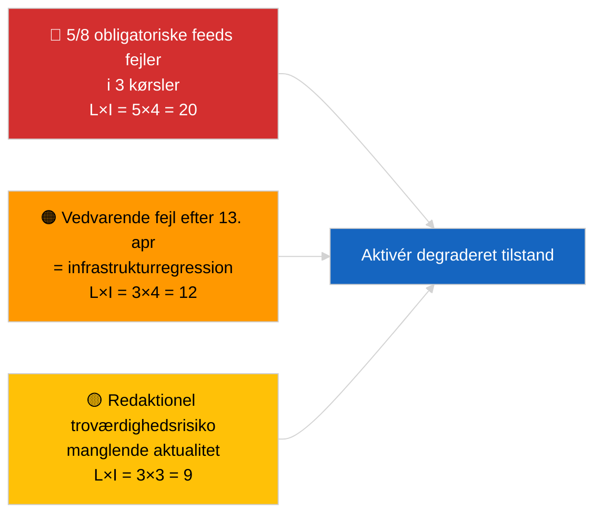

<!-- SPDX-FileCopyrightText: 2026 Hack23 AB -->
<!-- SPDX-License-Identifier: Apache-2.0 -->

# Ledelsesorientering — Aktuelt (API-driftssikkerhed) | 2026-04-03

**Klassificering:** OSINT | Offentlig parlamentarisk registrering
**Tillid:** 🟢 Høj (systematisk tre-kørs-undersøgelse, 12 slutpunkter + 4 analytiske værktøjer)
**Genereret:** 2026-04-03T00:00:00Z (retrospektiv orientering)
**Artikeltype:** Aktuelt — Vurdering af EP API-driftssikkerhed
**Kilde:** Europa-Parlamentets åbne dataportal

---

## 🎯 BLUF

**EP's dataportals feed-API er i DEGRADERET tilstand — 5 af 8 obligatoriske feeds fejler i tre uafhængige kørsler (06:00, 12:15, 18:15 UTC).** `get_events_feed`, `get_procedures_feed`, `get_documents_feed`, `get_plenary_documents_feed`, `get_committee_documents_feed`, `get_parliamentary_questions_feed` returnerer alle 404 eller timeout på tidshorisonterne `today` og `one-week`. Driftsikre slutpunkter: `get_meps_feed` (737/737) og analytiske værktøjer (`detect_voting_anomalies`, `analyze_coalition_dynamics`, `generate_political_landscape`, `early_warning_system`). `get_adopted_texts_feed` returnerer deldata (ca. 80–100 poster via one-week-fallback). Fejlmønsteret er korreleret med påskepausen, hvilket tyder på vedligeholdelse eller sæsonbestemt kø-degradering opstrøms. **🟢 HØJ tillid** til at degraderingen er reel og vedvarende (n=3 kørsler); **🟡 MEDIUM tillid** til grundårsag (vedligeholdelse under pause vs. infrastrukturregression).

---

## 🧭 3 Beslutninger Dette Underlag Understøtter

| # | Beslutning | Beslutningstager | Frist | Evidens |
|:-:|------------|------------------|:-----:|---------|
| 1 | **Operationelt:** aktivér DEGRADERET datatilstand i pipeline (`PREFETCH_DATA_MODE=degraded-feeds`) til genoprettelse | Data pipeline-ansvarlig | +12t | 5/8 obligatoriske feeds fejler |
| 2 | **Redaktionelt:** PUBLICÉR denne vurdering som transparensnote; markér downstream-artikler med "data-mode: degraded" | Redaktør | +24t | Signal om offentlig tillid |
| 3 | **Fremadrettet overvågning:** daglig slutpunkts-probe gennem påskepausen (frem til 13. april) | Analytiker | dagligt | Verificér genoprettelse |

---

## 📰 60-Sekunders Læsning

- 🔴 **5/8 obligatoriske feeds FEJLEDE i alle tre kørsler** — `get_events_feed`, `get_procedures_feed`, `get_documents_feed`, `get_plenary_documents_feed`, `get_committee_documents_feed`, `get_parliamentary_questions_feed`. (🟢 Høj)
- 🟠 **Feed for vedtagne tekster DELVIST** — JSON-fejl på `today`; one-week-fallback returnerer ca. 80–100 poster. (🟢 Høj)
- 🟢 **MEP-feed og analytiske værktøjer DRIFTSIKRE** — `get_meps_feed` returnerer 737/737 i alle kørsler; koalitions-/landskab-/anomali-/tidlig-advarsel-værktøjer returnerer alle data. (🟢 Høj)
- 🟡 **Korrelation med påskepausen** — fejlmønsteret starter umiddelbart efter Bruxelles-sessionen 26. marts; vedligeholdelseshypotesen under pause foretrækkes. (🟡 Medium)
- 🔵 **Operationel implikation:** breaking-news-pipeline skal falde tilbage til vedtagne-tekster + MEP + analytiske værktøjer; afvejning af aktualitet mod fuldstændighed. (🟢 Høj)
- 🟣 **Krydshenvising:** søskenpakke 2026-04-03/breaking dokumenterer den koalitionsbaseline som køringens analytiske værktøjer stadig producerer. (🟢 Høj)
- 🩷 **Forstyrrelsesfaktor:** vedvarende 404-fejl efter 13. april ville indikere infrastrukturregression frem for vedligeholdelse og udløse eskalering til EP-EDP teknisk kontakt. (🟢 Høj)
- ⚪ **Fremadrettet:** tilføj `prefetch-status.json`-tilstandssporing og degraderet-feed-akkommodationsfaktor (0,80) til valideringspipelinen.

---

## 🗂️ Slutpunktsstatusøjebliksbillede

| Slutpunkt | Status | Tillid | Bemærkninger |
|-----------|:------:|:------:|-------------|
| `get_meps_feed` | 🟢 DRIFTSIKKER | 🟢 HØJ | 737/737 i 3 kørsler |
| `get_adopted_texts_feed` | 🟡 DELVIS | 🟢 HØJ | One-week-fallback ca. 80–100 poster |
| `get_events_feed` | 🔴 FEJLET | 🟢 HØJ | 404 today + one-week |
| `get_procedures_feed` | 🔴 FEJLET | 🟢 HØJ | 404 today + one-week |
| `get_documents_feed` | 🔴 FEJLET | 🟢 HØJ | Timeout one-week |
| `get_plenary_documents_feed` | 🔴 FEJLET | 🟢 HØJ | Timeout one-week |
| `get_committee_documents_feed` | 🔴 FEJLET | 🟢 HØJ | Timeout one-week |
| `get_parliamentary_questions_feed` | 🔴 FEJLET | 🟢 HØJ | Timeout one-week |
| `detect_voting_anomalies` | 🟢 DRIFTSIKKER | 🟢 HØJ | — |
| `analyze_coalition_dynamics` | 🟢 DRIFTSIKKER | 🟢 HØJ | Én kørsel timeout, 2 OK |
| `generate_political_landscape` | 🟢 DRIFTSIKKER | 🟢 HØJ | — |
| `early_warning_system` | 🟢 DRIFTSIKKER | 🟢 HØJ | — |

---

## ⚠️ Risiko- og Trusselsøversigt

| Risiko | S | K | Score | Udløser | Kilde | Admiralitet |
|--------|:-:|:-:|:-----:|---------|-------|:-----------:|
| Feed-API DEGRADERET | 5 | 4 | 20 | n=3 bekræftelse | Denne kørsel | A1 |
| Vedvarende efter pause | 3 | 4 | 12 | 404-fejl efter 13. april | Daglig probe | A2 |
| Redaktionel troværdighed | 3 | 3 | 9 | Forældet data i publiceret artikel | Pipelinestatus | B2 |
| Datafejlklassificering | 2 | 3 | 6 | Validator godkender degraderet som komplet | Validatorkonfiguration | B3 |

---

## 🔮 Vigtigste Fremtidige Trigger

**Daglig slutpunkts-probe frem til 13. april 2026 (påskepausens afslutning).** Hvis det fejlende feed-cluster ikke er genoprettet den 14. april 2026 (første hverdag efter påske), eskalér til infrastrukturregression-hypotesen og kontakt EP EDP teknisk drift via den etablerede kanal.

---

## 🛡️ Vurdering af Kildekvalitet

- **Primærkilder:** Tre systematiske testkørsler kl. 06:00, 12:15, 18:15 UTC; 12 slutpunkter + 4 analytiske værktøjer.
- **Tillid til DEGRADERET-funundet:** 🟢 HØJ (n=3 i løbet af dagen; deterministisk fejlmønster).
- **Tillid til grundårsag:** 🟡 MEDIUM (pausen-korrelation er suggestiv, men ikke konklusive).

---

## 📎 Links

| Link | Sti |
|------|-----|
| Artikel | `./article.md` |
| Søskenkørsler | `analysis/daily/2026-04-03/breaking/` (koalition), `breaking-3/` (antikorruption) |
| Manifest | `./manifest.json` |
| Forudgående signal | `analysis/daily/2026-04-01/breaking/` (første 6/8 404-observation) |

---

## 🔄 Krydshenvising

**Forudgående signaler:** 2026-04-01/breaking og 2026-04-02/breaking noterede begge feed-API 404-fejl uden formel tre-kørs-probe. Denne kørsel formaliserer og kvantificerer mønsteret.

**Efterfølgende verificering:** Daglige prober 4.–5. april 2026 afgør om degraderingen vedvarer eller løser sig med pausens afslutning.

---

**Dokumentkontrol**
- **Skabelon:** `/analysis/templates/executive-brief.md`
- **Artefaktsti:** `analysis/daily/2026-04-03/breaking-2/executive-brief.md`
- **Klassificering:** Offentlig
- **Retrospektiv generering:** Backfill-session.
