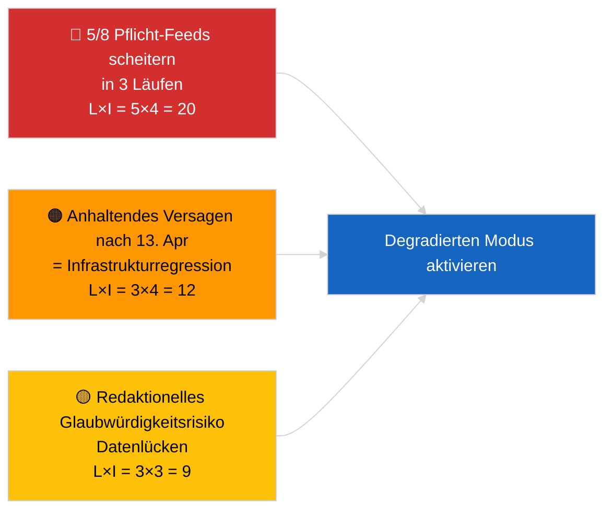

<!-- SPDX-FileCopyrightText: 2026 Hack23 AB -->
<!-- SPDX-License-Identifier: Apache-2.0 -->

# Führungskurzdarstellung — Aktuelles (API-Betriebssicherheit) | 2026-04-03

**Klassifizierung:** OSINT | Öffentlicher parlamentarischer Datensatz
**Verlässlichkeitsgrad:** 🟢 Hoch (systematische Drei-Lauf-Untersuchung, 12 Endpunkte + 4 Analysetools)
**Erstellt:** 2026-04-03T00:00:00Z (retrospektive Darstellung)
**Artikeltyp:** Aktuelles — Bewertung der EP API-Betriebssicherheit
**Quelle:** Offenes Datenportal des Europäischen Parlaments

---

## 🎯 BLUF

**Die Feed-API des EP-Datenportals befindet sich im DEGRADIERTEN Zustand — 5 von 8 Pflicht-Feeds scheitern in drei unabhängigen Läufen (06:00, 12:15, 18:15 UTC).** `get_events_feed`, `get_procedures_feed`, `get_documents_feed`, `get_plenary_documents_feed`, `get_committee_documents_feed`, `get_parliamentary_questions_feed` liefern alle 404-Fehler oder Timeouts bei den Zeithorizonten `today` und `one-week`. Funktionierende Endpunkte: `get_meps_feed` (737/737) und Analysetools (`detect_voting_anomalies`, `analyze_coalition_dynamics`, `generate_political_landscape`, `early_warning_system`). `get_adopted_texts_feed` liefert Teildaten (ca. 80–100 Einträge via one-week-Fallback). Das Fehlermuster korreliert mit der Osterpause, was auf Wartungsarbeiten oder saisonale Warteschlangendegradierung auf vorgelagerten Servern hindeutet. **🟢 HOHER Verlässlichkeitsgrad**, dass die Degradierung real und anhaltend ist (n=3 Läufe); **🟡 MITTLERER Verlässlichkeitsgrad** bezüglich der Grundursache (Wartung während der Pause vs. Infrastrukturregression).

---

## 🧭 3 Entscheidungen, Die Dieses Dokument Unterstützt

| # | Entscheidung | Entscheidungsträger | Frist | Evidenz |
|:-:|--------------|---------------------|:-----:|---------|
| 1 | **Operativ:** DEGRADIERTEN Datenmodus in der Pipeline aktivieren (`PREFETCH_DATA_MODE=degraded-feeds`) bis zur Wiederherstellung | Data-Pipeline-Verantwortlicher | +12h | 5/8 Pflicht-Feeds scheitern |
| 2 | **Redaktionell:** diese Bewertung als Transparenzhinweis VERÖFFENTLICHEN; nachgelagerte Artikel mit „data-mode: degraded" kennzeichnen | Redakteur | +24h | Signal für öffentliches Vertrauen |
| 3 | **Vorausblickend:** tägliche Endpunktprobe während der Osterpause (bis 13. April) | Analytiker | täglich | Wiederherstellung bestätigen |

---

## 📰 60-Sekunden-Lektüre

- 🔴 **5/8 Pflicht-Feeds GESCHEITERT in allen drei Läufen** — `get_events_feed`, `get_procedures_feed`, `get_documents_feed`, `get_plenary_documents_feed`, `get_committee_documents_feed`, `get_parliamentary_questions_feed`. (🟢 Hoch)
- 🟠 **Angenommene-Texte-Feed TEILWEISE** — JSON-Fehler bei `today`; one-week-Fallback liefert ca. 80–100 Einträge. (🟢 Hoch)
- 🟢 **MEP-Feed und Analysetools BETRIEBSBEREIT** — `get_meps_feed` liefert 737/737 in allen Läufen; Koalitions-/Landschafts-/Anomalie-/Frühwarn-Tools liefern alle Daten. (🟢 Hoch)
- 🟡 **Korrelation mit der Osterpause** — Fehlermuster beginnt unmittelbar nach der Brüssel-Sitzung vom 26. März; Wartungshypothese während der Pause wird bevorzugt. (🟡 Mittel)
- 🔵 **Operative Implikation:** Breaking-News-Pipeline muss auf angenommene-Texte + MEP + Analysetools zurückfallen; Abwägung zwischen Aktualität und Vollständigkeit. (🟢 Hoch)
- 🟣 **Querverweise:** Schwesterpaket 2026-04-03/breaking dokumentiert die Koalitions-Baseline, die die Analysetools dieses Laufs weiterhin produzieren. (🟢 Hoch)
- 🩷 **Störungsvektor:** anhaltende 404-Fehler nach dem 13. April würden auf Infrastrukturregression statt Wartung hindeuten und eine Eskalation an den EP-EDP-Technikkontakt auslösen. (🟢 Hoch)
- ⚪ **Weitergeleitet:** `prefetch-status.json`-Zustandsverfolgung und degradierter-Feed-Anpassungsfaktor (0,80) in die Validierungspipeline aufnehmen.

---

## 🗂️ Endpunktstatus-Schnappschuss

| Endpunkt | Status | Verlässlichkeit | Bemerkungen |
|----------|:------:|:---------------:|------------|
| `get_meps_feed` | 🟢 BETRIEBSBEREIT | 🟢 HOCH | 737/737 in 3 Läufen |
| `get_adopted_texts_feed` | 🟡 TEILWEISE | 🟢 HOCH | One-week-Fallback ca. 80–100 |
| `get_events_feed` | 🔴 GESCHEITERT | 🟢 HOCH | 404 today + one-week |
| `get_procedures_feed` | 🔴 GESCHEITERT | 🟢 HOCH | 404 today + one-week |
| `get_documents_feed` | 🔴 GESCHEITERT | 🟢 HOCH | Timeout one-week |
| `get_plenary_documents_feed` | 🔴 GESCHEITERT | 🟢 HOCH | Timeout one-week |
| `get_committee_documents_feed` | 🔴 GESCHEITERT | 🟢 HOCH | Timeout one-week |
| `get_parliamentary_questions_feed` | 🔴 GESCHEITERT | 🟢 HOCH | Timeout one-week |
| `detect_voting_anomalies` | 🟢 BETRIEBSBEREIT | 🟢 HOCH | — |
| `analyze_coalition_dynamics` | 🟢 BETRIEBSBEREIT | 🟢 HOCH | Ein Lauf Timeout, 2 OK |
| `generate_political_landscape` | 🟢 BETRIEBSBEREIT | 🟢 HOCH | — |
| `early_warning_system` | 🟢 BETRIEBSBEREIT | 🟢 HOCH | — |

---

## ⚠️ Risiko- und Bedrohungsüberblick

| Risiko | E | A | Punkte | Auslöser | Quelle | Admiralität |
|--------|:-:|:-:|:------:|----------|--------|:-----------:|
| Feed-API DEGRADIERT | 5 | 4 | 20 | n=3 Bestätigung | Dieser Lauf | A1 |
| Anhaltend nach Pause | 3 | 4 | 12 | 404-Fehler nach 13. April | Tägliche Probe | A2 |
| Redaktionelle Glaubwürdigkeit | 3 | 3 | 9 | Veraltete Daten im veröffentlichten Artikel | Pipeline-Status | B2 |
| Datenmodus-Fehlklassifizierung | 2 | 3 | 6 | Validator akzeptiert degradiert als vollständig | Validatorkonfiguration | B3 |

---

## 🔮 Wichtigster Zukünftiger Auslöser

**Tägliche Endpunktprobe bis 13. April 2026 (Ende der Osterpause).** Falls das scheiternde Feed-Cluster am 14. April 2026 (erster Werktag nach Ostern) nicht wiederhergestellt ist, auf die Infrastrukturregression-Hypothese eskalieren und das EP-EDP-Technikteam über den etablierten Kanal kontaktieren.

---

## 🛡️ Bewertung der Quellqualität

- **Primärquellen:** Drei systematische Testläufe um 06:00, 12:15, 18:15 UTC; 12 Endpunkte + 4 Analysetools.
- **Verlässlichkeitsgrad für DEGRADIERT-Befund:** 🟢 HOCH (n=3 über den Tag; deterministisches Fehlermuster).
- **Verlässlichkeitsgrad für Grundursache:** 🟡 MITTEL (Pausenkorrelation ist suggestiv, aber nicht schlüssig).

---

## 📎 Links

| Link | Pfad |
|------|------|
| Artikel | `./article.md` |
| Schwester-Läufe | `analysis/daily/2026-04-03/breaking/` (Koalition), `breaking-3/` (Antikorruption) |
| Manifest | `./manifest.json` |
| Vorheriges Signal | `analysis/daily/2026-04-01/breaking/` (erste 6/8 404-Beobachtung) |

---

## 🔄 Querverweis

**Vorherige Signale:** 2026-04-01/breaking und 2026-04-02/breaking notierten beide Feed-API-404-Fehler ohne formale Drei-Lauf-Probe. Dieser Lauf formalisiert und quantifiziert das Muster.

**Nachträgliche Verifizierung:** Tägliche Proben am 4.–5. April 2026 bestimmen, ob die Degradierung anhält oder sich mit dem Ende der Pause auflöst.

---

**Dokumentkontrolle**
- **Vorlage:** `/analysis/templates/executive-brief.md`
- **Artefaktpfad:** `analysis/daily/2026-04-03/breaking-2/executive-brief.md`
- **Klassifizierung:** Öffentlich
- **Retrospektive Erstellung:** Backfill-Sitzung.
