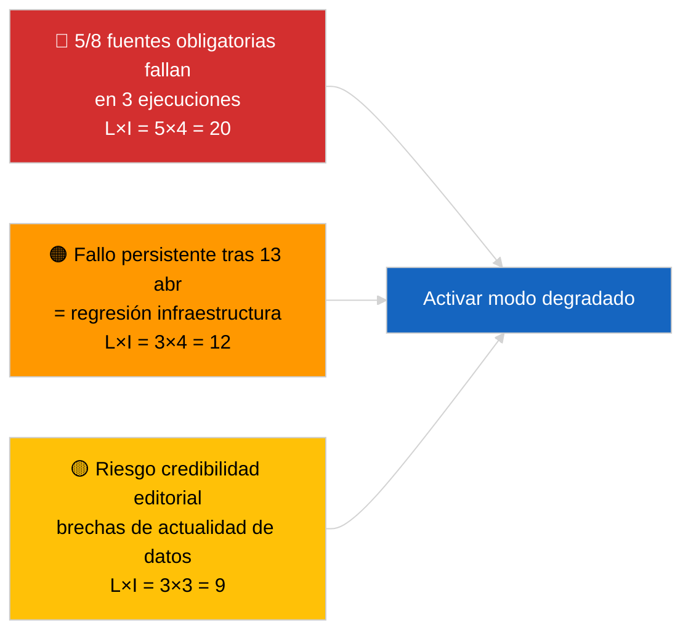

<!-- SPDX-FileCopyrightText: 2026 Hack23 AB -->
<!-- SPDX-License-Identifier: Apache-2.0 -->

# Resumen Ejecutivo — Actualidad (Fiabilidad de la API) | 2026-04-03

**Clasificación:** OSINT | Registro parlamentario público
**Fiabilidad:** 🟢 Alta (sondeo sistemático de tres ejecuciones, 12 puntos finales + 4 herramientas analíticas)
**Generado:** 2026-04-03T00:00:00Z (resumen retrospectivo)
**Tipo de artículo:** Actualidad — Evaluación de la fiabilidad de la API del PE
**Fuente:** Portal de datos abiertos del Parlamento Europeo

---

## 🎯 BLUF

**La API de fuentes del portal de datos del PE se encuentra en estado DEGRADADO — 5 de 8 fuentes obligatorias fallan en tres ejecuciones independientes (06:00, 12:15, 18:15 UTC).** `get_events_feed`, `get_procedures_feed`, `get_documents_feed`, `get_plenary_documents_feed`, `get_committee_documents_feed`, `get_parliamentary_questions_feed` devuelven todos errores 404 o tiempo de espera en los horizontes temporales `today` y `one-week`. Puntos finales operativos: `get_meps_feed` (737/737) y herramientas analíticas (`detect_voting_anomalies`, `analyze_coalition_dynamics`, `generate_political_landscape`, `early_warning_system`). `get_adopted_texts_feed` devuelve datos parciales (~80–100 elementos mediante el fallback de una semana). El patrón de fallos está correlacionado con la pausa de Semana Santa, lo que sugiere mantenimiento o degradación estacional de la cola de espera en los servidores superiores. **🟢 ALTA fiabilidad** de que la degradación es real y persistente (n=3 ejecuciones); **🟡 FIABILIDAD MEDIA** sobre la causa raíz (mantenimiento durante la pausa vs. regresión de infraestructura).

---

## 🧭 3 Decisiones Que Sustenta Este Documento

| # | Decisión | Responsable | Plazo | Evidencia |
|:-:|----------|-------------|:-----:|-----------|
| 1 | **Operativo:** activar el modo datos DEGRADADO en el pipeline (`PREFETCH_DATA_MODE=degraded-feeds`) hasta la restauración | Responsable del pipeline de datos | +12h | 5/8 fuentes obligatorias fallan |
| 2 | **Editorial:** PUBLICAR esta evaluación como nota de transparencia; etiquetar los artículos posteriores con «data-mode: degraded» | Editor | +24h | Señal de confianza pública |
| 3 | **Vigilancia prospectiva:** sondeo diario de puntos finales durante la pausa de Semana Santa (hasta el 13 de abril) | Analista | diario | Verificar la restauración |

---

## 📰 Lectura en 60 Segundos

- 🔴 **5/8 fuentes obligatorias FALLARON en las tres ejecuciones** — `get_events_feed`, `get_procedures_feed`, `get_documents_feed`, `get_plenary_documents_feed`, `get_committee_documents_feed`, `get_parliamentary_questions_feed`. (🟢 Alta)
- 🟠 **Fuente de textos adoptados PARCIAL** — error JSON en `today`; el fallback de una semana devuelve ~80–100 elementos. (🟢 Alta)
- 🟢 **Fuente de eurodiputados y herramientas analíticas OPERATIVAS** — `get_meps_feed` devuelve 737/737 en todas las ejecuciones; herramientas de coalición/paisaje/anomalía/alerta temprana devuelven todos los datos. (🟢 Alta)
- 🟡 **Correlación con la pausa de Semana Santa** — el patrón de fallos comienza inmediatamente después de la sesión de Bruselas del 26 de marzo; se prefiere la hipótesis de mantenimiento durante la pausa. (🟡 Media)
- 🔵 **Implicación operativa:** el pipeline de noticias urgentes debe recurrir a textos-adoptados + eurodiputados + herramientas analíticas; equilibrio entre actualidad y exhaustividad. (🟢 Alta)
- 🟣 **Referencia cruzada:** el paquete hermano 2026-04-03/breaking documenta la línea base de coalición que las herramientas analíticas de esta ejecución siguen produciendo. (🟢 Alta)
- 🩷 **Vector de perturbación:** errores 404 persistentes después del 13 de abril indicarían regresión de infraestructura más que mantenimiento, activando la escalada al contacto técnico EP-EDP. (🟢 Alta)
- ⚪ **Trasladado:** añadir el seguimiento de estado `prefetch-status.json` y el factor de acomodación de fuentes degradadas (0,80) al pipeline de validación.

---

## 🗂️ Instantánea del Estado de los Puntos Finales

| Punto Final | Estado | Fiabilidad | Notas |
|-------------|:------:|:----------:|-------|
| `get_meps_feed` | 🟢 OPERATIVO | 🟢 ALTA | 737/737 en 3 ejecuciones |
| `get_adopted_texts_feed` | 🟡 PARCIAL | 🟢 ALTA | Fallback una semana ~80–100 |
| `get_events_feed` | 🔴 FALLIDO | 🟢 ALTA | 404 today + one-week |
| `get_procedures_feed` | 🔴 FALLIDO | 🟢 ALTA | 404 today + one-week |
| `get_documents_feed` | 🔴 FALLIDO | 🟢 ALTA | Timeout one-week |
| `get_plenary_documents_feed` | 🔴 FALLIDO | 🟢 ALTA | Timeout one-week |
| `get_committee_documents_feed` | 🔴 FALLIDO | 🟢 ALTA | Timeout one-week |
| `get_parliamentary_questions_feed` | 🔴 FALLIDO | 🟢 ALTA | Timeout one-week |
| `detect_voting_anomalies` | 🟢 OPERATIVO | 🟢 ALTA | — |
| `analyze_coalition_dynamics` | 🟢 OPERATIVO | 🟢 ALTA | Un timeout, 2 OK |
| `generate_political_landscape` | 🟢 OPERATIVO | 🟢 ALTA | — |
| `early_warning_system` | 🟢 OPERATIVO | 🟢 ALTA | — |

---

## ⚠️ Panorama de Riesgos y Amenazas

| Riesgo | V | I | Puntuación | Activador | Fuente | Almirantazgo |
|--------|:-:|:-:|:----------:|-----------|--------|:------------:|
| API fuentes DEGRADADA | 5 | 4 | 20 | n=3 confirmación | Esta ejecución | A1 |
| Persistencia tras pausa | 3 | 4 | 12 | 404 después del 13 de abril | Sondeo diario | A2 |
| Credibilidad editorial | 3 | 3 | 9 | Datos obsoletos en artículo publicado | Estado pipeline | B2 |
| Clasificación incorrecta del modo | 2 | 3 | 6 | Validador acepta degradado como completo | Config. validador | B3 |

---

## 🔮 Principal Activador Futuro

**Sondeo diario de puntos finales hasta el 13 de abril de 2026 (fin de la pausa de Semana Santa).** Si el cluster de fuentes fallidas no se ha restaurado el 14 de abril de 2026 (primer día laborable tras la Semana Santa), escalar a la hipótesis de regresión de infraestructura y contactar al equipo técnico EP EDP a través del canal establecido.

---

## 🛡️ Evaluación de la Calidad de las Fuentes

- **Fuentes primarias:** Tres ejecuciones de prueba sistemáticas a las 06:00, 12:15, 18:15 UTC; 12 puntos finales + 4 herramientas analíticas.
- **Fiabilidad del hallazgo DEGRADADO:** 🟢 ALTA (n=3 durante el día; patrón de fallos determinista).
- **Fiabilidad de la causa raíz:** 🟡 MEDIA (correlación con la pausa sugestiva pero no concluyente).

---

## 📎 Enlaces

| Enlace | Ruta |
|--------|------|
| Artículo | `./article.md` |
| Ejecuciones hermanas | `analysis/daily/2026-04-03/breaking/` (coalición), `breaking-3/` (anticorrupción) |
| Manifiesto | `./manifest.json` |
| Señal previa | `analysis/daily/2026-04-01/breaking/` (primera observación 6/8 404) |

---

## 🔄 Referencia Cruzada

**Señales previas:** 2026-04-01/breaking y 2026-04-02/breaking anotaron ambos errores 404 de la API de fuentes sin sondeo formal de tres ejecuciones. Esta ejecución formaliza y cuantifica el patrón.

**Verificación posterior:** Los sondeos diarios del 4 y 5 de abril de 2026 determinarán si la degradación persiste o se resuelve con el fin de la pausa.

---

**Control de Documentación**
- **Plantilla:** `/analysis/templates/executive-brief.md`
- **Ruta de artefacto:** `analysis/daily/2026-04-03/breaking-2/executive-brief.md`
- **Clasificación:** Público
- **Generación retrospectiva:** Sesión de relleno retrospectivo.
