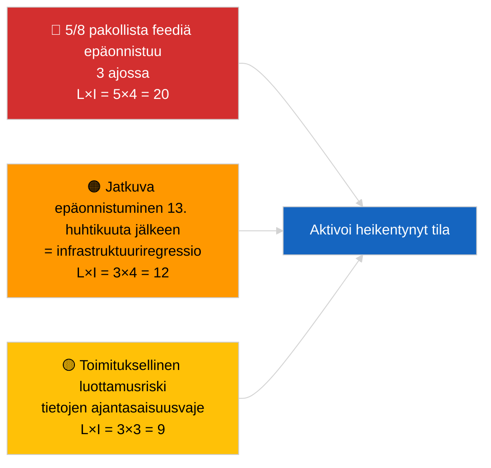

<!-- SPDX-FileCopyrightText: 2026 Hack23 AB -->
<!-- SPDX-License-Identifier: Apache-2.0 -->

# Johdon Katsaus — Ajankohtaista (API-toimintavarmuus) | 2026-04-03

**Luokitus:** OSINT | Julkinen parlamentaarinen asiakirja
**Luotettavuus:** 🟢 Korkea (järjestelmällinen kolmen ajon tutkimus, 12 päätepistettä + 4 analyyttistä työkalua)
**Luotu:** 2026-04-03T00:00:00Z (jälkikäteinen katsaus)
**Artikkelityyppi:** Ajankohtaista — EP API-toimintavarmuuden arviointi
**Lähde:** Euroopan parlamentin avoin dataporttaali

---

## 🎯 BLUF

**EP:n dataporttaalin feed-API on HEIKENTYNYT-tilassa — 5 kahdeksasta pakollisesta feedistä epäonnistuu kolmessa itsenäisessä ajossa (06:00, 12:15, 18:15 UTC).** `get_events_feed`, `get_procedures_feed`, `get_documents_feed`, `get_plenary_documents_feed`, `get_committee_documents_feed`, `get_parliamentary_questions_feed` palauttavat kaikki 404 tai aikakatkaisu `today`- ja `one-week`-aikahorisonteilla. Toimivat päätepisteet: `get_meps_feed` (737/737) ja analyyttiset työkalut (`detect_voting_anomalies`, `analyze_coalition_dynamics`, `generate_political_landscape`, `early_warning_system`). `get_adopted_texts_feed` palauttaa osittaisia tietoja (n. 80–100 kohdetta one-week-varajärjestelmällä). Virhekuvio korreloi pääsiäisloman kanssa, mikä viittaa ylläpitoon tai kausiluonteiseen jono­heikkenemiseen ylävirran palvelimilla. **🟢 KORKEA luotettavuus** siitä, että heikkeneminen on todellinen ja jatkuva (n=3 ajoa); **🟡 KESKITASO luotettavuus** juurisyyn suhteen (ylläpito loman aikana vs. infrastruktuuriregression).

---

## 🧭 3 Päätöstä, Joita Tämä Katsaus Tukee

| # | Päätös | Päätöksentekijä | Määräaika | Todiste |
|:-:|--------|-----------------|:---------:|---------|
| 1 | **Operatiivinen:** aktivoi HEIKENTYNYT-datatila pipelinessa (`PREFETCH_DATA_MODE=degraded-feeds`) kunnes palautus tapahtuu | Datapipelinevastaava | +12t | 5/8 pakollista feediä epäonnistuu |
| 2 | **Toimituksellinen:** JULKAISE tämä arviointi läpinäkyvyysilmoituksena; merkitse alavirtaartikkelit tunnuksella "data-mode: degraded" | Toimittaja | +24t | Julkisen luottamuksen signaali |
| 3 | **Eteenpäin katsova:** päivittäinen päätepisteen seuranta pääsiäisloman aikana (13. huhtikuuta asti) | Analyytikko | päivittäin | Vahvista palautus |

---

## 📰 60 Sekunnin Lukeminen

- 🔴 **5/8 pakollista feediä EPÄONNISTUI kaikissa kolmessa ajossa** — `get_events_feed`, `get_procedures_feed`, `get_documents_feed`, `get_plenary_documents_feed`, `get_committee_documents_feed`, `get_parliamentary_questions_feed`. (🟢 Korkea)
- 🟠 **Hyväksyttyjen tekstien feed OSITTAINEN** — JSON-virhe `today`-kohteessa; one-week-varajärjestelmä palauttaa n. 80–100 kohdetta. (🟢 Korkea)
- 🟢 **MEP-feed ja analyyttiset työkalut TOIMIVAT** — `get_meps_feed` palauttaa 737/737 kaikissa ajoissa; koalitio-/maisema-/anomalia-/varhainen-varoitus-työkalut palauttavat kaikki tietoja. (🟢 Korkea)
- 🟡 **Korrelaatio pääsiäisloman kanssa** — virhekuvio alkaa heti 26. maaliskuun Bryssel-istunnon jälkeen; ylläpitohypoteesi loman aikana suositaan. (🟡 Keskitaso)
- 🔵 **Operatiivinen implikaatio:** uutispipeline on turvauduttava hyväksyttyihin teksteihin + MEP + analyyttisiin työkaluihin; ajantasaisuuden ja kattavuuden välillä on tehtävä kompromissi. (🟢 Korkea)
- 🟣 **Ristiviittaus:** sisaruspaketti 2026-04-03/breaking dokumentoi koalitiolähtötason, jonka tämän ajon analyyttiset työkalut edelleen tuottavat. (🟢 Korkea)
- 🩷 **Häiriövektori:** jatkuvat 404-virheet 13. huhtikuuta jälkeen viittaisivat infrastruktuuriregressioon eikä ylläpitoon, mikä laukaisisi eskalaation EP-EDP tekniselle yhteyshenkilölle. (🟢 Korkea)
- ⚪ **Siirretty eteenpäin:** lisää `prefetch-status.json`-tilanteen seuranta ja heikentynyt-feed-mukautuskerroin (0,80) validointipipelineen.

---

## 🗂️ Päätepisteen Tilannehetki

| Päätepiste | Tila | Luotettavuus | Huomiot |
|-----------|:----:|:------------:|---------|
| `get_meps_feed` | 🟢 TOIMIVA | 🟢 KORKEA | 737/737 3 ajossa |
| `get_adopted_texts_feed` | 🟡 OSITTAINEN | 🟢 KORKEA | One-week-varajärjestelmä n. 80–100 |
| `get_events_feed` | 🔴 EPÄONNISTUI | 🟢 KORKEA | 404 today + one-week |
| `get_procedures_feed` | 🔴 EPÄONNISTUI | 🟢 KORKEA | 404 today + one-week |
| `get_documents_feed` | 🔴 EPÄONNISTUI | 🟢 KORKEA | Aikakatkaisu one-week |
| `get_plenary_documents_feed` | 🔴 EPÄONNISTUI | 🟢 KORKEA | Aikakatkaisu one-week |
| `get_committee_documents_feed` | 🔴 EPÄONNISTUI | 🟢 KORKEA | Aikakatkaisu one-week |
| `get_parliamentary_questions_feed` | 🔴 EPÄONNISTUI | 🟢 KORKEA | Aikakatkaisu one-week |
| `detect_voting_anomalies` | 🟢 TOIMIVA | 🟢 KORKEA | — |
| `analyze_coalition_dynamics` | 🟢 TOIMIVA | 🟢 KORKEA | Yksi ajo aikakatkaisu, 2 OK |
| `generate_political_landscape` | 🟢 TOIMIVA | 🟢 KORKEA | — |
| `early_warning_system` | 🟢 TOIMIVA | 🟢 KORKEA | — |

---

## ⚠️ Riski- ja Uhkakuvaus

| Riski | T | V | Pisteet | Laukaisin | Lähde | Admiraliteetti |
|-------|:-:|:-:|:-------:|-----------|-------|:--------------:|
| Feed-API HEIKENTYNYT | 5 | 4 | 20 | n=3 vahvistus | Tämä ajo | A1 |
| Jatkuva loman jälkeen | 3 | 4 | 12 | 404-virheet 13. huhtikuuta jälkeen | Päivittäinen seuranta | A2 |
| Toimituksellinen luottamus | 3 | 3 | 9 | Vanhentunut data julkaistussa artikkelissa | Pipelinetila | B2 |
| Datatilan vääräluokitus | 2 | 3 | 6 | Validaattori hyväksyy heikennetyn täydellisenä | Validaattorin asetus | B3 |

---

## 🔮 Tärkein Tuleva Laukaisin

**Päivittäinen päätepisteen seuranta 13. huhtikuuta 2026 asti (pääsiäisloman loppu).** Jos epäonnistunutta feed-klusteria ei ole palautettu 14. huhtikuuta 2026 (ensimmäinen arkipäivä pääsiäisen jälkeen), eskalaatio infrastruktuuriregressio-hypoteesiin ja yhteydenotto EP EDP tekniseen operatiiviseen tiimiin vakiintuneen kanavan kautta.

---

## 🛡️ Lähdekvaliteetin Arviointi

- **Ensisijaiset lähteet:** Kolme järjestelmällistä testiajoa klo 06:00, 12:15, 18:15 UTC; 12 päätepistettä + 4 analyyttistä työkalua.
- **Luotettavuus HEIKENTYNYT-löydölle:** 🟢 KORKEA (n=3 päivän aikana; deterministinen virhekuvio).
- **Luotettavuus juurisyylle:** 🟡 KESKITASO (lomakorrelaatio on viitteellinen, muttei ratkaiseva).

---

## 📎 Linkit

| Linkki | Polku |
|--------|-------|
| Artikkeli | `./article.md` |
| Sisarusajot | `analysis/daily/2026-04-03/breaking/` (koalitio), `breaking-3/` (antikorruptio) |
| Manifesti | `./manifest.json` |
| Edeltävä signaali | `analysis/daily/2026-04-01/breaking/` (ensimmäinen 6/8 404-havainto) |

---

## 🔄 Ristiviittaus

**Edeltävät signaalit:** 2026-04-01/breaking ja 2026-04-02/breaking molemmat merkitsivät feed-API 404-virheitä ilman muodollista kolmen ajon tutkimusta. Tämä ajo formalisoi ja kvantifioi kuvion.

**Jälkikäteinen vahvistus:** 4.–5. huhtikuuta 2026 päivittäiset seurannat määrittävät, jatkuuko heikkeneminen vai ratkeaako se loman päättyessä.

---

**Asiakirjan Hallinta**
- **Malli:** `/analysis/templates/executive-brief.md`
- **Artefaktipolku:** `analysis/daily/2026-04-03/breaking-2/executive-brief.md`
- **Luokitus:** Julkinen
- **Jälkikäteinen luonti:** Täydennetty istunto.
