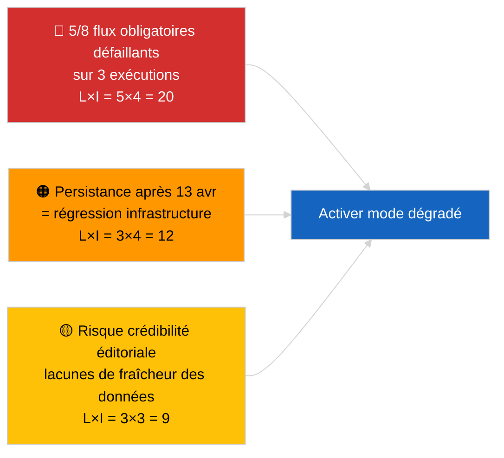

<!-- SPDX-FileCopyrightText: 2026 Hack23 AB -->
<!-- SPDX-License-Identifier: Apache-2.0 -->

# Synthèse Exécutive — Actualité (Fiabilité de l'API) | 2026-04-03

**Classification :** OSINT | Registre parlementaire public
**Fiabilité :** 🟢 Élevée (sondage systématique sur trois exécutions, 12 points de terminaison + 4 outils analytiques)
**Générée :** 2026-04-03T00:00:00Z (synthèse rétrospective)
**Type d'article :** Actualité — Évaluation de la fiabilité de l'API du PE
**Source :** Portail de données ouvertes du Parlement européen

---

## 🎯 BLUF

**L'API de flux du portail de données du PE est en état DÉGRADÉ — 5 des 8 flux obligatoires échouent dans trois exécutions indépendantes (06h00, 12h15, 18h15 UTC).** `get_events_feed`, `get_procedures_feed`, `get_documents_feed`, `get_plenary_documents_feed`, `get_committee_documents_feed`, `get_parliamentary_questions_feed` renvoient tous des erreurs 404 ou des délais d'expiration sur les horizons temporels `today` et `one-week`. Points de terminaison opérationnels : `get_meps_feed` (737/737) et outils analytiques (`detect_voting_anomalies`, `analyze_coalition_dynamics`, `generate_political_landscape`, `early_warning_system`). `get_adopted_texts_feed` retourne des données partielles (environ 80–100 éléments via le repli one-week). Le schéma d'échec est corrélé avec la pause de Pâques, suggérant une maintenance ou une dégradation saisonnière de la file d'attente en amont. **🟢 FIABILITÉ ÉLEVÉE** que la dégradation est réelle et persistante (n=3 exécutions) ; **🟡 FIABILITÉ MOYENNE** concernant la cause profonde (maintenance pendant la pause vs. régression d'infrastructure).

---

## 🧭 3 Décisions Que Ce Document Soutient

| # | Décision | Décideur | Délai | Evidence |
|:-:|----------|----------|:-----:|---------|
| 1 | **Opérationnel :** activer le mode données DÉGRADÉ dans le pipeline (`PREFETCH_DATA_MODE=degraded-feeds`) jusqu'à la restauration | Responsable pipeline données | +12h | 5/8 flux obligatoires défaillants |
| 2 | **Éditorial :** PUBLIER cette évaluation comme note de transparence ; baliser les articles en aval avec « data-mode: degraded » | Rédacteur en chef | +24h | Signal de confiance publique |
| 3 | **Surveillance prospective :** sondage quotidien des points de terminaison pendant la pause de Pâques (jusqu'au 13 avril) | Analyste | quotidien | Vérifier la restauration |

---

## 📰 Lecture en 60 Secondes

- 🔴 **5/8 flux obligatoires ONT ÉCHOUÉ dans les trois exécutions** — `get_events_feed`, `get_procedures_feed`, `get_documents_feed`, `get_plenary_documents_feed`, `get_committee_documents_feed`, `get_parliamentary_questions_feed`. (🟢 Élevée)
- 🟠 **Flux des textes adoptés PARTIEL** — erreur JSON sur `today` ; le repli one-week retourne ~80–100 éléments. (🟢 Élevée)
- 🟢 **Flux MEP et outils analytiques OPÉRATIONNELS** — `get_meps_feed` retourne 737/737 dans toutes les exécutions ; les outils coalition/paysage/anomalie/alerte précoce retournent tous des données. (🟢 Élevée)
- 🟡 **Corrélation avec la pause de Pâques** — le schéma d'échec commence immédiatement après la session de Bruxelles du 26 mars ; l'hypothèse de maintenance pendant la pause est privilégiée. (🟡 Moyenne)
- 🔵 **Implication opérationnelle :** le pipeline d'informations urgentes doit se replier sur textes-adoptés + MEP + outils analytiques ; compromis entre fraîcheur et exhaustivité. (🟢 Élevée)
- 🟣 **Référence croisée :** le paquet frère 2026-04-03/breaking documente la base de référence de coalition que les outils analytiques de cette exécution produisent encore. (🟢 Élevée)
- 🩷 **Vecteur de perturbation :** des erreurs 404 persistantes après le 13 avril indiqueraient une régression d'infrastructure plutôt qu'une maintenance, déclenchant une escalade vers le contact technique EP-EDP. (🟢 Élevée)
- ⚪ **Report :** ajouter le suivi d'état `prefetch-status.json` et le facteur d'accommodation des flux dégradés (0,80) au pipeline de validation.

---

## 🗂️ Instantané du Statut des Points de Terminaison

| Point de terminaison | Statut | Fiabilité | Notes |
|---------------------|:------:|:---------:|-------|
| `get_meps_feed` | 🟢 OPÉRATIONNEL | 🟢 ÉLEVÉE | 737/737 sur 3 exécutions |
| `get_adopted_texts_feed` | 🟡 PARTIEL | 🟢 ÉLEVÉE | Repli one-week ~80–100 |
| `get_events_feed` | 🔴 ÉCHOUÉ | 🟢 ÉLEVÉE | 404 today + one-week |
| `get_procedures_feed` | 🔴 ÉCHOUÉ | 🟢 ÉLEVÉE | 404 today + one-week |
| `get_documents_feed` | 🔴 ÉCHOUÉ | 🟢 ÉLEVÉE | Timeout one-week |
| `get_plenary_documents_feed` | 🔴 ÉCHOUÉ | 🟢 ÉLEVÉE | Timeout one-week |
| `get_committee_documents_feed` | 🔴 ÉCHOUÉ | 🟢 ÉLEVÉE | Timeout one-week |
| `get_parliamentary_questions_feed` | 🔴 ÉCHOUÉ | 🟢 ÉLEVÉE | Timeout one-week |
| `detect_voting_anomalies` | 🟢 OPÉRATIONNEL | 🟢 ÉLEVÉE | — |
| `analyze_coalition_dynamics` | 🟢 OPÉRATIONNEL | 🟢 ÉLEVÉE | Un timeout, 2 OK |
| `generate_political_landscape` | 🟢 OPÉRATIONNEL | 🟢 ÉLEVÉE | — |
| `early_warning_system` | 🟢 OPÉRATIONNEL | 🟢 ÉLEVÉE | — |

---

## ⚠️ Aperçu des Risques et Menaces

| Risque | V | I | Score | Déclencheur | Source | Amirauté |
|--------|:-:|:-:|:-----:|-------------|--------|:--------:|
| API flux DÉGRADÉE | 5 | 4 | 20 | n=3 confirmation | Cette exécution | A1 |
| Persistance après pause | 3 | 4 | 12 | 404 après 13 avril | Sondage quotidien | A2 |
| Crédibilité éditoriale | 3 | 3 | 9 | Données obsolètes dans article publié | Statut pipeline | B2 |
| Mauvaise classification du mode | 2 | 3 | 6 | Validateur accepte dégradé comme complet | Config validateur | B3 |

---

## 🔮 Principal Déclencheur Futur

**Sondage quotidien des points de terminaison jusqu'au 13 avril 2026 (fin de la pause de Pâques).** Si le cluster de flux défaillants n'est pas restauré le 14 avril 2026 (premier jour ouvrable après Pâques), escalader vers l'hypothèse de régression d'infrastructure et contacter l'équipe technique EP EDP via le canal établi.

---

## 🛡️ Évaluation de la Qualité des Sources

- **Sources primaires :** Trois exécutions de tests systématiques à 06h00, 12h15, 18h15 UTC ; 12 points de terminaison + 4 outils analytiques.
- **Fiabilité pour le constat DÉGRADÉ :** 🟢 ÉLEVÉE (n=3 sur la journée ; schéma d'échec déterministe).
- **Fiabilité pour la cause profonde :** 🟡 MOYENNE (corrélation avec la pause suggestive mais non concluante).

---

## 📎 Liens

| Lien | Chemin |
|------|--------|
| Article | `./article.md` |
| Exécutions sœurs | `analysis/daily/2026-04-03/breaking/` (coalition), `breaking-3/` (anticorruption) |
| Manifeste | `./manifest.json` |
| Signal précédent | `analysis/daily/2026-04-01/breaking/` (première observation 6/8 404) |

---

## 🔄 Référence Croisée

**Signaux précédents :** 2026-04-01/breaking et 2026-04-02/breaking ont tous deux noté des erreurs 404 de l'API de flux sans sondage formel sur trois exécutions. Cette exécution formalise et quantifie le schéma.

**Vérification ultérieure :** Les sondages quotidiens des 4 et 5 avril 2026 détermineront si la dégradation persiste ou se résout avec la fin de la pause.

---

**Contrôle Documentaire**
- **Modèle :** `/analysis/templates/executive-brief.md`
- **Chemin d'artefact :** `analysis/daily/2026-04-03/breaking-2/executive-brief.md`
- **Classification :** Public
- **Génération rétrospective :** Session de remplissage rétrospectif.
