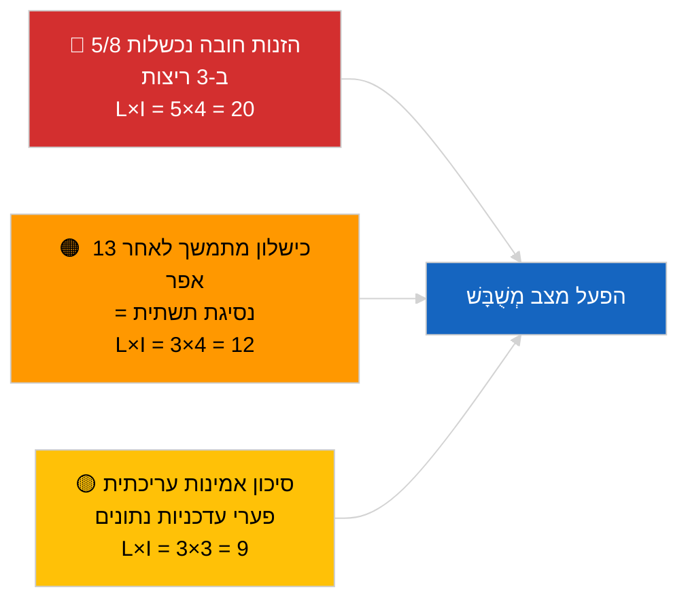

<!-- SPDX-FileCopyrightText: 2026 Hack23 AB -->
<!-- SPDX-License-Identifier: Apache-2.0 -->

# סיכום מנהלים — דחוף (אמינות ממשק ה-API) | 2026-04-03

**סיווג:** OSINT | רשומה פרלמנטרית ציבורית
**דרגת אמינות:** 🟢 גבוהה (בדיקה שיטתית בשלושה ריצות, 12 נקודות קצה + 4 כלים אנליטיים)
**נוצר:** 2026-04-03T00:00:00Z (סיכום רטרואקטיבי)
**סוג המאמר:** דחוף — הערכת אמינות ממשק ה-API של הפרלמנט האירופי
**מקור:** פורטל הנתונים הפתוח של הפרלמנט האירופי

---

## 🎯 BLUF

**ממשק ה-API של הזנות פורטל הנתונים של הפרלמנט האירופי נמצא במצב מְשֻׁבָּשׁ — 5 מתוך 8 הזנות חובה נכשלות בשלושה ריצות עצמאיות (06:00, 12:15, 18:15 UTC).** `get_events_feed`, `get_procedures_feed`, `get_documents_feed`, `get_plenary_documents_feed`, `get_committee_documents_feed`, `get_parliamentary_questions_feed` מחזירות כולן שגיאת 404 או timeout באופקי הזמן `today` ו-`one-week`. נקודות קצה תפעוליות: `get_meps_feed` (737/737) וכלים אנליטיים (`detect_voting_anomalies`, `analyze_coalition_dynamics`, `generate_political_landscape`, `early_warning_system`). `get_adopted_texts_feed` מחזירה נתונים חלקיים (כ-80–100 פריטים דרך חלופת one-week). דפוס הכשל מתאם עם חופשת הפסחא, המצביע על תחזוקה או ירידה עונתית בתור המשימות במעלה הזרם. **🟢 אמינות גבוהה** שהשיבוש אמיתי ומתמשך (n=3 ריצות); **🟡 אמינות בינונית** לגבי הגורם השורשי (תחזוקה במהלך החופשה לעומת נסיגת תשתית).

---

## 🧭 3 החלטות שמסמך זה תומך בהן

| # | החלטה | מקבל ההחלטה | מועד אחרון | ראיות |
|:-:|-------|------------|:----------:|-------|
| 1 | **תפעולי:** הפעלת מצב נתונים מְשֻׁבָּשׁ בצינור (`PREFETCH_DATA_MODE=degraded-feeds`) עד לשחזור | אחראי צינור הנתונים | +12 שעות | 5/8 הזנות חובה נכשלות |
| 2 | **עריכתי:** פרסום הערכה זו כהערת שקיפות; תיוג מאמרי המורד עם "data-mode: degraded" | עורך | +24 שעות | אות אמון ציבורי |
| 3 | **ניטור קדימה:** בדיקה יומית של נקודות קצה במהלך חופשת הפסחא (עד 13 באפריל) | אנליסט | יומי | אימות השחזור |

---

## 📰 קריאה ב-60 שניות

- 🔴 **5/8 הזנות חובה נכשלו בכל שלושת הריצות** — `get_events_feed`, `get_procedures_feed`, `get_documents_feed`, `get_plenary_documents_feed`, `get_committee_documents_feed`, `get_parliamentary_questions_feed`. (🟢 גבוהה)
- 🟠 **הזנת הטקסטים המאומצים חלקית** — שגיאת JSON ב-`today`; חלופת one-week מחזירה כ-80–100 פריטים. (🟢 גבוהה)
- 🟢 **הזנת ח"כים וכלים אנליטיים תפעוליים** — `get_meps_feed` מחזירה 737/737 בכל הריצות; כלי קואליציה/נוף/חריגות/אזהרה מוקדמת כולם מחזירים נתונים. (🟢 גבוהה)
- 🟡 **מתאם עם חופשת הפסחא** — דפוס הכשל מתחיל מיד לאחר מושב בריסל ב-26 במרץ; השערת התחזוקה בחופשה מועדפת. (🟡 בינונית)
- 🔵 **השלכה תפעולית:** צינור הידיעות הדחופות חייב ליפול בחזרה על טקסטים-מאומצים + ח"כים + כלים אנליטיים; פשרה בין עדכניות לבין מקיפות. (🟢 גבוהה)
- 🟣 **הפניה צולבת:** חבילת האח 2026-04-03/breaking מתעדת את קו הבסיס הקואליציוני שהכלים האנליטיים של ריצה זו עדיין מייצרים. (🟢 גבוהה)
- 🩷 **וקטור הפרעה:** שגיאות 404 מתמשכות לאחר 13 באפריל יצביעו על נסיגת תשתית ולא תחזוקה, ויפעילו הסלמה לאיש הקשר הטכני EP-EDP. (🟢 גבוהה)
- ⚪ **גלגול קדימה:** הוספת מעקב מצב `prefetch-status.json` ומקדם הסתגלות הזנות מְשֻׁבָּשׁוֹת (0.80) לצינור האימות.

---

## 🗂️ תמונת מצב של נקודות הקצה

| נקודת קצה | מצב | אמינות | הערות |
|-----------|:---:|:------:|-------|
| `get_meps_feed` | 🟢 תפעולי | 🟢 גבוהה | 737/737 ב-3 ריצות |
| `get_adopted_texts_feed` | 🟡 חלקי | 🟢 גבוהה | חלופת one-week ~80–100 |
| `get_events_feed` | 🔴 נכשל | 🟢 גבוהה | 404 today + one-week |
| `get_procedures_feed` | 🔴 נכשל | 🟢 גבוהה | 404 today + one-week |
| `get_documents_feed` | 🔴 נכשל | 🟢 גבוהה | Timeout one-week |
| `get_plenary_documents_feed` | 🔴 נכשל | 🟢 גבוהה | Timeout one-week |
| `get_committee_documents_feed` | 🔴 נכשל | 🟢 גבוהה | Timeout one-week |
| `get_parliamentary_questions_feed` | 🔴 נכשל | 🟢 גבוהה | Timeout one-week |
| `detect_voting_anomalies` | 🟢 תפעולי | 🟢 גבוהה | — |
| `analyze_coalition_dynamics` | 🟢 תפעולי | 🟢 גבוהה | ריצה אחת timeout, 2 תקינות |
| `generate_political_landscape` | 🟢 תפעולי | 🟢 גבוהה | — |
| `early_warning_system` | 🟢 תפעולי | 🟢 גבוהה | — |

---

## ⚠️ סקירת סיכונים ואיומים

| סיכון | הסתברות | השפעה | ציון | מפעיל | מקור | דרגת אדמירליות |
|-------|:-------:|:------:|:----:|-------|------|:--------------:|
| ממשק הזנות במצב מְשֻׁבָּשׁ | 5 | 4 | 20 | אישור n=3 | ריצה זו | A1 |
| מתמשך לאחר החופשה | 3 | 4 | 12 | שגיאות 404 לאחר 13 באפריל | בדיקה יומית | A2 |
| אמינות עריכתית | 3 | 3 | 9 | נתונים ישנים במאמר שפורסם | מצב הצינור | B2 |
| סיווג שגוי של מצב נתונים | 2 | 3 | 6 | מאמת מקבל מְשֻׁבָּשׁ כמלא | הגדרת המאמת | B3 |

---

## 🔮 המפעיל העתידי החשוב ביותר

**בדיקה יומית של נקודות קצה עד 13 באפריל 2026 (סוף חופשת הפסחא).** אם אשכול ההזנות הנכשל לא שוחזר ב-14 באפריל 2026 (יום העבודה הראשון לאחר הפסחא), יש להסלים להשערת נסיגת תשתית וליצור קשר עם צוות התפעול הטכני EP EDP דרך הערוץ הרשמי.

---

## 🛡️ הערכת איכות המקורות

- **מקורות ראשוניים:** שלוש ריצות בדיקה שיטתיות בשעות 06:00, 12:15, 18:15 UTC; 12 נקודות קצה + 4 כלים אנליטיים.
- **אמינות ממצא מצב מְשֻׁבָּשׁ:** 🟢 גבוהה (n=3 במהלך היום; דפוס כשל דטרמיניסטי).
- **אמינות הגורם השורשי:** 🟡 בינונית (מתאם החופשה מרמז אך אינו חד-משמעי).

---

## 📎 קישורים

| קישור | נתיב |
|-------|------|
| מאמר | `./article.md` |
| ריצות אח | `analysis/daily/2026-04-03/breaking/` (קואליציה), `breaking-3/` (מאבק בשחיתות) |
| מניפסט | `./manifest.json` |
| אות קודם | `analysis/daily/2026-04-01/breaking/` (תצפית 6/8 שגיאות 404 הראשונה) |

---

## 🔄 הפניה צולבת

**אותות קודמים:** 2026-04-01/breaking ו-2026-04-02/breaking שניהם תיעדו שגיאות 404 בממשק הזנות ללא בדיקה רשמית בשלוש ריצות. ריצה זו מפרמלת ומכמתת את הדפוס.

**אימות לאחר מעשה:** בדיקות יומיות ב-4–5 באפריל 2026 יקבעו האם השיבוש נמשך או מתפתר עם סוף החופשה.

---

**בקרת מסמכים**
- **תבנית:** `/analysis/templates/executive-brief.md`
- **נתיב ממצא:** `analysis/daily/2026-04-03/breaking-2/executive-brief.md`
- **סיווג:** ציבורי
- **יצירה רטרואקטיבית:** סשן מילוי לאחור.
