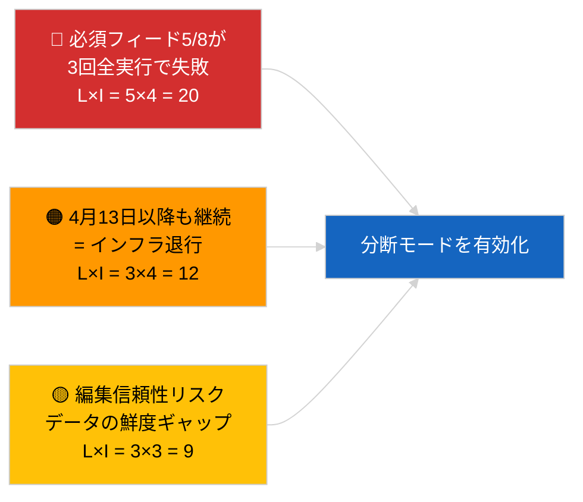

<!-- SPDX-FileCopyrightText: 2026 Hack23 AB -->
<!-- SPDX-License-Identifier: Apache-2.0 -->

# エグゼクティブブリーフ — 緊急（API信頼性） | 2026-04-03

**分類：** OSINT | 欧州議会公開記録
**信頼度：** 🟢 高（3回の独立した実行による系統的検証、12エンドポイント＋4つの分析ツール）
**作成日：** 2026-04-03T00:00:00Z（遡及要約）
**記事タイプ：** 緊急 — 欧州議会APIポータルの信頼性評価
**出典：** 欧州議会公開データポータル

---

## 🎯 BLUF

**欧州議会データポータルフィードAPIは分断状態にある — 8つの必須フィードのうち5つが3回の独立した実行（06:00、12:15、18:15 UTC）で失敗している。** `get_events_feed`、`get_procedures_feed`、`get_documents_feed`、`get_plenary_documents_feed`、`get_committee_documents_feed`、`get_parliamentary_questions_feed` はいずれも `today` および `one-week` の時間軸で404エラーまたはタイムアウトを返す。稼働中のエンドポイント：`get_meps_feed`（737/737）および分析ツール群（`detect_voting_anomalies`、`analyze_coalition_dynamics`、`generate_political_landscape`、`early_warning_system`）。`get_adopted_texts_feed` は部分的なデータを返す（one-week代替経由で約80〜100件）。障害パターンは復活祭休暇と相関しており、上流タスクキューのメンテナンスまたは季節的な縮退を示唆している。**🟢 高信頼度**：障害が実際かつ持続的であることについて（n=3実行）。**🟡 中信頼度**：根本原因（休暇メンテナンス対インフラ退行）について。

---

## 🧭 このブリーフが支援する3つの意思決定

| # | 意思決定 | 意思決定者 | 期限 | 根拠 |
|:-:|---------|-----------|:----:|------|
| 1 | **運用面：** パイプラインの分断データモードを有効化（`PREFETCH_DATA_MODE=degraded-feeds`）、復旧まで継続 | データパイプライン担当者 | ＋12時間 | 必須フィード5/8が失敗 |
| 2 | **編集面：** 本評価を透明性の注記として公開し、ダウンストリーム記事に「data-mode: degraded」タグを付与 | 編集者 | ＋24時間 | 公共信頼シグナル |
| 3 | **前向き監視：** 復活祭休暇期間中（4月13日まで）の毎日のエンドポイントヘルスチェック | アナリスト | 毎日 | 復旧の検証 |

---

## 📰 60秒解説

- 🔴 **必須フィード5/8が3回全ての実行で失敗** — `get_events_feed`、`get_procedures_feed`、`get_documents_feed`、`get_plenary_documents_feed`、`get_committee_documents_feed`、`get_parliamentary_questions_feed`。（🟢 高）
- 🟠 **採択テキストフィードが部分的** — `today` でJSONエラー；one-week代替で約80〜100件。（🟢 高）
- 🟢 **MEPフィードと分析ツールが稼働中** — `get_meps_feed` は3回全ての実行で737/737を返す；連立分析・政治状況・異常検知・早期警戒ツールがすべてデータを返す。（🟢 高）
- 🟡 **復活祭休暇との相関** — 障害パターンはブリュッセル会期（3月26日）直後に開始；休暇メンテナンス仮説が優先される。（🟡 中）
- 🔵 **運用上の意味合い：** ニュースパイプラインは採択テキスト＋MEP＋分析ツールへのフォールバックが必要；速報性と網羅性のトレードオフ。（🟢 高）
- 🟣 **相互参照：** 姉妹パッケージ 2026-04-03/breaking は、本実行の分析ツールが引き続き生成している連立基準を記録している。（🟢 高）
- 🩷 **障害ベクター：** 4月13日以降も持続する404エラーはインフラ退行を示し、EP-EDP技術担当への公式チャネルを通じたエスカレーションを発動させる。（🟢 高）
- ⚪ **ロールフォワード：** `prefetch-status.json` 状態追跡と分断フィード適応係数（0.80）を検証パイプラインに追加する。

---

## 🗂️ エンドポイント状態スナップショット

| エンドポイント | 状態 | 信頼度 | 備考 |
|-------------|:---:|:------:|------|
| `get_meps_feed` | 🟢 稼働中 | 🟢 高 | 3回全実行で737/737 |
| `get_adopted_texts_feed` | 🟡 部分的 | 🟢 高 | one-week代替 約80〜100件 |
| `get_events_feed` | 🔴 失敗 | 🟢 高 | today + one-week で404 |
| `get_procedures_feed` | 🔴 失敗 | 🟢 高 | today + one-week で404 |
| `get_documents_feed` | 🔴 失敗 | 🟢 高 | one-week でタイムアウト |
| `get_plenary_documents_feed` | 🔴 失敗 | 🟢 高 | one-week でタイムアウト |
| `get_committee_documents_feed` | 🔴 失敗 | 🟢 高 | one-week でタイムアウト |
| `get_parliamentary_questions_feed` | 🔴 失敗 | 🟢 高 | one-week でタイムアウト |
| `detect_voting_anomalies` | 🟢 稼働中 | 🟢 高 | — |
| `analyze_coalition_dynamics` | 🟢 稼働中 | 🟢 高 | 1回タイムアウト、2回正常 |
| `generate_political_landscape` | 🟢 稼働中 | 🟢 高 | — |
| `early_warning_system` | 🟢 稼働中 | 🟢 高 | — |

---

## ⚠️ リスク・脅威スナップショット

| リスク | 発生可能性 | 影響 | スコア | トリガー | 出典 | 提督格付け |
|-------|:---------:|:----:|:----:|--------|------|:---------:|
| フィードAPIの分断状態 | 5 | 4 | 20 | n=3確認済み | 本実行 | A1 |
| 休暇後も持続 | 3 | 4 | 12 | 4月13日以降の404エラー | 毎日ヘルスチェック | A2 |
| 編集信頼性 | 3 | 3 | 9 | 公開記事の古いデータ | パイプライン状態 | B2 |
| データ状態の誤分類 | 2 | 3 | 6 | 検証器が分断を完全と誤認 | 検証器設定 | B3 |

---

## 🔮 最重要前向きトリガー

**2026年4月13日（復活祭休暇終了）までの毎日のエンドポイントヘルスチェック。** 失敗したフィードクラスターが2026年4月14日（復活祭後最初の営業日）までに復旧しない場合、インフラ退行仮説にエスカレーションし、公式チャネルを通じてEP EDP技術運用チームに連絡する。

---

## 🛡️ ソース品質評価

- **一次情報源：** 06:00、12:15、18:15 UTC における3回の系統的ヘルスチェック実行；12エンドポイント＋4つの分析ツール。
- **分断状態確認の信頼度：** 🟢 高（日中n=3；決定論的障害パターン）。
- **根本原因の信頼度：** 🟡 中（休暇相関は示唆的だが決定的ではない）。

---

## 📎 リンク

| リンク | パス |
|-------|------|
| 記事 | `./article.md` |
| 姉妹実行 | `analysis/daily/2026-04-03/breaking/`（連立）、`breaking-3/`（汚職対策） |
| マニフェスト | `./manifest.json` |
| 先行シグナル | `analysis/daily/2026-04-01/breaking/`（最初の6/8 404エラー観測） |

---

## 🔄 相互参照

**先行シグナル：** 2026-04-01/breaking および 2026-04-02/breaking はいずれもフィードAPIの404エラーを記録していたが、3回実行による公式検証は行われていなかった。本実行はそのパターンを形式化・定量化する。

**事後確認：** 2026年4月4〜5日の毎日チェックにより、障害が継続するか休暇終了とともに解消するかが確定される。

---

**文書管理**
- **テンプレート：** `/analysis/templates/executive-brief.md`
- **成果物パス：** `analysis/daily/2026-04-03/breaking-2/executive-brief.md`
- **分類：** 公開
- **遡及作成：** バックフィルセッション。
