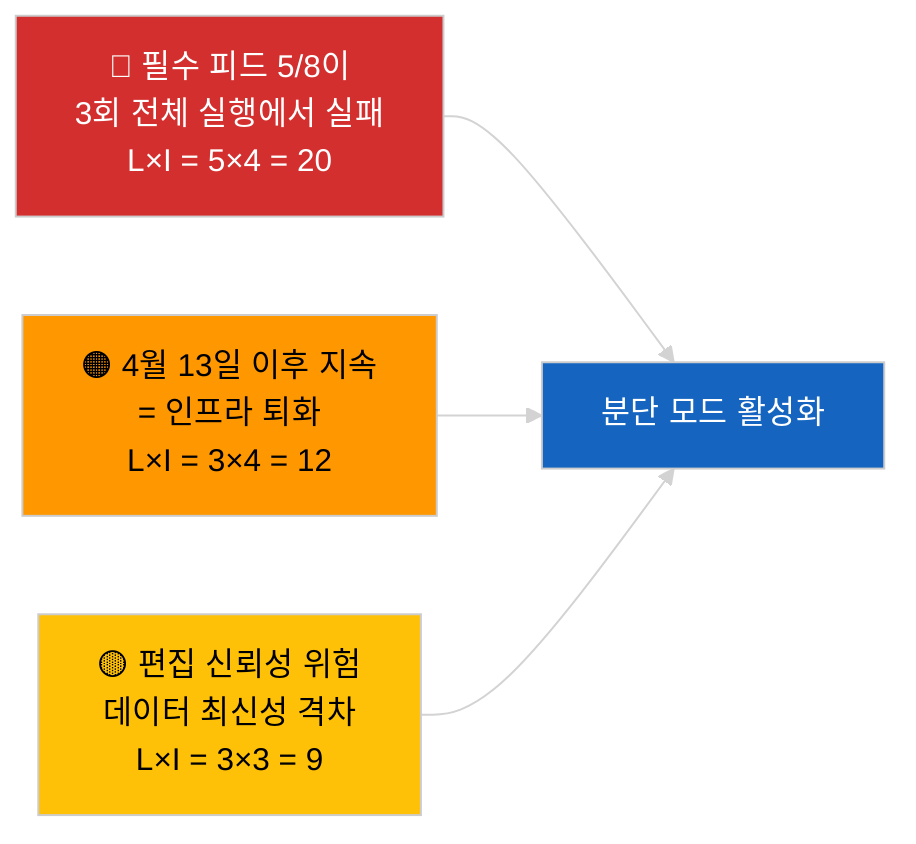

<!-- SPDX-FileCopyrightText: 2026 Hack23 AB -->
<!-- SPDX-License-Identifier: Apache-2.0 -->

# 임원 브리핑 — 긴급 (API 신뢰성) | 2026-04-03

**분류：** OSINT | 유럽의회 공개 기록
**신뢰도：** 🟢 높음 (3회 독립 실행을 통한 체계적 검증, 엔드포인트 12개＋분석 도구 4개)
**작성일：** 2026-04-03T00:00:00Z (소급 요약)
**기사 유형：** 긴급 — 유럽의회 API 포털 신뢰성 평가
**출처：** 유럽의회 공개 데이터 포털

---

## 🎯 BLUF

**유럽의회 데이터 포털 피드 API가 분단 상태에 있습니다 — 필수 피드 8개 중 5개가 3회 독립 실행(06:00, 12:15, 18:15 UTC)에서 모두 실패하고 있습니다.** `get_events_feed`, `get_procedures_feed`, `get_documents_feed`, `get_plenary_documents_feed`, `get_committee_documents_feed`, `get_parliamentary_questions_feed` 모두 `today` 및 `one-week` 시간 범위에서 404 오류 또는 타임아웃을 반환합니다. 정상 운영 중인 엔드포인트：`get_meps_feed`(737/737) 및 분석 도구(`detect_voting_anomalies`, `analyze_coalition_dynamics`, `generate_political_landscape`, `early_warning_system`). `get_adopted_texts_feed`는 부분 데이터를 반환합니다(one-week 대체 경로를 통해 약 80〜100건). 장애 패턴은 부활절 휴가와 상관관계를 보이며, 업스트림 작업 대기열의 유지보수 또는 계절적 저하를 시사합니다. **🟢 높은 신뢰도**：장애가 실재하고 지속적임(n=3 실행). **🟡 중간 신뢰도**：근본 원인(휴가 중 유지보수 대 인프라 퇴화).

---

## 🧭 이 브리핑이 지원하는 3가지 의사결정

| # | 의사결정 | 의사결정자 | 기한 | 근거 |
|:-:|---------|-----------|:----:|------|
| 1 | **운영：** 파이프라인 분단 데이터 모드 활성화(`PREFETCH_DATA_MODE=degraded-feeds`), 복구 시까지 유지 | 데이터 파이프라인 담당자 | ＋12시간 | 필수 피드 5/8 실패 |
| 2 | **편집：** 본 평가를 투명성 노트로 공개하고 다운스트림 기사에 "data-mode: degraded" 태그 부여 | 편집자 | ＋24시간 | 공공 신뢰 신호 |
| 3 | **선제적 모니터링：** 부활절 휴가 기간(4월 13일까지) 매일 엔드포인트 상태 점검 | 분석가 | 매일 | 복구 검증 |

---

## 📰 60초 브리핑

- 🔴 **필수 피드 5/8이 3회 전체 실행에서 실패** — `get_events_feed`, `get_procedures_feed`, `get_documents_feed`, `get_plenary_documents_feed`, `get_committee_documents_feed`, `get_parliamentary_questions_feed`. (🟢 높음)
- 🟠 **채택 텍스트 피드 부분적 운영** — `today`에서 JSON 오류；one-week 대체 경로로 약 80〜100건. (🟢 높음)
- 🟢 **MEP 피드 및 분석 도구 정상 운영** — `get_meps_feed`는 3회 전체 실행에서 737/737 반환；연립분석·정치 지형·이상 탐지·조기 경보 도구 모두 데이터 반환. (🟢 높음)
- 🟡 **부활절 휴가와의 상관관계** — 장애 패턴은 브뤼셀 회기(3월 26일) 직후 시작；휴가 유지보수 가설 선호. (🟡 중간)
- 🔵 **운영 함의：** 뉴스 파이프라인은 채택 텍스트＋MEP＋분석 도구로 폴백이 필요；속보성 대 포괄성 트레이드오프. (🟢 높음)
- 🟣 **교차 참조：** 자매 패키지 2026-04-03/breaking은 본 실행의 분석 도구가 계속 생성하고 있는 연립 기준을 기록합니다. (🟢 높음)
- 🩷 **장애 벡터：** 4월 13일 이후 지속되는 404 오류는 인프라 퇴화를 나타내며, 공식 채널을 통한 EP-EDP 기술 담당 에스컬레이션을 발동시킵니다. (🟢 높음)
- ⚪ **롤포워드：** `prefetch-status.json` 상태 추적 및 분단 피드 적응 계수(0.80)를 검증 파이프라인에 추가합니다.

---

## 🗂️ 엔드포인트 상태 스냅샷

| 엔드포인트 | 상태 | 신뢰도 | 비고 |
|-----------|:---:|:------:|------|
| `get_meps_feed` | 🟢 정상 | 🟢 높음 | 3회 전체 실행에서 737/737 |
| `get_adopted_texts_feed` | 🟡 부분적 | 🟢 높음 | one-week 대체 약 80〜100건 |
| `get_events_feed` | 🔴 실패 | 🟢 높음 | today + one-week에서 404 |
| `get_procedures_feed` | 🔴 실패 | 🟢 높음 | today + one-week에서 404 |
| `get_documents_feed` | 🔴 실패 | 🟢 높음 | one-week에서 타임아웃 |
| `get_plenary_documents_feed` | 🔴 실패 | 🟢 높음 | one-week에서 타임아웃 |
| `get_committee_documents_feed` | 🔴 실패 | 🟢 높음 | one-week에서 타임아웃 |
| `get_parliamentary_questions_feed` | 🔴 실패 | 🟢 높음 | one-week에서 타임아웃 |
| `detect_voting_anomalies` | 🟢 정상 | 🟢 높음 | — |
| `analyze_coalition_dynamics` | 🟢 정상 | 🟢 높음 | 1회 타임아웃, 2회 정상 |
| `generate_political_landscape` | 🟢 정상 | 🟢 높음 | — |
| `early_warning_system` | 🟢 정상 | 🟢 높음 | — |

---

## ⚠️ 위험 및 위협 스냅샷

| 위험 | 발생 가능성 | 영향 | 점수 | 트리거 | 출처 | 애드미럴티 등급 |
|-----|:----------:|:----:|:----:|--------|------|:--------------:|
| 피드 API 분단 상태 | 5 | 4 | 20 | n=3 확인 | 본 실행 | A1 |
| 휴가 이후 지속 | 3 | 4 | 12 | 4월 13일 이후 404 오류 | 매일 상태 점검 | A2 |
| 편집 신뢰성 | 3 | 3 | 9 | 공개 기사의 오래된 데이터 | 파이프라인 상태 | B2 |
| 데이터 상태 오분류 | 2 | 3 | 6 | 검증기가 분단을 완전 상태로 오인 | 검증기 설정 | B3 |

---

## 🔮 최우선 선제적 트리거

**2026년 4월 13일(부활절 휴가 종료)까지 매일 엔드포인트 상태 점검.** 실패한 피드 클러스터가 2026년 4월 14일(부활절 이후 첫 영업일)까지 복구되지 않으면 인프라 퇴화 가설로 에스컬레이션하고 공식 채널을 통해 EP EDP 기술 운영팀에 연락합니다.

---

## 🛡️ 소스 품질 평가

- **1차 출처：** 06:00, 12:15, 18:15 UTC에서의 3회 체계적 상태 점검 실행；엔드포인트 12개＋분석 도구 4개.
- **분단 상태 확인 신뢰도：** 🟢 높음(일중 n=3；결정론적 장애 패턴).
- **근본 원인 신뢰도：** 🟡 중간(휴가 상관관계는 시사적이나 결정적이지 않음).

---

## 📎 링크

| 링크 | 경로 |
|-----|------|
| 기사 | `./article.md` |
| 자매 실행 | `analysis/daily/2026-04-03/breaking/`(연립), `breaking-3/`(부패 방지) |
| 매니페스트 | `./manifest.json` |
| 선행 신호 | `analysis/daily/2026-04-01/breaking/`(최초 6/8 404 오류 관측) |

---

## 🔄 교차 참조

**선행 신호：** 2026-04-01/breaking 및 2026-04-02/breaking 모두 피드 API 404 오류를 기록했으나 3회 실행을 통한 공식 검증은 수행되지 않았습니다. 본 실행은 해당 패턴을 공식화하고 정량화합니다.

**사후 검증：** 2026년 4월 4〜5일의 매일 점검을 통해 장애가 지속되는지 또는 휴가 종료와 함께 해소되는지 확정됩니다.

---

**문서 관리**
- **템플릿：** `/analysis/templates/executive-brief.md`
- **산출물 경로：** `analysis/daily/2026-04-03/breaking-2/executive-brief.md`
- **분류：** 공개
- **소급 작성：** 백필 세션.
