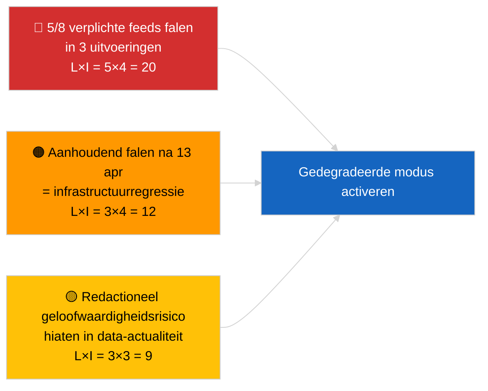

<!-- SPDX-FileCopyrightText: 2026 Hack23 AB -->
<!-- SPDX-License-Identifier: Apache-2.0 -->

# Uitvoerende Samenvatting — Actueel (API-betrouwbaarheid) | 2026-04-03

**Classificering:** OSINT | Openbaar parlementair register
**Betrouwbaarheidsgraad:** 🟢 Hoog (systematische drie-uitvoering-onderzoek, 12 eindpunten + 4 analytische tools)
**Gegenereerd:** 2026-04-03T00:00:00Z (retrospectieve samenvatting)
**Artikeltype:** Actueel — Beoordeling van EP API-betrouwbaarheid
**Bron:** Open dataportaal van het Europees Parlement

---

## 🎯 BLUF

**De feed-API van het EP-dataportaal bevindt zich in een GEDEGRADEERDE staat — 5 van 8 verplichte feeds falen in drie onafhankelijke uitvoeringen (06:00, 12:15, 18:15 UTC).** `get_events_feed`, `get_procedures_feed`, `get_documents_feed`, `get_plenary_documents_feed`, `get_committee_documents_feed`, `get_parliamentary_questions_feed` retourneren allemaal 404-fouten of time-outs op de tijdshorizonten `today` en `one-week`. Operationele eindpunten: `get_meps_feed` (737/737) en analytische tools (`detect_voting_anomalies`, `analyze_coalition_dynamics`, `generate_political_landscape`, `early_warning_system`). `get_adopted_texts_feed` retourneert gedeeltelijke gegevens (~80–100 items via de one-week-fallback). Het foutpatroon is gecorreleerd met het paasuitstel, wat wijst op onderhoud of seizoensgebonden wachtrijdegradatie stroomopwaarts. **🟢 HOGE betrouwbaarheid** dat de degradatie reëel en aanhoudend is (n=3 uitvoeringen); **🟡 GEMIDDELDE betrouwbaarheid** over de grondoorzaak (onderhoud tijdens uitstel vs. infrastructuurregressie).

---

## 🧭 3 Beslissingen Die Dit Document Ondersteunt

| # | Beslissing | Besluitvormer | Deadline | Bewijs |
|:-:|------------|--------------|:--------:|--------|
| 1 | **Operationeel:** GEDEGRADEERDE gegevensmodus activeren in de pipeline (`PREFETCH_DATA_MODE=degraded-feeds`) tot herstel | Data pipeline-verantwoordelijke | +12u | 5/8 verplichte feeds falen |
| 2 | **Redactioneel:** deze beoordeling PUBLICEREN als transparantienota; downstreamartikelen markeren met „data-mode: degraded" | Redacteur | +24u | Signaal voor publiek vertrouwen |
| 3 | **Vooruitkijkende monitoring:** dagelijkse eindpuntprobe tijdens het paasuitstel (tot 13 april) | Analist | dagelijks | Herstel verifiëren |

---

## 📰 60-Seconden Lezing

- 🔴 **5/8 verplichte feeds GEFAALD in alle drie uitvoeringen** — `get_events_feed`, `get_procedures_feed`, `get_documents_feed`, `get_plenary_documents_feed`, `get_committee_documents_feed`, `get_parliamentary_questions_feed`. (🟢 Hoog)
- 🟠 **Feed voor aangenomen teksten GEDEELTELIJK** — JSON-fout op `today`; one-week-fallback retourneert ~80–100 items. (🟢 Hoog)
- 🟢 **MEP-feed en analytische tools OPERATIONEEL** — `get_meps_feed` retourneert 737/737 in alle uitvoeringen; coalitie-/landschap-/anomalie-/vroeg-waarschuwings-tools retourneren alle gegevens. (🟢 Hoog)
- 🟡 **Correlatie met paasuitstel** — foutpatroon begint direct na de Brussel-sessie van 26 maart; onderhoudshypothese tijdens uitstel wordt geprefereerd. (🟡 Gemiddeld)
- 🔵 **Operationele implicatie:** breaking-news-pipeline moet terugvallen op aangenomen-teksten + MEP + analytische tools; afweging tussen actualiteit en volledigheid. (🟢 Hoog)
- 🟣 **Kruisverwijzing:** zusterpakket 2026-04-03/breaking documenteert de coalitiebasislijn die de analytische tools van deze uitvoering nog steeds produceren. (🟢 Hoog)
- 🩷 **Verstoringsvector:** aanhoudende 404-fouten na 13 april zouden op infrastructuurregressie wijzen in plaats van onderhoud, wat escalatie naar EP-EDP technisch contact activeert. (🟢 Hoog)
- ⚪ **Doorgestuurd:** `prefetch-status.json`-statustracking en gedegradeerde-feed-aanpassingsfactor (0,80) toevoegen aan de validatiepipeline.

---

## 🗂️ Momentopname Eindpuntstatus

| Eindpunt | Status | Betrouwbaarheid | Opmerkingen |
|----------|:------:|:---------------:|------------|
| `get_meps_feed` | 🟢 OPERATIONEEL | 🟢 HOOG | 737/737 in 3 uitvoeringen |
| `get_adopted_texts_feed` | 🟡 GEDEELTELIJK | 🟢 HOOG | One-week-fallback ~80–100 |
| `get_events_feed` | 🔴 GEFAALD | 🟢 HOOG | 404 today + one-week |
| `get_procedures_feed` | 🔴 GEFAALD | 🟢 HOOG | 404 today + one-week |
| `get_documents_feed` | 🔴 GEFAALD | 🟢 HOOG | Time-out one-week |
| `get_plenary_documents_feed` | 🔴 GEFAALD | 🟢 HOOG | Time-out one-week |
| `get_committee_documents_feed` | 🔴 GEFAALD | 🟢 HOOG | Time-out one-week |
| `get_parliamentary_questions_feed` | 🔴 GEFAALD | 🟢 HOOG | Time-out one-week |
| `detect_voting_anomalies` | 🟢 OPERATIONEEL | 🟢 HOOG | — |
| `analyze_coalition_dynamics` | 🟢 OPERATIONEEL | 🟢 HOOG | Eén time-out, 2 OK |
| `generate_political_landscape` | 🟢 OPERATIONEEL | 🟢 HOOG | — |
| `early_warning_system` | 🟢 OPERATIONEEL | 🟢 HOOG | — |

---

## ⚠️ Risico- en Dreigingsoverzicht

| Risico | K | I | Score | Trigger | Bron | Admiraals­graad |
|--------|:-:|:-:|:-----:|---------|------|:---------------:|
| Feed-API GEDEGRADEERD | 5 | 4 | 20 | n=3 bevestiging | Deze uitvoering | A1 |
| Aanhoudend na uitstel | 3 | 4 | 12 | 404-fouten na 13 april | Dagelijkse probe | A2 |
| Redactionele geloofwaardigheid | 3 | 3 | 9 | Verouderde data in gepubliceerd artikel | Pipelinestatus | B2 |
| Datamodus-misclassificatie | 2 | 3 | 6 | Validator accepteert gedegradeerd als volledig | Validatorconfiguratie | B3 |

---

## 🔮 Belangrijkste Toekomstige Trigger

**Dagelijkse eindpuntprobe tot 13 april 2026 (einde paasuitstel).** Als het falende feed-cluster op 14 april 2026 (eerste werkdag na Pasen) niet hersteld is, escaleren naar de infrastructuurregressie-hypothese en het EP EDP technisch operationeel team contacteren via het vastgestelde kanaal.

---

## 🛡️ Beoordeling van Bronkwaliteit

- **Primaire bronnen:** Drie systematische testuitvoeringen om 06:00, 12:15, 18:15 UTC; 12 eindpunten + 4 analytische tools.
- **Betrouwbaarheid voor GEDEGRADEERD-bevinding:** 🟢 HOOG (n=3 gedurende de dag; deterministisch foutpatroon).
- **Betrouwbaarheid voor grondoorzaak:** 🟡 GEMIDDELD (uitstels­correlatie is suggestief maar niet conclusief).

---

## 📎 Links

| Link | Pad |
|------|-----|
| Artikel | `./article.md` |
| Zusteruitvoeringen | `analysis/daily/2026-04-03/breaking/` (coalitie), `breaking-3/` (anticorruptie) |
| Manifest | `./manifest.json` |
| Voorgaand signaal | `analysis/daily/2026-04-01/breaking/` (eerste 6/8 404-observatie) |

---

## 🔄 Kruisverwijzing

**Voorgaande signalen:** 2026-04-01/breaking en 2026-04-02/breaking noteerden beide feed-API 404-fouten zonder formele drie-uitvoering-probe. Deze uitvoering formaliseert en kwantificeert het patroon.

**Volgende verificatie:** Dagelijkse probes op 4–5 april 2026 bepalen of de degradatie aanhoudt of oplost met het einde van het uitstel.

---

**Documentbeheer**
- **Sjabloon:** `/analysis/templates/executive-brief.md`
- **Artefactpad:** `analysis/daily/2026-04-03/breaking-2/executive-brief.md`
- **Classificering:** Openbaar
- **Retrospectieve generatie:** Backfill-sessie.
