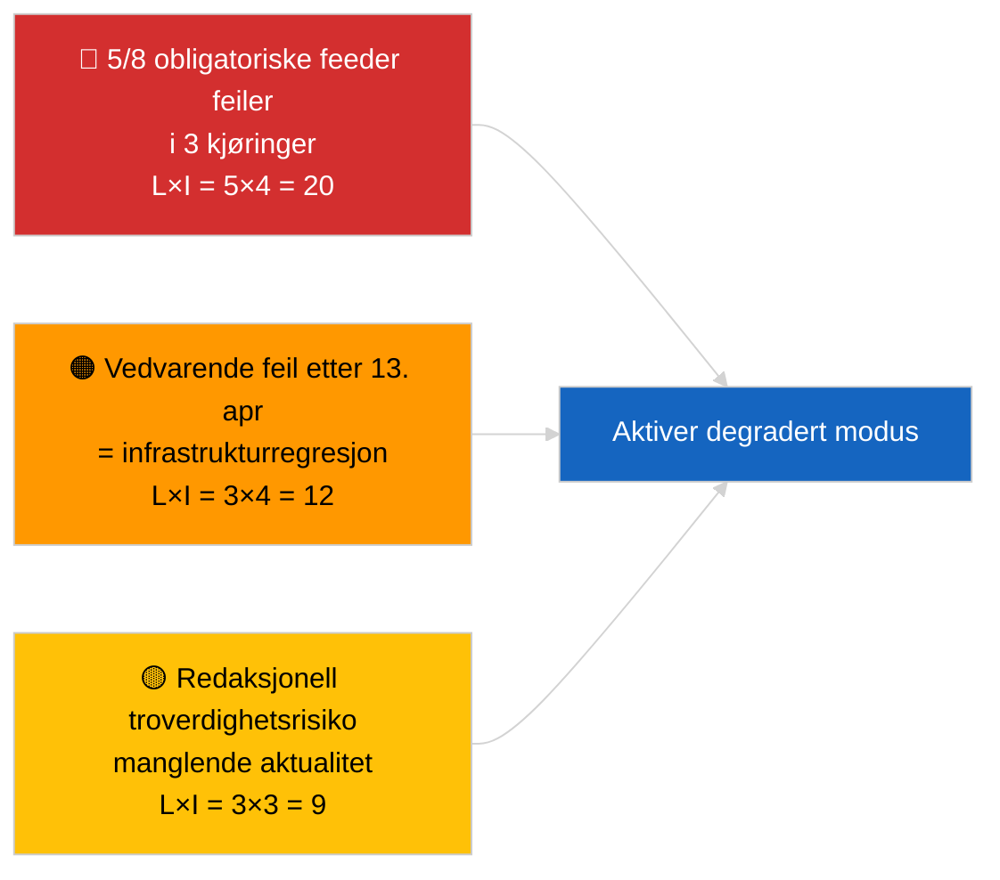

<!-- SPDX-FileCopyrightText: 2026 Hack23 AB -->
<!-- SPDX-License-Identifier: Apache-2.0 -->

# Lederoppsummering — Aktuelt (API-driftsikkerhet) | 2026-04-03

**Klassifisering:** OSINT | Offentlig parlamentarisk registrering
**Tillitsgrad:** 🟢 Høy (systematisk tre-kjørings-undersøkelse, 12 endepunkter + 4 analytiske verktøy)
**Generert:** 2026-04-03T00:00:00Z (retrospektiv oppsummering)
**Artikkeltype:** Aktuelt — Vurdering av EP API-driftsikkerhet
**Kilde:** Europaparlamentets åpne dataportal

---

## 🎯 BLUF

**EPs dataportals feed-API er i DEGRADERT tilstand — 5 av 8 obligatoriske feeder feiler i tre uavhengige kjøringer (06:00, 12:15, 18:15 UTC).** `get_events_feed`, `get_procedures_feed`, `get_documents_feed`, `get_plenary_documents_feed`, `get_committee_documents_feed`, `get_parliamentary_questions_feed` returnerer alle 404 eller timeout på tidshorisontene `today` og `one-week`. Driftsikre endepunkter: `get_meps_feed` (737/737) og analytiske verktøy (`detect_voting_anomalies`, `analyze_coalition_dynamics`, `generate_political_landscape`, `early_warning_system`). `get_adopted_texts_feed` returnerer deldata (ca. 80–100 poster via one-week-fallback). Feilmønsteret er korrelert med påskepausen, noe som tyder på vedlikehold eller sesongbestemt kødegradering oppstrøms. **🟢 HØY tillitsgrad** til at degraderingen er reell og vedvarende (n=3 kjøringer); **🟡 MIDDELS tillitsgrad** til grunnårsak (vedlikehold under pause vs. infrastrukturregresjon).

---

## 🧭 3 Beslutninger Dette Underlaget Støtter

| # | Beslutning | Beslutningstaker | Frist | Evidens |
|:-:|------------|-----------------|:-----:|---------|
| 1 | **Operasjonelt:** aktiver DEGRADERT datamodus i pipeline (`PREFETCH_DATA_MODE=degraded-feeds`) til gjenoppretting | Data pipeline-ansvarlig | +12t | 5/8 obligatoriske feeder feiler |
| 2 | **Redaksjonelt:** PUBLISER denne vurderingen som transparensnote; merk downstream-artikler med "data-mode: degraded" | Redaktør | +24t | Tillit-signal til offentligheten |
| 3 | **Fremtidsovervåkning:** daglig endepunkts-probe gjennom påskepausen (frem til 13. april) | Analytiker | daglig | Bekreft gjenoppretting |

---

## 📰 60-Sekunders Lesing

- 🔴 **5/8 obligatoriske feeder FEILET i samtlige tre kjøringer** — `get_events_feed`, `get_procedures_feed`, `get_documents_feed`, `get_plenary_documents_feed`, `get_committee_documents_feed`, `get_parliamentary_questions_feed`. (🟢 Høy)
- 🟠 **Vedtatte-tekster-feed DELVIS** — JSON-feil på `today`; one-week-fallback returnerer ca. 80–100 poster. (🟢 Høy)
- 🟢 **MEP-feed og analytiske verktøy DRIFTSIKRE** — `get_meps_feed` returnerer 737/737 i alle kjøringer; koalisjons-/landskap-/anomali-/tidlig-advarsel-verktøy returnerer alle data. (🟢 Høy)
- 🟡 **Korrelasjon med påskepausen** — feilmønsteret starter umiddelbart etter Brussel-sesjonen 26. mars; vedlikeholdshypotesen under pause foretrekkes. (🟡 Middels)
- 🔵 **Operasjonell implikasjon:** breaking-news-pipeline må falle tilbake på vedtatte-tekster + MEP + analytiske verktøy; avveining av aktualitet mot fullstendighet. (🟢 Høy)
- 🟣 **Kryssreferanse:** søskenpakke 2026-04-03/breaking dokumenterer den koalisjonsbaseline som kjøringens analytiske verktøy fortsatt produserer. (🟢 Høy)
- 🩷 **Forstyrrelsesvektor:** vedvarende 404-feil etter 13. april ville indikere infrastrukturregresjon snarere enn vedlikehold, og utløse eskalering til EP-EDP teknisk kontakt. (🟢 Høy)
- ⚪ **Videreført:** legg til `prefetch-status.json`-tilstandssporing og degradert-feed-akkommodasjonsfaktor (0,80) i valideringspipelinen.

---

## 🗂️ Endepunktsstatusøyeblikksbilde

| Endepunkt | Status | Tillitsgrad | Merknader |
|-----------|:------:|:-----------:|----------|
| `get_meps_feed` | 🟢 DRIFTSIKKER | 🟢 HØY | 737/737 i 3 kjøringer |
| `get_adopted_texts_feed` | 🟡 DELVIS | 🟢 HØY | One-week-fallback ca. 80–100 poster |
| `get_events_feed` | 🔴 FEILET | 🟢 HØY | 404 today + one-week |
| `get_procedures_feed` | 🔴 FEILET | 🟢 HØY | 404 today + one-week |
| `get_documents_feed` | 🔴 FEILET | 🟢 HØY | Timeout one-week |
| `get_plenary_documents_feed` | 🔴 FEILET | 🟢 HØY | Timeout one-week |
| `get_committee_documents_feed` | 🔴 FEILET | 🟢 HØY | Timeout one-week |
| `get_parliamentary_questions_feed` | 🔴 FEILET | 🟢 HØY | Timeout one-week |
| `detect_voting_anomalies` | 🟢 DRIFTSIKKER | 🟢 HØY | — |
| `analyze_coalition_dynamics` | 🟢 DRIFTSIKKER | 🟢 HØY | Én kjøring timeout, 2 OK |
| `generate_political_landscape` | 🟢 DRIFTSIKKER | 🟢 HØY | — |
| `early_warning_system` | 🟢 DRIFTSIKKER | 🟢 HØY | — |

---

## ⚠️ Risiko- og Trusselbilde

| Risiko | S | K | Score | Utløser | Kilde | Admiralitet |
|--------|:-:|:-:|:-----:|---------|-------|:-----------:|
| Feed-API DEGRADERT | 5 | 4 | 20 | n=3 bekreftelse | Denne kjøring | A1 |
| Vedvarende etter pause | 3 | 4 | 12 | 404-feil etter 13. april | Daglig probe | A2 |
| Redaksjonell troverdighet | 3 | 3 | 9 | Foreldet data i publisert artikkel | Pipelinestatus | B2 |
| Datafeil-klassifisering | 2 | 3 | 6 | Validator godkjenner degradert som komplett | Validatorkonfigurasjon | B3 |

---

## 🔮 Viktigste Fremtidige Trigger

**Daglig endepunkts-probe frem til 13. april 2026 (påskepausens avslutning).** Hvis det feilende feed-klynget ikke er gjenopprettet den 14. april 2026 (første arbeidsdag etter påske), eskaler til infrastrukturregresjon-hypotesen og kontakt EP EDP teknisk drift via etablert kanal.

---

## 🛡️ Vurdering av Kildekvalitet

- **Primærkilder:** Tre systematiske testkjøringer kl. 06:00, 12:15, 18:15 UTC; 12 endepunkter + 4 analytiske verktøy.
- **Tillitsgrad for DEGRADERT-funnet:** 🟢 HØY (n=3 i løpet av dagen; deterministisk feilmønster).
- **Tillitsgrad for grunnårsak:** 🟡 MIDDELS (pausekorrelasjon er suggestiv, men ikke konklusiv).

---

## 📎 Lenker

| Lenke | Sti |
|-------|-----|
| Artikkel | `./article.md` |
| Søskenkjøringer | `analysis/daily/2026-04-03/breaking/` (koalisjon), `breaking-3/` (antikorrupsjon) |
| Manifest | `./manifest.json` |
| Foregående signal | `analysis/daily/2026-04-01/breaking/` (første 6/8 404-observasjon) |

---

## 🔄 Kryssreferanse

**Foregående signaler:** 2026-04-01/breaking og 2026-04-02/breaking noterte begge feed-API 404-feil uten formell tre-kjørings-probe. Denne kjøringen formaliserer og kvantifiserer mønsteret.

**Etterfølgende verifisering:** Daglige prober 4.–5. april 2026 avgjør om degraderingen vedvarer eller løses med pausens avslutning.

---

**Dokumentkontroll**
- **Mal:** `/analysis/templates/executive-brief.md`
- **Artefaktsti:** `analysis/daily/2026-04-03/breaking-2/executive-brief.md`
- **Klassifisering:** Offentlig
- **Retrospektiv generering:** Backfill-sesjon.
