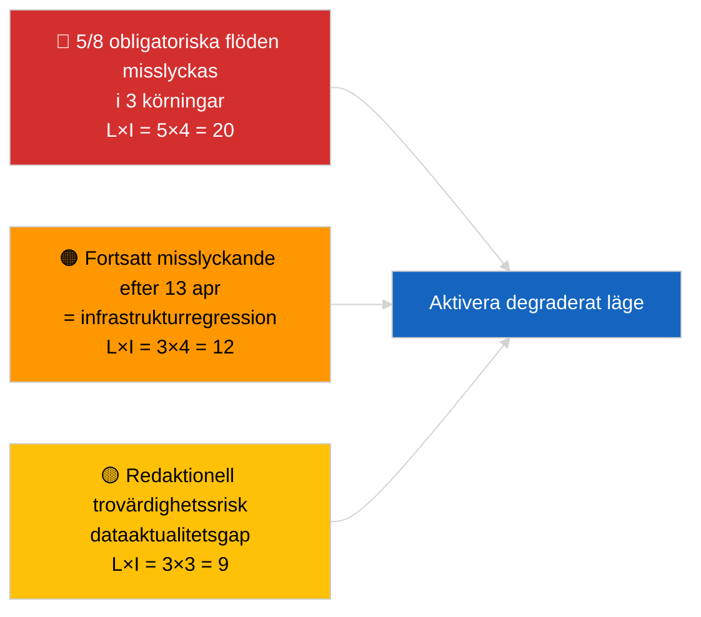

<!-- SPDX-FileCopyrightText: 2026 Hack23 AB -->
<!-- SPDX-License-Identifier: Apache-2.0 -->

# Exekutiv Sammanfattning — Aktuellt (API-driftsäkerhet) | 2026-04-03

**Klassificering:** OSINT | Offentligt parlamentariskt register
**Tillförlitlighet:** 🟢 Hög (systematisk tre-körnings-undersökning, 12 slutpunkter + 4 analytiska verktyg)
**Genererad:** 2026-04-03T00:00:00Z (retrospektiv sammanfattning)
**Artikeltyp:** Aktuellt — Bedömning av EP API-driftsäkerhet
**Källa:** Europaparlamentets öppna dataportal

---

## 🎯 BLUF

**EP:s dataportal-flödes-API befinner sig i DEGRADERAT tillstånd — 5 av 8 obligatoriska flöden misslyckas i tre oberoende körningar (06:00, 12:15, 18:15 UTC).** `get_events_feed`, `get_procedures_feed`, `get_documents_feed`, `get_plenary_documents_feed`, `get_committee_documents_feed`, `get_parliamentary_questions_feed` returnerar alla 404 eller timeout på tidshorisonterna `today` och `one-week`. Driftsatta slutpunkter: `get_meps_feed` (737/737) och analytiska verktyg (`detect_voting_anomalies`, `analyze_coalition_dynamics`, `generate_political_landscape`, `early_warning_system`). `get_adopted_texts_feed` returnerar deldata (ca 80–100 poster via one-week-fallback). Felmönstret sammanfaller med påskuppehållet, vilket tyder på underhåll eller säsongsbetonad ködegradering uppströms. **🟢 HÖG tillförlitlighet** att degraderingen är verklig och bestående (n=3 körningar); **🟡 MEDEL tillförlitlighet** beträffande grundorsak (underhåll under uppehåll kontra infrastrukturregression).

---

## 🧭 3 Beslut Detta Underlag Stöder

| # | Beslut | Beslutsfattare | Tidsfrist | Evidens |
|:-:|--------|----------------|:---------:|---------|
| 1 | **Operativt:** aktivera DEGRADERAT dataläge i pipeline (`PREFETCH_DATA_MODE=degraded-feeds`) tills återställning sker | Datapipelineansvarig | +12h | 5/8 obligatoriska flöden misslyckas |
| 2 | **Redaktionellt:** PUBLICERA denna bedömning som en transparensnot; märk nedströmsartiklar med "data-mode: degraded" | Redaktör | +24h | Förtroendesignal |
| 3 | **Framåtbevakning:** daglig slutpunkts-probe under påskuppehållet (t.o.m. 13 april) | Analytiker | dagligen | Verifiera återställning |

---

## 📰 60-Sekunders Läsning

- 🔴 **5/8 obligatoriska flöden MISSLYCKADES i samtliga tre körningar** — `get_events_feed`, `get_procedures_feed`, `get_documents_feed`, `get_plenary_documents_feed`, `get_committee_documents_feed`, `get_parliamentary_questions_feed`. (🟢 Hög)
- 🟠 **Adopterade-texter-flödet PARTIELLT** — JSON-fel på `today`; one-week-fallback returnerar ca 80–100 poster. (🟢 Hög)
- 🟢 **MEP-flödet och analytiska verktyg DRIFTSATTA** — `get_meps_feed` returnerar 737/737 i alla körningar; koalitions-/landskap-/anomali-/tidig-varning-verktyg returnerar alla data. (🟢 Hög)
- 🟡 **Samband med påskuppehållet** — felmönstret börjar omedelbart efter Bryssel-sessionen 26 mars; underhållshypotesen under uppehåll föredras. (🟡 Medel)
- 🔵 **Operativ implikation:** det aktuella nyhetspipelineläget måste falla tillbaka på antagna-texter + MEP + analytiska verktyg; avvägning aktualitet mot fullständighet. (🟢 Hög)
- 🟣 **Korsreferens:** syskonperiod 2026-04-03/breaking dokumenterar den koalitionsbaseline som körningens analytiska verktyg fortfarande producerar. (🟢 Hög)
- 🩷 **Störningsvektor:** fortsatta 404:or efter 13 april skulle indikera infrastrukturregression snarare än underhåll, vilket utlöser eskalering till EP-EDP teknisk kontakt. (🟢 Hög)
- ⚪ **Överfört framåt:** lägg till `prefetch-status.json`-lägesspårning och degraderat-flöde-ackommodationsfaktor (0,80) i valideringspipelinen.

---

## 🗂️ Slutpunktsstatusögonblicksbild

| Slutpunkt | Status | Tillförlitlighet | Noteringar |
|-----------|:------:|:----------------:|-----------|
| `get_meps_feed` | 🟢 DRIFTSATT | 🟢 HÖG | 737/737 i 3 körningar |
| `get_adopted_texts_feed` | 🟡 PARTIELL | 🟢 HÖG | One-week-fallback ca 80–100 poster |
| `get_events_feed` | 🔴 MISSLYCKAD | 🟢 HÖG | 404 today + one-week |
| `get_procedures_feed` | 🔴 MISSLYCKAD | 🟢 HÖG | 404 today + one-week |
| `get_documents_feed` | 🔴 MISSLYCKAD | 🟢 HÖG | Timeout one-week |
| `get_plenary_documents_feed` | 🔴 MISSLYCKAD | 🟢 HÖG | Timeout one-week |
| `get_committee_documents_feed` | 🔴 MISSLYCKAD | 🟢 HÖG | Timeout one-week |
| `get_parliamentary_questions_feed` | 🔴 MISSLYCKAD | 🟢 HÖG | Timeout one-week |
| `detect_voting_anomalies` | 🟢 DRIFTSATT | 🟢 HÖG | — |
| `analyze_coalition_dynamics` | 🟢 DRIFTSATT | 🟢 HÖG | En körning timeout, 2 OK |
| `generate_political_landscape` | 🟢 DRIFTSATT | 🟢 HÖG | — |
| `early_warning_system` | 🟢 DRIFTSATT | 🟢 HÖG | — |

---

## ⚠️ Risk- och Hotöversikt

| Risk | S | P | Poäng | Utlösare | Källa | Admiralitet |
|------|:-:|:-:|:-----:|----------|-------|:-----------:|
| Flödes-API DEGRADERAT | 5 | 4 | 20 | n=3 bekräftelse | Denna körning | A1 |
| Kvarstående efter uppehåll | 3 | 4 | 12 | 404:or efter 13 april | Daglig probe | A2 |
| Redaktionell trovärdighet | 3 | 3 | 9 | Inaktuell data i publicerad artikel | Pipelinestatus | B2 |
| Dataläges-felklassificering | 2 | 3 | 6 | Validatorn godkänner degraderat som fullständigt | Validatorkonfiguration | B3 |

---

## 🔮 Viktigaste Framtida Trigger

**Daglig slutpunkts-probe t.o.m. 13 april 2026 (påskuppehållets slut).** Om det misslyckade flödesklustret inte har återställts den 14 april 2026 (första vardagen efter påsk), eskalera till infrastrukturregression-hypotesen och kontakta EP EDP teknisk drift via etablerad kanal.

---

## 🛡️ Bedömning av Källkvalitet

- **Primärkällor:** Tre systematiska testkörningar kl. 06:00, 12:15, 18:15 UTC; 12 slutpunkter + 4 analytiska verktyg.
- **Tillförlitlighet för DEGRADERAT-fyndet:** 🟢 HÖG (n=3 under dagen; deterministiskt felmönster).
- **Tillförlitlighet för grundorsak:** 🟡 MEDEL (uppehållskorrelation är suggestiv men inte konklusiv).

---

## 📎 Länkar

| Länk | Sökväg |
|------|--------|
| Artikel | `./article.md` |
| Syskonkörningar | `analysis/daily/2026-04-03/breaking/` (koalition), `breaking-3/` (antikorruption) |
| Manifest | `./manifest.json` |
| Föregående signal | `analysis/daily/2026-04-01/breaking/` (första 6/8 404-observationen) |

---

## 🔄 Korsreferens

**Föregående signaler:** 2026-04-01/breaking och 2026-04-02/breaking noterade båda flödes-API 404:or utan formell tre-körnings-probe. Denna körning formaliserar och kvantifierar mönstret.

**Efterföljande verifiering:** Dagliga prober 4–5 april 2026 avgör om degraderingen kvarstår eller löser sig i och med uppehållets slut.

---

**Dokumentkontroll**
- **Mall:** `/analysis/templates/executive-brief.md`
- **Artefaktsökväg:** `analysis/daily/2026-04-03/breaking-2/executive-brief.md`
- **Klassificering:** Offentlig
- **Retrospektiv generering:** Bakfyllningssession.
