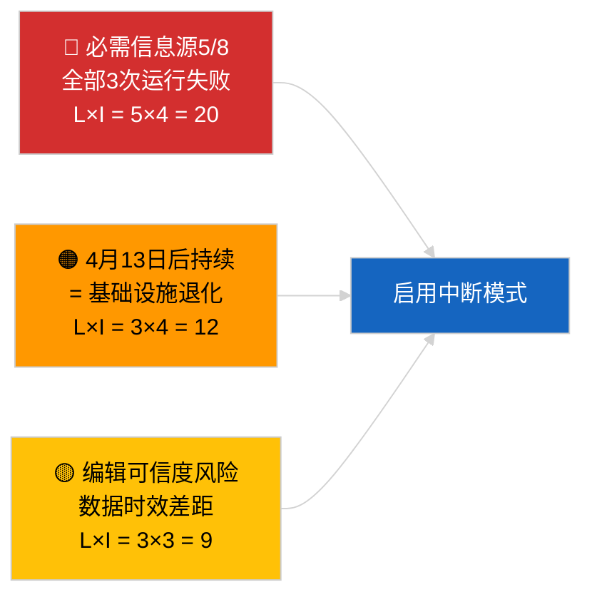

<!-- SPDX-FileCopyrightText: 2026 Hack23 AB -->
<!-- SPDX-License-Identifier: Apache-2.0 -->

# 执行摘要 — 紧急（API可靠性）| 2026-04-03

**分类：** OSINT | 欧洲议会公开记录
**可信度：** 🟢 高（通过3次独立运行的系统性验证，12个端点＋4个分析工具）
**创建时间：** 2026-04-03T00:00:00Z（追溯摘要）
**文章类型：** 紧急 — 欧洲议会API门户可靠性评估
**来源：** 欧洲议会公开数据门户

---

## 🎯 BLUF

**欧洲议会数据门户信息源API处于中断状态 — 8个必需信息源中有5个在3次独立运行（06:00、12:15、18:15 UTC）中全部失败。** `get_events_feed`、`get_procedures_feed`、`get_documents_feed`、`get_plenary_documents_feed`、`get_committee_documents_feed`、`get_parliamentary_questions_feed` 在 `today` 和 `one-week` 时间范围内均返回404错误或超时。正常运行的端点：`get_meps_feed`（737/737）及分析工具（`detect_voting_anomalies`、`analyze_coalition_dynamics`、`generate_political_landscape`、`early_warning_system`）。`get_adopted_texts_feed` 返回部分数据（通过 one-week 备用路径约80〜100条）。故障模式与复活节假期相关，表明上游任务队列存在维护或季节性降级。**🟢 高可信度**：故障真实且持续（n=3次运行）。**🟡 中等可信度**：根本原因（假期维护对比基础设施退化）。

---

## 🧭 本简报支持的3项决策

| # | 决策 | 决策者 | 截止时间 | 依据 |
|:-:|-----|-------|:--------:|------|
| 1 | **运营：** 启用管道中断数据模式（`PREFETCH_DATA_MODE=degraded-feeds`），直至恢复 | 数据管道负责人 | ＋12小时 | 必需信息源5/8失败 |
| 2 | **编辑：** 将本评估作为透明度说明发布，为下游文章打上"data-mode: degraded"标签 | 编辑 | ＋24小时 | 公众信任信号 |
| 3 | **前瞻性监控：** 复活节假期期间（至4月13日）每日进行端点健康检查 | 分析师 | 每日 | 验证恢复情况 |

---

## 📰 60秒速读

- 🔴 **必需信息源5/8在全部3次运行中失败** — `get_events_feed`、`get_procedures_feed`、`get_documents_feed`、`get_plenary_documents_feed`、`get_committee_documents_feed`、`get_parliamentary_questions_feed`。（🟢 高）
- 🟠 **采纳文本信息源部分运行** — `today` 出现JSON错误；one-week备用路径返回约80〜100条。（🟢 高）
- 🟢 **MEP信息源和分析工具正常运行** — `get_meps_feed` 在全部3次运行中返回737/737；联合分析·政治格局·异常检测·早期预警工具均正常返回数据。（🟢 高）
- 🟡 **与复活节假期相关** — 故障模式在布鲁塞尔会期（3月26日）结束后立即开始；假期维护假说优先。（🟡 中等）
- 🔵 **运营影响：** 新闻管道需要回退至采纳文本＋MEP＋分析工具；时效性与全面性之间的权衡。（🟢 高）
- 🟣 **交叉参考：** 姐妹包 2026-04-03/breaking 记录了本次运行分析工具持续生成的联合基线。（🟢 高）
- 🩷 **故障向量：** 4月13日后持续出现的404错误将表明基础设施退化，并触发通过正式渠道联系EP-EDP技术负责人的上报流程。（🟢 高）
- ⚪ **滚动推进：** 向验证管道添加 `prefetch-status.json` 状态跟踪和中断信息源适应系数（0.80）。

---

## 🗂️ 端点状态快照

| 端点 | 状态 | 可信度 | 备注 |
|-----|:---:|:------:|------|
| `get_meps_feed` | 🟢 正常 | 🟢 高 | 全部3次运行737/737 |
| `get_adopted_texts_feed` | 🟡 部分 | 🟢 高 | one-week备用约80〜100条 |
| `get_events_feed` | 🔴 失败 | 🟢 高 | today + one-week均404 |
| `get_procedures_feed` | 🔴 失败 | 🟢 高 | today + one-week均404 |
| `get_documents_feed` | 🔴 失败 | 🟢 高 | one-week超时 |
| `get_plenary_documents_feed` | 🔴 失败 | 🟢 高 | one-week超时 |
| `get_committee_documents_feed` | 🔴 失败 | 🟢 高 | one-week超时 |
| `get_parliamentary_questions_feed` | 🔴 失败 | 🟢 高 | one-week超时 |
| `detect_voting_anomalies` | 🟢 正常 | 🟢 高 | — |
| `analyze_coalition_dynamics` | 🟢 正常 | 🟢 高 | 1次超时，2次正常 |
| `generate_political_landscape` | 🟢 正常 | 🟢 高 | — |
| `early_warning_system` | 🟢 正常 | 🟢 高 | — |

---

## ⚠️ 风险与威胁快照

| 风险 | 可能性 | 影响 | 评分 | 触发条件 | 来源 | 海军上将评级 |
|-----|:-----:|:----:|:----:|---------|------|:-----------:|
| 信息源API中断状态 | 5 | 4 | 20 | n=3已确认 | 本次运行 | A1 |
| 假期后持续中断 | 3 | 4 | 12 | 4月13日后出现404错误 | 每日健康检查 | A2 |
| 编辑可信度 | 3 | 3 | 9 | 已发布文章使用过时数据 | 管道状态 | B2 |
| 数据状态误分类 | 2 | 3 | 6 | 验证器将中断状态误认为完整 | 验证器配置 | B3 |

---

## 🔮 最重要的前瞻性触发器

**在2026年4月13日（复活节假期结束）之前每日进行端点健康检查。** 如果失败的信息源集群在2026年4月14日（复活节后首个工作日）之前未能恢复，则上报至基础设施退化假说，并通过正式渠道联系EP EDP技术运营团队。

---

## 🛡️ 来源质量评估

- **一手资料：** 分别在06:00、12:15、18:15 UTC进行的3次系统性健康检查运行；12个端点＋4个分析工具。
- **中断状态确认可信度：** 🟢 高（日内n=3；确定性故障模式）。
- **根本原因可信度：** 🟡 中等（假期相关性具有提示性但非决定性）。

---

## 📎 链接

| 链接 | 路径 |
|-----|------|
| 文章 | `./article.md` |
| 姐妹运行 | `analysis/daily/2026-04-03/breaking/`（联合）、`breaking-3/`（反腐）|
| 清单 | `./manifest.json` |
| 先前信号 | `analysis/daily/2026-04-01/breaking/`（首次观测到6/8 404错误）|

---

## 🔄 交叉参考

**先前信号：** 2026-04-01/breaking 和 2026-04-02/breaking 均记录了信息源API的404错误，但未进行3次运行的正式验证。本次运行对该模式进行了正式化和量化。

**事后验证：** 2026年4月4〜5日的每日检查将确定故障是否持续或随假期结束而消解。

---

**文件管理**
- **模板：** `/analysis/templates/executive-brief.md`
- **产出路径：** `analysis/daily/2026-04-03/breaking-2/executive-brief.md`
- **分类：** 公开
- **追溯创建：** 回填会话。
