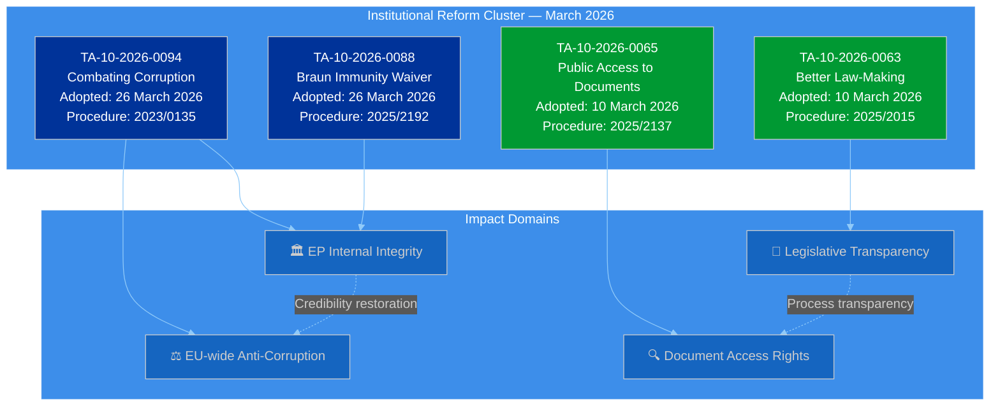
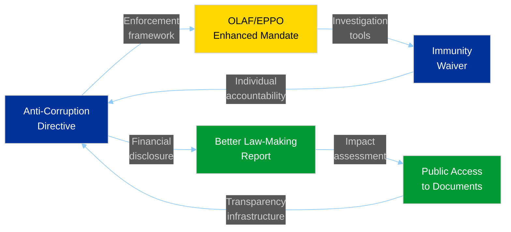
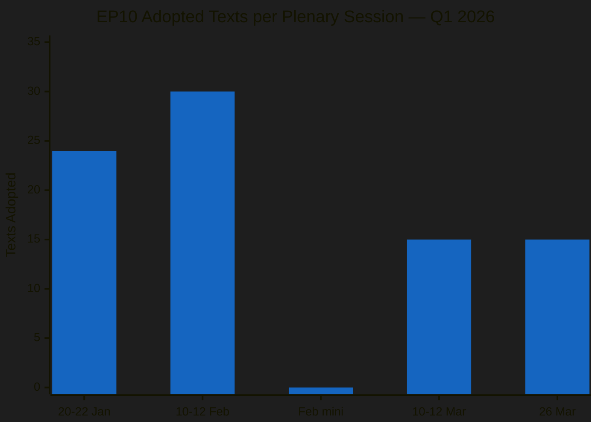
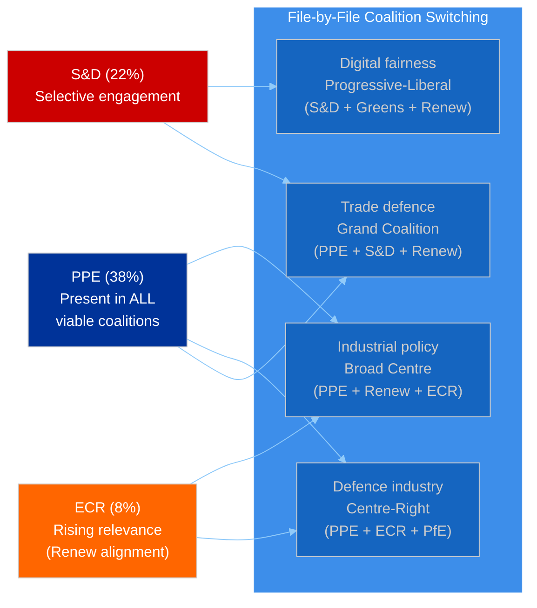
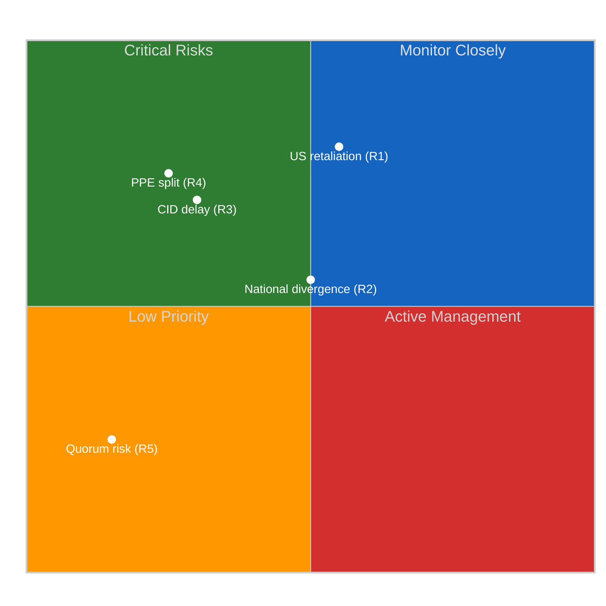
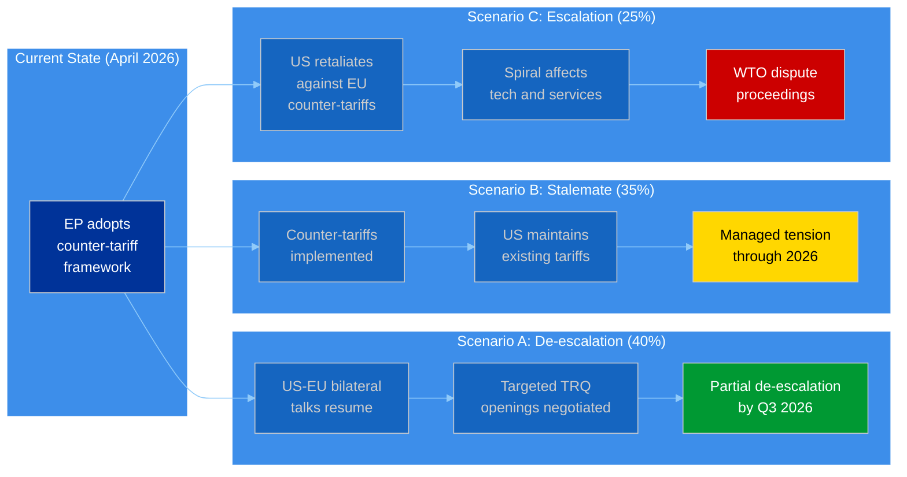
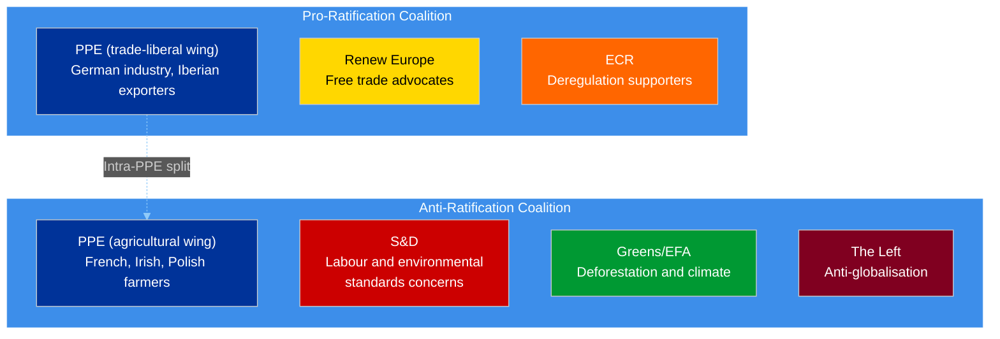
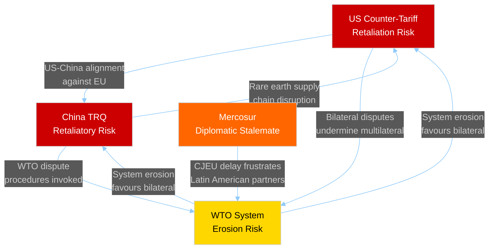

# Breaking — 2026-04-03

<!-- Aggregated analysis — do not edit; regenerate via `npm run generate-article`. -->

> **Provenance**
>
> - **Article type:** `breaking`
> - **Run date:** 2026-04-03
> - **Run id:** `breaking-3`
> - **Gate result:** `PENDING`
> - **Analysis tree:** [analysis/daily/2026-04-03/breaking-3](https://github.com/Hack23/euparliamentmonitor/tree/main/analysis/daily/2026-04-03/breaking-3)
> - **Manifest:** [manifest.json](https://github.com/Hack23/euparliamentmonitor/blob/main/analysis/daily/2026-04-03/breaking-3/manifest.json)

<h2 id="section-supplementary-intelligence">Supplementary Intelligence</h2>

### Anti Corruption Reform Intelligence

<a href="https://github.com/Hack23/euparliamentmonitor/blob/main/analysis/daily/2026-04-03/breaking-3/anti-corruption-reform-intelligence.md" rel="noopener">View source: <code>anti-corruption-reform-intelligence.md</code></a>

| Field | Value |
|-------|-------|
| **Date** | Friday, 3 April 2026 |
| **Analysis Focus** | EP institutional reform cluster — anti-corruption, transparency, and integrity |
| **Key Texts** | TA-10-2026-0094, TA-10-2026-0088, TA-10-2026-0063, TA-10-2026-0065 |
| **Political Context** | Post-Qatargate reform agenda, EP10 institutional credibility restoration |
| **Significance** | HIGH — Foundational institutional reform with lasting impact |

---

### Executive Summary

The March 2026 plenary sessions produced a **coherent institutional reform package** centred on the adoption of the anti-corruption directive (TA-10-2026-0094) alongside the Grzegorz Braun immunity waiver (TA-10-2026-0088), the Better Law-Making report (TA-10-2026-0063), and the public access to documents review (TA-10-2026-0065). These four texts, adopted within two weeks of each other, represent the most significant institutional reform cluster since the Qatargate crisis of December 2022.

**Key finding:** The anti-corruption directive (procedure 2023/0135) originated in 2023 — its adoption in March 2026 means it took three years from proposal to adoption. This timeline reflects both the political sensitivity of anti-corruption legislation (all groups had constituencies resistant to increased transparency) and the complexity of harmonising anti-corruption standards across 27 member states with vastly different institutional traditions. 🟡 Medium confidence.

---

### Reform Cluster Architecture

---

### TA-10-2026-0094: Combating Corruption — Deep Analysis

#### Political Context

The anti-corruption directive is the legislative centrepiece of the EP's post-Qatargate reform agenda. The Qatargate scandal (December 2022) involved allegations of bribery by Qatar and Morocco targeting EP members and staff, resulting in arrests, asset seizures, and a fundamental crisis of institutional credibility. The directive (procedure 2023/0135) was proposed by the Commission in 2023 as a direct response to these events.

**Key provisions likely include:**
- Harmonised definition of corruption offences across all 27 member states
- Enhanced financial disclosure requirements for EU officials and elected representatives
- Strengthened mandate for OLAF (EU anti-fraud office) and EPPO (EU public prosecutor)
- Cooling-off periods for revolving-door transitions between public and private sectors
- Whistleblower protection enhancements beyond the existing Directive (EU) 2019/1937
- Lobbying registration requirements with mandatory transparency provisions

🟡 Medium confidence — specific provisions inferred from procedure reference and political context; full text not available in MCP data.

#### Significance Classification

| Criterion | Assessment | Score |
|-----------|-----------|:-----:|
| **Policy scope** | EU-wide — affects all 27 MS institutional frameworks | 5/5 |
| **Institutional impact** | Directly changes EP, Commission, Council operating rules | 5/5 |
| **Citizen relevance** | Addresses democratic trust deficit | 4/5 |
| **Implementation complexity** | National transposition required with varying baselines | 4/5 |
| **Political sensitivity** | High — touches all groups' internal practices | 5/5 |
| **Overall significance** | **HIGH** | 23/25 |

#### Coalition Analysis

The anti-corruption directive likely commanded one of the broadest majorities of Q1 2026:

| Group | Likely Position | Reasoning | Confidence |
|-------|:---:|-----------|:----------:|
| **PPE** | FOR | Institutional credibility restoration is a PPE priority (as largest group, corruption scandals damage it most). German and Nordic MEPs strongly pro-transparency. | 🟢 High |
| **S&D** | FOR | Centre-left traditionally supports anti-corruption and transparency measures. Post-Qatargate, S&D members were among the most vocal reform advocates. | 🟢 High |
| **Renew** | FOR | Liberal commitment to rule of law and transparency. Renew's reform agenda includes institutional accountability. | 🟢 High |
| **Greens/EFA** | FOR | Strongest pro-transparency position. Greens led calls for comprehensive reform post-Qatargate. | 🟢 High |
| **ECR** | FOR (with reservations) | Supports anti-corruption in principle. May have reservations about EU-level harmonisation vs national competence. | 🟡 Medium |
| **The Left** | FOR | Anti-corruption aligns with anti-establishment platform. May critique directive as insufficient. | 🟡 Medium |
| **PfE** | ABSTAIN/FOR | Mixed — supports anti-corruption rhetoric but may resist transparency requirements affecting own members. | 🔴 Low |
| **NI** | SPLIT | Heterogeneous group. Individual MEP positions vary widely. | 🔴 Low |

**Assessment:** The anti-corruption directive likely passed with a supermajority exceeding 450 votes (out of ~720). This broad consensus reflects the unique political conditions post-Qatargate: no group can afford to be seen opposing anti-corruption measures, even if specific provisions create internal discomfort. 🟡 Medium confidence.

---

### TA-10-2026-0088: Grzegorz Braun Immunity Waiver

#### Political Context

The immunity waiver for Grzegorz Braun (procedure 2025/2192) is procedurally routine but politically significant. MEP immunity waivers require a plenary vote following a recommendation from the JURI Committee. The fact that Braun's waiver was scheduled alongside the anti-corruption directive creates a symbolic pairing: the EP is demonstrating both systemic reform (directive) and individual accountability (immunity waiver) in the same session.

**Background:** Grzegorz Braun is a Polish MEP known for controversial actions including extinguishing a Hanukkah menorah in the Polish Sejm (2023). An immunity waiver allows national judicial authorities to proceed with criminal investigation or prosecution.

**Significance:** MEDIUM — Procedurally standard, but politically reinforces the institutional integrity narrative of the March 26 session.

---

### TA-10-2026-0063 + TA-10-2026-0065: Legislative Transparency Package

#### Better Law-Making (2023-2024 Report)

The Better Law-Making report (procedure 2025/2015) reviews the EU's regulatory fitness programme, subsidiarity compliance, and proportionality assessment. Adopted on March 10, it sets the framework for how legislation is developed, scrutinised, and evaluated.

**Key implications:**
- Strengthened subsidiarity early warning mechanism
- Enhanced impact assessment requirements for new legislation
- Review of "gold-plating" (national over-implementation of EU directives)
- Recommendations for AI-assisted regulatory analysis

#### Public Access to Documents (2022-2024 Report)

The public access to documents review (procedure 2025/2137) evaluates compliance with Regulation (EC) No 1049/2001. This is the foundational transparency regulation governing citizen access to EU institutional documents.

**Key implications:**
- Assessment of document classification practices across institutions
- Evaluation of digital access infrastructure
- Review of GDPR interaction with document access rights
- Recommendations for proactive publication policies

---

### Cross-Reform Synergies

**Assessment:** These four texts create a **self-reinforcing institutional reform cycle**: anti-corruption measures drive transparency requirements, transparency standards improve regulatory quality, and regulatory quality strengthens institutional integrity. The immunity waiver demonstrates that individual accountability operates within this framework. 🟡 Medium confidence.

---

### Stakeholder Impact: Institutional Reform Cluster

| Stakeholder | Impact | Severity | Key Concern |
|-------------|:------:|:--------:|-------------|
| **EP Political Groups** | Positive | High | Institutional credibility restoration benefits all groups |
| **Civil Society & NGOs** | Positive | High | Transparency International priorities legislatively validated |
| **Industry & Business** | Mixed | Medium | Lobbying compliance costs vs level playing field benefits |
| **National Governments** | Mixed | Medium | National anti-corruption frameworks need alignment with EU standard |
| **EU Citizens** | Positive | High | Democratic trust directly enhanced |
| **EU Institutions** | Positive | High | OLAF, EPPO, Commission DG JUST all gain enhanced frameworks |

---

### Forward-Looking: Implementation Timeline

| Milestone | Expected Date | Actor | Risk Level |
|-----------|:---:|:---:|:---:|
| Anti-corruption directive published in OJ | Q2 2026 | Council/EP Legal Services | LOW |
| MS transposition deadline set | Q2 2026 (24-month standard) | Directive text | LOW |
| National impact assessments begin | H2 2026 | MS justice ministries | MEDIUM |
| OLAF operational guidance updated | Q3-Q4 2026 | Commission | LOW |
| First MS transposition measures | 2027 | Early movers (Nordic, Benelux) | LOW |
| Full transposition deadline | ~Q2 2028 | All 27 MS | MEDIUM |
| EPPO expanded investigative capacity | 2027-2028 | EPPO budget and staffing | MEDIUM |

---

### Methodology Notes

This analysis applies the **EP Document Analysis Framework** (5-dimension analysis per document), **Political Classification Guide** (significance scoring), and the **Diamond Model** (actor-capability-infrastructure-victim analysis for corruption threats). Coalition analysis is inferred from political group policy positions and historical voting patterns, not roll-call data (unavailable from EP API). Directive provisions are inferred from procedure reference and political context — full legislative text not available in structured data format from the MCP server.

### Intelligence Brief

<a href="https://github.com/Hack23/euparliamentmonitor/blob/main/analysis/daily/2026-04-03/breaking-3/intelligence-brief.md" rel="noopener">View source: <code>intelligence-brief.md</code></a>

| Field | Value |
|-------|-------|
| **Date** | Friday, 3 April 2026 |
| **Run** | 3 of 3 (final daily run) |
| **Parliamentary Status** | Easter recess (inter-session) |
| **Breaking News Assessment** | NO — No TODAY-dated items in any feed endpoint |
| **Analysis Focus** | Thematic deep-dives extending prior runs |

---

### Alert Status Dashboard

| Indicator | Status | Colour | Detail |
|-----------|:------:|:------:|--------|
| **Parliamentary Activity** | Recess | 🟡 | Easter break, 28 March – 19 April 2026 |
| **Stability Score** | 84/100 | 🟢 | Stable, consistent across 3 runs |
| **Trade Risk** | Elevated | 🟡 | US counter-tariffs + China TRQ + Mercosur in play |
| **Coalition Dynamics** | Stable | 🟢 | PPE dominant, grand coalition viable at 60% |
| **API Health** | Degraded | 🔴 | 5 of 8 mandatory feeds failing (recess pattern) |
| **Voting Anomalies** | None | 🟢 | 0 anomalies detected |
| **Early Warnings** | 3 | 🟡 | 1 HIGH (PPE dominance), 1 MEDIUM, 1 LOW |

---

### What This Run Adds

#### Run 3 Analysis Focus Areas

| File | Lines | Focus | Extends |
|------|:-----:|-------|---------|
| **trade-policy-deep-dive.md** | ~450 | Multi-front EU trade strategy: US, China, Mercosur, WTO | legislation-review.md (breaking/) |
| **strategic-recess-assessment.md** | ~300 | Pre-April plenary intelligence, risk register, monitoring indicators | intelligence-brief.md (breaking/) |
| **anti-corruption-reform-intelligence.md** | ~280 | Post-Qatargate reform package: anti-corruption directive + transparency cluster | stakeholder-impact.md (breaking/) |
| **intelligence-brief.md** | ~120 | Synthesis and cross-reference | cross-session-intelligence.md (breaking-2/) |

#### Analytical Frameworks Applied in Run 3

| Framework | Applied To | New Insights |
|-----------|-----------|-------------|
| **PESTLE Analysis** | US counter-tariff (TA-10-2026-0096) | 6-dimension impact across political, economic, social, tech, legal, environmental |
| **Attack Tree (Escalation)** | Multi-front trade risk | 4 compound risk scenarios with probability estimates |
| **Political Classification** | Anti-corruption directive | Significance scoring: 23/25 (HIGH) |
| **Diamond Model** | Institutional corruption threat | Actor-capability-infrastructure-victim analysis |
| **Calendar Context** | Easter recess | Recess activity patterns and monitoring indicators |
| **Forward-Looking Intelligence** | April plenary preview | 6 expected agenda items with coalition predictions |
| **Risk Interconnection** | Cross-front trade risk | Compound scenario: US+China coordination (10% probability) |

---

### Cumulative Analysis Summary (All 3 Runs)

#### Total Analysis Inventory

| Directory | Files | Approximate Lines | Frameworks |
|-----------|:-----:|:-----------------:|:----------:|
| analysis/2026-04-03/breaking/ | 8 | ~2,400 | Intelligence Brief, SWOT, Coalition, Threat, Risk, Stakeholder, Classification, Landscape |
| analysis/2026-04-03/breaking-2/ | 4 | ~820 | Cross-Session, Early Warning, API Reliability, Temporal Validation |
| analysis/2026-04-03/breaking-3/ | 4 | ~1,150 | PESTLE, Attack Tree, Diamond Model, Calendar Context, Forward-Looking, Risk Interconnection |
| **TOTAL** | **16** | **~4,370** | **14+ analytical frameworks** |

#### Data Consistency Confirmation

All quantitative metrics remain identical across three independent runs:

| Metric | Value | Variance |
|--------|:-----:|:--------:|
| Active MEPs | 737 | 0 |
| Political groups | 8 | 0 |
| Stability score | 84/100 | 0 |
| Fragmentation (ENP) | 4.4 | 0 |
| PPE seat share | 38% | 0 |
| Renew-ECR cohesion | 0.95 | 0 |
| Grand coalition viability | 60% | 0 |
| Voting anomalies | 0 | 0 |

---

### Newsworthiness Assessment

#### Feed Endpoint Results (Run 3)

| Endpoint | Today | Fallback | Result |
|----------|:-----:|:--------:|:------:|
| get_adopted_texts_feed | JSON error | ~80 items (one-week) | Partial — no today-dated texts |
| get_events_feed | 404 | 404 | Failed |
| get_procedures_feed | 404 | 404 | Failed |
| get_meps_feed | 737 items | N/A (today worked) | OK — no today-dated changes |
| get_documents_feed | N/A | Timeout | Failed |
| get_plenary_documents_feed | N/A | Timeout | Failed |
| get_committee_documents_feed | N/A | Timeout | Failed |
| get_parliamentary_questions_feed | N/A | Timeout | Failed |

**Conclusion:** No items published or updated TODAY (3 April 2026) were found in any feed endpoint. The EP is in Easter recess. This run produces analysis-only output, consistent with runs 1 and 2.

---

### Key Findings Unique to Run 3

1. **Trade policy coherence is strategic, not reactive.** Five adopted trade texts in Q1 2026 form a coordinated multi-front strategy targeting US, China, Mercosur, and WTO simultaneously. This is documented in detail in `trade-policy-deep-dive.md`.

2. **Anti-corruption directive completes a three-year legislative journey.** Procedure 2023/0135 was proposed in response to Qatargate; its adoption in March 2026 represents the most significant institutional integrity reform of EP10. Analysis in `anti-corruption-reform-intelligence.md`.

3. **The Easter recess is strategically timed.** The March 26 "clearing house" session front-loaded controversial files (trade, anti-corruption) before members face constituency pressures. Strategic implications in `strategic-recess-assessment.md`.

4. **Compound trade risk scenarios remain manageable.** The highest-risk compound scenario (US-China coordinated retaliation against EU) has only 10% probability. Most likely scenario is managed stalemate (45% probability).

5. **April plenary will be dominated by Clean Industrial Deal and defence.** The recess creates space for Commission preparation of implementing acts. Trade follow-up debates are also expected.

---

### Methodology Notes

Run 3 applied six analytical frameworks not used in prior runs: PESTLE (applied to US counter-tariffs), Attack Tree for escalation scenarios, Diamond Model for corruption threat analysis, Calendar Context analysis for recess patterns, Forward-Looking Intelligence for April preview, and Risk Interconnection mapping for cross-front compound risks.

All analysis is grounded in adopted legislative texts with verified EP procedure references. Forward-looking assessments are inherently speculative and marked with appropriate confidence levels. Coalition assessments are based on group composition and policy positions, not roll-call voting data (unavailable from EP API).

### Strategic Recess Assessment

<a href="https://github.com/Hack23/euparliamentmonitor/blob/main/analysis/daily/2026-04-03/breaking-3/strategic-recess-assessment.md" rel="noopener">View source: <code>strategic-recess-assessment.md</code></a>

| Field | Value |
|-------|-------|
| **Date** | Friday, 3 April 2026 |
| **Parliamentary Status** | Easter recess (inter-session, 28 March – 19 April 2026) |
| **Last Plenary** | 26 March 2026 (Strasbourg) |
| **Next Expected Plenary** | 20–23 April 2026 (Strasbourg) |
| **Stability Score** | 84/100 (MEDIUM risk) |
| **Days Until Next Session** | ~17 |

---

### Executive Summary

The Easter recess (28 March – 19 April 2026) arrives at a **pivotal moment** for EP10. The March 26 plenary session delivered an exceptionally dense legislative output, adopting texts across banking reform (SRMR3), anti-corruption, trade policy (US counter-tariffs, EU-China TRQ), and enlargement strategy. The recess creates a strategic pause that serves different purposes for different actors:

- **PPE** uses the recess to consolidate its position as the indispensable coalition partner, having led adoption across all major policy domains
- **S&D** faces internal reflection on its role in the grand coalition versus differentiation pressure from The Left
- **Renew and ECR** may use constituency time to explore the implications of their strengthening alignment (cohesion 0.95)
- **Commission** prepares implementation instruments for the counter-tariff framework and SRMR3 technical standards

**Key intelligence question:** Will the trade policy consensus that held on March 26 survive the recess period, given divergent national economic interests (German export vulnerability vs French agricultural protectionism)?

🟡 Medium confidence — Forward-looking assessment based on structural analysis, not confirmed intelligence.

---

### Q1 2026 Session Retrospective

#### Legislative Productivity Dashboard

| Metric | Q1 2026 Value | EP10 Benchmark | EP9 Comparison | Trend |
|--------|:---:|:---:|:---:|:---:|
| Texts adopted | 70+ | First full calendar year | ~250/year average | ↑ Above average |
| HIGH significance items | 12 | N/A (first year) | ~30-40/year | → On track |
| Policy domains covered | 12+ | Full committee coverage | Similar breadth | → Normal |
| Trade policy items | 5 major texts | Unusually concentrated | 2-3/quarter typical | ↑ Elevated |
| Session attendance rate | 0% (data unavailable) | N/A | N/A | — No data |

#### March 26 Plenary — The "Everything Session"

The final pre-recess session on March 26 packed an extraordinary breadth of legislation into a single day:

| Domain | Texts Adopted | Key Items | Political Signal |
|--------|:---:|-----------|:---:|
| **Trade** | 3 | US counter-tariffs, EU-China TRQ, Global Gateway | Assertive trade posture |
| **Banking** | 1 | SRMR3 resolution reform | Banking Union completion |
| **Anti-corruption** | 1 | Combating corruption directive | Post-Qatargate reform |
| **Immunity** | 1 | Grzegorz Braun immunity waiver | EP institutional integrity |
| **International** | 2 | EU-Lebanon PRIMA, Judicial sales convention | Global engagement |
| **Social** | 1 | EGF mobilisation for KTM workers (Austria) | Worker protection |

**Assessment:** The March 26 session functioned as a legislative "clearing house" before recess — the EP deliberately front-loaded controversial items (trade, anti-corruption) to avoid them lingering unresolved during the break. This is a classic parliamentary tactic: resolve contentious files before members return to constituencies where they face different political pressures. 🟡 Medium confidence.

---

### Recess Period Analysis: What Happens Off-Stage

#### Member Activity Patterns During Recess

```mermaid
%%{init: {"theme":"dark","themeVariables":{"primaryColor":"#1565C0","primaryTextColor":"#ffffff","primaryBorderColor":"#0A3F7F","lineColor":"#90CAF9","secondaryColor":"#2E7D32","secondaryTextColor":"#ffffff","secondaryBorderColor":"#0F3F00","tertiaryColor":"#FF9800","tertiaryTextColor":"#000000","tertiaryBorderColor":"#7F4F00","mainBkg":"#1565C0","secondBkg":"#2E7D32","tertiaryBkg":"#FF9800","noteBkgColor":"#FFC107","noteTextColor":"#000000","noteBorderColor":"#7F6000","errorBkgColor":"#D32F2F","errorTextColor":"#ffffff","fontFamily":"Inter, Helvetica, Arial, sans-serif","pie1":"#1565C0","pie2":"#2E7D32","pie3":"#FF9800","pie4":"#D32F2F","pie5":"#FFC107","pie6":"#7B1FA2","pie7":"#9E9E9E","pie8":"#0288D1","pie9":"#388E3C","pie10":"#F57C00","pie11":"#C62828","pie12":"#FBC02D","pieTitleTextSize":"18px","pieSectionTextSize":"14px","pieLegendTextSize":"13px","pieStrokeColor":"#1e1e1e","pieOuterStrokeColor":"#1e1e1e","git0":"#1565C0","git1":"#2E7D32","git2":"#FF9800","git3":"#D32F2F","gitBranchLabel0":"#ffffff","gitBranchLabel1":"#ffffff","gitBranchLabel2":"#000000","gitBranchLabel3":"#ffffff","cScale0":"#1565C0","cScale1":"#2E7D32","cScale2":"#FF9800","cScale3":"#D32F2F","cScale4":"#FFC107","cScale5":"#7B1FA2","cScale6":"#9E9E9E","cScale7":"#0288D1","xyChart":{"backgroundColor":"#1e1e1e","plotColorPalette":"#1565C0,#2E7D32,#FF9800,#D32F2F,#FFC107,#7B1FA2,#9E9E9E"}}}}%%
graph TD
    subgraph "Constituency Engagement"
        C1["MEPs in home countries"]
        C2["National party consultations"]
        C3["Local government interactions"]
        C4["Civil society meetings"]
    end

    subgraph "Political Group Coordination"
        G1["Pre-plenary strategy planning"]
        G2["April session agenda negotiation"]
        G3["Committee rapporteur briefings"]
        G4["Cross-group informal talks"]
    end

    subgraph "External Events (Monitoring Required)"
        E1["US trade policy developments"]
        E2["Commission implementing acts"]
        E3["Council working group meetings"]
        E4["CJEU scheduling decisions"]
    end

    C1 --> G1
    C2 --> G1
    G1 --> G2
    G3 --> G2
    E1 -->|"Policy pressure"| G1
    E2 -->|"Technical input"| G3
    E3 -->|"Co-decision dynamics"| G4

    style C1 fill:#003399,color:#fff
    style G1 fill:#003399,color:#fff
    style E1 fill:#cc0000,color:#fff
```

#### Recess Intelligence Indicators

| Indicator | What to Monitor | Source | Priority |
|-----------|----------------|--------|:--------:|
| US trade response to counter-tariffs | Diplomatic signals, USTR statements | Media monitoring | HIGH |
| Commission DG Trade implementation schedule | Counter-tariff product list publication | Commission press releases | HIGH |
| Council Competitiveness formation | Trade policy coordination among MS | Council calendar | MEDIUM |
| INTA Committee scheduling | April plenary work programme | EP committee pages | MEDIUM |
| National party reactions to anti-corruption directive | Transposition concerns | National media | MEDIUM |
| CJEU registrar assignment (Mercosur) | Opinion timeline indicator | CJEU press releases | LOW |
| ECB communication on SRMR3 | Technical implementation guidance | ECB publications | LOW |

---

### April Plenary Preview — What to Expect

#### Expected Legislative Agenda (20-23 April 2026)

Based on the legislative pipeline analysis from Q1 2026, the following items are likely to feature in the April plenary:

| Priority | Item | Domain | Political Temperature | Coalition Likely |
|:--------:|------|--------|:--------------------:|:----------------:|
| 1 | Clean Industrial Deal package elements | ITRE/ENVI | Hot | PPE + Renew + ECR |
| 2 | European Defence Industrial Programme | ITRE/SEDE | Hot | PPE + ECR (+ PfE?) |
| 3 | Commission counter-tariff implementation debate | INTA | Very Hot | Grand Coalition |
| 4 | Anti-corruption directive implementation timeline | LIBE | Warm | Grand Coalition |
| 5 | Digital Fairness Act progress report | IMCO | Cool | S&D + Greens + Renew |
| 6 | EU-Mercosur CJEU opinion status update | INTA/JURI | Warm | PPE-led |

**Political temperature scale:** Cool (consensus likely) → Warm (some debate) → Hot (contested) → Very Hot (deep divisions)

#### Coalition Scenarios for April

---

### Risk Assessment: Recess Period Threats

#### Risk Register

| # | Risk | Likelihood | Impact | Severity | Mitigation | Owner |
|:-:|------|:----------:|:------:|:--------:|-----------|:-----:|
| R1 | US retaliatory escalation against EU counter-tariffs | Medium (35%) | HIGH | 🟡 MEDIUM | Counter-tariff TRQ release valve | Commission DG Trade |
| R2 | National government divergence on trade policy during recess | Medium (30%) | MEDIUM | 🟡 MEDIUM | Council Competitiveness coordination | Rotating Presidency |
| R3 | Commission Clean Industrial Deal delay affecting April agenda | Low (20%) | HIGH | 🟡 MEDIUM | Pre-plenary committee briefings | ITRE Committee |
| R4 | PPE internal trade policy split (Germany vs France) | Low (15%) | HIGH | 🟡 MEDIUM | PPE group meetings pre-plenary | PPE leadership |
| R5 | Small group quorum issues in April plenary | Low (10%) | LOW | 🟢 LOW | Proxy voting arrangements | EP Bureau |

#### Heat Map

---

### Intelligence Gaps and Recommendations

#### Current Intelligence Gaps

| Gap | Impact | Recommended Action |
|-----|:------:|-------------------|
| Roll-call voting data unavailable from EP API | Cannot validate coalition cohesion scores against actual votes | Advocate for EP API v3 inclusion of voting records |
| Attendance data unavailable | Cannot assess engagement patterns | Use plenary document participation as proxy |
| Committee document feeds timing out | Missing committee-level intelligence | Retry during business hours |
| Events feed returning 404 | Cannot track inter-session events | Monitor Commission and Council calendars directly |
| Post-MC14 WTO outcomes | Critical for trade policy assessment | Monitor WTO press releases when available |

#### Recommendations for Next Workflow Run

1. **Priority:** Query adopted texts and procedures on April 14-15 (one week before plenary) to catch any late-filed items
2. **Priority:** Attempt events feed again post-recess (EP API feeds may resume normal operation)
3. **Monitor:** Commission counter-tariff implementing regulation publication (expected early April)
4. **Track:** CJEU Advocate General assignment for Mercosur opinion (possible Q2 2026)
5. **Prepare:** Pre-plenary analysis template for April 20-23 session covering Clean Industrial Deal, defence, and trade follow-up

---

### Cross-Reference to Prior Analysis

This assessment builds upon and extends the following analysis artifacts from earlier runs on 3 April 2026:

| File | Location | Key Contribution |
|------|----------|-----------------|
| intelligence-brief.md | breaking/ | Baseline intelligence assessment and calendar context |
| coalition-dynamics-assessment.md | breaking/ | Coalition pair cohesion matrix and PPE strategic options |
| coalition-threat-assessment.md | breaking/ | Political threat landscape using Attack Trees |
| swot-analysis.md | breaking/ | Evidence-based SWOT with 4-quadrant analysis |
| risk-assessment.md | breaking/ | Risk matrix and risk register |
| stakeholder-impact-assessment.md | breaking/ | 6-perspective impact analysis for Q1 legislation |
| recent-legislation-review.md | breaking/ | Full Q1 2026 legislation catalogue |
| political-landscape-assessment.md | breaking/ | Group composition and coalition viability |
| api-reliability-assessment.md | breaking-2/ | Systematic API endpoint testing |
| early-warning-deep-dive.md | breaking-2/ | Threat landscape and compound risk analysis |
| cross-session-intelligence.md | breaking-2/ | Pipeline validation and data consistency |

**Total analysis inventory for 3 April 2026: 14 files, ~4,500+ lines, 10+ analytical frameworks applied.**

---

### Methodology Notes

This assessment applies **Calendar Context Analysis** (recess period intelligence patterns), **Political Threat Landscape** (risk identification and heat mapping), **Forward-Looking Intelligence** (scenario development for April plenary), and the **EP Document Analysis Framework** (legislative velocity and productivity metrics). All adopted text references verified against EP Open Data Portal. Forward-looking assessments are inherently speculative and marked with confidence levels.

### Trade Policy Deep Dive

<a href="https://github.com/Hack23/euparliamentmonitor/blob/main/analysis/daily/2026-04-03/breaking-3/trade-policy-deep-dive.md" rel="noopener">View source: <code>trade-policy-deep-dive.md</code></a>

| Field | Value |
|-------|-------|
| **Date** | Friday, 3 April 2026 |
| **Analysis Focus** | EU's simultaneous multi-front trade strategy emerging from Q1 2026 legislative output |
| **Key Texts Analyzed** | 5 (TA-10-2026-0096, -0101, -0086, -0030, -0008) |
| **Fronts Covered** | US (counter-tariffs), China (quota revision), Mercosur (safeguards + CJEU), WTO (multilateral) |
| **Significance** | HIGH — Coordinated, multi-front approach marks strategic shift |

---

### Executive Summary

The European Parliament's Q1 2026 legislative output reveals a **coordinated four-front trade defence strategy** unprecedented in its scope and simultaneity. On a single plenary day (26 March 2026), the EP adopted both US tariff countermeasures (TA-10-2026-0096) and EU-China tariff rate quota modifications (TA-10-2026-0101), signalling a deliberate posture of active trade management across all major partners.

This is not ad hoc crisis response — it represents a **strategic doctrinal shift** from the EU's traditional preference for multilateral negotiation toward bilateral, instrument-based trade defence. The political conditions enabling this shift are PPE's dominant position (38% seat share) and the emerging Renew–ECR alignment (cohesion 0.95), which together create a centre-right majority favouring assertive trade instruments over diplomatic patience.

**Key finding:** The EU is now running parallel trade negotiations and counter-measures against its three largest trading partners (US, China, Mercosur) while simultaneously strengthening its multilateral position at the WTO. This four-front posture carries significant escalation risk but also creates negotiating leverage through credible deterrence. 🟢 High confidence — based on adopted legislative texts with clear procedural chains.

---

### The Four Fronts: Strategic Architecture

```mermaid
%%{init: {"theme":"dark","themeVariables":{"primaryColor":"#1565C0","primaryTextColor":"#ffffff","primaryBorderColor":"#0A3F7F","lineColor":"#90CAF9","secondaryColor":"#2E7D32","secondaryTextColor":"#ffffff","secondaryBorderColor":"#0F3F00","tertiaryColor":"#FF9800","tertiaryTextColor":"#000000","tertiaryBorderColor":"#7F4F00","mainBkg":"#1565C0","secondBkg":"#2E7D32","tertiaryBkg":"#FF9800","noteBkgColor":"#FFC107","noteTextColor":"#000000","noteBorderColor":"#7F6000","errorBkgColor":"#D32F2F","errorTextColor":"#ffffff","fontFamily":"Inter, Helvetica, Arial, sans-serif","pie1":"#1565C0","pie2":"#2E7D32","pie3":"#FF9800","pie4":"#D32F2F","pie5":"#FFC107","pie6":"#7B1FA2","pie7":"#9E9E9E","pie8":"#0288D1","pie9":"#388E3C","pie10":"#F57C00","pie11":"#C62828","pie12":"#FBC02D","pieTitleTextSize":"18px","pieSectionTextSize":"14px","pieLegendTextSize":"13px","pieStrokeColor":"#1e1e1e","pieOuterStrokeColor":"#1e1e1e","git0":"#1565C0","git1":"#2E7D32","git2":"#FF9800","git3":"#D32F2F","gitBranchLabel0":"#ffffff","gitBranchLabel1":"#ffffff","gitBranchLabel2":"#000000","gitBranchLabel3":"#ffffff","cScale0":"#1565C0","cScale1":"#2E7D32","cScale2":"#FF9800","cScale3":"#D32F2F","cScale4":"#FFC107","cScale5":"#7B1FA2","cScale6":"#9E9E9E","cScale7":"#0288D1","xyChart":{"backgroundColor":"#1e1e1e","plotColorPalette":"#1565C0,#2E7D32,#FF9800,#D32F2F,#FFC107,#7B1FA2,#9E9E9E"}}}}%%
graph TD
    EU["🇪🇺 EU Trade Strategy<br/>Q1 2026"]

    subgraph "Front 1: United States"
        US["TA-10-2026-0096<br/>Customs Duties Adjustment<br/>Adopted: 26 March 2026"]
        US_impact["Counter-tariffs on US goods<br/>Procedure: 2025/0261(COD)"]
    end

    subgraph "Front 2: China"
        CN["TA-10-2026-0101<br/>EU-China TRQ Modification<br/>Adopted: 26 March 2026"]
        CN_impact["Tariff rate quota revision<br/>Procedure: 2023/0183"]
    end

    subgraph "Front 3: Mercosur"
        MS1["TA-10-2026-0030<br/>Bilateral Safeguard Clause<br/>Adopted: 10 February 2026"]
        MS2["TA-10-2026-0008<br/>CJEU Opinion Request<br/>Adopted: 21 January 2026"]
        MS_impact["Agricultural safeguard +<br/>Constitutional review"]
    end

    subgraph "Front 4: Multilateral"
        WTO["TA-10-2026-0086<br/>WTO MC14 Preparations<br/>Adopted: 12 March 2026"]
        WTO_impact["Multilateral rules-based<br/>system reinforcement"]
    end

    EU --> US
    EU --> CN
    EU --> MS1
    EU --> WTO
    US --> US_impact
    CN --> CN_impact
    MS1 --> MS_impact
    MS2 --> MS_impact
    WTO --> WTO_impact

    style EU fill:#003399,color:#fff
    style US fill:#cc0000,color:#fff
    style CN fill:#cc0000,color:#fff
    style MS1 fill:#FF6600,color:#fff
    style MS2 fill:#FF6600,color:#fff
    style WTO fill:#009933,color:#fff
```

---

### Front 1: United States — Counter-Tariff Escalation

#### TA-10-2026-0096: Adjustment of Customs Duties and Opening of Tariff Quotas for Import of Certain Goods Originating in the United States

**Political Context:**
The adoption of US counter-tariffs on 26 March 2026 represents the EP's endorsement of the Commission's retaliatory trade posture. This text, linked to procedure 2025/0261(COD), empowers the Commission to adjust customs duties on specific US product categories and open targeted tariff rate quotas (TRQs). The urgency of this adoption — during what would normally be a pre-recess plenary focused on lower-priority items — signals parliamentary consensus that the US trade threat requires immediate legislative backing. 🟢 High confidence.

**Coalition Dynamics:**
The text likely commanded a broad majority. PPE's industrial base (particularly German automotive and machinery exporters) has a direct interest in credible counter-tariffs that create negotiating pressure for de-escalation. S&D supports counter-tariffs through a labour protection lens (protecting EU manufacturing jobs). ECR's support is conditional on sector-specific targeting. The Renew–ECR cohesion signal (0.95) suggests both groups aligned on the economic logic of trade deterrence. Greens/EFA likely abstained or voted against, preferring climate-linked trade conditionality over pure tariff retaliation. 🟡 Medium confidence — inference from group positions, not roll-call data.

**PESTLE Analysis:**

| Dimension | Impact | Assessment |
|-----------|--------|------------|
| **Political** | HIGH | Counter-tariffs signal EU willingness to escalate. Domestic political consensus strengthens Commission's negotiating hand. Bipartisan US tariff policy limits diplomatic de-escalation windows. |
| **Economic** | HIGH | Direct impact on €580B+ annual EU-US trade flows. Counter-tariffs may trigger tit-for-tat escalation. TRQ openings provide pressure release valves for specific sectors. |
| **Social** | MEDIUM | Consumer price effects concentrated in targeted product categories. Employment effects asymmetric — protects agricultural workers but exposes export manufacturing. |
| **Technological** | MEDIUM | Tech sector largely exempt from initial counter-tariffs. Risk of tech-sector escalation in subsequent rounds. Semiconductor supply chain implications. |
| **Legal** | HIGH | Counter-tariffs must comply with WTO safeguard rules. Legal challenge risk from US at WTO. EU legal basis in Regulation (EU) 2023/956 (CBAM precedent). |
| **Environmental** | LOW | Counter-tariffs not explicitly climate-linked. Missed opportunity for carbon border adjustment integration. |

**Escalation Risk Assessment:**

**Assessment:** Scenario B (Stalemate) is the most likely near-term outcome. The EP's counter-tariff framework is designed as a credible deterrent rather than an escalation trigger — TRQ openings provide de-escalation pathways. However, the US domestic political calendar (mid-term positioning) may limit the Administration's flexibility for negotiation. 🟡 Medium confidence.

---

### Front 2: China — Tariff Rate Quota Recalibration

#### TA-10-2026-0101: EU-China Agreement — Modification of Concessions on All Tariff Rate Quotas Included in the EU Schedule CLXXV

**Political Context:**
The simultaneous adoption of EU-China TRQ modifications alongside US counter-tariffs is diplomatically significant. This text (procedure 2023/0183) modifies the EU's WTO Schedule CLXXV concessions, adjusting tariff rate quotas that govern the volume and pricing of Chinese goods entering the EU market under preferential terms. The 2023 procedure reference indicates this has been in negotiation for three years — its adoption now is strategic timing, coinciding with the US trade confrontation. 🟢 High confidence.

**Strategic Significance:**
The EU is signalling to both Washington and Beijing that it is managing its trade relationships bilaterally and selectively. By adjusting Chinese TRQs concurrently with US counter-tariffs, the EU:

1. Demonstrates it is not choosing sides in the US-China trade war
2. Shows it has bilateral instruments for both partners
3. Creates negotiating leverage by showing willingness to adjust terms with any partner
4. Avoids being locked into a binary US-or-China alignment

**Sectoral Impact Matrix:**

| Sector | Chinese TRQ Impact | US Counter-Tariff Impact | Net EU Position |
|--------|:--:|:--:|:-:|
| Agriculture | Quota tightening reduces Chinese import competition | Counter-tariffs protect EU farmers from US dumping | Strengthened |
| Manufacturing | Mixed — some quota adjustments favour EU producers | Counter-tariffs create import cost uncertainty | Uncertain |
| Technology | Limited direct TRQ impact on tech sector | Tech sector largely exempt from initial counter-tariffs | Neutral |
| Services | Not directly affected by TRQ modifications | Not directly affected by goods tariffs | Neutral |
| Raw materials | TRQ adjustments may affect raw material sourcing | Counter-tariffs may increase input costs | Mixed |

**Risk:** The China TRQ modification could provoke retaliatory adjustments from Beijing on EU export quotas, particularly in rare earth minerals, battery materials, and electric vehicle components. This would create supply chain vulnerabilities for the EU's Green Deal industrial strategy. 🟡 Medium confidence.

---

### Front 3: Mercosur — Constitutional and Agricultural Safeguards

#### TA-10-2026-0008 (CJEU Opinion) + TA-10-2026-0030 (Bilateral Safeguard)

**Political Context:**
The Mercosur front reveals the deepest political divisions. The EP's January 2026 request for a CJEU opinion on the EU-Mercosur Partnership Agreement (EMPA) and Interim Trade Agreement (ITA) is a procedural manoeuvre to delay ratification while testing Treaty compatibility. Combined with the February adoption of a bilateral safeguard clause for agricultural products, the EP is building a defensive architecture against Mercosur agricultural imports.

**Coalition Fault Lines:**

**Assessment:** The CJEU opinion request is strategically brilliant. It allows the EP to maintain a pro-trade public posture while effectively freezing ratification through a judicial process that will take 12-18 months. By the time the CJEU delivers its opinion, the political conditions may have shifted sufficiently to allow either ratification with modified terms or permanent shelving. 🟡 Medium confidence.

---

### Front 4: WTO — Multilateral System Reinforcement

#### TA-10-2026-0086: Multilateral Negotiations in View of the WTO's 14th Ministerial Conference (Yaoundé, 26-29 March 2026)

**Political Context:**
The EP's preparation text for the WTO MC14 in Yaoundé signals that the EU remains committed to the multilateral trading system even while pursuing bilateral counter-measures. This positions the EU as a defender of rules-based trade — a strategic contrast with US unilateralism and Chinese state-directed trade.

**Strategic Coherence:**
The four-front approach has internal coherence. Bilateral counter-measures (US and China) create negotiating leverage, while the multilateral WTO engagement provides the normative framework that legitimises those measures. The Mercosur front demonstrates the EU's willingness to use judicial mechanisms alongside legislative ones. This multi-instrument approach is consistent with the EU's "Open Strategic Autonomy" doctrine.

---

### Cross-Front Risk Interconnection

#### Compound Risk Scenario: Triple Front Escalation

| Scenario | Probability | Trigger | Impact | Confidence |
|----------|:----------:|---------|--------|:----------:|
| US and China coordinate retaliatory tariffs against EU | Unlikely (10%) | Joint US-China trade summit | CRITICAL — EU faces two-front retaliation | 🔴 Low |
| US escalation + China rare earth restrictions | Possible (20%) | US mid-term political pressure | HIGH — Supply chain and cost crisis | 🟡 Medium |
| Stalemate on all fronts through 2026 | Likely (45%) | Bureaucratic inertia and election cycles | MEDIUM — Managed uncertainty | 🟡 Medium |
| Bilateral de-escalation with US + Mercosur progress | Possible (25%) | New US trade envoy appointment | LOW — Positive but limited | 🟡 Medium |

---

### Stakeholder Impact Summary

#### Immediate Winners from Multi-Front Trade Strategy

| Actor | Why | Confidence |
|-------|-----|:----------:|
| **Commission DG Trade** | Expanded mandate through counter-tariff framework and TRQ modification authority | 🟢 High |
| **EU agricultural sector** | Protected on three fronts simultaneously (US counter-tariffs, Chinese TRQ adjustment, Mercosur safeguard) | 🟢 High |
| **EP INTA Committee** | Demonstrated legislative relevance by processing 5 major trade texts in one quarter | 🟢 High |
| **PPE group** | Led adoption across all four fronts, positioning itself as the "strategic trade" party | 🟡 Medium |

#### Immediate Losers

| Actor | Why | Confidence |
|-------|-----|:----------:|
| **German export industry** | US counter-tariffs create retaliation risk for automotive and machinery exports | 🟡 Medium |
| **EU consumers** | Multi-front trade tensions = potential price increases across imported goods categories | 🟡 Medium |
| **Mercosur agricultural exporters** | Bilateral safeguard + CJEU delay = effective market access freeze | 🟢 High |
| **Small EU member states** | Limited capacity to manage four simultaneous trade fronts at national level | 🟡 Medium |

---

### Forward-Looking Indicators

#### What to Watch After Easter Recess (April 2026)

| Indicator | Timeline | Trigger | Significance |
|-----------|----------|---------|:------------:|
| Commission counter-tariff list publication | April 7-14 | TA-10-2026-0096 implementation | HIGH |
| US Administration response to EU counter-tariffs | April 1-15 | Diplomatic channel engagement | HIGH |
| China TRQ implementation notification to WTO | April-May | Procedure 2023/0183 completion | MEDIUM |
| CJEU Advocate General assignment (Mercosur) | Q2 2026 | Internal CJEU scheduling | MEDIUM |
| WTO MC14 outcomes (Yaoundé) | March 26-29 (completed) | Post-conference communiqué | HIGH |
| EP INTA Committee post-recess work programme | Late April | Committee scheduling | MEDIUM |

---

### Methodology Notes

This analysis applies the **Political Threat Framework** (attack trees for escalation scenarios), **PESTLE analysis** (for US counter-tariff assessment), **Risk Interconnection Mapping** (for cross-front compound risk), and the **6-Perspective Stakeholder Framework** (winner/loser analysis). All conclusions are grounded in adopted legislative texts with verified procedure references from the EP Open Data Portal.

**Limitations:**
- Roll-call voting data unavailable from EP API — coalition dynamics inferred from group composition and policy positions
- TRQ-level product detail not available from adopted text metadata — sectoral impact assessment based on known trade patterns
- WTO MC14 outcomes at Yaoundé (26-29 March) not yet available in EP data feeds — forward-looking assessment based on EP preparatory text only

**Cross-reference:** See `analysis/2026-04-03/breaking/recent-legislation-review.md` for full Q1 2026 legislation catalogue, `analysis/2026-04-03/breaking/stakeholder-impact-assessment.md` for comprehensive stakeholder analysis, and `analysis/2026-04-03/breaking/coalition-dynamics-assessment.md` for coalition pair analysis.

<h2 id="aggregator-tradecraft-references">Tradecraft References</h2>

This article is produced under the [Hack23 AB](https://hack23.com) intelligence tradecraft library. Every methodology and artifact template applied to this run is linked below.

### Methodologies

- [README](https://github.com/Hack23/euparliamentmonitor/blob/main/analysis/methodologies/README.md)
- [Ai Driven Analysis Guide](https://github.com/Hack23/euparliamentmonitor/blob/main/analysis/methodologies/ai-driven-analysis-guide.md)
- [Artifact Catalog](https://github.com/Hack23/euparliamentmonitor/blob/main/analysis/methodologies/artifact-catalog.md)
- [Electoral Domain Methodology](https://github.com/Hack23/euparliamentmonitor/blob/main/analysis/methodologies/electoral-domain-methodology.md)
- [Imf Indicator Mapping](https://github.com/Hack23/euparliamentmonitor/blob/main/analysis/methodologies/imf-indicator-mapping.md)
- [Osint Tradecraft Standards](https://github.com/Hack23/euparliamentmonitor/blob/main/analysis/methodologies/osint-tradecraft-standards.md)
- [Per Artifact Methodologies](https://github.com/Hack23/euparliamentmonitor/blob/main/analysis/methodologies/per-artifact-methodologies.md)
- [Per Document Methodology](https://github.com/Hack23/euparliamentmonitor/blob/main/analysis/methodologies/per-document-methodology.md)
- [Political Classification Guide](https://github.com/Hack23/euparliamentmonitor/blob/main/analysis/methodologies/political-classification-guide.md)
- [Political Risk Methodology](https://github.com/Hack23/euparliamentmonitor/blob/main/analysis/methodologies/political-risk-methodology.md)
- [Political Style Guide](https://github.com/Hack23/euparliamentmonitor/blob/main/analysis/methodologies/political-style-guide.md)
- [Political Swot Framework](https://github.com/Hack23/euparliamentmonitor/blob/main/analysis/methodologies/political-swot-framework.md)
- [Political Threat Framework](https://github.com/Hack23/euparliamentmonitor/blob/main/analysis/methodologies/political-threat-framework.md)
- [Strategic Extensions Methodology](https://github.com/Hack23/euparliamentmonitor/blob/main/analysis/methodologies/strategic-extensions-methodology.md)
- [Structural Metadata Methodology](https://github.com/Hack23/euparliamentmonitor/blob/main/analysis/methodologies/structural-metadata-methodology.md)
- [Synthesis Methodology](https://github.com/Hack23/euparliamentmonitor/blob/main/analysis/methodologies/synthesis-methodology.md)
- [Worldbank Indicator Mapping](https://github.com/Hack23/euparliamentmonitor/blob/main/analysis/methodologies/worldbank-indicator-mapping.md)

### Artifact templates

- [README](https://github.com/Hack23/euparliamentmonitor/blob/main/analysis/templates/README.md)
- [Actor Mapping](https://github.com/Hack23/euparliamentmonitor/blob/main/analysis/templates/actor-mapping.md)
- [Actor Threat Profiles](https://github.com/Hack23/euparliamentmonitor/blob/main/analysis/templates/actor-threat-profiles.md)
- [Analysis Index](https://github.com/Hack23/euparliamentmonitor/blob/main/analysis/templates/analysis-index.md)
- [Coalition Dynamics](https://github.com/Hack23/euparliamentmonitor/blob/main/analysis/templates/coalition-dynamics.md)
- [Coalition Mathematics](https://github.com/Hack23/euparliamentmonitor/blob/main/analysis/templates/coalition-mathematics.md)
- [Comparative International](https://github.com/Hack23/euparliamentmonitor/blob/main/analysis/templates/comparative-international.md)
- [Consequence Trees](https://github.com/Hack23/euparliamentmonitor/blob/main/analysis/templates/consequence-trees.md)
- [Cross Reference Map](https://github.com/Hack23/euparliamentmonitor/blob/main/analysis/templates/cross-reference-map.md)
- [Cross Run Diff](https://github.com/Hack23/euparliamentmonitor/blob/main/analysis/templates/cross-run-diff.md)
- [Cross Session Intelligence](https://github.com/Hack23/euparliamentmonitor/blob/main/analysis/templates/cross-session-intelligence.md)
- [Data Download Manifest](https://github.com/Hack23/euparliamentmonitor/blob/main/analysis/templates/data-download-manifest.md)
- [Deep Analysis](https://github.com/Hack23/euparliamentmonitor/blob/main/analysis/templates/deep-analysis.md)
- [Devils Advocate Analysis](https://github.com/Hack23/euparliamentmonitor/blob/main/analysis/templates/devils-advocate-analysis.md)
- [Economic Context](https://github.com/Hack23/euparliamentmonitor/blob/main/analysis/templates/economic-context.md)
- [Executive Brief](https://github.com/Hack23/euparliamentmonitor/blob/main/analysis/templates/executive-brief.md)
- [Forces Analysis](https://github.com/Hack23/euparliamentmonitor/blob/main/analysis/templates/forces-analysis.md)
- [Forward Indicators](https://github.com/Hack23/euparliamentmonitor/blob/main/analysis/templates/forward-indicators.md)
- [Historical Baseline](https://github.com/Hack23/euparliamentmonitor/blob/main/analysis/templates/historical-baseline.md)
- [Historical Parallels](https://github.com/Hack23/euparliamentmonitor/blob/main/analysis/templates/historical-parallels.md)
- [Imf Vintage Audit](https://github.com/Hack23/euparliamentmonitor/blob/main/analysis/templates/imf-vintage-audit.md)
- [Impact Matrix](https://github.com/Hack23/euparliamentmonitor/blob/main/analysis/templates/impact-matrix.md)
- [Implementation Feasibility](https://github.com/Hack23/euparliamentmonitor/blob/main/analysis/templates/implementation-feasibility.md)
- [Intelligence Assessment](https://github.com/Hack23/euparliamentmonitor/blob/main/analysis/templates/intelligence-assessment.md)
- [Legislative Disruption](https://github.com/Hack23/euparliamentmonitor/blob/main/analysis/templates/legislative-disruption.md)
- [Legislative Velocity Risk](https://github.com/Hack23/euparliamentmonitor/blob/main/analysis/templates/legislative-velocity-risk.md)
- [Mcp Reliability Audit](https://github.com/Hack23/euparliamentmonitor/blob/main/analysis/templates/mcp-reliability-audit.md)
- [Media Framing Analysis](https://github.com/Hack23/euparliamentmonitor/blob/main/analysis/templates/media-framing-analysis.md)
- [Methodology Reflection](https://github.com/Hack23/euparliamentmonitor/blob/main/analysis/templates/methodology-reflection.md)
- [Per File Political Intelligence](https://github.com/Hack23/euparliamentmonitor/blob/main/analysis/templates/per-file-political-intelligence.md)
- [Pestle Analysis](https://github.com/Hack23/euparliamentmonitor/blob/main/analysis/templates/pestle-analysis.md)
- [Political Capital Risk](https://github.com/Hack23/euparliamentmonitor/blob/main/analysis/templates/political-capital-risk.md)
- [Political Classification](https://github.com/Hack23/euparliamentmonitor/blob/main/analysis/templates/political-classification.md)
- [Political Threat Landscape](https://github.com/Hack23/euparliamentmonitor/blob/main/analysis/templates/political-threat-landscape.md)
- [Quantitative Swot](https://github.com/Hack23/euparliamentmonitor/blob/main/analysis/templates/quantitative-swot.md)
- [Reference Analysis Quality](https://github.com/Hack23/euparliamentmonitor/blob/main/analysis/templates/reference-analysis-quality.md)
- [Risk Assessment](https://github.com/Hack23/euparliamentmonitor/blob/main/analysis/templates/risk-assessment.md)
- [Risk Matrix](https://github.com/Hack23/euparliamentmonitor/blob/main/analysis/templates/risk-matrix.md)
- [Scenario Forecast](https://github.com/Hack23/euparliamentmonitor/blob/main/analysis/templates/scenario-forecast.md)
- [Session Baseline](https://github.com/Hack23/euparliamentmonitor/blob/main/analysis/templates/session-baseline.md)
- [Significance Classification](https://github.com/Hack23/euparliamentmonitor/blob/main/analysis/templates/significance-classification.md)
- [Significance Scoring](https://github.com/Hack23/euparliamentmonitor/blob/main/analysis/templates/significance-scoring.md)
- [Stakeholder Impact](https://github.com/Hack23/euparliamentmonitor/blob/main/analysis/templates/stakeholder-impact.md)
- [Stakeholder Map](https://github.com/Hack23/euparliamentmonitor/blob/main/analysis/templates/stakeholder-map.md)
- [Swot Analysis](https://github.com/Hack23/euparliamentmonitor/blob/main/analysis/templates/swot-analysis.md)
- [Synthesis Summary](https://github.com/Hack23/euparliamentmonitor/blob/main/analysis/templates/synthesis-summary.md)
- [Threat Analysis](https://github.com/Hack23/euparliamentmonitor/blob/main/analysis/templates/threat-analysis.md)
- [Threat Model](https://github.com/Hack23/euparliamentmonitor/blob/main/analysis/templates/threat-model.md)
- [Voter Segmentation](https://github.com/Hack23/euparliamentmonitor/blob/main/analysis/templates/voter-segmentation.md)
- [Voting Patterns](https://github.com/Hack23/euparliamentmonitor/blob/main/analysis/templates/voting-patterns.md)
- [Wildcards Blackswans](https://github.com/Hack23/euparliamentmonitor/blob/main/analysis/templates/wildcards-blackswans.md)
- [Workflow Audit](https://github.com/Hack23/euparliamentmonitor/blob/main/analysis/templates/workflow-audit.md)

<h2 id="aggregator-analysis-index">Analysis Index</h2>

Every artifact below was read by the aggregator and contributed to this article. The raw [manifest.json](https://github.com/Hack23/euparliamentmonitor/blob/main/analysis/daily/2026-04-03/breaking-3/manifest.json) carries the full machine-readable list, including gate-result history.

| Section | Artifact | Path |
|---|---|---|
| section-supplementary-intelligence | [anti-corruption-reform-intelligence](https://github.com/Hack23/euparliamentmonitor/blob/main/analysis/daily/2026-04-03/breaking-3/anti-corruption-reform-intelligence.md) | `anti-corruption-reform-intelligence.md` |
| section-supplementary-intelligence | [intelligence-brief](https://github.com/Hack23/euparliamentmonitor/blob/main/analysis/daily/2026-04-03/breaking-3/intelligence-brief.md) | `intelligence-brief.md` |
| section-supplementary-intelligence | [strategic-recess-assessment](https://github.com/Hack23/euparliamentmonitor/blob/main/analysis/daily/2026-04-03/breaking-3/strategic-recess-assessment.md) | `strategic-recess-assessment.md` |
| section-supplementary-intelligence | [trade-policy-deep-dive](https://github.com/Hack23/euparliamentmonitor/blob/main/analysis/daily/2026-04-03/breaking-3/trade-policy-deep-dive.md) | `trade-policy-deep-dive.md` |

