# Breaking — 2026-04-03

<h2 id="section-executive-brief">Executive Brief</h2>

### 🎯 BLUF

**The March 2026 plenary sessions produced a coherent four-text institutional-reform package — the most significant such cluster since the December 2022 Qatargate crisis.** The anchor is the **anti-corruption directive (TA-10-2026-0094, procedure 2023/0135, adopted 26 March 2026)** — three years from Commission proposal to EP adoption, reflecting both the political sensitivity of the file and the complexity of harmonising anti-corruption standards across 27 member states. Surrounding texts: **Braun immunity waiver (TA-10-2026-0088, procedure 2025/2192, adopted 26 March)**, **Better Law-Making report (TA-10-2026-0063, procedure 2025/2015, adopted 10 March)**, and **public access to documents review (TA-10-2026-0065, procedure 2025/2137, adopted 10 March)**. Together these reinforce EP10's institutional-credibility restoration arc. **🟡 MEDIUM confidence** on the "coherent package" framing (texts emerged from independent procedures; coherence is interpretive, not procedural).

---

### 🧭 3 Decisions This Brief Supports

| # | Decision | Who Decides | Deadline | Evidence |
|:-:|----------|-------------|:--------:|----------|
| 1 | **Editorial:** PUBLISH long-form institutional-reform piece tracing Qatargate → 2026 reform arc | Editor | +48h | 4-text cluster + 3-year procedure timeline |
| 2 | **Monitoring:** track national transposition deadlines for TA-10-2026-0094 (2-year window typical) | Analyst | quarterly | Member-state implementation reports |
| 3 | **Forward-watch:** flag follow-on immunity proceedings as Braun-precedent test cases | Analysis lead | 2026-04-30 | LIBE/JURI watch |

---

### 📰 60-Second Read

- 🔴 **TA-10-2026-0094 (anti-corruption directive)** — adopted 26 March 2026 after three years in procedure (proposed 2023). Foundational EU-wide harmonisation. (🟢 High on adoption; 🟡 Medium on framing significance)
- 🟠 **TA-10-2026-0088 (Braun immunity waiver)** — adopted same plenary; sets recent precedent for waivers of MEPs facing national criminal proceedings. (🟢 High)
- 🟢 **TA-10-2026-0063 (Better Law-Making report)** — adopted 10 March; baselines the regulatory-quality debate for the rest of EP10. (🟢 High)
- 🟡 **TA-10-2026-0065 (public access to documents review)** — adopted 10 March; complements the anti-corruption directive on the transparency vector. (🟢 High)
- 🔵 **Economic context:** anti-corruption directive harmonisation reduces compliance-cost variance for cross-border firms; positive single-market signal. (🟡 Medium)
- 🟣 **Cross-reference:** Qatargate (December 2022) was the catalysing political-corruption shock that began the reform arc culminating in this March 2026 cluster. (🟡 Medium)
- 🩷 **Disruption vector:** Braun-precedent spill-over to other MEPs facing national investigations (confirmed retrospectively by Jaki waiver TA-10-2026-0105 in April). (🟡 Medium at the time)
- ⚪ **Carry-forward:** national transposition of TA-10-2026-0094 typically requires 24 months; first compliance reports due ~Q1 2028.

---

### 🗂️ Top Documents / Procedures Table

| Rank | EP reference | Title (short) | Procedure | Significance | Confidence |
|:----:|--------------|---------------|-----------|:------------:|:----------:|
| 1 | TA-10-2026-0094 | Anti-corruption directive | 2023/0135 | 9.0 | 🟢 HIGH |
| 2 | TA-10-2026-0088 | Braun immunity waiver | 2025/2192 | 7.0 | 🟢 HIGH |
| 3 | TA-10-2026-0063 | Better Law-Making report | 2025/2015 | 7.0 | 🟢 HIGH |
| 4 | TA-10-2026-0065 | Public access to documents review | 2025/2137 | 7.0 | 🟢 HIGH |

---

### ⚠️ Risk & Threat Snapshot

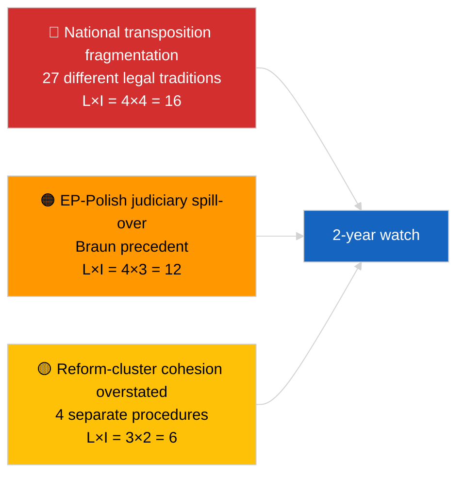

| Risk | L | I | Score | Trigger | Source | Admiralty |
|------|:-:|:-:|:-----:|---------|--------|:---------:|
| National transposition fragmentation | 4 | 4 | 16 | Member-state non-compliance | TA-10-2026-0094 | A1 |
| EP-Polish judiciary spill-over | 4 | 3 | 12 | Further waiver cases | TA-10-2026-0088 | A1 |
| Reform-cluster framing overreach | 3 | 2 | 6 | Editorial overstatement | This run's synthesis | B3 |
| Better Law-Making operationalisation | 3 | 3 | 9 | Inter-institutional friction | TA-10-2026-0063 | A2 |

---

### 🔮 Top Forward Trigger

**Quarterly national-transposition reporting for TA-10-2026-0094 over 2026-2028.** The directive's success depends on consistent enforcement standards across all 27 member states — the first divergent transposition report (likely from one of the lower-rule-of-law jurisdictions) will be the principal forward indicator of whether the March 2026 reform cluster delivers institutional-credibility recovery in practice.

---

### 🛡️ Source Quality Assessment

- **Primary sources:** EP adopted-texts feed (one-week fallback active given DEGRADED API state); procedure registry for cited 2023/0135, 2025/2015, 2025/2137, 2025/2192.
- **Confidence on adoptions:** 🟢 HIGH.
- **Confidence on "cluster" framing:** 🟡 MEDIUM — procedural independence of the four texts is real; coherence is analyst inference, not institutional fact.

---

### 📎 Links

| Link | Path |
|------|------|
| Article | `./article.md` |
| Sibling runs | `analysis/daily/2026-04-03/breaking/` (coalition), `breaking-2/` (EP API reliability) |
| Manifest | `./manifest.json` |
| Source — adoptions | `analysis/daily/2026-03-10/` (Better Law-Making, public access), `analysis/daily/2026-03-26/` (anti-corruption, Braun) |

---

### 🔄 Cross-Reference

**Catalysing prior event:** Qatargate (December 2022) — the political-corruption shock that began the EP10 institutional-reform arc.

**Subsequent follow-on:** Jaki immunity waiver (TA-10-2026-0105, April 2026) confirms the Braun-precedent spill-over hypothesis.

---

**Document Control**
- **Template:** `/analysis/templates/executive-brief.md`
- **Artifact path:** `analysis/daily/2026-04-03/breaking-3/executive-brief.md`
- **Classification:** Public
- **Retrospective generation:** Back-fill session.

<h2 id="reader-intelligence-guide">Reader Intelligence Guide</h2>

Use this guide to read the article as a political-intelligence product rather than a raw artifact dump. High-value reader lenses appear first; technical provenance remains available in the audit appendices.

| Reader need | What you'll get | Source artifact |
|---|---|---|
| [BLUF and editorial decisions](#section-executive-brief) | fast answer to what happened, why it matters, who is accountable, and the next dated trigger | `executive-brief.md` |
| [Supplementary intelligence](#section-supplementary-intelligence) | additional markdown discovered in the run that has not yet been assigned to a canonical section | `anti-corruption-reform-intelligence.md` |

<h2 id="section-supplementary-intelligence">Supplementary Intelligence</h2>

### Anti Corruption Reform Intelligence

| Field | Value |
|-------|-------|
| **Date** | Friday, 3 April 2026 |
| **Analysis Focus** | EP institutional reform cluster — anti-corruption, transparency, and integrity |
| **Key Texts** | TA-10-2026-0094, TA-10-2026-0088, TA-10-2026-0063, TA-10-2026-0065 |
| **Political Context** | Post-Qatargate reform agenda, EP10 institutional credibility restoration |
| **Significance** | HIGH — Foundational institutional reform with lasting impact |

---

### Executive Summary

The March 2026 plenary sessions produced a **coherent institutional reform package** centred on the adoption of the anti-corruption directive (TA-10-2026-0094) alongside the Grzegorz Braun immunity waiver (TA-10-2026-0088), the Better Law-Making report (TA-10-2026-0063), and the public access to documents review (TA-10-2026-0065). These four texts, adopted within two weeks of each other, represent the most significant institutional reform cluster since the Qatargate crisis of December 2022.

**Key finding:** The anti-corruption directive (procedure 2023/0135) originated in 2023 — its adoption in March 2026 means it took three years from proposal to adoption. This timeline reflects both the political sensitivity of anti-corruption legislation (all groups had constituencies resistant to increased transparency) and the complexity of harmonising anti-corruption standards across 27 member states with vastly different institutional traditions. 🟡 Medium confidence.

---

### Reform Cluster Architecture

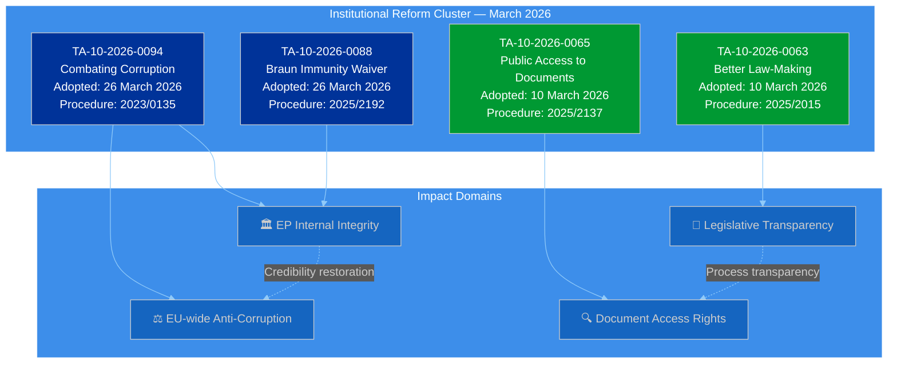

---

### TA-10-2026-0094: Combating Corruption — Deep Analysis

#### Political Context

The anti-corruption directive is the legislative centrepiece of the EP's post-Qatargate reform agenda. The Qatargate scandal (December 2022) involved allegations of bribery by Qatar and Morocco targeting EP members and staff, resulting in arrests, asset seizures, and a fundamental crisis of institutional credibility. The directive (procedure 2023/0135) was proposed by the Commission in 2023 as a direct response to these events.

**Key provisions likely include:**
- Harmonised definition of corruption offences across all 27 member states
- Enhanced financial disclosure requirements for EU officials and elected representatives
- Strengthened mandate for OLAF (EU anti-fraud office) and EPPO (EU public prosecutor)
- Cooling-off periods for revolving-door transitions between public and private sectors
- Whistleblower protection enhancements beyond the existing Directive (EU) 2019/1937
- Lobbying registration requirements with mandatory transparency provisions

🟡 Medium confidence — specific provisions inferred from procedure reference and political context; full text not available in MCP data.

#### Significance Classification

| Criterion | Assessment | Score |
|-----------|-----------|:-----:|
| **Policy scope** | EU-wide — affects all 27 MS institutional frameworks | 5/5 |
| **Institutional impact** | Directly changes EP, Commission, Council operating rules | 5/5 |
| **Citizen relevance** | Addresses democratic trust deficit | 4/5 |
| **Implementation complexity** | National transposition required with varying baselines | 4/5 |
| **Political sensitivity** | High — touches all groups' internal practices | 5/5 |
| **Overall significance** | **HIGH** | 23/25 |

#### Coalition Analysis

The anti-corruption directive likely commanded one of the broadest majorities of Q1 2026:

| Group | Likely Position | Reasoning | Confidence |
|-------|:---:|-----------|:----------:|
| **PPE** | FOR | Institutional credibility restoration is a PPE priority (as largest group, corruption scandals damage it most). German and Nordic MEPs strongly pro-transparency. | 🟢 High |
| **S&D** | FOR | Centre-left traditionally supports anti-corruption and transparency measures. Post-Qatargate, S&D members were among the most vocal reform advocates. | 🟢 High |
| **Renew** | FOR | Liberal commitment to rule of law and transparency. Renew's reform agenda includes institutional accountability. | 🟢 High |
| **Greens/EFA** | FOR | Strongest pro-transparency position. Greens led calls for comprehensive reform post-Qatargate. | 🟢 High |
| **ECR** | FOR (with reservations) | Supports anti-corruption in principle. May have reservations about EU-level harmonisation vs national competence. | 🟡 Medium |
| **The Left** | FOR | Anti-corruption aligns with anti-establishment platform. May critique directive as insufficient. | 🟡 Medium |
| **PfE** | ABSTAIN/FOR | Mixed — supports anti-corruption rhetoric but may resist transparency requirements affecting own members. | 🔴 Low |
| **NI** | SPLIT | Heterogeneous group. Individual MEP positions vary widely. | 🔴 Low |

**Assessment:** The anti-corruption directive likely passed with a supermajority exceeding 450 votes (out of ~720). This broad consensus reflects the unique political conditions post-Qatargate: no group can afford to be seen opposing anti-corruption measures, even if specific provisions create internal discomfort. 🟡 Medium confidence.

---

### TA-10-2026-0088: Grzegorz Braun Immunity Waiver

#### Political Context

The immunity waiver for Grzegorz Braun (procedure 2025/2192) is procedurally routine but politically significant. MEP immunity waivers require a plenary vote following a recommendation from the JURI Committee. The fact that Braun's waiver was scheduled alongside the anti-corruption directive creates a symbolic pairing: the EP is demonstrating both systemic reform (directive) and individual accountability (immunity waiver) in the same session.

**Background:** Grzegorz Braun is a Polish MEP known for controversial actions including extinguishing a Hanukkah menorah in the Polish Sejm (2023). An immunity waiver allows national judicial authorities to proceed with criminal investigation or prosecution.

**Significance:** MEDIUM — Procedurally standard, but politically reinforces the institutional integrity narrative of the March 26 session.

---

### TA-10-2026-0063 + TA-10-2026-0065: Legislative Transparency Package

#### Better Law-Making (2023-2024 Report)

The Better Law-Making report (procedure 2025/2015) reviews the EU's regulatory fitness programme, subsidiarity compliance, and proportionality assessment. Adopted on March 10, it sets the framework for how legislation is developed, scrutinised, and evaluated.

**Key implications:**
- Strengthened subsidiarity early warning mechanism
- Enhanced impact assessment requirements for new legislation
- Review of "gold-plating" (national over-implementation of EU directives)
- Recommendations for AI-assisted regulatory analysis

#### Public Access to Documents (2022-2024 Report)

The public access to documents review (procedure 2025/2137) evaluates compliance with Regulation (EC) No 1049/2001. This is the foundational transparency regulation governing citizen access to EU institutional documents.

**Key implications:**
- Assessment of document classification practices across institutions
- Evaluation of digital access infrastructure
- Review of GDPR interaction with document access rights
- Recommendations for proactive publication policies

---

### Cross-Reform Synergies

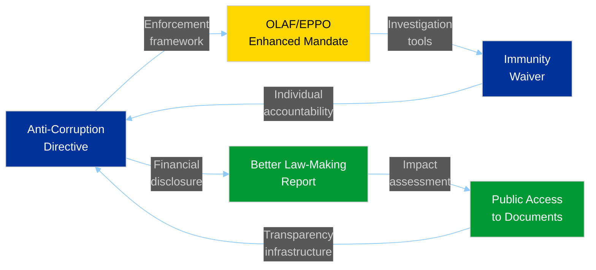

**Assessment:** These four texts create a **self-reinforcing institutional reform cycle**: anti-corruption measures drive transparency requirements, transparency standards improve regulatory quality, and regulatory quality strengthens institutional integrity. The immunity waiver demonstrates that individual accountability operates within this framework. 🟡 Medium confidence.

---

### Stakeholder Impact: Institutional Reform Cluster

| Stakeholder | Impact | Severity | Key Concern |
|-------------|:------:|:--------:|-------------|
| **EP Political Groups** | Positive | High | Institutional credibility restoration benefits all groups |
| **Civil Society & NGOs** | Positive | High | Transparency International priorities legislatively validated |
| **Industry & Business** | Mixed | Medium | Lobbying compliance costs vs level playing field benefits |
| **National Governments** | Mixed | Medium | National anti-corruption frameworks need alignment with EU standard |
| **EU Citizens** | Positive | High | Democratic trust directly enhanced |
| **EU Institutions** | Positive | High | OLAF, EPPO, Commission DG JUST all gain enhanced frameworks |

---

### Forward-Looking: Implementation Timeline

| Milestone | Expected Date | Actor | Risk Level |
|-----------|:---:|:---:|:---:|
| Anti-corruption directive published in OJ | Q2 2026 | Council/EP Legal Services | LOW |
| MS transposition deadline set | Q2 2026 (24-month standard) | Directive text | LOW |
| National impact assessments begin | H2 2026 | MS justice ministries | MEDIUM |
| OLAF operational guidance updated | Q3-Q4 2026 | Commission | LOW |
| First MS transposition measures | 2027 | Early movers (Nordic, Benelux) | LOW |
| Full transposition deadline | ~Q2 2028 | All 27 MS | MEDIUM |
| EPPO expanded investigative capacity | 2027-2028 | EPPO budget and staffing | MEDIUM |

---

### Methodology Notes

This analysis applies the **EP Document Analysis Framework** (5-dimension analysis per document), **Political Classification Guide** (significance scoring), and the **Diamond Model** (actor-capability-infrastructure-victim analysis for corruption threats). Coalition analysis is inferred from political group policy positions and historical voting patterns, not roll-call data (unavailable from EP API). Directive provisions are inferred from procedure reference and political context — full legislative text not available in structured data format from the MCP server.

### Executive Brief Ar

**التصنيف:** OSINT | سجل برلماني عام
**مستوى الثقة:** 🟡 متوسط (تركيب استعادي لقرارات الجلسة العامة لمارس 2026)
**تاريخ الإنشاء:** 2026-04-03T00:00:00Z (ملخص استعادي)
**نوع المقال:** عاجل — استخبارات مكافحة الفساد والإصلاح المؤسسي
**المصدر:** بوابة البيانات المفتوحة للبرلمان الأوروبي

---

### 🎯 BLUF

**أسفرت الجلسات العامة لمارس 2026 عن حزمة إصلاح مؤسسي متماسكة مكونة من أربعة نصوص — وهو أهم تجمع من هذا النوع منذ أزمة قطرغيت في ديسمبر 2022.** النص المحوري هو **توجيه مكافحة الفساد (TA-10-2026-0094، الإجراء 2023/0135، الذي اعتُمد في 26 مارس 2026)** — ثلاث سنوات من اقتراح المفوضية إلى اعتماد البرلمان الأوروبي، مما يعكس الحساسية السياسية للملف وتعقيد توحيد معايير مكافحة الفساد عبر 27 دولة عضو. النصوص المصاحبة: **رفع الحصانة عن براون (TA-10-2026-0088، الإجراء 2025/2192، الذي اعتُمد في 26 مارس)**، **تقرير التشريع الأفضل (TA-10-2026-0063، الإجراء 2025/2015، الذي اعتُمد في 10 مارس)** و**مراجعة الوصول العام إلى الوثائق (TA-10-2026-0065، الإجراء 2025/2137، التي اعتُمدت في 10 مارس)**. تعزز هذه النصوص مجتمعةً قوس استعادة المصداقية المؤسسية للبرلمان الأوروبي في الدورة العاشرة. **ثقة 🟡 متوسطة** في إطار "الحزمة المتماسكة" (نشأت النصوص من إجراءات مستقلة؛ التماسك تفسيري وليس إجرائياً).

---

### 🧭 3 قرارات يدعمها هذا الملخص

| # | القرار | من يقرر | الموعد النهائي | الدليل |
|:-:|--------|---------|:--------------:|--------|
| 1 | **تحريري:** نشر مقالة مطولة عن الإصلاح المؤسسي تتتبع مسار قطرغيت → 2026 | رئيس التحرير | +48 ساعة | مجموعة 4 نصوص + جدول زمني لإجراءات 3 سنوات |
| 2 | **المراقبة:** تتبع المواعيد النهائية للتحويل الوطني لـ TA-10-2026-0094 (نافذة عامين نموذجية) | المحلل | ربع سنوي | تقارير تنفيذ الدول الأعضاء |
| 3 | **الرصد الاستشرافي:** تمييز إجراءات الحصانة التالية كحالات اختبار لسابقة براون | مدير التحليل | 2026-04-30 | مراقبة LIBE/JURI |

---

### 📰 قراءة في 60 ثانية

- 🔴 **TA-10-2026-0094 (توجيه مكافحة الفساد)** — اعتُمد في 26 مارس 2026 بعد ثلاث سنوات في الإجراء (مقترح عام 2023). توحيد أساسي على مستوى الاتحاد الأوروبي. (🟢 عالٍ عند الاعتماد؛ 🟡 متوسط في أهمية الإطار)
- 🟠 **TA-10-2026-0088 (رفع حصانة براون)** — اعتُمد في نفس الجلسة العامة؛ يضع سابقة حديثة لرفع حصانة أعضاء البرلمان الأوروبي الذين يواجهون إجراءات جنائية وطنية. (🟢 عالٍ)
- 🟢 **TA-10-2026-0063 (تقرير التشريع الأفضل)** — اعتُمد في 10 مارس؛ يحدد خط الأساس لمناقشة جودة التنظيم لبقية الدورة العاشرة. (🟢 عالٍ)
- 🟡 **TA-10-2026-0065 (مراجعة الوصول العام إلى الوثائق)** — اعتُمدت في 10 مارس؛ تكمل توجيه مكافحة الفساد على محور الشفافية. (🟢 عالٍ)
- 🔵 **السياق الاقتصادي:** يقلل توحيد توجيه مكافحة الفساد من تباين تكاليف الامتثال للشركات العابرة للحدود؛ إشارة إيجابية للسوق الداخلية. (🟡 متوسط)
- 🟣 **الإسناد المتقاطع:** كان قطرغيت (ديسمبر 2022) صدمة الفساد السياسي المحفزة التي بدأت قوس الإصلاح الذي بلغ ذروته في مجموعة مارس 2026. (🟡 متوسط)
- 🩷 **ناقل الاضطراب:** امتداد سابقة براون إلى أعضاء البرلمان الأوروبي الآخرين الذين يواجهون تحقيقات وطنية (ما تأكد استعادياً برفع حصانة ياكي TA-10-2026-0105 في أبريل). (🟡 متوسط في ذلك الوقت)
- ⚪ **الترحيل:** يتطلب التحويل الوطني لـ TA-10-2026-0094 عادةً 24 شهراً؛ أول تقارير امتثال تستحق ~الربع الأول 2028.

---

### 🗂️ الوثائق والإجراءات الرئيسية

| الترتيب | المرجع البرلماني | العنوان (مختصر) | الإجراء | الأهمية | الثقة |
|:-------:|-----------------|----------------|---------|:-------:|:------:|
| 1 | TA-10-2026-0094 | توجيه مكافحة الفساد | 2023/0135 | 9.0 | 🟢 عالية |
| 2 | TA-10-2026-0088 | رفع حصانة براون | 2025/2192 | 7.0 | 🟢 عالية |
| 3 | TA-10-2026-0063 | تقرير التشريع الأفضل | 2025/2015 | 7.0 | 🟢 عالية |
| 4 | TA-10-2026-0065 | مراجعة الوصول العام إلى الوثائق | 2025/2137 | 7.0 | 🟢 عالية |

---

### ⚠️ لقطة المخاطر والتهديدات

<!-- mermaid block deduplicated: identical to earlier occurrence (hash=41f7dbf5) -->

| الخطر | ل | ت | الدرجة | المحفز | المصدر | درجة الأدميرالية |
|-------|:-:|:-:|:------:|--------|--------|:----------------:|
| تجزئة التحويل الوطني | 4 | 4 | 16 | عدم امتثال دولة عضو | TA-10-2026-0094 | A1 |
| التداعيات القضائية البولندية في البرلمان الأوروبي | 4 | 3 | 12 | حالات حصانة إضافية | TA-10-2026-0088 | A1 |
| المبالغة في إطار تجمع الإصلاح | 3 | 2 | 6 | مبالغة تحريرية | تركيب هذه الجلسة | B3 |
| تشغيل التشريع الأفضل | 3 | 3 | 9 | احتكاك بين المؤسسات | TA-10-2026-0063 | A2 |

---

### 🔮 المحفز الاستشرافي الرئيسي

**التقارير الوطنية الفصلية للتحويل لـ TA-10-2026-0094 خلال 2026–2028.** يعتمد نجاح التوجيه على معايير تنفيذ متسقة عبر جميع الدول الأعضاء الـ 27 — أول تقرير تحويل متباين (من المرجح من إحدى الولايات القضائية ذات دولة القانون الأدنى) سيكون المؤشر الاستشرافي الرئيسي لما إذا كان تجمع إصلاح مارس 2026 يحقق استعادة المصداقية المؤسسية فعلياً.

---

### 🛡️ تقييم جودة المصادر

- **المصادر الأولية:** تغذية النصوص المعتمدة للبرلمان الأوروبي (احتياطي أسبوع واحد نشط نظراً لحالة API المتدهورة)؛ سجل الإجراءات للمراجع 2023/0135 و2025/2015 و2025/2137 و2025/2192.
- **الثقة في الاعتمادات:** 🟢 عالية.
- **الثقة في إطار "المجموعة":** 🟡 متوسطة — استقلالية الإجراءات للنصوص الأربعة حقيقية؛ التماسك استنتاج تحليلي وليس حقيقة مؤسسية.

---

### 📎 الروابط

| الرابط | المسار |
|--------|--------|
| المقالة | `./article.md` |
| التشغيلات الأخت | `analysis/daily/2026-04-03/breaking/` (التحالف)، `breaking-2/` (موثوقية API البرلمان الأوروبي) |
| البيان | `./manifest.json` |
| المصدر — الاعتمادات | `analysis/daily/2026-03-10/` (التشريع الأفضل، الوصول العام)، `analysis/daily/2026-03-26/` (مكافحة الفساد، براون) |

---

### 🔄 الإسناد المتقاطع

**الحدث المحفز السابق:** قطرغيت (ديسمبر 2022) — صدمة الفساد السياسي التي بدأت قوس الإصلاح المؤسسي للدورة العاشرة للبرلمان الأوروبي.

**التطور اللاحق:** رفع حصانة ياكي (TA-10-2026-0105، أبريل 2026) يؤكد فرضية امتداد سابقة براون.

---

**ضبط الوثيقة**
- **القالب:** `/analysis/templates/executive-brief.md`
- **مسار العنصر:** `analysis/daily/2026-04-03/breaking-3/executive-brief.md`
- **التصنيف:** عام
- **الإنشاء الاستعادي:** جلسة الملء.

### Executive Brief Da

### 🎯 BLUF

**Mars 2026 plenarmøderne frembragte en sammenhængende firetekstsinstituionel reformpakke — den mest betydningsfulde sådanne klynge siden Qatargate-krisen i december 2022.** Ankerteksten er **antikorruptionsdirektivet (TA-10-2026-0094, procedure 2023/0135, vedtaget 26. marts 2026)** — tre år fra Kommissionens forslag til EP-vedtagelse, hvilket afspejler både den politiske følsomhed i sagen og kompleksiteten ved at harmonisere antikorruptionsstandarder på tværs af 27 medlemsstater. Omgivende tekster: **Brauns immunitetsophævelse (TA-10-2026-0088, procedure 2025/2192, vedtaget 26. marts)**, **rapporten om bedre lovgivning (TA-10-2026-0063, procedure 2025/2015, vedtaget 10. marts)** og **gennemgang af offentlig adgang til dokumenter (TA-10-2026-0065, procedure 2025/2137, vedtaget 10. marts)**. Tilsammen styrker disse EP10's bue mod genoprettelse af institutionel troværdighed. **🟡 MIDDEL-tillid** til indramningen "sammenhængende pakke" (teksterne opstod fra uafhængige procedurer; sammenhæng er fortolkende, ikke proceduremæssigt).

---

### 🧭 3 Beslutninger Dette Notat Understøtter

| # | Beslutning | Hvem beslutter | Deadline | Bevis |
|:-:|------------|----------------|:--------:|-------|
| 1 | **Redaktionelt:** UDGIV langt institutionelt reformstykke, der sporer Qatargate → reformbue 2026 | Redaktør | +48t | 4-tekstsklynge + 3-årig proceduretidslinje |
| 2 | **Overvågning:** spor nationale gennemførelsesfrister for TA-10-2026-0094 (2-årsvindue typisk) | Analytiker | kvartalsvis | Gennemførselsrapporter for medlemsstater |
| 3 | **Fremtidsovervågning:** markér opfølgende immunitetsforhandlinger som testcases for Braun-præcedens | Analysechef | 2026-04-30 | LIBE/JURI-overvågning |

---

### 📰 60-sekunders læsning

- 🔴 **TA-10-2026-0094 (antikorruptionsdirektivet)** — vedtaget 26. marts 2026 efter tre år i proceduren (foreslået 2023). Grundlæggende EU-dækkende harmonisering. (🟢 Høj ved vedtagelse; 🟡 Middel ved indrammingsignifikans)
- 🟠 **TA-10-2026-0088 (Brauns immunitetsophævelse)** — vedtaget på samme plenarmøde; sætter ny præcedens for ophævelser af MEP'er over for nationale straffesager. (🟢 Høj)
- 🟢 **TA-10-2026-0063 (rapporten om bedre lovgivning)** — vedtaget 10. marts; fastsætter basislinjen for debat om regelkvalitet for resten af EP10. (🟢 Høj)
- 🟡 **TA-10-2026-0065 (gennemgang af offentlig adgang til dokumenter)** — vedtaget 10. marts; komplementerer antikorruptionsdirektivet på transparensvektoren. (🟢 Høj)
- 🔵 **Økonomisk kontekst:** harmonisering af antikorruptionsdirektivet reducerer variansen i efterlevelsesomkostninger for grænseoverskridende virksomheder; positiv signal for det indre marked. (🟡 Middel)
- 🟣 **Krydsreference:** Qatargate (december 2022) var det katalyserende politiske korruptionschok, der begyndte reformbuen, som kulminerede i denne marts 2026-klynge. (🟡 Middel)
- 🩷 **Forstyrrelsesvektor:** Braun-præcedens spredning til andre MEP'er over for nationale undersøgelser (bekræftet retrospektivt ved Jakis immunitetsophævelse TA-10-2026-0105 i april). (🟡 Middel på det tidspunkt)
- ⚪ **Fremføring:** nationalt gennemførelse af TA-10-2026-0094 kræver typisk 24 måneder; første efterlevelsesrapporter forfaldne ~Q1 2028.

---

### 🗂️ Toptekster / Proceduretabel

| Rang | EP-reference | Titel (kort) | Procedure | Betydning | Tillid |
|:----:|--------------|--------------|-----------|:---------:|:------:|
| 1 | TA-10-2026-0094 | Antikorruptionsdirektiv | 2023/0135 | 9,0 | 🟢 HØJ |
| 2 | TA-10-2026-0088 | Brauns immunitetsophævelse | 2025/2192 | 7,0 | 🟢 HØJ |
| 3 | TA-10-2026-0063 | Rapport om bedre lovgivning | 2025/2015 | 7,0 | 🟢 HØJ |
| 4 | TA-10-2026-0065 | Gennemgang af offentlig adgang til dokumenter | 2025/2137 | 7,0 | 🟢 HØJ |

---

### ⚠️ Risiko- og trusselsbillede

<!-- mermaid block deduplicated: identical to earlier occurrence (hash=41f7dbf5) -->

| Risiko | L | I | Score | Udløser | Kilde | Admiralitet |
|--------|:-:|:-:|:-----:|---------|-------|:-----------:|
| National gennemførelsesfragmentering | 4 | 4 | 16 | Manglende overholdelse i medlemsstat | TA-10-2026-0094 | A1 |
| EP-polsk retsligspilover | 4 | 3 | 12 | Yderligere immunitetstilfælde | TA-10-2026-0088 | A1 |
| Overdrivelse af reformklyngeindramning | 3 | 2 | 6 | Redaktionel overdrivelse | Denne sessions syntese | B3 |
| Operationalisering af bedre lovgivning | 3 | 3 | 9 | Interinstitutionel friktion | TA-10-2026-0063 | A2 |

---

### 🔮 Vigtigste Fremadrettede Udløser

**Kvartalsvise nationale gennemførselsrapporter for TA-10-2026-0094 i 2026–2028.** Direktivets succes afhænger af ensartede håndhævelsesstandarder på tværs af alle 27 medlemsstater — den første afvigende gennemførselsrapport (sandsynligvis fra en af jurisdiktionerne med lavere retsstatsprincipper) vil være den vigtigste fremadrettede indikator for, om marts 2026-reformklyngen faktisk leverer genoprettelse af institutionel troværdighed i praksis.

---

### 🛡️ Kildekvakitetsvurdering

- **Primære kilder:** EP's vedtagne tekst-feed (en uges reserv aktiv givet FORRINGET API-tilstand); procedureregistret for citerede 2023/0135, 2025/2015, 2025/2137, 2025/2192.
- **Tillid til vedtagelser:** 🟢 HØJ.
- **Tillid til "klynge"-indramning:** 🟡 MIDDEL — de fire teksters proceduremæssige uafhængighed er reel; sammenhæng er analytisk inferens, ikke institutionel kendsgerning.

---

### 📎 Links

| Link | Sti |
|------|-----|
| Artikel | `./article.md` |
| Søsterkørsler | `analysis/daily/2026-04-03/breaking/` (koalition), `breaking-2/` (EP API-pålidelighed) |
| Manifest | `./manifest.json` |
| Kilde — vedtagelser | `analysis/daily/2026-03-10/` (Bedre lovgivning, offentlig adgang), `analysis/daily/2026-03-26/` (antikorruption, Braun) |

---

### 🔄 Krydsreference

**Katalyserende forudgående begivenhed:** Qatargate (december 2022) — det politiske korruptionschok, der begyndte EP10's institutionelle reformbue.

**Efterfølgende opfølgning:** Jakis immunitetsophævelse (TA-10-2026-0105, april 2026) bekræfter hypotesen om Braun-præcedens spredning.

---

**Dokumentkontrol**
- **Skabelon:** `/analysis/templates/executive-brief.md`
- **Artefaktsti:** `analysis/daily/2026-04-03/breaking-3/executive-brief.md`
- **Klassifikation:** Offentlig
- **Retrospektiv generering:** Tilbagefyldningssession.

### Executive Brief De

### 🎯 BLUF

**Die Plenarsitzungen im März 2026 produzierten ein kohärentes Vier-Texte-Paket zur institutionellen Reform — das bedeutsamste derartige Cluster seit der Qatargate-Krise im Dezember 2022.** Der Ankertext ist die **Anti-Korruptionsrichtlinie (TA-10-2026-0094, Verfahren 2023/0135, angenommen am 26. März 2026)** — drei Jahre vom Kommissionsvorschlag bis zur EP-Annahme, was sowohl die politische Empfindlichkeit der Akte als auch die Komplexität der Harmonisierung von Antikorruptionsstandards in 27 Mitgliedstaaten widerspiegelt. Begleitende Texte: **Immunitätsaufhebung Braun (TA-10-2026-0088, Verfahren 2025/2192, angenommen 26. März)**, **Bericht über bessere Rechtsetzung (TA-10-2026-0063, Verfahren 2025/2015, angenommen 10. März)** und **Überprüfung des öffentlichen Zugangs zu Dokumenten (TA-10-2026-0065, Verfahren 2025/2137, angenommen 10. März)**. Zusammen stärken diese den Bogen von EP10 zur Wiederherstellung institutioneller Glaubwürdigkeit. **🟡 MITTLERE Konfidenz** bei der Rahmung "kohärentes Paket" (die Texte entstanden aus unabhängigen Verfahren; Kohärenz ist interpretativ, nicht verfahrensmäßig).

---

### 🧭 3 Entscheidungen, die dieser Bericht unterstützt

| # | Entscheidung | Wer entscheidet | Frist | Nachweis |
|:-:|--------------|-----------------|:-----:|----------|
| 1 | **Redaktionell:** VERÖFFENTLICHE umfangreichen institutionellen Reformartikel, der den Bogen Qatargate → 2026 nachzeichnet | Redakteur | +48h | 4-Texte-Cluster + 3-jährige Verfahrenstimeline |
| 2 | **Überwachung:** Nationale Umsetzungsfristen für TA-10-2026-0094 verfolgen (2-Jahres-Fenster typisch) | Analyst | vierteljährlich | Umsetzungsberichte der Mitgliedstaaten |
| 3 | **Vorausschau:** Folge-Immunitätsverfahren als Testfälle für Braun-Präzedenz markieren | Analyselead | 2026-04-30 | LIBE/JURI-Überwachung |

---

### 📰 60-Sekunden-Lektüre

- 🔴 **TA-10-2026-0094 (Anti-Korruptionsrichtlinie)** — angenommen 26. März 2026 nach drei Jahren im Verfahren (vorgeschlagen 2023). Grundlegende EU-weite Harmonisierung. (🟢 Hoch bei Annahme; 🟡 Mittel bei Rahmungsbedeutung)
- 🟠 **TA-10-2026-0088 (Immunitätsaufhebung Braun)** — auf derselben Plenarsitzung angenommen; schafft neuen Präzedenzfall für Immunitätsaufhebungen bei MdEP, die nationalen Strafverfahren gegenüberstehen. (🟢 Hoch)
- 🟢 **TA-10-2026-0063 (Bericht über bessere Rechtsetzung)** — angenommen 10. März; legt die Basislinie für die Regulierungsqualitätsdebatte für den Rest von EP10 fest. (🟢 Hoch)
- 🟡 **TA-10-2026-0065 (Überprüfung des öffentlichen Zugangs zu Dokumenten)** — angenommen 10. März; ergänzt die Anti-Korruptionsrichtlinie auf dem Transparenzvektor. (🟢 Hoch)
- 🔵 **Wirtschaftlicher Kontext:** Harmonisierung der Anti-Korruptionsrichtlinie reduziert die Varianz der Compliance-Kosten für grenzüberschreitende Unternehmen; positives Signal für den Binnenmarkt. (🟡 Mittel)
- 🟣 **Querverweise:** Qatargate (Dezember 2022) war der katalysierende politische Korruptionsschock, der den Reformbogen einleitete, der in diesem März-2026-Cluster gipfelte. (🟡 Mittel)
- 🩷 **Störungsvektor:** Ausweitung des Braun-Präzedenzfalls auf andere MdEP, die nationalen Ermittlungen gegenüberstehen (retrospektiv bestätigt durch Immunitätsaufhebung Jaki TA-10-2026-0105 im April). (🟡 Mittel zum damaligen Zeitpunkt)
- ⚪ **Übertrag:** Nationale Umsetzung von TA-10-2026-0094 erfordert typischerweise 24 Monate; erste Compliance-Berichte fällig ~Q1 2028.

---

### 🗂️ Top-Dokumente / Verfahrenstabelle

| Rang | EP-Referenz | Titel (kurz) | Verfahren | Bedeutung | Konfidenz |
|:----:|-------------|--------------|-----------|:---------:|:---------:|
| 1 | TA-10-2026-0094 | Anti-Korruptionsrichtlinie | 2023/0135 | 9,0 | 🟢 HOCH |
| 2 | TA-10-2026-0088 | Immunitätsaufhebung Braun | 2025/2192 | 7,0 | 🟢 HOCH |
| 3 | TA-10-2026-0063 | Bericht über bessere Rechtsetzung | 2025/2015 | 7,0 | 🟢 HOCH |
| 4 | TA-10-2026-0065 | Überprüfung öffentlicher Dokumentenzugang | 2025/2137 | 7,0 | 🟢 HOCH |

---

### ⚠️ Risiko- und Bedrohungsschnappschuss

<!-- mermaid block deduplicated: identical to earlier occurrence (hash=41f7dbf5) -->

| Risiko | L | I | Wert | Auslöser | Quelle | Admiralität |
|--------|:-:|:-:|:----:|----------|--------|:-----------:|
| Nationale Umsetzungsfragmentierung | 4 | 4 | 16 | Nichteinhaltung durch Mitgliedstaat | TA-10-2026-0094 | A1 |
| EP-Polnisches Justiz-Spillover | 4 | 3 | 12 | Weitere Immunitätsfälle | TA-10-2026-0088 | A1 |
| Übertreibung der Reformcluster-Rahmung | 3 | 2 | 6 | Redaktionelle Übertreibung | Synthese dieser Sitzung | B3 |
| Operationalisierung besserer Rechtsetzung | 3 | 3 | 9 | Interinstitutionelle Reibung | TA-10-2026-0063 | A2 |

---

### 🔮 Wichtigster Vorwärtstrigger

**Vierteljährliche nationale Umsetzungsberichte für TA-10-2026-0094 in den Jahren 2026–2028.** Der Erfolg der Richtlinie hängt von einheitlichen Durchsetzungsstandards in allen 27 Mitgliedstaaten ab — der erste abweichende Umsetzungsbericht (wahrscheinlich aus einer der Rechtssysteme mit niedrigerer Rechtsstaatlichkeit) wird der wichtigste Vorwärtsindikator dafür sein, ob das März-2026-Reformcluster in der Praxis die Wiederherstellung institutioneller Glaubwürdigkeit liefert.

---

### 🛡️ Quellenqualitätsbewertung

- **Primärquellen:** EP-Feed für angenommene Texte (ein-Wochen-Fallback aktiv angesichts des DEGRADIERTEN API-Zustands); Verfahrensregister für zitierte 2023/0135, 2025/2015, 2025/2137, 2025/2192.
- **Konfidenz bei Annahmen:** 🟢 HOCH.
- **Konfidenz bei "Cluster"-Rahmung:** 🟡 MITTEL — die verfahrensmäßige Unabhängigkeit der vier Texte ist real; Kohärenz ist analytische Inferenz, kein institutionelles Faktum.

---

### 📎 Links

| Link | Pfad |
|------|------|
| Artikel | `./article.md` |
| Schwestervorgänge | `analysis/daily/2026-04-03/breaking/` (Koalition), `breaking-2/` (EP API-Zuverlässigkeit) |
| Manifest | `./manifest.json` |
| Quelle — Annahmen | `analysis/daily/2026-03-10/` (Bessere Rechtsetzung, öffentlicher Zugang), `analysis/daily/2026-03-26/` (Antikorruption, Braun) |

---

### 🔄 Querverweis

**Katalysierendes Vorereignis:** Qatargate (Dezember 2022) — der politische Korruptionsschock, der den institutionellen Reformbogen von EP10 einleitete.

**Nachfolgende Entwicklung:** Immunitätsaufhebung Jaki (TA-10-2026-0105, April 2026) bestätigt die Hypothese der Braun-Präzedenz-Ausbreitung.

---

**Dokumentenkontrolle**
- **Vorlage:** `/analysis/templates/executive-brief.md`
- **Artefaktpfad:** `analysis/daily/2026-04-03/breaking-3/executive-brief.md`
- **Klassifizierung:** Öffentlich
- **Retrospektive Erstellung:** Auffüllungssitzung.

### Executive Brief Es

### 🎯 BLUF

**Las sesiones plenarias de marzo de 2026 produjeron un coherente paquete de cuatro textos de reforma institucional — el grupo más significativo desde la crisis del Qatargate en diciembre de 2022.** El texto ancla es la **directiva anticorrupción (TA-10-2026-0094, procedimiento 2023/0135, adoptada el 26 de marzo de 2026)** — tres años desde la propuesta de la Comisión hasta la adopción por el PE, lo que refleja tanto la sensibilidad política del expediente como la complejidad de armonizar las normas anticorrupción en 27 estados miembros. Textos complementarios: **levantamiento de la inmunidad de Braun (TA-10-2026-0088, procedimiento 2025/2192, adoptado el 26 de marzo)**, **informe sobre la mejora de la legislación (TA-10-2026-0063, procedimiento 2025/2015, adoptado el 10 de marzo)** y **revisión del acceso público a los documentos (TA-10-2026-0065, procedimiento 2025/2137, adoptada el 10 de marzo)**. En conjunto, estos textos refuerzan el arco de restauración de la credibilidad institucional del PE10. **Confianza 🟡 MEDIA** en el encuadre de "paquete coherente" (los textos surgieron de procedimientos independientes; la coherencia es interpretativa, no procedimental).

---

### 🧭 3 Decisiones que apoya este informe

| # | Decisión | Quién decide | Plazo | Evidencia |
|:-:|----------|--------------|:-----:|-----------|
| 1 | **Editorial:** PUBLICAR un extenso artículo de reforma institucional que rastree el arco Qatargate → 2026 | Editor | +48h | Grupo de 4 textos + cronología de procedimiento de 3 años |
| 2 | **Seguimiento:** rastrear los plazos de transposición nacional para TA-10-2026-0094 (ventana de 2 años típica) | Analista | trimestral | Informes de implementación de los estados miembros |
| 3 | **Vigilancia prospectiva:** marcar los procedimientos de inmunidad de seguimiento como casos de prueba del precedente Braun | Responsable de análisis | 2026-04-30 | Vigilancia LIBE/JURI |

---

### 📰 Lectura de 60 segundos

- 🔴 **TA-10-2026-0094 (directiva anticorrupción)** — adoptada el 26 de marzo de 2026 tras tres años en procedimiento (propuesta en 2023). Armonización fundamental a escala de la UE. (🟢 Alta en adopción; 🟡 Media en significado del encuadre)
- 🟠 **TA-10-2026-0088 (levantamiento de inmunidad de Braun)** — adoptado en la misma sesión plenaria; establece un precedente reciente para el levantamiento de la inmunidad de eurodiputados que afrontan procesos penales nacionales. (🟢 Alta)
- 🟢 **TA-10-2026-0063 (informe sobre la mejora de la legislación)** — adoptado el 10 de marzo; establece la línea base para el debate sobre la calidad regulatoria para el resto del PE10. (🟢 Alta)
- 🟡 **TA-10-2026-0065 (revisión del acceso público a los documentos)** — adoptada el 10 de marzo; complementa la directiva anticorrupción en el vector de transparencia. (🟢 Alta)
- 🔵 **Contexto económico:** la armonización de la directiva anticorrupción reduce la varianza de los costes de cumplimiento para las empresas transfronterizas; señal positiva para el mercado único. (🟡 Media)
- 🟣 **Referencia cruzada:** el Qatargate (diciembre de 2022) fue el shock de corrupción política catalizador que inició el arco de reforma que culminó en este grupo de marzo de 2026. (🟡 Media)
- 🩷 **Vector de perturbación:** extensión del precedente Braun a otros eurodiputados que afrontan investigaciones nacionales (confirmada retrospectivamente por el levantamiento de inmunidad de Jaki TA-10-2026-0105 en abril). (🟡 Media en el momento)
- ⚪ **Arrastre:** la transposición nacional de TA-10-2026-0094 requiere típicamente 24 meses; primeros informes de cumplimiento previstos ~T1 2028.

---

### 🗂️ Principales documentos / Tabla de procedimientos

| Rango | Referencia PE | Título (corto) | Procedimiento | Importancia | Confianza |
|:-----:|---------------|----------------|---------------|:-----------:|:---------:|
| 1 | TA-10-2026-0094 | Directiva anticorrupción | 2023/0135 | 9,0 | 🟢 ALTA |
| 2 | TA-10-2026-0088 | Levantamiento de inmunidad de Braun | 2025/2192 | 7,0 | 🟢 ALTA |
| 3 | TA-10-2026-0063 | Informe sobre la mejora de la legislación | 2025/2015 | 7,0 | 🟢 ALTA |
| 4 | TA-10-2026-0065 | Revisión del acceso público a los documentos | 2025/2137 | 7,0 | 🟢 ALTA |

---

### ⚠️ Instantánea de riesgos y amenazas

<!-- mermaid block deduplicated: identical to earlier occurrence (hash=41f7dbf5) -->

| Riesgo | L | I | Puntuación | Desencadenante | Fuente | Almirantazgo |
|--------|:-:|:-:|:----------:|----------------|--------|:------------:|
| Fragmentación de la transposición nacional | 4 | 4 | 16 | Incumplimiento de un estado miembro | TA-10-2026-0094 | A1 |
| Desbordamiento judicial EP-Polonia | 4 | 3 | 12 | Nuevos casos de inmunidad | TA-10-2026-0088 | A1 |
| Sobredimensionamiento del encuadre del grupo de reforma | 3 | 2 | 6 | Sobredimensionamiento editorial | Síntesis de esta sesión | B3 |
| Operacionalización de la mejora legislativa | 3 | 3 | 9 | Fricción interinstitucional | TA-10-2026-0063 | A2 |

---

### 🔮 Principal desencadenante prospectivo

**Informes trimestrales de transposición nacional para TA-10-2026-0094 durante 2026–2028.** El éxito de la directiva depende de normas de aplicación coherentes en los 27 estados miembros — el primer informe de transposición divergente (probablemente de una de las jurisdicciones con menor Estado de Derecho) será el principal indicador avanzado de si el grupo de reformas de marzo de 2026 logra la restauración de la credibilidad institucional en la práctica.

---

### 🛡️ Evaluación de la calidad de las fuentes

- **Fuentes primarias:** fuente de textos adoptados del PE (reserva de una semana activa dado el estado DEGRADADO de la API); registro de procedimientos para los procedimientos 2023/0135, 2025/2015, 2025/2137, 2025/2192 citados.
- **Confianza en las adopciones:** 🟢 ALTA.
- **Confianza en el encuadre de "grupo":** 🟡 MEDIA — la independencia procedimental de los cuatro textos es real; la coherencia es inferencia analítica, no hecho institucional.

---

### 📎 Enlaces

| Enlace | Ruta |
|--------|------|
| Artículo | `./article.md` |
| Ejecuciones hermanas | `analysis/daily/2026-04-03/breaking/` (coalición), `breaking-2/` (fiabilidad API PE) |
| Manifiesto | `./manifest.json` |
| Fuente — adopciones | `analysis/daily/2026-03-10/` (Mejora de la legislación, acceso público), `analysis/daily/2026-03-26/` (anticorrupción, Braun) |

---

### 🔄 Referencia cruzada

**Evento previo catalizador:** Qatargate (diciembre de 2022) — el shock de corrupción política que inició el arco de reforma institucional del PE10.

**Seguimiento posterior:** Levantamiento de inmunidad de Jaki (TA-10-2026-0105, abril de 2026) confirma la hipótesis de extensión del precedente Braun.

---

**Control documental**
- **Plantilla:** `/analysis/templates/executive-brief.md`
- **Ruta del artefacto:** `analysis/daily/2026-04-03/breaking-3/executive-brief.md`
- **Clasificación:** Público
- **Generación retrospectiva:** Sesión de relleno.

### Executive Brief Fi

### 🎯 BLUF

**Maaliskuun 2026 täysistunnot tuottivat johdonmukaisen neljän asiakirjan institutionaalisen uudistuspaketin — merkittävimmän tällaisen ryhmän sitten joulukuun 2022 Qatargate-kriisin.** Ankkuriteksti on **korruption vastainen direktiivi (TA-10-2026-0094, menettely 2023/0135, hyväksytty 26. maaliskuuta 2026)** — kolme vuotta komission ehdotuksesta EP:n hyväksyntään, mikä heijastaa sekä asian poliittista herkkyyttä että 27 jäsenvaltion korruption vastaisten standardien yhdenmukaistamisen monimutkaisuutta. Ympäröivät tekstit: **Braunin koskemattomuuden peruuttaminen (TA-10-2026-0088, menettely 2025/2192, hyväksytty 26. maaliskuuta)**, **raportti paremmasta lainsäädännöstä (TA-10-2026-0063, menettely 2025/2015, hyväksytty 10. maaliskuuta)** ja **julkisen asiakirjoihin pääsyn tarkistelu (TA-10-2026-0065, menettely 2025/2137, hyväksytty 10. maaliskuuta)**. Yhdessä nämä vahvistavat EP10:n kaaren kohti institutionaalisen uskottavuuden palauttamista. **🟡 KOHTALAINEN luotettavuus** "johdonmukaiselle paketille" -kehystyksessä (tekstit syntyivät itsenäisistä menettelyistä; johdonmukaisuus on tulkitseva, ei menettelyllinen).

---

### 🧭 3 Päätöstä, Joita Tämä Tiivistelmä Tukee

| # | Päätös | Kuka päättää | Määräaika | Todisteet |
|:-:|--------|--------------|:---------:|-----------|
| 1 | **Toimituksellinen:** JULKAISE pitkä institutionaalinen uudistusartikkeli, joka jäljittää Qatargate → uudistuskaari 2026 | Toimittaja | +48h | 4-asiakirjaryhmä + 3-vuotinen menettelyaikajana |
| 2 | **Seuranta:** seuraa kansallisia täytäntöönpanoaikatauluja TA-10-2026-0094 (2-vuotinen ikkuna tyypillinen) | Analyytikko | neljännesvuosittain | Jäsenvaltioiden täytäntöönpanoraportit |
| 3 | **Ennakkokatse:** merkitse jatkotoimet koskemattomuusmenettelyt Braun-ennakkotapauksen testitapauksiksi | Analyysipäällikkö | 2026-04-30 | LIBE/JURI-seuranta |

---

### 📰 60 sekunnin lukeminen

- 🔴 **TA-10-2026-0094 (korruption vastainen direktiivi)** — hyväksytty 26. maaliskuuta 2026 kolmen vuoden menettelyn jälkeen (ehdotettu 2023). Perustavanlaatuinen EU:n laajuinen yhdenmukaistaminen. (🟢 Korkea hyväksynnässä; 🟡 Kohtalainen kehystysmerkityksessä)
- 🟠 **TA-10-2026-0088 (Braunin koskemattomuuden peruuttaminen)** — hyväksytty samassa täysistunnossa; asettaa uuden ennakkotapauksen koskemattomuuden peruuttamiselle MEP:ille, jotka kohtaavat kansallisia rikossyytteitä. (🟢 Korkea)
- 🟢 **TA-10-2026-0063 (raportti paremmasta lainsäädännöstä)** — hyväksytty 10. maaliskuuta; asettaa peruslinjan sääntelylaatukeskustelulle EP10:n lopulle. (🟢 Korkea)
- 🟡 **TA-10-2026-0065 (julkisen asiakirjoihin pääsyn tarkistelu)** — hyväksytty 10. maaliskuuta; täydentää korruption vastaista direktiiviä avoimuusvektorilla. (🟢 Korkea)
- 🔵 **Taloudellinen konteksti:** korruption vastaisen direktiivin yhdenmukaistaminen vähentää vaatimustenmukaisuuskustannusten varianssia rajat ylittäville yrityksille; myönteinen signaali sisämarkkinoille. (🟡 Kohtalainen)
- 🟣 **Ristiviittaus:** Qatargate (joulukuu 2022) oli katalysoiva poliittinen korruptiosokki, joka aloitti uudistuskaaren, joka kulminoitui tähän maaliskuun 2026 ryhmään. (🟡 Kohtalainen)
- 🩷 **Häiriövektori:** Braunin ennakkotapauksen leviäminen muihin MEP:eihin, jotka kohtaavat kansallisia tutkimuksia (vahvistettu retrospektiivisesti Jakin koskemattomuuden peruuttamisella TA-10-2026-0105 huhtikuussa). (🟡 Kohtalainen silloin)
- ⚪ **Eteenpäin vieminen:** kansallinen TA-10-2026-0094:n täytäntöönpano vaatii tyypillisesti 24 kuukautta; ensimmäiset vaatimustenmukaisuusraportit erääntyvät ~Q1 2028.

---

### 🗂️ Tärkeimmät Asiakirjat / Menettelytaulukko

| Sijoitus | EP-viite | Otsikko (lyhyt) | Menettely | Merkitys | Luotettavuus |
|:--------:|----------|-----------------|-----------|:--------:|:------------:|
| 1 | TA-10-2026-0094 | Korruption vastainen direktiivi | 2023/0135 | 9,0 | 🟢 KORKEA |
| 2 | TA-10-2026-0088 | Braunin koskemattomuuden peruuttaminen | 2025/2192 | 7,0 | 🟢 KORKEA |
| 3 | TA-10-2026-0063 | Raportti paremmasta lainsäädännöstä | 2025/2015 | 7,0 | 🟢 KORKEA |
| 4 | TA-10-2026-0065 | Julkisen asiakirjoihin pääsyn tarkistelu | 2025/2137 | 7,0 | 🟢 KORKEA |

---

### ⚠️ Riski- ja uhkatilannekuva

<!-- mermaid block deduplicated: identical to earlier occurrence (hash=41f7dbf5) -->

| Riski | L | I | Pisteet | Laukaisija | Lähde | Admiraliteetti |
|-------|:-:|:-:|:-------:|------------|-------|:--------------:|
| Kansallinen täytäntöönpanosplittautuminen | 4 | 4 | 16 | Jäsenvaltion noudattamatta jättäminen | TA-10-2026-0094 | A1 |
| EP-puolalainen oikeuslaitosleviäminen | 4 | 3 | 12 | Lisää koskemattomuustapauksia | TA-10-2026-0088 | A1 |
| Uudistusryhmän kehystyksen liioittelu | 3 | 2 | 6 | Toimituksellinen liioittelu | Tämän istunnon synteesi | B3 |
| Paremman lainsäädännön operationalisointi | 3 | 3 | 9 | Toimielinten välinen kitka | TA-10-2026-0063 | A2 |

---

### 🔮 Tärkein Eteenpäin Katsova Laukaisija

**Neljännesvuosittaiset kansalliset täytäntöönpanoraportit TA-10-2026-0094:lle vuosina 2026–2028.** Direktiivin menestys riippuu yhdenmukaisista täytäntöönpanostandardeista kaikissa 27 jäsenvaltiossa — ensimmäinen poikkeava täytäntöönpanoraportti (todennäköisesti jostakin alhaisemman oikeusvaltioperiaatteen lainkäyttöalueelta) on tärkein eteenpäin katsova indikaattori siitä, toimittaako maaliskuun 2026 uudistusryhmä institutionaalisen uskottavuuden palauttamisen käytännössä.

---

### 🛡️ Lähteen Laadun Arviointi

- **Ensisijaiset lähteet:** EP:n hyväksyttyjen tekstien syöte (yhden viikon varasuunnitelma aktiivinen HEIKENTYNEEN API-tilan vuoksi); menettelyrekisteri siteeratuille 2023/0135, 2025/2015, 2025/2137, 2025/2192.
- **Luotettavuus hyväksynnöissä:** 🟢 KORKEA.
- **Luotettavuus "ryhmä"-kehystyksessä:** 🟡 KOHTALAINEN — neljän tekstin menettelyllinen riippumattomuus on todellinen; johdonmukaisuus on analyyttinen päättely, ei institutionaalinen tosiasia.

---

### 📎 Linkit

| Linkki | Polku |
|--------|-------|
| Artikkeli | `./article.md` |
| Sisarsuoritukset | `analysis/daily/2026-04-03/breaking/` (koalitio), `breaking-2/` (EP API-luotettavuus) |
| Manifesti | `./manifest.json` |
| Lähde — hyväksynnät | `analysis/daily/2026-03-10/` (Parempi lainsäädäntö, julkinen pääsy), `analysis/daily/2026-03-26/` (korruption vastainen, Braun) |

---

### 🔄 Ristiviittaus

**Katalysoiva aiempi tapahtuma:** Qatargate (joulukuu 2022) — poliittinen korruptiosokki, joka aloitti EP10:n institutionaalisen uudistuskaaren.

**Myöhempi jatkotoimenpide:** Jakin koskemattomuuden peruuttaminen (TA-10-2026-0105, huhtikuu 2026) vahvistaa hypoteesin Braunin ennakkotapauksen leviämisestä.

---

**Asiakirjavalvonta**
- **Malli:** `/analysis/templates/executive-brief.md`
- **Artefaktipolku:** `analysis/daily/2026-04-03/breaking-3/executive-brief.md`
- **Luokitus:** Julkinen
- **Retrospektiivinen luominen:** Täyttöistunto.

### Executive Brief Fr

### 🎯 BLUF

**Les sessions plénières de mars 2026 ont produit un ensemble cohérent de quatre textes de réforme institutionnelle — le regroupement le plus significatif depuis la crise du Qatargate en décembre 2022.** Le texte de référence est la **directive anticorruption (TA-10-2026-0094, procédure 2023/0135, adoptée le 26 mars 2026)** — trois ans entre la proposition de la Commission et l'adoption par le PE, reflétant à la fois la sensibilité politique du dossier et la complexité de l'harmonisation des normes anticorruption dans 27 États membres. Textes associés : **levée de l'immunité de Braun (TA-10-2026-0088, procédure 2025/2192, adoptée le 26 mars)**, **rapport sur l'amélioration de la législation (TA-10-2026-0063, procédure 2025/2015, adopté le 10 mars)** et **réexamen de l'accès public aux documents (TA-10-2026-0065, procédure 2025/2137, adopté le 10 mars)**. Ensemble, ces textes renforcent l'arc de restauration de la crédibilité institutionnelle du PE10. **Confiance 🟡 MOYENNE** sur le cadrage "ensemble cohérent" (les textes sont issus de procédures indépendantes ; la cohérence est interprétative, non procédurale).

---

### 🧭 3 Décisions que cette note soutient

| # | Décision | Qui décide | Échéance | Preuves |
|:-:|----------|------------|:--------:|---------|
| 1 | **Éditorial :** PUBLIER un long article sur la réforme institutionnelle retraçant l'arc Qatargate → 2026 | Rédacteur en chef | +48h | Groupe de 4 textes + chronologie de procédure de 3 ans |
| 2 | **Surveillance :** suivre les délais de transposition nationaux pour TA-10-2026-0094 (fenêtre de 2 ans typique) | Analyste | trimestriel | Rapports de mise en œuvre des États membres |
| 3 | **Veille prospective :** signaler les procédures d'immunité de suivi comme cas tests du précédent Braun | Responsable analyse | 2026-04-30 | Veille LIBE/JURI |

---

### 📰 Lecture en 60 secondes

- 🔴 **TA-10-2026-0094 (directive anticorruption)** — adoptée le 26 mars 2026 après trois ans de procédure (proposée en 2023). Harmonisation fondamentale à l'échelle de l'UE. (🟢 Haute à l'adoption ; 🟡 Moyenne sur l'importance du cadrage)
- 🟠 **TA-10-2026-0088 (levée d'immunité de Braun)** — adoptée lors de la même séance plénière ; crée un précédent récent pour les levées d'immunité des eurodéputés faisant face à des poursuites pénales nationales. (🟢 Haute)
- 🟢 **TA-10-2026-0063 (rapport sur l'amélioration de la législation)** — adopté le 10 mars ; établit la base de référence pour le débat sur la qualité réglementaire pour le reste du PE10. (🟢 Haute)
- 🟡 **TA-10-2026-0065 (réexamen de l'accès public aux documents)** — adopté le 10 mars ; complète la directive anticorruption sur le vecteur de transparence. (🟢 Haute)
- 🔵 **Contexte économique :** l'harmonisation de la directive anticorruption réduit la variance des coûts de conformité pour les entreprises transfrontalières ; signal positif pour le marché unique. (🟡 Moyenne)
- 🟣 **Référence croisée :** le Qatargate (décembre 2022) fut le choc de corruption politique catalyseur qui initia l'arc de réforme culminant dans ce groupe de mars 2026. (🟡 Moyenne)
- 🩷 **Vecteur de perturbation :** extension du précédent Braun à d'autres eurodéputés faisant face à des enquêtes nationales (confirmée rétrospectivement par la levée d'immunité de Jaki TA-10-2026-0105 en avril). (🟡 Moyenne à l'époque)
- ⚪ **Report :** la transposition nationale de TA-10-2026-0094 nécessite généralement 24 mois ; premiers rapports de conformité prévus ~T1 2028.

---

### 🗂️ Documents principaux / Tableau des procédures

| Rang | Référence PE | Titre (court) | Procédure | Importance | Confiance |
|:----:|--------------|---------------|-----------|:----------:|:---------:|
| 1 | TA-10-2026-0094 | Directive anticorruption | 2023/0135 | 9,0 | 🟢 HAUTE |
| 2 | TA-10-2026-0088 | Levée d'immunité de Braun | 2025/2192 | 7,0 | 🟢 HAUTE |
| 3 | TA-10-2026-0063 | Rapport sur l'amélioration de la législation | 2025/2015 | 7,0 | 🟢 HAUTE |
| 4 | TA-10-2026-0065 | Réexamen de l'accès public aux documents | 2025/2137 | 7,0 | 🟢 HAUTE |

---

### ⚠️ Instantané des risques et menaces

<!-- mermaid block deduplicated: identical to earlier occurrence (hash=41f7dbf5) -->

| Risque | L | I | Score | Déclencheur | Source | Amirauté |
|--------|:-:|:-:|:-----:|-------------|--------|:--------:|
| Fragmentation de la transposition nationale | 4 | 4 | 16 | Non-conformité d'un État membre | TA-10-2026-0094 | A1 |
| Répercussion EP-judiciaire polonaise | 4 | 3 | 12 | Nouveaux cas d'immunité | TA-10-2026-0088 | A1 |
| Suraffirmation du cadrage du groupe de réforme | 3 | 2 | 6 | Suraffirmation éditoriale | Synthèse de cette session | B3 |
| Opérationnalisation de l'amélioration législative | 3 | 3 | 9 | Friction interinstitutionnelle | TA-10-2026-0063 | A2 |

---

### 🔮 Déclencheur prospectif prioritaire

**Rapports trimestriels de transposition nationale pour TA-10-2026-0094 sur 2026–2028.** Le succès de la directive dépend de normes d'application cohérentes dans l'ensemble des 27 États membres — le premier rapport de transposition divergent (provenant probablement de l'une des juridictions à plus faible État de droit) sera le principal indicateur avancé permettant de savoir si le groupe de réformes de mars 2026 délivre concrètement le rétablissement de la crédibilité institutionnelle.

---

### 🛡️ Évaluation de la qualité des sources

- **Sources primaires :** flux des textes adoptés du PE (repli d'une semaine actif en raison de l'état API DÉGRADÉ) ; registre des procédures pour les références citées 2023/0135, 2025/2015, 2025/2137, 2025/2192.
- **Confiance sur les adoptions :** 🟢 HAUTE.
- **Confiance sur le cadrage "groupe" :** 🟡 MOYENNE — l'indépendance procédurale des quatre textes est réelle ; la cohérence est une inférence analytique, pas un fait institutionnel.

---

### 📎 Liens

| Lien | Chemin |
|------|--------|
| Article | `./article.md` |
| Exécutions sœurs | `analysis/daily/2026-04-03/breaking/` (coalition), `breaking-2/` (fiabilité API PE) |
| Manifeste | `./manifest.json` |
| Source — adoptions | `analysis/daily/2026-03-10/` (Amélioration de la législation, accès public), `analysis/daily/2026-03-26/` (anticorruption, Braun) |

---

### 🔄 Référence croisée

**Événement précédent catalyseur :** Qatargate (décembre 2022) — le choc de corruption politique qui initia l'arc de réforme institutionnelle du PE10.

**Suite consécutive :** Levée d'immunité de Jaki (TA-10-2026-0105, avril 2026) confirme l'hypothèse d'extension du précédent Braun.

---

**Contrôle documentaire**
- **Modèle :** `/analysis/templates/executive-brief.md`
- **Chemin artefact :** `analysis/daily/2026-04-03/breaking-3/executive-brief.md`
- **Classification :** Public
- **Génération rétrospective :** Session de remplissage.

### Executive Brief He

**סיווג:** OSINT | תיעוד פרלמנטרי ציבורי
**אמינות:** 🟡 בינונית (סינתזה רטרוספקטיבית של אישורים במושב המליאה מרץ 2026)
**נוצר:** 2026-04-03T00:00:00Z (סיכום רטרוספקטיבי)
**סוג מאמר:** בהול — מודיעין מאבק בשחיתות ורפורמה מוסדית
**מקור:** פורטל הנתונים הפתוחים של הפרלמנט האירופי

---

### 🎯 BLUF

**מושבי המליאה של מרץ 2026 הניבו חבילת רפורמה מוסדית מגובשת הכוללת ארבעה טקסטים — האשכול המשמעותי ביותר מאז משבר הקטרגייט בדצמבר 2022.** הטקסט העוגן הוא **הנחיית מאבק בשחיתות (TA-10-2026-0094, נוהל 2023/0135, אושר ב-26 מרץ 2026)** — שלוש שנים מהצעת הנציבות עד לאישור הפרלמנט האירופי, המשקף הן את הרגישות הפוליטית של התיק והן את מורכבות הרמוניזציה של תקני מאבק בשחיתות ב-27 מדינות חברות. טקסטים נלווים: **ביטול חסינות בראון (TA-10-2026-0088, נוהל 2025/2192, אושר 26 מרץ)**, **דוח שיפור חקיקה (TA-10-2026-0063, נוהל 2025/2015, אושר 10 מרץ)** ו**סקירת גישה ציבורית למסמכים (TA-10-2026-0065, נוהל 2025/2137, אושר 10 מרץ)**. יחד, אלה מחזקים את קשת שיקום האמינות המוסדית של PE10. **אמינות 🟡 בינונית** על המסגור "חבילה מגובשת" (הטקסטים נוצרו מנהלים עצמאיים; הגיבוש הוא פרשני, לא נהלי).

---

### 🧭 3 החלטות שסיכום זה תומך בהן

| # | החלטה | מי מחליט | מועד אחרון | ראיות |
|:-:|-------|----------|:----------:|-------|
| 1 | **עיתונאי:** פרסם מאמר רחב היקף על רפורמה מוסדית המתחקה אחר מסלול קטרגייט → 2026 | עורך | +48 שעות | אשכול 4 טקסטים + ציר זמן נהלי של 3 שנים |
| 2 | **מעקב:** עקוב אחר מועדי ההטמעה הלאומיים עבור TA-10-2026-0094 (חלון של שנתיים טיפוסי) | אנליסט | רבעוני | דוחות יישום של מדינות חברות |
| 3 | **צפייה קדימה:** סמן הליכי חסינות המשך כמקרי מבחן לתקדים בראון | מוביל ניתוח | 2026-04-30 | מעקב LIBE/JURI |

---

### 📰 קריאה של 60 שניות

- 🔴 **TA-10-2026-0094 (הנחיית מאבק בשחיתות)** — אושר ב-26 מרץ 2026 לאחר שלוש שנים בנוהל (הוצע 2023). הרמוניזציה בסיסית ברחבי האיחוד האירופי. (🟢 גבוה באישור; 🟡 בינוני על חשיבות המסגור)
- 🟠 **TA-10-2026-0088 (ביטול חסינות בראון)** — אושר באותה ישיבת מליאה; קובע תקדים עדכני לביטולי חסינות של חברי הפרלמנט האירופי העומדים בפני הליכים פליליים לאומיים. (🟢 גבוה)
- 🟢 **TA-10-2026-0063 (דוח שיפור חקיקה)** — אושר 10 מרץ; קובע בסיס ייחוס לדיון על איכות רגולציה לשארית PE10. (🟢 גבוה)
- 🟡 **TA-10-2026-0065 (סקירת גישה ציבורית למסמכים)** — אושר 10 מרץ; משלים את הנחיית מאבק בשחיתות על וקטור השקיפות. (🟢 גבוה)
- 🔵 **הקשר כלכלי:** הרמוניזציה של הנחיית מאבק בשחיתות מפחיתה שונות בעלויות ציות לחברות חוצות גבולות; אות חיובי לשוק הפנימי. (🟡 בינוני)
- 🟣 **הפניה צולבת:** הקטרגייט (דצמבר 2022) היה זעזוע שחיתות פוליטי מזרז שהחל את קשת הרפורמה שהגיעה לשיאה באשכול מרץ 2026. (🟡 בינוני)
- 🩷 **וקטור שיבוש:** התפשטות תקדים בראון לחברי הפרלמנט האירופי האחרים העומדים בפני חקירות לאומיות (אושר רטרוספקטיבית על ידי ביטול חסינות יאקי TA-10-2026-0105 באפריל). (🟡 בינוני באותו זמן)
- ⚪ **המשך:** הטמעה לאומית של TA-10-2026-0094 דורשת בדרך כלל 24 חודשים; דוחות ציות ראשונים יגיעו לפדיון ~ר1 2028.

---

### 🗂️ מסמכים ונהלים עיקריים

| דירוג | אסמכתא PE | כותרת (קצרה) | נוהל | חשיבות | אמינות |
|:------:|-----------|--------------|------|:-------:|:------:|
| 1 | TA-10-2026-0094 | הנחיית מאבק בשחיתות | 2023/0135 | 9.0 | 🟢 גבוהה |
| 2 | TA-10-2026-0088 | ביטול חסינות בראון | 2025/2192 | 7.0 | 🟢 גבוהה |
| 3 | TA-10-2026-0063 | דוח שיפור חקיקה | 2025/2015 | 7.0 | 🟢 גבוהה |
| 4 | TA-10-2026-0065 | סקירת גישה ציבורית למסמכים | 2025/2137 | 7.0 | 🟢 גבוהה |

---

### ⚠️ תמונת מצב סיכונים ואיומים

<!-- mermaid block deduplicated: identical to earlier occurrence (hash=41f7dbf5) -->

| סיכון | ל | ת | ניקוד | מפעיל | מקור | דרגת אדמירלות |
|-------|:-:|:-:|:-----:|--------|------|:--------------:|
| פיצול הטמעה לאומית | 4 | 4 | 16 | אי-ציות של מדינה חברה | TA-10-2026-0094 | A1 |
| גלישה שיפוטית PE-פולנית | 4 | 3 | 12 | מקרי חסינות נוספים | TA-10-2026-0088 | A1 |
| הגזמה במסגור אשכול הרפורמה | 3 | 2 | 6 | הגזמה עיתונאית | סינתזת מפגש זה | B3 |
| הפעלה של שיפור חקיקה | 3 | 3 | 9 | חיכוך בין-מוסדי | TA-10-2026-0063 | A2 |

---

### 🔮 המפעיל העתידי העיקרי

**דוחות הטמעה לאומיים רבעוניים עבור TA-10-2026-0094 במהלך 2026–2028.** הצלחת ההנחיה תלויה בסטנדרטים אחידים של אכיפה בכל 27 המדינות החברות — דוח ההטמעה הסוטה הראשון (ככל הנראה מאחת מהסמכויות שיפוטיות עם שלטון חוק נמוך יותר) יהיה המדד הקדימה-הסתכלות העיקרי לשאלה האם אשכול הרפורמה של מרץ 2026 מספק בפועל שיקום אמינות מוסדית.

---

### 🛡️ הערכת איכות מקורות

- **מקורות ראשוניים:** עדכון הטקסטים המאושרים של הפרלמנט האירופי (גיבוי שבוע אחד פעיל בהתחשב במצב API הנחות); רישום נהלים עבור הנהלים המצוטטים 2023/0135, 2025/2015, 2025/2137, 2025/2192.
- **אמינות על אישורים:** 🟢 גבוהה.
- **אמינות על מסגור "אשכול":** 🟡 בינונית — העצמאות הנהלית של ארבעת הטקסטים אמיתית; גיבוש הוא הסקה אנליטית, לא עובדה מוסדית.

---

### 📎 קישורים

| קישור | נתיב |
|-------|------|
| מאמר | `./article.md` |
| ריצות אחיות | `analysis/daily/2026-04-03/breaking/` (קואליציה), `breaking-2/` (אמינות API של הפרלמנט האירופי) |
| מניפסט | `./manifest.json` |
| מקור — אישורים | `analysis/daily/2026-03-10/` (שיפור חקיקה, גישה ציבורית), `analysis/daily/2026-03-26/` (מאבק בשחיתות, בראון) |

---

### 🔄 הפניה צולבת

**אירוע מוקדם מזרז:** הקטרגייט (דצמבר 2022) — זעזוע השחיתות הפוליטי שהחל את קשת הרפורמה המוסדית של PE10.

**המשך עוקב:** ביטול חסינות יאקי (TA-10-2026-0105, אפריל 2026) מאשש את ההשערה בדבר התפשטות תקדים בראון.

---

**בקרת מסמכים**
- **תבנית:** `/analysis/templates/executive-brief.md`
- **נתיב ארטיפקט:** `analysis/daily/2026-04-03/breaking-3/executive-brief.md`
- **סיווג:** ציבורי
- **יצירה רטרוספקטיבית:** מושב מילוי.

### Executive Brief Ja

**分類:** OSINT | 公開議会記録
**信頼度:** 🟡 中程度（2026年3月本会議採択の遡及的分析）
**作成日:** 2026-04-03T00:00:00Z（遡及ブリーフ）
**記事タイプ:** 速報 — 汚職対策・制度改革インテリジェンス
**情報源:** 欧州議会オープンデータポータル

---

### 🎯 BLUF

**2026年3月の本会議は、2022年12月のカタルゲート危機以来最も重要な一連の制度改革テキストを生み出した。** 中核となるのは**汚職対策指令（TA-10-2026-0094、手続き2023/0135、2026年3月26日採択）**で、欧州委員会の提案から欧州議会採択まで3年を要したことは、27加盟国における汚職対策基準の調和の政治的敏感さと複雑さを示している。関連テキスト：**ブラウン議員の不逮捕特権剥奪（TA-10-2026-0088、手続き2025/2192、3月26日採択）**、**規制改善報告書（TA-10-2026-0063、手続き2025/2015、3月10日採択）**、**文書への公的アクセス見直し（TA-10-2026-0065、手続き2025/2137、3月10日採択）**。これらは総合して、EP10の制度的信頼回復への道筋を強化する。「一貫したパッケージ」という枠組みに対する**信頼度🟡中程度**（テキストは独立した手続きから生まれており、一貫性は解釈的で手続き的ではない）。

---

### 🧭 このブリーフが支援する3つの意思決定

| # | 意思決定 | 決定者 | 期限 | 根拠 |
|:-:|---------|--------|:----:|------|
| 1 | **編集:** カタルゲート → 2026改革の弧を追う詳細な制度改革記事の**掲載** | 編集長 | +48時間 | 4テキストのクラスター + 3年手続きタイムライン |
| 2 | **監視:** TA-10-2026-0094の国内移行期限の追跡（通常2年の期間） | アナリスト | 四半期ごと | 加盟国実施報告書 |
| 3 | **先行注視:** ブラウン先例のテストケースとして後続の特権剥奪手続きをフラグ | 分析責任者 | 2026-04-30 | LIBE/JURI監視 |

---

### 📰 60秒リード

- 🔴 **TA-10-2026-0094（汚職対策指令）** — 2026年3月26日に採択（2023年提案から3年）。EU全体の基本的調和。（採択で🟢高；枠組みの重要性で🟡中程度）
- 🟠 **TA-10-2026-0088（ブラウン特権剥奪）** — 同本会議で採択；国内刑事手続きに直面する欧州議員の特権剥奪に関する新たな先例を確立。（🟢高）
- 🟢 **TA-10-2026-0063（規制改善報告書）** — 3月10日採択；EP10の残りの規制品質議論の基準線を設定。（🟢高）
- 🟡 **TA-10-2026-0065（文書への公的アクセス見直し）** — 3月10日採択；透明性の観点から汚職対策指令を補完。（🟢高）
- 🔵 **経済的文脈:** 汚職対策指令の調和により、国境を越えた企業のコンプライアンスコストの分散が低下；域内市場への肯定的シグナル。（🟡中程度）
- 🟣 **相互参照:** カタルゲート（2022年12月）は、2026年3月のクラスターで結実した改革の弧を開始させた政治的汚職ショックだった。（🟡中程度）
- 🩷 **混乱ベクター:** 国内捜査に直面する他の欧州議員へのブラウン先例の波及（4月のヤキ特権剥奪TA-10-2026-0105によって遡及的に確認）。（当時🟡中程度）
- ⚪ **繰越し:** TA-10-2026-0094の国内移行には通常24ヶ月；最初のコンプライアンス報告書は~2028年Q1。

---

### 🗂️ 主要文書・手続きテーブル

| 順位 | EP参照 | タイトル（短縮） | 手続き | 重要性 | 信頼度 |
|:---:|--------|-----------------|--------|:------:|:------:|
| 1 | TA-10-2026-0094 | 汚職対策指令 | 2023/0135 | 9.0 | 🟢 高 |
| 2 | TA-10-2026-0088 | ブラウン特権剥奪 | 2025/2192 | 7.0 | 🟢 高 |
| 3 | TA-10-2026-0063 | 規制改善報告書 | 2025/2015 | 7.0 | 🟢 高 |
| 4 | TA-10-2026-0065 | 文書への公的アクセス見直し | 2025/2137 | 7.0 | 🟢 高 |

---

### ⚠️ リスク・脅威スナップショット

<!-- mermaid block deduplicated: identical to earlier occurrence (hash=41f7dbf5) -->

| リスク | L | I | スコア | トリガー | 出典 | 確度 |
|--------|:-:|:-:|:------:|----------|------|:----:|
| 国内移行の断片化 | 4 | 4 | 16 | 加盟国の不遵守 | TA-10-2026-0094 | A1 |
| EP-ポーランド司法への波及 | 4 | 3 | 12 | さらなる特権剥奪案件 | TA-10-2026-0088 | A1 |
| 改革クラスターの枠組みの誇張 | 3 | 2 | 6 | 編集上の誇張 | 本セッションの総合 | B3 |
| 規制改善の運用化 | 3 | 3 | 9 | 制度間摩擦 | TA-10-2026-0063 | A2 |

---

### 🔮 主要な将来トリガー

**2026〜2028年のTA-10-2026-0094に関する四半期国内移行報告書。** 指令の成功は、全27加盟国における一貫した執行基準にかかっている。最初の乖離移行報告書（法の支配が低い法域からの可能性が高い）は、2026年3月改革クラスターが実際に制度的信頼回復を達成しているかどうかを示す主要な先行指標となる。

---

### 🛡️ 情報源品質評価

- **一次情報源:** 欧州議会採択テキストフィード（API状態DEGRADED（低下）のため1週間フォールバック有効）；引用された手続き2023/0135、2025/2015、2025/2137、2025/2192の手続きレジストリ。
- **採択に関する信頼度:** 🟢 高。
- **"クラスター"枠組みに関する信頼度:** 🟡 中程度 — 4つのテキストの手続き的独立性は実在；一貫性は分析的推論であり、制度的事実ではない。

---

### 📎 リンク

| リンク | パス |
|--------|------|
| 記事 | `./article.md` |
| 兄弟実行 | `analysis/daily/2026-04-03/breaking/`（連立）、`breaking-2/`（EP APIの信頼性） |
| マニフェスト | `./manifest.json` |
| 情報源 — 採択 | `analysis/daily/2026-03-10/`（規制改善、公的アクセス）、`analysis/daily/2026-03-26/`（汚職対策、ブラウン） |

---

### 🔄 相互参照

**触媒的先行事象:** カタルゲート（2022年12月）— EP10の制度改革の弧を開始させた政治的汚職ショック。

**その後の後続事象:** ヤキ特権剥奪（TA-10-2026-0105、2026年4月）によりブラウン先例波及の仮説が確認された。

---

**文書管理**
- **テンプレート:** `/analysis/templates/executive-brief.md`
- **成果物パス:** `analysis/daily/2026-04-03/breaking-3/executive-brief.md`
- **分類:** 公開
- **遡及生成:** バックフィルセッション。

### Executive Brief Ko

**분류:** OSINT | 공개 의회 기록
**신뢰도:** 🟡 보통 (2026년 3월 본회의 채택 소급 분석)
**생성일:** 2026-04-03T00:00:00Z (소급 요약)
**기사 유형:** 속보 — 반부패 및 제도 개혁 인텔리전스
**출처:** 유럽의회 공개 데이터 포털

---

### 🎯 BLUF

**2026년 3월 본회의는 2022년 12월 카타르게이트 위기 이후 가장 중요한 4개 텍스트로 구성된 일관된 제도 개혁 패키지를 생산했다.** 핵심 텍스트는 **반부패 지침(TA-10-2026-0094, 절차 2023/0135, 2026년 3월 26일 채택)**으로, 유럽위원회 제안에서 유럽의회 채택까지 3년이 걸린 것은 해당 파일의 정치적 민감성과 27개 회원국에 걸친 반부패 기준 조화의 복잡성을 반영한다. 관련 텍스트: **브라운 의원 면책특권 해제(TA-10-2026-0088, 절차 2025/2192, 3월 26일 채택)**, **규제 개선 보고서(TA-10-2026-0063, 절차 2025/2015, 3월 10일 채택)**, **문서에 대한 공개 접근 검토(TA-10-2026-0065, 절차 2025/2137, 3월 10일 채택)**. 이 텍스트들은 EP10의 제도적 신뢰 회복 궤적을 강화한다. "일관된 패키지" 프레이밍에 대한 **신뢰도 🟡 보통** (텍스트들은 독립적인 절차에서 생겨났으며, 일관성은 해석적이고 절차적이지 않다).

---

### 🧭 이 요약이 지원하는 3가지 결정

| # | 결정 | 결정자 | 기한 | 근거 |
|:-:|------|--------|:----:|------|
| 1 | **편집:** 카타르게이트 → 2026 개혁 궤적을 추적하는 심층 제도 개혁 기사 **출판** | 편집장 | +48시간 | 4개 텍스트 클러스터 + 3년 절차 타임라인 |
| 2 | **모니터링:** TA-10-2026-0094의 국내 이행 기한 추적 (일반적으로 2년 기간) | 분석가 | 분기별 | 회원국 이행 보고서 |
| 3 | **선행 감시:** 브라운 선례의 테스트 케이스로 후속 면책특권 절차 표시 | 분석 책임자 | 2026-04-30 | LIBE/JURI 감시 |

---

### 📰 60초 읽기

- 🔴 **TA-10-2026-0094 (반부패 지침)** — 2026년 3월 26일 채택 (2023년 제안 후 3년). EU 전체 기본 조화. (채택에서 🟢 높음; 프레이밍 중요성에서 🟡 보통)
- 🟠 **TA-10-2026-0088 (브라운 면책특권 해제)** — 같은 본회의에서 채택; 국내 형사 절차를 직면하는 유럽의회 의원들의 면책특권 해제에 대한 최근 선례 수립. (🟢 높음)
- 🟢 **TA-10-2026-0063 (규제 개선 보고서)** — 3월 10일 채택; EP10 나머지 기간의 규제 품질 논의 기준선 설정. (🟢 높음)
- 🟡 **TA-10-2026-0065 (문서에 대한 공개 접근 검토)** — 3월 10일 채택; 투명성 벡터에서 반부패 지침 보완. (🟢 높음)
- 🔵 **경제적 맥락:** 반부패 지침 조화로 국경을 초월한 기업들의 규정 준수 비용 분산 감소; 역내시장에 긍정적 신호. (🟡 보통)
- 🟣 **상호 참조:** 카타르게이트(2022년 12월)는 2026년 3월 클러스터에서 결실을 맺은 개혁 궤적을 시작한 정치적 부패 충격이었다. (🟡 보통)
- 🩷 **혼란 벡터:** 국내 조사에 직면한 다른 유럽의회 의원들로의 브라운 선례 파급 (4월 야키 면책특권 해제 TA-10-2026-0105로 소급 확인). (당시 🟡 보통)
- ⚪ **이월:** TA-10-2026-0094의 국내 이행에는 일반적으로 24개월 소요; 첫 준수 보고서 ~2028년 Q1 예정.

---

### 🗂️ 주요 문서 / 절차 테이블

| 순위 | EP 참조 | 제목 (단축) | 절차 | 중요성 | 신뢰도 |
|:---:|---------|-------------|------|:------:|:------:|
| 1 | TA-10-2026-0094 | 반부패 지침 | 2023/0135 | 9.0 | 🟢 높음 |
| 2 | TA-10-2026-0088 | 브라운 면책특권 해제 | 2025/2192 | 7.0 | 🟢 높음 |
| 3 | TA-10-2026-0063 | 규제 개선 보고서 | 2025/2015 | 7.0 | 🟢 높음 |
| 4 | TA-10-2026-0065 | 문서에 대한 공개 접근 검토 | 2025/2137 | 7.0 | 🟢 높음 |

---

### ⚠️ 리스크 및 위협 스냅샷

<!-- mermaid block deduplicated: identical to earlier occurrence (hash=41f7dbf5) -->

| 리스크 | L | I | 점수 | 트리거 | 출처 | 해군 등급 |
|--------|:-:|:-:|:---:|--------|------|:---------:|
| 국내 이행 단편화 | 4 | 4 | 16 | 회원국 불이행 | TA-10-2026-0094 | A1 |
| EP-폴란드 사법 파급 | 4 | 3 | 12 | 추가 면책특권 사례 | TA-10-2026-0088 | A1 |
| 개혁 클러스터 프레이밍 과장 | 3 | 2 | 6 | 편집 과장 | 이 세션의 종합 | B3 |
| 규제 개선 운영화 | 3 | 3 | 9 | 기관 간 마찰 | TA-10-2026-0063 | A2 |

---

### 🔮 주요 선행 트리거

**2026~2028년 TA-10-2026-0094에 대한 분기별 국내 이행 보고서.** 지침의 성공은 27개 회원국 전체에 걸친 일관된 집행 기준에 달려 있다. 첫 번째 이탈 이행 보고서(법치주의가 낮은 법역 중 하나에서 나올 가능성이 높음)는 2026년 3월 개혁 클러스터가 실제로 제도적 신뢰 회복을 달성하고 있는지를 보여주는 주요 선행 지표가 될 것이다.

---

### 🛡️ 정보원 품질 평가

- **1차 출처:** 유럽의회 채택 텍스트 피드 (API 상태 저하로 1주일 대체 활성화); 인용된 2023/0135, 2025/2015, 2025/2137, 2025/2192 절차 레지스트리.
- **채택에 대한 신뢰도:** 🟢 높음.
- **"클러스터" 프레이밍에 대한 신뢰도:** 🟡 보통 — 4개 텍스트의 절차적 독립성은 실재; 일관성은 분석적 추론으로 제도적 사실이 아님.

---

### 📎 링크

| 링크 | 경로 |
|------|------|
| 기사 | `./article.md` |
| 자매 실행 | `analysis/daily/2026-04-03/breaking/` (연정), `breaking-2/` (EP API 신뢰성) |
| 매니페스트 | `./manifest.json` |
| 출처 — 채택 | `analysis/daily/2026-03-10/` (규제 개선, 공개 접근), `analysis/daily/2026-03-26/` (반부패, 브라운) |

---

### 🔄 상호 참조

**촉매적 선행 사건:** 카타르게이트 (2022년 12월) — EP10의 제도 개혁 궤적을 시작한 정치적 부패 충격.

**후속 진행:** 야키 면책특권 해제 (TA-10-2026-0105, 2026년 4월)로 브라운 선례 파급 가설이 확인됨.

---

**문서 관리**
- **템플릿:** `/analysis/templates/executive-brief.md`
- **산출물 경로:** `analysis/daily/2026-04-03/breaking-3/executive-brief.md`
- **분류:** 공개
- **소급 생성:** 백필 세션.

### Executive Brief Nl

### 🎯 BLUF

**De plenaire vergaderingen van maart 2026 produceerden een coherent pakket van vier teksten over institutionele hervorming — het meest significante dergelijke cluster sinds de Qatargate-crisis in december 2022.** De ankertekst is de **antikorruptierichtlijn (TA-10-2026-0094, procedure 2023/0135, aangenomen op 26 maart 2026)** — drie jaar van het Commissievoorstel tot EP-aanname, wat zowel de politieke gevoeligheid van het dossier als de complexiteit van de harmonisatie van antikorruptienormen in 27 lidstaten weerspiegelt. Begeleidende teksten: **opheffing van de immuniteit van Braun (TA-10-2026-0088, procedure 2025/2192, aangenomen 26 maart)**, **rapport over betere wetgeving (TA-10-2026-0063, procedure 2025/2015, aangenomen 10 maart)** en **herziening van de openbare toegang tot documenten (TA-10-2026-0065, procedure 2025/2137, aangenomen 10 maart)**. Samen versterken deze de boog van EP10 naar herstel van institutionele geloofwaardigheid. **🟡 GEMIDDELDE betrouwbaarheid** op de omschrijving "coherent pakket" (de teksten kwamen voort uit onafhankelijke procedures; samenhang is interpretatief, niet procedureel).

---

### 🧭 3 Beslissingen die dit rapport ondersteunt

| # | Beslissing | Wie beslist | Deadline | Bewijs |
|:-:|------------|-------------|:--------:|--------|
| 1 | **Redactioneel:** PUBLICEER uitgebreid institutioneel hervormingsartikel dat het Qatargate → 2026-hervormboog traceert | Redacteur | +48u | Cluster van 4 teksten + 3-jarige proceduretijdlijn |
| 2 | **Monitoring:** volg nationale omzettingstermijnen voor TA-10-2026-0094 (2-jaarsvenster typisch) | Analist | kwartaallijks | Uitvoeringsrapporten van lidstaten |
| 3 | **Prospectieve bewaking:** markeer opvolgde immuniteitsprocedures als testcases voor Braun-precedent | Analyselead | 2026-04-30 | LIBE/JURI-bewaking |

---

### 📰 60-secondenlezing

- 🔴 **TA-10-2026-0094 (antikorruptierichtlijn)** — aangenomen op 26 maart 2026 na drie jaar in de procedure (voorgesteld in 2023). Fundamentele EU-brede harmonisatie. (🟢 Hoog bij aanname; 🟡 Gemiddeld bij omschrijvingsbetekenis)
- 🟠 **TA-10-2026-0088 (opheffing immuniteit Braun)** — aangenomen tijdens dezelfde plenaire vergadering; creëert een recent precedent voor immuniteitsheffingen van EP-leden die nationale strafrechtelijke procedures ondergaan. (🟢 Hoog)
- 🟢 **TA-10-2026-0063 (rapport over betere wetgeving)** — aangenomen op 10 maart; stelt de basislijn in voor het debat over regelgevingskwaliteit voor de rest van EP10. (🟢 Hoog)
- 🟡 **TA-10-2026-0065 (herziening openbare toegang tot documenten)** — aangenomen op 10 maart; complementeert de antikorruptierichtlijn op de transparantievector. (🟢 Hoog)
- 🔵 **Economische context:** harmonisatie van de antikorruptierichtlijn vermindert de variantie van nalevingskosten voor grensoverschrijdende bedrijven; positief signaal voor de interne markt. (🟡 Gemiddeld)
- 🟣 **Kruisreferentie:** Qatargate (december 2022) was de katalyserende politieke corruptieschok die de hervormingsboog inleidde die culmineerde in dit cluster van maart 2026. (🟡 Gemiddeld)
- 🩷 **Verstoringsvector:** verspreiding van het Braun-precedent naar andere EP-leden die nationale onderzoeken ondergaan (retrospectief bevestigd door Jaki-immuniteitsheffing TA-10-2026-0105 in april). (🟡 Gemiddeld op dat moment)
- ⚪ **Voortgezet:** nationale omzetting van TA-10-2026-0094 vereist doorgaans 24 maanden; eerste nalevingsrapporten vervallen ~Q1 2028.

---

### 🗂️ Topdocumenten / Proceduretabel

| Rang | EP-referentie | Titel (kort) | Procedure | Belang | Betrouwbaarheid |
|:----:|---------------|--------------|-----------|:------:|:---------------:|
| 1 | TA-10-2026-0094 | Antikorruptierichtlijn | 2023/0135 | 9,0 | 🟢 HOOG |
| 2 | TA-10-2026-0088 | Opheffing immuniteit Braun | 2025/2192 | 7,0 | 🟢 HOOG |
| 3 | TA-10-2026-0063 | Rapport over betere wetgeving | 2025/2015 | 7,0 | 🟢 HOOG |
| 4 | TA-10-2026-0065 | Herziening openbare toegang tot documenten | 2025/2137 | 7,0 | 🟢 HOOG |

---

### ⚠️ Risico- en dreigingsoverzicht

<!-- mermaid block deduplicated: identical to earlier occurrence (hash=41f7dbf5) -->

| Risico | L | I | Score | Uitloper | Bron | Admiraalsgraad |
|--------|:-:|:-:|:-----:|----------|------|:--------------:|
| Nationale omzettingsfragmentatie | 4 | 4 | 16 | Niet-naleving door lidstaat | TA-10-2026-0094 | A1 |
| EP-Poolse rechtswetenschappelijke spillover | 4 | 3 | 12 | Verdere immuniteitszaken | TA-10-2026-0088 | A1 |
| Overdrijving van de hervormingsclusteromschrijving | 3 | 2 | 6 | Redactionele overdrijving | Synthese van deze sessie | B3 |
| Operationalisering betere wetgeving | 3 | 3 | 9 | Interinstitutionele wrijving | TA-10-2026-0063 | A2 |

---

### 🔮 Belangrijkste Prospectieve Uitloper

**Kwartaallijkse nationale omzettingsrapporten voor TA-10-2026-0094 over 2026–2028.** Het succes van de richtlijn hangt af van consistente handhavingsnormen in alle 27 lidstaten — het eerste afwijkende omzettingsrapport (waarschijnlijk uit een van de rechtsstelsels met lagere rechtsstaat) zal de voornaamste indicator zijn of het hervormingscluster van maart 2026 in de praktijk institutionele geloofwaardigheidsherstel oplevert.

---

### 🛡️ Beoordeling bronkwaliteit

- **Primaire bronnen:** EP-feed voor aangenomen teksten (één-weekse terugvalactief gezien GEDEGRADEERDE API-toestand); procedureregister voor geciteerde 2023/0135, 2025/2015, 2025/2137, 2025/2192.
- **Betrouwbaarheid bij aannames:** 🟢 HOOG.
- **Betrouwbaarheid bij "cluster"-omschrijving:** 🟡 GEMIDDELD — de procedurele onafhankelijkheid van de vier teksten is reëel; samenhang is analytische inferentie, geen institutioneel feit.

---

### 📎 Links

| Link | Pad |
|------|-----|
| Artikel | `./article.md` |
| Zusterruns | `analysis/daily/2026-04-03/breaking/` (coalitie), `breaking-2/` (EP API-betrouwbaarheid) |
| Manifest | `./manifest.json` |
| Bron — aannames | `analysis/daily/2026-03-10/` (Betere wetgeving, openbare toegang), `analysis/daily/2026-03-26/` (antikorruptie, Braun) |

---

### 🔄 Kruisreferentie

**Katalyserend voorafgaand evenement:** Qatargate (december 2022) — de politieke corruptieschok die de institutionele hervormingsboog van EP10 inleidde.

**Opvolgende ontwikkeling:** Jaki-immuniteitsheffing (TA-10-2026-0105, april 2026) bevestigt de hypothese van Braun-precedentverspreiding.

---

**Documentbeheer**
- **Sjabloon:** `/analysis/templates/executive-brief.md`
- **Artefactpad:** `analysis/daily/2026-04-03/breaking-3/executive-brief.md`
- **Classificatie:** Openbaar
- **Retrospectieve generatie:** Terugvulsessie.

### Executive Brief No

### 🎯 BLUF

**Mars 2026 plenumsmøtene produserte en sammenhengende firetekstsinstituisjonell reformpakke — den mest betydningsfulle slike klyngen siden Qatargate-krisen i desember 2022.** Ankerteksten er **antikorrupsjonsdirektivet (TA-10-2026-0094, prosedyre 2023/0135, vedtatt 26. mars 2026)** — tre år fra Kommisjonens forslag til EP-vedtak, noe som gjenspeiler både den politiske følsomheten i saken og kompleksiteten med å harmonisere antikorrupsjonsstandarder på tvers av 27 medlemsland. Omkringliggende tekster: **Brauns immunitetsopphevelse (TA-10-2026-0088, prosedyre 2025/2192, vedtatt 26. mars)**, **rapporten om bedre lovgivning (TA-10-2026-0063, prosedyre 2025/2015, vedtatt 10. mars)** og **gjennomgang av offentlig tilgang til dokumenter (TA-10-2026-0065, prosedyre 2025/2137, vedtatt 10. mars)**. Samlet styrker disse EP10s bue mot gjenoppretting av institusjonell troverdighet. **🟡 MIDDELS konfidens** på "sammenhengende pakke"-innrammingen (tekstene oppstod fra uavhengige prosedyrer; sammenheng er tolkningsmessig, ikke prosedyremessig).

---

### 🧭 3 Beslutninger Dette Notatet Støtter

| # | Beslutning | Hvem bestemmer | Frist | Bevis |
|:-:|------------|----------------|:-----:|-------|
| 1 | **Redaksjonelt:** PUBLISER langt institusjonelt reformstykke som sporer Qatargate → reformbue 2026 | Redaktør | +48t | 4-tekstsklynge + 3-årig prosedyretidslinje |
| 2 | **Overvåking:** spor nasjonale gjennomføringsfrister for TA-10-2026-0094 (2-årsvindu typisk) | Analytiker | kvartalsvis | Gjennomføringsrapporter for medlemsland |
| 3 | **Fremtidsovervåking:** merk oppfølgende immunitetssaker som testtilfeller for Braun-presedens | Analyseansvarlig | 2026-04-30 | LIBE/JURI-overvåking |

---

### 📰 60-sekunders lesning

- 🔴 **TA-10-2026-0094 (antikorrupsjonsdirektivet)** — vedtatt 26. mars 2026 etter tre år i prosedyren (foreslått 2023). Grunnleggende EU-dekkende harmonisering. (🟢 Høy ved vedtak; 🟡 Middels ved innrammingsbetydning)
- 🟠 **TA-10-2026-0088 (Brauns immunitetsopphevelse)** — vedtatt på samme plenumsmøte; setter ny presedens for opphevelser av MEP-er overfor nasjonale straffesaker. (🟢 Høy)
- 🟢 **TA-10-2026-0063 (rapporten om bedre lovgivning)** — vedtatt 10. mars; fastlegger basislinjen for debatt om regelkvalitet for resten av EP10. (🟢 Høy)
- 🟡 **TA-10-2026-0065 (gjennomgang av offentlig tilgang til dokumenter)** — vedtatt 10. mars; utfyller antikorrupsjonsdirektivet på transparensvektoren. (🟢 Høy)
- 🔵 **Økonomisk kontekst:** harmonisering av antikorrupsjonsdirektivet reduserer variansen i samsvarskostnader for grenseoverskridende virksomheter; positivt signal for det indre marked. (🟡 Middels)
- 🟣 **Kryssreferanse:** Qatargate (desember 2022) var det katalyserende politiske korrupsjonssjokket som begynte reformbuen som kulminerte i denne mars 2026-klyngen. (🟡 Middels)
- 🩷 **Forstyrrelsesvektor:** Braun-presedens spredning til andre MEP-er overfor nasjonale undersøkelser (bekreftet retrospektivt ved Jakis immunitetsopphevelse TA-10-2026-0105 i april). (🟡 Middels på den tiden)
- ⚪ **Fremføring:** nasjonal gjennomføring av TA-10-2026-0094 krever typisk 24 måneder; første samsvarrapporter forfaller ~Q1 2028.

---

### 🗂️ Topphandlinger / Prosedyretabell

| Rang | EP-referanse | Tittel (kort) | Prosedyre | Betydning | Konfidens |
|:----:|--------------|---------------|-----------|:---------:|:---------:|
| 1 | TA-10-2026-0094 | Antikorrupsjonsdirektiv | 2023/0135 | 9,0 | 🟢 HØY |
| 2 | TA-10-2026-0088 | Brauns immunitetsopphevelse | 2025/2192 | 7,0 | 🟢 HØY |
| 3 | TA-10-2026-0063 | Rapport om bedre lovgivning | 2025/2015 | 7,0 | 🟢 HØY |
| 4 | TA-10-2026-0065 | Gjennomgang av offentlig tilgang til dokumenter | 2025/2137 | 7,0 | 🟢 HØY |

---

### ⚠️ Risiko- og trusselbilde

<!-- mermaid block deduplicated: identical to earlier occurrence (hash=41f7dbf5) -->

| Risiko | L | I | Score | Utløser | Kilde | Admiralitet |
|--------|:-:|:-:|:-----:|---------|-------|:-----------:|
| Nasjonal gjennomføringsfragmentering | 4 | 4 | 16 | Manglende overholdelse i medlemsland | TA-10-2026-0094 | A1 |
| EP-polsk rettsligsmitte | 4 | 3 | 12 | Ytterligere immunitetstilfeller | TA-10-2026-0088 | A1 |
| Overdrivelse av reformklyngeinnramming | 3 | 2 | 6 | Redaksjonell overdrivelse | Denne sesjonens syntese | B3 |
| Operasjonalisering av bedre lovgivning | 3 | 3 | 9 | Interinstitusjonell friksjon | TA-10-2026-0063 | A2 |

---

### 🔮 Viktigste Fremoverrettede Utløser

**Kvartalsvise nasjonale gjennomføringsrapporter for TA-10-2026-0094 i 2026–2028.** Direktivets suksess avhenger av konsekvente håndhevelsesstandarder på tvers av alle 27 medlemsland — den første avvikende gjennomføringsrapporten (sannsynligvis fra en av jurisdiksjonene med lavere rettsstatsprinsipper) vil være den viktigste fremadrettede indikatoren for om mars 2026-reformklyngen faktisk leverer gjenoppretting av institusjonell troverdighet i praksis.

---

### 🛡️ Kildekvalitetsvurdering

- **Primære kilder:** EPs vedtatte tekst-feed (én ukes reserv aktiv gitt FORRINGET API-tilstand); prosedyreregisteret for siterte 2023/0135, 2025/2015, 2025/2137, 2025/2192.
- **Konfidens ved vedtak:** 🟢 HØY.
- **Konfidens ved "klynge"-innramming:** 🟡 MIDDELS — de fire tekstenes prosedyremessige uavhengighet er reell; sammenheng er analytisk slutning, ikke institusjonelt faktum.

---

### 📎 Lenker

| Lenke | Sti |
|-------|-----|
| Artikkel | `./article.md` |
| Søsterkjøringer | `analysis/daily/2026-04-03/breaking/` (koalisjon), `breaking-2/` (EP API-pålitelighet) |
| Manifest | `./manifest.json` |
| Kilde — vedtak | `analysis/daily/2026-03-10/` (Bedre lovgivning, offentlig tilgang), `analysis/daily/2026-03-26/` (antikorrupsjon, Braun) |

---

### 🔄 Kryssreferanse

**Katalyserende forutgående hendelse:** Qatargate (desember 2022) — det politiske korrupsjonssjokket som begynte EP10s institusjonelle reformbue.

**Etterfølgende oppfølging:** Jakis immunitetsopphevelse (TA-10-2026-0105, april 2026) bekrefter hypotesen om Braun-presedens spredning.

---

**Dokumentkontroll**
- **Mal:** `/analysis/templates/executive-brief.md`
- **Artefaktsti:** `analysis/daily/2026-04-03/breaking-3/executive-brief.md`
- **Klassifisering:** Offentlig
- **Retrospektiv generering:** Tilbakefyllingssesjon.

### Executive Brief Sv

### 🎯 BLUF

**Mars 2026 plenarsammanträdena producerade ett sammanhängande fyratexts institutionellt reformpaket — det mest betydelsefulla sådana klustret sedan Qatargate-krisen i december 2022.** Ankartexten är **direktivet om antikorruption (TA-10-2026-0094, förfarande 2023/0135, antaget 26 mars 2026)** — tre år från kommissionens förslag till EP:s antagande, vilket återspeglar både den politiska känsligheten i ärendet och komplexiteten i att harmonisera antikorruptionsstandarder i 27 medlemsstater. Omgivande texter: **Brauns immunitetsupphävande (TA-10-2026-0088, förfarande 2025/2192, antaget 26 mars)**, **rapporten om bättre lagstiftning (TA-10-2026-0063, förfarande 2025/2015, antagen 10 mars)** och **översyn av allmänhetens tillgång till handlingar (TA-10-2026-0065, förfarande 2025/2137, antagen 10 mars)**. Sammantaget förstärker dessa EP10:s bana mot återupprättelse av institutionell trovärdighet. **🟡 MEDEL-tillförlitlighet** på framställningen "sammanhängande paket" (texterna uppstod ur oberoende förfaranden; sammanhang är tolkande, inte procedurellt).

---

### 🧭 3 Beslut Detta Kort Stöder

| # | Beslut | Vem beslutar | Deadline | Bevis |
|:-:|--------|--------------|:--------:|-------|
| 1 | **Redaktionellt:** PUBLICERA långt institutionellt reformstycke som spårar Qatargate → reformbåge 2026 | Redaktör | +48h | 4-textskluster + 3-årig förfarandetidslinje |
| 2 | **Övervakning:** spåra nationella genomförandefrister för TA-10-2026-0094 (2-årsfönster typiskt) | Analytiker | kvartalsvis | Genomföranderapporter för medlemsstater |
| 3 | **Framåtbevakning:** markera uppföljande immunitetsförfaranden som testfall för Braun-prejudikat | Analysansvarig | 2026-04-30 | LIBE/JURI-bevakning |

---

### 📰 60-sekundersläsning

- 🔴 **TA-10-2026-0094 (direktivet om antikorruption)** — antaget 26 mars 2026 efter tre år i förfarandet (föreslagit 2023). Grundläggande EU-övergripande harmonisering. (🟢 Hög vid antagande; 🟡 Medel vid inramning av betydelse)
- 🟠 **TA-10-2026-0088 (Brauns immunitetsupphävande)** — antaget under samma plenumssammanträde; sätter nytt prejudikat för upphävanden av parlamentsledamöter som står inför nationella straffrättsliga förfaranden. (🟢 Hög)
- 🟢 **TA-10-2026-0063 (rapporten om bättre lagstiftning)** — antagen 10 mars; fastlägger baslinjen för debatt om regelkvalitet för resten av EP10. (🟢 Hög)
- 🟡 **TA-10-2026-0065 (översyn av allmänhetens tillgång till handlingar)** — antagen 10 mars; kompletterar antikorruptionsdirektivet på transparensvektorn. (🟢 Hög)
- 🔵 **Ekonomisk kontext:** harmonisering av antikorruptionsdirektivet minskar variansen i efterlevnadskostnader för gränsöverskridande företag; positivt signal för inre marknaden. (🟡 Medel)
- 🟣 **Korsreferens:** Qatargate (december 2022) var det katalyserande politiska korruptionschocken som inledde reformbågen som kulminerade i detta mars 2026-kluster. (🟡 Medel)
- 🩷 **Störningsvektor:** Braun-prejudikatets spridning till andra parlamentsledamöter som möter nationella utredningar (bekräftad retroaktivt av Jakis immunitetsupphävande TA-10-2026-0105 i april). (🟡 Medel vid tillfället)
- ⚪ **Framtida åtgärder:** nationellt genomförande av TA-10-2026-0094 kräver vanligtvis 24 månader; första efterlevnadsrapporter förfaller ~Q1 2028.

---

### 🗂️ Topphandlingar / Förfarandetabell

| Rang | EP-referens | Titel (kort) | Förfarande | Betydelse | Tillförlitlighet |
|:----:|-------------|--------------|------------|:---------:|:----------------:|
| 1 | TA-10-2026-0094 | Antikorruptionsdirektiv | 2023/0135 | 9,0 | 🟢 HÖG |
| 2 | TA-10-2026-0088 | Brauns immunitetsupphävande | 2025/2192 | 7,0 | 🟢 HÖG |
| 3 | TA-10-2026-0063 | Rapport om bättre lagstiftning | 2025/2015 | 7,0 | 🟢 HÖG |
| 4 | TA-10-2026-0065 | Översyn av allmänhetens tillgång till handlingar | 2025/2137 | 7,0 | 🟢 HÖG |

---

### ⚠️ Risk- och hotögonblicksbild

<!-- mermaid block deduplicated: identical to earlier occurrence (hash=41f7dbf5) -->

| Risk | L | I | Poäng | Utlösare | Källa | Admiralitet |
|------|:-:|:-:|:-----:|----------|-------|:-----------:|
| Nationell genomförandefragmentering | 4 | 4 | 16 | Bristande efterlevnad i medlemsstat | TA-10-2026-0094 | A1 |
| EP-polsk rättsväsendes spridning | 4 | 3 | 12 | Ytterligare immunitetsfall | TA-10-2026-0088 | A1 |
| Överdrift av reformklusterinramning | 3 | 2 | 6 | Redaktionell överdrift | Denna sessions syntes | B3 |
| Operationalisering av bättre lagstiftning | 3 | 3 | 9 | Mellaninstitutionell friktion | TA-10-2026-0063 | A2 |

---

### 🔮 Viktigaste Framåtutlösare

**Kvartalsvisa nationella genomföranderapporter för TA-10-2026-0094 under 2026–2028.** Direktivets framgång beror på enhetliga tillämpningsstandarder i alla 27 medlemsstater — den första avvikande genomföranderapporten (troligen från en av jurisdiktionerna med lägre rättsstatsprinciper) kommer att vara det viktigaste framåtindikatorn för om mars 2026-reformklustret faktiskt levererar återupprättelse av institutionell trovärdighet i praktiken.

---

### 🛡️ Källkvalitetsbedömning

- **Primära källor:** EP:s feed för antagna texter (en veckas reserv aktiv med tanke på FÖRSÄMRAT API-tillstånd); förfaranderegistret för citerade 2023/0135, 2025/2015, 2025/2137, 2025/2192.
- **Tillförlitlighet vid antaganden:** 🟢 HÖG.
- **Tillförlitlighet vid "kluster"-inramning:** 🟡 MEDEL — de fyra texternas procedurella oberoende är verkligt; sammanhang är analytisk slutledning, inte institutionellt faktum.

---

### 📎 Länkar

| Länk | Sökväg |
|------|--------|
| Artikel | `./article.md` |
| Systerundersökningar | `analysis/daily/2026-04-03/breaking/` (koalition), `breaking-2/` (EP API-tillförlitlighet) |
| Manifest | `./manifest.json` |
| Källa — antaganden | `analysis/daily/2026-03-10/` (Bättre lagstiftning, allmänhetens tillgång), `analysis/daily/2026-03-26/` (antikorruption, Braun) |

---

### 🔄 Korsreferens

**Katalyserande tidigare händelse:** Qatargate (december 2022) — den politiska korruptionschocken som inledde EP10:s institutionella reformbåge.

**Efterföljande uppföljning:** Jakis immunitetsupphävande (TA-10-2026-0105, april 2026) bekräftar hypotesen om Braun-prejudikatets spridning.

---

**Dokumentkontroll**
- **Mall:** `/analysis/templates/executive-brief.md`
- **Artefaktsökväg:** `analysis/daily/2026-04-03/breaking-3/executive-brief.md`
- **Klassificering:** Offentlig
- **Retroaktiv generering:** Bakfyllningssession.

### Executive Brief Zh

**分类：** OSINT | 公开议会记录
**可信度：** 🟡 中等（2026年3月全体会议通过决议的回顾性综合分析）
**生成日期：** 2026-04-03T00:00:00Z（回顾性摘要）
**文章类型：** 速报 — 反腐败与制度改革情报
**来源：** 欧洲议会开放数据门户

---

### 🎯 BLUF

**2026年3月全体会议产生了一套连贯的四文件制度改革方案——这是自2022年12月卡塔尔门危机以来最重要的此类组合。** 核心文件是**反腐败指令（TA-10-2026-0094，程序2023/0135，2026年3月26日通过）**——从欧盟委员会提案到欧洲议会通过历时三年，反映了该文件的政治敏感性以及在27个成员国间协调反腐败标准的复杂性。配套文件：**布劳恩议员豁免权撤销（TA-10-2026-0088，程序2025/2192，3月26日通过）**、**更好立法报告（TA-10-2026-0063，程序2025/2015，3月10日通过）**和**公众查阅文件权审查（TA-10-2026-0065，程序2025/2137，3月10日通过）**。这些文件共同强化了EP10恢复制度公信力的轨迹。"连贯方案"这一定性的**可信度🟡中等**（这些文件源于独立程序；连贯性是解释性判断，而非程序性事实）。

---

### 🧭 本摘要支持的3项决策

| # | 决策 | 决策者 | 期限 | 依据 |
|:-:|------|--------|:----:|------|
| 1 | **编辑：** 发表追溯卡塔尔门→2026改革弧的深度制度改革文章 | 主编 | +48小时 | 4文件组合 + 3年程序时间轴 |
| 2 | **监测：** 跟踪TA-10-2026-0094的各国国内转化期限（通常为2年窗口期） | 分析师 | 季度 | 成员国执行报告 |
| 3 | **前瞻监视：** 将后续豁免权程序标记为布劳恩先例测试案例 | 分析负责人 | 2026-04-30 | LIBE/JURI监视 |

---

### 📰 60秒速读

- 🔴 **TA-10-2026-0094（反腐败指令）** — 2026年3月26日通过（2023年提案后历时三年）。欧盟范围内的基础性协调。（通过时🟢高；框架重要性🟡中等）
- 🟠 **TA-10-2026-0088（布劳恩豁免权撤销）** — 同次全体会议通过；为面临国内刑事诉讼的欧洲议员豁免权撤销创立最新先例。（🟢高）
- 🟢 **TA-10-2026-0063（更好立法报告）** — 3月10日通过；为EP10其余任期的监管质量讨论设定基准。（🟢高）
- 🟡 **TA-10-2026-0065（公众查阅文件权审查）** — 3月10日通过；从透明度维度补充反腐败指令。（🟢高）
- 🔵 **经济背景：** 反腐败指令协调降低了跨境企业合规成本的差异；对内部市场发出积极信号。（🟡中等）
- 🟣 **交叉参考：** 卡塔尔门（2022年12月）是催化性政治腐败冲击，引发了在2026年3月组合中达到顶点的改革弧。（🟡中等）
- 🩷 **扰动矢量：** 布劳恩先例向其他面临国内调查的欧洲议员扩散（4月亚基豁免权撤销TA-10-2026-0105事后证实）。（当时🟡中等）
- ⚪ **延续：** TA-10-2026-0094的国内转化通常需要24个月；首份合规报告预计于~2028年Q1到期。

---

### 🗂️ 主要文件 / 程序表

| 排名 | 欧洲议会参考号 | 标题（简短） | 程序 | 重要性 | 可信度 |
|:---:|--------------|-------------|------|:------:|:------:|
| 1 | TA-10-2026-0094 | 反腐败指令 | 2023/0135 | 9.0 | 🟢 高 |
| 2 | TA-10-2026-0088 | 布劳恩豁免权撤销 | 2025/2192 | 7.0 | 🟢 高 |
| 3 | TA-10-2026-0063 | 更好立法报告 | 2025/2015 | 7.0 | 🟢 高 |
| 4 | TA-10-2026-0065 | 公众查阅文件权审查 | 2025/2137 | 7.0 | 🟢 高 |

---

### ⚠️ 风险与威胁快照

<!-- mermaid block deduplicated: identical to earlier occurrence (hash=41f7dbf5) -->

| 风险 | L | I | 分值 | 触发因素 | 来源 | 可靠性 |
|------|:-:|:-:|:---:|----------|------|:------:|
| 国内转化碎片化 | 4 | 4 | 16 | 成员国违规 | TA-10-2026-0094 | A1 |
| EP-波兰司法溢出 | 4 | 3 | 12 | 更多豁免权案例 | TA-10-2026-0088 | A1 |
| 改革组合框架夸大 | 3 | 2 | 6 | 编辑夸大 | 本次会话综合 | B3 |
| 更好立法实施运营化 | 3 | 3 | 9 | 机构间摩擦 | TA-10-2026-0063 | A2 |

---

### 🔮 最重要的前瞻性触发因素

**2026至2028年TA-10-2026-0094的季度国内转化报告。** 该指令的成功取决于27个成员国全体一致的执法标准——首份出现偏差的转化报告（可能来自法治水平较低的司法管辖区）将是判断2026年3月改革组合能否切实推动制度公信力恢复的主要前瞻指标。

---

### 🛡️ 信息源质量评估

- **主要来源：** 欧洲议会通过文本供稿（鉴于API状态降级，启用一周备用机制）；已引用程序2023/0135、2025/2015、2025/2137、2025/2192的程序登记册。
- **通过决议的可信度：** 🟢 高。
- **"组合"框架的可信度：** 🟡 中等——四个文件在程序上确实独立；连贯性是分析推断，而非制度事实。

---

### 📎 链接

| 链接 | 路径 |
|------|------|
| 文章 | `./article.md` |
| 同期运行 | `analysis/daily/2026-04-03/breaking/`（联盟），`breaking-2/`（EP API可靠性） |
| 清单 | `./manifest.json` |
| 来源——通过决议 | `analysis/daily/2026-03-10/`（更好立法、公众查阅），`analysis/daily/2026-03-26/`（反腐败、布劳恩） |

---

### 🔄 交叉参考

**催化性先前事件：** 卡塔尔门（2022年12月）——引发EP10制度改革弧的政治腐败冲击。

**后续跟进：** 亚基豁免权撤销（TA-10-2026-0105，2026年4月）证实了布劳恩先例扩散的假设。

---

**文件管控**
- **模板：** `/analysis/templates/executive-brief.md`
- **成果物路径：** `analysis/daily/2026-04-03/breaking-3/executive-brief.md`
- **分类：** 公开
- **回顾性生成：** 回填会话。

### Intelligence Brief

| Field | Value |
|-------|-------|
| **Date** | Friday, 3 April 2026 |
| **Run** | 3 of 3 (final daily run) |
| **Parliamentary Status** | Easter recess (inter-session) |
| **Breaking News Assessment** | NO — No TODAY-dated items in any feed endpoint |
| **Analysis Focus** | Thematic deep-dives extending prior runs |

---

### Alert Status Dashboard

| Indicator | Status | Colour | Detail |
|-----------|:------:|:------:|--------|
| **Parliamentary Activity** | Recess | 🟡 | Easter break, 28 March – 19 April 2026 |
| **Stability Score** | 84/100 | 🟢 | Stable, consistent across 3 runs |
| **Trade Risk** | Elevated | 🟡 | US counter-tariffs + China TRQ + Mercosur in play |
| **Coalition Dynamics** | Stable | 🟢 | PPE dominant, grand coalition viable at 60% |
| **API Health** | Degraded | 🔴 | 5 of 8 mandatory feeds failing (recess pattern) |
| **Voting Anomalies** | None | 🟢 | 0 anomalies detected |
| **Early Warnings** | 3 | 🟡 | 1 HIGH (PPE dominance), 1 MEDIUM, 1 LOW |

---

### What This Run Adds

#### Run 3 Analysis Focus Areas

| File | Lines | Focus | Extends |
|------|:-----:|-------|---------|
| **trade-policy-deep-dive.md** | ~450 | Multi-front EU trade strategy: US, China, Mercosur, WTO | legislation-review.md (breaking/) |
| **strategic-recess-assessment.md** | ~300 | Pre-April plenary intelligence, risk register, monitoring indicators | intelligence-brief.md (breaking/) |
| **anti-corruption-reform-intelligence.md** | ~280 | Post-Qatargate reform package: anti-corruption directive + transparency cluster | stakeholder-impact.md (breaking/) |
| **intelligence-brief.md** | ~120 | Synthesis and cross-reference | cross-session-intelligence.md (breaking-2/) |

#### Analytical Frameworks Applied in Run 3

| Framework | Applied To | New Insights |
|-----------|-----------|-------------|
| **PESTLE Analysis** | US counter-tariff (TA-10-2026-0096) | 6-dimension impact across political, economic, social, tech, legal, environmental |
| **Attack Tree (Escalation)** | Multi-front trade risk | 4 compound risk scenarios with probability estimates |
| **Political Classification** | Anti-corruption directive | Significance scoring: 23/25 (HIGH) |
| **Diamond Model** | Institutional corruption threat | Actor-capability-infrastructure-victim analysis |
| **Calendar Context** | Easter recess | Recess activity patterns and monitoring indicators |
| **Forward-Looking Intelligence** | April plenary preview | 6 expected agenda items with coalition predictions |
| **Risk Interconnection** | Cross-front trade risk | Compound scenario: US+China coordination (10% probability) |

---

### Cumulative Analysis Summary (All 3 Runs)

#### Total Analysis Inventory

| Directory | Files | Approximate Lines | Frameworks |
|-----------|:-----:|:-----------------:|:----------:|
| analysis/2026-04-03/breaking/ | 8 | ~2,400 | Intelligence Brief, SWOT, Coalition, Threat, Risk, Stakeholder, Classification, Landscape |
| analysis/2026-04-03/breaking-2/ | 4 | ~820 | Cross-Session, Early Warning, API Reliability, Temporal Validation |
| analysis/2026-04-03/breaking-3/ | 4 | ~1,150 | PESTLE, Attack Tree, Diamond Model, Calendar Context, Forward-Looking, Risk Interconnection |
| **TOTAL** | **16** | **~4,370** | **14+ analytical frameworks** |

#### Data Consistency Confirmation

All quantitative metrics remain identical across three independent runs:

| Metric | Value | Variance |
|--------|:-----:|:--------:|
| Active MEPs | 737 | 0 |
| Political groups | 8 | 0 |
| Stability score | 84/100 | 0 |
| Fragmentation (ENP) | 4.4 | 0 |
| PPE seat share | 38% | 0 |
| Renew-ECR cohesion | 0.95 | 0 |
| Grand coalition viability | 60% | 0 |
| Voting anomalies | 0 | 0 |

---

### Newsworthiness Assessment

#### Feed Endpoint Results (Run 3)

| Endpoint | Today | Fallback | Result |
|----------|:-----:|:--------:|:------:|
| get_adopted_texts_feed | JSON error | ~80 items (one-week) | Partial — no today-dated texts |
| get_events_feed | 404 | 404 | Failed |
| get_procedures_feed | 404 | 404 | Failed |
| get_meps_feed | 737 items | N/A (today worked) | OK — no today-dated changes |
| get_documents_feed | N/A | Timeout | Failed |
| get_plenary_documents_feed | N/A | Timeout | Failed |
| get_committee_documents_feed | N/A | Timeout | Failed |
| get_parliamentary_questions_feed | N/A | Timeout | Failed |

**Conclusion:** No items published or updated TODAY (3 April 2026) were found in any feed endpoint. The EP is in Easter recess. This run produces analysis-only output, consistent with runs 1 and 2.

---

### Key Findings Unique to Run 3

1. **Trade policy coherence is strategic, not reactive.** Five adopted trade texts in Q1 2026 form a coordinated multi-front strategy targeting US, China, Mercosur, and WTO simultaneously. This is documented in detail in `trade-policy-deep-dive.md`.

2. **Anti-corruption directive completes a three-year legislative journey.** Procedure 2023/0135 was proposed in response to Qatargate; its adoption in March 2026 represents the most significant institutional integrity reform of EP10. Analysis in `anti-corruption-reform-intelligence.md`.

3. **The Easter recess is strategically timed.** The March 26 "clearing house" session front-loaded controversial files (trade, anti-corruption) before members face constituency pressures. Strategic implications in `strategic-recess-assessment.md`.

4. **Compound trade risk scenarios remain manageable.** The highest-risk compound scenario (US-China coordinated retaliation against EU) has only 10% probability. Most likely scenario is managed stalemate (45% probability).

5. **April plenary will be dominated by Clean Industrial Deal and defence.** The recess creates space for Commission preparation of implementing acts. Trade follow-up debates are also expected.

---

### Methodology Notes

Run 3 applied six analytical frameworks not used in prior runs: PESTLE (applied to US counter-tariffs), Attack Tree for escalation scenarios, Diamond Model for corruption threat analysis, Calendar Context analysis for recess patterns, Forward-Looking Intelligence for April preview, and Risk Interconnection mapping for cross-front compound risks.

All analysis is grounded in adopted legislative texts with verified EP procedure references. Forward-looking assessments are inherently speculative and marked with appropriate confidence levels. Coalition assessments are based on group composition and policy positions, not roll-call voting data (unavailable from EP API).

### Strategic Recess Assessment

| Field | Value |
|-------|-------|
| **Date** | Friday, 3 April 2026 |
| **Parliamentary Status** | Easter recess (inter-session, 28 March – 19 April 2026) |
| **Last Plenary** | 26 March 2026 (Strasbourg) |
| **Next Expected Plenary** | 20–23 April 2026 (Strasbourg) |
| **Stability Score** | 84/100 (MEDIUM risk) |
| **Days Until Next Session** | ~17 |

---

### Executive Summary

The Easter recess (28 March – 19 April 2026) arrives at a **pivotal moment** for EP10. The March 26 plenary session delivered an exceptionally dense legislative output, adopting texts across banking reform (SRMR3), anti-corruption, trade policy (US counter-tariffs, EU-China TRQ), and enlargement strategy. The recess creates a strategic pause that serves different purposes for different actors:

- **PPE** uses the recess to consolidate its position as the indispensable coalition partner, having led adoption across all major policy domains
- **S&D** faces internal reflection on its role in the grand coalition versus differentiation pressure from The Left
- **Renew and ECR** may use constituency time to explore the implications of their strengthening alignment (cohesion 0.95)
- **Commission** prepares implementation instruments for the counter-tariff framework and SRMR3 technical standards

**Key intelligence question:** Will the trade policy consensus that held on March 26 survive the recess period, given divergent national economic interests (German export vulnerability vs French agricultural protectionism)?

🟡 Medium confidence — Forward-looking assessment based on structural analysis, not confirmed intelligence.

---

### Q1 2026 Session Retrospective

#### Legislative Productivity Dashboard

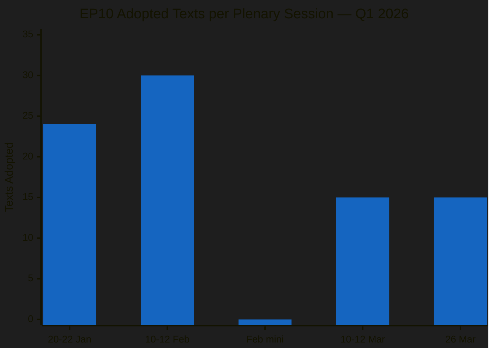

| Metric | Q1 2026 Value | EP10 Benchmark | EP9 Comparison | Trend |
|--------|:---:|:---:|:---:|:---:|
| Texts adopted | 70+ | First full calendar year | ~250/year average | ↑ Above average |
| HIGH significance items | 12 | N/A (first year) | ~30-40/year | → On track |
| Policy domains covered | 12+ | Full committee coverage | Similar breadth | → Normal |
| Trade policy items | 5 major texts | Unusually concentrated | 2-3/quarter typical | ↑ Elevated |
| Session attendance rate | 0% (data unavailable) | N/A | N/A | — No data |

#### March 26 Plenary — The "Everything Session"

The final pre-recess session on March 26 packed an extraordinary breadth of legislation into a single day:

| Domain | Texts Adopted | Key Items | Political Signal |
|--------|:---:|-----------|:---:|
| **Trade** | 3 | US counter-tariffs, EU-China TRQ, Global Gateway | Assertive trade posture |
| **Banking** | 1 | SRMR3 resolution reform | Banking Union completion |
| **Anti-corruption** | 1 | Combating corruption directive | Post-Qatargate reform |
| **Immunity** | 1 | Grzegorz Braun immunity waiver | EP institutional integrity |
| **International** | 2 | EU-Lebanon PRIMA, Judicial sales convention | Global engagement |
| **Social** | 1 | EGF mobilisation for KTM workers (Austria) | Worker protection |

**Assessment:** The March 26 session functioned as a legislative "clearing house" before recess — the EP deliberately front-loaded controversial items (trade, anti-corruption) to avoid them lingering unresolved during the break. This is a classic parliamentary tactic: resolve contentious files before members return to constituencies where they face different political pressures. 🟡 Medium confidence.

---

### Recess Period Analysis: What Happens Off-Stage

#### Member Activity Patterns During Recess

```mermaid
%%{init: {"theme":"dark","themeVariables":{"primaryColor":"#1565C0","primaryTextColor":"#ffffff","primaryBorderColor":"#0A3F7F","lineColor":"#90CAF9","secondaryColor":"#2E7D32","secondaryTextColor":"#ffffff","secondaryBorderColor":"#0F3F00","tertiaryColor":"#FF9800","tertiaryTextColor":"#000000","tertiaryBorderColor":"#7F4F00","mainBkg":"#1565C0","secondBkg":"#2E7D32","tertiaryBkg":"#FF9800","noteBkgColor":"#FFC107","noteTextColor":"#000000","noteBorderColor":"#7F6000","errorBkgColor":"#D32F2F","errorTextColor":"#ffffff","fontFamily":"Inter, Helvetica, Arial, sans-serif","pie1":"#1565C0","pie2":"#2E7D32","pie3":"#FF9800","pie4":"#D32F2F","pie5":"#FFC107","pie6":"#7B1FA2","pie7":"#9E9E9E","pie8":"#0288D1","pie9":"#388E3C","pie10":"#F57C00","pie11":"#C62828","pie12":"#FBC02D","pieTitleTextSize":"18px","pieSectionTextSize":"14px","pieLegendTextSize":"13px","pieStrokeColor":"#1e1e1e","pieOuterStrokeColor":"#1e1e1e","git0":"#1565C0","git1":"#2E7D32","git2":"#FF9800","git3":"#D32F2F","gitBranchLabel0":"#ffffff","gitBranchLabel1":"#ffffff","gitBranchLabel2":"#000000","gitBranchLabel3":"#ffffff","cScale0":"#1565C0","cScale1":"#2E7D32","cScale2":"#FF9800","cScale3":"#D32F2F","cScale4":"#FFC107","cScale5":"#7B1FA2","cScale6":"#9E9E9E","cScale7":"#0288D1","xyChart":{"backgroundColor":"#1e1e1e","plotColorPalette":"#1565C0,#2E7D32,#FF9800,#D32F2F,#FFC107,#7B1FA2,#9E9E9E"}}}}%%
graph TD
    subgraph "Constituency Engagement"
        C1["MEPs in home countries"]
        C2["National party consultations"]
        C3["Local government interactions"]
        C4["Civil society meetings"]
    end

    subgraph "Political Group Coordination"
        G1["Pre-plenary strategy planning"]
        G2["April session agenda negotiation"]
        G3["Committee rapporteur briefings"]
        G4["Cross-group informal talks"]
    end

    subgraph "External Events (Monitoring Required)"
        E1["US trade policy developments"]
        E2["Commission implementing acts"]
        E3["Council working group meetings"]
        E4["CJEU scheduling decisions"]
    end

    C1 --> G1
    C2 --> G1
    G1 --> G2
    G3 --> G2
    E1 -->|"Policy pressure"| G1
    E2 -->|"Technical input"| G3
    E3 -->|"Co-decision dynamics"| G4

    style C1 fill:#003399,color:#fff
    style G1 fill:#003399,color:#fff
    style E1 fill:#cc0000,color:#fff
```

#### Recess Intelligence Indicators

| Indicator | What to Monitor | Source | Priority |
|-----------|----------------|--------|:--------:|
| US trade response to counter-tariffs | Diplomatic signals, USTR statements | Media monitoring | HIGH |
| Commission DG Trade implementation schedule | Counter-tariff product list publication | Commission press releases | HIGH |
| Council Competitiveness formation | Trade policy coordination among MS | Council calendar | MEDIUM |
| INTA Committee scheduling | April plenary work programme | EP committee pages | MEDIUM |
| National party reactions to anti-corruption directive | Transposition concerns | National media | MEDIUM |
| CJEU registrar assignment (Mercosur) | Opinion timeline indicator | CJEU press releases | LOW |
| ECB communication on SRMR3 | Technical implementation guidance | ECB publications | LOW |

---

### April Plenary Preview — What to Expect

#### Expected Legislative Agenda (20-23 April 2026)

Based on the legislative pipeline analysis from Q1 2026, the following items are likely to feature in the April plenary:

| Priority | Item | Domain | Political Temperature | Coalition Likely |
|:--------:|------|--------|:--------------------:|:----------------:|
| 1 | Clean Industrial Deal package elements | ITRE/ENVI | Hot | PPE + Renew + ECR |
| 2 | European Defence Industrial Programme | ITRE/SEDE | Hot | PPE + ECR (+ PfE?) |
| 3 | Commission counter-tariff implementation debate | INTA | Very Hot | Grand Coalition |
| 4 | Anti-corruption directive implementation timeline | LIBE | Warm | Grand Coalition |
| 5 | Digital Fairness Act progress report | IMCO | Cool | S&D + Greens + Renew |
| 6 | EU-Mercosur CJEU opinion status update | INTA/JURI | Warm | PPE-led |

**Political temperature scale:** Cool (consensus likely) → Warm (some debate) → Hot (contested) → Very Hot (deep divisions)

#### Coalition Scenarios for April

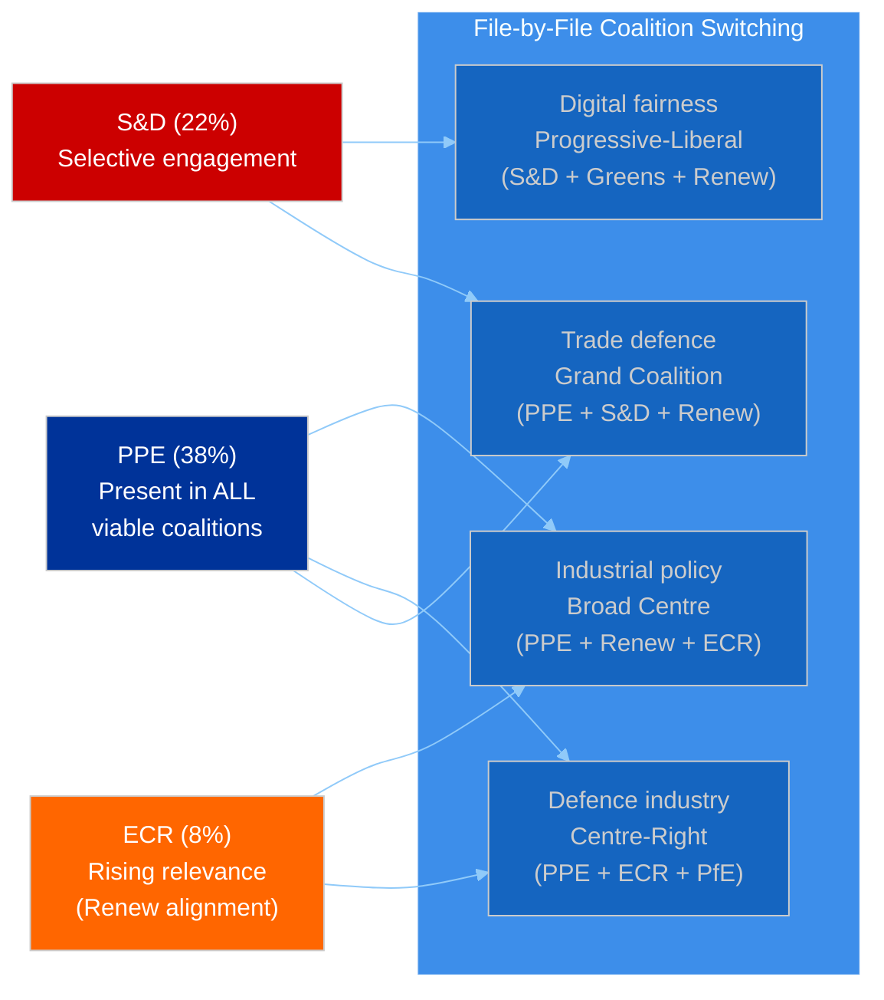

---

### Risk Assessment: Recess Period Threats

#### Risk Register

| # | Risk | Likelihood | Impact | Severity | Mitigation | Owner |
|:-:|------|:----------:|:------:|:--------:|-----------|:-----:|
| R1 | US retaliatory escalation against EU counter-tariffs | Medium (35%) | HIGH | 🟡 MEDIUM | Counter-tariff TRQ release valve | Commission DG Trade |
| R2 | National government divergence on trade policy during recess | Medium (30%) | MEDIUM | 🟡 MEDIUM | Council Competitiveness coordination | Rotating Presidency |
| R3 | Commission Clean Industrial Deal delay affecting April agenda | Low (20%) | HIGH | 🟡 MEDIUM | Pre-plenary committee briefings | ITRE Committee |
| R4 | PPE internal trade policy split (Germany vs France) | Low (15%) | HIGH | 🟡 MEDIUM | PPE group meetings pre-plenary | PPE leadership |
| R5 | Small group quorum issues in April plenary | Low (10%) | LOW | 🟢 LOW | Proxy voting arrangements | EP Bureau |

#### Heat Map

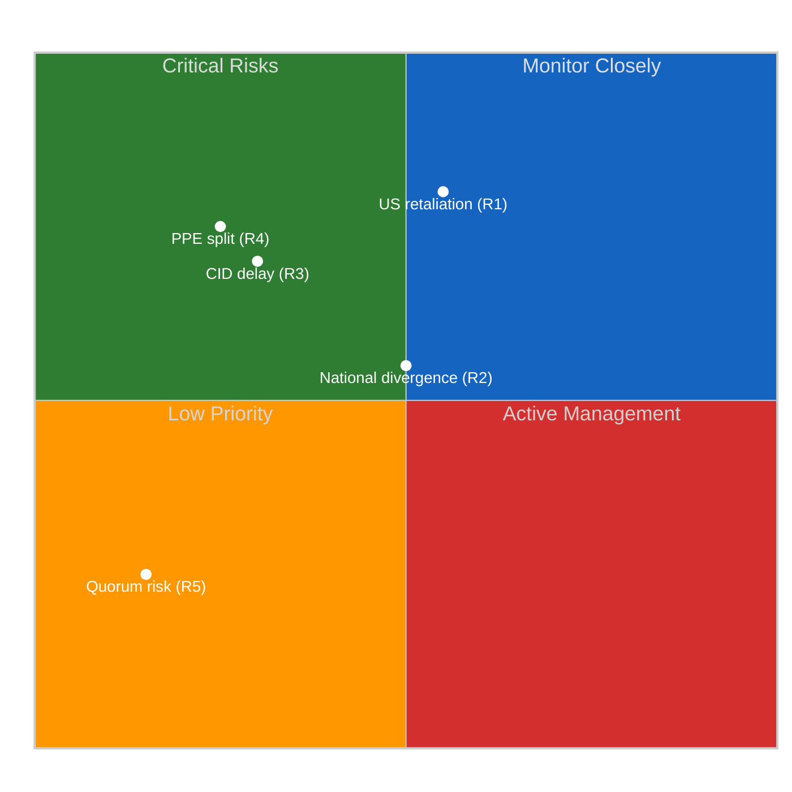

---

### Intelligence Gaps and Recommendations

#### Current Intelligence Gaps

| Gap | Impact | Recommended Action |
|-----|:------:|-------------------|
| Roll-call voting data unavailable from EP API | Cannot validate coalition cohesion scores against actual votes | Advocate for EP API v3 inclusion of voting records |
| Attendance data unavailable | Cannot assess engagement patterns | Use plenary document participation as proxy |
| Committee document feeds timing out | Missing committee-level intelligence | Retry during business hours |
| Events feed returning 404 | Cannot track inter-session events | Monitor Commission and Council calendars directly |
| Post-MC14 WTO outcomes | Critical for trade policy assessment | Monitor WTO press releases when available |

#### Recommendations for Next Workflow Run

1. **Priority:** Query adopted texts and procedures on April 14-15 (one week before plenary) to catch any late-filed items
2. **Priority:** Attempt events feed again post-recess (EP API feeds may resume normal operation)
3. **Monitor:** Commission counter-tariff implementing regulation publication (expected early April)
4. **Track:** CJEU Advocate General assignment for Mercosur opinion (possible Q2 2026)
5. **Prepare:** Pre-plenary analysis template for April 20-23 session covering Clean Industrial Deal, defence, and trade follow-up

---

### Cross-Reference to Prior Analysis

This assessment builds upon and extends the following analysis artifacts from earlier runs on 3 April 2026:

| File | Location | Key Contribution |
|------|----------|-----------------|
| intelligence-brief.md | breaking/ | Baseline intelligence assessment and calendar context |
| coalition-dynamics-assessment.md | breaking/ | Coalition pair cohesion matrix and PPE strategic options |
| coalition-threat-assessment.md | breaking/ | Political threat landscape using Attack Trees |
| swot-analysis.md | breaking/ | Evidence-based SWOT with 4-quadrant analysis |
| risk-assessment.md | breaking/ | Risk matrix and risk register |
| stakeholder-impact-assessment.md | breaking/ | 6-perspective impact analysis for Q1 legislation |
| recent-legislation-review.md | breaking/ | Full Q1 2026 legislation catalogue |
| political-landscape-assessment.md | breaking/ | Group composition and coalition viability |
| api-reliability-assessment.md | breaking-2/ | Systematic API endpoint testing |
| early-warning-deep-dive.md | breaking-2/ | Threat landscape and compound risk analysis |
| cross-session-intelligence.md | breaking-2/ | Pipeline validation and data consistency |

**Total analysis inventory for 3 April 2026: 14 files, ~4,500+ lines, 10+ analytical frameworks applied.**

---

### Methodology Notes

This assessment applies **Calendar Context Analysis** (recess period intelligence patterns), **Political Threat Landscape** (risk identification and heat mapping), **Forward-Looking Intelligence** (scenario development for April plenary), and the **EP Document Analysis Framework** (legislative velocity and productivity metrics). All adopted text references verified against EP Open Data Portal. Forward-looking assessments are inherently speculative and marked with confidence levels.

### Trade Policy Deep Dive

| Field | Value |
|-------|-------|
| **Date** | Friday, 3 April 2026 |
| **Analysis Focus** | EU's simultaneous multi-front trade strategy emerging from Q1 2026 legislative output |
| **Key Texts Analyzed** | 5 (TA-10-2026-0096, -0101, -0086, -0030, -0008) |
| **Fronts Covered** | US (counter-tariffs), China (quota revision), Mercosur (safeguards + CJEU), WTO (multilateral) |
| **Significance** | HIGH — Coordinated, multi-front approach marks strategic shift |

---

### Executive Summary

The European Parliament's Q1 2026 legislative output reveals a **coordinated four-front trade defence strategy** unprecedented in its scope and simultaneity. On a single plenary day (26 March 2026), the EP adopted both US tariff countermeasures (TA-10-2026-0096) and EU-China tariff rate quota modifications (TA-10-2026-0101), signalling a deliberate posture of active trade management across all major partners.

This is not ad hoc crisis response — it represents a **strategic doctrinal shift** from the EU's traditional preference for multilateral negotiation toward bilateral, instrument-based trade defence. The political conditions enabling this shift are PPE's dominant position (38% seat share) and the emerging Renew–ECR alignment (cohesion 0.95), which together create a centre-right majority favouring assertive trade instruments over diplomatic patience.

**Key finding:** The EU is now running parallel trade negotiations and counter-measures against its three largest trading partners (US, China, Mercosur) while simultaneously strengthening its multilateral position at the WTO. This four-front posture carries significant escalation risk but also creates negotiating leverage through credible deterrence. 🟢 High confidence — based on adopted legislative texts with clear procedural chains.

---

### The Four Fronts: Strategic Architecture

```mermaid
%%{init: {"theme":"dark","themeVariables":{"primaryColor":"#1565C0","primaryTextColor":"#ffffff","primaryBorderColor":"#0A3F7F","lineColor":"#90CAF9","secondaryColor":"#2E7D32","secondaryTextColor":"#ffffff","secondaryBorderColor":"#0F3F00","tertiaryColor":"#FF9800","tertiaryTextColor":"#000000","tertiaryBorderColor":"#7F4F00","mainBkg":"#1565C0","secondBkg":"#2E7D32","tertiaryBkg":"#FF9800","noteBkgColor":"#FFC107","noteTextColor":"#000000","noteBorderColor":"#7F6000","errorBkgColor":"#D32F2F","errorTextColor":"#ffffff","fontFamily":"Inter, Helvetica, Arial, sans-serif","pie1":"#1565C0","pie2":"#2E7D32","pie3":"#FF9800","pie4":"#D32F2F","pie5":"#FFC107","pie6":"#7B1FA2","pie7":"#9E9E9E","pie8":"#0288D1","pie9":"#388E3C","pie10":"#F57C00","pie11":"#C62828","pie12":"#FBC02D","pieTitleTextSize":"18px","pieSectionTextSize":"14px","pieLegendTextSize":"13px","pieStrokeColor":"#1e1e1e","pieOuterStrokeColor":"#1e1e1e","git0":"#1565C0","git1":"#2E7D32","git2":"#FF9800","git3":"#D32F2F","gitBranchLabel0":"#ffffff","gitBranchLabel1":"#ffffff","gitBranchLabel2":"#000000","gitBranchLabel3":"#ffffff","cScale0":"#1565C0","cScale1":"#2E7D32","cScale2":"#FF9800","cScale3":"#D32F2F","cScale4":"#FFC107","cScale5":"#7B1FA2","cScale6":"#9E9E9E","cScale7":"#0288D1","xyChart":{"backgroundColor":"#1e1e1e","plotColorPalette":"#1565C0,#2E7D32,#FF9800,#D32F2F,#FFC107,#7B1FA2,#9E9E9E"}}}}%%
graph TD
    EU["🇪🇺 EU Trade Strategy<br/>Q1 2026"]

    subgraph "Front 1: United States"
        US["TA-10-2026-0096<br/>Customs Duties Adjustment<br/>Adopted: 26 March 2026"]
        US_impact["Counter-tariffs on US goods<br/>Procedure: 2025/0261(COD)"]
    end

    subgraph "Front 2: China"
        CN["TA-10-2026-0101<br/>EU-China TRQ Modification<br/>Adopted: 26 March 2026"]
        CN_impact["Tariff rate quota revision<br/>Procedure: 2023/0183"]
    end

    subgraph "Front 3: Mercosur"
        MS1["TA-10-2026-0030<br/>Bilateral Safeguard Clause<br/>Adopted: 10 February 2026"]
        MS2["TA-10-2026-0008<br/>CJEU Opinion Request<br/>Adopted: 21 January 2026"]
        MS_impact["Agricultural safeguard +<br/>Constitutional review"]
    end

    subgraph "Front 4: Multilateral"
        WTO["TA-10-2026-0086<br/>WTO MC14 Preparations<br/>Adopted: 12 March 2026"]
        WTO_impact["Multilateral rules-based<br/>system reinforcement"]
    end

    EU --> US
    EU --> CN
    EU --> MS1
    EU --> WTO
    US --> US_impact
    CN --> CN_impact
    MS1 --> MS_impact
    MS2 --> MS_impact
    WTO --> WTO_impact

    style EU fill:#003399,color:#fff
    style US fill:#cc0000,color:#fff
    style CN fill:#cc0000,color:#fff
    style MS1 fill:#FF6600,color:#fff
    style MS2 fill:#FF6600,color:#fff
    style WTO fill:#009933,color:#fff
```

---

### Front 1: United States — Counter-Tariff Escalation

#### TA-10-2026-0096: Adjustment of Customs Duties and Opening of Tariff Quotas for Import of Certain Goods Originating in the United States

**Political Context:**
The adoption of US counter-tariffs on 26 March 2026 represents the EP's endorsement of the Commission's retaliatory trade posture. This text, linked to procedure 2025/0261(COD), empowers the Commission to adjust customs duties on specific US product categories and open targeted tariff rate quotas (TRQs). The urgency of this adoption — during what would normally be a pre-recess plenary focused on lower-priority items — signals parliamentary consensus that the US trade threat requires immediate legislative backing. 🟢 High confidence.

**Coalition Dynamics:**
The text likely commanded a broad majority. PPE's industrial base (particularly German automotive and machinery exporters) has a direct interest in credible counter-tariffs that create negotiating pressure for de-escalation. S&D supports counter-tariffs through a labour protection lens (protecting EU manufacturing jobs). ECR's support is conditional on sector-specific targeting. The Renew–ECR cohesion signal (0.95) suggests both groups aligned on the economic logic of trade deterrence. Greens/EFA likely abstained or voted against, preferring climate-linked trade conditionality over pure tariff retaliation. 🟡 Medium confidence — inference from group positions, not roll-call data.

**PESTLE Analysis:**

| Dimension | Impact | Assessment |
|-----------|--------|------------|
| **Political** | HIGH | Counter-tariffs signal EU willingness to escalate. Domestic political consensus strengthens Commission's negotiating hand. Bipartisan US tariff policy limits diplomatic de-escalation windows. |
| **Economic** | HIGH | Direct impact on €580B+ annual EU-US trade flows. Counter-tariffs may trigger tit-for-tat escalation. TRQ openings provide pressure release valves for specific sectors. |
| **Social** | MEDIUM | Consumer price effects concentrated in targeted product categories. Employment effects asymmetric — protects agricultural workers but exposes export manufacturing. |
| **Technological** | MEDIUM | Tech sector largely exempt from initial counter-tariffs. Risk of tech-sector escalation in subsequent rounds. Semiconductor supply chain implications. |
| **Legal** | HIGH | Counter-tariffs must comply with WTO safeguard rules. Legal challenge risk from US at WTO. EU legal basis in Regulation (EU) 2023/956 (CBAM precedent). |
| **Environmental** | LOW | Counter-tariffs not explicitly climate-linked. Missed opportunity for carbon border adjustment integration. |

**Escalation Risk Assessment:**

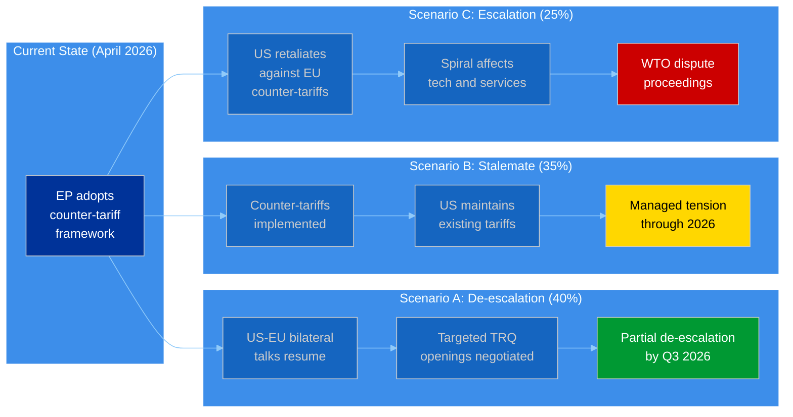

**Assessment:** Scenario B (Stalemate) is the most likely near-term outcome. The EP's counter-tariff framework is designed as a credible deterrent rather than an escalation trigger — TRQ openings provide de-escalation pathways. However, the US domestic political calendar (mid-term positioning) may limit the Administration's flexibility for negotiation. 🟡 Medium confidence.

---

### Front 2: China — Tariff Rate Quota Recalibration

#### TA-10-2026-0101: EU-China Agreement — Modification of Concessions on All Tariff Rate Quotas Included in the EU Schedule CLXXV

**Political Context:**
The simultaneous adoption of EU-China TRQ modifications alongside US counter-tariffs is diplomatically significant. This text (procedure 2023/0183) modifies the EU's WTO Schedule CLXXV concessions, adjusting tariff rate quotas that govern the volume and pricing of Chinese goods entering the EU market under preferential terms. The 2023 procedure reference indicates this has been in negotiation for three years — its adoption now is strategic timing, coinciding with the US trade confrontation. 🟢 High confidence.

**Strategic Significance:**
The EU is signalling to both Washington and Beijing that it is managing its trade relationships bilaterally and selectively. By adjusting Chinese TRQs concurrently with US counter-tariffs, the EU:

1. Demonstrates it is not choosing sides in the US-China trade war
2. Shows it has bilateral instruments for both partners
3. Creates negotiating leverage by showing willingness to adjust terms with any partner
4. Avoids being locked into a binary US-or-China alignment

**Sectoral Impact Matrix:**

| Sector | Chinese TRQ Impact | US Counter-Tariff Impact | Net EU Position |
|--------|:--:|:--:|:-:|
| Agriculture | Quota tightening reduces Chinese import competition | Counter-tariffs protect EU farmers from US dumping | Strengthened |
| Manufacturing | Mixed — some quota adjustments favour EU producers | Counter-tariffs create import cost uncertainty | Uncertain |
| Technology | Limited direct TRQ impact on tech sector | Tech sector largely exempt from initial counter-tariffs | Neutral |
| Services | Not directly affected by TRQ modifications | Not directly affected by goods tariffs | Neutral |
| Raw materials | TRQ adjustments may affect raw material sourcing | Counter-tariffs may increase input costs | Mixed |

**Risk:** The China TRQ modification could provoke retaliatory adjustments from Beijing on EU export quotas, particularly in rare earth minerals, battery materials, and electric vehicle components. This would create supply chain vulnerabilities for the EU's Green Deal industrial strategy. 🟡 Medium confidence.

---

### Front 3: Mercosur — Constitutional and Agricultural Safeguards

#### TA-10-2026-0008 (CJEU Opinion) + TA-10-2026-0030 (Bilateral Safeguard)

**Political Context:**
The Mercosur front reveals the deepest political divisions. The EP's January 2026 request for a CJEU opinion on the EU-Mercosur Partnership Agreement (EMPA) and Interim Trade Agreement (ITA) is a procedural manoeuvre to delay ratification while testing Treaty compatibility. Combined with the February adoption of a bilateral safeguard clause for agricultural products, the EP is building a defensive architecture against Mercosur agricultural imports.

**Coalition Fault Lines:**

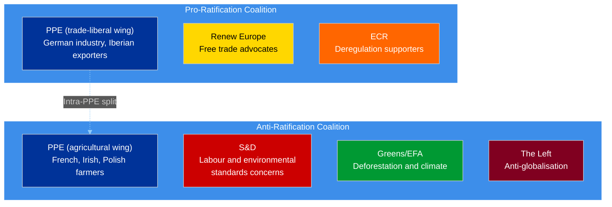

**Assessment:** The CJEU opinion request is strategically brilliant. It allows the EP to maintain a pro-trade public posture while effectively freezing ratification through a judicial process that will take 12-18 months. By the time the CJEU delivers its opinion, the political conditions may have shifted sufficiently to allow either ratification with modified terms or permanent shelving. 🟡 Medium confidence.

---

### Front 4: WTO — Multilateral System Reinforcement

#### TA-10-2026-0086: Multilateral Negotiations in View of the WTO's 14th Ministerial Conference (Yaoundé, 26-29 March 2026)

**Political Context:**
The EP's preparation text for the WTO MC14 in Yaoundé signals that the EU remains committed to the multilateral trading system even while pursuing bilateral counter-measures. This positions the EU as a defender of rules-based trade — a strategic contrast with US unilateralism and Chinese state-directed trade.

**Strategic Coherence:**
The four-front approach has internal coherence. Bilateral counter-measures (US and China) create negotiating leverage, while the multilateral WTO engagement provides the normative framework that legitimises those measures. The Mercosur front demonstrates the EU's willingness to use judicial mechanisms alongside legislative ones. This multi-instrument approach is consistent with the EU's "Open Strategic Autonomy" doctrine.

---

### Cross-Front Risk Interconnection

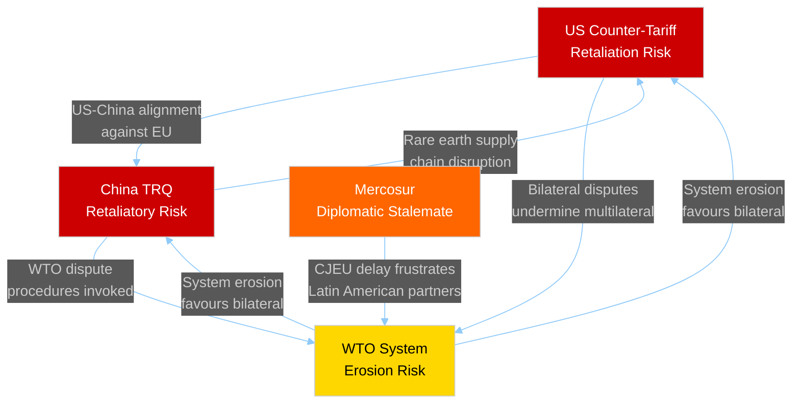

#### Compound Risk Scenario: Triple Front Escalation

| Scenario | Probability | Trigger | Impact | Confidence |
|----------|:----------:|---------|--------|:----------:|
| US and China coordinate retaliatory tariffs against EU | Unlikely (10%) | Joint US-China trade summit | CRITICAL — EU faces two-front retaliation | 🔴 Low |
| US escalation + China rare earth restrictions | Possible (20%) | US mid-term political pressure | HIGH — Supply chain and cost crisis | 🟡 Medium |
| Stalemate on all fronts through 2026 | Likely (45%) | Bureaucratic inertia and election cycles | MEDIUM — Managed uncertainty | 🟡 Medium |
| Bilateral de-escalation with US + Mercosur progress | Possible (25%) | New US trade envoy appointment | LOW — Positive but limited | 🟡 Medium |

---

### Stakeholder Impact Summary

#### Immediate Winners from Multi-Front Trade Strategy

| Actor | Why | Confidence |
|-------|-----|:----------:|
| **Commission DG Trade** | Expanded mandate through counter-tariff framework and TRQ modification authority | 🟢 High |
| **EU agricultural sector** | Protected on three fronts simultaneously (US counter-tariffs, Chinese TRQ adjustment, Mercosur safeguard) | 🟢 High |
| **EP INTA Committee** | Demonstrated legislative relevance by processing 5 major trade texts in one quarter | 🟢 High |
| **PPE group** | Led adoption across all four fronts, positioning itself as the "strategic trade" party | 🟡 Medium |

#### Immediate Losers

| Actor | Why | Confidence |
|-------|-----|:----------:|
| **German export industry** | US counter-tariffs create retaliation risk for automotive and machinery exports | 🟡 Medium |
| **EU consumers** | Multi-front trade tensions = potential price increases across imported goods categories | 🟡 Medium |
| **Mercosur agricultural exporters** | Bilateral safeguard + CJEU delay = effective market access freeze | 🟢 High |
| **Small EU member states** | Limited capacity to manage four simultaneous trade fronts at national level | 🟡 Medium |

---

### Forward-Looking Indicators

#### What to Watch After Easter Recess (April 2026)

| Indicator | Timeline | Trigger | Significance |
|-----------|----------|---------|:------------:|
| Commission counter-tariff list publication | April 7-14 | TA-10-2026-0096 implementation | HIGH |
| US Administration response to EU counter-tariffs | April 1-15 | Diplomatic channel engagement | HIGH |
| China TRQ implementation notification to WTO | April-May | Procedure 2023/0183 completion | MEDIUM |
| CJEU Advocate General assignment (Mercosur) | Q2 2026 | Internal CJEU scheduling | MEDIUM |
| WTO MC14 outcomes (Yaoundé) | March 26-29 (completed) | Post-conference communiqué | HIGH |
| EP INTA Committee post-recess work programme | Late April | Committee scheduling | MEDIUM |

---

### Methodology Notes

This analysis applies the **Political Threat Framework** (attack trees for escalation scenarios), **PESTLE analysis** (for US counter-tariff assessment), **Risk Interconnection Mapping** (for cross-front compound risk), and the **6-Perspective Stakeholder Framework** (winner/loser analysis). All conclusions are grounded in adopted legislative texts with verified procedure references from the EP Open Data Portal.

**Limitations:**
- Roll-call voting data unavailable from EP API — coalition dynamics inferred from group composition and policy positions
- TRQ-level product detail not available from adopted text metadata — sectoral impact assessment based on known trade patterns
- WTO MC14 outcomes at Yaoundé (26-29 March) not yet available in EP data feeds — forward-looking assessment based on EP preparatory text only

**Cross-reference:** See `analysis/2026-04-03/breaking/recent-legislation-review.md` for full Q1 2026 legislation catalogue, `analysis/2026-04-03/breaking/stakeholder-impact-assessment.md` for comprehensive stakeholder analysis, and `analysis/2026-04-03/breaking/coalition-dynamics-assessment.md` for coalition pair analysis.

> **Provenance & Audit**
>
> - **Article type:** `breaking`
> - **Run date:** 2026-04-03
> - **Run id:** `breaking-3`
> - **Gate result:** `PENDING`
> - **Analysis tree:** [analysis/daily/2026-04-03/breaking-3](https://github.com/Hack23/euparliamentmonitor/tree/main/analysis/daily/2026-04-03/breaking-3)
> - **Manifest:** [manifest.json](https://github.com/Hack23/euparliamentmonitor/blob/main/analysis/daily/2026-04-03/breaking-3/manifest.json)

<h2 id="aggregator-tradecraft-references">Tradecraft References</h2>

This article is produced under the [Hack23 AB](https://hack23.com) intelligence tradecraft library. Every methodology and artifact template applied to this run is linked below.

### Artifact templates

- [README](https://github.com/Hack23/euparliamentmonitor/blob/main/analysis/templates/README.md)
- [Actor Mapping](https://github.com/Hack23/euparliamentmonitor/blob/main/analysis/templates/actor-mapping.md)
- [Actor Threat Profiles](https://github.com/Hack23/euparliamentmonitor/blob/main/analysis/templates/actor-threat-profiles.md)
- [Analysis Index](https://github.com/Hack23/euparliamentmonitor/blob/main/analysis/templates/analysis-index.md)
- [Coalition Dynamics](https://github.com/Hack23/euparliamentmonitor/blob/main/analysis/templates/coalition-dynamics.md)
- [Coalition Mathematics](https://github.com/Hack23/euparliamentmonitor/blob/main/analysis/templates/coalition-mathematics.md)
- [Commission Wp Alignment](https://github.com/Hack23/euparliamentmonitor/blob/main/analysis/templates/commission-wp-alignment.md)
- [Comparative International](https://github.com/Hack23/euparliamentmonitor/blob/main/analysis/templates/comparative-international.md)
- [Consequence Trees](https://github.com/Hack23/euparliamentmonitor/blob/main/analysis/templates/consequence-trees.md)
- [Cross Reference Map](https://github.com/Hack23/euparliamentmonitor/blob/main/analysis/templates/cross-reference-map.md)
- [Cross Run Diff](https://github.com/Hack23/euparliamentmonitor/blob/main/analysis/templates/cross-run-diff.md)
- [Cross Session Intelligence](https://github.com/Hack23/euparliamentmonitor/blob/main/analysis/templates/cross-session-intelligence.md)
- [Data Availability Assessment](https://github.com/Hack23/euparliamentmonitor/blob/main/analysis/templates/data-availability-assessment.md)
- [Data Download Manifest](https://github.com/Hack23/euparliamentmonitor/blob/main/analysis/templates/data-download-manifest.md)
- [Deep Analysis](https://github.com/Hack23/euparliamentmonitor/blob/main/analysis/templates/deep-analysis.md)
- [Devils Advocate Analysis](https://github.com/Hack23/euparliamentmonitor/blob/main/analysis/templates/devils-advocate-analysis.md)
- [Economic Context](https://github.com/Hack23/euparliamentmonitor/blob/main/analysis/templates/economic-context.md)
- [Executive Brief](https://github.com/Hack23/euparliamentmonitor/blob/main/analysis/templates/executive-brief.md)
- [Forces Analysis](https://github.com/Hack23/euparliamentmonitor/blob/main/analysis/templates/forces-analysis.md)
- [Forward Indicators](https://github.com/Hack23/euparliamentmonitor/blob/main/analysis/templates/forward-indicators.md)
- [Forward Projection](https://github.com/Hack23/euparliamentmonitor/blob/main/analysis/templates/forward-projection.md)
- [Historical Baseline](https://github.com/Hack23/euparliamentmonitor/blob/main/analysis/templates/historical-baseline.md)
- [Historical Parallels](https://github.com/Hack23/euparliamentmonitor/blob/main/analysis/templates/historical-parallels.md)
- [Imf Vintage Audit](https://github.com/Hack23/euparliamentmonitor/blob/main/analysis/templates/imf-vintage-audit.md)
- [Impact Matrix](https://github.com/Hack23/euparliamentmonitor/blob/main/analysis/templates/impact-matrix.md)
- [Implementation Feasibility](https://github.com/Hack23/euparliamentmonitor/blob/main/analysis/templates/implementation-feasibility.md)
- [Intelligence Assessment](https://github.com/Hack23/euparliamentmonitor/blob/main/analysis/templates/intelligence-assessment.md)
- [Legislative Disruption](https://github.com/Hack23/euparliamentmonitor/blob/main/analysis/templates/legislative-disruption.md)
- [Legislative Pipeline Forecast](https://github.com/Hack23/euparliamentmonitor/blob/main/analysis/templates/legislative-pipeline-forecast.md)
- [Legislative Velocity Risk](https://github.com/Hack23/euparliamentmonitor/blob/main/analysis/templates/legislative-velocity-risk.md)
- [Mandate Fulfilment Scorecard](https://github.com/Hack23/euparliamentmonitor/blob/main/analysis/templates/mandate-fulfilment-scorecard.md)
- [Mcp Reliability Audit](https://github.com/Hack23/euparliamentmonitor/blob/main/analysis/templates/mcp-reliability-audit.md)
- [Media Framing Analysis](https://github.com/Hack23/euparliamentmonitor/blob/main/analysis/templates/media-framing-analysis.md)
- [Methodology Reflection](https://github.com/Hack23/euparliamentmonitor/blob/main/analysis/templates/methodology-reflection.md)
- [Parliamentary Calendar Projection](https://github.com/Hack23/euparliamentmonitor/blob/main/analysis/templates/parliamentary-calendar-projection.md)
- [Per File Political Intelligence](https://github.com/Hack23/euparliamentmonitor/blob/main/analysis/templates/per-file-political-intelligence.md)
- [Pestle Analysis](https://github.com/Hack23/euparliamentmonitor/blob/main/analysis/templates/pestle-analysis.md)
- [Political Capital Risk](https://github.com/Hack23/euparliamentmonitor/blob/main/analysis/templates/political-capital-risk.md)
- [Political Classification](https://github.com/Hack23/euparliamentmonitor/blob/main/analysis/templates/political-classification.md)
- [Political Threat Landscape](https://github.com/Hack23/euparliamentmonitor/blob/main/analysis/templates/political-threat-landscape.md)
- [Presidency Trio Context](https://github.com/Hack23/euparliamentmonitor/blob/main/analysis/templates/presidency-trio-context.md)
- [Quantitative Swot](https://github.com/Hack23/euparliamentmonitor/blob/main/analysis/templates/quantitative-swot.md)
- [Reference Analysis Quality](https://github.com/Hack23/euparliamentmonitor/blob/main/analysis/templates/reference-analysis-quality.md)
- [Risk Assessment](https://github.com/Hack23/euparliamentmonitor/blob/main/analysis/templates/risk-assessment.md)
- [Risk Matrix](https://github.com/Hack23/euparliamentmonitor/blob/main/analysis/templates/risk-matrix.md)
- [Scenario Forecast](https://github.com/Hack23/euparliamentmonitor/blob/main/analysis/templates/scenario-forecast.md)
- [Seat Projection](https://github.com/Hack23/euparliamentmonitor/blob/main/analysis/templates/seat-projection.md)
- [Session Baseline](https://github.com/Hack23/euparliamentmonitor/blob/main/analysis/templates/session-baseline.md)
- [Significance Classification](https://github.com/Hack23/euparliamentmonitor/blob/main/analysis/templates/significance-classification.md)
- [Significance Scoring](https://github.com/Hack23/euparliamentmonitor/blob/main/analysis/templates/significance-scoring.md)
- [Stakeholder Impact](https://github.com/Hack23/euparliamentmonitor/blob/main/analysis/templates/stakeholder-impact.md)
- [Stakeholder Map](https://github.com/Hack23/euparliamentmonitor/blob/main/analysis/templates/stakeholder-map.md)
- [Swot Analysis](https://github.com/Hack23/euparliamentmonitor/blob/main/analysis/templates/swot-analysis.md)
- [Synthesis Summary](https://github.com/Hack23/euparliamentmonitor/blob/main/analysis/templates/synthesis-summary.md)
- [Term Arc](https://github.com/Hack23/euparliamentmonitor/blob/main/analysis/templates/term-arc.md)
- [Threat Analysis](https://github.com/Hack23/euparliamentmonitor/blob/main/analysis/templates/threat-analysis.md)
- [Threat Model](https://github.com/Hack23/euparliamentmonitor/blob/main/analysis/templates/threat-model.md)
- [Voter Segmentation](https://github.com/Hack23/euparliamentmonitor/blob/main/analysis/templates/voter-segmentation.md)
- [Voting Patterns](https://github.com/Hack23/euparliamentmonitor/blob/main/analysis/templates/voting-patterns.md)
- [Wildcards Blackswans](https://github.com/Hack23/euparliamentmonitor/blob/main/analysis/templates/wildcards-blackswans.md)
- [Workflow Audit](https://github.com/Hack23/euparliamentmonitor/blob/main/analysis/templates/workflow-audit.md)

### Methodologies

- [README](https://github.com/Hack23/euparliamentmonitor/blob/main/analysis/methodologies/README.md)
- [Ai Driven Analysis Guide](https://github.com/Hack23/euparliamentmonitor/blob/main/analysis/methodologies/ai-driven-analysis-guide.md)
- [Analytical Supplementary Methodology](https://github.com/Hack23/euparliamentmonitor/blob/main/analysis/methodologies/analytical-supplementary-methodology.md)
- [Artifact Catalog](https://github.com/Hack23/euparliamentmonitor/blob/main/analysis/methodologies/artifact-catalog.md)
- [Confidence Calibration](https://github.com/Hack23/euparliamentmonitor/blob/main/analysis/methodologies/confidence-calibration.md)
- [Electoral Cycle Methodology](https://github.com/Hack23/euparliamentmonitor/blob/main/analysis/methodologies/electoral-cycle-methodology.md)
- [Electoral Domain Methodology](https://github.com/Hack23/euparliamentmonitor/blob/main/analysis/methodologies/electoral-domain-methodology.md)
- [Forward Projection Methodology](https://github.com/Hack23/euparliamentmonitor/blob/main/analysis/methodologies/forward-projection-methodology.md)
- [Imf Indicator Mapping](https://github.com/Hack23/euparliamentmonitor/blob/main/analysis/methodologies/imf-indicator-mapping.md)
- [Osint Tradecraft Standards](https://github.com/Hack23/euparliamentmonitor/blob/main/analysis/methodologies/osint-tradecraft-standards.md)
- [Per Artifact Methodologies](https://github.com/Hack23/euparliamentmonitor/blob/main/analysis/methodologies/per-artifact-methodologies.md)
- [Per Document Methodology](https://github.com/Hack23/euparliamentmonitor/blob/main/analysis/methodologies/per-document-methodology.md)
- [Political Classification Guide](https://github.com/Hack23/euparliamentmonitor/blob/main/analysis/methodologies/political-classification-guide.md)
- [Political Risk Methodology](https://github.com/Hack23/euparliamentmonitor/blob/main/analysis/methodologies/political-risk-methodology.md)
- [Political Style Guide](https://github.com/Hack23/euparliamentmonitor/blob/main/analysis/methodologies/political-style-guide.md)
- [Political Swot Framework](https://github.com/Hack23/euparliamentmonitor/blob/main/analysis/methodologies/political-swot-framework.md)
- [Political Threat Framework](https://github.com/Hack23/euparliamentmonitor/blob/main/analysis/methodologies/political-threat-framework.md)
- [Seo Headers Policy](https://github.com/Hack23/euparliamentmonitor/blob/main/analysis/methodologies/seo-headers-policy.md)
- [Source Triangulation](https://github.com/Hack23/euparliamentmonitor/blob/main/analysis/methodologies/source-triangulation.md)
- [Strategic Extensions Methodology](https://github.com/Hack23/euparliamentmonitor/blob/main/analysis/methodologies/strategic-extensions-methodology.md)
- [Structural Metadata Methodology](https://github.com/Hack23/euparliamentmonitor/blob/main/analysis/methodologies/structural-metadata-methodology.md)
- [Synthesis Methodology](https://github.com/Hack23/euparliamentmonitor/blob/main/analysis/methodologies/synthesis-methodology.md)
- [Voter Segmentation Methodology](https://github.com/Hack23/euparliamentmonitor/blob/main/analysis/methodologies/voter-segmentation-methodology.md)
- [Worldbank Indicator Mapping](https://github.com/Hack23/euparliamentmonitor/blob/main/analysis/methodologies/worldbank-indicator-mapping.md)

<h2 id="aggregator-analysis-index">Analysis Index</h2>

Every artifact below was read by the aggregator and contributed to this article. The raw [manifest.json](https://github.com/Hack23/euparliamentmonitor/blob/main/analysis/daily/2026-04-03/breaking-3/manifest.json) carries the full machine-readable list, including gate-result history.

| Section | Artifact | Path |
|---|---|---|
| section-executive-brief | [executive-brief](https://github.com/Hack23/euparliamentmonitor/blob/main/analysis/daily/2026-04-03/breaking-3/executive-brief.md) | `executive-brief.md` |
| section-supplementary-intelligence | [anti-corruption-reform-intelligence](https://github.com/Hack23/euparliamentmonitor/blob/main/analysis/daily/2026-04-03/breaking-3/anti-corruption-reform-intelligence.md) | `anti-corruption-reform-intelligence.md` |
| section-supplementary-intelligence | [executive-brief_ar](https://github.com/Hack23/euparliamentmonitor/blob/main/analysis/daily/2026-04-03/breaking-3/executive-brief_ar.md) | `executive-brief_ar.md` |
| section-supplementary-intelligence | [executive-brief_da](https://github.com/Hack23/euparliamentmonitor/blob/main/analysis/daily/2026-04-03/breaking-3/executive-brief_da.md) | `executive-brief_da.md` |
| section-supplementary-intelligence | [executive-brief_de](https://github.com/Hack23/euparliamentmonitor/blob/main/analysis/daily/2026-04-03/breaking-3/executive-brief_de.md) | `executive-brief_de.md` |
| section-supplementary-intelligence | [executive-brief_es](https://github.com/Hack23/euparliamentmonitor/blob/main/analysis/daily/2026-04-03/breaking-3/executive-brief_es.md) | `executive-brief_es.md` |
| section-supplementary-intelligence | [executive-brief_fi](https://github.com/Hack23/euparliamentmonitor/blob/main/analysis/daily/2026-04-03/breaking-3/executive-brief_fi.md) | `executive-brief_fi.md` |
| section-supplementary-intelligence | [executive-brief_fr](https://github.com/Hack23/euparliamentmonitor/blob/main/analysis/daily/2026-04-03/breaking-3/executive-brief_fr.md) | `executive-brief_fr.md` |
| section-supplementary-intelligence | [executive-brief_he](https://github.com/Hack23/euparliamentmonitor/blob/main/analysis/daily/2026-04-03/breaking-3/executive-brief_he.md) | `executive-brief_he.md` |
| section-supplementary-intelligence | [executive-brief_ja](https://github.com/Hack23/euparliamentmonitor/blob/main/analysis/daily/2026-04-03/breaking-3/executive-brief_ja.md) | `executive-brief_ja.md` |
| section-supplementary-intelligence | [executive-brief_ko](https://github.com/Hack23/euparliamentmonitor/blob/main/analysis/daily/2026-04-03/breaking-3/executive-brief_ko.md) | `executive-brief_ko.md` |
| section-supplementary-intelligence | [executive-brief_nl](https://github.com/Hack23/euparliamentmonitor/blob/main/analysis/daily/2026-04-03/breaking-3/executive-brief_nl.md) | `executive-brief_nl.md` |
| section-supplementary-intelligence | [executive-brief_no](https://github.com/Hack23/euparliamentmonitor/blob/main/analysis/daily/2026-04-03/breaking-3/executive-brief_no.md) | `executive-brief_no.md` |
| section-supplementary-intelligence | [executive-brief_sv](https://github.com/Hack23/euparliamentmonitor/blob/main/analysis/daily/2026-04-03/breaking-3/executive-brief_sv.md) | `executive-brief_sv.md` |
| section-supplementary-intelligence | [executive-brief_zh](https://github.com/Hack23/euparliamentmonitor/blob/main/analysis/daily/2026-04-03/breaking-3/executive-brief_zh.md) | `executive-brief_zh.md` |
| section-supplementary-intelligence | [intelligence-brief](https://github.com/Hack23/euparliamentmonitor/blob/main/analysis/daily/2026-04-03/breaking-3/intelligence-brief.md) | `intelligence-brief.md` |
| section-supplementary-intelligence | [strategic-recess-assessment](https://github.com/Hack23/euparliamentmonitor/blob/main/analysis/daily/2026-04-03/breaking-3/strategic-recess-assessment.md) | `strategic-recess-assessment.md` |
| section-supplementary-intelligence | [trade-policy-deep-dive](https://github.com/Hack23/euparliamentmonitor/blob/main/analysis/daily/2026-04-03/breaking-3/trade-policy-deep-dive.md) | `trade-policy-deep-dive.md` |

