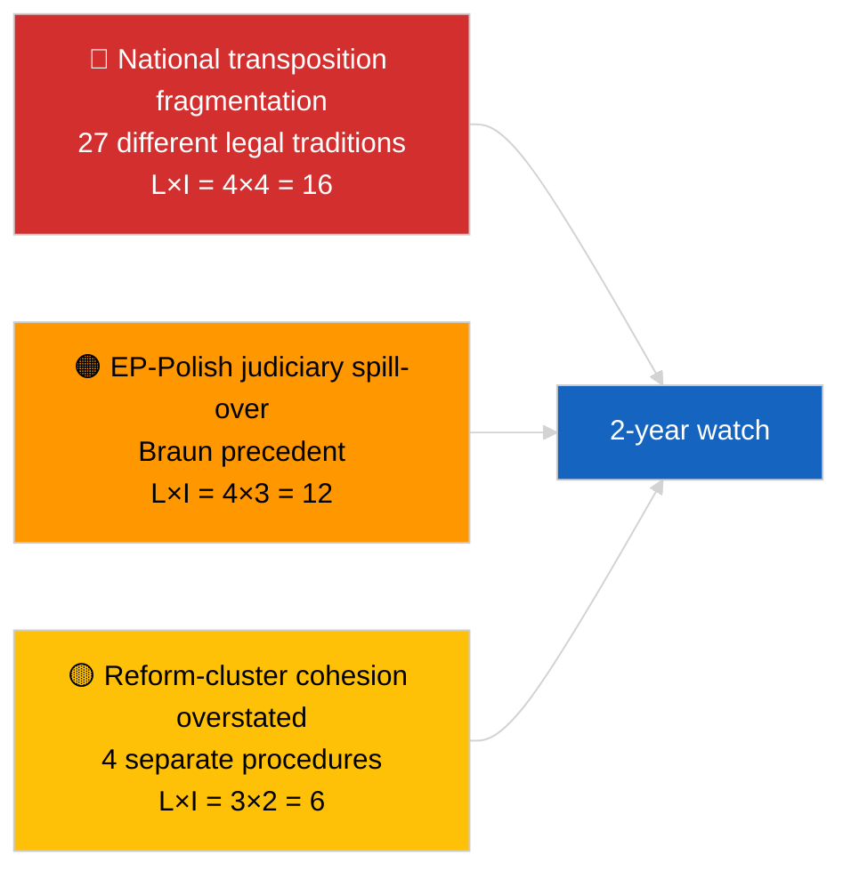

<!-- SPDX-FileCopyrightText: 2026 Hack23 AB -->
<!-- SPDX-License-Identifier: Apache-2.0 -->

# Executive Brief — Breaking (Anti-Corruption & Institutional Reform) | 2026-04-03

**Classification:** OSINT | Public Parliamentary Record
**Confidence:** 🟡 Medium (retrospective synthesis of March 2026 plenary adoptions)
**Generated:** 2026-04-03T00:00:00Z (retrospective brief)
**Article Type:** Breaking — Anti-Corruption and Institutional Reform Intelligence
**Source:** European Parliament Open Data Portal

---

## 🎯 BLUF

**The March 2026 plenary sessions produced a coherent four-text institutional-reform package — the most significant such cluster since the December 2022 Qatargate crisis.** The anchor is the **anti-corruption directive (TA-10-2026-0094, procedure 2023/0135, adopted 26 March 2026)** — three years from Commission proposal to EP adoption, reflecting both the political sensitivity of the file and the complexity of harmonising anti-corruption standards across 27 member states. Surrounding texts: **Braun immunity waiver (TA-10-2026-0088, procedure 2025/2192, adopted 26 March)**, **Better Law-Making report (TA-10-2026-0063, procedure 2025/2015, adopted 10 March)**, and **public access to documents review (TA-10-2026-0065, procedure 2025/2137, adopted 10 March)**. Together these reinforce EP10's institutional-credibility restoration arc. **🟡 MEDIUM confidence** on the "coherent package" framing (texts emerged from independent procedures; coherence is interpretive, not procedural).

---

## 🧭 3 Decisions This Brief Supports

| # | Decision | Who Decides | Deadline | Evidence |
|:-:|----------|-------------|:--------:|----------|
| 1 | **Editorial:** PUBLISH long-form institutional-reform piece tracing Qatargate → 2026 reform arc | Editor | +48h | 4-text cluster + 3-year procedure timeline |
| 2 | **Monitoring:** track national transposition deadlines for TA-10-2026-0094 (2-year window typical) | Analyst | quarterly | Member-state implementation reports |
| 3 | **Forward-watch:** flag follow-on immunity proceedings as Braun-precedent test cases | Analysis lead | 2026-04-30 | LIBE/JURI watch |

---

## 📰 60-Second Read

- 🔴 **TA-10-2026-0094 (anti-corruption directive)** — adopted 26 March 2026 after three years in procedure (proposed 2023). Foundational EU-wide harmonisation. (🟢 High on adoption; 🟡 Medium on framing significance)
- 🟠 **TA-10-2026-0088 (Braun immunity waiver)** — adopted same plenary; sets recent precedent for waivers of MEPs facing national criminal proceedings. (🟢 High)
- 🟢 **TA-10-2026-0063 (Better Law-Making report)** — adopted 10 March; baselines the regulatory-quality debate for the rest of EP10. (🟢 High)
- 🟡 **TA-10-2026-0065 (public access to documents review)** — adopted 10 March; complements the anti-corruption directive on the transparency vector. (🟢 High)
- 🔵 **Economic context:** anti-corruption directive harmonisation reduces compliance-cost variance for cross-border firms; positive single-market signal. (🟡 Medium)
- 🟣 **Cross-reference:** Qatargate (December 2022) was the catalysing political-corruption shock that began the reform arc culminating in this March 2026 cluster. (🟡 Medium)
- 🩷 **Disruption vector:** Braun-precedent spill-over to other MEPs facing national investigations (confirmed retrospectively by Jaki waiver TA-10-2026-0105 in April). (🟡 Medium at the time)
- ⚪ **Carry-forward:** national transposition of TA-10-2026-0094 typically requires 24 months; first compliance reports due ~Q1 2028.

---

## 🗂️ Top Documents / Procedures Table

| Rank | EP reference | Title (short) | Procedure | Significance | Confidence |
|:----:|--------------|---------------|-----------|:------------:|:----------:|
| 1 | TA-10-2026-0094 | Anti-corruption directive | 2023/0135 | 9.0 | 🟢 HIGH |
| 2 | TA-10-2026-0088 | Braun immunity waiver | 2025/2192 | 7.0 | 🟢 HIGH |
| 3 | TA-10-2026-0063 | Better Law-Making report | 2025/2015 | 7.0 | 🟢 HIGH |
| 4 | TA-10-2026-0065 | Public access to documents review | 2025/2137 | 7.0 | 🟢 HIGH |

---

## ⚠️ Risk & Threat Snapshot

| Risk | L | I | Score | Trigger | Source | Admiralty |
|------|:-:|:-:|:-----:|---------|--------|:---------:|
| National transposition fragmentation | 4 | 4 | 16 | Member-state non-compliance | TA-10-2026-0094 | A1 |
| EP-Polish judiciary spill-over | 4 | 3 | 12 | Further waiver cases | TA-10-2026-0088 | A1 |
| Reform-cluster framing overreach | 3 | 2 | 6 | Editorial overstatement | This run's synthesis | B3 |
| Better Law-Making operationalisation | 3 | 3 | 9 | Inter-institutional friction | TA-10-2026-0063 | A2 |

---

## 🔮 Top Forward Trigger

**Quarterly national-transposition reporting for TA-10-2026-0094 over 2026-2028.** The directive's success depends on consistent enforcement standards across all 27 member states — the first divergent transposition report (likely from one of the lower-rule-of-law jurisdictions) will be the principal forward indicator of whether the March 2026 reform cluster delivers institutional-credibility recovery in practice.

---

## 🛡️ Source Quality Assessment

- **Primary sources:** EP adopted-texts feed (one-week fallback active given DEGRADED API state); procedure registry for cited 2023/0135, 2025/2015, 2025/2137, 2025/2192.
- **Confidence on adoptions:** 🟢 HIGH.
- **Confidence on "cluster" framing:** 🟡 MEDIUM — procedural independence of the four texts is real; coherence is analyst inference, not institutional fact.

---

## 📎 Links

| Link | Path |
|------|------|
| Article | `./article.md` |
| Sibling runs | `analysis/daily/2026-04-03/breaking/` (coalition), `breaking-2/` (EP API reliability) |
| Manifest | `./manifest.json` |
| Source — adoptions | `analysis/daily/2026-03-10/` (Better Law-Making, public access), `analysis/daily/2026-03-26/` (anti-corruption, Braun) |

---

## 🔄 Cross-Reference

**Catalysing prior event:** Qatargate (December 2022) — the political-corruption shock that began the EP10 institutional-reform arc.

**Subsequent follow-on:** Jaki immunity waiver (TA-10-2026-0105, April 2026) confirms the Braun-precedent spill-over hypothesis.

---

**Document Control**
- **Template:** `/analysis/templates/executive-brief.md`
- **Artifact path:** `analysis/daily/2026-04-03/breaking-3/executive-brief.md`
- **Classification:** Public
- **Retrospective generation:** Back-fill session.
