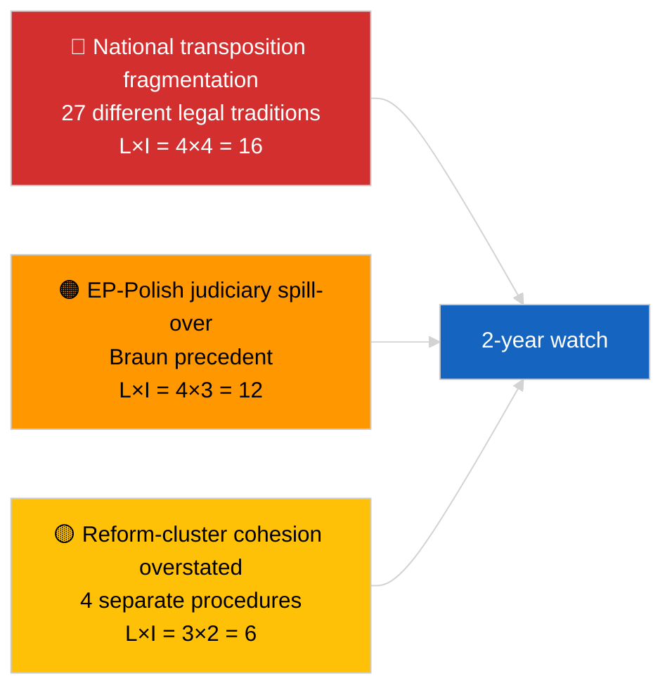

<!-- SPDX-FileCopyrightText: 2026 Hack23 AB -->
<!-- SPDX-License-Identifier: Apache-2.0 -->

# ملخص تنفيذي — عاجل (مكافحة الفساد والإصلاح المؤسسي) | 2026-04-03

**التصنيف:** OSINT | سجل برلماني عام
**مستوى الثقة:** 🟡 متوسط (تركيب استعادي لقرارات الجلسة العامة لمارس 2026)
**تاريخ الإنشاء:** 2026-04-03T00:00:00Z (ملخص استعادي)
**نوع المقال:** عاجل — استخبارات مكافحة الفساد والإصلاح المؤسسي
**المصدر:** بوابة البيانات المفتوحة للبرلمان الأوروبي

---

## 🎯 BLUF

**أسفرت الجلسات العامة لمارس 2026 عن حزمة إصلاح مؤسسي متماسكة مكونة من أربعة نصوص — وهو أهم تجمع من هذا النوع منذ أزمة قطرغيت في ديسمبر 2022.** النص المحوري هو **توجيه مكافحة الفساد (TA-10-2026-0094، الإجراء 2023/0135، الذي اعتُمد في 26 مارس 2026)** — ثلاث سنوات من اقتراح المفوضية إلى اعتماد البرلمان الأوروبي، مما يعكس الحساسية السياسية للملف وتعقيد توحيد معايير مكافحة الفساد عبر 27 دولة عضو. النصوص المصاحبة: **رفع الحصانة عن براون (TA-10-2026-0088، الإجراء 2025/2192، الذي اعتُمد في 26 مارس)**، **تقرير التشريع الأفضل (TA-10-2026-0063، الإجراء 2025/2015، الذي اعتُمد في 10 مارس)** و**مراجعة الوصول العام إلى الوثائق (TA-10-2026-0065، الإجراء 2025/2137، التي اعتُمدت في 10 مارس)**. تعزز هذه النصوص مجتمعةً قوس استعادة المصداقية المؤسسية للبرلمان الأوروبي في الدورة العاشرة. **ثقة 🟡 متوسطة** في إطار "الحزمة المتماسكة" (نشأت النصوص من إجراءات مستقلة؛ التماسك تفسيري وليس إجرائياً).

---

## 🧭 3 قرارات يدعمها هذا الملخص

| # | القرار | من يقرر | الموعد النهائي | الدليل |
|:-:|--------|---------|:--------------:|--------|
| 1 | **تحريري:** نشر مقالة مطولة عن الإصلاح المؤسسي تتتبع مسار قطرغيت → 2026 | رئيس التحرير | +48 ساعة | مجموعة 4 نصوص + جدول زمني لإجراءات 3 سنوات |
| 2 | **المراقبة:** تتبع المواعيد النهائية للتحويل الوطني لـ TA-10-2026-0094 (نافذة عامين نموذجية) | المحلل | ربع سنوي | تقارير تنفيذ الدول الأعضاء |
| 3 | **الرصد الاستشرافي:** تمييز إجراءات الحصانة التالية كحالات اختبار لسابقة براون | مدير التحليل | 2026-04-30 | مراقبة LIBE/JURI |

---

## 📰 قراءة في 60 ثانية

- 🔴 **TA-10-2026-0094 (توجيه مكافحة الفساد)** — اعتُمد في 26 مارس 2026 بعد ثلاث سنوات في الإجراء (مقترح عام 2023). توحيد أساسي على مستوى الاتحاد الأوروبي. (🟢 عالٍ عند الاعتماد؛ 🟡 متوسط في أهمية الإطار)
- 🟠 **TA-10-2026-0088 (رفع حصانة براون)** — اعتُمد في نفس الجلسة العامة؛ يضع سابقة حديثة لرفع حصانة أعضاء البرلمان الأوروبي الذين يواجهون إجراءات جنائية وطنية. (🟢 عالٍ)
- 🟢 **TA-10-2026-0063 (تقرير التشريع الأفضل)** — اعتُمد في 10 مارس؛ يحدد خط الأساس لمناقشة جودة التنظيم لبقية الدورة العاشرة. (🟢 عالٍ)
- 🟡 **TA-10-2026-0065 (مراجعة الوصول العام إلى الوثائق)** — اعتُمدت في 10 مارس؛ تكمل توجيه مكافحة الفساد على محور الشفافية. (🟢 عالٍ)
- 🔵 **السياق الاقتصادي:** يقلل توحيد توجيه مكافحة الفساد من تباين تكاليف الامتثال للشركات العابرة للحدود؛ إشارة إيجابية للسوق الداخلية. (🟡 متوسط)
- 🟣 **الإسناد المتقاطع:** كان قطرغيت (ديسمبر 2022) صدمة الفساد السياسي المحفزة التي بدأت قوس الإصلاح الذي بلغ ذروته في مجموعة مارس 2026. (🟡 متوسط)
- 🩷 **ناقل الاضطراب:** امتداد سابقة براون إلى أعضاء البرلمان الأوروبي الآخرين الذين يواجهون تحقيقات وطنية (ما تأكد استعادياً برفع حصانة ياكي TA-10-2026-0105 في أبريل). (🟡 متوسط في ذلك الوقت)
- ⚪ **الترحيل:** يتطلب التحويل الوطني لـ TA-10-2026-0094 عادةً 24 شهراً؛ أول تقارير امتثال تستحق ~الربع الأول 2028.

---

## 🗂️ الوثائق والإجراءات الرئيسية

| الترتيب | المرجع البرلماني | العنوان (مختصر) | الإجراء | الأهمية | الثقة |
|:-------:|-----------------|----------------|---------|:-------:|:------:|
| 1 | TA-10-2026-0094 | توجيه مكافحة الفساد | 2023/0135 | 9.0 | 🟢 عالية |
| 2 | TA-10-2026-0088 | رفع حصانة براون | 2025/2192 | 7.0 | 🟢 عالية |
| 3 | TA-10-2026-0063 | تقرير التشريع الأفضل | 2025/2015 | 7.0 | 🟢 عالية |
| 4 | TA-10-2026-0065 | مراجعة الوصول العام إلى الوثائق | 2025/2137 | 7.0 | 🟢 عالية |

---

## ⚠️ لقطة المخاطر والتهديدات

| الخطر | ل | ت | الدرجة | المحفز | المصدر | درجة الأدميرالية |
|-------|:-:|:-:|:------:|--------|--------|:----------------:|
| تجزئة التحويل الوطني | 4 | 4 | 16 | عدم امتثال دولة عضو | TA-10-2026-0094 | A1 |
| التداعيات القضائية البولندية في البرلمان الأوروبي | 4 | 3 | 12 | حالات حصانة إضافية | TA-10-2026-0088 | A1 |
| المبالغة في إطار تجمع الإصلاح | 3 | 2 | 6 | مبالغة تحريرية | تركيب هذه الجلسة | B3 |
| تشغيل التشريع الأفضل | 3 | 3 | 9 | احتكاك بين المؤسسات | TA-10-2026-0063 | A2 |

---

## 🔮 المحفز الاستشرافي الرئيسي

**التقارير الوطنية الفصلية للتحويل لـ TA-10-2026-0094 خلال 2026–2028.** يعتمد نجاح التوجيه على معايير تنفيذ متسقة عبر جميع الدول الأعضاء الـ 27 — أول تقرير تحويل متباين (من المرجح من إحدى الولايات القضائية ذات دولة القانون الأدنى) سيكون المؤشر الاستشرافي الرئيسي لما إذا كان تجمع إصلاح مارس 2026 يحقق استعادة المصداقية المؤسسية فعلياً.

---

## 🛡️ تقييم جودة المصادر

- **المصادر الأولية:** تغذية النصوص المعتمدة للبرلمان الأوروبي (احتياطي أسبوع واحد نشط نظراً لحالة API المتدهورة)؛ سجل الإجراءات للمراجع 2023/0135 و2025/2015 و2025/2137 و2025/2192.
- **الثقة في الاعتمادات:** 🟢 عالية.
- **الثقة في إطار "المجموعة":** 🟡 متوسطة — استقلالية الإجراءات للنصوص الأربعة حقيقية؛ التماسك استنتاج تحليلي وليس حقيقة مؤسسية.

---

## 📎 الروابط

| الرابط | المسار |
|--------|--------|
| المقالة | `./article.md` |
| التشغيلات الأخت | `analysis/daily/2026-04-03/breaking/` (التحالف)، `breaking-2/` (موثوقية API البرلمان الأوروبي) |
| البيان | `./manifest.json` |
| المصدر — الاعتمادات | `analysis/daily/2026-03-10/` (التشريع الأفضل، الوصول العام)، `analysis/daily/2026-03-26/` (مكافحة الفساد، براون) |

---

## 🔄 الإسناد المتقاطع

**الحدث المحفز السابق:** قطرغيت (ديسمبر 2022) — صدمة الفساد السياسي التي بدأت قوس الإصلاح المؤسسي للدورة العاشرة للبرلمان الأوروبي.

**التطور اللاحق:** رفع حصانة ياكي (TA-10-2026-0105، أبريل 2026) يؤكد فرضية امتداد سابقة براون.

---

**ضبط الوثيقة**
- **القالب:** `/analysis/templates/executive-brief.md`
- **مسار العنصر:** `analysis/daily/2026-04-03/breaking-3/executive-brief.md`
- **التصنيف:** عام
- **الإنشاء الاستعادي:** جلسة الملء.
