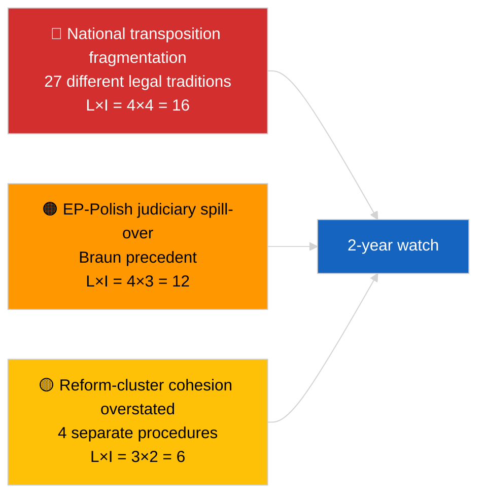

<!-- SPDX-FileCopyrightText: 2026 Hack23 AB -->
<!-- SPDX-License-Identifier: Apache-2.0 -->

# Kortfattet notat — Breaking (Antikorruption og institutionel reform) | 2026-04-03

**Klassifikation:** OSINT | Offentlig parlamentarisk dokumentation
**Tillid:** 🟡 Middel (retrospektiv syntese af mars 2026 plenarvedtagelser)
**Genereret:** 2026-04-03T00:00:00Z (retrospektivt notat)
**Artikeltype:** Breaking — Antikorruptions- og institutionel reformefterretning
**Kilde:** Europaparlamentets åbne dataportal

---

## 🎯 BLUF

**Mars 2026 plenarmøderne frembragte en sammenhængende firetekstsinstituionel reformpakke — den mest betydningsfulde sådanne klynge siden Qatargate-krisen i december 2022.** Ankerteksten er **antikorruptionsdirektivet (TA-10-2026-0094, procedure 2023/0135, vedtaget 26. marts 2026)** — tre år fra Kommissionens forslag til EP-vedtagelse, hvilket afspejler både den politiske følsomhed i sagen og kompleksiteten ved at harmonisere antikorruptionsstandarder på tværs af 27 medlemsstater. Omgivende tekster: **Brauns immunitetsophævelse (TA-10-2026-0088, procedure 2025/2192, vedtaget 26. marts)**, **rapporten om bedre lovgivning (TA-10-2026-0063, procedure 2025/2015, vedtaget 10. marts)** og **gennemgang af offentlig adgang til dokumenter (TA-10-2026-0065, procedure 2025/2137, vedtaget 10. marts)**. Tilsammen styrker disse EP10's bue mod genoprettelse af institutionel troværdighed. **🟡 MIDDEL-tillid** til indramningen "sammenhængende pakke" (teksterne opstod fra uafhængige procedurer; sammenhæng er fortolkende, ikke proceduremæssigt).

---

## 🧭 3 Beslutninger Dette Notat Understøtter

| # | Beslutning | Hvem beslutter | Deadline | Bevis |
|:-:|------------|----------------|:--------:|-------|
| 1 | **Redaktionelt:** UDGIV langt institutionelt reformstykke, der sporer Qatargate → reformbue 2026 | Redaktør | +48t | 4-tekstsklynge + 3-årig proceduretidslinje |
| 2 | **Overvågning:** spor nationale gennemførelsesfrister for TA-10-2026-0094 (2-årsvindue typisk) | Analytiker | kvartalsvis | Gennemførselsrapporter for medlemsstater |
| 3 | **Fremtidsovervågning:** markér opfølgende immunitetsforhandlinger som testcases for Braun-præcedens | Analysechef | 2026-04-30 | LIBE/JURI-overvågning |

---

## 📰 60-sekunders læsning

- 🔴 **TA-10-2026-0094 (antikorruptionsdirektivet)** — vedtaget 26. marts 2026 efter tre år i proceduren (foreslået 2023). Grundlæggende EU-dækkende harmonisering. (🟢 Høj ved vedtagelse; 🟡 Middel ved indrammingsignifikans)
- 🟠 **TA-10-2026-0088 (Brauns immunitetsophævelse)** — vedtaget på samme plenarmøde; sætter ny præcedens for ophævelser af MEP'er over for nationale straffesager. (🟢 Høj)
- 🟢 **TA-10-2026-0063 (rapporten om bedre lovgivning)** — vedtaget 10. marts; fastsætter basislinjen for debat om regelkvalitet for resten af EP10. (🟢 Høj)
- 🟡 **TA-10-2026-0065 (gennemgang af offentlig adgang til dokumenter)** — vedtaget 10. marts; komplementerer antikorruptionsdirektivet på transparensvektoren. (🟢 Høj)
- 🔵 **Økonomisk kontekst:** harmonisering af antikorruptionsdirektivet reducerer variansen i efterlevelsesomkostninger for grænseoverskridende virksomheder; positiv signal for det indre marked. (🟡 Middel)
- 🟣 **Krydsreference:** Qatargate (december 2022) var det katalyserende politiske korruptionschok, der begyndte reformbuen, som kulminerede i denne marts 2026-klynge. (🟡 Middel)
- 🩷 **Forstyrrelsesvektor:** Braun-præcedens spredning til andre MEP'er over for nationale undersøgelser (bekræftet retrospektivt ved Jakis immunitetsophævelse TA-10-2026-0105 i april). (🟡 Middel på det tidspunkt)
- ⚪ **Fremføring:** nationalt gennemførelse af TA-10-2026-0094 kræver typisk 24 måneder; første efterlevelsesrapporter forfaldne ~Q1 2028.

---

## 🗂️ Toptekster / Proceduretabel

| Rang | EP-reference | Titel (kort) | Procedure | Betydning | Tillid |
|:----:|--------------|--------------|-----------|:---------:|:------:|
| 1 | TA-10-2026-0094 | Antikorruptionsdirektiv | 2023/0135 | 9,0 | 🟢 HØJ |
| 2 | TA-10-2026-0088 | Brauns immunitetsophævelse | 2025/2192 | 7,0 | 🟢 HØJ |
| 3 | TA-10-2026-0063 | Rapport om bedre lovgivning | 2025/2015 | 7,0 | 🟢 HØJ |
| 4 | TA-10-2026-0065 | Gennemgang af offentlig adgang til dokumenter | 2025/2137 | 7,0 | 🟢 HØJ |

---

## ⚠️ Risiko- og trusselsbillede

| Risiko | L | I | Score | Udløser | Kilde | Admiralitet |
|--------|:-:|:-:|:-----:|---------|-------|:-----------:|
| National gennemførelsesfragmentering | 4 | 4 | 16 | Manglende overholdelse i medlemsstat | TA-10-2026-0094 | A1 |
| EP-polsk retsligspilover | 4 | 3 | 12 | Yderligere immunitetstilfælde | TA-10-2026-0088 | A1 |
| Overdrivelse af reformklyngeindramning | 3 | 2 | 6 | Redaktionel overdrivelse | Denne sessions syntese | B3 |
| Operationalisering af bedre lovgivning | 3 | 3 | 9 | Interinstitutionel friktion | TA-10-2026-0063 | A2 |

---

## 🔮 Vigtigste Fremadrettede Udløser

**Kvartalsvise nationale gennemførselsrapporter for TA-10-2026-0094 i 2026–2028.** Direktivets succes afhænger af ensartede håndhævelsesstandarder på tværs af alle 27 medlemsstater — den første afvigende gennemførselsrapport (sandsynligvis fra en af jurisdiktionerne med lavere retsstatsprincipper) vil være den vigtigste fremadrettede indikator for, om marts 2026-reformklyngen faktisk leverer genoprettelse af institutionel troværdighed i praksis.

---

## 🛡️ Kildekvakitetsvurdering

- **Primære kilder:** EP's vedtagne tekst-feed (en uges reserv aktiv givet FORRINGET API-tilstand); procedureregistret for citerede 2023/0135, 2025/2015, 2025/2137, 2025/2192.
- **Tillid til vedtagelser:** 🟢 HØJ.
- **Tillid til "klynge"-indramning:** 🟡 MIDDEL — de fire teksters proceduremæssige uafhængighed er reel; sammenhæng er analytisk inferens, ikke institutionel kendsgerning.

---

## 📎 Links

| Link | Sti |
|------|-----|
| Artikel | `./article.md` |
| Søsterkørsler | `analysis/daily/2026-04-03/breaking/` (koalition), `breaking-2/` (EP API-pålidelighed) |
| Manifest | `./manifest.json` |
| Kilde — vedtagelser | `analysis/daily/2026-03-10/` (Bedre lovgivning, offentlig adgang), `analysis/daily/2026-03-26/` (antikorruption, Braun) |

---

## 🔄 Krydsreference

**Katalyserende forudgående begivenhed:** Qatargate (december 2022) — det politiske korruptionschok, der begyndte EP10's institutionelle reformbue.

**Efterfølgende opfølgning:** Jakis immunitetsophævelse (TA-10-2026-0105, april 2026) bekræfter hypotesen om Braun-præcedens spredning.

---

**Dokumentkontrol**
- **Skabelon:** `/analysis/templates/executive-brief.md`
- **Artefaktsti:** `analysis/daily/2026-04-03/breaking-3/executive-brief.md`
- **Klassifikation:** Offentlig
- **Retrospektiv generering:** Tilbagefyldningssession.
