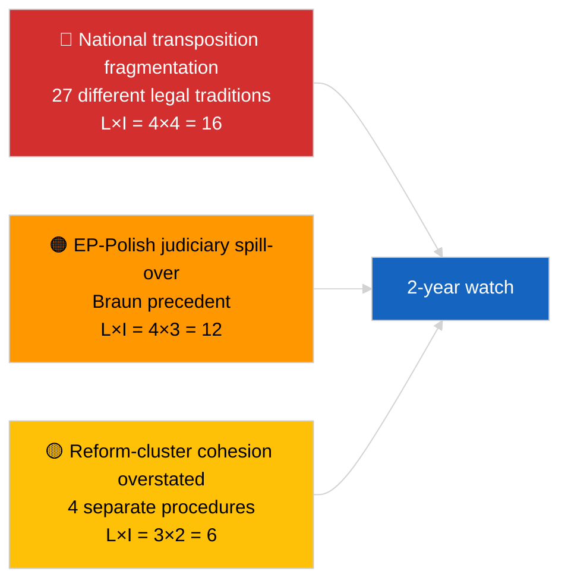

<!-- SPDX-FileCopyrightText: 2026 Hack23 AB -->
<!-- SPDX-License-Identifier: Apache-2.0 -->

# Kurzbericht — Eilmeldung (Antikorruption und institutionelle Reform) | 2026-04-03

**Klassifizierung:** OSINT | Öffentliche parlamentarische Aufzeichnung
**Konfidenz:** 🟡 Mittel (retrospektive Synthese der Plenarverabschiedungen vom März 2026)
**Erstellt:** 2026-04-03T00:00:00Z (retrospektiver Bericht)
**Artikeltyp:** Eilmeldung — Antikorruptions- und institutionelle Reformaufklärung
**Quelle:** Offenes Datenportal des Europäischen Parlaments

---

## 🎯 BLUF

**Die Plenarsitzungen im März 2026 produzierten ein kohärentes Vier-Texte-Paket zur institutionellen Reform — das bedeutsamste derartige Cluster seit der Qatargate-Krise im Dezember 2022.** Der Ankertext ist die **Anti-Korruptionsrichtlinie (TA-10-2026-0094, Verfahren 2023/0135, angenommen am 26. März 2026)** — drei Jahre vom Kommissionsvorschlag bis zur EP-Annahme, was sowohl die politische Empfindlichkeit der Akte als auch die Komplexität der Harmonisierung von Antikorruptionsstandards in 27 Mitgliedstaaten widerspiegelt. Begleitende Texte: **Immunitätsaufhebung Braun (TA-10-2026-0088, Verfahren 2025/2192, angenommen 26. März)**, **Bericht über bessere Rechtsetzung (TA-10-2026-0063, Verfahren 2025/2015, angenommen 10. März)** und **Überprüfung des öffentlichen Zugangs zu Dokumenten (TA-10-2026-0065, Verfahren 2025/2137, angenommen 10. März)**. Zusammen stärken diese den Bogen von EP10 zur Wiederherstellung institutioneller Glaubwürdigkeit. **🟡 MITTLERE Konfidenz** bei der Rahmung "kohärentes Paket" (die Texte entstanden aus unabhängigen Verfahren; Kohärenz ist interpretativ, nicht verfahrensmäßig).

---

## 🧭 3 Entscheidungen, die dieser Bericht unterstützt

| # | Entscheidung | Wer entscheidet | Frist | Nachweis |
|:-:|--------------|-----------------|:-----:|----------|
| 1 | **Redaktionell:** VERÖFFENTLICHE umfangreichen institutionellen Reformartikel, der den Bogen Qatargate → 2026 nachzeichnet | Redakteur | +48h | 4-Texte-Cluster + 3-jährige Verfahrenstimeline |
| 2 | **Überwachung:** Nationale Umsetzungsfristen für TA-10-2026-0094 verfolgen (2-Jahres-Fenster typisch) | Analyst | vierteljährlich | Umsetzungsberichte der Mitgliedstaaten |
| 3 | **Vorausschau:** Folge-Immunitätsverfahren als Testfälle für Braun-Präzedenz markieren | Analyselead | 2026-04-30 | LIBE/JURI-Überwachung |

---

## 📰 60-Sekunden-Lektüre

- 🔴 **TA-10-2026-0094 (Anti-Korruptionsrichtlinie)** — angenommen 26. März 2026 nach drei Jahren im Verfahren (vorgeschlagen 2023). Grundlegende EU-weite Harmonisierung. (🟢 Hoch bei Annahme; 🟡 Mittel bei Rahmungsbedeutung)
- 🟠 **TA-10-2026-0088 (Immunitätsaufhebung Braun)** — auf derselben Plenarsitzung angenommen; schafft neuen Präzedenzfall für Immunitätsaufhebungen bei MdEP, die nationalen Strafverfahren gegenüberstehen. (🟢 Hoch)
- 🟢 **TA-10-2026-0063 (Bericht über bessere Rechtsetzung)** — angenommen 10. März; legt die Basislinie für die Regulierungsqualitätsdebatte für den Rest von EP10 fest. (🟢 Hoch)
- 🟡 **TA-10-2026-0065 (Überprüfung des öffentlichen Zugangs zu Dokumenten)** — angenommen 10. März; ergänzt die Anti-Korruptionsrichtlinie auf dem Transparenzvektor. (🟢 Hoch)
- 🔵 **Wirtschaftlicher Kontext:** Harmonisierung der Anti-Korruptionsrichtlinie reduziert die Varianz der Compliance-Kosten für grenzüberschreitende Unternehmen; positives Signal für den Binnenmarkt. (🟡 Mittel)
- 🟣 **Querverweise:** Qatargate (Dezember 2022) war der katalysierende politische Korruptionsschock, der den Reformbogen einleitete, der in diesem März-2026-Cluster gipfelte. (🟡 Mittel)
- 🩷 **Störungsvektor:** Ausweitung des Braun-Präzedenzfalls auf andere MdEP, die nationalen Ermittlungen gegenüberstehen (retrospektiv bestätigt durch Immunitätsaufhebung Jaki TA-10-2026-0105 im April). (🟡 Mittel zum damaligen Zeitpunkt)
- ⚪ **Übertrag:** Nationale Umsetzung von TA-10-2026-0094 erfordert typischerweise 24 Monate; erste Compliance-Berichte fällig ~Q1 2028.

---

## 🗂️ Top-Dokumente / Verfahrenstabelle

| Rang | EP-Referenz | Titel (kurz) | Verfahren | Bedeutung | Konfidenz |
|:----:|-------------|--------------|-----------|:---------:|:---------:|
| 1 | TA-10-2026-0094 | Anti-Korruptionsrichtlinie | 2023/0135 | 9,0 | 🟢 HOCH |
| 2 | TA-10-2026-0088 | Immunitätsaufhebung Braun | 2025/2192 | 7,0 | 🟢 HOCH |
| 3 | TA-10-2026-0063 | Bericht über bessere Rechtsetzung | 2025/2015 | 7,0 | 🟢 HOCH |
| 4 | TA-10-2026-0065 | Überprüfung öffentlicher Dokumentenzugang | 2025/2137 | 7,0 | 🟢 HOCH |

---

## ⚠️ Risiko- und Bedrohungsschnappschuss

| Risiko | L | I | Wert | Auslöser | Quelle | Admiralität |
|--------|:-:|:-:|:----:|----------|--------|:-----------:|
| Nationale Umsetzungsfragmentierung | 4 | 4 | 16 | Nichteinhaltung durch Mitgliedstaat | TA-10-2026-0094 | A1 |
| EP-Polnisches Justiz-Spillover | 4 | 3 | 12 | Weitere Immunitätsfälle | TA-10-2026-0088 | A1 |
| Übertreibung der Reformcluster-Rahmung | 3 | 2 | 6 | Redaktionelle Übertreibung | Synthese dieser Sitzung | B3 |
| Operationalisierung besserer Rechtsetzung | 3 | 3 | 9 | Interinstitutionelle Reibung | TA-10-2026-0063 | A2 |

---

## 🔮 Wichtigster Vorwärtstrigger

**Vierteljährliche nationale Umsetzungsberichte für TA-10-2026-0094 in den Jahren 2026–2028.** Der Erfolg der Richtlinie hängt von einheitlichen Durchsetzungsstandards in allen 27 Mitgliedstaaten ab — der erste abweichende Umsetzungsbericht (wahrscheinlich aus einer der Rechtssysteme mit niedrigerer Rechtsstaatlichkeit) wird der wichtigste Vorwärtsindikator dafür sein, ob das März-2026-Reformcluster in der Praxis die Wiederherstellung institutioneller Glaubwürdigkeit liefert.

---

## 🛡️ Quellenqualitätsbewertung

- **Primärquellen:** EP-Feed für angenommene Texte (ein-Wochen-Fallback aktiv angesichts des DEGRADIERTEN API-Zustands); Verfahrensregister für zitierte 2023/0135, 2025/2015, 2025/2137, 2025/2192.
- **Konfidenz bei Annahmen:** 🟢 HOCH.
- **Konfidenz bei "Cluster"-Rahmung:** 🟡 MITTEL — die verfahrensmäßige Unabhängigkeit der vier Texte ist real; Kohärenz ist analytische Inferenz, kein institutionelles Faktum.

---

## 📎 Links

| Link | Pfad |
|------|------|
| Artikel | `./article.md` |
| Schwestervorgänge | `analysis/daily/2026-04-03/breaking/` (Koalition), `breaking-2/` (EP API-Zuverlässigkeit) |
| Manifest | `./manifest.json` |
| Quelle — Annahmen | `analysis/daily/2026-03-10/` (Bessere Rechtsetzung, öffentlicher Zugang), `analysis/daily/2026-03-26/` (Antikorruption, Braun) |

---

## 🔄 Querverweis

**Katalysierendes Vorereignis:** Qatargate (Dezember 2022) — der politische Korruptionsschock, der den institutionellen Reformbogen von EP10 einleitete.

**Nachfolgende Entwicklung:** Immunitätsaufhebung Jaki (TA-10-2026-0105, April 2026) bestätigt die Hypothese der Braun-Präzedenz-Ausbreitung.

---

**Dokumentenkontrolle**
- **Vorlage:** `/analysis/templates/executive-brief.md`
- **Artefaktpfad:** `analysis/daily/2026-04-03/breaking-3/executive-brief.md`
- **Klassifizierung:** Öffentlich
- **Retrospektive Erstellung:** Auffüllungssitzung.
