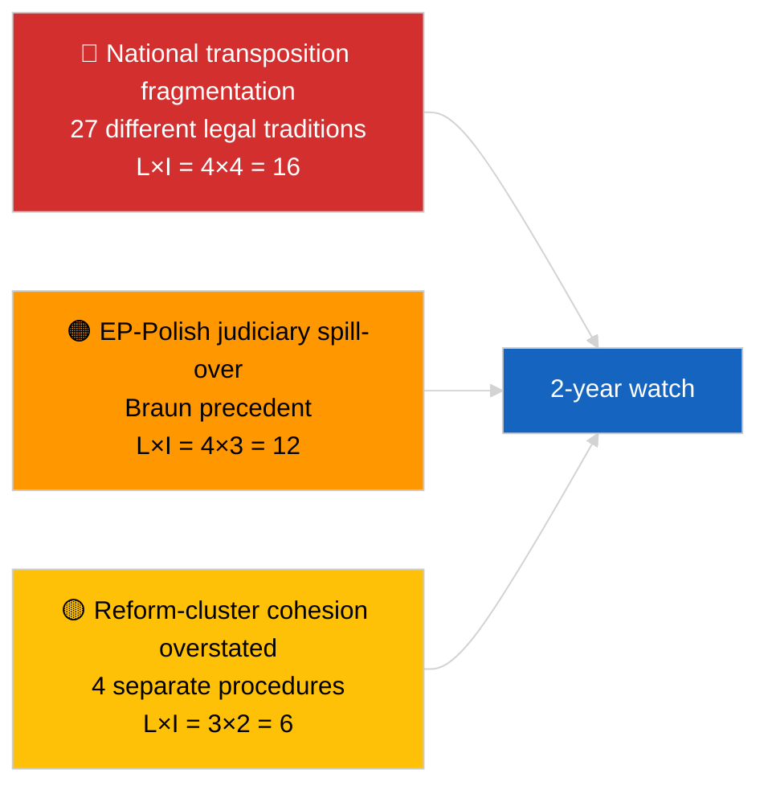

<!-- SPDX-FileCopyrightText: 2026 Hack23 AB -->
<!-- SPDX-License-Identifier: Apache-2.0 -->

# Informe ejecutivo — Última hora (Anticorrupción y reforma institucional) | 2026-04-03

**Clasificación:** OSINT | Registro parlamentario público
**Confianza:** 🟡 Media (síntesis retrospectiva de las adopciones del pleno de marzo de 2026)
**Generado:** 2026-04-03T00:00:00Z (informe retrospectivo)
**Tipo de artículo:** Última hora — Inteligencia anticorrupción y de reforma institucional
**Fuente:** Portal de datos abiertos del Parlamento Europeo

---

## 🎯 BLUF

**Las sesiones plenarias de marzo de 2026 produjeron un coherente paquete de cuatro textos de reforma institucional — el grupo más significativo desde la crisis del Qatargate en diciembre de 2022.** El texto ancla es la **directiva anticorrupción (TA-10-2026-0094, procedimiento 2023/0135, adoptada el 26 de marzo de 2026)** — tres años desde la propuesta de la Comisión hasta la adopción por el PE, lo que refleja tanto la sensibilidad política del expediente como la complejidad de armonizar las normas anticorrupción en 27 estados miembros. Textos complementarios: **levantamiento de la inmunidad de Braun (TA-10-2026-0088, procedimiento 2025/2192, adoptado el 26 de marzo)**, **informe sobre la mejora de la legislación (TA-10-2026-0063, procedimiento 2025/2015, adoptado el 10 de marzo)** y **revisión del acceso público a los documentos (TA-10-2026-0065, procedimiento 2025/2137, adoptada el 10 de marzo)**. En conjunto, estos textos refuerzan el arco de restauración de la credibilidad institucional del PE10. **Confianza 🟡 MEDIA** en el encuadre de "paquete coherente" (los textos surgieron de procedimientos independientes; la coherencia es interpretativa, no procedimental).

---

## 🧭 3 Decisiones que apoya este informe

| # | Decisión | Quién decide | Plazo | Evidencia |
|:-:|----------|--------------|:-----:|-----------|
| 1 | **Editorial:** PUBLICAR un extenso artículo de reforma institucional que rastree el arco Qatargate → 2026 | Editor | +48h | Grupo de 4 textos + cronología de procedimiento de 3 años |
| 2 | **Seguimiento:** rastrear los plazos de transposición nacional para TA-10-2026-0094 (ventana de 2 años típica) | Analista | trimestral | Informes de implementación de los estados miembros |
| 3 | **Vigilancia prospectiva:** marcar los procedimientos de inmunidad de seguimiento como casos de prueba del precedente Braun | Responsable de análisis | 2026-04-30 | Vigilancia LIBE/JURI |

---

## 📰 Lectura de 60 segundos

- 🔴 **TA-10-2026-0094 (directiva anticorrupción)** — adoptada el 26 de marzo de 2026 tras tres años en procedimiento (propuesta en 2023). Armonización fundamental a escala de la UE. (🟢 Alta en adopción; 🟡 Media en significado del encuadre)
- 🟠 **TA-10-2026-0088 (levantamiento de inmunidad de Braun)** — adoptado en la misma sesión plenaria; establece un precedente reciente para el levantamiento de la inmunidad de eurodiputados que afrontan procesos penales nacionales. (🟢 Alta)
- 🟢 **TA-10-2026-0063 (informe sobre la mejora de la legislación)** — adoptado el 10 de marzo; establece la línea base para el debate sobre la calidad regulatoria para el resto del PE10. (🟢 Alta)
- 🟡 **TA-10-2026-0065 (revisión del acceso público a los documentos)** — adoptada el 10 de marzo; complementa la directiva anticorrupción en el vector de transparencia. (🟢 Alta)
- 🔵 **Contexto económico:** la armonización de la directiva anticorrupción reduce la varianza de los costes de cumplimiento para las empresas transfronterizas; señal positiva para el mercado único. (🟡 Media)
- 🟣 **Referencia cruzada:** el Qatargate (diciembre de 2022) fue el shock de corrupción política catalizador que inició el arco de reforma que culminó en este grupo de marzo de 2026. (🟡 Media)
- 🩷 **Vector de perturbación:** extensión del precedente Braun a otros eurodiputados que afrontan investigaciones nacionales (confirmada retrospectivamente por el levantamiento de inmunidad de Jaki TA-10-2026-0105 en abril). (🟡 Media en el momento)
- ⚪ **Arrastre:** la transposición nacional de TA-10-2026-0094 requiere típicamente 24 meses; primeros informes de cumplimiento previstos ~T1 2028.

---

## 🗂️ Principales documentos / Tabla de procedimientos

| Rango | Referencia PE | Título (corto) | Procedimiento | Importancia | Confianza |
|:-----:|---------------|----------------|---------------|:-----------:|:---------:|
| 1 | TA-10-2026-0094 | Directiva anticorrupción | 2023/0135 | 9,0 | 🟢 ALTA |
| 2 | TA-10-2026-0088 | Levantamiento de inmunidad de Braun | 2025/2192 | 7,0 | 🟢 ALTA |
| 3 | TA-10-2026-0063 | Informe sobre la mejora de la legislación | 2025/2015 | 7,0 | 🟢 ALTA |
| 4 | TA-10-2026-0065 | Revisión del acceso público a los documentos | 2025/2137 | 7,0 | 🟢 ALTA |

---

## ⚠️ Instantánea de riesgos y amenazas

| Riesgo | L | I | Puntuación | Desencadenante | Fuente | Almirantazgo |
|--------|:-:|:-:|:----------:|----------------|--------|:------------:|
| Fragmentación de la transposición nacional | 4 | 4 | 16 | Incumplimiento de un estado miembro | TA-10-2026-0094 | A1 |
| Desbordamiento judicial EP-Polonia | 4 | 3 | 12 | Nuevos casos de inmunidad | TA-10-2026-0088 | A1 |
| Sobredimensionamiento del encuadre del grupo de reforma | 3 | 2 | 6 | Sobredimensionamiento editorial | Síntesis de esta sesión | B3 |
| Operacionalización de la mejora legislativa | 3 | 3 | 9 | Fricción interinstitucional | TA-10-2026-0063 | A2 |

---

## 🔮 Principal desencadenante prospectivo

**Informes trimestrales de transposición nacional para TA-10-2026-0094 durante 2026–2028.** El éxito de la directiva depende de normas de aplicación coherentes en los 27 estados miembros — el primer informe de transposición divergente (probablemente de una de las jurisdicciones con menor Estado de Derecho) será el principal indicador avanzado de si el grupo de reformas de marzo de 2026 logra la restauración de la credibilidad institucional en la práctica.

---

## 🛡️ Evaluación de la calidad de las fuentes

- **Fuentes primarias:** fuente de textos adoptados del PE (reserva de una semana activa dado el estado DEGRADADO de la API); registro de procedimientos para los procedimientos 2023/0135, 2025/2015, 2025/2137, 2025/2192 citados.
- **Confianza en las adopciones:** 🟢 ALTA.
- **Confianza en el encuadre de "grupo":** 🟡 MEDIA — la independencia procedimental de los cuatro textos es real; la coherencia es inferencia analítica, no hecho institucional.

---

## 📎 Enlaces

| Enlace | Ruta |
|--------|------|
| Artículo | `./article.md` |
| Ejecuciones hermanas | `analysis/daily/2026-04-03/breaking/` (coalición), `breaking-2/` (fiabilidad API PE) |
| Manifiesto | `./manifest.json` |
| Fuente — adopciones | `analysis/daily/2026-03-10/` (Mejora de la legislación, acceso público), `analysis/daily/2026-03-26/` (anticorrupción, Braun) |

---

## 🔄 Referencia cruzada

**Evento previo catalizador:** Qatargate (diciembre de 2022) — el shock de corrupción política que inició el arco de reforma institucional del PE10.

**Seguimiento posterior:** Levantamiento de inmunidad de Jaki (TA-10-2026-0105, abril de 2026) confirma la hipótesis de extensión del precedente Braun.

---

**Control documental**
- **Plantilla:** `/analysis/templates/executive-brief.md`
- **Ruta del artefacto:** `analysis/daily/2026-04-03/breaking-3/executive-brief.md`
- **Clasificación:** Público
- **Generación retrospectiva:** Sesión de relleno.
