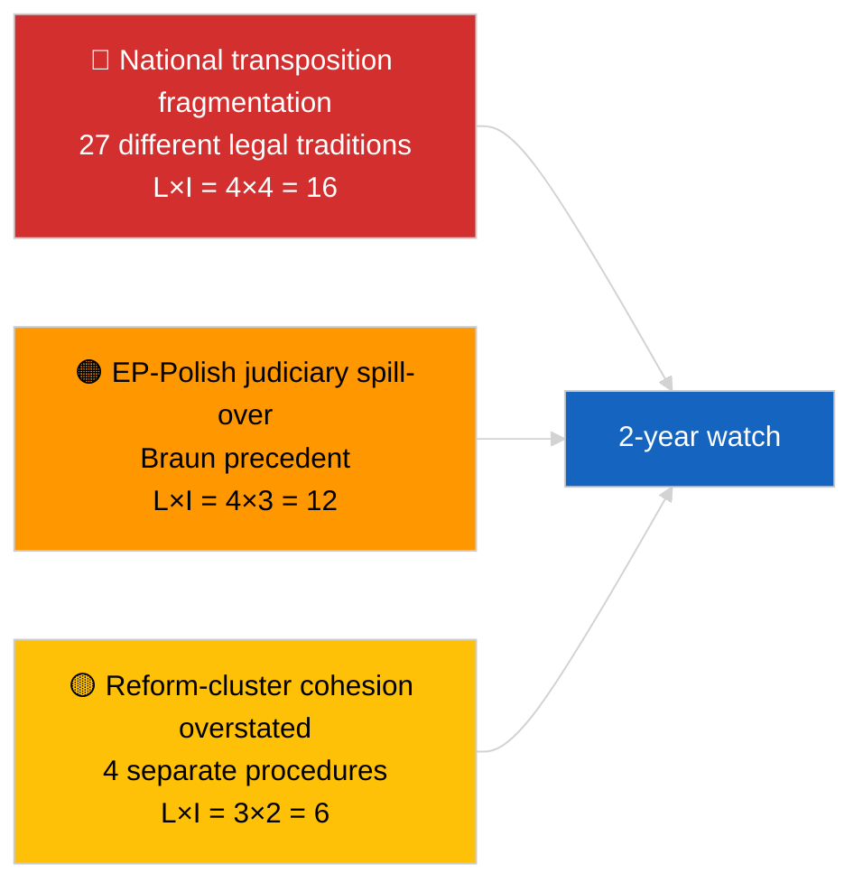

<!-- SPDX-FileCopyrightText: 2026 Hack23 AB -->
<!-- SPDX-License-Identifier: Apache-2.0 -->

# Tiivistelmä — Breaking (Korruption vastainen toiminta ja institutionaalinen uudistus) | 2026-04-03

**Luokitus:** OSINT | Julkinen parlamentaarinen asiakirja
**Luotettavuus:** 🟡 Kohtalainen (maaliskuun 2026 täysistuntojen hyväksyntöjen retrospektiivinen synteesi)
**Luotu:** 2026-04-03T00:00:00Z (retrospektiivinen tiivistelmä)
**Artikkelityyppi:** Breaking — Korruption vastainen ja institutionaalinen uudistustiedustelu
**Lähde:** Euroopan parlamentin avoin dataporttali

---

## 🎯 BLUF

**Maaliskuun 2026 täysistunnot tuottivat johdonmukaisen neljän asiakirjan institutionaalisen uudistuspaketin — merkittävimmän tällaisen ryhmän sitten joulukuun 2022 Qatargate-kriisin.** Ankkuriteksti on **korruption vastainen direktiivi (TA-10-2026-0094, menettely 2023/0135, hyväksytty 26. maaliskuuta 2026)** — kolme vuotta komission ehdotuksesta EP:n hyväksyntään, mikä heijastaa sekä asian poliittista herkkyyttä että 27 jäsenvaltion korruption vastaisten standardien yhdenmukaistamisen monimutkaisuutta. Ympäröivät tekstit: **Braunin koskemattomuuden peruuttaminen (TA-10-2026-0088, menettely 2025/2192, hyväksytty 26. maaliskuuta)**, **raportti paremmasta lainsäädännöstä (TA-10-2026-0063, menettely 2025/2015, hyväksytty 10. maaliskuuta)** ja **julkisen asiakirjoihin pääsyn tarkistelu (TA-10-2026-0065, menettely 2025/2137, hyväksytty 10. maaliskuuta)**. Yhdessä nämä vahvistavat EP10:n kaaren kohti institutionaalisen uskottavuuden palauttamista. **🟡 KOHTALAINEN luotettavuus** "johdonmukaiselle paketille" -kehystyksessä (tekstit syntyivät itsenäisistä menettelyistä; johdonmukaisuus on tulkitseva, ei menettelyllinen).

---

## 🧭 3 Päätöstä, Joita Tämä Tiivistelmä Tukee

| # | Päätös | Kuka päättää | Määräaika | Todisteet |
|:-:|--------|--------------|:---------:|-----------|
| 1 | **Toimituksellinen:** JULKAISE pitkä institutionaalinen uudistusartikkeli, joka jäljittää Qatargate → uudistuskaari 2026 | Toimittaja | +48h | 4-asiakirjaryhmä + 3-vuotinen menettelyaikajana |
| 2 | **Seuranta:** seuraa kansallisia täytäntöönpanoaikatauluja TA-10-2026-0094 (2-vuotinen ikkuna tyypillinen) | Analyytikko | neljännesvuosittain | Jäsenvaltioiden täytäntöönpanoraportit |
| 3 | **Ennakkokatse:** merkitse jatkotoimet koskemattomuusmenettelyt Braun-ennakkotapauksen testitapauksiksi | Analyysipäällikkö | 2026-04-30 | LIBE/JURI-seuranta |

---

## 📰 60 sekunnin lukeminen

- 🔴 **TA-10-2026-0094 (korruption vastainen direktiivi)** — hyväksytty 26. maaliskuuta 2026 kolmen vuoden menettelyn jälkeen (ehdotettu 2023). Perustavanlaatuinen EU:n laajuinen yhdenmukaistaminen. (🟢 Korkea hyväksynnässä; 🟡 Kohtalainen kehystysmerkityksessä)
- 🟠 **TA-10-2026-0088 (Braunin koskemattomuuden peruuttaminen)** — hyväksytty samassa täysistunnossa; asettaa uuden ennakkotapauksen koskemattomuuden peruuttamiselle MEP:ille, jotka kohtaavat kansallisia rikossyytteitä. (🟢 Korkea)
- 🟢 **TA-10-2026-0063 (raportti paremmasta lainsäädännöstä)** — hyväksytty 10. maaliskuuta; asettaa peruslinjan sääntelylaatukeskustelulle EP10:n lopulle. (🟢 Korkea)
- 🟡 **TA-10-2026-0065 (julkisen asiakirjoihin pääsyn tarkistelu)** — hyväksytty 10. maaliskuuta; täydentää korruption vastaista direktiiviä avoimuusvektorilla. (🟢 Korkea)
- 🔵 **Taloudellinen konteksti:** korruption vastaisen direktiivin yhdenmukaistaminen vähentää vaatimustenmukaisuuskustannusten varianssia rajat ylittäville yrityksille; myönteinen signaali sisämarkkinoille. (🟡 Kohtalainen)
- 🟣 **Ristiviittaus:** Qatargate (joulukuu 2022) oli katalysoiva poliittinen korruptiosokki, joka aloitti uudistuskaaren, joka kulminoitui tähän maaliskuun 2026 ryhmään. (🟡 Kohtalainen)
- 🩷 **Häiriövektori:** Braunin ennakkotapauksen leviäminen muihin MEP:eihin, jotka kohtaavat kansallisia tutkimuksia (vahvistettu retrospektiivisesti Jakin koskemattomuuden peruuttamisella TA-10-2026-0105 huhtikuussa). (🟡 Kohtalainen silloin)
- ⚪ **Eteenpäin vieminen:** kansallinen TA-10-2026-0094:n täytäntöönpano vaatii tyypillisesti 24 kuukautta; ensimmäiset vaatimustenmukaisuusraportit erääntyvät ~Q1 2028.

---

## 🗂️ Tärkeimmät Asiakirjat / Menettelytaulukko

| Sijoitus | EP-viite | Otsikko (lyhyt) | Menettely | Merkitys | Luotettavuus |
|:--------:|----------|-----------------|-----------|:--------:|:------------:|
| 1 | TA-10-2026-0094 | Korruption vastainen direktiivi | 2023/0135 | 9,0 | 🟢 KORKEA |
| 2 | TA-10-2026-0088 | Braunin koskemattomuuden peruuttaminen | 2025/2192 | 7,0 | 🟢 KORKEA |
| 3 | TA-10-2026-0063 | Raportti paremmasta lainsäädännöstä | 2025/2015 | 7,0 | 🟢 KORKEA |
| 4 | TA-10-2026-0065 | Julkisen asiakirjoihin pääsyn tarkistelu | 2025/2137 | 7,0 | 🟢 KORKEA |

---

## ⚠️ Riski- ja uhkatilannekuva

| Riski | L | I | Pisteet | Laukaisija | Lähde | Admiraliteetti |
|-------|:-:|:-:|:-------:|------------|-------|:--------------:|
| Kansallinen täytäntöönpanosplittautuminen | 4 | 4 | 16 | Jäsenvaltion noudattamatta jättäminen | TA-10-2026-0094 | A1 |
| EP-puolalainen oikeuslaitosleviäminen | 4 | 3 | 12 | Lisää koskemattomuustapauksia | TA-10-2026-0088 | A1 |
| Uudistusryhmän kehystyksen liioittelu | 3 | 2 | 6 | Toimituksellinen liioittelu | Tämän istunnon synteesi | B3 |
| Paremman lainsäädännön operationalisointi | 3 | 3 | 9 | Toimielinten välinen kitka | TA-10-2026-0063 | A2 |

---

## 🔮 Tärkein Eteenpäin Katsova Laukaisija

**Neljännesvuosittaiset kansalliset täytäntöönpanoraportit TA-10-2026-0094:lle vuosina 2026–2028.** Direktiivin menestys riippuu yhdenmukaisista täytäntöönpanostandardeista kaikissa 27 jäsenvaltiossa — ensimmäinen poikkeava täytäntöönpanoraportti (todennäköisesti jostakin alhaisemman oikeusvaltioperiaatteen lainkäyttöalueelta) on tärkein eteenpäin katsova indikaattori siitä, toimittaako maaliskuun 2026 uudistusryhmä institutionaalisen uskottavuuden palauttamisen käytännössä.

---

## 🛡️ Lähteen Laadun Arviointi

- **Ensisijaiset lähteet:** EP:n hyväksyttyjen tekstien syöte (yhden viikon varasuunnitelma aktiivinen HEIKENTYNEEN API-tilan vuoksi); menettelyrekisteri siteeratuille 2023/0135, 2025/2015, 2025/2137, 2025/2192.
- **Luotettavuus hyväksynnöissä:** 🟢 KORKEA.
- **Luotettavuus "ryhmä"-kehystyksessä:** 🟡 KOHTALAINEN — neljän tekstin menettelyllinen riippumattomuus on todellinen; johdonmukaisuus on analyyttinen päättely, ei institutionaalinen tosiasia.

---

## 📎 Linkit

| Linkki | Polku |
|--------|-------|
| Artikkeli | `./article.md` |
| Sisarsuoritukset | `analysis/daily/2026-04-03/breaking/` (koalitio), `breaking-2/` (EP API-luotettavuus) |
| Manifesti | `./manifest.json` |
| Lähde — hyväksynnät | `analysis/daily/2026-03-10/` (Parempi lainsäädäntö, julkinen pääsy), `analysis/daily/2026-03-26/` (korruption vastainen, Braun) |

---

## 🔄 Ristiviittaus

**Katalysoiva aiempi tapahtuma:** Qatargate (joulukuu 2022) — poliittinen korruptiosokki, joka aloitti EP10:n institutionaalisen uudistuskaaren.

**Myöhempi jatkotoimenpide:** Jakin koskemattomuuden peruuttaminen (TA-10-2026-0105, huhtikuu 2026) vahvistaa hypoteesin Braunin ennakkotapauksen leviämisestä.

---

**Asiakirjavalvonta**
- **Malli:** `/analysis/templates/executive-brief.md`
- **Artefaktipolku:** `analysis/daily/2026-04-03/breaking-3/executive-brief.md`
- **Luokitus:** Julkinen
- **Retrospektiivinen luominen:** Täyttöistunto.
