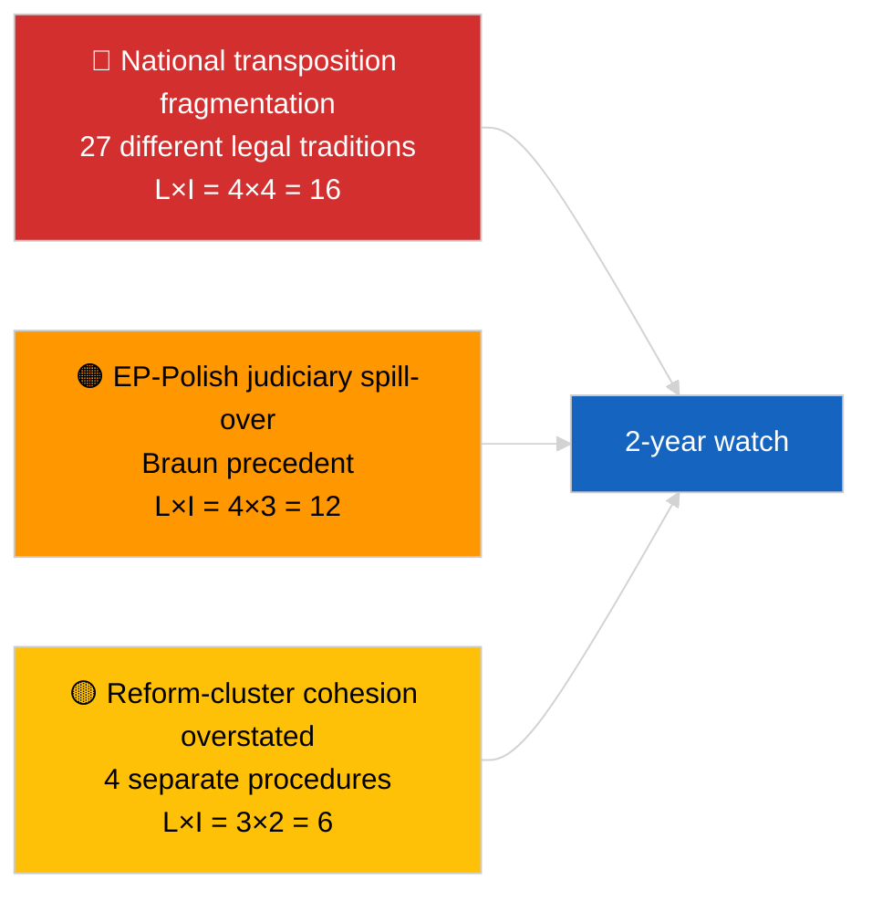

<!-- SPDX-FileCopyrightText: 2026 Hack23 AB -->
<!-- SPDX-License-Identifier: Apache-2.0 -->

# Note de synthèse — Breaking (Lutte anticorruption et réforme institutionnelle) | 2026-04-03

**Classification :** OSINT | Dossier parlementaire public
**Confiance :** 🟡 Moyenne (synthèse rétrospective des adoptions de la session plénière de mars 2026)
**Générée :** 2026-04-03T00:00:00Z (note rétrospective)
**Type d'article :** Breaking — Renseignement anticorruption et réforme institutionnelle
**Source :** Portail de données ouvertes du Parlement européen

---

## 🎯 BLUF

**Les sessions plénières de mars 2026 ont produit un ensemble cohérent de quatre textes de réforme institutionnelle — le regroupement le plus significatif depuis la crise du Qatargate en décembre 2022.** Le texte de référence est la **directive anticorruption (TA-10-2026-0094, procédure 2023/0135, adoptée le 26 mars 2026)** — trois ans entre la proposition de la Commission et l'adoption par le PE, reflétant à la fois la sensibilité politique du dossier et la complexité de l'harmonisation des normes anticorruption dans 27 États membres. Textes associés : **levée de l'immunité de Braun (TA-10-2026-0088, procédure 2025/2192, adoptée le 26 mars)**, **rapport sur l'amélioration de la législation (TA-10-2026-0063, procédure 2025/2015, adopté le 10 mars)** et **réexamen de l'accès public aux documents (TA-10-2026-0065, procédure 2025/2137, adopté le 10 mars)**. Ensemble, ces textes renforcent l'arc de restauration de la crédibilité institutionnelle du PE10. **Confiance 🟡 MOYENNE** sur le cadrage "ensemble cohérent" (les textes sont issus de procédures indépendantes ; la cohérence est interprétative, non procédurale).

---

## 🧭 3 Décisions que cette note soutient

| # | Décision | Qui décide | Échéance | Preuves |
|:-:|----------|------------|:--------:|---------|
| 1 | **Éditorial :** PUBLIER un long article sur la réforme institutionnelle retraçant l'arc Qatargate → 2026 | Rédacteur en chef | +48h | Groupe de 4 textes + chronologie de procédure de 3 ans |
| 2 | **Surveillance :** suivre les délais de transposition nationaux pour TA-10-2026-0094 (fenêtre de 2 ans typique) | Analyste | trimestriel | Rapports de mise en œuvre des États membres |
| 3 | **Veille prospective :** signaler les procédures d'immunité de suivi comme cas tests du précédent Braun | Responsable analyse | 2026-04-30 | Veille LIBE/JURI |

---

## 📰 Lecture en 60 secondes

- 🔴 **TA-10-2026-0094 (directive anticorruption)** — adoptée le 26 mars 2026 après trois ans de procédure (proposée en 2023). Harmonisation fondamentale à l'échelle de l'UE. (🟢 Haute à l'adoption ; 🟡 Moyenne sur l'importance du cadrage)
- 🟠 **TA-10-2026-0088 (levée d'immunité de Braun)** — adoptée lors de la même séance plénière ; crée un précédent récent pour les levées d'immunité des eurodéputés faisant face à des poursuites pénales nationales. (🟢 Haute)
- 🟢 **TA-10-2026-0063 (rapport sur l'amélioration de la législation)** — adopté le 10 mars ; établit la base de référence pour le débat sur la qualité réglementaire pour le reste du PE10. (🟢 Haute)
- 🟡 **TA-10-2026-0065 (réexamen de l'accès public aux documents)** — adopté le 10 mars ; complète la directive anticorruption sur le vecteur de transparence. (🟢 Haute)
- 🔵 **Contexte économique :** l'harmonisation de la directive anticorruption réduit la variance des coûts de conformité pour les entreprises transfrontalières ; signal positif pour le marché unique. (🟡 Moyenne)
- 🟣 **Référence croisée :** le Qatargate (décembre 2022) fut le choc de corruption politique catalyseur qui initia l'arc de réforme culminant dans ce groupe de mars 2026. (🟡 Moyenne)
- 🩷 **Vecteur de perturbation :** extension du précédent Braun à d'autres eurodéputés faisant face à des enquêtes nationales (confirmée rétrospectivement par la levée d'immunité de Jaki TA-10-2026-0105 en avril). (🟡 Moyenne à l'époque)
- ⚪ **Report :** la transposition nationale de TA-10-2026-0094 nécessite généralement 24 mois ; premiers rapports de conformité prévus ~T1 2028.

---

## 🗂️ Documents principaux / Tableau des procédures

| Rang | Référence PE | Titre (court) | Procédure | Importance | Confiance |
|:----:|--------------|---------------|-----------|:----------:|:---------:|
| 1 | TA-10-2026-0094 | Directive anticorruption | 2023/0135 | 9,0 | 🟢 HAUTE |
| 2 | TA-10-2026-0088 | Levée d'immunité de Braun | 2025/2192 | 7,0 | 🟢 HAUTE |
| 3 | TA-10-2026-0063 | Rapport sur l'amélioration de la législation | 2025/2015 | 7,0 | 🟢 HAUTE |
| 4 | TA-10-2026-0065 | Réexamen de l'accès public aux documents | 2025/2137 | 7,0 | 🟢 HAUTE |

---

## ⚠️ Instantané des risques et menaces

| Risque | L | I | Score | Déclencheur | Source | Amirauté |
|--------|:-:|:-:|:-----:|-------------|--------|:--------:|
| Fragmentation de la transposition nationale | 4 | 4 | 16 | Non-conformité d'un État membre | TA-10-2026-0094 | A1 |
| Répercussion EP-judiciaire polonaise | 4 | 3 | 12 | Nouveaux cas d'immunité | TA-10-2026-0088 | A1 |
| Suraffirmation du cadrage du groupe de réforme | 3 | 2 | 6 | Suraffirmation éditoriale | Synthèse de cette session | B3 |
| Opérationnalisation de l'amélioration législative | 3 | 3 | 9 | Friction interinstitutionnelle | TA-10-2026-0063 | A2 |

---

## 🔮 Déclencheur prospectif prioritaire

**Rapports trimestriels de transposition nationale pour TA-10-2026-0094 sur 2026–2028.** Le succès de la directive dépend de normes d'application cohérentes dans l'ensemble des 27 États membres — le premier rapport de transposition divergent (provenant probablement de l'une des juridictions à plus faible État de droit) sera le principal indicateur avancé permettant de savoir si le groupe de réformes de mars 2026 délivre concrètement le rétablissement de la crédibilité institutionnelle.

---

## 🛡️ Évaluation de la qualité des sources

- **Sources primaires :** flux des textes adoptés du PE (repli d'une semaine actif en raison de l'état API DÉGRADÉ) ; registre des procédures pour les références citées 2023/0135, 2025/2015, 2025/2137, 2025/2192.
- **Confiance sur les adoptions :** 🟢 HAUTE.
- **Confiance sur le cadrage "groupe" :** 🟡 MOYENNE — l'indépendance procédurale des quatre textes est réelle ; la cohérence est une inférence analytique, pas un fait institutionnel.

---

## 📎 Liens

| Lien | Chemin |
|------|--------|
| Article | `./article.md` |
| Exécutions sœurs | `analysis/daily/2026-04-03/breaking/` (coalition), `breaking-2/` (fiabilité API PE) |
| Manifeste | `./manifest.json` |
| Source — adoptions | `analysis/daily/2026-03-10/` (Amélioration de la législation, accès public), `analysis/daily/2026-03-26/` (anticorruption, Braun) |

---

## 🔄 Référence croisée

**Événement précédent catalyseur :** Qatargate (décembre 2022) — le choc de corruption politique qui initia l'arc de réforme institutionnelle du PE10.

**Suite consécutive :** Levée d'immunité de Jaki (TA-10-2026-0105, avril 2026) confirme l'hypothèse d'extension du précédent Braun.

---

**Contrôle documentaire**
- **Modèle :** `/analysis/templates/executive-brief.md`
- **Chemin artefact :** `analysis/daily/2026-04-03/breaking-3/executive-brief.md`
- **Classification :** Public
- **Génération rétrospective :** Session de remplissage.
