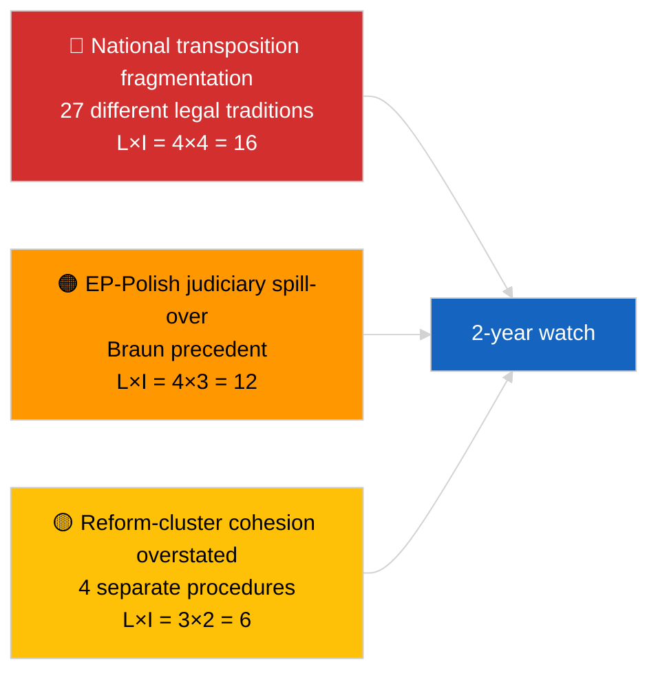

<!-- SPDX-FileCopyrightText: 2026 Hack23 AB -->
<!-- SPDX-License-Identifier: Apache-2.0 -->

# סיכום מנהלים — בהול (מאבק בשחיתות ורפורמה מוסדית) | 2026-04-03

**סיווג:** OSINT | תיעוד פרלמנטרי ציבורי
**אמינות:** 🟡 בינונית (סינתזה רטרוספקטיבית של אישורים במושב המליאה מרץ 2026)
**נוצר:** 2026-04-03T00:00:00Z (סיכום רטרוספקטיבי)
**סוג מאמר:** בהול — מודיעין מאבק בשחיתות ורפורמה מוסדית
**מקור:** פורטל הנתונים הפתוחים של הפרלמנט האירופי

---

## 🎯 BLUF

**מושבי המליאה של מרץ 2026 הניבו חבילת רפורמה מוסדית מגובשת הכוללת ארבעה טקסטים — האשכול המשמעותי ביותר מאז משבר הקטרגייט בדצמבר 2022.** הטקסט העוגן הוא **הנחיית מאבק בשחיתות (TA-10-2026-0094, נוהל 2023/0135, אושר ב-26 מרץ 2026)** — שלוש שנים מהצעת הנציבות עד לאישור הפרלמנט האירופי, המשקף הן את הרגישות הפוליטית של התיק והן את מורכבות הרמוניזציה של תקני מאבק בשחיתות ב-27 מדינות חברות. טקסטים נלווים: **ביטול חסינות בראון (TA-10-2026-0088, נוהל 2025/2192, אושר 26 מרץ)**, **דוח שיפור חקיקה (TA-10-2026-0063, נוהל 2025/2015, אושר 10 מרץ)** ו**סקירת גישה ציבורית למסמכים (TA-10-2026-0065, נוהל 2025/2137, אושר 10 מרץ)**. יחד, אלה מחזקים את קשת שיקום האמינות המוסדית של PE10. **אמינות 🟡 בינונית** על המסגור "חבילה מגובשת" (הטקסטים נוצרו מנהלים עצמאיים; הגיבוש הוא פרשני, לא נהלי).

---

## 🧭 3 החלטות שסיכום זה תומך בהן

| # | החלטה | מי מחליט | מועד אחרון | ראיות |
|:-:|-------|----------|:----------:|-------|
| 1 | **עיתונאי:** פרסם מאמר רחב היקף על רפורמה מוסדית המתחקה אחר מסלול קטרגייט → 2026 | עורך | +48 שעות | אשכול 4 טקסטים + ציר זמן נהלי של 3 שנים |
| 2 | **מעקב:** עקוב אחר מועדי ההטמעה הלאומיים עבור TA-10-2026-0094 (חלון של שנתיים טיפוסי) | אנליסט | רבעוני | דוחות יישום של מדינות חברות |
| 3 | **צפייה קדימה:** סמן הליכי חסינות המשך כמקרי מבחן לתקדים בראון | מוביל ניתוח | 2026-04-30 | מעקב LIBE/JURI |

---

## 📰 קריאה של 60 שניות

- 🔴 **TA-10-2026-0094 (הנחיית מאבק בשחיתות)** — אושר ב-26 מרץ 2026 לאחר שלוש שנים בנוהל (הוצע 2023). הרמוניזציה בסיסית ברחבי האיחוד האירופי. (🟢 גבוה באישור; 🟡 בינוני על חשיבות המסגור)
- 🟠 **TA-10-2026-0088 (ביטול חסינות בראון)** — אושר באותה ישיבת מליאה; קובע תקדים עדכני לביטולי חסינות של חברי הפרלמנט האירופי העומדים בפני הליכים פליליים לאומיים. (🟢 גבוה)
- 🟢 **TA-10-2026-0063 (דוח שיפור חקיקה)** — אושר 10 מרץ; קובע בסיס ייחוס לדיון על איכות רגולציה לשארית PE10. (🟢 גבוה)
- 🟡 **TA-10-2026-0065 (סקירת גישה ציבורית למסמכים)** — אושר 10 מרץ; משלים את הנחיית מאבק בשחיתות על וקטור השקיפות. (🟢 גבוה)
- 🔵 **הקשר כלכלי:** הרמוניזציה של הנחיית מאבק בשחיתות מפחיתה שונות בעלויות ציות לחברות חוצות גבולות; אות חיובי לשוק הפנימי. (🟡 בינוני)
- 🟣 **הפניה צולבת:** הקטרגייט (דצמבר 2022) היה זעזוע שחיתות פוליטי מזרז שהחל את קשת הרפורמה שהגיעה לשיאה באשכול מרץ 2026. (🟡 בינוני)
- 🩷 **וקטור שיבוש:** התפשטות תקדים בראון לחברי הפרלמנט האירופי האחרים העומדים בפני חקירות לאומיות (אושר רטרוספקטיבית על ידי ביטול חסינות יאקי TA-10-2026-0105 באפריל). (🟡 בינוני באותו זמן)
- ⚪ **המשך:** הטמעה לאומית של TA-10-2026-0094 דורשת בדרך כלל 24 חודשים; דוחות ציות ראשונים יגיעו לפדיון ~ר1 2028.

---

## 🗂️ מסמכים ונהלים עיקריים

| דירוג | אסמכתא PE | כותרת (קצרה) | נוהל | חשיבות | אמינות |
|:------:|-----------|--------------|------|:-------:|:------:|
| 1 | TA-10-2026-0094 | הנחיית מאבק בשחיתות | 2023/0135 | 9.0 | 🟢 גבוהה |
| 2 | TA-10-2026-0088 | ביטול חסינות בראון | 2025/2192 | 7.0 | 🟢 גבוהה |
| 3 | TA-10-2026-0063 | דוח שיפור חקיקה | 2025/2015 | 7.0 | 🟢 גבוהה |
| 4 | TA-10-2026-0065 | סקירת גישה ציבורית למסמכים | 2025/2137 | 7.0 | 🟢 גבוהה |

---

## ⚠️ תמונת מצב סיכונים ואיומים

| סיכון | ל | ת | ניקוד | מפעיל | מקור | דרגת אדמירלות |
|-------|:-:|:-:|:-----:|--------|------|:--------------:|
| פיצול הטמעה לאומית | 4 | 4 | 16 | אי-ציות של מדינה חברה | TA-10-2026-0094 | A1 |
| גלישה שיפוטית PE-פולנית | 4 | 3 | 12 | מקרי חסינות נוספים | TA-10-2026-0088 | A1 |
| הגזמה במסגור אשכול הרפורמה | 3 | 2 | 6 | הגזמה עיתונאית | סינתזת מפגש זה | B3 |
| הפעלה של שיפור חקיקה | 3 | 3 | 9 | חיכוך בין-מוסדי | TA-10-2026-0063 | A2 |

---

## 🔮 המפעיל העתידי העיקרי

**דוחות הטמעה לאומיים רבעוניים עבור TA-10-2026-0094 במהלך 2026–2028.** הצלחת ההנחיה תלויה בסטנדרטים אחידים של אכיפה בכל 27 המדינות החברות — דוח ההטמעה הסוטה הראשון (ככל הנראה מאחת מהסמכויות שיפוטיות עם שלטון חוק נמוך יותר) יהיה המדד הקדימה-הסתכלות העיקרי לשאלה האם אשכול הרפורמה של מרץ 2026 מספק בפועל שיקום אמינות מוסדית.

---

## 🛡️ הערכת איכות מקורות

- **מקורות ראשוניים:** עדכון הטקסטים המאושרים של הפרלמנט האירופי (גיבוי שבוע אחד פעיל בהתחשב במצב API הנחות); רישום נהלים עבור הנהלים המצוטטים 2023/0135, 2025/2015, 2025/2137, 2025/2192.
- **אמינות על אישורים:** 🟢 גבוהה.
- **אמינות על מסגור "אשכול":** 🟡 בינונית — העצמאות הנהלית של ארבעת הטקסטים אמיתית; גיבוש הוא הסקה אנליטית, לא עובדה מוסדית.

---

## 📎 קישורים

| קישור | נתיב |
|-------|------|
| מאמר | `./article.md` |
| ריצות אחיות | `analysis/daily/2026-04-03/breaking/` (קואליציה), `breaking-2/` (אמינות API של הפרלמנט האירופי) |
| מניפסט | `./manifest.json` |
| מקור — אישורים | `analysis/daily/2026-03-10/` (שיפור חקיקה, גישה ציבורית), `analysis/daily/2026-03-26/` (מאבק בשחיתות, בראון) |

---

## 🔄 הפניה צולבת

**אירוע מוקדם מזרז:** הקטרגייט (דצמבר 2022) — זעזוע השחיתות הפוליטי שהחל את קשת הרפורמה המוסדית של PE10.

**המשך עוקב:** ביטול חסינות יאקי (TA-10-2026-0105, אפריל 2026) מאשש את ההשערה בדבר התפשטות תקדים בראון.

---

**בקרת מסמכים**
- **תבנית:** `/analysis/templates/executive-brief.md`
- **נתיב ארטיפקט:** `analysis/daily/2026-04-03/breaking-3/executive-brief.md`
- **סיווג:** ציבורי
- **יצירה רטרוספקטיבית:** מושב מילוי.
