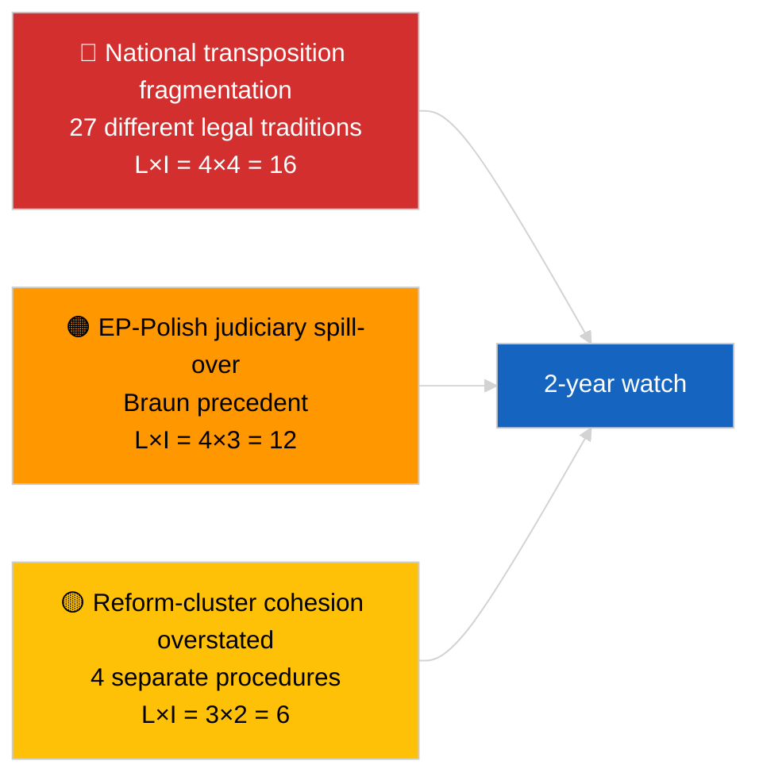

<!-- SPDX-FileCopyrightText: 2026 Hack23 AB -->
<!-- SPDX-License-Identifier: Apache-2.0 -->

# エグゼクティブ・ブリーフ — 速報（汚職対策・制度改革）| 2026-04-03

**分類:** OSINT | 公開議会記録
**信頼度:** 🟡 中程度（2026年3月本会議採択の遡及的分析）
**作成日:** 2026-04-03T00:00:00Z（遡及ブリーフ）
**記事タイプ:** 速報 — 汚職対策・制度改革インテリジェンス
**情報源:** 欧州議会オープンデータポータル

---

## 🎯 BLUF

**2026年3月の本会議は、2022年12月のカタルゲート危機以来最も重要な一連の制度改革テキストを生み出した。** 中核となるのは**汚職対策指令（TA-10-2026-0094、手続き2023/0135、2026年3月26日採択）**で、欧州委員会の提案から欧州議会採択まで3年を要したことは、27加盟国における汚職対策基準の調和の政治的敏感さと複雑さを示している。関連テキスト：**ブラウン議員の不逮捕特権剥奪（TA-10-2026-0088、手続き2025/2192、3月26日採択）**、**規制改善報告書（TA-10-2026-0063、手続き2025/2015、3月10日採択）**、**文書への公的アクセス見直し（TA-10-2026-0065、手続き2025/2137、3月10日採択）**。これらは総合して、EP10の制度的信頼回復への道筋を強化する。「一貫したパッケージ」という枠組みに対する**信頼度🟡中程度**（テキストは独立した手続きから生まれており、一貫性は解釈的で手続き的ではない）。

---

## 🧭 このブリーフが支援する3つの意思決定

| # | 意思決定 | 決定者 | 期限 | 根拠 |
|:-:|---------|--------|:----:|------|
| 1 | **編集:** カタルゲート → 2026改革の弧を追う詳細な制度改革記事の**掲載** | 編集長 | +48時間 | 4テキストのクラスター + 3年手続きタイムライン |
| 2 | **監視:** TA-10-2026-0094の国内移行期限の追跡（通常2年の期間） | アナリスト | 四半期ごと | 加盟国実施報告書 |
| 3 | **先行注視:** ブラウン先例のテストケースとして後続の特権剥奪手続きをフラグ | 分析責任者 | 2026-04-30 | LIBE/JURI監視 |

---

## 📰 60秒リード

- 🔴 **TA-10-2026-0094（汚職対策指令）** — 2026年3月26日に採択（2023年提案から3年）。EU全体の基本的調和。（採択で🟢高；枠組みの重要性で🟡中程度）
- 🟠 **TA-10-2026-0088（ブラウン特権剥奪）** — 同本会議で採択；国内刑事手続きに直面する欧州議員の特権剥奪に関する新たな先例を確立。（🟢高）
- 🟢 **TA-10-2026-0063（規制改善報告書）** — 3月10日採択；EP10の残りの規制品質議論の基準線を設定。（🟢高）
- 🟡 **TA-10-2026-0065（文書への公的アクセス見直し）** — 3月10日採択；透明性の観点から汚職対策指令を補完。（🟢高）
- 🔵 **経済的文脈:** 汚職対策指令の調和により、国境を越えた企業のコンプライアンスコストの分散が低下；域内市場への肯定的シグナル。（🟡中程度）
- 🟣 **相互参照:** カタルゲート（2022年12月）は、2026年3月のクラスターで結実した改革の弧を開始させた政治的汚職ショックだった。（🟡中程度）
- 🩷 **混乱ベクター:** 国内捜査に直面する他の欧州議員へのブラウン先例の波及（4月のヤキ特権剥奪TA-10-2026-0105によって遡及的に確認）。（当時🟡中程度）
- ⚪ **繰越し:** TA-10-2026-0094の国内移行には通常24ヶ月；最初のコンプライアンス報告書は~2028年Q1。

---

## 🗂️ 主要文書・手続きテーブル

| 順位 | EP参照 | タイトル（短縮） | 手続き | 重要性 | 信頼度 |
|:---:|--------|-----------------|--------|:------:|:------:|
| 1 | TA-10-2026-0094 | 汚職対策指令 | 2023/0135 | 9.0 | 🟢 高 |
| 2 | TA-10-2026-0088 | ブラウン特権剥奪 | 2025/2192 | 7.0 | 🟢 高 |
| 3 | TA-10-2026-0063 | 規制改善報告書 | 2025/2015 | 7.0 | 🟢 高 |
| 4 | TA-10-2026-0065 | 文書への公的アクセス見直し | 2025/2137 | 7.0 | 🟢 高 |

---

## ⚠️ リスク・脅威スナップショット

| リスク | L | I | スコア | トリガー | 出典 | 確度 |
|--------|:-:|:-:|:------:|----------|------|:----:|
| 国内移行の断片化 | 4 | 4 | 16 | 加盟国の不遵守 | TA-10-2026-0094 | A1 |
| EP-ポーランド司法への波及 | 4 | 3 | 12 | さらなる特権剥奪案件 | TA-10-2026-0088 | A1 |
| 改革クラスターの枠組みの誇張 | 3 | 2 | 6 | 編集上の誇張 | 本セッションの総合 | B3 |
| 規制改善の運用化 | 3 | 3 | 9 | 制度間摩擦 | TA-10-2026-0063 | A2 |

---

## 🔮 主要な将来トリガー

**2026〜2028年のTA-10-2026-0094に関する四半期国内移行報告書。** 指令の成功は、全27加盟国における一貫した執行基準にかかっている。最初の乖離移行報告書（法の支配が低い法域からの可能性が高い）は、2026年3月改革クラスターが実際に制度的信頼回復を達成しているかどうかを示す主要な先行指標となる。

---

## 🛡️ 情報源品質評価

- **一次情報源:** 欧州議会採択テキストフィード（API状態DEGRADED（低下）のため1週間フォールバック有効）；引用された手続き2023/0135、2025/2015、2025/2137、2025/2192の手続きレジストリ。
- **採択に関する信頼度:** 🟢 高。
- **"クラスター"枠組みに関する信頼度:** 🟡 中程度 — 4つのテキストの手続き的独立性は実在；一貫性は分析的推論であり、制度的事実ではない。

---

## 📎 リンク

| リンク | パス |
|--------|------|
| 記事 | `./article.md` |
| 兄弟実行 | `analysis/daily/2026-04-03/breaking/`（連立）、`breaking-2/`（EP APIの信頼性） |
| マニフェスト | `./manifest.json` |
| 情報源 — 採択 | `analysis/daily/2026-03-10/`（規制改善、公的アクセス）、`analysis/daily/2026-03-26/`（汚職対策、ブラウン） |

---

## 🔄 相互参照

**触媒的先行事象:** カタルゲート（2022年12月）— EP10の制度改革の弧を開始させた政治的汚職ショック。

**その後の後続事象:** ヤキ特権剥奪（TA-10-2026-0105、2026年4月）によりブラウン先例波及の仮説が確認された。

---

**文書管理**
- **テンプレート:** `/analysis/templates/executive-brief.md`
- **成果物パス:** `analysis/daily/2026-04-03/breaking-3/executive-brief.md`
- **分類:** 公開
- **遡及生成:** バックフィルセッション。
