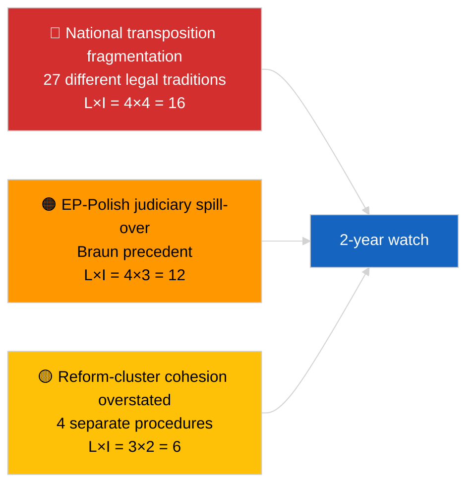

<!-- SPDX-FileCopyrightText: 2026 Hack23 AB -->
<!-- SPDX-License-Identifier: Apache-2.0 -->

# 집행 요약 — 속보 (반부패 및 제도 개혁) | 2026-04-03

**분류:** OSINT | 공개 의회 기록
**신뢰도:** 🟡 보통 (2026년 3월 본회의 채택 소급 분석)
**생성일:** 2026-04-03T00:00:00Z (소급 요약)
**기사 유형:** 속보 — 반부패 및 제도 개혁 인텔리전스
**출처:** 유럽의회 공개 데이터 포털

---

## 🎯 BLUF

**2026년 3월 본회의는 2022년 12월 카타르게이트 위기 이후 가장 중요한 4개 텍스트로 구성된 일관된 제도 개혁 패키지를 생산했다.** 핵심 텍스트는 **반부패 지침(TA-10-2026-0094, 절차 2023/0135, 2026년 3월 26일 채택)**으로, 유럽위원회 제안에서 유럽의회 채택까지 3년이 걸린 것은 해당 파일의 정치적 민감성과 27개 회원국에 걸친 반부패 기준 조화의 복잡성을 반영한다. 관련 텍스트: **브라운 의원 면책특권 해제(TA-10-2026-0088, 절차 2025/2192, 3월 26일 채택)**, **규제 개선 보고서(TA-10-2026-0063, 절차 2025/2015, 3월 10일 채택)**, **문서에 대한 공개 접근 검토(TA-10-2026-0065, 절차 2025/2137, 3월 10일 채택)**. 이 텍스트들은 EP10의 제도적 신뢰 회복 궤적을 강화한다. "일관된 패키지" 프레이밍에 대한 **신뢰도 🟡 보통** (텍스트들은 독립적인 절차에서 생겨났으며, 일관성은 해석적이고 절차적이지 않다).

---

## 🧭 이 요약이 지원하는 3가지 결정

| # | 결정 | 결정자 | 기한 | 근거 |
|:-:|------|--------|:----:|------|
| 1 | **편집:** 카타르게이트 → 2026 개혁 궤적을 추적하는 심층 제도 개혁 기사 **출판** | 편집장 | +48시간 | 4개 텍스트 클러스터 + 3년 절차 타임라인 |
| 2 | **모니터링:** TA-10-2026-0094의 국내 이행 기한 추적 (일반적으로 2년 기간) | 분석가 | 분기별 | 회원국 이행 보고서 |
| 3 | **선행 감시:** 브라운 선례의 테스트 케이스로 후속 면책특권 절차 표시 | 분석 책임자 | 2026-04-30 | LIBE/JURI 감시 |

---

## 📰 60초 읽기

- 🔴 **TA-10-2026-0094 (반부패 지침)** — 2026년 3월 26일 채택 (2023년 제안 후 3년). EU 전체 기본 조화. (채택에서 🟢 높음; 프레이밍 중요성에서 🟡 보통)
- 🟠 **TA-10-2026-0088 (브라운 면책특권 해제)** — 같은 본회의에서 채택; 국내 형사 절차를 직면하는 유럽의회 의원들의 면책특권 해제에 대한 최근 선례 수립. (🟢 높음)
- 🟢 **TA-10-2026-0063 (규제 개선 보고서)** — 3월 10일 채택; EP10 나머지 기간의 규제 품질 논의 기준선 설정. (🟢 높음)
- 🟡 **TA-10-2026-0065 (문서에 대한 공개 접근 검토)** — 3월 10일 채택; 투명성 벡터에서 반부패 지침 보완. (🟢 높음)
- 🔵 **경제적 맥락:** 반부패 지침 조화로 국경을 초월한 기업들의 규정 준수 비용 분산 감소; 역내시장에 긍정적 신호. (🟡 보통)
- 🟣 **상호 참조:** 카타르게이트(2022년 12월)는 2026년 3월 클러스터에서 결실을 맺은 개혁 궤적을 시작한 정치적 부패 충격이었다. (🟡 보통)
- 🩷 **혼란 벡터:** 국내 조사에 직면한 다른 유럽의회 의원들로의 브라운 선례 파급 (4월 야키 면책특권 해제 TA-10-2026-0105로 소급 확인). (당시 🟡 보통)
- ⚪ **이월:** TA-10-2026-0094의 국내 이행에는 일반적으로 24개월 소요; 첫 준수 보고서 ~2028년 Q1 예정.

---

## 🗂️ 주요 문서 / 절차 테이블

| 순위 | EP 참조 | 제목 (단축) | 절차 | 중요성 | 신뢰도 |
|:---:|---------|-------------|------|:------:|:------:|
| 1 | TA-10-2026-0094 | 반부패 지침 | 2023/0135 | 9.0 | 🟢 높음 |
| 2 | TA-10-2026-0088 | 브라운 면책특권 해제 | 2025/2192 | 7.0 | 🟢 높음 |
| 3 | TA-10-2026-0063 | 규제 개선 보고서 | 2025/2015 | 7.0 | 🟢 높음 |
| 4 | TA-10-2026-0065 | 문서에 대한 공개 접근 검토 | 2025/2137 | 7.0 | 🟢 높음 |

---

## ⚠️ 리스크 및 위협 스냅샷

| 리스크 | L | I | 점수 | 트리거 | 출처 | 해군 등급 |
|--------|:-:|:-:|:---:|--------|------|:---------:|
| 국내 이행 단편화 | 4 | 4 | 16 | 회원국 불이행 | TA-10-2026-0094 | A1 |
| EP-폴란드 사법 파급 | 4 | 3 | 12 | 추가 면책특권 사례 | TA-10-2026-0088 | A1 |
| 개혁 클러스터 프레이밍 과장 | 3 | 2 | 6 | 편집 과장 | 이 세션의 종합 | B3 |
| 규제 개선 운영화 | 3 | 3 | 9 | 기관 간 마찰 | TA-10-2026-0063 | A2 |

---

## 🔮 주요 선행 트리거

**2026~2028년 TA-10-2026-0094에 대한 분기별 국내 이행 보고서.** 지침의 성공은 27개 회원국 전체에 걸친 일관된 집행 기준에 달려 있다. 첫 번째 이탈 이행 보고서(법치주의가 낮은 법역 중 하나에서 나올 가능성이 높음)는 2026년 3월 개혁 클러스터가 실제로 제도적 신뢰 회복을 달성하고 있는지를 보여주는 주요 선행 지표가 될 것이다.

---

## 🛡️ 정보원 품질 평가

- **1차 출처:** 유럽의회 채택 텍스트 피드 (API 상태 저하로 1주일 대체 활성화); 인용된 2023/0135, 2025/2015, 2025/2137, 2025/2192 절차 레지스트리.
- **채택에 대한 신뢰도:** 🟢 높음.
- **"클러스터" 프레이밍에 대한 신뢰도:** 🟡 보통 — 4개 텍스트의 절차적 독립성은 실재; 일관성은 분석적 추론으로 제도적 사실이 아님.

---

## 📎 링크

| 링크 | 경로 |
|------|------|
| 기사 | `./article.md` |
| 자매 실행 | `analysis/daily/2026-04-03/breaking/` (연정), `breaking-2/` (EP API 신뢰성) |
| 매니페스트 | `./manifest.json` |
| 출처 — 채택 | `analysis/daily/2026-03-10/` (규제 개선, 공개 접근), `analysis/daily/2026-03-26/` (반부패, 브라운) |

---

## 🔄 상호 참조

**촉매적 선행 사건:** 카타르게이트 (2022년 12월) — EP10의 제도 개혁 궤적을 시작한 정치적 부패 충격.

**후속 진행:** 야키 면책특권 해제 (TA-10-2026-0105, 2026년 4월)로 브라운 선례 파급 가설이 확인됨.

---

**문서 관리**
- **템플릿:** `/analysis/templates/executive-brief.md`
- **산출물 경로:** `analysis/daily/2026-04-03/breaking-3/executive-brief.md`
- **분류:** 공개
- **소급 생성:** 백필 세션.
