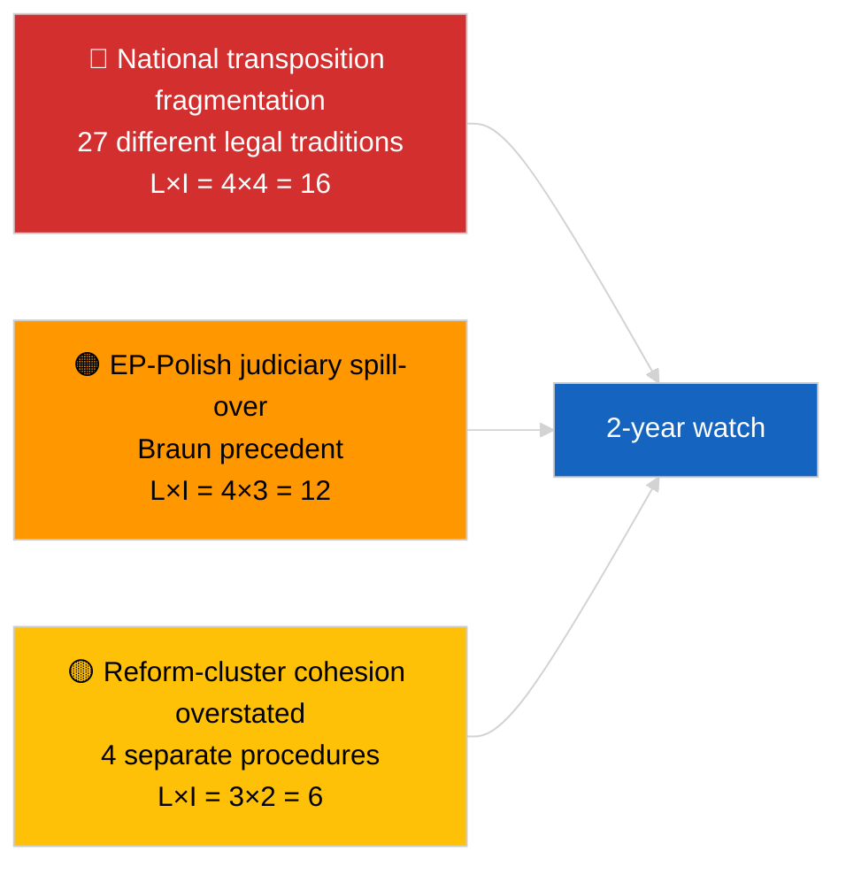

<!-- SPDX-FileCopyrightText: 2026 Hack23 AB -->
<!-- SPDX-License-Identifier: Apache-2.0 -->

# Beknopt rapport — Breaking (Antikorruptie en institutionele hervorming) | 2026-04-03

**Classificatie:** OSINT | Openbaar parlementair archief
**Betrouwbaarheid:** 🟡 Gemiddeld (retrospectieve synthese van aannames plenaire vergadering maart 2026)
**Gegenereerd:** 2026-04-03T00:00:00Z (retrospectief rapport)
**Artikeltype:** Breaking — Antikorruptie- en institutionele hervorminginlichtingen
**Bron:** Open dataportal van het Europees Parlement

---

## 🎯 BLUF

**De plenaire vergaderingen van maart 2026 produceerden een coherent pakket van vier teksten over institutionele hervorming — het meest significante dergelijke cluster sinds de Qatargate-crisis in december 2022.** De ankertekst is de **antikorruptierichtlijn (TA-10-2026-0094, procedure 2023/0135, aangenomen op 26 maart 2026)** — drie jaar van het Commissievoorstel tot EP-aanname, wat zowel de politieke gevoeligheid van het dossier als de complexiteit van de harmonisatie van antikorruptienormen in 27 lidstaten weerspiegelt. Begeleidende teksten: **opheffing van de immuniteit van Braun (TA-10-2026-0088, procedure 2025/2192, aangenomen 26 maart)**, **rapport over betere wetgeving (TA-10-2026-0063, procedure 2025/2015, aangenomen 10 maart)** en **herziening van de openbare toegang tot documenten (TA-10-2026-0065, procedure 2025/2137, aangenomen 10 maart)**. Samen versterken deze de boog van EP10 naar herstel van institutionele geloofwaardigheid. **🟡 GEMIDDELDE betrouwbaarheid** op de omschrijving "coherent pakket" (de teksten kwamen voort uit onafhankelijke procedures; samenhang is interpretatief, niet procedureel).

---

## 🧭 3 Beslissingen die dit rapport ondersteunt

| # | Beslissing | Wie beslist | Deadline | Bewijs |
|:-:|------------|-------------|:--------:|--------|
| 1 | **Redactioneel:** PUBLICEER uitgebreid institutioneel hervormingsartikel dat het Qatargate → 2026-hervormboog traceert | Redacteur | +48u | Cluster van 4 teksten + 3-jarige proceduretijdlijn |
| 2 | **Monitoring:** volg nationale omzettingstermijnen voor TA-10-2026-0094 (2-jaarsvenster typisch) | Analist | kwartaallijks | Uitvoeringsrapporten van lidstaten |
| 3 | **Prospectieve bewaking:** markeer opvolgde immuniteitsprocedures als testcases voor Braun-precedent | Analyselead | 2026-04-30 | LIBE/JURI-bewaking |

---

## 📰 60-secondenlezing

- 🔴 **TA-10-2026-0094 (antikorruptierichtlijn)** — aangenomen op 26 maart 2026 na drie jaar in de procedure (voorgesteld in 2023). Fundamentele EU-brede harmonisatie. (🟢 Hoog bij aanname; 🟡 Gemiddeld bij omschrijvingsbetekenis)
- 🟠 **TA-10-2026-0088 (opheffing immuniteit Braun)** — aangenomen tijdens dezelfde plenaire vergadering; creëert een recent precedent voor immuniteitsheffingen van EP-leden die nationale strafrechtelijke procedures ondergaan. (🟢 Hoog)
- 🟢 **TA-10-2026-0063 (rapport over betere wetgeving)** — aangenomen op 10 maart; stelt de basislijn in voor het debat over regelgevingskwaliteit voor de rest van EP10. (🟢 Hoog)
- 🟡 **TA-10-2026-0065 (herziening openbare toegang tot documenten)** — aangenomen op 10 maart; complementeert de antikorruptierichtlijn op de transparantievector. (🟢 Hoog)
- 🔵 **Economische context:** harmonisatie van de antikorruptierichtlijn vermindert de variantie van nalevingskosten voor grensoverschrijdende bedrijven; positief signaal voor de interne markt. (🟡 Gemiddeld)
- 🟣 **Kruisreferentie:** Qatargate (december 2022) was de katalyserende politieke corruptieschok die de hervormingsboog inleidde die culmineerde in dit cluster van maart 2026. (🟡 Gemiddeld)
- 🩷 **Verstoringsvector:** verspreiding van het Braun-precedent naar andere EP-leden die nationale onderzoeken ondergaan (retrospectief bevestigd door Jaki-immuniteitsheffing TA-10-2026-0105 in april). (🟡 Gemiddeld op dat moment)
- ⚪ **Voortgezet:** nationale omzetting van TA-10-2026-0094 vereist doorgaans 24 maanden; eerste nalevingsrapporten vervallen ~Q1 2028.

---

## 🗂️ Topdocumenten / Proceduretabel

| Rang | EP-referentie | Titel (kort) | Procedure | Belang | Betrouwbaarheid |
|:----:|---------------|--------------|-----------|:------:|:---------------:|
| 1 | TA-10-2026-0094 | Antikorruptierichtlijn | 2023/0135 | 9,0 | 🟢 HOOG |
| 2 | TA-10-2026-0088 | Opheffing immuniteit Braun | 2025/2192 | 7,0 | 🟢 HOOG |
| 3 | TA-10-2026-0063 | Rapport over betere wetgeving | 2025/2015 | 7,0 | 🟢 HOOG |
| 4 | TA-10-2026-0065 | Herziening openbare toegang tot documenten | 2025/2137 | 7,0 | 🟢 HOOG |

---

## ⚠️ Risico- en dreigingsoverzicht

| Risico | L | I | Score | Uitloper | Bron | Admiraalsgraad |
|--------|:-:|:-:|:-----:|----------|------|:--------------:|
| Nationale omzettingsfragmentatie | 4 | 4 | 16 | Niet-naleving door lidstaat | TA-10-2026-0094 | A1 |
| EP-Poolse rechtswetenschappelijke spillover | 4 | 3 | 12 | Verdere immuniteitszaken | TA-10-2026-0088 | A1 |
| Overdrijving van de hervormingsclusteromschrijving | 3 | 2 | 6 | Redactionele overdrijving | Synthese van deze sessie | B3 |
| Operationalisering betere wetgeving | 3 | 3 | 9 | Interinstitutionele wrijving | TA-10-2026-0063 | A2 |

---

## 🔮 Belangrijkste Prospectieve Uitloper

**Kwartaallijkse nationale omzettingsrapporten voor TA-10-2026-0094 over 2026–2028.** Het succes van de richtlijn hangt af van consistente handhavingsnormen in alle 27 lidstaten — het eerste afwijkende omzettingsrapport (waarschijnlijk uit een van de rechtsstelsels met lagere rechtsstaat) zal de voornaamste indicator zijn of het hervormingscluster van maart 2026 in de praktijk institutionele geloofwaardigheidsherstel oplevert.

---

## 🛡️ Beoordeling bronkwaliteit

- **Primaire bronnen:** EP-feed voor aangenomen teksten (één-weekse terugvalactief gezien GEDEGRADEERDE API-toestand); procedureregister voor geciteerde 2023/0135, 2025/2015, 2025/2137, 2025/2192.
- **Betrouwbaarheid bij aannames:** 🟢 HOOG.
- **Betrouwbaarheid bij "cluster"-omschrijving:** 🟡 GEMIDDELD — de procedurele onafhankelijkheid van de vier teksten is reëel; samenhang is analytische inferentie, geen institutioneel feit.

---

## 📎 Links

| Link | Pad |
|------|-----|
| Artikel | `./article.md` |
| Zusterruns | `analysis/daily/2026-04-03/breaking/` (coalitie), `breaking-2/` (EP API-betrouwbaarheid) |
| Manifest | `./manifest.json` |
| Bron — aannames | `analysis/daily/2026-03-10/` (Betere wetgeving, openbare toegang), `analysis/daily/2026-03-26/` (antikorruptie, Braun) |

---

## 🔄 Kruisreferentie

**Katalyserend voorafgaand evenement:** Qatargate (december 2022) — de politieke corruptieschok die de institutionele hervormingsboog van EP10 inleidde.

**Opvolgende ontwikkeling:** Jaki-immuniteitsheffing (TA-10-2026-0105, april 2026) bevestigt de hypothese van Braun-precedentverspreiding.

---

**Documentbeheer**
- **Sjabloon:** `/analysis/templates/executive-brief.md`
- **Artefactpad:** `analysis/daily/2026-04-03/breaking-3/executive-brief.md`
- **Classificatie:** Openbaar
- **Retrospectieve generatie:** Terugvulsessie.
