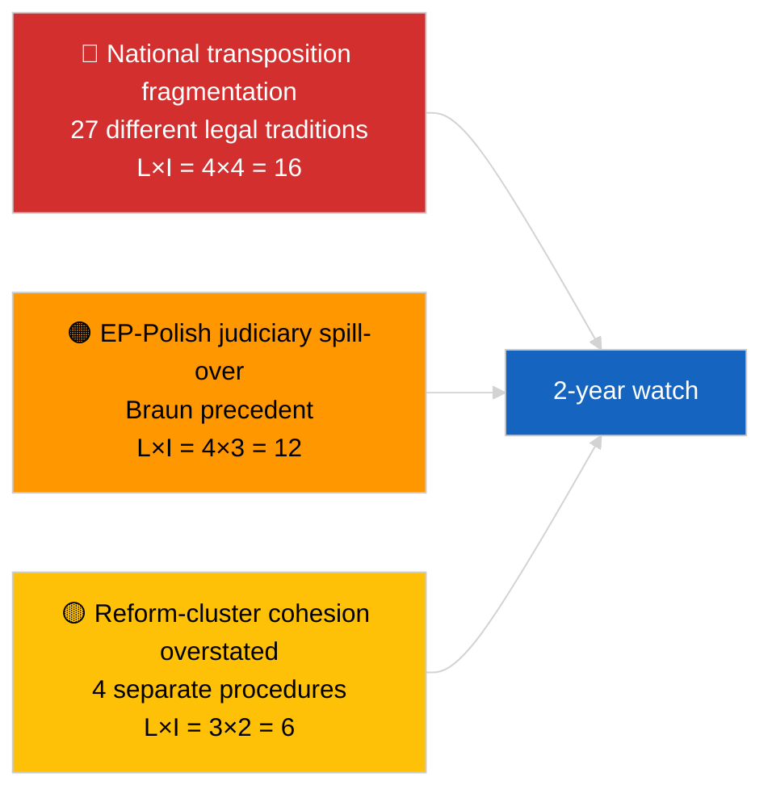

<!-- SPDX-FileCopyrightText: 2026 Hack23 AB -->
<!-- SPDX-License-Identifier: Apache-2.0 -->

# Kortfattet notat — Brudd (Antikorrupsjon og institusjonell reform) | 2026-04-03

**Klassifisering:** OSINT | Offentlig parlamentarisk dokumentasjon
**Konfidens:** 🟡 Middels (retrospektiv syntese av mars 2026 plenumsvedtak)
**Generert:** 2026-04-03T00:00:00Z (retrospektivt notat)
**Artikkeltype:** Brudd — Antikorrupsjons- og institusjonell reformetterretning
**Kilde:** Europaparlamentets åpne dataportal

---

## 🎯 BLUF

**Mars 2026 plenumsmøtene produserte en sammenhengende firetekstsinstituisjonell reformpakke — den mest betydningsfulle slike klyngen siden Qatargate-krisen i desember 2022.** Ankerteksten er **antikorrupsjonsdirektivet (TA-10-2026-0094, prosedyre 2023/0135, vedtatt 26. mars 2026)** — tre år fra Kommisjonens forslag til EP-vedtak, noe som gjenspeiler både den politiske følsomheten i saken og kompleksiteten med å harmonisere antikorrupsjonsstandarder på tvers av 27 medlemsland. Omkringliggende tekster: **Brauns immunitetsopphevelse (TA-10-2026-0088, prosedyre 2025/2192, vedtatt 26. mars)**, **rapporten om bedre lovgivning (TA-10-2026-0063, prosedyre 2025/2015, vedtatt 10. mars)** og **gjennomgang av offentlig tilgang til dokumenter (TA-10-2026-0065, prosedyre 2025/2137, vedtatt 10. mars)**. Samlet styrker disse EP10s bue mot gjenoppretting av institusjonell troverdighet. **🟡 MIDDELS konfidens** på "sammenhengende pakke"-innrammingen (tekstene oppstod fra uavhengige prosedyrer; sammenheng er tolkningsmessig, ikke prosedyremessig).

---

## 🧭 3 Beslutninger Dette Notatet Støtter

| # | Beslutning | Hvem bestemmer | Frist | Bevis |
|:-:|------------|----------------|:-----:|-------|
| 1 | **Redaksjonelt:** PUBLISER langt institusjonelt reformstykke som sporer Qatargate → reformbue 2026 | Redaktør | +48t | 4-tekstsklynge + 3-årig prosedyretidslinje |
| 2 | **Overvåking:** spor nasjonale gjennomføringsfrister for TA-10-2026-0094 (2-årsvindu typisk) | Analytiker | kvartalsvis | Gjennomføringsrapporter for medlemsland |
| 3 | **Fremtidsovervåking:** merk oppfølgende immunitetssaker som testtilfeller for Braun-presedens | Analyseansvarlig | 2026-04-30 | LIBE/JURI-overvåking |

---

## 📰 60-sekunders lesning

- 🔴 **TA-10-2026-0094 (antikorrupsjonsdirektivet)** — vedtatt 26. mars 2026 etter tre år i prosedyren (foreslått 2023). Grunnleggende EU-dekkende harmonisering. (🟢 Høy ved vedtak; 🟡 Middels ved innrammingsbetydning)
- 🟠 **TA-10-2026-0088 (Brauns immunitetsopphevelse)** — vedtatt på samme plenumsmøte; setter ny presedens for opphevelser av MEP-er overfor nasjonale straffesaker. (🟢 Høy)
- 🟢 **TA-10-2026-0063 (rapporten om bedre lovgivning)** — vedtatt 10. mars; fastlegger basislinjen for debatt om regelkvalitet for resten av EP10. (🟢 Høy)
- 🟡 **TA-10-2026-0065 (gjennomgang av offentlig tilgang til dokumenter)** — vedtatt 10. mars; utfyller antikorrupsjonsdirektivet på transparensvektoren. (🟢 Høy)
- 🔵 **Økonomisk kontekst:** harmonisering av antikorrupsjonsdirektivet reduserer variansen i samsvarskostnader for grenseoverskridende virksomheter; positivt signal for det indre marked. (🟡 Middels)
- 🟣 **Kryssreferanse:** Qatargate (desember 2022) var det katalyserende politiske korrupsjonssjokket som begynte reformbuen som kulminerte i denne mars 2026-klyngen. (🟡 Middels)
- 🩷 **Forstyrrelsesvektor:** Braun-presedens spredning til andre MEP-er overfor nasjonale undersøkelser (bekreftet retrospektivt ved Jakis immunitetsopphevelse TA-10-2026-0105 i april). (🟡 Middels på den tiden)
- ⚪ **Fremføring:** nasjonal gjennomføring av TA-10-2026-0094 krever typisk 24 måneder; første samsvarrapporter forfaller ~Q1 2028.

---

## 🗂️ Topphandlinger / Prosedyretabell

| Rang | EP-referanse | Tittel (kort) | Prosedyre | Betydning | Konfidens |
|:----:|--------------|---------------|-----------|:---------:|:---------:|
| 1 | TA-10-2026-0094 | Antikorrupsjonsdirektiv | 2023/0135 | 9,0 | 🟢 HØY |
| 2 | TA-10-2026-0088 | Brauns immunitetsopphevelse | 2025/2192 | 7,0 | 🟢 HØY |
| 3 | TA-10-2026-0063 | Rapport om bedre lovgivning | 2025/2015 | 7,0 | 🟢 HØY |
| 4 | TA-10-2026-0065 | Gjennomgang av offentlig tilgang til dokumenter | 2025/2137 | 7,0 | 🟢 HØY |

---

## ⚠️ Risiko- og trusselbilde

| Risiko | L | I | Score | Utløser | Kilde | Admiralitet |
|--------|:-:|:-:|:-----:|---------|-------|:-----------:|
| Nasjonal gjennomføringsfragmentering | 4 | 4 | 16 | Manglende overholdelse i medlemsland | TA-10-2026-0094 | A1 |
| EP-polsk rettsligsmitte | 4 | 3 | 12 | Ytterligere immunitetstilfeller | TA-10-2026-0088 | A1 |
| Overdrivelse av reformklyngeinnramming | 3 | 2 | 6 | Redaksjonell overdrivelse | Denne sesjonens syntese | B3 |
| Operasjonalisering av bedre lovgivning | 3 | 3 | 9 | Interinstitusjonell friksjon | TA-10-2026-0063 | A2 |

---

## 🔮 Viktigste Fremoverrettede Utløser

**Kvartalsvise nasjonale gjennomføringsrapporter for TA-10-2026-0094 i 2026–2028.** Direktivets suksess avhenger av konsekvente håndhevelsesstandarder på tvers av alle 27 medlemsland — den første avvikende gjennomføringsrapporten (sannsynligvis fra en av jurisdiksjonene med lavere rettsstatsprinsipper) vil være den viktigste fremadrettede indikatoren for om mars 2026-reformklyngen faktisk leverer gjenoppretting av institusjonell troverdighet i praksis.

---

## 🛡️ Kildekvalitetsvurdering

- **Primære kilder:** EPs vedtatte tekst-feed (én ukes reserv aktiv gitt FORRINGET API-tilstand); prosedyreregisteret for siterte 2023/0135, 2025/2015, 2025/2137, 2025/2192.
- **Konfidens ved vedtak:** 🟢 HØY.
- **Konfidens ved "klynge"-innramming:** 🟡 MIDDELS — de fire tekstenes prosedyremessige uavhengighet er reell; sammenheng er analytisk slutning, ikke institusjonelt faktum.

---

## 📎 Lenker

| Lenke | Sti |
|-------|-----|
| Artikkel | `./article.md` |
| Søsterkjøringer | `analysis/daily/2026-04-03/breaking/` (koalisjon), `breaking-2/` (EP API-pålitelighet) |
| Manifest | `./manifest.json` |
| Kilde — vedtak | `analysis/daily/2026-03-10/` (Bedre lovgivning, offentlig tilgang), `analysis/daily/2026-03-26/` (antikorrupsjon, Braun) |

---

## 🔄 Kryssreferanse

**Katalyserende forutgående hendelse:** Qatargate (desember 2022) — det politiske korrupsjonssjokket som begynte EP10s institusjonelle reformbue.

**Etterfølgende oppfølging:** Jakis immunitetsopphevelse (TA-10-2026-0105, april 2026) bekrefter hypotesen om Braun-presedens spredning.

---

**Dokumentkontroll**
- **Mal:** `/analysis/templates/executive-brief.md`
- **Artefaktsti:** `analysis/daily/2026-04-03/breaking-3/executive-brief.md`
- **Klassifisering:** Offentlig
- **Retrospektiv generering:** Tilbakefyllingssesjon.
