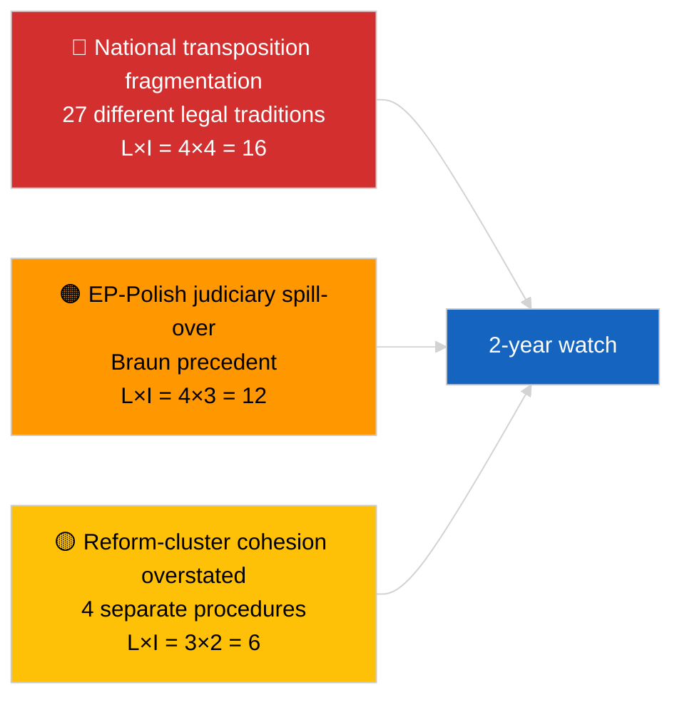

<!-- SPDX-FileCopyrightText: 2026 Hack23 AB -->
<!-- SPDX-License-Identifier: Apache-2.0 -->

# Kortfattad rapport — Brott (Antikorruption och institutionell reform) | 2026-04-03

**Klassificering:** OSINT | Offentligt parlamentariskt register
**Tillförlitlighet:** 🟡 Medel (retroaktiv syntes av mars 2026 plenarsammanträdets antaganden)
**Genererad:** 2026-04-03T00:00:00Z (retroaktiv rapport)
**Artikeltyp:** Brott — Antikorruptions- och institutionell reformunderrättelse
**Källa:** Europaparlamentets öppna dataportal

---

## 🎯 BLUF

**Mars 2026 plenarsammanträdena producerade ett sammanhängande fyratexts institutionellt reformpaket — det mest betydelsefulla sådana klustret sedan Qatargate-krisen i december 2022.** Ankartexten är **direktivet om antikorruption (TA-10-2026-0094, förfarande 2023/0135, antaget 26 mars 2026)** — tre år från kommissionens förslag till EP:s antagande, vilket återspeglar både den politiska känsligheten i ärendet och komplexiteten i att harmonisera antikorruptionsstandarder i 27 medlemsstater. Omgivande texter: **Brauns immunitetsupphävande (TA-10-2026-0088, förfarande 2025/2192, antaget 26 mars)**, **rapporten om bättre lagstiftning (TA-10-2026-0063, förfarande 2025/2015, antagen 10 mars)** och **översyn av allmänhetens tillgång till handlingar (TA-10-2026-0065, förfarande 2025/2137, antagen 10 mars)**. Sammantaget förstärker dessa EP10:s bana mot återupprättelse av institutionell trovärdighet. **🟡 MEDEL-tillförlitlighet** på framställningen "sammanhängande paket" (texterna uppstod ur oberoende förfaranden; sammanhang är tolkande, inte procedurellt).

---

## 🧭 3 Beslut Detta Kort Stöder

| # | Beslut | Vem beslutar | Deadline | Bevis |
|:-:|--------|--------------|:--------:|-------|
| 1 | **Redaktionellt:** PUBLICERA långt institutionellt reformstycke som spårar Qatargate → reformbåge 2026 | Redaktör | +48h | 4-textskluster + 3-årig förfarandetidslinje |
| 2 | **Övervakning:** spåra nationella genomförandefrister för TA-10-2026-0094 (2-årsfönster typiskt) | Analytiker | kvartalsvis | Genomföranderapporter för medlemsstater |
| 3 | **Framåtbevakning:** markera uppföljande immunitetsförfaranden som testfall för Braun-prejudikat | Analysansvarig | 2026-04-30 | LIBE/JURI-bevakning |

---

## 📰 60-sekundersläsning

- 🔴 **TA-10-2026-0094 (direktivet om antikorruption)** — antaget 26 mars 2026 efter tre år i förfarandet (föreslagit 2023). Grundläggande EU-övergripande harmonisering. (🟢 Hög vid antagande; 🟡 Medel vid inramning av betydelse)
- 🟠 **TA-10-2026-0088 (Brauns immunitetsupphävande)** — antaget under samma plenumssammanträde; sätter nytt prejudikat för upphävanden av parlamentsledamöter som står inför nationella straffrättsliga förfaranden. (🟢 Hög)
- 🟢 **TA-10-2026-0063 (rapporten om bättre lagstiftning)** — antagen 10 mars; fastlägger baslinjen för debatt om regelkvalitet för resten av EP10. (🟢 Hög)
- 🟡 **TA-10-2026-0065 (översyn av allmänhetens tillgång till handlingar)** — antagen 10 mars; kompletterar antikorruptionsdirektivet på transparensvektorn. (🟢 Hög)
- 🔵 **Ekonomisk kontext:** harmonisering av antikorruptionsdirektivet minskar variansen i efterlevnadskostnader för gränsöverskridande företag; positivt signal för inre marknaden. (🟡 Medel)
- 🟣 **Korsreferens:** Qatargate (december 2022) var det katalyserande politiska korruptionschocken som inledde reformbågen som kulminerade i detta mars 2026-kluster. (🟡 Medel)
- 🩷 **Störningsvektor:** Braun-prejudikatets spridning till andra parlamentsledamöter som möter nationella utredningar (bekräftad retroaktivt av Jakis immunitetsupphävande TA-10-2026-0105 i april). (🟡 Medel vid tillfället)
- ⚪ **Framtida åtgärder:** nationellt genomförande av TA-10-2026-0094 kräver vanligtvis 24 månader; första efterlevnadsrapporter förfaller ~Q1 2028.

---

## 🗂️ Topphandlingar / Förfarandetabell

| Rang | EP-referens | Titel (kort) | Förfarande | Betydelse | Tillförlitlighet |
|:----:|-------------|--------------|------------|:---------:|:----------------:|
| 1 | TA-10-2026-0094 | Antikorruptionsdirektiv | 2023/0135 | 9,0 | 🟢 HÖG |
| 2 | TA-10-2026-0088 | Brauns immunitetsupphävande | 2025/2192 | 7,0 | 🟢 HÖG |
| 3 | TA-10-2026-0063 | Rapport om bättre lagstiftning | 2025/2015 | 7,0 | 🟢 HÖG |
| 4 | TA-10-2026-0065 | Översyn av allmänhetens tillgång till handlingar | 2025/2137 | 7,0 | 🟢 HÖG |

---

## ⚠️ Risk- och hotögonblicksbild

| Risk | L | I | Poäng | Utlösare | Källa | Admiralitet |
|------|:-:|:-:|:-----:|----------|-------|:-----------:|
| Nationell genomförandefragmentering | 4 | 4 | 16 | Bristande efterlevnad i medlemsstat | TA-10-2026-0094 | A1 |
| EP-polsk rättsväsendes spridning | 4 | 3 | 12 | Ytterligare immunitetsfall | TA-10-2026-0088 | A1 |
| Överdrift av reformklusterinramning | 3 | 2 | 6 | Redaktionell överdrift | Denna sessions syntes | B3 |
| Operationalisering av bättre lagstiftning | 3 | 3 | 9 | Mellaninstitutionell friktion | TA-10-2026-0063 | A2 |

---

## 🔮 Viktigaste Framåtutlösare

**Kvartalsvisa nationella genomföranderapporter för TA-10-2026-0094 under 2026–2028.** Direktivets framgång beror på enhetliga tillämpningsstandarder i alla 27 medlemsstater — den första avvikande genomföranderapporten (troligen från en av jurisdiktionerna med lägre rättsstatsprinciper) kommer att vara det viktigaste framåtindikatorn för om mars 2026-reformklustret faktiskt levererar återupprättelse av institutionell trovärdighet i praktiken.

---

## 🛡️ Källkvalitetsbedömning

- **Primära källor:** EP:s feed för antagna texter (en veckas reserv aktiv med tanke på FÖRSÄMRAT API-tillstånd); förfaranderegistret för citerade 2023/0135, 2025/2015, 2025/2137, 2025/2192.
- **Tillförlitlighet vid antaganden:** 🟢 HÖG.
- **Tillförlitlighet vid "kluster"-inramning:** 🟡 MEDEL — de fyra texternas procedurella oberoende är verkligt; sammanhang är analytisk slutledning, inte institutionellt faktum.

---

## 📎 Länkar

| Länk | Sökväg |
|------|--------|
| Artikel | `./article.md` |
| Systerundersökningar | `analysis/daily/2026-04-03/breaking/` (koalition), `breaking-2/` (EP API-tillförlitlighet) |
| Manifest | `./manifest.json` |
| Källa — antaganden | `analysis/daily/2026-03-10/` (Bättre lagstiftning, allmänhetens tillgång), `analysis/daily/2026-03-26/` (antikorruption, Braun) |

---

## 🔄 Korsreferens

**Katalyserande tidigare händelse:** Qatargate (december 2022) — den politiska korruptionschocken som inledde EP10:s institutionella reformbåge.

**Efterföljande uppföljning:** Jakis immunitetsupphävande (TA-10-2026-0105, april 2026) bekräftar hypotesen om Braun-prejudikatets spridning.

---

**Dokumentkontroll**
- **Mall:** `/analysis/templates/executive-brief.md`
- **Artefaktsökväg:** `analysis/daily/2026-04-03/breaking-3/executive-brief.md`
- **Klassificering:** Offentlig
- **Retroaktiv generering:** Bakfyllningssession.
