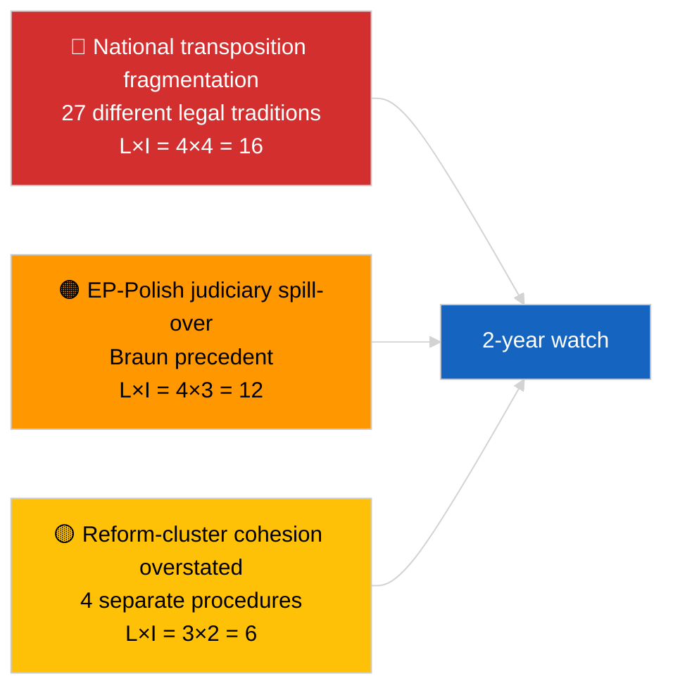

<!-- SPDX-FileCopyrightText: 2026 Hack23 AB -->
<!-- SPDX-License-Identifier: Apache-2.0 -->

# 执行摘要 — 速报（反腐败与制度改革）| 2026-04-03

**分类：** OSINT | 公开议会记录
**可信度：** 🟡 中等（2026年3月全体会议通过决议的回顾性综合分析）
**生成日期：** 2026-04-03T00:00:00Z（回顾性摘要）
**文章类型：** 速报 — 反腐败与制度改革情报
**来源：** 欧洲议会开放数据门户

---

## 🎯 BLUF

**2026年3月全体会议产生了一套连贯的四文件制度改革方案——这是自2022年12月卡塔尔门危机以来最重要的此类组合。** 核心文件是**反腐败指令（TA-10-2026-0094，程序2023/0135，2026年3月26日通过）**——从欧盟委员会提案到欧洲议会通过历时三年，反映了该文件的政治敏感性以及在27个成员国间协调反腐败标准的复杂性。配套文件：**布劳恩议员豁免权撤销（TA-10-2026-0088，程序2025/2192，3月26日通过）**、**更好立法报告（TA-10-2026-0063，程序2025/2015，3月10日通过）**和**公众查阅文件权审查（TA-10-2026-0065，程序2025/2137，3月10日通过）**。这些文件共同强化了EP10恢复制度公信力的轨迹。"连贯方案"这一定性的**可信度🟡中等**（这些文件源于独立程序；连贯性是解释性判断，而非程序性事实）。

---

## 🧭 本摘要支持的3项决策

| # | 决策 | 决策者 | 期限 | 依据 |
|:-:|------|--------|:----:|------|
| 1 | **编辑：** 发表追溯卡塔尔门→2026改革弧的深度制度改革文章 | 主编 | +48小时 | 4文件组合 + 3年程序时间轴 |
| 2 | **监测：** 跟踪TA-10-2026-0094的各国国内转化期限（通常为2年窗口期） | 分析师 | 季度 | 成员国执行报告 |
| 3 | **前瞻监视：** 将后续豁免权程序标记为布劳恩先例测试案例 | 分析负责人 | 2026-04-30 | LIBE/JURI监视 |

---

## 📰 60秒速读

- 🔴 **TA-10-2026-0094（反腐败指令）** — 2026年3月26日通过（2023年提案后历时三年）。欧盟范围内的基础性协调。（通过时🟢高；框架重要性🟡中等）
- 🟠 **TA-10-2026-0088（布劳恩豁免权撤销）** — 同次全体会议通过；为面临国内刑事诉讼的欧洲议员豁免权撤销创立最新先例。（🟢高）
- 🟢 **TA-10-2026-0063（更好立法报告）** — 3月10日通过；为EP10其余任期的监管质量讨论设定基准。（🟢高）
- 🟡 **TA-10-2026-0065（公众查阅文件权审查）** — 3月10日通过；从透明度维度补充反腐败指令。（🟢高）
- 🔵 **经济背景：** 反腐败指令协调降低了跨境企业合规成本的差异；对内部市场发出积极信号。（🟡中等）
- 🟣 **交叉参考：** 卡塔尔门（2022年12月）是催化性政治腐败冲击，引发了在2026年3月组合中达到顶点的改革弧。（🟡中等）
- 🩷 **扰动矢量：** 布劳恩先例向其他面临国内调查的欧洲议员扩散（4月亚基豁免权撤销TA-10-2026-0105事后证实）。（当时🟡中等）
- ⚪ **延续：** TA-10-2026-0094的国内转化通常需要24个月；首份合规报告预计于~2028年Q1到期。

---

## 🗂️ 主要文件 / 程序表

| 排名 | 欧洲议会参考号 | 标题（简短） | 程序 | 重要性 | 可信度 |
|:---:|--------------|-------------|------|:------:|:------:|
| 1 | TA-10-2026-0094 | 反腐败指令 | 2023/0135 | 9.0 | 🟢 高 |
| 2 | TA-10-2026-0088 | 布劳恩豁免权撤销 | 2025/2192 | 7.0 | 🟢 高 |
| 3 | TA-10-2026-0063 | 更好立法报告 | 2025/2015 | 7.0 | 🟢 高 |
| 4 | TA-10-2026-0065 | 公众查阅文件权审查 | 2025/2137 | 7.0 | 🟢 高 |

---

## ⚠️ 风险与威胁快照

| 风险 | L | I | 分值 | 触发因素 | 来源 | 可靠性 |
|------|:-:|:-:|:---:|----------|------|:------:|
| 国内转化碎片化 | 4 | 4 | 16 | 成员国违规 | TA-10-2026-0094 | A1 |
| EP-波兰司法溢出 | 4 | 3 | 12 | 更多豁免权案例 | TA-10-2026-0088 | A1 |
| 改革组合框架夸大 | 3 | 2 | 6 | 编辑夸大 | 本次会话综合 | B3 |
| 更好立法实施运营化 | 3 | 3 | 9 | 机构间摩擦 | TA-10-2026-0063 | A2 |

---

## 🔮 最重要的前瞻性触发因素

**2026至2028年TA-10-2026-0094的季度国内转化报告。** 该指令的成功取决于27个成员国全体一致的执法标准——首份出现偏差的转化报告（可能来自法治水平较低的司法管辖区）将是判断2026年3月改革组合能否切实推动制度公信力恢复的主要前瞻指标。

---

## 🛡️ 信息源质量评估

- **主要来源：** 欧洲议会通过文本供稿（鉴于API状态降级，启用一周备用机制）；已引用程序2023/0135、2025/2015、2025/2137、2025/2192的程序登记册。
- **通过决议的可信度：** 🟢 高。
- **"组合"框架的可信度：** 🟡 中等——四个文件在程序上确实独立；连贯性是分析推断，而非制度事实。

---

## 📎 链接

| 链接 | 路径 |
|------|------|
| 文章 | `./article.md` |
| 同期运行 | `analysis/daily/2026-04-03/breaking/`（联盟），`breaking-2/`（EP API可靠性） |
| 清单 | `./manifest.json` |
| 来源——通过决议 | `analysis/daily/2026-03-10/`（更好立法、公众查阅），`analysis/daily/2026-03-26/`（反腐败、布劳恩） |

---

## 🔄 交叉参考

**催化性先前事件：** 卡塔尔门（2022年12月）——引发EP10制度改革弧的政治腐败冲击。

**后续跟进：** 亚基豁免权撤销（TA-10-2026-0105，2026年4月）证实了布劳恩先例扩散的假设。

---

**文件管控**
- **模板：** `/analysis/templates/executive-brief.md`
- **成果物路径：** `analysis/daily/2026-04-03/breaking-3/executive-brief.md`
- **分类：** 公开
- **回顾性生成：** 回填会话。
