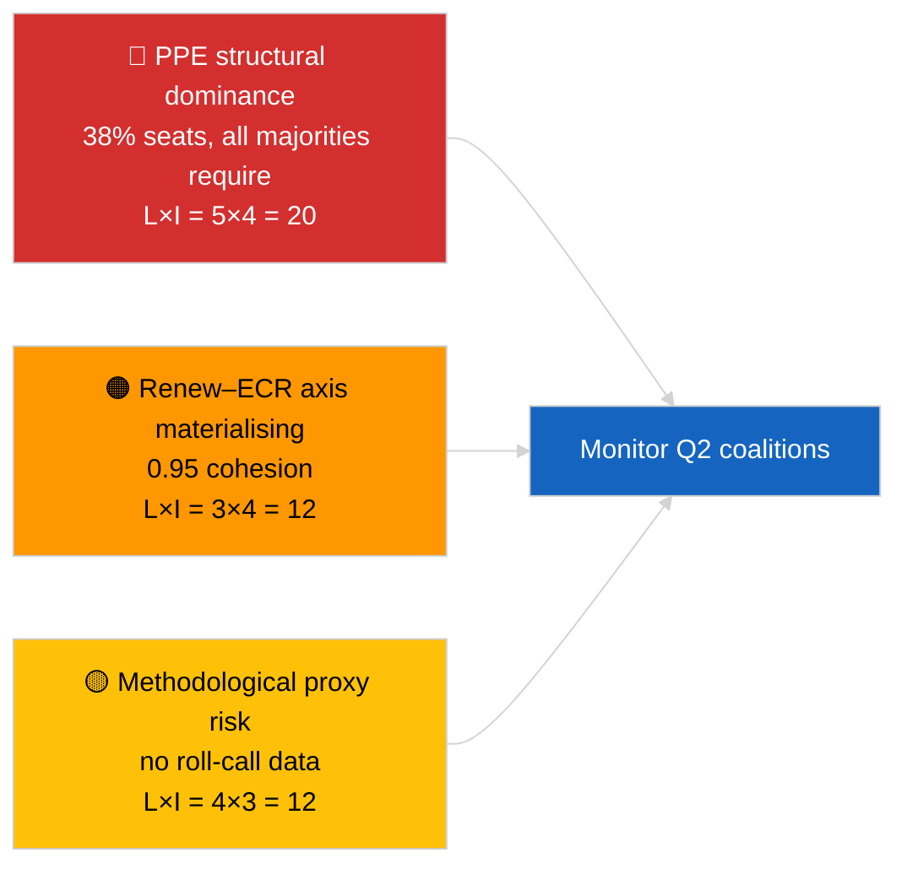

<!-- SPDX-FileCopyrightText: 2026 Hack23 AB -->
<!-- SPDX-License-Identifier: Apache-2.0 -->

# Executive Brief — Breaking (Coalition Dynamics) | 2026-04-03

**Classification:** OSINT | Public Parliamentary Record
**Confidence:** 🟡 Medium (structural seat-ratio cohesion; no roll-call data)
**Generated:** 2026-04-03T00:00:00Z (retrospective brief)
**Article Type:** Breaking — Coalition Dynamics Assessment
**Source:** European Parliament Open Data Portal

---

## 🎯 BLUF

**EP10 coalition arithmetic shows a structurally asymmetric parliament centred on PPE (38% sampled seats) with a notable Renew–ECR cohesion signal of 0.95.** All viable majorities (>51%) require PPE: Grand Coalition (PPE + S&D = 60%), Super-Grand (PPE + S&D + Renew = 65%), Centre-Right alternative (PPE + ECR + PfE = 57%), and Broad Right (PPE + ECR + PfE + Renew = 62%). EP10 fragmentation index has **decreased** to ~4.4 effective parties (EP9 ≈ 5.2) — power has consolidated. The standout finding is the **Renew–ECR cohesion of 0.95 (strengthening)** which, if it translates into roll-call alignment once vote data is published, would herald a new centre-liberal/conservative axis bypassing the traditional grand coalition. **🟡 MEDIUM confidence** — cohesion is derived from seat-size ratios, not voting evidence; PPE pair scores are mathematically near-zero by model artifact and must be discounted.

---

## 🧭 3 Decisions This Brief Supports

| # | Decision | Who Decides | Deadline | Evidence |
|:-:|----------|-------------|:--------:|----------|
| 1 | **Editorial:** PUBLISH coalition-dynamics piece with explicit "structural proxy" caveat | Editor | +24h | 28 coalition pairs evaluated; 0.95 Renew–ECR signal |
| 2 | **Monitoring:** verify Renew–ECR cohesion against roll-call data once published (4-week EP API delay) | Analyst | 2026-05-01 | Late-May voting record release |
| 3 | **Forward-watch:** April Strasbourg plenary roll-calls will confirm or falsify the Renew–ECR axis hypothesis | Analysis lead | 2026-04-30 | Plenary 27-30 April |

---

## 📰 60-Second Read

- 🔴 **Renew–ECR cohesion 0.95 (strengthening)** — strongest signal in the 28-pair matrix; potential new axis. (🟡 Medium — structural proxy)
- 🟠 **PPE structural dominance (38%)** means every viable majority routes through PPE; opposition forced to negotiate from a permanently asymmetric position. (🟢 High)
- 🟢 **Grand Coalition (PPE+S&D = 60%)** remains the default; Super-Grand (PPE+S&D+Renew = 65%) provides cushion against defection. (🟢 High)
- 🟡 **Fragmentation index ~4.4 effective parties** — *lower* than EP9 (~5.2); consolidation favours majority formation but concentrates power. (🟡 Medium)
- 🔵 **The Left–NI 0.65, S&D–ECR 0.60, Renew–The Left 0.60** — secondary alliance signals show anti-establishment / pragmatic cross-cutting alignments. (🟡 Medium)
- 🟣 **Methodological caveat:** PPE pair scores all 0.00 in the size-ratio model — mathematical artifact, NOT absence of cooperation. 🔴 Low confidence on PPE-pair values. (🟢 High)
- 🩷 **Disruption vector:** Renew–ECR axis materialising could reduce S&D leverage over PPE in trade and digital files. (🟡 Medium)
- ⚪ **Carry-forward:** validate against next-cycle roll-call data when Q1 votes publish.

---

## 🗂️ Top Findings Table

| Rank | Finding | Cohesion / Share | Confidence | Status |
|:----:|---------|:----------------:|:----------:|--------|
| 1 | Renew–ECR alliance signal | 0.95 (strengthening) | 🟡 MEDIUM | Pending roll-call validation |
| 2 | Grand Coalition (PPE+S&D) | 60% | 🟢 HIGH | Default majority |
| 3 | Centre-Right alternative (PPE+ECR+PfE) | 57% | 🟢 HIGH | PPE has structural choice |
| 4 | Fragmentation index | 4.4 effective parties | 🟡 MEDIUM | Down from ~5.2 (EP9) |

---

## ⚠️ Risk & Threat Snapshot

| Risk | L | I | Score | Trigger | Source | Admiralty |
|------|:-:|:-:|:-----:|---------|--------|:---------:|
| PPE structural dominance | 5 | 4 | 20 | All viable majorities require PPE | Coalition arithmetic | A1 |
| Renew–ECR axis materialising | 3 | 4 | 12 | Roll-call confirmation | Cohesion matrix | B2 |
| Methodological proxy (no roll-calls) | 4 | 3 | 12 | Cohesion model misleads | EP API limitations | A2 |
| Grand Coalition fracture | 2 | 5 | 10 | S&D refuses PPE compromise | Coalition arithmetic | A2 |

---

## 🔮 Top Forward Trigger

**April 27-30 Strasbourg roll-calls (published ~4 weeks later, ~end-May).** Will validate or falsify the Renew–ECR cohesion signal. If post-publication voting alignment confirms ≥0.7 actual cohesion between Renew and ECR on tier-1 files, escalate the "new axis" hypothesis to HIGH confidence and re-baseline the coalition watch board.

---

## 🛡️ Source Quality Assessment

- **Primary sources:** EP MCP `analyze_coalition_dynamics`, `generate_political_landscape`; sampled 8 groups / 28 pairs.
- **Data limitations:** No roll-call voting data available (EP publishes with 4-week delay); cohesion is structural seat-ratio proxy. PPE pair scores degenerate by model construction.
- **Confidence on Renew–ECR signal:** 🟡 MEDIUM.
- **Confidence on PPE pair scores:** 🔴 LOW (model artifact).

---

## 📎 Links

| Link | Path |
|------|------|
| Article | `./article.md` |
| Sibling runs | `analysis/daily/2026-04-03/breaking-2/` (EP API reliability), `breaking-3/` (anti-corruption) |
| Manifest | `./manifest.json` |

---

## 🔄 Cross-Reference

**Prior:** First post-March recess week. Coalition arithmetic referenced in 2026-04-01/breaking is now formalised across 28 pairs in this run.

**Concurrent:** 2026-04-03/breaking-2 documents the EP API reliability concerns; 2026-04-03/breaking-3 covers the anti-corruption directive package.

---

**Document Control**
- **Template:** `/analysis/templates/executive-brief.md`
- **Artifact path:** `analysis/daily/2026-04-03/breaking/executive-brief.md`
- **Classification:** Public
- **Retrospective generation:** Back-fill session.
