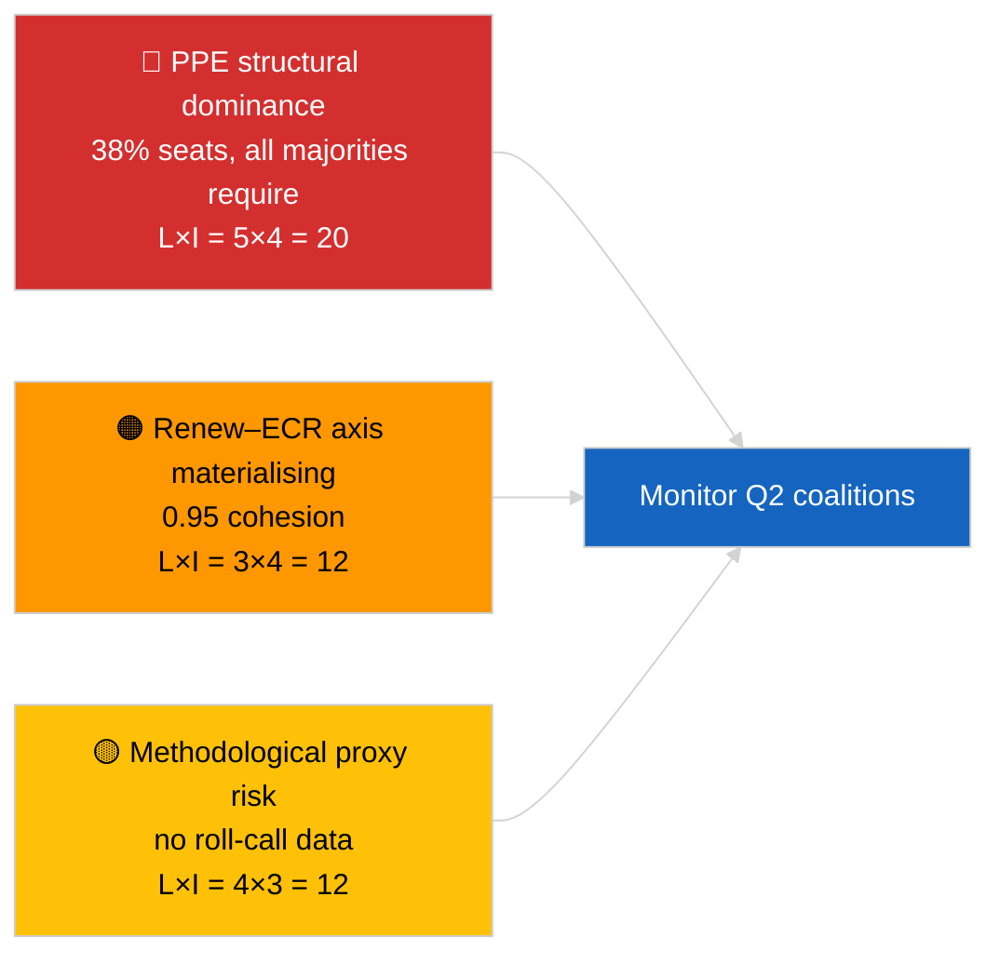

<!-- SPDX-FileCopyrightText: 2026 Hack23 AB -->
<!-- SPDX-License-Identifier: Apache-2.0 -->

# موجز تنفيذي — أخبار عاجلة (ديناميكيات الائتلاف) | 2026-04-03

**التصنيف:** OSINT | السجل البرلماني العام
**مستوى الثقة:** 🟡 متوسط (تماسك مستند إلى نسبة حجم المقاعد؛ لا توجد بيانات تصويت اسمي)
**تاريخ التوليد:** 2026-04-03T00:00:00Z (توليف استرجاعي)
**نوع المقال:** أخبار عاجلة — تقييم ديناميكيات الائتلاف
**المصدر:** بوابة البيانات المفتوحة للبرلمان الأوروبي

---

## 🎯 BLUF

**تكشف الحسابات الائتلافية للبرلمان الأوروبي EP10 عن برلمان غير متماثل هيكلياً يتمحور حول حزب الشعب الأوروبي (38 % من المقاعد المُستعانة بها) مع إشارة تماسك لافتة بين Renew وECR بمقدار 0,95.** تستلزم جميع الأغلبيات القابلة للحياة (>51 %) حزبَ الشعب الأوروبي: الائتلاف الكبير (حزب الشعب + الاشتراكيون والديمقراطيون = 60 %)، الائتلاف الأعظم (حزب الشعب + الاشتراكيون + Renew = 65 %)، البديل وسط اليمين (حزب الشعب + ECR + PfE = 57 %)، اليمين الموسع (حزب الشعب + ECR + PfE + Renew = 62 %). انخفض مؤشر التشتت في EP10 إلى **~4,4 أحزاب فعلية** (EP9 ≈ 5,2) — تعزّز تركّز السلطة. الاكتشاف البارز هو **تماسك Renew–ECR البالغ 0,95 (في تصاعد)**، الذي لو ترجم إلى توافق تصويتي فعلي لأعلن عن محور جديد وسط ليبرالي/محافظ يتجاوز الائتلاف الكبير التقليدي. **🟡 ثقة متوسطة** — يُستمد التماسك من نسب حجم المقاعد لا من أدلة تصويتية؛ درجات أزواج حزب الشعب الأوروبي تقترب رياضياً من الصفر بحكم أثر النموذج ويجب تخفيضها.

---

## 🧭 3 Decisions This Brief Supports

| # | القرار | صاحب القرار | الموعد | الأدلة |
|:-:|--------|------------|:-------:|--------|
| 1 | **تحريري:** نشر مقال عن ديناميكيات الائتلاف مع تنبيه صريح «وكيل هيكلي» | رئيس التحرير | +24 ساعة | تقييم 28 زوجاً ائتلافياً؛ إشارة Renew–ECR 0,95 |
| 2 | **رصد:** التحقق من تماسك Renew–ECR في مقابل بيانات التصويت عند نشرها (تأخر 4 أسابيع في API البرلمان الأوروبي) | محلل | 2026-05-01 | نشر سجلات التصويت نهاية مايو |
| 3 | **استخبارات استباقية:** تصويتات الجلسة العامة في ستراسبورغ أبريل ستؤكد أو تنفي فرضية محور Renew–ECR | مسؤول التحليل | 2026-04-30 | الجلسة العامة 27–30 أبريل |

---

## 📰 60-Second Read

- 🔴 **تماسك Renew–ECR 0,95 (في تصاعد)** — أقوى إشارة في مصفوفة 28 زوجاً؛ محور محتمل جديد. (🟡 متوسط)
- 🟠 **الهيمنة الهيكلية لحزب الشعب الأوروبي (38 %)** تعني أن كل أغلبية قابلة للحياة تمر عبره؛ المعارضة مضطرة للتفاوض من موقع غير متماثل هيكلياً. (🟢 عالٍ)
- 🟢 **الائتلاف الكبير (حزب الشعب + الاشتراكيون والديمقراطيون = 60 %)** يظل الخيار الافتراضي؛ الائتلاف الأعظم (60 %+Renew = 65 %) يوفر حاجزاً أمام الانشقاقات. (🟢 عالٍ)
- 🟡 **مؤشر التشتت ~4,4 أحزاب فعلية** — *أدنى* من EP9 (~5,2)؛ التعزيز يُيسّر تشكيل الأغلبية لكنه يُركّز السلطة. (🟡 متوسط)
- 🔵 **يسار–NI 0,65، الاشتراكيون–ECR 0,60، Renew–يسار 0,60** — إشارات تحالف ثانوية تُظهر توافقات براغماتية عابرة لمعسكر مناهضة المؤسسة. (🟡 متوسط)
- 🟣 **تحفظ منهجي:** درجات أزواج حزب الشعب الأوروبي كلها 0,00 في نموذج نسبة الحجم — أثر رياضي، وليس غياباً للتعاون. 🔴 ثقة منخفضة لقيم أزواج حزب الشعب الأوروبي. (🟢 عالٍ)
- 🩷 **عامل الاضطراب:** تبلور محور Renew–ECR قد يُقلّص تأثير الاشتراكيين والديمقراطيين على حزب الشعب الأوروبي في ملفات التجارة والرقمنة. (🟡 متوسط)
- ⚪ **المتابعة:** التحقق من بيانات التصويت في الدورة القادمة عند نشر أصوات الربع الأول.

---

## 🗂️ Top Findings Table

| الترتيب | الاكتشاف | التماسك / الحصة | مستوى الثقة | الحالة |
|:-------:|---------|:---------------:|:-----------:|--------|
| 1 | إشارة تحالف Renew–ECR | 0,95 (في تصاعد) | 🟡 متوسط | انتظار التحقق التصويتي |
| 2 | الائتلاف الكبير (حزب الشعب + الاشتراكيون والديمقراطيون) | 60 % | 🟢 عالٍ | الأغلبية الافتراضية |
| 3 | البديل وسط اليمين (حزب الشعب + ECR + PfE) | 57 % | 🟢 عالٍ | لدى حزب الشعب خيار هيكلي |
| 4 | مؤشر التشتت | 4,4 أحزاب فعلية | 🟡 متوسط | منخفض عن ~5,2 (EP9) |

---

## ⚠️ Risk & Threat Snapshot

| المخاطرة | L | I | الدرجة | المشغّل | المصدر | رمز الأميرالية |
|---------|:-:|:-:|:------:|---------|--------|:--------------:|
| الهيمنة الهيكلية لحزب الشعب الأوروبي | 5 | 4 | 20 | كل الأغلبيات تستلزم حزب الشعب الأوروبي | الحسابات الائتلافية | A1 |
| تبلور محور Renew–ECR | 3 | 4 | 12 | التأكيد عبر التصويت | مصفوفة التماسك | B2 |
| وكيل منهجي (لا تصويت اسمي) | 4 | 3 | 12 | نموذج التماسك مضلل | قيود API البرلمان الأوروبي | A2 |
| تصدع الائتلاف الكبير | 2 | 5 | 10 | الاشتراكيون والديمقراطيون يرفضون تنازل حزب الشعب الأوروبي | الحسابات الائتلافية | A2 |

---

## 🔮 Top Forward Trigger

**تصويتات الجلسة العامة في ستراسبورغ 27–30 أبريل (تُنشر بعد ~4 أسابيع، ~نهاية مايو).** ستتحقق من إشارة تماسك Renew–ECR أو تنفيها. إذا أكد توافق الأصوات بعد النشر تماسكاً فعلياً ≥0,7 بين Renew وECR على الملفات من المستوى الأول، ترقية فرضية «المحور الجديد» إلى ثقة عالية وإعادة معايرة لوحة مراقبة الائتلافات.

---

## 🛡️ Source Quality Assessment

- **المصادر الأولية:** EP MCP `analyze_coalition_dynamics`، `generate_political_landscape`؛ عينة من 8 مجموعات / 28 زوجاً.
- **قيود البيانات:** لا توجد بيانات تصويت اسمي متاحة (يُنشر بتأخر 4 أسابيع)؛ التماسك وكيل هيكلي لنسبة حجم المقاعد. درجات أزواج حزب الشعب الأوروبي تتدهور بحكم بناء النموذج.
- **الثقة في إشارة Renew–ECR:** 🟡 متوسط.
- **الثقة في درجات أزواج حزب الشعب الأوروبي:** 🔴 منخفض (أثر النموذج).

---

## 📎 Links

| الرابط | المسار |
|--------|--------|
| المقال | `./article.md` |
| الجلسات الشقيقة | `analysis/daily/2026-04-03/breaking-2/` (موثوقية API البرلمان الأوروبي)، `breaking-3/` (مكافحة الفساد) |
| الملفّ التعريفي | `./manifest.json` |

---

## 🔄 Cross-Reference

**السابق:** الأسبوع الأول بعد ركود مارس. الحسابات الائتلافية المشار إليها في 2026-04-01/breaking مُرسّمة الآن على 28 زوجاً في هذه الجلسة.

**المتزامن:** 2026-04-03/breaking-2 يوثّق مشكلات موثوقية API البرلمان الأوروبي؛ 2026-04-03/breaking-3 يغطي حزمة توجيهات مكافحة الفساد.

---

**ضبط الوثيقة**
- **النموذج:** `/analysis/templates/executive-brief.md`
- **مسار الأداء:** `analysis/daily/2026-04-03/breaking/executive-brief.md`
- **التصنيف:** عام
- **التوليد الاسترجاعي:** جلسة ملء استرجاعية.
