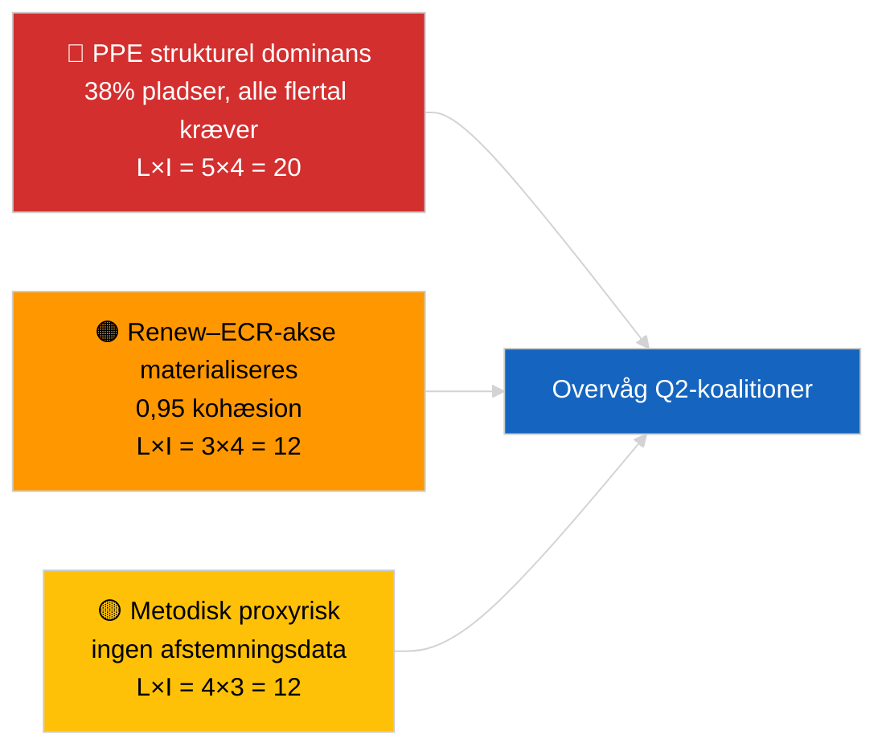

<!-- SPDX-FileCopyrightText: 2026 Hack23 AB -->
<!-- SPDX-License-Identifier: Apache-2.0 -->

# Analytisk Direktionsbriefing — Nyhedsbrud (Koalitionsdynamik) | 2026-04-03

**Klassificering:** OSINT | Offentligt parlamentarisk fortegnelse
**Konfidensniveau:** 🟡 Middel (strukturel sædeandelskoalitioner; ingen afstemningsdata)
**Genereret:** 2026-04-03T00:00:00Z (retrospektiv briefing)
**Artikeltype:** Nyhedsbrud — Koalitionsdynamisk vurdering
**Kilde:** Europa-Parlamentets åbne dataportal

---

## 🎯 BLUF

**EP10's koalitionsaritmetik viser et strukturelt asymmetrisk parlament centreret om PPE (38 % af samplade pladser) med et bemærkelsesværdigt Renew–ECR-kohæsionssignal på 0,95.** Alle gennemførlige flertal (>51 %) kræver PPE: Stor koalition (PPE + S&D = 60 %), Super-Stor koalition (PPE + S&D + Renew = 65 %), Centrum-Højre alt. (PPE + ECR + PfE = 57 %) og Bred Højre (PPE + ECR + PfE + Renew = 62 %). EP10's fragmenteringsindeks er **faldet** til ~4,4 effektive partier (EP9 ≈ 5,2) — magten er konsolideret. Det mest markante fund er **Renew–ECR-kohæsion på 0,95 (styrkende)** som, hvis det omsættes til afstemningsjustering, når data publiceres, ville varsle en ny centerliberal/konservativ akse der omgår den traditionelle store koalition. **🟡 MEDIUM konfidensniveau** — kohæsion er afledt af sædeandelsforhold, ikke afstemningsbevis; PPE-parscorer er matematisk nul af modelartefakt og bør diskonteres.

---

## 🧭 3 Beslutninger som denne briefing understøtter

| # | Beslutning | Hvem beslutter | Frist | Dokumentation |
|:-:|-----------|---------------|:----:|--------------|
| 1 | **Redaktionelt:** PUBLICER koalitionsdynamikartikel med eksplicit "strukturel proxy"-forbehold | Redaktør | +24t | 28 koalitionspar evalueret; 0,95 Renew–ECR-signal |
| 2 | **Overvågning:** Verificer Renew–ECR-kohæsion mod afstemningsdata, når disse offentliggøres (4 ugers EP API-forsinkelse) | Analytiker | 2026-05-01 | Sent maj afstemningsrekord |
| 3 | **Fremadrettet:** April Strasbourg plenum-afstemninger bekræfter eller falsificerer Renew–ECR-aksehypotesen | Analysechef | 2026-04-30 | Plenumuge 27–30 april |

---

## 📰 60-sekunders læsning

- 🔴 **Renew–ECR-kohæsion 0,95 (styrkende)** — stærkeste signal i 28-par-matricen; potentiel ny akse. (🟡 Middel — strukturel proxy)
- 🟠 **PPE's strukturelle dominans (38 %)** betyder, at ethvert gennemførligt flertal går gennem PPE; oppositionen er tvunget til at forhandle fra en permanent asymmetrisk position. (🟢 Høj)
- 🟢 **Stor koalition (PPE+S&D = 60 %)** forbliver standard; Super-Stor (PPE+S&D+Renew = 65 %) giver buffer mod afhopp. (🟢 Høj)
- 🟡 **Fragmenteringsindeks ~4,4 effektive partier** — *lavere* end EP9 (~5,2); konsolidering fremmer flertalsdan­nelse men koncentrerer magten. (🟡 Middel)
- 🔵 **Venstre–NI 0,65, S&D–ECR 0,60, Renew–Venstre 0,60** — sekundære alliancesignaler viser anti-establishment/pragmatisk tværgående justering. (🟡 Middel)
- 🟣 **Metodisk forbehold:** PPE-parscorer alle 0,00 i størrelseskvotmodellen — matematisk artefakt, IKKE fravær af samarbejde. 🔴 Lavt konfidensniveau for PPE-parværdier. (🟢 Høj)
- 🩷 **Forstyrrelsesfaktor:** Hvis Renew–ECR-aksen materialiseres, kan S&D's indflydelse over PPE i handels- og digitalfiler reduceres. (🟡 Middel)
- ⚪ **Fremadrettet:** Valider mod næste cyklus afstemningsdata, når Q1-stemmer offentliggøres.

---

## 🗂️ Topfund-tabel

| Rang | Fund | Kohæsion / Andel | Konfidensniveau | Status |
|:---:|-----|:----------------:|:--------------:|--------|
| 1 | Renew–ECR alliancesignal | 0,95 (styrkende) | 🟡 MIDDEL | Afventer afstemningsvalidering |
| 2 | Stor koalition (PPE+S&D) | 60 % | 🟢 HØJ | Standardflertal |
| 3 | Centrum-Højre alternativ (PPE+ECR+PfE) | 57 % | 🟢 HØJ | PPE har strukturelt valg |
| 4 | Fragmenteringsindeks | 4,4 effektive partier | 🟡 MIDDEL | Faldet fra ~5,2 (EP9) |

---

## ⚠️ Risiko- og trusselsoverblik

| Risiko | S | I | Score | Udløser | Kilde | Admiralty |
|--------|:-:|:-:|:-----:|---------|-------|:---------:|
| PPE strukturel dominans | 5 | 4 | 20 | Alle gennemførlige flertal kræver PPE | Koalitionsaritmetik | A1 |
| Renew–ECR-akse materialiseres | 3 | 4 | 12 | Afstemningsbekræftelse | Kohæsionsmatrix | B2 |
| Metodisk proxy (ingen afstemninger) | 4 | 3 | 12 | Kohæsionsmodel vildleder | EP API-begrænsninger | A2 |
| Stor koalition splintres | 2 | 5 | 10 | S&D nægter PPE-kompromis | Koalitionsaritmetik | A2 |

---

## 🔮 Vigtigste fremadrettede udløser

**April 27–30 Strasbourg plenum-afstemninger (offentliggøres ~4 uger senere, ~slutningen af maj).** Bekræfter eller falsificerer Renew–ECR-kohæsionssignalet. Hvis afstemningsdata efter offentliggørelse bekræfter ≥0,7 faktisk kohæsion mellem Renew og ECR i tier-1-filer, eskalér "ny akse"-hypotesen til HØJ konfidensniveau og nulstil koalitionsovervågningstavlen.

---

## 🛡️ Kildekvalitetsvurdering

- **Primære kilder:** EP MCP `analyze_coalition_dynamics`, `generate_political_landscape`; samplade 8 grupper / 28 par.
- **Databegrænsninger:** Ingen afstemningsdata tilgængelige (EP publicerer med 4 ugers forsinkelse); kohæsion er strukturel sædeandelsroxy. PPE-parscorer degenererer af modelkonstruktion.
- **Konfidensniveau for Renew–ECR-signal:** 🟡 MIDDEL.
- **Konfidensniveau for PPE-parscorer:** 🔴 LAV (modelartefakt).

---

## 📎 Links

| Link | Sti |
|------|-----|
| Artikel | `./article.md` |
| Søskendeafviklinger | `analysis/daily/2026-04-03/breaking-2/` (EP API-pålidelighed), `breaking-3/` (antikorruption) |
| Manifest | `./manifest.json` |

---

## 🔄 Krydsreference

**Tidligere:** Første uge efter marts-reces. Koalitionsaritmetik refereret i 2026-04-01/breaking er nu formaliseret over 28 par i denne afvikling.

**Samtidige:** 2026-04-03/breaking-2 dokumenterer EP API-pålideligheds­problemer; 2026-04-03/breaking-3 dækker antikorruptionsdirektivpakken.

---

**Dokumentkontrol**
- **Skabelon:** `/analysis/templates/executive-brief.md`
- **Artefaktsti:** `analysis/daily/2026-04-03/breaking/executive-brief.md`
- **Klassificering:** Offentlig
- **Retrospektiv generering:** Backfill-session.
