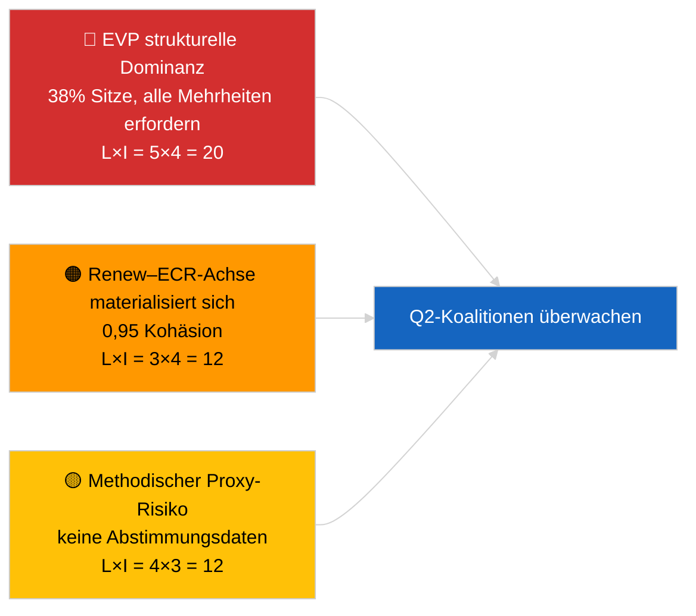

<!-- SPDX-FileCopyrightText: 2026 Hack23 AB -->
<!-- SPDX-License-Identifier: Apache-2.0 -->

# Analytisches Führungsbriefing — Aktuell (Koalitionsdynamik) | 2026-04-03

**Einstufung:** OSINT | Öffentlicher parlamentarischer Bericht
**Vertrauensgrad:** 🟡 Mittel (strukturelle Sitzanteilskoalitionen; keine Abstimmungsdaten)
**Erstellt:** 2026-04-03T00:00:00Z (retrospektives Briefing)
**Artikeltyp:** Aktuell — Koalitionsdynamische Bewertung
**Quelle:** Offenes Datenportal des Europäischen Parlaments

---

## 🎯 BLUF

**Die Koalitionsarithmetik des EP10 zeigt ein strukturell asymmetrisches Parlament, das auf die EVP ausgerichtet ist (38 % der Stichplätze), mit einem bemerkenswerten Renew–ECR-Kohäsionssignal von 0,95.** Alle tragfähigen Mehrheiten (>51 %) erfordern die EVP: Große Koalition (EVP + S&D = 60 %), Super-Große Koalition (EVP + S&D + Renew = 65 %), Mitte-Rechts-Alternative (EVP + ECR + PfE = 57 %) und Breite Rechte (EVP + ECR + PfE + Renew = 62 %). Der EP10-Fragmentierungsindex ist **gesunken** auf ~4,4 effektive Parteien (EP9 ≈ 5,2) — die Macht hat sich konsolidiert. Der auffälligste Befund ist die **Renew–ECR-Kohäsion von 0,95 (stärkend)**, die, wenn sie sich in Abstimmungsübereinstimmung umsetzt, eine neue zentral-liberale/konservative Achse ankündigen würde, die die traditionelle große Koalition umgeht. **🟡 MITTLERER Vertrauensgrad** — Kohäsion wird aus Sitzgrößenquoten abgeleitet, nicht aus Abstimmungsbelegen; EVP-Paarwerte sind mathematisch null als Modellartefakt und müssen diskontiert werden.

---

## 🧭 3 Entscheidungen, die dieses Briefing unterstützt

| # | Entscheidung | Wer entscheidet | Frist | Nachweis |
|:-:|-------------|----------------|:----:|---------|
| 1 | **Redaktionell:** Koalitionsdynamik-Artikel VERÖFFENTLICHEN mit explizitem „struktureller Proxy"-Vorbehalt | Redakteur | +24h | 28 Koalitionspaare bewertet; 0,95 Renew–ECR-Signal |
| 2 | **Überwachung:** Renew–ECR-Kohäsion gegen Abstimmungsdaten verifizieren, wenn diese veröffentlicht werden (4 Wochen EP API-Verzögerung) | Analyst | 2026-05-01 | Spätes Mai-Abstimmungsprotokoll |
| 3 | **Vorausblick:** Straßburg-Plenumabstimmungen im April bestätigen oder falsifizieren die Renew–ECR-Achsenhypothese | Analyseleiter | 2026-04-30 | Plenumwoche 27.–30. April |

---

## 📰 60-Sekunden-Lektüre

- 🔴 **Renew–ECR-Kohäsion 0,95 (stärkend)** — stärkstes Signal in der 28-Paar-Matrix; potenzielle neue Achse. (🟡 Mittel — struktureller Proxy)
- 🟠 **Strukturelle EVP-Dominanz (38 %)** bedeutet, dass jede tragfähige Mehrheit über die EVP verläuft; die Opposition ist gezwungen, aus einer dauerhaft asymmetrischen Position heraus zu verhandeln. (🟢 Hoch)
- 🟢 **Große Koalition (EVP+S&D = 60 %)** bleibt Standard; Super-Große Koalition (EVP+S&D+Renew = 65 %) puffert gegen Abweichungen. (🟢 Hoch)
- 🟡 **Fragmentierungsindex ~4,4 effektive Parteien** — *niedriger* als EP9 (~5,2); Konsolidierung begünstigt Mehrheitsbildung, konzentriert aber die Macht. (🟡 Mittel)
- 🔵 **Linke–NI 0,65, S&D–ECR 0,60, Renew–Linke 0,60** — sekundäre Allianzsignale zeigen Anti-Establishment-/pragmatische quer verlaufende Ausrichtungen. (🟡 Mittel)
- 🟣 **Methodischer Vorbehalt:** EVP-Paarwerte alle 0,00 im Größenquotientenmodell — mathematisches Artefakt, KEIN Fehlen von Zusammenarbeit. 🔴 Geringer Vertrauensgrad für EVP-Paarwerte. (🟢 Hoch)
- 🩷 **Störungsfaktor:** Wenn die Renew–ECR-Achse sich materialisiert, könnte der Einfluss der S&D gegenüber der EVP in Handels- und Digitaldossiers abnehmen. (🟡 Mittel)
- ⚪ **Übertrag:** Gegen Abstimmungsdaten des nächsten Zyklus validieren, wenn Q1-Abstimmungen veröffentlicht werden.

---

## 🗂️ Tabelle der Hauptbefunde

| Rang | Befund | Kohäsion / Anteil | Vertrauensgrad | Status |
|:---:|--------|:-----------------:|:--------------:|--------|
| 1 | Renew–ECR-Allianzsignal | 0,95 (stärkend) | 🟡 MITTEL | Abstimmungsvalidierung aussteht |
| 2 | Große Koalition (EVP+S&D) | 60 % | 🟢 HOCH | Standardmehrheit |
| 3 | Mitte-Rechts-Alternative (EVP+ECR+PfE) | 57 % | 🟢 HOCH | EVP hat strukturelle Wahlmöglichkeit |
| 4 | Fragmentierungsindex | 4,4 effektive Parteien | 🟡 MITTEL | Rückgang von ~5,2 (EP9) |

---

## ⚠️ Risiko- und Bedrohungsüberblick

| Risiko | W | I | Wert | Auslöser | Quelle | Admiralty |
|--------|:-:|:-:|:----:|---------|--------|:---------:|
| EVP strukturelle Dominanz | 5 | 4 | 20 | Alle tragfähigen Mehrheiten erfordern EVP | Koalitionsarithmetik | A1 |
| Renew–ECR-Achse materialisiert sich | 3 | 4 | 12 | Abstimmungsbestätigung | Kohäsionsmatrix | B2 |
| Methodischer Proxy (keine Abstimmungen) | 4 | 3 | 12 | Kohäsionsmodell irreführend | EP API-Einschränkungen | A2 |
| Große Koalition bricht | 2 | 5 | 10 | S&D verweigert EVP-Kompromiss | Koalitionsarithmetik | A2 |

---

## 🔮 Wichtigster künftiger Auslöser

**Straßburg-Plenumabstimmungen 27.–30. April (veröffentlicht ~4 Wochen später, ~Ende Mai).** Bestätigt oder falsifiziert das Renew–ECR-Kohäsionssignal. Wenn Abstimmungsdaten nach Veröffentlichung ≥0,7 tatsächliche Kohäsion zwischen Renew und ECR bei Tier-1-Dossiers bestätigen, das „neue Achse"-Szenario auf HOHES Vertrauen eskalieren und das Koalitionsüberwachungsbrett neu kalibrieren.

---

## 🛡️ Quellenqualitätsbewertung

- **Primärquellen:** EP MCP `analyze_coalition_dynamics`, `generate_political_landscape`; Stichprobe 8 Gruppen / 28 Paare.
- **Datenbeschränkungen:** Keine Abstimmungsdaten verfügbar (EP veröffentlicht mit 4 Wochen Verzögerung); Kohäsion ist struktureller Sitzanteilsproxy. EVP-Paarwerte degenerieren durch Modellkonstruktion.
- **Vertrauensgrad für Renew–ECR-Signal:** 🟡 MITTEL.
- **Vertrauensgrad für EVP-Paarwerte:** 🔴 GERING (Modellartefakt).

---

## 📎 Links

| Link | Pfad |
|------|------|
| Artikel | `./article.md` |
| Geschwisterläufe | `analysis/daily/2026-04-03/breaking-2/` (EP API-Zuverlässigkeit), `breaking-3/` (Antikorruption) |
| Manifest | `./manifest.json` |

---

## 🔄 Querverweise

**Vorherige:** Erste Woche nach der Märzpause. Koalitionsarithmetik, auf die in 2026-04-01/breaking verwiesen wird, ist nun über 28 Paare in diesem Lauf formalisiert.

**Gleichzeitige:** 2026-04-03/breaking-2 dokumentiert EP API-Zuverlässigkeitsprobleme; 2026-04-03/breaking-3 deckt das Antikorruptionsdirektivpaket ab.

---

**Dokumentkontrolle**
- **Vorlage:** `/analysis/templates/executive-brief.md`
- **Artefaktpfad:** `analysis/daily/2026-04-03/breaking/executive-brief.md`
- **Einstufung:** Öffentlich
- **Retrospektive Erstellung:** Backfill-Sitzung.
