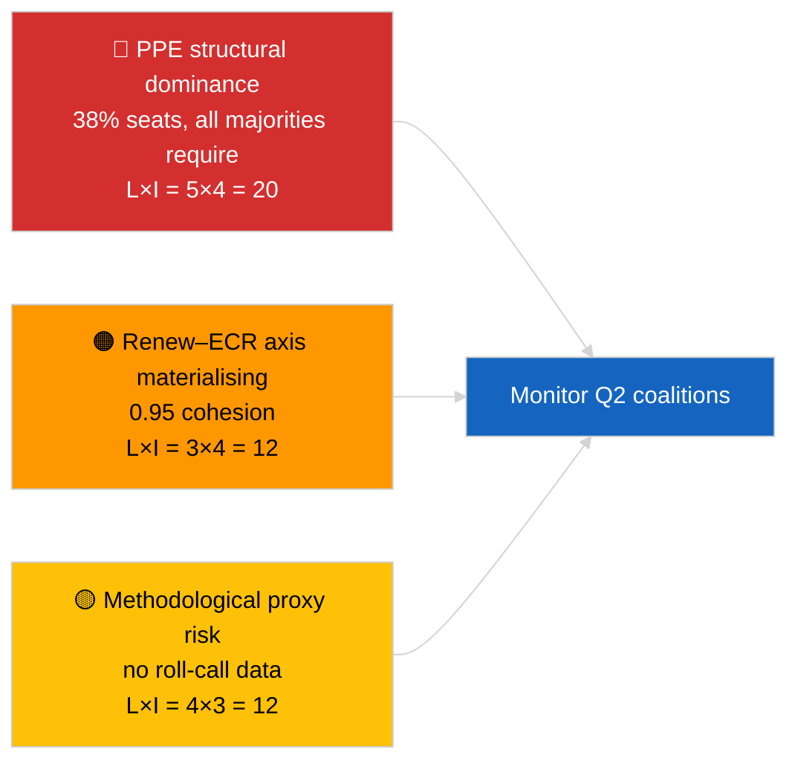

<!-- SPDX-FileCopyrightText: 2026 Hack23 AB -->
<!-- SPDX-License-Identifier: Apache-2.0 -->

# Resumen Ejecutivo — Noticias de Última Hora (Dinámica de Coaliciones) | 2026-04-03

**Clasificación:** OSINT | Registro parlamentario público
**Confianza:** 🟡 Media (cohesión por ratio de tamaño de escaños; sin datos de votación nominal)
**Generado:** 2026-04-03T00:00:00Z (síntesis retrospectiva)
**Tipo de artículo:** Noticias de última hora — Evaluación de la dinámica de coaliciones
**Fuente:** Portal de datos abiertos del Parlamento Europeo

---

## 🎯 BLUF

**La aritmética de coalición de EP10 revela un Parlamento estructuralmente asimétrico centrado en el PPE (38 % de los escaños muestreados) con una notable señal de cohesión Renew–ECR de 0,95.** Todas las mayorías viables (>51 %) requieren al PPE: Gran coalición (PPE + S&D = 60 %), Súper-Gran coalición (PPE + S&D + Renew = 65 %), Alternativa centro-derecha (PPE + ECR + PfE = 57 %) y Derecha ampliada (PPE + ECR + PfE + Renew = 62 %). El índice de fragmentación de EP10 ha **disminuido** a ~4,4 partidos efectivos (EP9 ≈ 5,2) — el poder se ha consolidado. El hallazgo más destacado es la **cohesión Renew–ECR de 0,95 (en aumento)** que, si se traduce en una alineación real de votaciones, anunciaría un nuevo eje centroliberal/conservador que circunvalaría la gran coalición tradicional. **🟡 Confianza MEDIA** — la cohesión se deriva de ratios de tamaño de escaños, no de pruebas de votación; las puntuaciones de pares del PPE son matemáticamente cercanas a cero por artefacto del modelo y deben descontarse.

---

## 🧭 3 Decisions This Brief Supports

| # | Decisión | Decisor | Plazo | Evidencia |
|:-:|---------|---------|:-----:|-----------|
| 1 | **Editorial:** PUBLICAR artículo sobre dinámica de coaliciones con la advertencia explícita «proxy estructural» | Editor | +24h | 28 pares de coalición evaluados; señal Renew–ECR 0,95 |
| 2 | **Seguimiento:** verificar cohesión Renew–ECR frente a datos de votación cuando se publiquen (retraso API PE de 4 semanas) | Analista | 2026-05-01 | Publicación de registros de votación a finales de mayo |
| 3 | **Inteligencia anticipada:** los votos plenarios de Estrasburgo de abril confirmarán o refutarán la hipótesis del eje Renew–ECR | Responsable de análisis | 2026-04-30 | Plenario 27–30 de abril |

---

## 📰 60-Second Read

- 🔴 **Cohesión Renew–ECR 0,95 (en aumento)** — señal más fuerte en la matriz de 28 pares; potencial nuevo eje. (🟡 Medio)
- 🟠 **Dominancia estructural del PPE (38 %)** significa que toda mayoría viable pasa por el PPE; la oposición está obligada a negociar desde una posición estructuralmente asimétrica. (🟢 Alto)
- 🟢 **Gran coalición (PPE+S&D = 60 %)** sigue siendo el valor por defecto; Súper-Gran coalición (PPE+S&D+Renew = 65 %) ofrece protección frente a defecciones. (🟢 Alto)
- 🟡 **Índice de fragmentación ~4,4 partidos efectivos** — *inferior* a EP9 (~5,2); la consolidación favorece la formación de mayoría pero concentra el poder. (🟡 Medio)
- 🔵 **Left–NI 0,65, S&D–ECR 0,60, Renew–Left 0,60** — señales de alianza secundarias que muestran alineaciones pragmáticas transversales antiestablishment. (🟡 Medio)
- 🟣 **Advertencia metodológica:** las puntuaciones de pares del PPE son todas 0,00 en el modelo de ratio de tamaño de escaños — artefacto matemático, NO ausencia de cooperación. 🔴 Confianza baja para los valores de pares del PPE. (🟢 Alto)
- 🩷 **Vector de perturbación:** la materialización del eje Renew–ECR podría reducir la influencia del S&D sobre el PPE en los expedientes comerciales y digitales. (🟡 Medio)
- ⚪ **Seguimiento:** validar frente a los datos de votación del próximo ciclo cuando se publiquen los votos del T1.

---

## 🗂️ Top Findings Table

| Rango | Hallazgo | Cohesión / Cuota | Confianza | Estado |
|:-----:|---------|:----------------:|:---------:|--------|
| 1 | Señal de alianza Renew–ECR | 0,95 (en aumento) | 🟡 MEDIO | Validación de votación pendiente |
| 2 | Gran coalición (PPE+S&D) | 60 % | 🟢 ALTO | Mayoría por defecto |
| 3 | Alternativa centro-derecha (PPE+ECR+PfE) | 57 % | 🟢 ALTO | El PPE tiene elección estructural |
| 4 | Índice de fragmentación | 4,4 partidos efectivos | 🟡 MEDIO | A la baja desde ~5,2 (EP9) |

---

## ⚠️ Risk & Threat Snapshot

| Riesgo | L | I | Puntuación | Desencadenante | Fuente | Almirantazgo |
|--------|:-:|:-:|:----------:|--------------|--------|:------------:|
| Dominancia estructural del PPE | 5 | 4 | 20 | Todas las mayorías viables requieren al PPE | Aritmética de coalición | A1 |
| Eje Renew–ECR materializándose | 3 | 4 | 12 | Confirmación mediante votación | Matriz de cohesión | B2 |
| Proxy metodológico (sin votación nominal) | 4 | 3 | 12 | El modelo de cohesión induce a error | Limitaciones API PE | A2 |
| Fractura de la Gran coalición | 2 | 5 | 10 | El S&D rechaza el compromiso con el PPE | Aritmética de coalición | A2 |

---

## 🔮 Top Forward Trigger

**Votos plenarios de Estrasburgo 27–30 de abril (publicados ~4 semanas más tarde, ~finales de mayo).** Validará o falsificará la señal de cohesión Renew–ECR. Si el alineamiento de votos tras la publicación confirma ≥0,7 de cohesión efectiva entre Renew y ECR en los expedientes de nivel 1, elevar la hipótesis de «nuevo eje» a confianza ALTA y recalibrar el panel de seguimiento de coaliciones.

---

## 🛡️ Source Quality Assessment

- **Fuentes primarias:** EP MCP `analyze_coalition_dynamics`, `generate_political_landscape`; muestra de 8 grupos / 28 pares.
- **Limitaciones de los datos:** Sin datos de votación nominal disponibles (el PE publica con 4 semanas de retraso); la cohesión es un proxy estructural de ratio de tamaño de escaños. Las puntuaciones de pares del PPE degeneran por construcción del modelo.
- **Confianza para la señal Renew–ECR:** 🟡 MEDIA.
- **Confianza para las puntuaciones de pares del PPE:** 🔴 BAJA (artefacto del modelo).

---

## 📎 Links

| Enlace | Ruta |
|--------|------|
| Artículo | `./article.md` |
| Sesiones hermanas | `analysis/daily/2026-04-03/breaking-2/` (fiabilidad API PE), `breaking-3/` (anticorrupción) |
| Manifiesto | `./manifest.json` |

---

## 🔄 Cross-Reference

**Precedente:** Primera semana post-recesión de marzo. La aritmética de coaliciones referenciada en 2026-04-01/breaking ahora se formaliza en 28 pares en esta sesión.

**Concomitante:** 2026-04-03/breaking-2 documenta los problemas de fiabilidad de la API PE; 2026-04-03/breaking-3 cubre el paquete de directivas anticorrupción.

---

**Control documental**
- **Plantilla:** `/analysis/templates/executive-brief.md`
- **Ruta del artefacto:** `analysis/daily/2026-04-03/breaking/executive-brief.md`
- **Clasificación:** Público
- **Generación retrospectiva:** Sesión de relleno retrospectivo.
