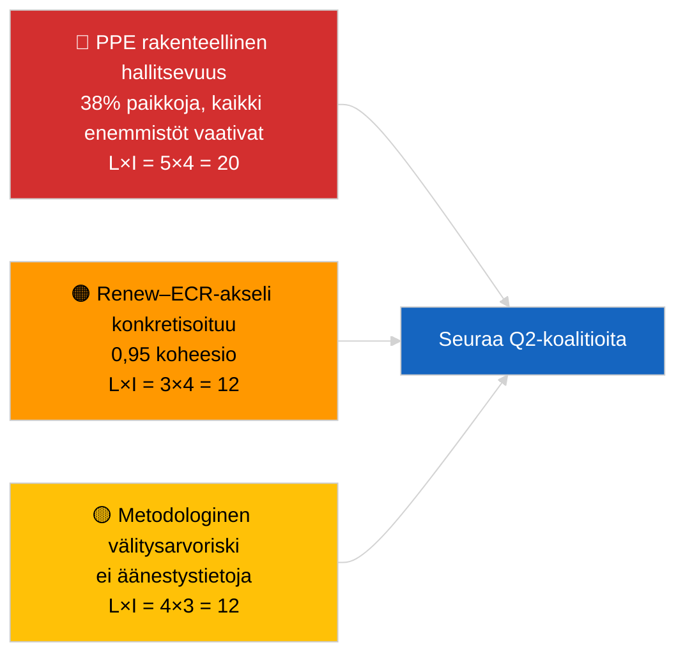

<!-- SPDX-FileCopyrightText: 2026 Hack23 AB -->
<!-- SPDX-License-Identifier: Apache-2.0 -->

# Analyyttinen Johtoyhteenveto — Uutiset (Koalitiodynamiikka) | 2026-04-03

**Luokitus:** OSINT | Julkinen parlamentaarinen rekisteri
**Luotettavuusaste:** 🟡 Keskitaso (rakenteelliset paikkaosuuskoalitiot; ei äänestystietoja)
**Luotu:** 2026-04-03T00:00:00Z (takautuva yhteenveto)
**Artikkelityyppi:** Uutiset — Koalitiodynamiikan arviointi
**Lähde:** Euroopan parlamentin avoin dataporttaali

---

## 🎯 BLUF

**EP10:n koalitioaretimetiikka osoittaa rakenteellisesti epäsymmetrisen parlamentin, joka on keskittynyt PPE:n ympärille (38 % otannasta paikoista), ja johon liittyy merkittävä Renew–ECR-koheesiasignaali 0,95.** Kaikki toteutettavissa olevat enemmistöt (>51 %) vaativat PPE:tä: Suuri koalitio (PPE + S&D = 60 %), Super-Suuri (PPE + S&D + Renew = 65 %), Keski-oikeisto-vaihtoehto (PPE + ECR + PfE = 57 %) ja Laaja oikeisto (PPE + ECR + PfE + Renew = 62 %). EP10:n pirstaleisuusindeksi on **laskenut** ~4,4:ään tehokkaaseen puolueeseen (EP9 ≈ 5,2) — valta on konsolidoitunut. Merkittävin löydös on **Renew–ECR-koheesio 0,95 (vahvistuva)** joka, jos se muuttuu äänestyssovitukseksi kun data julkaistaan, merkitsisi uutta keskusliberaali/konservatiivi-akselia, joka ohittaa perinteisen suuren koalition. **🟡 KESKITASON luotettavuus** — koheesio on johdettu paikkakokosuhteista, ei äänestysnäytöistä; PPE:n pariarvot ovat matemaattisesti nolla mallin artefaktina ja ne on diskontattava.

---

## 🧭 3 Päätöstä, joita tämä yhteenveto tukee

| # | Päätös | Kuka päättää | Määräaika | Näyttö |
|:-:|-------|-------------|:--------:|--------|
| 1 | **Toimituksellinen:** JULKAISE koalitiodynamiikka-artikkeli eksplisiittisin "rakenteellinen välitysarvo" -varaumin | Toimittaja | +24h | 28 koalitioparia arvioitu; 0,95 Renew–ECR-signaali |
| 2 | **Seuranta:** Vahvista Renew–ECR-koheesio äänestystietoja vasten niiden julkaisun jälkeen (4 viikon EP API-viive) | Analyytikko | 2026-05-01 | Myöhäisen toukokuun äänestysrekisteri |
| 3 | **Eteenpäinkatsaus:** Huhtikuun Strasbourg-täysistunnon äänestykset vahvistavat tai kumoavat Renew–ECR-akseli-hypoteesin | Analyysipäällikkö | 2026-04-30 | Täysistuntoviikko 27.–30. huhtikuuta |

---

## 📰 60 sekunnin tiivistelmä

- 🔴 **Renew–ECR-koheesio 0,95 (vahvistuva)** — vahvin signaali 28-parin matriisissa; mahdollinen uusi akseli. (🟡 Keskitaso — rakenteellinen välitysarvo)
- 🟠 **PPE:n rakenteellinen hallitsevuus (38 %)** tarkoittaa, että jokainen toteutettavissa oleva enemmistö kulkee PPE:n kautta; oppositio on pakotettava neuvottelemaan pysyvästi epäsymmetrisestä asemasta. (🟢 Korkea)
- 🟢 **Suuri koalitio (PPE+S&D = 60 %)** pysyy oletusarvona; Super-Suuri (PPE+S&D+Renew = 65 %) tarjoaa puskurin poikkeamia vastaan. (🟢 Korkea)
- 🟡 **Pirstaleisuusindeksi ~4,4 tehokasta puoluetta** — *alhaisempi* kuin EP9 (~5,2); konsolidointi helpottaa enemmistönmuodostusta mutta keskittää vallan. (🟡 Keskitaso)
- 🔵 **Vasen–NI 0,65, S&D–ECR 0,60, Renew–Vasen 0,60** — toissijaiset liittoutumasignaalit osoittavat anti-establishment/pragmaattista poikittaissuuntaista kohdistumista. (🟡 Keskitaso)
- 🟣 **Metodologinen varaus:** PPE:n pariarvot kaikki 0,00 kokokvotimallissa — matemaattinen artefakti, EI yhteistyön puuttuminen. 🔴 Alhainen luotettavuus PPE:n pariarvoille. (🟢 Korkea)
- 🩷 **Häiriötekijä:** Jos Renew–ECR-akseli konkretisoituu, S&D:n vaikutusvalta PPE:n yli kauppa- ja digitaalitiedostoissa voi heikentyä. (🟡 Keskitaso)
- ⚪ **Eteenpäinsiirto:** Validoi seuraavan jakson äänestystietoja vasten, kun Q1-äänestykset julkaistaan.

---

## 🗂️ Tärkeimpien löydösten taulukko

| Sija | Löydös | Koheesio / Osuus | Luotettavuus | Tila |
|:---:|--------|:----------------:|:------------:|------|
| 1 | Renew–ECR liittoutumasignaali | 0,95 (vahvistuva) | 🟡 KESKITASO | Odottaa äänestysvalidointia |
| 2 | Suuri koalitio (PPE+S&D) | 60 % | 🟢 KORKEA | Oletusenemmistö |
| 3 | Keski-oikeisto-vaihtoehto (PPE+ECR+PfE) | 57 % | 🟢 KORKEA | PPE:llä rakenteellinen valinta |
| 4 | Pirstaleisuusindeksi | 4,4 tehokasta puoluetta | 🟡 KESKITASO | Laskenut ~5,2:sta (EP9) |

---

## ⚠️ Riski- ja uhkatilannekuva

| Riski | L | V | Pisteet | Laukaisin | Lähde | Admiralty |
|-------|:-:|:-:|:-------:|---------|-------|:---------:|
| PPE rakenteellinen hallitsevuus | 5 | 4 | 20 | Kaikki toteutettavissa olevat enemmistöt vaativat PPE:tä | Koalitioaretimetiikka | A1 |
| Renew–ECR-akseli konkretisoituu | 3 | 4 | 12 | Äänestyksen vahvistus | Koheesio­matriisi | B2 |
| Metodologinen välitysarvo (ei äänestyksiä) | 4 | 3 | 12 | Koheesio­malli harhauttaa | EP API -rajoitukset | A2 |
| Suuri koalitio hajoaa | 2 | 5 | 10 | S&D kieltäytyy PPE-kompromissista | Koalitioaretimetiikka | A2 |

---

## 🔮 Tärkein tulevaisuuden laukaisin

**Huhtikuun 27.–30. Strasbourgin täysistunnon äänestykset (julkaistaan ~4 viikkoa myöhemmin, ~toukokuun lopussa).** Vahvistavat tai kumoavat Renew–ECR-koheesiasignaalin. Jos äänestysdata julkaisemisen jälkeen vahvistaa ≥0,7 todellisen koheesion Renew'n ja ECR:n välillä tier-1-tiedostoissa, nosta "uusi akseli" -hypoteesi KORKEAAN luotettavuuteen ja nollaa koalition seurantataulukko.

---

## 🛡️ Lähteen laadun arviointi

- **Ensisijaiset lähteet:** EP MCP `analyze_coalition_dynamics`, `generate_political_landscape`; otos 8 ryhmää / 28 paria.
- **Tietorajoitukset:** Äänestystietoja ei ole saatavilla (EP julkaisee 4 viikon viiveellä); koheesio on rakenteellinen paikkaosuusvälitysarvo. PPE:n pariarvot degeneroituvat mallin rakentamisen vuoksi.
- **Luotettavuus Renew–ECR-signaalille:** 🟡 KESKITASO.
- **Luotettavuus PPE:n pariarvoille:** 🔴 ALHAINEN (mallin artefakti).

---

## 📎 Linkit

| Linkki | Polku |
|--------|-------|
| Artikkeli | `./article.md` |
| Sisarukset | `analysis/daily/2026-04-03/breaking-2/` (EP API:n luotettavuus), `breaking-3/` (korruptionvastaisuus) |
| Manifest | `./manifest.json` |

---

## 🔄 Ristiinviittaus

**Aikaisempi:** Ensimmäinen viikko maaliskuun tauon jälkeen. Koalitioaretimetiikkaan viitattu 2026-04-01/breaking on nyt formalisoitu 28 parin yli tässä ajossa.

**Samanaikainen:** 2026-04-03/breaking-2 dokumentoi EP API:n luotettavuusongelmia; 2026-04-03/breaking-3 kattaa korruptionvastaisen direktiivipaketin.

---

**Asiakirjan hallinta**
- **Malli:** `/analysis/templates/executive-brief.md`
- **Artefaktipolku:** `analysis/daily/2026-04-03/breaking/executive-brief.md`
- **Luokitus:** Julkinen
- **Takautuva luonti:** Backfill-istunto.
