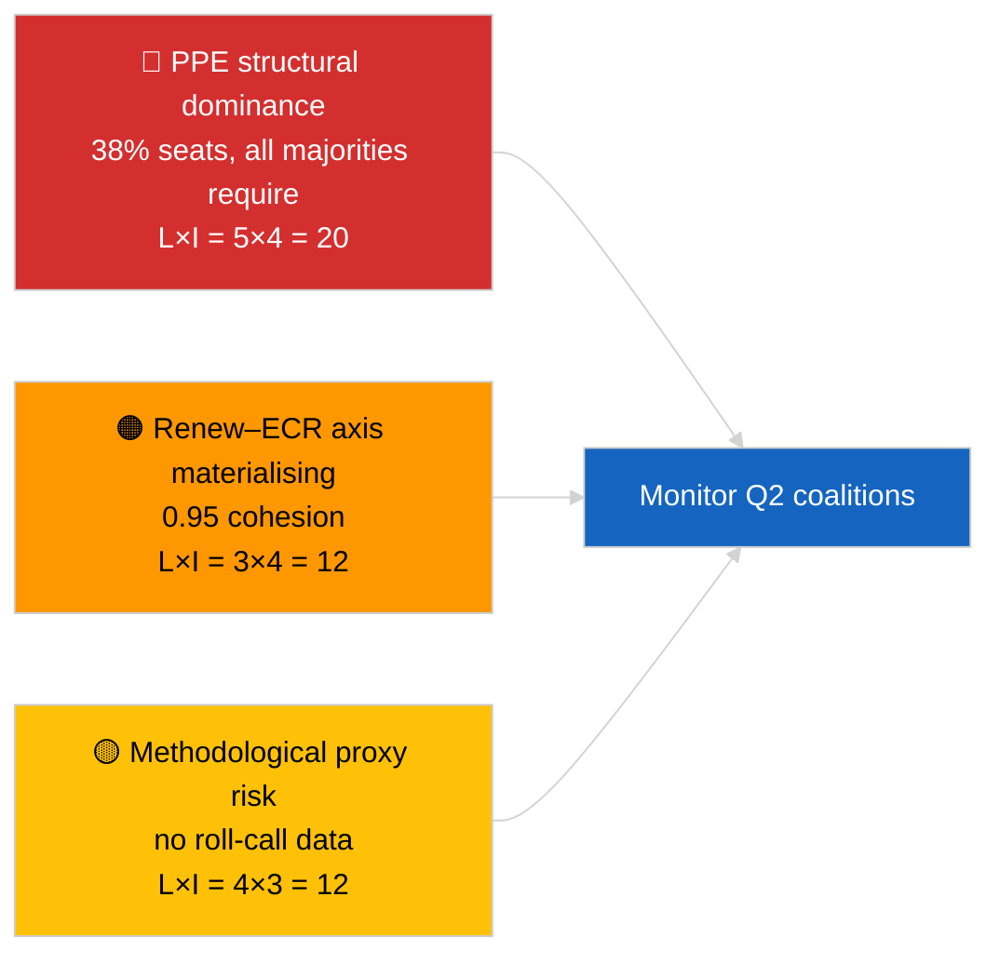

<!-- SPDX-FileCopyrightText: 2026 Hack23 AB -->
<!-- SPDX-License-Identifier: Apache-2.0 -->

# Note de synthèse — Dernières nouvelles (Dynamique des coalitions) | 2026-04-03

**Classification :** OSINT | Registre parlementaire public
**Confiance :** 🟡 Moyen (cohésion par ratio de taille de siège ; pas de données de vote nominatif)
**Généré :** 2026-04-03T00:00:00Z (synthèse rétrospective)
**Type d'article :** Dernières nouvelles — Évaluation de la dynamique des coalitions
**Source :** Portail de données ouvertes du Parlement européen

---

## 🎯 BLUF

**L'arithmétique de coalition d'EP10 révèle un Parlement structurellement asymétrique centré sur le PPE (38 % des sièges échantillonnés) avec un remarquable signal de cohésion Renew–ECR à 0,95.** Toutes les majorités viables (>51 %) requièrent le PPE : Grande coalition (PPE + S&D = 60 %), Super-Grande coalition (PPE + S&D + Renew = 65 %), Alternative centre-droit (PPE + ECR + PfE = 57 %) et Droite large (PPE + ECR + PfE + Renew = 62 %). L'indice de fragmentation d'EP10 a **diminué** à ~4,4 partis effectifs (EP9 ≈ 5,2) — le pouvoir s'est consolidé. La découverte marquante est la **cohésion Renew–ECR à 0,95 (en renforcement)** qui, si elle se traduit par un alignement réel des votes, annoncerait un nouvel axe centrolibéral/conservateur contournant la grande coalition traditionnelle. **🟡 Confiance MOYENNE** — la cohésion est dérivée des ratios de taille de siège, non des preuves de vote ; les scores de pairs PPE sont mathématiquement proches de zéro par artefact du modèle et doivent être décotés.

---

## 🧭 3 Decisions This Brief Supports

| # | Décision | Décideur | Délai | Preuve |
|:-:|---------|---------|:-----:|--------|
| 1 | **Éditorial :** PUBLIER un article sur la dynamique des coalitions avec la réserve explicite « proxy structurel » | Rédacteur | +24h | 28 paires de coalition évaluées ; signal Renew–ECR à 0,95 |
| 2 | **Surveillance :** vérifier la cohésion Renew–ECR par rapport aux données de vote à leur publication (délai de 4 semaines EP API) | Analyste | 2026-05-01 | Publication des registres de vote fin mai |
| 3 | **Veille prospective :** les votes de la plénière d'avril à Strasbourg confirmeront ou infirmeront l'hypothèse de l'axe Renew–ECR | Responsable analyse | 2026-04-30 | Plénière 27–30 avril |

---

## 📰 60-Second Read

- 🔴 **Cohésion Renew–ECR 0,95 (en renforcement)** — signal le plus fort dans la matrice de 28 paires ; potentiel nouvel axe. (🟡 Moyen — proxy structurel)
- 🟠 **Dominance structurelle du PPE (38 %)** signifie que toute majorité viable transite par le PPE ; l'opposition est contrainte de négocier depuis une position structurellement asymétrique. (🟢 Élevé)
- 🟢 **Grande coalition (PPE+S&D = 60 %)** reste la valeur par défaut ; Super-Grande coalition (PPE+S&D+Renew = 65 %) offre un coussin contre les défections. (🟢 Élevé)
- 🟡 **Indice de fragmentation ~4,4 partis effectifs** — *inférieur* à EP9 (~5,2) ; la consolidation favorise la formation de majorité mais concentre le pouvoir. (🟡 Moyen)
- 🔵 **Left–NI 0,65, S&D–ECR 0,60, Renew–Left 0,60** — signaux d'alliance secondaires montrant des alignements anti-establishment/pragmatiques transversaux. (🟡 Moyen)
- 🟣 **Réserve méthodologique :** les scores de paires PPE sont tous à 0,00 dans le modèle de ratio de taille de siège — artefact mathématique, PAS absence de coopération. 🔴 Faible confiance pour les valeurs de paires PPE. (🟢 Élevé)
- 🩷 **Vecteur de perturbation :** la matérialisation de l'axe Renew–ECR pourrait réduire l'influence du S&D sur le PPE dans les dossiers commerciaux et numériques. (🟡 Moyen)
- ⚪ **Suivi :** valider contre les données de vote du prochain cycle lors de la publication des votes de Q1.

---

## 🗂️ Top Findings Table

| Rang | Résultat | Cohésion / Part | Confiance | Statut |
|:----:|---------|:---------------:|:---------:|--------|
| 1 | Signal d'alliance Renew–ECR | 0,95 (en renforcement) | 🟡 MOYEN | Validation de vote en attente |
| 2 | Grande coalition (PPE+S&D) | 60 % | 🟢 ÉLEVÉ | Majorité par défaut |
| 3 | Alternative centre-droit (PPE+ECR+PfE) | 57 % | 🟢 ÉLEVÉ | Le PPE a un choix structurel |
| 4 | Indice de fragmentation | 4,4 partis effectifs | 🟡 MOYEN | En baisse par rapport à ~5,2 (EP9) |

---

## ⚠️ Risk & Threat Snapshot

| Risque | L | I | Score | Déclencheur | Source | Amirauté |
|--------|:-:|:-:|:-----:|-----------|--------|:--------:|
| Dominance structurelle du PPE | 5 | 4 | 20 | Toutes les majorités viables requièrent le PPE | Arithmétique des coalitions | A1 |
| Axe Renew–ECR se matérialisant | 3 | 4 | 12 | Confirmation par vote | Matrice de cohésion | B2 |
| Proxy méthodologique (pas de vote nominatif) | 4 | 3 | 12 | Le modèle de cohésion induit en erreur | Limites API du PE | A2 |
| Fracture de la Grande coalition | 2 | 5 | 10 | Le S&D refuse le compromis PPE | Arithmétique des coalitions | A2 |

---

## 🔮 Top Forward Trigger

**Votes de la plénière de Strasbourg 27–30 avril (publiés ~4 semaines plus tard, ~fin mai).** Validera ou falsifiera le signal de cohésion Renew–ECR. Si l'alignement des votes après publication confirme ≥0,7 de cohésion effective entre Renew et ECR sur les dossiers de niveau 1, escalader l'hypothèse de « nouvel axe » à une confiance ÉLEVÉE et recalibrer le tableau de bord de surveillance des coalitions.

---

## 🛡️ Source Quality Assessment

- **Sources primaires :** EP MCP `analyze_coalition_dynamics`, `generate_political_landscape` ; échantillon de 8 groupes / 28 paires.
- **Limites des données :** Aucune donnée de vote nominatif disponible (le PE publie avec un délai de 4 semaines) ; la cohésion est un proxy structurel de ratio de taille de siège. Les scores de paires PPE dégénèrent par construction du modèle.
- **Confiance pour le signal Renew–ECR :** 🟡 MOYEN.
- **Confiance pour les scores de paires PPE :** 🔴 FAIBLE (artefact du modèle).

---

## 📎 Links

| Lien | Chemin |
|------|--------|
| Article | `./article.md` |
| Sessions sœurs | `analysis/daily/2026-04-03/breaking-2/` (fiabilité API PE), `breaking-3/` (anti-corruption) |
| Manifeste | `./manifest.json` |

---

## 🔄 Cross-Reference

**Précédent :** Première semaine post-récession de mars. L'arithmétique des coalitions référencée dans 2026-04-01/breaking est maintenant formalisée sur 28 paires dans cette session.

**Concomitant :** 2026-04-03/breaking-2 documente les problèmes de fiabilité de l'API PE ; 2026-04-03/breaking-3 couvre le paquet de directives anti-corruption.

---

**Contrôle documentaire**
- **Modèle :** `/analysis/templates/executive-brief.md`
- **Chemin de l'artefact :** `analysis/daily/2026-04-03/breaking/executive-brief.md`
- **Classification :** Public
- **Génération rétrospective :** Session de remplissage rétrospectif.
