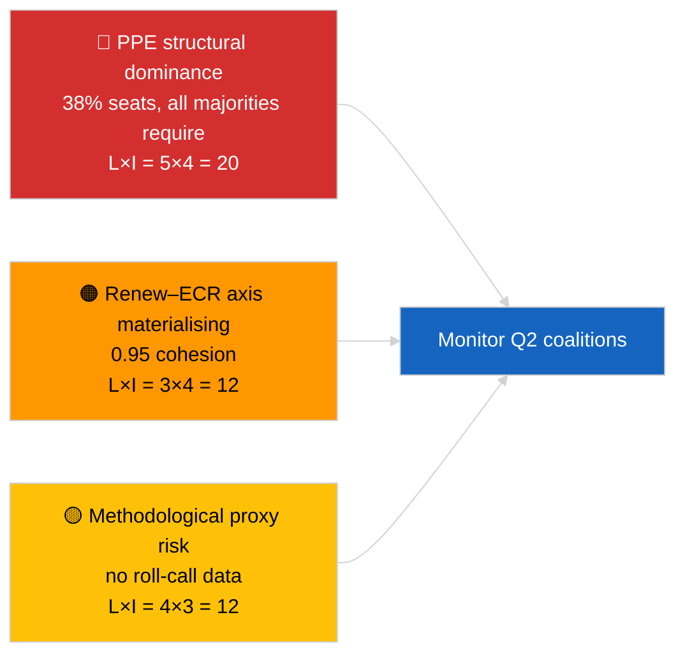

<!-- SPDX-FileCopyrightText: 2026 Hack23 AB -->
<!-- SPDX-License-Identifier: Apache-2.0 -->

# סיכום מנהלים — חדשות שוטפות (דינמיקת קואליציות) | 2026-04-03

**סיווג:** OSINT | מרשם פרלמנטרי ציבורי
**רמת ביטחון:** 🟡 בינוני (לכידות לפי יחס גודל מושבים; ללא נתוני הצבעה נומינלית)
**תאריך יצירה:** 2026-04-03T00:00:00Z (סינתזה רטרואקטיבית)
**סוג המאמר:** חדשות שוטפות — הערכת דינמיקת קואליציות
**מקור:** פורטל הנתונים הפתוחים של הפרלמנט האירופי

---

## 🎯 BLUF

**אריתמטיקת הקואליציה של EP10 חושפת פרלמנט בעל עיוות מבני הממוקד סביב ה-EPP (38% מהמושבים שנדגמו) עם אות לכידות בולט בין Renew ל-ECR בעוצמה של 0.95.** כל הרוב הכשיר (>51%) דורשים את ה-EPP: קואליציה גדולה (EPP + S&D = 60%), קואליציה סופר-גדולה (EPP + S&D + Renew = 65%), חלופה מרכז-ימנית (EPP + ECR + PfE = 57%) וימין מורחב (EPP + ECR + PfE + Renew = 62%). מדד הפיצול של EP10 **ירד** ל-~4.4 מפלגות יעילות (EP9 ≈ 5.2) — הכוח התגבש. הממצא הבולט ביותר הוא **לכידות Renew–ECR בגובה 0.95 (עולה)** שאם תתורגם ליישור הצבעה אמיתי, תבשר על ציר ליברלי-מרכזי/שמרני חדש שיעקוף את הקואליציה הגדולה המסורתית. **🟡 ביטחון בינוני** — הלכידות נגזרת מיחסי גודל מושבים ולא מעדויות הצבעה; ציוני הזוגות של EPP קרובים אפס מתמטית בגלל ארטיפקט של המודל ויש להוריד את ערכם.

---

## 🧭 3 Decisions This Brief Supports

| # | החלטה | מקבל ההחלטה | מועד אחרון | ראיות |
|:-:|-------|------------|:-----------:|------|
| 1 | **עריכה:** לפרסם מאמר על דינמיקת קואליציות עם הסתייגות מפורשת "פרוקסי מבני" | עורך | +24 שעות | 28 זוגות קואליציה הוערכו; אות Renew–ECR 0.95 |
| 2 | **ניטור:** לאמת לכידות Renew–ECR מול נתוני הצבעה עם פרסומם (עיכוב 4 שבועות ב-API של PE) | אנליסט | 2026-05-01 | פרסום מרשמי הצבעה סוף מאי |
| 3 | **מודיעין מוקדם:** הצבעות מליאה באפריל בשטרסבורג יאשרו או יפריכו את השערת ציר Renew–ECR | ראש ניתוח | 2026-04-30 | מליאה 27–30 באפריל |

---

## 📰 60-Second Read

- 🔴 **לכידות Renew–ECR 0.95 (עולה)** — האות החזק ביותר במטריצת 28 הזוגות; ציר פוטנציאלי חדש. (🟡 בינוני)
- 🟠 **דומיננטיות מבנית של EPP (38%)** — כל רוב כשיר עובר דרך ה-EPP; האופוזיציה מחויבת להתמקח ממצב מוטה מבנית. (🟢 גבוה)
- 🟢 **קואליציה גדולה (EPP+S&D = 60%)** נשארת ברירת המחדל; קואליציה סופר-גדולה (EPP+S&D+Renew = 65%) מספקת כרית נגד עריקות. (🟢 גבוה)
- 🟡 **מדד פיצול ~4.4 מפלגות יעילות** — *נמוך* מ-EP9 (~5.2); גיבוש מסייע להשגת רוב אך מרכז כוח. (🟡 בינוני)
- 🔵 **שמאל–NI 0.65, S&D–ECR 0.60, Renew–שמאל 0.60** — אותות ברית משניים המציגים יישורים פרגמטיים חוצי-גבולות אנטי-ממסדיים. (🟡 בינוני)
- 🟣 **הסתייגות מתודולוגית:** ציוני זוגות EPP הם כולם 0.00 במודל יחס גודל מושבים — ארטיפקט מתמטי, לא היעדר שיתוף פעולה. 🔴 ביטחון נמוך לערכי זוגות EPP. (🟢 גבוה)
- 🩷 **וקטור שיבוש:** מימוש ציר Renew–ECR עשוי לצמצם השפעת S&D על EPP בתיקי סחר ודיגיטל. (🟡 בינוני)
- ⚪ **מעקב:** לאמת מול נתוני הצבעה של המחזור הבא עם פרסום הצבעות Q1.

---

## 🗂️ Top Findings Table

| דירוג | ממצא | לכידות / נתח | רמת ביטחון | סטטוס |
|:-----:|------|:------------:|:----------:|-------|
| 1 | אות ברית Renew–ECR | 0.95 (עולה) | 🟡 בינוני | אימות הצבעה ממתין |
| 2 | קואליציה גדולה (EPP+S&D) | 60% | 🟢 גבוה | רוב ברירת מחדל |
| 3 | חלופה מרכז-ימנית (EPP+ECR+PfE) | 57% | 🟢 גבוה | ל-EPP יש בחירה מבנית |
| 4 | מדד פיצול | 4.4 מפלגות יעילות | 🟡 בינוני | יורד מ-~5.2 (EP9) |

---

## ⚠️ Risk & Threat Snapshot

| סיכון | L | I | ציון | גורם מפעיל | מקור | קוד אדמירליות |
|------|:-:|:-:|:----:|-----------|------|:--------------:|
| דומיננטיות מבנית של EPP | 5 | 4 | 20 | כל הרוב הכשיר דורשים EPP | אריתמטיקת קואליציה | A1 |
| ציר Renew–ECR מתגבש | 3 | 4 | 12 | אישור דרך הצבעה | מטריצת לכידות | B2 |
| פרוקסי מתודולוגי (ללא הצבעה נומינלית) | 4 | 3 | 12 | מודל הלכידות מטעה | מגבלות API PE | A2 |
| פיצוץ הקואליציה הגדולה | 2 | 5 | 10 | S&D מסרבים לפשרה עם EPP | אריתמטיקת קואליציה | A2 |

---

## 🔮 Top Forward Trigger

**הצבעות מליאה בשטרסבורג 27–30 באפריל (מתפרסמות כ-4 שבועות לאחר מכן, ~סוף מאי).** יאמתו או יפריכו את אות לכידות Renew–ECR. אם יישור ההצבעה לאחר הפרסום יאשר ≥0.7 לכידות יעילה בין Renew ל-ECR בתיקי רמה 1, לשדרג את השערת "הציר החדש" לביטחון גבוה ולכייל מחדש את לוח הניטור של קואליציות.

---

## 🛡️ Source Quality Assessment

- **מקורות ראשוניים:** EP MCP `analyze_coalition_dynamics`, `generate_political_landscape`; מדגם של 8 קבוצות / 28 זוגות.
- **מגבלות נתונים:** אין נתוני הצבעה נומינלית זמינים (PE מפרסם בעיכוב 4 שבועות); הלכידות היא פרוקסי מבני ליחס גודל מושבים. ציוני זוגות EPP מתדרדרים לפי בנית המודל.
- **ביטחון לאות Renew–ECR:** 🟡 בינוני.
- **ביטחון לציוני זוגות EPP:** 🔴 נמוך (ארטיפקט מודל).

---

## 📎 Links

| קישור | נתיב |
|-------|------|
| מאמר | `./article.md` |
| סשנים אחיים | `analysis/daily/2026-04-03/breaking-2/` (אמינות API PE), `breaking-3/` (אנטי-שחיתות) |
| מניפסט | `./manifest.json` |

---

## 🔄 Cross-Reference

**קדם:** השבוע הראשון לאחר המיתון של מרץ. אריתמטיקת הקואליציה שהוזכרה ב-2026-04-01/breaking מפורמלת כעת על 28 זוגות בסשן זה.

**בו-זמנית:** 2026-04-03/breaking-2 מתעד בעיות אמינות API של PE; 2026-04-03/breaking-3 מכסה חבילת הנחיות אנטי-שחיתות.

---

**בקרת מסמך**
- **תבנית:** `/analysis/templates/executive-brief.md`
- **נתיב ארטיפקט:** `analysis/daily/2026-04-03/breaking/executive-brief.md`
- **סיווג:** ציבורי
- **יצירה רטרואקטיבית:** סשן מילוי רטרואקטיבי.
