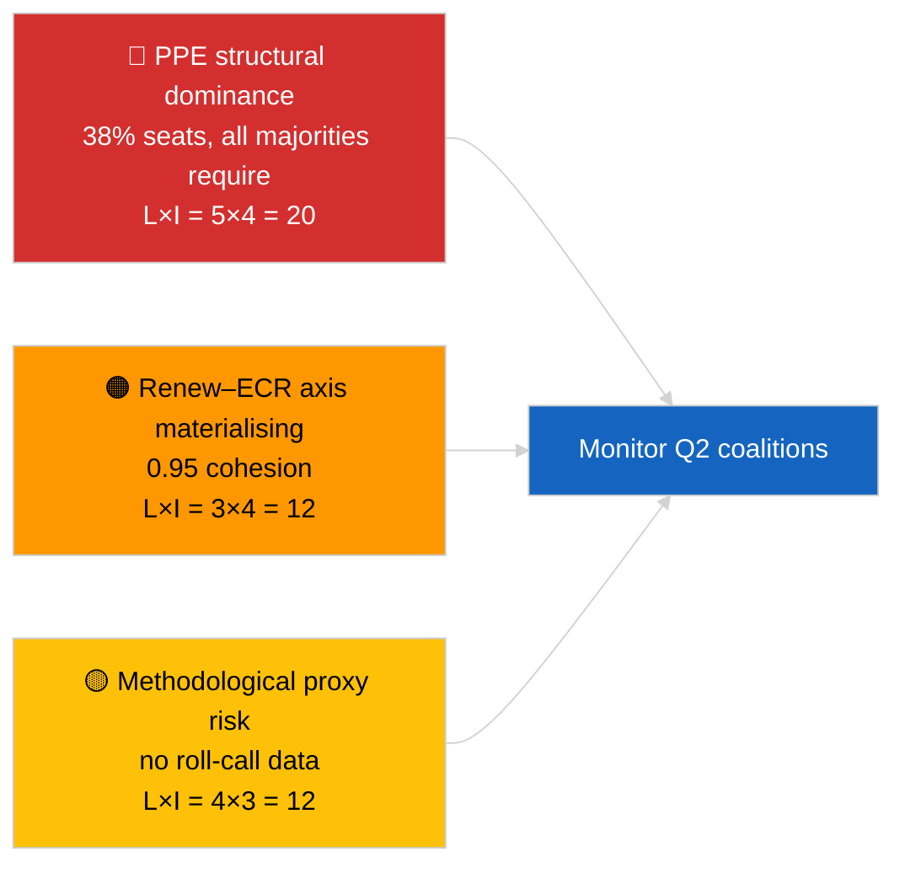

<!-- SPDX-FileCopyrightText: 2026 Hack23 AB -->
<!-- SPDX-License-Identifier: Apache-2.0 -->

# エグゼクティブ・ブリーフ — 速報ニュース（連合の力学） | 2026-04-03

**分類:** OSINT | 公開議会記録
**信頼度:** 🟡 中程度（議席規模比率による結束度；名簿式投票データなし）
**作成日時:** 2026-04-03T00:00:00Z（遡及的総合）
**記事種別:** 速報ニュース — 連合力学評価
**出典:** 欧州議会オープンデータポータル

---

## 🎯 BLUF

**EP10の連合算術は、サンプリング議席の38%を占めるEPP中心の構造的非対称議会を明らかにし、Renew–ECR間に顕著な結束シグナル0.95を示す。** 実行可能なすべての過半数（>51%）にはEPPが必要：大連合（EPP + S&D = 60%）、超大連合（EPP + S&D + Renew = 65%）、中道右派代替（EPP + ECR + PfE = 57%）、広範な右派（EPP + ECR + PfE + Renew = 62%）。EP10の断片化指数は実効政党数**約4.4まで低下**（EP9 ≈ 5.2）— 権力は集中した。最も注目すべき発見は**Renew–ECR結束度0.95（上昇傾向）**であり、実際の投票整合に転換されれば、伝統的な大連合を迂回する新たな中道自由主義・保守主義の枢軸を告知するものとなる。**🟡 信頼度中程度** — 結束度は議席規模比率から導出されており、投票証拠ではない；EPPペアスコアはモデルのアーティファクトにより数学的にゼロに近く、割り引く必要がある。

---

## 🧭 3 Decisions This Brief Supports

| # | 決定事項 | 意思決定者 | 期限 | 根拠 |
|:-:|---------|----------|:----:|------|
| 1 | **編集:** 「構造的プロキシ」という明示的な留保を付けて連合力学記事を**掲載** | 編集者 | +24時間 | 28連合ペア評価済；Renew–ECRシグナル0.95 |
| 2 | **監視:** 公開時（EP API 4週間遅延）に投票データに対してRenew–ECR結束度を検証 | アナリスト | 2026-05-01 | 5月末に投票記録公開予定 |
| 3 | **先読み情報:** 4月ストラスブール本会議票決がRenew–ECR枢軸仮説を確認または否定 | 分析責任者 | 2026-04-30 | 4月27〜30日本会議 |

---

## 📰 60-Second Read

- 🔴 **Renew–ECR結束度0.95（上昇傾向）** — 28ペア行列で最強シグナル；潜在的な新枢軸。（🟡 中程度）
- 🟠 **EPPの構造的優位（38%）** — 実行可能なすべての過半数はEPPを経由；野党は構造的に非対称な立場から交渉を余儀なくされる。（🟢 高）
- 🟢 **大連合（EPP+S&D = 60%）** はデフォルト；超大連合（EPP+S&D+Renew = 65%）は離反に対する緩衝を提供。（🟢 高）
- 🟡 **断片化指数 約4.4実効政党** — EP9（〜5.2）より*低い*；集中化は多数派形成を促進するが権力を集中させる。（🟡 中程度）
- 🔵 **左派–NI 0.65、S&D–ECR 0.60、Renew–左派 0.60** — 反体制・実用主義的な横断的整合を示す二次的な同盟シグナル。（🟡 中程度）
- 🟣 **方法論的留保:** EPPペアスコアはすべて議席規模比率モデルで0.00 — 数学的アーティファクト、協力の欠如ではない。EPPペア値の信頼度🔴低。（🟢 高）
- 🩷 **混乱ベクトル:** Renew–ECR枢軸の実現化により、貿易・デジタル分野でのEPPへのS&D影響力が低下しうる。（🟡 中程度）
- ⚪ **フォローアップ:** Q1票決公開時に次サイクルの投票データで検証。

---

## 🗂️ Top Findings Table

| 順位 | 発見 | 結束度 / 割合 | 信頼度 | 状況 |
|:---:|------|:-----------:|:------:|------|
| 1 | Renew–ECR同盟シグナル | 0.95（上昇） | 🟡 中程度 | 投票検証待ち |
| 2 | 大連合（EPP+S&D） | 60% | 🟢 高 | デフォルト多数派 |
| 3 | 中道右派代替（EPP+ECR+PfE） | 57% | 🟢 高 | EPPは構造的選択肢を持つ |
| 4 | 断片化指数 | 4.4実効政党 | 🟡 中程度 | EP9の〜5.2から低下 |

---

## ⚠️ Risk & Threat Snapshot

| リスク | L | I | スコア | トリガー | 出典 | アドミラルティコード |
|--------|:-:|:-:|:-----:|---------|------|:------------------:|
| EPPの構造的優位 | 5 | 4 | 20 | 実行可能な全過半数がEPPを必要 | 連合算術 | A1 |
| Renew–ECR枢軸の具体化 | 3 | 4 | 12 | 投票による確認 | 結束度行列 | B2 |
| 方法論的プロキシ（名簿式投票なし） | 4 | 3 | 12 | 結束度モデルが誤解を招く | EP API制限 | A2 |
| 大連合の亀裂 | 2 | 5 | 10 | S&DがEPPの妥協を拒否 | 連合算術 | A2 |

---

## 🔮 Top Forward Trigger

**ストラスブール本会議票決4月27〜30日（約4週間後〜5月末頃公開）。** Renew–ECR結束度シグナルを検証または反証する。公開後の投票整合が第1階ファイルでRenewとECR間の実効結束度≥0.7を確認した場合、「新枢軸」仮説を高信頼度に格上げし、連合監視ダッシュボードを再較正する。

---

## 🛡️ Source Quality Assessment

- **一次資料:** EP MCP `analyze_coalition_dynamics`、`generate_political_landscape`；8グループ/28ペアのサンプル。
- **データ制限:** 名簿式投票データなし（EUPは4週間遅延で公開）；結束度は議席規模比率の構造的プロキシ。EPPペアスコアはモデル構造上劣化する。
- **Renew–ECRシグナルの信頼度:** 🟡 中程度。
- **EPPペアスコアの信頼度:** 🔴 低（モデルアーティファクト）。

---

## 📎 Links

| リンク | パス |
|--------|------|
| 記事 | `./article.md` |
| 姉妹セッション | `analysis/daily/2026-04-03/breaking-2/`（EP API信頼性）、`breaking-3/`（腐敗防止） |
| マニフェスト | `./manifest.json` |

---

## 🔄 Cross-Reference

**先行:** 3月景気後退後の最初の週。2026-04-01/breakingで参照された連合算術は、本セッションで28ペアに正式化された。

**同時進行:** 2026-04-03/breaking-2がEP API信頼性問題を記録；2026-04-03/breaking-3が腐敗防止指令パッケージをカバー。

---

**文書管理**
- **テンプレート:** `/analysis/templates/executive-brief.md`
- **アーティファクトパス:** `analysis/daily/2026-04-03/breaking/executive-brief.md`
- **分類:** 公開
- **遡及生成:** 遡及的補充セッション。
