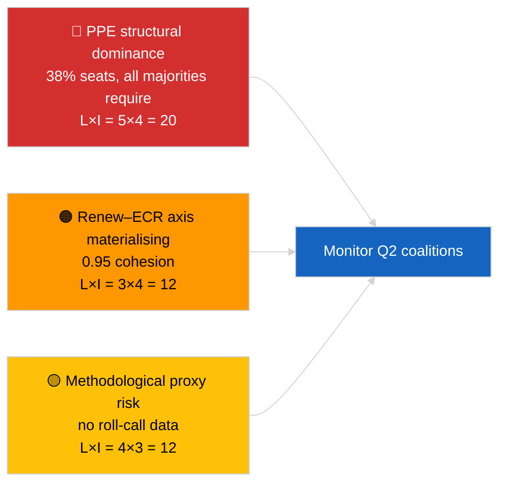

<!-- SPDX-FileCopyrightText: 2026 Hack23 AB -->
<!-- SPDX-License-Identifier: Apache-2.0 -->

# 집행 브리핑 — 속보 뉴스 (연합 역학) | 2026-04-03

**분류:** OSINT | 공개 의회 기록
**신뢰도:** 🟡 보통 (의석 규모 비율 기반 결속도; 명단 투표 데이터 없음)
**생성일시:** 2026-04-03T00:00:00Z (소급 합성)
**기사 유형:** 속보 뉴스 — 연합 역학 평가
**출처:** 유럽의회 오픈 데이터 포털

---

## 🎯 BLUF

**EP10의 연합 산술은 표본 의석의 38%를 차지하는 EPP 중심의 구조적 비대칭 의회를 드러내며, Renew–ECR 간 두드러진 결속 신호 0.95를 보인다.** 실행 가능한 모든 다수결(>51%)은 EPP를 필요로 한다: 대연합(EPP + S&D = 60%), 초대연합(EPP + S&D + Renew = 65%), 중도우파 대안(EPP + ECR + PfE = 57%), 광범위 우파(EPP + ECR + PfE + Renew = 62%). EP10의 분열 지수는 실효 정당 수 **~4.4로 하락**했다(EP9 ≈ 5.2) — 권력이 집중되었다. 가장 두드러진 발견은 **Renew–ECR 결속도 0.95(상승 추세)**로, 실제 투표 정렬로 이어질 경우 전통적인 대연합을 우회하는 새로운 중도자유주의·보수 축을 예고한다. **🟡 신뢰도 보통** — 결속도는 의석 규모 비율에서 도출되었으며 투표 증거가 아님; EPP 쌍 점수는 모델 아티팩트로 인해 수학적으로 0에 가까워 할인이 필요하다.

---

## 🧭 3 Decisions This Brief Supports

| # | 결정 사항 | 의사결정자 | 기한 | 근거 |
|:-:|---------|----------|:----:|------|
| 1 | **편집:** "구조적 프록시"라는 명시적 유보 조건과 함께 연합 역학 기사 **게재** | 편집장 | +24시간 | 28개 연합 쌍 평가 완료; Renew–ECR 신호 0.95 |
| 2 | **모니터링:** 공개 시(EP API 4주 지연) 투표 데이터 대비 Renew–ECR 결속도 검증 | 분석가 | 2026-05-01 | 5월 말 투표 기록 공개 예정 |
| 3 | **선행 정보:** 4월 스트라스부르 본회의 투표가 Renew–ECR 축 가설을 확인하거나 반증 | 분석 책임자 | 2026-04-30 | 4월 27~30일 본회의 |

---

## 📰 60-Second Read

- 🔴 **Renew–ECR 결속도 0.95(상승)** — 28쌍 행렬에서 가장 강한 신호; 잠재적 새 축. (🟡 보통)
- 🟠 **EPP의 구조적 지배(38%)** — 실행 가능한 모든 다수결은 EPP를 경유; 야권은 구조적으로 비대칭적 위치에서 협상하도록 강제된다. (🟢 높음)
- 🟢 **대연합(EPP+S&D = 60%)** 이 기본값으로 유지; 초대연합(EPP+S&D+Renew = 65%)은 이탈에 대한 완충을 제공. (🟢 높음)
- 🟡 **분열 지수 ~4.4 실효 정당** — EP9(~5.2)보다 *낮음*; 통합은 다수결 형성을 촉진하지만 권력을 집중시킨다. (🟡 보통)
- 🔵 **좌파–NI 0.65, S&D–ECR 0.60, Renew–좌파 0.60** — 반기득권·실용주의 횡단 정렬을 보여주는 이차적 동맹 신호. (🟡 보통)
- 🟣 **방법론적 유보:** EPP 쌍 점수는 의석 규모 비율 모델에서 모두 0.00 — 수학적 아티팩트, 협력 부재가 아님. EPP 쌍 값 신뢰도 🔴 낮음. (🟢 높음)
- 🩷 **파괴 벡터:** Renew–ECR 축 실현화로 무역·디지털 분야에서 S&D의 EPP 영향력이 감소할 수 있음. (🟡 보통)
- ⚪ **후속 조치:** Q1 투표 공개 시 다음 주기 투표 데이터로 검증.

---

## 🗂️ Top Findings Table

| 순위 | 발견 | 결속도 / 지분 | 신뢰도 | 상태 |
|:---:|------|:-----------:|:------:|------|
| 1 | Renew–ECR 동맹 신호 | 0.95 (상승) | 🟡 보통 | 투표 검증 대기 중 |
| 2 | 대연합(EPP+S&D) | 60% | 🟢 높음 | 기본 다수결 |
| 3 | 중도우파 대안(EPP+ECR+PfE) | 57% | 🟢 높음 | EPP에 구조적 선택지 있음 |
| 4 | 분열 지수 | 4.4 실효 정당 | 🟡 보통 | EP9의 ~5.2에서 하락 |

---

## ⚠️ Risk & Threat Snapshot

| 위험 | L | I | 점수 | 트리거 | 출처 | 해군 코드 |
|-----|:-:|:-:|:---:|-------|------|:--------:|
| EPP 구조적 지배 | 5 | 4 | 20 | 실행 가능한 모든 다수결은 EPP 필요 | 연합 산술 | A1 |
| Renew–ECR 축 구체화 | 3 | 4 | 12 | 투표를 통한 확인 | 결속도 행렬 | B2 |
| 방법론적 프록시(명단 투표 없음) | 4 | 3 | 12 | 결속도 모델이 오해를 유발 | EP API 제한 | A2 |
| 대연합 균열 | 2 | 5 | 10 | S&D가 EPP 타협 거부 | 연합 산술 | A2 |

---

## 🔮 Top Forward Trigger

**스트라스부르 본회의 투표 4월 27~30일(약 4주 후 ~5월 말 공개).** Renew–ECR 결속도 신호를 검증하거나 반증할 것이다. 공개 후 투표 정렬이 1차 파일에서 Renew와 ECR 간 ≥0.7의 실효 결속도를 확인하면, "새로운 축" 가설을 높은 신뢰도로 격상하고 연합 모니터링 대시보드를 재보정한다.

---

## 🛡️ Source Quality Assessment

- **1차 출처:** EP MCP `analyze_coalition_dynamics`, `generate_political_landscape`; 8개 그룹/28쌍 표본.
- **데이터 제한:** 명단 투표 데이터 없음(EP는 4주 지연 공개); 결속도는 의석 규모 비율의 구조적 프록시. EPP 쌍 점수는 모델 구조상 저하된다.
- **Renew–ECR 신호 신뢰도:** 🟡 보통.
- **EPP 쌍 점수 신뢰도:** 🔴 낮음(모델 아티팩트).

---

## 📎 Links

| 링크 | 경로 |
|------|------|
| 기사 | `./article.md` |
| 자매 세션 | `analysis/daily/2026-04-03/breaking-2/`(EP API 신뢰성), `breaking-3/`(반부패) |
| 매니페스트 | `./manifest.json` |

---

## 🔄 Cross-Reference

**선행:** 3월 경기침체 후 첫 번째 주. 2026-04-01/breaking에서 참조된 연합 산술이 이 세션에서 28쌍으로 공식화되었다.

**동시 진행:** 2026-04-03/breaking-2가 EP API 신뢰성 문제를 기록; 2026-04-03/breaking-3이 반부패 지침 패키지를 다룬다.

---

**문서 관리**
- **템플릿:** `/analysis/templates/executive-brief.md`
- **아티팩트 경로:** `analysis/daily/2026-04-03/breaking/executive-brief.md`
- **분류:** 공개
- **소급 생성:** 소급 보완 세션.
