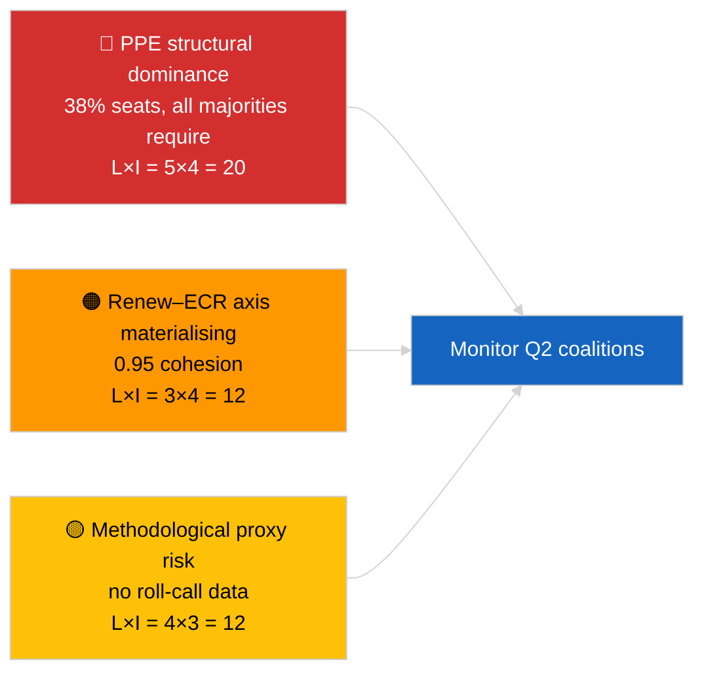

<!-- SPDX-FileCopyrightText: 2026 Hack23 AB -->
<!-- SPDX-License-Identifier: Apache-2.0 -->

# Uitvoerende Briefing — Laatste Nieuws (Coalitiedynamiek) | 2026-04-03

**Classificatie:** OSINT | Openbaar parlementair register
**Betrouwbaarheid:** 🟡 Gemiddeld (cohesie via zetelgrootteratio; geen hoofdelijke stemdata)
**Gegenereerd:** 2026-04-03T00:00:00Z (retrospectieve synthese)
**Artikeltype:** Laatste nieuws — Evaluatie coalitiedynamiek
**Bron:** Europees Parlement Open Data Portal

---

## 🎯 BLUF

**De coalitie-arithmetiek van EP10 onthult een structureel asymmetrisch Parlement dat gecentreerd is op de EVP (38 % van de bemonsterde zetels) met een opmerkelijk Renew–ECR-cohesiesignaal van 0,95.** Alle levensvatbare meerderheden (>51 %) vereisen de EVP: Grote coalitie (EVP + S&D = 60 %), Super-grote coalitie (EVP + S&D + Renew = 65 %), Centrumrechts alternatief (EVP + ECR + PfE = 57 %) en Brede rechts (EVP + ECR + PfE + Renew = 62 %). De fragmentatie-index van EP10 is **gedaald** naar ~4,4 effectieve partijen (EP9 ≈ 5,2) — macht is geconsolideerd. De meest opvallende bevinding is de **Renew–ECR-cohesie van 0,95 (stijgend)** die, als ze vertaald wordt naar daadwerkelijke stemafstemming, een nieuwe centroliberale/conservatieve as zou aankondigen die de traditionele grote coalitie omzeilt. **🟡 Gemiddeld vertrouwen** — cohesie is afgeleid van zetelgrootteratios, niet van stembewijzen; EVP-paarscores zijn wiskundig dicht bij nul door modelartefact en moeten worden gedisconteerd.

---

## 🧭 3 Decisions This Brief Supports

| # | Beslissing | Beslisser | Deadline | Bewijs |
|:-:|-----------|---------|:--------:|--------|
| 1 | **Redactioneel:** PUBLICEER artikel over coalitiedynamiek met expliciete vermelding «structurele proxy» | Redacteur | +24u | 28 coaliteparen beoordeeld; Renew–ECR-signaal 0,95 |
| 2 | **Monitoring:** verifieer Renew–ECR-cohesie aan de hand van stemdata bij publicatie (4 weken EP API-vertraging) | Analist | 2026-05-01 | Publicatie stemregisters eind mei |
| 3 | **Vooruitblikkende inlichtingen:** plenaire stemmen Straatsburg april bevestigen of weerleggen de Renew–ECR-ashypothese | Hoofd analyse | 2026-04-30 | Plenaire vergadering 27–30 april |

---

## 📰 60-Second Read

- 🔴 **Renew–ECR-cohesie 0,95 (stijgend)** — sterkste signaal in de 28-parenmatrix; potentiële nieuwe as. (🟡 Gemiddeld)
- 🟠 **Structurele dominantie van de EVP (38 %)** betekent dat elke levensvatbare meerderheid via de EVP loopt; de oppositie is gedwongen te onderhandelen vanuit een structureel asymmetrische positie. (🟢 Hoog)
- 🟢 **Grote coalitie (EVP+S&D = 60 %)** blijft de standaard; Super-grote coalitie (EVP+S&D+Renew = 65 %) biedt buffer tegen afhakers. (🟢 Hoog)
- 🟡 **Fragmentatie-index ~4,4 effectieve partijen** — *lager* dan EP9 (~5,2); consolidatie bevordert meerderheidvorming maar concentreert macht. (🟡 Gemiddeld)
- 🔵 **Links–NI 0,65, S&D–ECR 0,60, Renew–Links 0,60** — secundaire alliantiesignalen die dwarsverbanden tonen met anti-establishment/pragmatische afstemming. (🟡 Gemiddeld)
- 🟣 **Methodologische kanttekening:** EVP-paarscores zijn allemaal 0,00 in het zetelgrootteratiomodel — wiskundig artefact, GEEN afwezigheid van samenwerking. 🔴 Laag vertrouwen voor EVP-paarswaarden. (🟢 Hoog)
- 🩷 **Verstoringsector:** materialisatie van de Renew–ECR-as kan de invloed van de S&D op de EVP bij handel- en digitale dossiers verminderen. (🟡 Gemiddeld)
- ⚪ **Follow-up:** valideer aan de hand van stemdata van de volgende cyclus bij publicatie van Q1-stemmen.

---

## 🗂️ Top Findings Table

| Rang | Bevinding | Cohesie / Aandeel | Vertrouwen | Status |
|:----:|---------|:-----------------:|:----------:|--------|
| 1 | Renew–ECR-alliantiesignaal | 0,95 (stijgend) | 🟡 GEMIDDELD | Stemvalidatie in behandeling |
| 2 | Grote coalitie (EVP+S&D) | 60 % | 🟢 HOOG | Standaardmeerderheid |
| 3 | Centrumrechts alternatief (EVP+ECR+PfE) | 57 % | 🟢 HOOG | EVP heeft structurele keuze |
| 4 | Fragmentatie-index | 4,4 effectieve partijen | 🟡 GEMIDDELD | Dalend van ~5,2 (EP9) |

---

## ⚠️ Risk & Threat Snapshot

| Risico | L | I | Score | Trigger | Bron | Admiraliteitscode |
|--------|:-:|:-:|:-----:|---------|------|:-----------------:|
| Structurele dominantie EVP | 5 | 4 | 20 | Alle levensvatbare meerderheden vereisen EVP | Coalitie-arithmetiek | A1 |
| Renew–ECR-as materialiseert | 3 | 4 | 12 | Bevestiging via stemming | Cohesiematrix | B2 |
| Methodologische proxy (geen hoofdelijk stemmen) | 4 | 3 | 12 | Cohesiemodel misleidt | API-beperkingen EP | A2 |
| Breuk grote coalitie | 2 | 5 | 10 | S&D weigert EVP-compromis | Coalitie-arithmetiek | A2 |

---

## 🔮 Top Forward Trigger

**Plenaire stemmen Straatsburg 27–30 april (gepubliceerd ~4 weken later, ~eind mei).** Zal het Renew–ECR-cohesiesignaal valideren of falsificeren. Als stemafstemming na publicatie ≥0,7 effectieve cohesie bevestigt tussen Renew en ECR op niveau-1-dossiers, de «nieuwe as»-hypothese opschalen naar HOOG vertrouwen en het coalitietoezichtdashboard herijken.

---

## 🛡️ Source Quality Assessment

- **Primaire bronnen:** EP MCP `analyze_coalition_dynamics`, `generate_political_landscape`; steekproef van 8 groepen / 28 paren.
- **Databeperkingen:** Geen hoofdelijke stemdata beschikbaar (EP publiceert met 4 weken vertraging); cohesie is een structurele proxy via zetelgrootteratio. EVP-paarscores degenereren door modelconstructie.
- **Vertrouwen voor Renew–ECR-signaal:** 🟡 GEMIDDELD.
- **Vertrouwen voor EVP-paarscores:** 🔴 LAAG (modelartefact).

---

## 📎 Links

| Link | Pad |
|------|-----|
| Artikel | `./article.md` |
| Zusterzittingen | `analysis/daily/2026-04-03/breaking-2/` (EP API-betrouwbaarheid), `breaking-3/` (anticorruptie) |
| Manifest | `./manifest.json` |

---

## 🔄 Cross-Reference

**Voorafgaand:** Eerste week na de recessie van maart. De coalitie-arithmetiek waarnaar wordt verwezen in 2026-04-01/breaking is nu geformaliseerd in 28 paren in deze sessie.

**Gelijktijdig:** 2026-04-03/breaking-2 documenteert EP API-betrouwbaarheidsproblemen; 2026-04-03/breaking-3 behandelt het anticorruptie-richtlijnenpakket.

---

**Documentbeheer**
- **Sjabloon:** `/analysis/templates/executive-brief.md`
- **Artefactpad:** `analysis/daily/2026-04-03/breaking/executive-brief.md`
- **Classificatie:** Openbaar
- **Retroactieve generatie:** Retroactieve opvulsessie.
