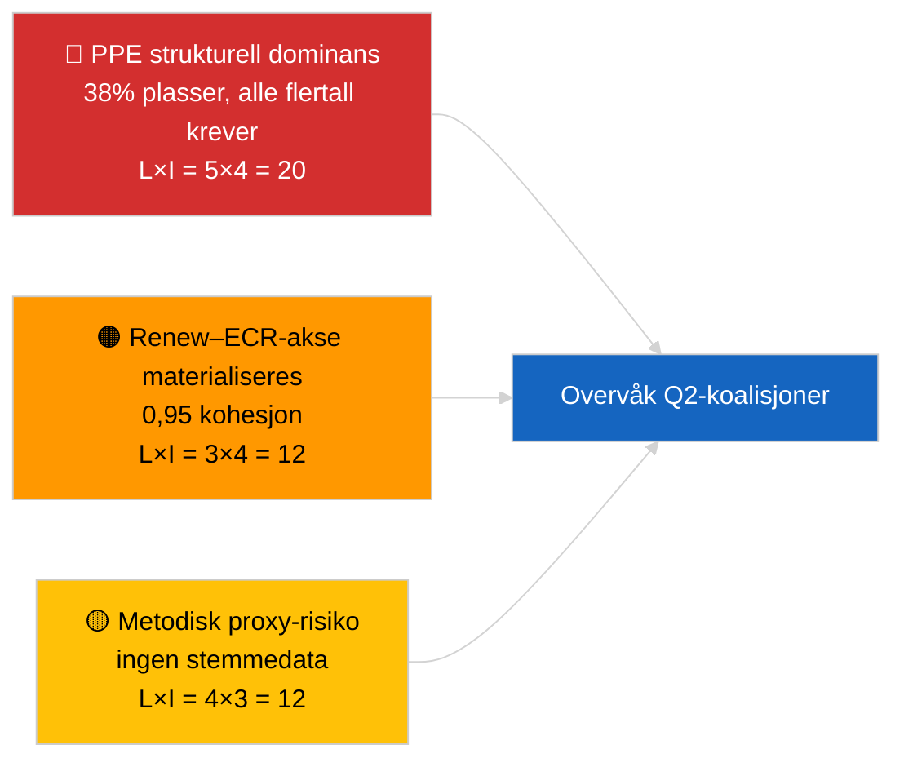

<!-- SPDX-FileCopyrightText: 2026 Hack23 AB -->
<!-- SPDX-License-Identifier: Apache-2.0 -->

# Analytisk Ledersammenfattning — Nytt (Koalisjonsynamikk) | 2026-04-03

**Klassifisering:** OSINT | Offentlig parlamentarisk registrering
**Konfidensnivå:** 🟡 Middels (strukturelle seteandelskoalisjoner; ingen stemmedata)
**Generert:** 2026-04-03T00:00:00Z (retrospektiv sammenfatning)
**Artikkeltype:** Nytt — Koalisjonsdynamisk vurdering
**Kilde:** Europaparlamentets åpne dataportal

---

## 🎯 BLUF

**EP10s koalisjonsaritmetikk viser et strukturelt asymmetrisk parlament sentrert rundt PPE (38 % av samplete plasser) med et bemerkelsesverdig Renew–ECR-kohesjonssignal på 0,95.** Alle gjennomførbareflertall (>51 %) krever PPE: Stor koalisjon (PPE + S&D = 60 %), Super-Stor (PPE + S&D + Renew = 65 %), Sentrum-Høyre alt. (PPE + ECR + PfE = 57 %) og Bred Høyre (PPE + ECR + PfE + Renew = 62 %). EP10s fragmenteringsindeks har **falt** til ~4,4 effektive partier (EP9 ≈ 5,2) — makten har konsolidert seg. Det fremtredende funnet er **Renew–ECR-kohesjon på 0,95 (styrkende)** som, om det omsettes til stemmejustin­ering når data publiseres, ville varsle en ny senterliberal/konservativ akse som omgår den tradisjonelle store koalisjonen. **🟡 MEDIUM konfidensnivå** — kohesjon er utledet fra seteandelsforhold, ikke stemmebevis; PPE-parpoeng er matematisk null av modellartefakt og bør diskonteres.

---

## 🧭 3 Beslutninger denne sammenfatningen støtter

| # | Beslutning | Hvem bestemmer | Frist | Dokumentasjon |
|:-:|-----------|---------------|:----:|--------------|
| 1 | **Redaksjonelt:** PUBLISER koalisjonsdynamikkartikkel med eksplisitt «strukturell proxy»-forbehold | Redaktør | +24t | 28 koalisjonspar evaluert; 0,95 Renew–ECR-signal |
| 2 | **Overvåkning:** Verifiser Renew–ECR-kohesjon mot stemmedata når disse publiseres (4 ukers EP API-forsinkelse) | Analytiker | 2026-05-01 | Sent mai stemmeopptegnelse |
| 3 | **Fremoverblikk:** April Strasbourg plenumsstemmer bekrefter eller falsifiserer Renew–ECR-aksehypotesen | Analyseleder | 2026-04-30 | Plenumuke 27–30 april |

---

## 📰 60-sekunders lesning

- 🔴 **Renew–ECR-kohesjon 0,95 (styrkende)** — sterkeste signal i 28-par-matrisen; potensiell ny akse. (🟡 Middels — strukturell proxy)
- 🟠 **PPEs strukturelle dominans (38 %)** betyr at hvert gjennomførbart flertall passerer gjennom PPE; opposisjonen tvinges til å forhandle fra en permanent asymmetrisk posisjon. (🟢 Høy)
- 🟢 **Stor koalisjon (PPE+S&D = 60 %)** forblir standard; Super-Stor (PPE+S&D+Renew = 65 %) gir buffer mot frafall. (🟢 Høy)
- 🟡 **Fragmenteringsindeks ~4,4 effektive partier** — *lavere* enn EP9 (~5,2); konsolidering fremmer flertallsdannelse, men konsentrerer makten. (🟡 Middels)
- 🔵 **Venstre–NI 0,65, S&D–ECR 0,60, Renew–Venstre 0,60** — sekundære alliansesignaler viser anti-establishment/pragmatisk tverrgående justering. (🟡 Middels)
- 🟣 **Metodisk forbehold:** PPE-parpoeng alle 0,00 i størrelses­kvot­modellen — matematisk artefakt, IKKE fravær av samarbeid. 🔴 Lavt konfidensnivå for PPE-parverdier. (🟢 Høy)
- 🩷 **Forstyrrelsesfaktor:** Hvis Renew–ECR-aksen materialiseres, kan S&Ds innflytelse over PPE i handels- og digitalfiler reduseres. (🟡 Middels)
- ⚪ **Fremoverføring:** Valider mot neste syklus' stemmedata når Q1-stemmer publiseres.

---

## 🗂️ Toppfunnstabell

| Rang | Funn | Kohesjon / Andel | Konfidensnivå | Status |
|:---:|------|:----------------:|:------------:|--------|
| 1 | Renew–ECR alliansesignal | 0,95 (styrkende) | 🟡 MIDDELS | Venter på stemmevalidering |
| 2 | Stor koalisjon (PPE+S&D) | 60 % | 🟢 HØY | Standardflertall |
| 3 | Sentrum-Høyre-alternativ (PPE+ECR+PfE) | 57 % | 🟢 HØY | PPE har strukturelt valg |
| 4 | Fragmenteringsindeks | 4,4 effektive partier | 🟡 MIDDELS | Ned fra ~5,2 (EP9) |

---

## ⚠️ Risiko- og trusselsoversikt

| Risiko | S | I | Poeng | Utløser | Kilde | Admiralty |
|--------|:-:|:-:|:-----:|---------|-------|:---------:|
| PPE strukturell dominans | 5 | 4 | 20 | Alle gjennomførbareflertall krever PPE | Koalisjonsaritmetikk | A1 |
| Renew–ECR-akse materialiseres | 3 | 4 | 12 | Stemmebekreftelse | Kohesjonsmartis | B2 |
| Metodisk proxy (ingen stemmer) | 4 | 3 | 12 | Kohesjonsmodelavviker | EP API-begrensninger | A2 |
| Stor koalisjon sprekker | 2 | 5 | 10 | S&D nekter PPE-kompromiss | Koalisjonsaritmetikk | A2 |

---

## 🔮 Viktigste fremtidsutløser

**April 27–30 Strasbourg plenumsstemmer (publiseres ~4 uker senere, ~slutten av mai).** Bekrefter eller falsifiserer Renew–ECR-kohesjons­signalet. Hvis stemmedata etter publisering bekrefter ≥0,7 faktisk kohesjon mellom Renew og ECR i tier-1-filer, eskaler «ny akse»-hypotesen til HØY konfidensnivå og nullstill koalisjonsovervåkningstavlen.

---

## 🛡️ Kildekvalitetsvurdering

- **Primære kilder:** EP MCP `analyze_coalition_dynamics`, `generate_political_landscape`; samplet 8 grupper / 28 par.
- **Databegrensninger:** Ingen stemmedata tilgjengelige (EP publiserer med 4 ukers forsinkelse); kohesjon er strukturell seteandelsroxy. PPE-parpoeng degenererer av modellkonstruksjon.
- **Konfidensnivå for Renew–ECR-signal:** 🟡 MIDDELS.
- **Konfidensnivå for PPE-parpoeng:** 🔴 LAV (modellartefakt).

---

## 📎 Lenker

| Lenke | Sti |
|-------|-----|
| Artikkel | `./article.md` |
| Søsken­kjøringer | `analysis/daily/2026-04-03/breaking-2/` (EP API-pålitelighet), `breaking-3/` (antikorrupsjon) |
| Manifest | `./manifest.json` |

---

## 🔄 Kryssreferanse

**Tidligere:** Første uke etter mars-reses. Koalisjonsaritmetikk referert i 2026-04-01/breaking er nå formalisert over 28 par i denne kjøringen.

**Samtidige:** 2026-04-03/breaking-2 dokumenterer EP API-pålitelighetsproblemer; 2026-04-03/breaking-3 dekker antikorrupsjonsdirektiv­pakken.

---

**Dokumentkontroll**
- **Mal:** `/analysis/templates/executive-brief.md`
- **Artefaktsti:** `analysis/daily/2026-04-03/breaking/executive-brief.md`
- **Klassifisering:** Offentlig
- **Retrospektiv generering:** Backfill-økt.
