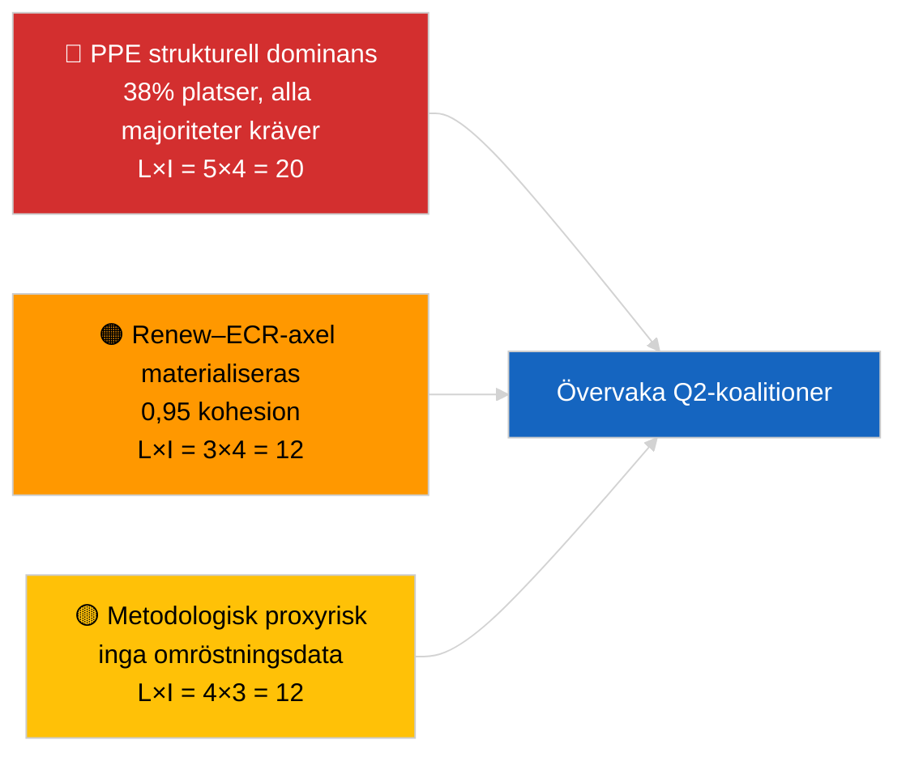

<!-- SPDX-FileCopyrightText: 2026 Hack23 AB -->
<!-- SPDX-License-Identifier: Apache-2.0 -->

# Analytisk Exekutiv Sammanfattning — Genombrott (Koalitionsdynamik) | 2026-04-03

**Klassificering:** OSINT | Offentligt parlamentariskt register
**Konfidensgrad:** 🟡 Medel (strukturella sätesandelskoalitioner; inga omröstningsdata)
**Genererad:** 2026-04-03T00:00:00Z (retroaktiv sammanfattning)
**Artikeltyp:** Genombrott — Koalitionsdynamisk bedömning
**Källa:** Europeiska parlamentets öppna dataportal

---

## 🎯 BLUF

**EP10:s koalitionsaritmetik visar ett strukturellt asymmetriskt parlament centrerat kring PPE (38 % av samplade platser) med en anmärkningsvärd Renew–ECR-kohalionssignal på 0,95.** Alla genomförbara majoriteter (>51 %) kräver PPE: Stor koalition (PPE + S&D = 60 %), Super-Stor koalition (PPE + S&D + Renew = 65 %), Centern-högeralt. (PPE + ECR + PfE = 57 %) och Bred höger (PPE + ECR + PfE + Renew = 62 %). EP10:s fragmenteringsindex har **sjunkit** till ~4,4 effektiva partier (EP9 ≈ 5,2) — makten har konsoliderats. Det mest framträdande fyndet är **Renew–ECR-kohesion på 0,95 (stärkande)** som, om det omsätts i omröstningsstöd när röstningsdata publiceras, skulle signalera en ny center-liberal/konservativ axel som kringgår den traditionella stora koalitionen. **🟡 MEDIUM konfidensgrad** — kohesion härleds från sätesstorlekar, inte omröstningsbevis; PPE-parpoäng är matematiskt noll av modellartefakt och måste diskonteras.

---

## 🧭 3 Beslut som denna sammanfattning stöder

| # | Beslut | Vem beslutar | Tidsfrist | Underlag |
|:-:|--------|-------------|:--------:|---------|
| 1 | **Redaktionellt:** PUBLICERA koalitionsdynamikartikel med explicit "strukturell proxy"-förbehåll | Redaktör | +24h | 28 koalitionspar utvärderade; 0,95 Renew–ECR-signal |
| 2 | **Bevakning:** Verifiera Renew–ECR-kohesion mot omröstningsdata när dessa publiceras (4 veckors EP API-fördröjning) | Analytiker | 2026-05-01 | Omröstningsrekord sent i maj |
| 3 | **Framåtblick:** April Strasbourgs plenum-omröstningar bekräftar eller falsifierar Renew–ECR-axelns hypotes | Analysansvarig | 2026-04-30 | Plenumvecka 27–30 april |

---

## 📰 60-sekunders läsning

- 🔴 **Renew–ECR-kohesion 0,95 (stärkande)** — starkaste signalen i 28-pars matrisen; potentiell ny axel. (🟡 Medel — strukturell proxy)
- 🟠 **PPE:s strukturella dominans (38 %)** innebär att varje genomförbar majoritet passerar PPE; oppositionen tvingas förhandla från en permanent asymmetrisk position. (🟢 Hög)
- 🟢 **Stor koalition (PPE+S&D = 60 %)** förblir standard; Super-Stor (PPE+S&D+Renew = 65 %) ger buffert mot avhopp. (🟢 Hög)
- 🟡 **Fragmenteringsindex ~4,4 effektiva partier** — *lägre* än EP9 (~5,2); konsolidering gynnar majoritetsbildning men koncentrerar makten. (🟡 Medel)
- 🔵 **Vänster–NI 0,65, S&D–ECR 0,60, Renew–Vänster 0,60** — sekundära alliansignaler visar anti-etablissemang/pragmatisk tvärgående anpassning. (🟡 Medel)
- 🟣 **Metodologiskt förbehåll:** PPE-parpoäng alla 0,00 i storlekskvotmodellen — matematisk artefakt, INTE avsaknad av samarbete. 🔴 Låg konfidensgrad för PPE-parvärden. (🟢 Hög)
- 🩷 **Störningsfaktor:** Om Renew–ECR-axeln materialiseras kan S&D:s inflytande över PPE i handels- och digitalfiler minska. (🟡 Medel)
- ⚪ **Framåtöverföring:** Validera mot nästa cykelns omröstningsdata när Q1-röster publiceras.

---

## 🗂️ Topprankade fynd

| Rang | Fynd | Kohesion / Andel | Konfidensgrad | Status |
|:---:|------|:----------------:|:------------:|--------|
| 1 | Renew–ECR alliansignal | 0,95 (stärkande) | 🟡 MEDEL | Inväntar omröstningsvalidering |
| 2 | Stor koalition (PPE+S&D) | 60 % | 🟢 HÖG | Standardmajoritet |
| 3 | Centern-högeralternativ (PPE+ECR+PfE) | 57 % | 🟢 HÖG | PPE har strukturellt val |
| 4 | Fragmenteringsindex | 4,4 effektiva partier | 🟡 MEDEL | Ned från ~5,2 (EP9) |

---

## ⚠️ Risk- och hotögonblicksbild

| Risk | S | I | Poäng | Utlösare | Källa | Admiralty |
|------|:-:|:-:|:-----:|---------|-------|:---------:|
| PPE strukturell dominans | 5 | 4 | 20 | Alla genomförbara majoriteter kräver PPE | Koalitionsaritmetik | A1 |
| Renew–ECR-axel materialiseras | 3 | 4 | 12 | Omröstningsbekräftelse | Kohesionsmatris | B2 |
| Metodologisk proxy (inga omröstningar) | 4 | 3 | 12 | Kohesionsmodellen vilseleder | EP API-begränsningar | A2 |
| Stor koalition fractures | 2 | 5 | 10 | S&D vägrar PPE-kompromiss | Koalitionsaritmetik | A2 |

---

## 🔮 Viktigaste framåtutlösaren

**April 27–30 Strasbourg plenum-omröstningar (publiceras ~4 veckor senare, ~slutet av maj).** Bekräftar eller falsifierar Renew–ECR-kohesionssignalen. Om omröstningsdata efter publicering bekräftar ≥0,7 faktisk kohesion mellan Renew och ECR i tier-1-filer, eskalera "ny axel"-hypotesen till HÖG konfidensgrad och återbaslinera koalitionsövervakningstavlan.

---

## 🛡️ Källkvalitetsbedömning

- **Primära källor:** EP MCP `analyze_coalition_dynamics`, `generate_political_landscape`; samplade 8 grupper / 28 par.
- **Databegränsningar:** Inga omröstningsdata tillgängliga (EP publicerar med 4 veckors fördröjning); kohesion är strukturell sätesandelsroxy. PPE-parpoäng degenererar av modellkonstruktion.
- **Konfidensgrad för Renew–ECR-signal:** 🟡 MEDEL.
- **Konfidensgrad för PPE-parpoäng:** 🔴 LÅG (modellartefakt).

---

## 📎 Länkar

| Länk | Sökväg |
|------|--------|
| Artikel | `./article.md` |
| Syskonkörningar | `analysis/daily/2026-04-03/breaking-2/` (EP API-tillförlitlighet), `breaking-3/` (antikorruption) |
| Manifest | `./manifest.json` |

---

## 🔄 Korshänvisning

**Tidigare:** Första veckan efter mars-recessionen. Koalitionsaritmetik refererad i 2026-04-01/breaking är nu formaliserad över 28 par i denna körning.

**Samtida:** 2026-04-03/breaking-2 dokumenterar EP API-tillförlitlighetsproblem; 2026-04-03/breaking-3 täcker antikorruptionsdirektivpaketet.

---

**Dokumentkontroll**
- **Mall:** `/analysis/templates/executive-brief.md`
- **Artefaktsökväg:** `analysis/daily/2026-04-03/breaking/executive-brief.md`
- **Klassificering:** Offentlig
- **Retroaktiv generering:** Backfill-session.
