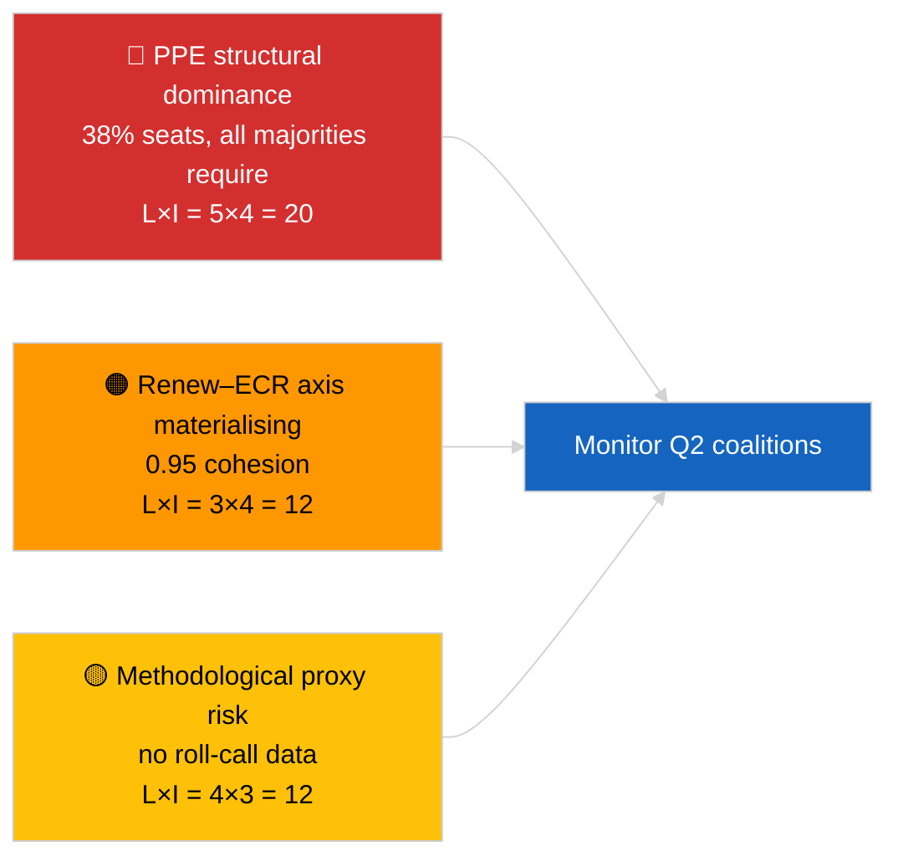

<!-- SPDX-FileCopyrightText: 2026 Hack23 AB -->
<!-- SPDX-License-Identifier: Apache-2.0 -->

# 执行简报 — 突发新闻（联合动态） | 2026-04-03

**分类：** OSINT | 公开议会记录
**可信度：** 🟡 中等（基于席位规模比率的凝聚力；无点名投票数据）
**生成时间：** 2026-04-03T00:00:00Z（溯源综合）
**文章类型：** 突发新闻 — 联合动态评估
**来源：** 欧洲议会开放数据门户

---

## 🎯 BLUF

**EP10联合算术揭示了一个以欧洲人民党（EPP）为中心的结构性不对称议会（占样本席位38%），Renew–ECR之间呈现显著结盟信号0.95。** 所有可行多数（>51%）均需要EPP：大联合（EPP + S&D = 60%）、超大联合（EPP + S&D + Renew = 65%）、中右翼替代方案（EPP + ECR + PfE = 57%）以及广泛右翼（EPP + ECR + PfE + Renew = 62%）。EP10碎片化指数已**降至**约4.4个有效政党（EP9 ≈ 5.2）——权力得到巩固。最引人注目的发现是**Renew–ECR凝聚力0.95（上升趋势）**，若转化为实际投票一致性，将预示一个绕过传统大联合的新中道自由主义/保守主义轴心出现。**🟡 中等可信度** — 凝聚力源自席位规模比率，而非投票证据；EPP配对分数因模型工件在数学上接近零，需予以折扣。

---

## 🧭 3 Decisions This Brief Supports

| # | 决定事项 | 决策者 | 截止期限 | 证据 |
|:-:|---------|-------|:-------:|------|
| 1 | **编辑：** 以明确"结构代理"声明**发布**联合动态文章 | 编辑 | +24小时 | 28对联合评估完成；Renew–ECR信号0.95 |
| 2 | **监测：** 公开时（欧洲议会API 4周延迟）根据投票数据验证Renew–ECR凝聚力 | 分析师 | 2026-05-01 | 五月底投票记录公开 |
| 3 | **预判情报：** 4月斯特拉斯堡全会投票将确认或否定Renew–ECR轴心假设 | 分析负责人 | 2026-04-30 | 4月27日至30日全会 |

---

## 📰 60-Second Read

- 🔴 **Renew–ECR凝聚力0.95（上升）** — 28对矩阵中最强信号；潜在新轴心。（🟡 中等）
- 🟠 **EPP结构性主导（38%）** — 所有可行多数均须经过EPP；反对派被迫从结构性不对称位置谈判。（🟢 高）
- 🟢 **大联合（EPP+S&D = 60%）** 仍是默认选项；超大联合（EPP+S&D+Renew = 65%）提供缓冲以防背叛。（🟢 高）
- 🟡 **碎片化指数约4.4有效政党** — *低于* EP9（约5.2）；整合有利于多数形成但集中权力。（🟡 中等）
- 🔵 **左翼–NI 0.65，S&D–ECR 0.60，Renew–左翼 0.60** — 显示反建制/务实横向联合的次级盟约信号。（🟡 中等）
- 🟣 **方法论警告：** EPP配对分数在席位规模比率模型中均为0.00 — 数学工件，并非缺乏合作。EPP配对值可信度🔴低。（🟢 高）
- 🩷 **颠覆向量：** Renew–ECR轴心实现可能削减S&D在贸易和数字议题上对EPP的影响力。（🟡 中等）
- ⚪ **后续：** 第一季度投票公开时，对照下一周期投票数据验证。

---

## 🗂️ Top Findings Table

| 排名 | 发现 | 凝聚力 / 占比 | 可信度 | 状态 |
|:---:|------|:-----------:|:------:|------|
| 1 | Renew–ECR联盟信号 | 0.95（上升） | 🟡 中等 | 投票验证待定 |
| 2 | 大联合（EPP+S&D） | 60% | 🟢 高 | 默认多数 |
| 3 | 中右翼替代方案（EPP+ECR+PfE） | 57% | 🟢 高 | EPP拥有结构性选择 |
| 4 | 碎片化指数 | 4.4有效政党 | 🟡 中等 | 从EP9约5.2下降 |

---

## ⚠️ Risk & Threat Snapshot

| 风险 | L | I | 评分 | 触发因素 | 来源 | 海军评级 |
|-----|:-:|:-:|:---:|---------|------|:-------:|
| EPP结构性主导 | 5 | 4 | 20 | 所有可行多数均需要EPP | 联合算术 | A1 |
| Renew–ECR轴心具体化 | 3 | 4 | 12 | 通过投票确认 | 凝聚力矩阵 | B2 |
| 方法论代理（无点名投票） | 4 | 3 | 12 | 凝聚力模型产生误导 | 欧洲议会API限制 | A2 |
| 大联合破裂 | 2 | 5 | 10 | S&D拒绝向EPP妥协 | 联合算术 | A2 |

---

## 🔮 Top Forward Trigger

**斯特拉斯堡全会投票4月27日至30日（约4周后公开，约5月底）。** 将验证或证伪Renew–ECR凝聚力信号。如果公开后的投票一致性在第一级议题上确认Renew与ECR之间有效凝聚力≥0.7，则将"新轴心"假设升级为高可信度并重新校准联合监测仪表板。

---

## 🛡️ Source Quality Assessment

- **主要来源：** EP MCP `analyze_coalition_dynamics`、`generate_political_landscape`；8个集团/28对样本。
- **数据局限：** 无点名投票数据（欧洲议会发布延迟4周）；凝聚力是席位规模比率的结构代理。EPP配对分数因模型结构而退化。
- **Renew–ECR信号可信度：** 🟡 中等。
- **EPP配对分数可信度：** 🔴 低（模型工件）。

---

## 📎 Links

| 链接 | 路径 |
|------|------|
| 文章 | `./article.md` |
| 姊妹会话 | `analysis/daily/2026-04-03/breaking-2/`（欧洲议会API可靠性），`breaking-3/`（反腐败） |
| 清单 | `./manifest.json` |

---

## 🔄 Cross-Reference

**前置：** 三月衰退后第一周。2026-04-01/breaking中参考的联合算术现在在本次会话中被正式化为28对。

**同步：** 2026-04-03/breaking-2记录欧洲议会API可靠性问题；2026-04-03/breaking-3涵盖反腐败指令包。

---

**文档控制**
- **模板：** `/analysis/templates/executive-brief.md`
- **制品路径：** `analysis/daily/2026-04-03/breaking/executive-brief.md`
- **分类：** 公开
- **溯源生成：** 溯源补充会话。
