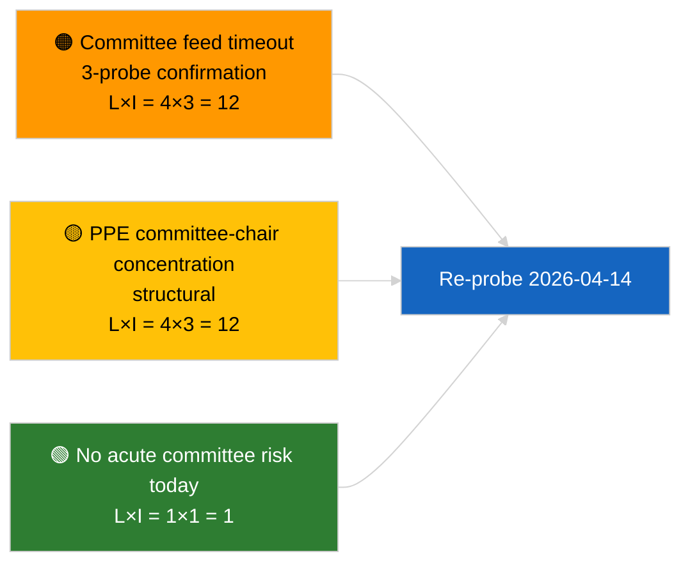
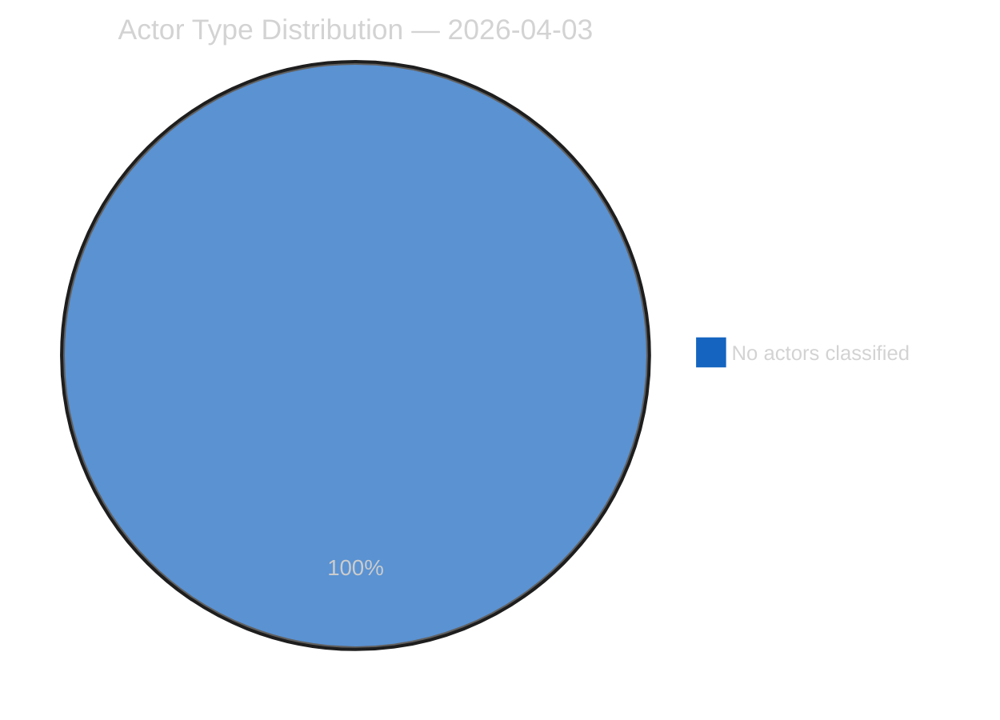
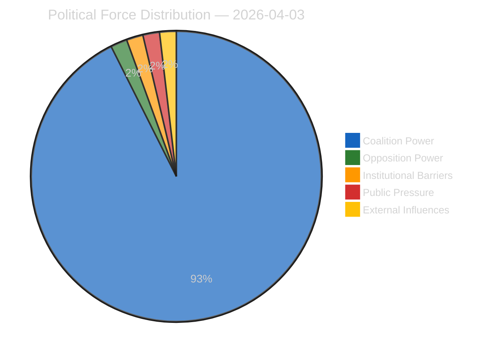
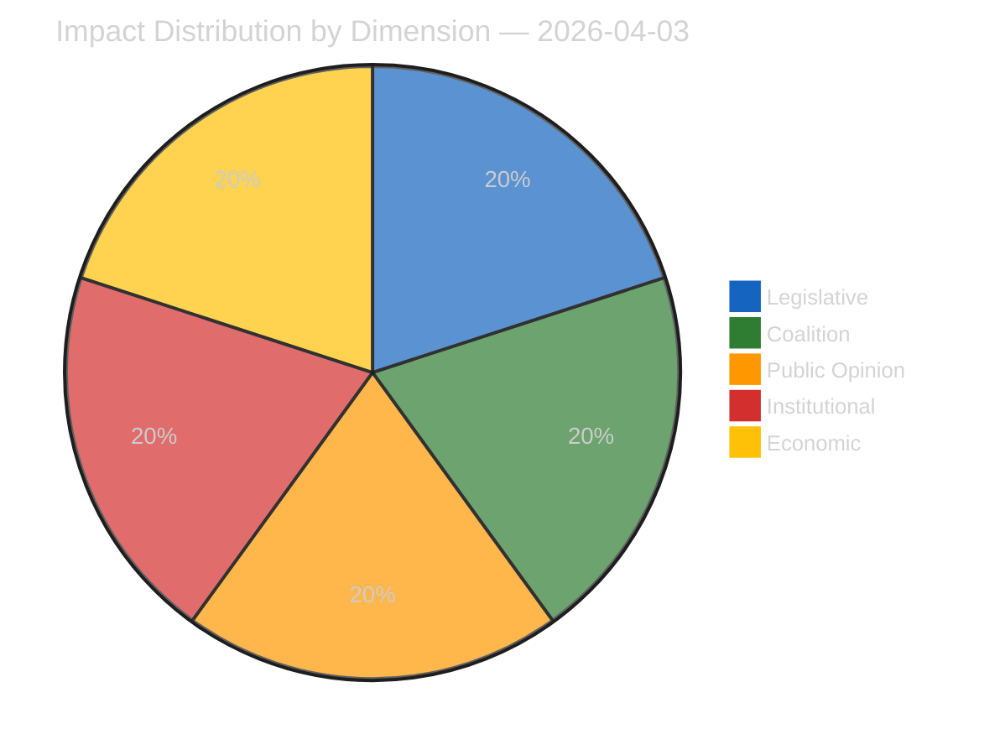
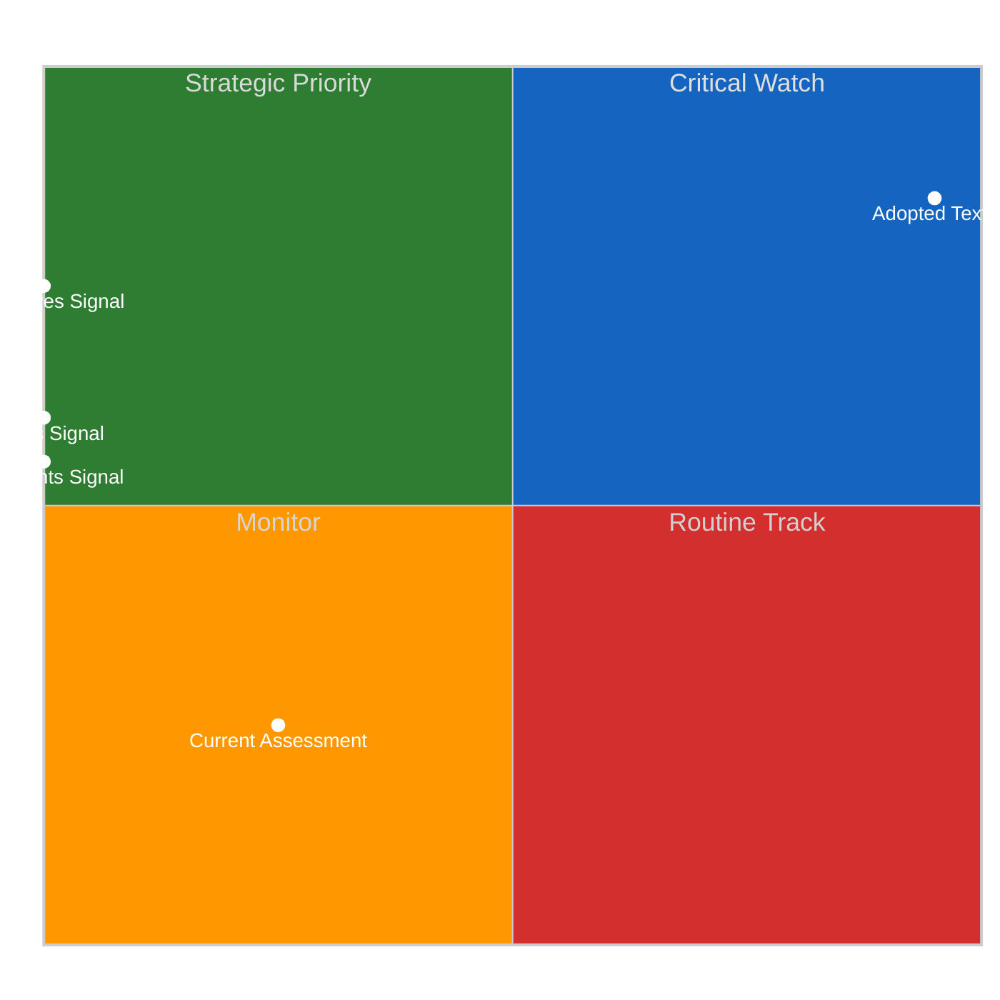
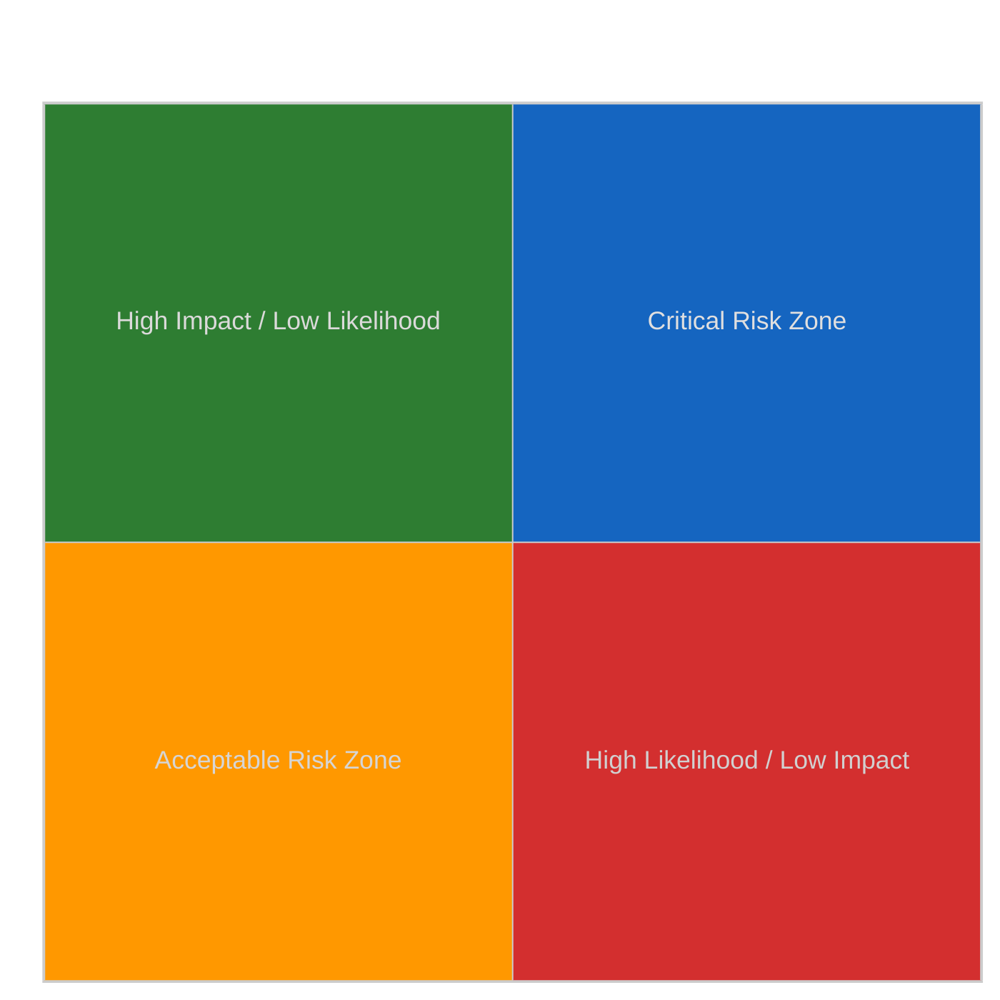
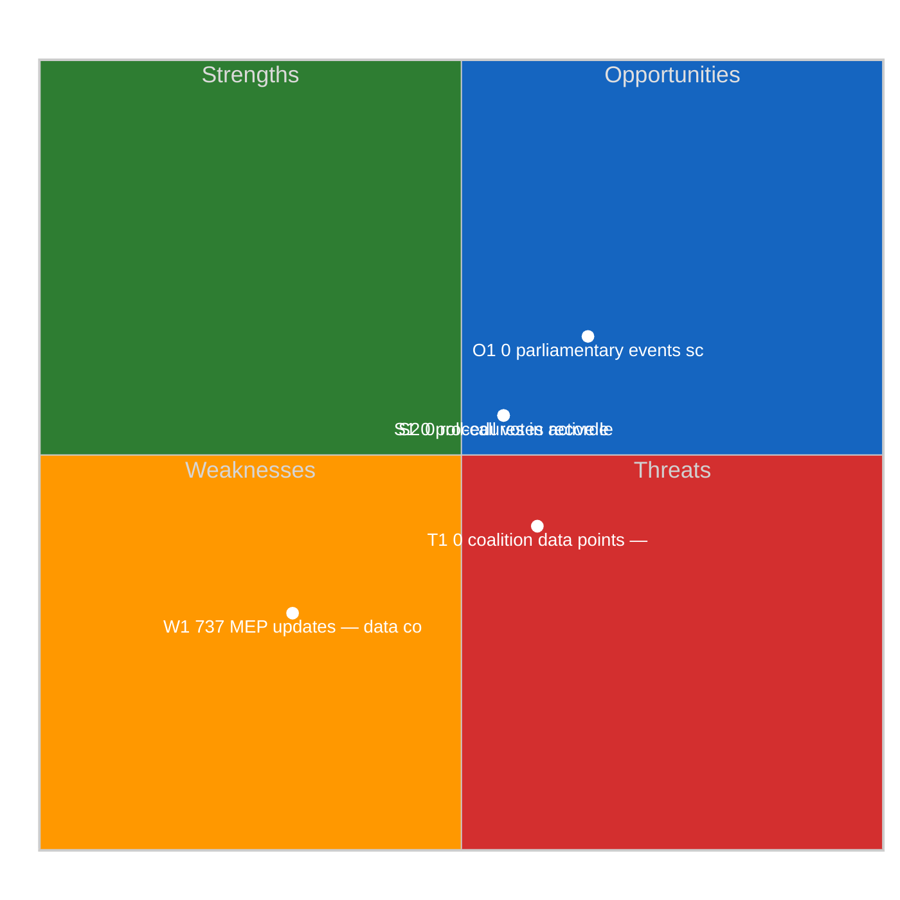
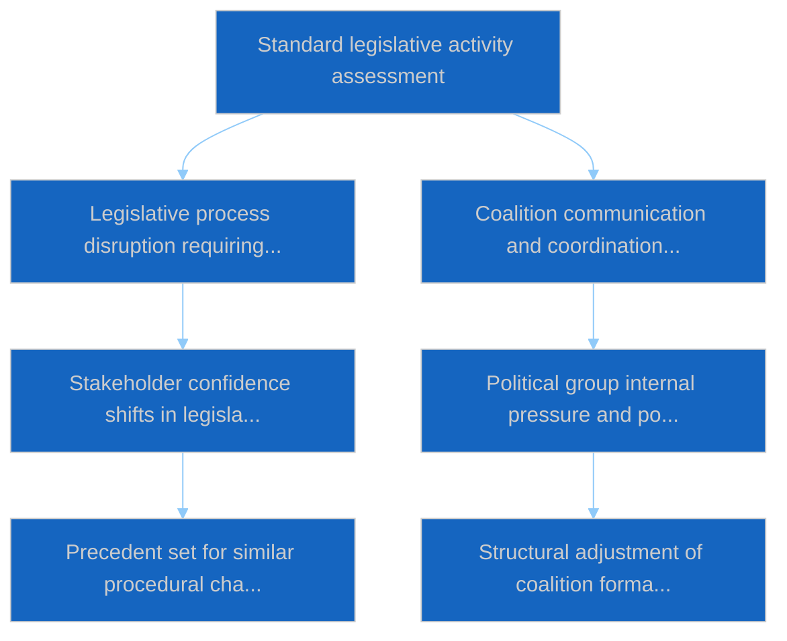

# Committee Reports — 2026-04-03

<h2 id="section-executive-brief">Executive Brief</h2>

### 🎯 BLUF

**No committee documents indexed on 2026-04-03; the EP feed API is in confirmed DEGRADED state (see sibling `breaking-2` formal assessment).** Run `5568290b-7656-4c6e-ae61-b57740690541` returned **"Quantitative risk scoring across 0 identified political dimensions"** — zero classified actors, ROUTINE significance. `get_committee_documents_feed` is among the failed endpoints (timeout across all 3 daily probes). The substantive committee baseline therefore remains the carry-over identified in 2026-04-03/breaking-3's anti-corruption-reform cluster (ECON ECB Vice-President, TRAN/ENVI HDV emissions, JURI anti-corruption + Braun, INTA US tariff, AFET Georgia). **🟢 HIGH confidence** today's empty state is feed-degradation-driven on top of recess-week absence.

---

### 🧭 3 Decisions This Brief Supports

| # | Decision | Who Decides | Deadline | Evidence |
|:-:|----------|-------------|:--------:|----------|
| 1 | **Editorial:** SKIP committee-reports daily | Editor | +24h | Empty run + confirmed DEGRADED feeds |
| 2 | **Monitoring:** include in 2026-04-14 post-recess restoration probe | Data pipeline | 2026-04-14 | First post-Easter weekday |
| 3 | **Forward-watch:** committee work-week 13-17 April for first substantive Q2 committee reports | Analysis lead | 2026-04-13 | Pre-plenary cycle |

---

### 📰 60-Second Read

- 🔴 **No committee documents** today; `get_committee_documents_feed` timeout across 3 probes. (🟢 High)
- 🟠 **0 actors classified**; ROUTINE significance. (🟢 High)
- 🟢 **March-into-Q2 committee inventory** anchors the watch list (anti-corruption JURI, HDV TRAN/ENVI, ECB ECON, US tariff INTA, Georgia AFET). (🟢 High)
- 🟡 **Risk dimensions all "none"** today. (🟢 High)
- 🔵 **Economic context:** anti-corruption directive transposition is the dominant Q2 institutional-economic signal. (🟡 Medium)
- 🟣 **Cross-reference:** sibling `breaking-2` formalises the DEGRADED API state; `breaking-3` synthesises the reform cluster. (🟢 High)
- 🩷 **Disruption vector:** persistent committee-feed timeout could block Q2 pre-plenary intelligence. (🟡 Medium)
- ⚪ **Carry-forward:** validate restoration on 2026-04-14.

---

### 🗂️ Top Documents / Procedures Table

| Rank | EP reference | Title (short) | Significance | Confidence | Status |
|:----:|--------------|---------------|:------------:|:----------:|--------|
| 1 | — | No committee reports on 2026-04-03 | 0.0 | 🟢 HIGH | Recess + DEGRADED feeds |
| 2 | TA-10-2026-0094 | JURI — Anti-corruption directive (carry-over) | 9.0 | 🟢 HIGH | Adopted 26 March; transposition watch |
| 3 | TA-10-2026-0060 | ECON — ECB Vice-President (carry-over) | 7.5 | 🟢 HIGH | Q2 baseline |

---

### ⚠️ Risk & Threat Snapshot

| Risk | L | I | Score | Trigger | Source | Admiralty |
|------|:-:|:-:|:-----:|---------|--------|:---------:|
| Committee-feed reliability (DEGRADED) | 4 | 3 | 12 | Sustained timeout past 14 April | Sibling `breaking-2` | A1 |
| PPE committee-chair concentration | 4 | 3 | 12 | Q2 rapporteur appointments | Structural | A2 |
| Anti-corruption transposition friction | 3 | 4 | 12 | National non-compliance | TA-10-2026-0094 | A1 |

---

### 🔮 Top Forward Trigger

**Committee work-week 13-17 April 2026.** First substantive Q2 committee cycle; committee-feed restoration is operationally critical to pre-plenary intelligence in this window.

---

### 🛡️ Source Quality Assessment

- **Primary sources:** Run `5568290b-7656-4c6e-ae61-b57740690541`; sibling `breaking-2` formal EP API probe.
- **Data limitations:** `get_committee_documents_feed` timeout — independent corroboration unavailable today.
- **Confidence:** 🟢 HIGH on calendar + DEGRADED feed driver; 🟡 MEDIUM on absence-of-activity claim.

---

### 📎 Links

| Link | Path |
|------|------|
| Article | `./article.md` |
| Sibling runs | `analysis/daily/2026-04-03/breaking/`, `breaking-2/`, `breaking-3/`, `motions/`, `propositions/`, `week-ahead/` |
| Manifest | `./manifest.json` |

---

**Document Control**
- **Template:** `/analysis/templates/executive-brief.md`
- **Artifact path:** `analysis/daily/2026-04-03/committee-reports/executive-brief.md`
- **Classification:** Public
- **Retrospective generation:** Back-fill session.

<h2 id="reader-intelligence-guide">Reader Intelligence Guide</h2>

Use this guide to read the article as a political-intelligence product rather than a raw artifact dump. High-value reader lenses appear first; technical provenance remains available in the audit appendices.

| Reader need | What you'll get | Source artifact |
|---|---|---|
| [BLUF and editorial decisions](#section-executive-brief) | fast answer to what happened, why it matters, who is accountable, and the next dated trigger | `executive-brief.md` |
| [Actors and forces](#section-actors-forces) | who is driving the story, what political forces line up behind them, and which institutional levers they can pull | `classification/actor-mapping.md` |
| [Coalitions and voting](#section-coalitions-voting) | political group alignment, voting evidence, and coalition pressure points | `existing/voting-patterns.md` |
| [Risk assessment](#section-risk) | policy, institutional, coalition, communications, and implementation risk register | `risk-scoring/risk-matrix.md` |
| [Threat landscape](#section-threat) | hostile actors, attack vectors, consequence trees, and legislative-disruption pathways | `threat-assessment/actor-threat-profiles.md` |
| [Cross-run continuity](#section-continuity) | what changed since prior sessions and how confidence shifted between runs | `existing/cross-session-intelligence.md` |
| [Deep analysis](#section-deep-analysis) | long-form Economist-style explanation for readers who want the full argument | `existing/deep-analysis.md` |
| [Supplementary intelligence](#section-supplementary-intelligence) | additional markdown discovered in the run that has not yet been assigned to a canonical section | `executive-brief_ar.md` |

<h2 id="section-actors-forces">Actors & Forces</h2>

### Actor Mapping

### Actors Identified: 0

### Actor Classification

| Actor | Type | Influence | Position | Role |
|-------|------|-----------|----------|------|
| — | — | — | — | — |

### Type Counts

| Type | Count |
|------|-------|
| — | 0 |

### Date: 2026-04-03

### Forces Analysis

### Forces Data

| Force | Trend | Strength | Key Actors | Confidence |
|-------|-------|----------|------------|------------|
| Coalition Power | stable | 50% | — | low |
| Opposition Power | stable | 0% | — | low |
| Institutional Barriers | stable | 0% | — | low |
| Public Pressure | stable | 0% | — | low |
| External Influences | stable | 0% | — | low |

### Balance

| Metric | Value |
|--------|-------|
| Coalition vs Opposition | 50% vs 1% |
| Dominant force | Coalition |
| Date | 2026-04-03 |

### Date: 2026-04-03

### Impact Matrix

### Overall Significance: **ROUTINE**

### Impact Dimensions

| Dimension | Level | Indicator | Numeric |
|-----------|-------|-----------|---------|
| Legislative | none | 🟢 | 5 |
| Coalition | none | 🟢 | 5 |
| Public Opinion | none | 🟢 | 5 |
| Institutional | none | 🟢 | 5 |
| Economic | none | 🟢 | 5 |

### Summary

| Metric | Value |
|--------|-------|
| Overall significance | ROUTINE |
| Highest impact | Legislative |
| Date | 2026-04-03 |

### Date: 2026-04-03

### Significance Assessment

### Overall Significance: **ROUTINE**

### 5-Signal Model Scores

| Signal | Raw Data | Score |
|--------|----------|-------|
| Volume | 0 events, 0 documents | 0.0/5 |
| Pipeline | 0 procedures | 0.0/5 |
| Output | 236 adopted texts | 5.0/5 |
| Anomalies | Pattern deviation detection | — |
| Coalition | Group alignment analysis | — |

### Data Summary

| Metric | Value |
|--------|-------|
| Computed significance | ROUTINE |
| Total data points | 236 |
| Events | 0 |
| Documents | 0 |
| Procedures | 0 |
| Adopted texts | 236 |
| Date | 2026-04-03 |

### Date: 2026-04-03

<h2 id="section-coalitions-voting">Coalitions & Voting</h2>

### Voting Patterns

### Detected Trends (Script-Generated Context)
| Trend ID | Direction | Confidence | Data Points |
|----------|-----------|------------|-------------|
| No trend data available from voting records | — | — | — |

### Computed Summary
- **Trends identified**: 0
- **Records analysed**: 0

### AI Analysis Prompt

> **Instructions for AI Agent (Opus 4.6):** Using the voting pattern data above and the adopted texts from EP MCP feeds, produce a voting pattern intelligence analysis. Your analysis MUST:
>
> 1. **Identify voting blocs**: Which groups consistently vote together on recent adopted texts?
> 2. **Detect anomalies**: Any unexpected votes, close margins (<50 vote difference), or high abstention rates?
> 3. **Analyse by policy domain**: Do voting patterns differ between economic, environmental, and social legislation?
> 4. **Group discipline assessment**: Rate each major group's internal cohesion (high/medium/low) with evidence
> 5. **Trend detection**: Compare recent voting patterns to historical trends — is the Parliament becoming more/less fragmented?
> 6. **Forward-looking**: Which upcoming votes are likely to be contested based on current alignment patterns?
>
> If voting records are limited, analyse the adopted texts' policy positions to infer likely voting alignments and coalition patterns.

### AI-Produced Voting Intelligence

[TO BE FILLED BY AI AGENT — Substantive voting pattern analysis with specific vote references, group cohesion ratings, and anomaly detection. Quality gate: minimum 300 words.]

### Date: 2026-04-03

<h2 id="section-risk">Risk Assessment</h2>

### Risk Matrix

### Overview

Quantitative risk scoring across 0 identified political dimensions.
This matrix uses a standardized likelihood × impact framework to quantify and
prioritize political risks affecting the European Parliament legislative process.

### Risk Heat Map

### Risk Matrix

| Risk ID | Description | Likelihood | Impact | Score | Level |
|---------|-------------|------------|--------|-------|-------|
| — | — | — | — | — | — |

> **Risk Score** = Likelihood × Impact. **Levels**: 🟢 LOW (≤1.0), 🟡 MEDIUM (≤2.0), 🟠 HIGH (≤3.5), 🔴 CRITICAL (>3.5)

### Risk Assessment Details

| — | — | — | — | — | — |

### Risk Mitigation Framework

| Risk Level | Count | Tolerance | Action Required |
|------------|-------|-----------|-----------------|
| 🔴 CRITICAL | 0 | Zero tolerance | Immediate escalation |
| 🟠 HIGH | 0 | Low tolerance | Active mitigation |
| 🟡 MEDIUM | 0 | Moderate | Enhanced monitoring |
| 🟢 LOW | 0 | Acceptable | Routine tracking |

### Date: 2026-04-03

### Quantitative Swot

### Executive Summary

**Strategic Position Score**: 3.4/10
**Overall Assessment**: Weak strategic position: weaknesses and threats dominate — urgent mitigation needed.
**Analysis Date**: 2026-04-03

> This SWOT analysis is derived from 0 procedures, 0 events, 236 adopted texts, 0 documents, 0 voting records, and 0 coalition data points fetched from the European Parliament.

### SWOT Quadrant Chart

### SWOT Overview

| Category | Items | Avg Score | Trend |
|----------|-------|-----------|-------|
| 🟢 Strengths | 2 | 0.0 | stable |
| 🔴 Weaknesses | 1 | 2.0 | stable |
| 🔵 Opportunities | 1 | 1.5 | stable |
| 🟠 Threats | 1 | 0.9 | stable |

### 🟢 Strengths

#### S1: 0 procedures in active legislative pipeline
- **Score**: 0.0/5
- **Confidence**: low
- **Trend**: stable
- **Evidence**:
  - 0 procedures tracked in current period
  - 236 texts adopted
  - 0 documents published

#### S2: 0 roll-call votes recorded with 0 questions
- **Score**: 0.0/5
- **Confidence**: low
- **Trend**: stable
- **Evidence**:
  - 0 voting records available
  - 0 parliamentary questions filed
  - 737 MEP activity updates

### 🔴 Weaknesses

#### W1: 737 MEP updates — data coverage gap assessment
- **Score**: 2.0/5
- **Confidence**: medium
- **Trend**: stable
- **Evidence**:
  - 737 MEP updates in current period
  - 0 documents vs 0 procedures ratio
  - Data freshness depends on EP feed update frequency

### 🔵 Opportunities

#### O1: 0 parliamentary events scheduled
- **Score**: 1.5/5
- **Confidence**: medium
- **Trend**: stable
- **Evidence**:
  - 0 events in analysis period
  - 236 texts adopted indicates legislative throughput
  - 0 procedures in various stages

### 🟠 Threats

#### T1: 0 coalition data points — cohesion monitoring
- **Score**: 0.9/5
- **Confidence**: low
- **Trend**: stable
- **Evidence**:
  - 0 coalition observations recorded
  - Cross-reference with 0 voting records
  - 0 procedures may be affected by coalition shifts

### Cross-Impact Matrix

| Interaction | Net Effect | Rationale |
|-------------|-----------|----------|
| strength #1 × threat #1 | 0.00 | Strength "0 procedures in active legislative pipeline" partially mitigates threat "0 coalition data points — cohesion monitoring" |
| strength #2 × threat #1 | 0.00 | Strength "0 roll-call votes recorded with 0 questions" partially mitigates threat "0 coalition data points — cohesion monitoring" |
| weakness #1 × threat #1 | 0.30 | Weakness "737 MEP updates — data coverage gap assessment" amplifies threat "0 coalition data points — cohesion monitoring" |

### Strategic Priorities Matrix

### Data Summary

| Data Source | Count |
|-------------|-------|
| Procedures | 0 |
| Events | 0 |
| Documents | 0 |
| Voting Records | 0 |
| Adopted Texts | 236 |
| Coalitions | 0 |
| Questions | 0 |
| MEP Updates | 737 |
| **Total Data Points** | **236** |

### Date: 2026-04-03

### Political Capital Risk

### Data Inventory for Capital Risk Assessment
| Data Source | Count | Relevance |
|-------------|-------|-----------|
| Coalition data points | 0 | Group cohesion indicators |
| Voting records | 0 | Voting alignment metrics |
| Voting patterns | 0 | Trend and anomaly data |
| Active procedures | 0 | Legislative engagement |

### Date: 2026-04-03

### Legislative Velocity Risk

### Overview
Risk assessment based on legislative processing speed for 0 procedures.

### Top Velocity Risks
| Procedure | Title | Stage | Days (actual/expected) | Risk Score | Level |
|-----------|-------|-------|----------------------|------------|-------|
| — | — | — | — | — | — |

### Summary
- **Procedures analysed**: 0
- **High/Critical risks**: 0
- **Date**: 2026-04-03

### Agent Risk Workflow

### Risk Heat Map

| Impact ↓ / Likelihood → | Rare | Unlikely | Possible | Likely | Almost Certain |
|--------------------------|------|----------|----------|--------|----------------|
| **Severe** | 🟢 | 🟡 | 🟠 | 🟠 | 🔴 |
| **Major** | 🟢 | 🟡 | 🟡 | 🟠 | 🔴 |
| **Moderate** | 🟢 | 🟢 | 🟡 | 🟠 | 🟠 |
| **Minor** | 🟢 | 🟢 | 🟢 | 🟡 | 🟡 |
| **Negligible** | 🟢 | 🟢 | 🟢 | 🟢 | 🟢 |

### Identified Risks

#### RISK-W00: Baseline political risk
- **Likelihood**: rare (0.1) | **Impact**: minor (2) | **Score**: 0.2 (LOW) | **Confidence**: low
- **Evidence**: Routine parliamentary activity
- **Mitigating Factors**: Stable institutional framework

### Risk Evaluation Matrix

| Rank | Risk ID | Description | Score | Level | Confidence |
|------|---------|-------------|-------|-------|------------|
| 1 | RISK-W00 | Baseline political risk | 0.2 | LOW | low |

### Risk Treatment Plan

- Monitor legislative velocity indicators
- Track coalition voting patterns

### Recommendations

- Monitor legislative velocity indicators
- Track coalition voting patterns

<h2 id="section-threat">Threat Landscape</h2>

### Actor Threat Profiles

### Overview
Individual threat profiles for 0 political actors.

### Actor Threat Matrix
| Actor | Type | Capability | Motivation | Opportunity | Threat Level |
|-------|------|------------|------------|-------------|--------------|
| — | — | — | — | — | — |

### Date: 2026-04-03

### Consequence Trees

### Overview
Structured analysis of action-consequence chains for 0 legislative procedures.

### No procedures available for consequence analysis

### Date: 2026-04-03

### Legislative Disruption

### Overview
Identification of factors disrupting the normal legislative process.

### Disruption Assessment
| Procedure ID | Title | Stage | Resilience | Disruption Points |
|-------------|-------|-------|-----------|-------------------|
| — | — | — | — | — |

### Date: 2026-04-03

### Political Threat Landscape

### Political Threat Landscape Analysis

#### Coalition Shifts
**Threat Level**: 🟢 Low

Coalition stability appears maintained. No significant realignment signals.

**Evidence:**
- No coalition shift signals detected in available data

#### Transparency Deficit
**Threat Level**: ⚠️ Moderate

Transparency concerns at moderate level. Review committee meeting records and public documentation.

**Evidence:**
- No committee activity data available — potential information gap

#### Policy Reversal
**Threat Level**: 🟢 Low

Legislative trajectory appears stable. No major reversal signals.

**Evidence:**
- No significant policy reversal signals detected

#### Institutional Pressure
**Threat Level**: 🟢 Low

Institutional balance appears maintained. Power distribution within normal parameters.

**Evidence:**
- No institutional threat signals detected

#### Legislative Obstruction
**Threat Level**: 🟢 Low

Legislative pace within normal parameters. No obstruction signals.

**Evidence:**
- No significant legislative delay signals detected

#### Democratic Erosion
**Threat Level**: 🟢 Low

Democratic norms appear stable. Institutional processes functioning within expected parameters.

**Evidence:**
- Democratic norms appear stable. No systematic erosion signals.

### Actor Threat Profiles

*No actor threat profiles generated from available data.*

### Consequence Trees

#### Consequence Tree: Standard legislative activity assessment

**Mitigating Factors:**
- Institutional resilience mechanisms
- Cross-party dialogue channels

**Amplifying Factors:**
- No significant amplifying factors identified

### Legislative Disruption Analysis

#### Procedure: General legislative pipeline

**Current Stage**: proposal | **Resilience**: high

| Stage | Threat Category | Likelihood | Risk Level |
|-------|----------------|------------|------------|
| proposal | delay | 8% | 🟢 Low |
| committee | transparency | 18% | 🟢 Low |
| plenary first reading | shift | 22% | 🟢 Low |
| council position | delay | 12% | 🟢 Low |
| plenary second reading | shift | 21% | 🟢 Low |
| conciliation | reversal | 17% | 🟢 Low |
| adoption | delay | 5% | 🟢 Low |

**Alternative Pathways:**
- Commission resubmission with revised proposal
- Enhanced informal trilogue engagement
- Interim resolution as procedural bridge

### Key Findings

- No high-priority threats detected across threat landscape dimensions

### Recommendations

- Continue routine monitoring of parliamentary activity

---
*Assessment generated by EU Parliament Monitor Political Threat Assessment Pipeline.*  
*Based on public European Parliament data. GDPR-compliant.*

<h2 id="section-continuity">Cross-Run Continuity</h2>

### Cross Session Intelligence

### Computed Stability Metrics (Script-Generated Context)
- **Overall Stability**: 0.0%
- **Forecast**: volatile
- **Patterns Analysed**: 0
- **Stable Groups**: None identified from voting data
- **Declining Groups**: None identified from voting data

### AI Analysis Prompt

> **Instructions for AI Agent (Opus 4.6):** Using the cross-session stability metrics above and the adopted texts/voting records from recent plenary sessions, produce a cross-session intelligence synthesis. Your analysis MUST:
>
> 1. **Compare coalition patterns** across the last 3-5 plenary sessions — are alliances strengthening or fragmenting?
> 2. **Identify session-over-session trends**: Which policy areas show increasing/decreasing consensus?
> 3. **Detect coalition realignment signals**: Are new voting blocs forming? Is the Grand Coalition showing stress?
> 4. **Institutional dynamics**: How are EP-Council-Commission dynamics evolving based on recent legislative outcomes?
> 5. **Predictive assessment**: Based on cross-session patterns, forecast likely coalition behavior for upcoming votes
> 6. **Confidence levels**: Rate each finding as 🟢 High / 🟡 Medium / 🔴 Low
>
> Cross-reference with adopted texts from the most recent plenary session to ground the analysis in specific legislative outcomes.

### AI-Produced Cross-Session Intelligence

[TO BE FILLED BY AI AGENT — Cross-session trend analysis with specific plenary session references, coalition evolution assessment, and predictive indicators. Quality gate: minimum 400 words.]

### Date: 2026-04-03

<h2 id="section-deep-analysis">Deep Analysis</h2>

### Raw Data Inventory (Script-Generated Context for AI)
| Data Source | Count |
|-------------|-------|
| Events | 0 |
| Procedures | 0 |
| Documents | 0 |
| Adopted Texts | 236 |
| Questions | 0 |
| MEP Updates | 737 |
| **Total** | **973** |

### Stakeholder Groups — Data Points Available
| Stakeholder Group | Data Points Available |
|-------------------|---------------------|
| Political Groups | 236 (procedures + adopted texts) |
| Civil Society | 0 (documents + questions) |
| Industry | 0 (procedures) |
| National Governments | 236 (adopted texts) |
| Citizens | 737 (questions + MEP updates) |
| EU Institutions | 0 (events + procedures) |

### AI Analysis Prompt

> **Instructions for AI Agent (Opus 4.6):** Using the data inventory above and the raw EP MCP data files, produce a deep multi-perspective analysis following the political-style-guide.md depth Level 3 format. Your analysis MUST:
>
> 1. **Identify the 3-5 most politically significant items** from the available data, citing specific document IDs
> 2. **Analyse each from ≥3 stakeholder perspectives** (Political Groups, Civil Society, Industry, National Governments, Citizens, EU Institutions)
> 3. **Apply the SWOT framework** to the overall parliamentary activity pattern for this date
> 4. **Assess coalition dynamics** — which groups are aligning/diverging based on the adopted texts?
> 5. **Rate confidence** for each analytical claim: 🟢 High / 🟡 Medium / 🔴 Low
> 6. **Provide forward-looking indicators** — what should be monitored in the next 7-14 days?
> 7. **Include a Mermaid diagram** showing key actor relationships or policy connection mapping
>
> Evidence requirement: ≥3 citations per section from EP MCP data (document IDs, vote references, procedure numbers).

### AI-Produced Analysis

[TO BE FILLED BY AI AGENT — This section must contain substantive political intelligence analysis, not data summaries. Quality gate: minimum 500 words of original analytical prose with evidence citations.]

### Date: 2026-04-03

<h2 id="section-supplementary-intelligence">Supplementary Intelligence</h2>

### Executive Brief Ar

**التصنيف:** OSINT | سجل برلماني عام
**درجة الثقة:** 🟢 مرتفعة (تقييم هيكلي خلال استراحة الجلسات، حالة API متدهورة)
**تاريخ الإصدار:** 2026-04-03T00:00:00Z (إحاطة استعادية)
**نوع المقال:** تقارير اللجان
**معرّف التشغيل:** `5568290b-7656-4c6e-ae61-b57740690541`
**المصدر:** بوابة البيانات المفتوحة للبرلمان الأوروبي

---

### 🎯 BLUF

**لم يُفهرَس أي وثيقة من وثائق اللجان بتاريخ 2026-04-03؛ تقع واجهة برمجة تطبيقات تغذية البرلمان الأوروبي في حالة متدهورة مؤكدة (راجع التقييم التكميلي `breaking-2`).** أعاد التشغيل `5568290b-7656-4c6e-ae61-b57740690541` النتيجة: **"تسجيل كمي للمخاطر عبر 0 من الأبعاد السياسية المحددة"** — صفر من الفاعلين المصنفين، أهمية اعتيادية. يندرج `get_committee_documents_feed` ضمن نقاط النهاية المعطلة (انتهاء المهلة عند جميع عمليات الاختبار الثلاث اليومية). تظل خط الأساس الجوهري للجنة بذلك مطابقاً للبيانات المُدرجة في مجموعة إصلاح مكافحة الفساد المُحددة في 2026-04-03/breaking-3 (ECON نائب رئيس البنك المركزي الأوروبي، TRAN/ENVI انبعاثات HDV، JURI مكافحة الفساد + Braun، INTA التعريفات الأمريكية، AFET جورجيا). **🟢 ثقة مرتفعة** في أن الحالة الفارغة اليوم تعود إلى تدهور التغذية مضافاً إليه انتهاء أسبوع الجلسات.

---

### 🧭 ثلاثة قرارات تدعمها هذه الإحاطة

| # | القرار | صاحب القرار | المهلة | الأدلة |
|:-:|--------|-------------|:------:|--------|
| 1 | **تحريري:** تخطي تقارير اللجان اليومية | المحرر | +24 ساعة | تشغيل فارغ + تغذيات متدهورة مؤكدة |
| 2 | **رصد:** إدراجه في جولة استعادة 2026-04-14 ما بعد الاستراحة | خط بيانات | 2026-04-14 | أول يوم عمل بعد عيد الفصح |
| 3 | **رقابة مستقبلية:** أسبوع عمل اللجنة 13–17 أبريل لأول تقارير Q2 جوهرية | رئيس التحليل | 2026-04-13 | دورة ما قبل الجلسة العامة |

---

### 📰 قراءة 60 ثانية

- 🔴 **لا وثائق للجان** اليوم؛ انتهاء مهلة `get_committee_documents_feed` عند 3 اختبارات. (🟢 مرتفعة)
- 🟠 **0 فاعل مصنف**؛ أهمية اعتيادية. (🟢 مرتفعة)
- 🟢 **جرد لجان مارس–Q2** يُرسّخ قائمة المراقبة (مكافحة الفساد JURI، HDV TRAN/ENVI، البنك المركزي الأوروبي ECON، التعريفات الأمريكية INTA، جورجيا AFET). (🟢 مرتفعة)
- 🟡 **أبعاد المخاطر جميعها "لا شيء"** اليوم. (🟢 مرتفعة)
- 🔵 **السياق الاقتصادي:** نقل توجيه مكافحة الفساد هو الإشارة المؤسسية والاقتصادية المهيمنة في Q2. (🟡 متوسطة)
- 🟣 **مرجع مقارن:** يُضفي الملخص الشقيق `breaking-2` الطابع الرسمي على حالة API المتدهورة؛ ويُصنّف `breaking-3` مجموعة الإصلاح. (🟢 مرتفعة)
- 🩷 **متجه الاضطراب:** قد يؤدي انتهاء المهلة المستمر لتغذية اللجان إلى تعطيل الاستخبارات ما قبل الجلسة العامة في Q2. (🟡 متوسطة)
- ⚪ **نقل مستمر:** التحقق من استعادة الخدمة بتاريخ 2026-04-14.

---

### 🗂️ أبرز الوثائق / الإجراءات

| الترتيب | المرجع في البرلمان | العنوان (مختصر) | الأهمية | الثقة | الحالة |
|:-------:|-------------------|-----------------|:-------:|:-----:|--------|
| 1 | — | لا تقارير للجان في 2026-04-03 | 0.0 | 🟢 مرتفعة | استراحة + تغذيات متدهورة |
| 2 | TA-10-2026-0094 | JURI — توجيه مكافحة الفساد (إدراج مستمر) | 9.0 | 🟢 مرتفعة | معتمد 26 مارس؛ مراقبة النقل |
| 3 | TA-10-2026-0060 | ECON — نائب رئيس البنك المركزي الأوروبي (إدراج مستمر) | 7.5 | 🟢 مرتفعة | خط أساس Q2 |

---

### ⚠️ لقطة المخاطر والتهديدات

<!-- mermaid block deduplicated: identical to earlier occurrence (hash=da18fcc0) -->

| الخطر | L | I | الدرجة | المحفز | المصدر | مقياس الثقة |
|-------|:-:|:-:|:------:|--------|--------|:-----------:|
| موثوقية تغذية اللجان (متدهورة) | 4 | 3 | 12 | انتهاء مهلة مستمر بعد 14 أبريل | الشقيق `breaking-2` | A1 |
| تركّز رؤساء لجان PPE | 4 | 3 | 12 | تعيينات المقررين في Q2 | هيكلي | A2 |
| احتكاك نقل توجيه مكافحة الفساد | 3 | 4 | 12 | عدم امتثال وطني | TA-10-2026-0094 | A1 |

---

### 🔮 أبرز المحفزات المستقبلية

**أسبوع عمل اللجنة 13–17 أبريل 2026.** أول دورة جوهرية للجان في Q2؛ استعادة تغذية اللجان ضرورة تشغيلية حاسمة للاستخبارات ما قبل الجلسة العامة في هذه النافذة.

---

### 🛡️ تقييم جودة المصادر

- **المصادر الأساسية:** التشغيل `5568290b-7656-4c6e-ae61-b57740690541`؛ الشقيق `breaking-2` — اختبار رسمي لواجهة البرمجة.
- **قيود البيانات:** انتهاء مهلة `get_committee_documents_feed` — تأكيد مستقل غير متاح اليوم.
- **درجة الثقة:** 🟢 مرتفعة للتقويم + سبب التغذية المتدهورة؛ 🟡 متوسطة لادعاء غياب النشاط.

---

### 📎 الروابط

| الرابط | المسار |
|--------|--------|
| المقال | `./article.md` |
| التشغيلات الشقيقة | `analysis/daily/2026-04-03/breaking/`, `breaking-2/`, `breaking-3/`, `motions/`, `propositions/`, `week-ahead/` |
| ملف البيان | `./manifest.json` |

---

**التحكم في الوثيقة**
- **القالب:** `/analysis/templates/executive-brief.md`
- **مسار القطعة الأثرية:** `analysis/daily/2026-04-03/committee-reports/executive-brief.md`
- **التصنيف:** عام
- **إنشاء استعادي:** جلسة تعبئة استعادية.

### Executive Brief Da

### 🎯 BLUF

**Ingen udvalgs­dokumenter blev indekseret den 2026-04-03; EP's feed-API befinder sig i bekræftet DEGRADERET tilstand (se supplerende vurdering `breaking-2`).** Kørsel `5568290b-7656-4c6e-ae61-b57740690541` returnerede **"Kvantitativ risikoscoring over 0 identificerede politiske dimensioner"** — nul klassificerede aktører, RUTINEMÆSSIG betydning. `get_committee_documents_feed` er blandt de fejlende endpoints (timeout ved alle 3 daglige sonderinger). Den substantielle udvalgsbaseline er derfor den videreføring, der blev identificeret i anti-korruptionsreformklyngen i 2026-04-03/breaking-3 (ECON ECB-næstformand, TRAN/ENVI HDV-emissioner, JURI anti-korruption + Braun, INTA US-tariffer, AFET Georgien). **🟢 HØJ tillid** til, at dagens tomme tilstand er feed-degraderingsdrevet oven på en sæsonpause-uge.

---

### 🧭 3 beslutninger som denne briefing understøtter

| # | Beslutning | Beslutningstager | Frist | Beviser |
|:-:|------------|------------------|:-----:|---------|
| 1 | **Redaktionel:** SPRING udvalgsrapporter over dagligt | Redaktør | +24h | Tom kørsel + bekræftede DEGRADEREDE feeds |
| 2 | **Overvågning:** inkluder i genoprettelsessonderingen 2026-04-14 efter sæsonpause | Datapipeline | 2026-04-14 | Første hverdag efter påske |
| 3 | **Forudvarsel:** udvalgsarbeidsuge 13.–17. april for de første substantielle Q2-udvalgsrapporter | Analysechef | 2026-04-13 | Plenaropkørsel |

---

### 📰 60-sekunders læsning

- 🔴 **Ingen udvalgsdokumenter** i dag; `get_committee_documents_feed`-timeout ved 3 sonderinger. (🟢 Høj)
- 🟠 **0 aktører klassificeret**; RUTINEMÆSSIG betydning. (🟢 Høj)
- 🟢 **Marts-til-Q2-udvalgsfortegnelse** forankrer overvågningslisten (anti-korruption JURI, HDV TRAN/ENVI, ECB ECON, US-tariffer INTA, Georgien AFET). (🟢 Høj)
- 🟡 **Risikodimensioner alle "ingen"** i dag. (🟢 Høj)
- 🔵 **Økonomisk kontekst:** anti-korruptionsdirektivets gennemførelse er det dominerende institutionelle og økonomiske signal i Q2. (🟡 Middel)
- 🟣 **Krydsreference:** søsterbriefing `breaking-2` formaliserer den DEGRADEREDE API-tilstand; `breaking-3` syntetiserer reformklyngen. (🟢 Høj)
- 🩷 **Forstyrrelsesvektoren:** vedvarende udvalgs-feed-timeout kan blokere Q2 preplenary-efterretning. (🟡 Middel)
- ⚪ **Videreføring:** valider genoprettelse den 2026-04-14.

---

### 🗂️ Vigtigste dokumenter / procedurer

| Rang | EP-reference | Titel (kort) | Betydning | Tillid | Status |
|:----:|--------------|--------------|:---------:|:------:|--------|
| 1 | — | Ingen udvalgsrapporter den 2026-04-03 | 0,0 | 🟢 HØJ | Sæsonpause + DEGRADEREDE feeds |
| 2 | TA-10-2026-0094 | JURI — Anti-korruptionsdirektiv (videreføring) | 9,0 | 🟢 HØJ | Vedtaget 26. marts; gennemførelsesovervågning |
| 3 | TA-10-2026-0060 | ECON — ECB-næstformand (videreføring) | 7,5 | 🟢 HØJ | Q2-baseline |

---

### ⚠️ Risiko- og trusselsoverblik

<!-- mermaid block deduplicated: identical to earlier occurrence (hash=da18fcc0) -->

| Risiko | L | I | Score | Trigger | Kilde | Admiralitet |
|--------|:-:|:-:|:-----:|---------|-------|:-----------:|
| Udvalgs-feed-pålidelighed (DEGRADERET) | 4 | 3 | 12 | Vedvarende timeout efter 14. april | Søster `breaking-2` | A1 |
| PPE-udvalgsformandskoncentration | 4 | 3 | 12 | Q2-ordførerudnævnelser | Strukturel | A2 |
| Friktion ved anti-korruptionsdirektivets gennemførelse | 3 | 4 | 12 | National manglende overholdelse | TA-10-2026-0094 | A1 |

---

### 🔮 Vigtigste fremadrettede trigger

**Udvalgsarbeidsuge 13.–17. april 2026.** Første substantielle Q2-udvalgsperiode; genoprettelse af udvalgs-feed er operativt afgørende for preplenary-efterretning i dette vindue.

---

### 🛡️ Vurdering af kildekvalitet

- **Primærkilder:** Kørsel `5568290b-7656-4c6e-ae61-b57740690541`; søster `breaking-2` — formel EP API-sondering.
- **Databegrænsninger:** `get_committee_documents_feed`-timeout — uafhængig bekræftelse ikke tilgængelig i dag.
- **Tillid:** 🟢 HØJ for kalender + DEGRADERET feed-driver; 🟡 MIDDEL for fraværs-påstanden.

---

### 📎 Links

| Link | Sti |
|------|-----|
| Artikel | `./article.md` |
| Søsterkørsler | `analysis/daily/2026-04-03/breaking/`, `breaking-2/`, `breaking-3/`, `motions/`, `propositions/`, `week-ahead/` |
| Manifest | `./manifest.json` |

---

**Dokumentkontrol**
- **Skabelon:** `/analysis/templates/executive-brief.md`
- **Artefaktsti:** `analysis/daily/2026-04-03/committee-reports/executive-brief.md`
- **Klassifikation:** Offentlig
- **Retrospektiv generering:** Tilbagefyldningssession.

### Executive Brief De

### 🎯 BLUF

**Am 2026-04-03 wurden keine Ausschussdokumente indexiert; die EP-Feed-API befindet sich in einem bestätigten EINGESCHRÄNKTEN Zustand (siehe ergänzende Bewertung `breaking-2`).** Lauf `5568290b-7656-4c6e-ae61-b57740690541` lieferte **„Quantitative Risikobewertung über 0 identifizierte politische Dimensionen"** — keine klassifizierten Akteure, Bedeutung ROUTINEMÄSSIG. `get_committee_documents_feed` zählt zu den ausgefallenen Endpunkten (Timeout bei allen 3 täglichen Tests). Die sachliche Ausschusskennzahl entspricht daher der aus dem Anti-Korruptions-Reformcluster in 2026-04-03/breaking-3 (ECON EZB-Vizepräsident, TRAN/ENVI HDV-Emissionen, JURI Anti-Korruption + Braun, INTA US-Zölle, AFET Georgien). **🟢 HOHE Vertrauenssicherheit**, dass der heutige Leerstand durch Feed-Degradierung in der Sitzungspause begründet ist.

---

### 🧭 3 Entscheidungen, die dieses Briefing unterstützt

| # | Entscheidung | Entscheidungsträger | Frist | Belege |
|:-:|--------------|---------------------|:-----:|--------|
| 1 | **Redaktionell:** Ausschussberichte täglich ÜBERSPRINGEN | Redakteur | +24h | Leerer Lauf + bestätigte EINGESCHRÄNKTE Feeds |
| 2 | **Überwachung:** in Wiederherstellungs-Probe nach Sitzungspause vom 2026-04-14 aufnehmen | Datenpipeline | 2026-04-14 | Erster Werktag nach Ostern |
| 3 | **Vorschau:** Ausschussarbeitswoche 13.–17. April für erste substanzielle Q2-Ausschussberichte beobachten | Analyseleitung | 2026-04-13 | Vor-Plenarzyklus |

---

### 📰 60-Sekunden-Lektüre

- 🔴 **Keine Ausschussdokumente** heute; `get_committee_documents_feed`-Timeout bei 3 Tests. (🟢 Hoch)
- 🟠 **0 Akteure klassifiziert**; Bedeutung ROUTINEMÄSSIG. (🟢 Hoch)
- 🟢 **Ausschuss-Inventar März/Q2-Übergang** verankert die Beobachtungsliste (Anti-Korruption JURI, HDV TRAN/ENVI, EZB ECON, US-Zölle INTA, Georgien AFET). (🟢 Hoch)
- 🟡 **Risikodimensionen alle „keine"** heute. (🟢 Hoch)
- 🔵 **Wirtschaftlicher Kontext:** die Umsetzung der Anti-Korruptionsrichtlinie ist das dominierende institutionell-wirtschaftliche Signal in Q2. (🟡 Mittel)
- 🟣 **Querverweis:** Geschwister-Brief `breaking-2` formalisiert den EINGESCHRÄNKTEN API-Status; `breaking-3` synthetisiert den Reformcluster. (🟢 Hoch)
- 🩷 **Störvektor:** anhaltender Ausschuss-Feed-Timeout könnte Q2-Vor-Plenar-Aufklärung blockieren. (🟡 Mittel)
- ⚪ **Übertrag:** Wiederherstellung am 2026-04-14 validieren.

---

### 🗂️ Wichtigste Dokumente / Verfahren

| Rang | EP-Referenz | Titel (kurz) | Bedeutung | Vertrauensgrad | Status |
|:----:|-------------|--------------|:---------:|:--------------:|--------|
| 1 | — | Keine Ausschussberichte am 2026-04-03 | 0,0 | 🟢 HOCH | Sitzungspause + EINGESCHRÄNKTE Feeds |
| 2 | TA-10-2026-0094 | JURI — Anti-Korruptionsrichtlinie (Übertrag) | 9,0 | 🟢 HOCH | Angenommen 26. März; Umsetzungs-Monitoring |
| 3 | TA-10-2026-0060 | ECON — EZB-Vizepräsident (Übertrag) | 7,5 | 🟢 HOCH | Q2-Basiswert |

---

### ⚠️ Risiko- und Bedrohungsübersicht

<!-- mermaid block deduplicated: identical to earlier occurrence (hash=da18fcc0) -->

| Risiko | L | I | Wert | Auslöser | Quelle | Admiralität |
|--------|:-:|:-:|:----:|----------|--------|:-----------:|
| Zuverlässigkeit des Ausschuss-Feeds (EINGESCHRÄNKT) | 4 | 3 | 12 | Anhaltender Timeout nach dem 14. April | Geschwister `breaking-2` | A1 |
| PPE-Ausschussvorsitzenden-Konzentration | 4 | 3 | 12 | Q2-Berichterstatter-Ernennungen | Strukturell | A2 |
| Reibung bei der Umsetzung der Anti-Korruptionsrichtlinie | 3 | 4 | 12 | Nationale Nicht-Konformität | TA-10-2026-0094 | A1 |

---

### 🔮 Wichtigster Vorwärts-Trigger

**Ausschussarbeitswoche 13.–17. April 2026.** Erster substanzieller Q2-Ausschusszyklus; die Wiederherstellung des Ausschuss-Feeds ist operativ kritisch für die Vor-Plenar-Aufklärung in diesem Zeitfenster.

---

### 🛡️ Bewertung der Quellenqualität

- **Primärquellen:** Lauf `5568290b-7656-4c6e-ae61-b57740690541`; Geschwister-Brief `breaking-2` — formeller EP-API-Test.
- **Datenbeschränkungen:** `get_committee_documents_feed`-Timeout — unabhängige Bestätigung heute nicht verfügbar.
- **Vertrauensgrad:** 🟢 HOCH für Kalender + EINGESCHRÄNKTEN Feed-Treiber; 🟡 MITTEL für die Nicht-Aktivitäts-Behauptung.

---

### 📎 Links

| Link | Pfad |
|------|------|
| Artikel | `./article.md` |
| Geschwister-Läufe | `analysis/daily/2026-04-03/breaking/`, `breaking-2/`, `breaking-3/`, `motions/`, `propositions/`, `week-ahead/` |
| Manifest | `./manifest.json` |

---

**Dokumentenkontrolle**
- **Vorlage:** `/analysis/templates/executive-brief.md`
- **Artefaktpfad:** `analysis/daily/2026-04-03/committee-reports/executive-brief.md`
- **Einstufung:** Öffentlich
- **Retrospektive Generierung:** Nachträgliche Befüllung.

### Executive Brief Es

### 🎯 BLUF

**No se indexaron documentos de comisión el 2026-04-03; la API de feed del PE se encuentra en estado DEGRADADO confirmado (véase la evaluación complementaria `breaking-2`).** La ejecución `5568290b-7656-4c6e-ae61-b57740690541` devolvió **«Puntuación cuantitativa de riesgo en 0 dimensiones políticas identificadas»** — cero actores clasificados, importancia RUTINARIA. `get_committee_documents_feed` se encuentra entre los puntos finales con fallos (tiempo de espera agotado en los 3 sondeos diarios). La base de comisión sustantiva corresponde, por lo tanto, a los datos arrastrados del clúster de reforma anticorrupción identificado en 2026-04-03/breaking-3 (ECON Vicepresidente del BCE, TRAN/ENVI emisiones HDV, JURI anticorrupción + Braun, INTA aranceles estadounidenses, AFET Georgia). **🟢 ALTA confianza** en que el estado vacío de hoy se debe a la degradación del feed en combinación con la semana de receso.

---

### 🧭 3 decisiones que apoya este resumen

| # | Decisión | Responsable | Plazo | Evidencias |
|:-:|----------|-------------|:-----:|------------|
| 1 | **Editorial:** OMITIR informes de comisión diarios | Editor | +24h | Ejecución vacía + feeds DEGRADADOS confirmados |
| 2 | **Seguimiento:** incluir en el sondeo de restauración del 2026-04-14 tras el receso | Pipeline de datos | 2026-04-14 | Primer día hábil después de Semana Santa |
| 3 | **Vigilancia prospectiva:** semana de trabajo en comisión del 13 al 17 de abril para los primeros informes Q2 sustantivos | Responsable de análisis | 2026-04-13 | Ciclo pré-plenario |

---

### 📰 Lectura en 60 segundos

- 🔴 **Sin documentos de comisión** hoy; `get_committee_documents_feed` tiempo de espera agotado en 3 sondeos. (🟢 Alto)
- 🟠 **0 actores clasificados**; importancia RUTINARIA. (🟢 Alto)
- 🟢 **Inventario de comisiones marzo–Q2** ancla la lista de vigilancia (anticorrupción JURI, HDV TRAN/ENVI, BCE ECON, aranceles estadounidenses INTA, Georgia AFET). (🟢 Alto)
- 🟡 **Dimensiones de riesgo todas «ninguna»** hoy. (🟢 Alto)
- 🔵 **Contexto económico:** la transposición de la directiva anticorrupción es la señal institucional y económica dominante del Q2. (🟡 Medio)
- 🟣 **Referencia cruzada:** el resumen hermano `breaking-2` formaliza el estado DEGRADADO de la API; `breaking-3` sintetiza el clúster de reformas. (🟢 Alto)
- 🩷 **Vector de perturbación:** el tiempo de espera persistente del feed de comisiones podría bloquear la inteligencia pre-plenaria del Q2. (🟡 Medio)
- ⚪ **Traslado:** validar la restauración el 2026-04-14.

---

### 🗂️ Principales documentos / procedimientos

| Rango | Referencia PE | Título (breve) | Importancia | Confianza | Estado |
|:-----:|---------------|----------------|:-----------:|:---------:|--------|
| 1 | — | Sin informes de comisión el 2026-04-03 | 0,0 | 🟢 ALTO | Receso + feeds DEGRADADOS |
| 2 | TA-10-2026-0094 | JURI — Directiva anticorrupción (arrastre) | 9,0 | 🟢 ALTO | Adoptada el 26 de marzo; seguimiento de transposición |
| 3 | TA-10-2026-0060 | ECON — Vicepresidente del BCE (arrastre) | 7,5 | 🟢 ALTO | Línea de base Q2 |

---

### ⚠️ Panorama de riesgos y amenazas

<!-- mermaid block deduplicated: identical to earlier occurrence (hash=da18fcc0) -->

| Riesgo | L | I | Puntuación | Desencadenante | Fuente | Almirantazgo |
|--------|:-:|:-:|:----------:|----------------|--------|:------------:|
| Fiabilidad del feed de comisiones (DEGRADADO) | 4 | 3 | 12 | Tiempo de espera persistente tras el 14 de abril | Hermano `breaking-2` | A1 |
| Concentración de presidencias de comisión del PPE | 4 | 3 | 12 | Designaciones de ponentes Q2 | Estructural | A2 |
| Fricción en la transposición de la directiva anticorrupción | 3 | 4 | 12 | Incumplimiento nacional | TA-10-2026-0094 | A1 |

---

### 🔮 Principal detonante prospectivo

**Semana de trabajo en comisión del 13 al 17 de abril de 2026.** Primer ciclo de comisiones Q2 sustantivo; la restauración del feed de comisiones es operativamente crítica para la inteligencia pre-plenaria en esta ventana.

---

### 🛡️ Evaluación de la calidad de las fuentes

- **Fuentes primarias:** Ejecución `5568290b-7656-4c6e-ae61-b57740690541`; hermano `breaking-2` — sondeo formal de la API del PE.
- **Limitaciones de datos:** `get_committee_documents_feed` tiempo de espera agotado — corroboración independiente no disponible hoy.
- **Confianza:** 🟢 ALTO para calendario + controlador de feed DEGRADADO; 🟡 MEDIO para la afirmación de ausencia de actividad.

---

### 📎 Enlaces

| Enlace | Ruta |
|--------|------|
| Artículo | `./article.md` |
| Ejecuciones hermanas | `analysis/daily/2026-04-03/breaking/`, `breaking-2/`, `breaking-3/`, `motions/`, `propositions/`, `week-ahead/` |
| Manifiesto | `./manifest.json` |

---

**Control de documento**
- **Plantilla:** `/analysis/templates/executive-brief.md`
- **Ruta del artefacto:** `analysis/daily/2026-04-03/committee-reports/executive-brief.md`
- **Clasificación:** Público
- **Generación retrospectiva:** Sesión de relleno retrospectivo.

### Executive Brief Fi

### 🎯 BLUF

**2026-04-03 ei indeksoitu yhtään valiokuntadokumenttia; EP:n feed-API on vahvistetussa HEIKENTYNEESSÄ tilassa (katso täydentävä arviointi `breaking-2`).** Ajo `5568290b-7656-4c6e-ae61-b57740690541` palautti **"Kvantitatiivinen risikopistytys 0 tunnistetun poliittisen ulottuvuuden yli"** — nolla luokiteltua toimijaa, RUTIINILUONTEINEN merkitys. `get_committee_documents_feed` kuuluu viallisiin päätepisteisiin (aikakatkos kaikissa 3 päivittäisessä luotauksessa). Valiokuntaperustaso vastaa siksi 2026-04-03/breaking-3:n korruption vastaisen uudistusklusterin ylläpitotietoja (ECON EKP:n varapuheenjohtaja, TRAN/ENVI HDV-päästöt, JURI korruption vastustaminen + Braun, INTA Yhdysvaltain tullit, AFET Georgia). **🟢 KORKEA luotettavuus**, että tämänpäiväinen tyhjä tila johtuu feed-heikentymisestä yhdistettynä istuntotaukoon.

---

### 🧭 3 päätöstä, joita tämä tiivistelmä tukee

| # | Päätös | Päättäjä | Määräaika | Todisteet |
|:-:|--------|----------|:---------:|-----------|
| 1 | **Toimituksellinen:** OHITA valiokunnan raportit päivittäin | Toimittaja | +24h | Tyhjä ajo + vahvistetut HEIKENTYNEET syötteet |
| 2 | **Seuranta:** sisällytä 2026-04-14 istuntotauon jälkeiseen palautumisluotaukseen | Dataliukuhihna | 2026-04-14 | Ensimmäinen arkipäivä pääsiäisen jälkeen |
| 3 | **Ennakkovaroitus:** valiokuntien työviikko 13.–17. huhtikuuta ensimmäisiä substantiivisia Q2:n valiokuntaraportteja varten | Analyysivastaava | 2026-04-13 | Täysistuntoa edeltävä sykli |

---

### 📰 60 sekunnin luenta

- 🔴 **Ei valiokuntadokumentteja** tänään; `get_committee_documents_feed`-aikakatkos 3 luotauksessa. (🟢 Korkea)
- 🟠 **0 toimijaa luokiteltu**; RUTIINILUONTEINEN merkitys. (🟢 Korkea)
- 🟢 **Maalis–Q2-valiokuntainventtaari** ankkuroi tarkkailulistan (korruption vastustaminen JURI, HDV TRAN/ENVI, EKP ECON, Yhdysvaltain tullit INTA, Georgia AFET). (🟢 Korkea)
- 🟡 **Riskiulottuvuudet kaikki "ei mitään"** tänään. (🟢 Korkea)
- 🔵 **Taloudellinen konteksti:** korruption vastaisen direktiivin täytäntöönpano on Q2:n hallinnollis-taloudellinen pääsignaali. (🟡 Keskitaso)
- 🟣 **Ristiviittaus:** sisartiivistelmä `breaking-2` formalisoi HEIKENTYNEEN API-tilan; `breaking-3` syntetisoi uudistusklusterin. (🟢 Korkea)
- 🩷 **Häiriövektori:** jatkuva valiokunnan syötteen aikakatkos voi estää Q2:n täysistuntoa edeltävän tiedustelun. (🟡 Keskitaso)
- ⚪ **Siirto eteenpäin:** vahvista palautuminen 2026-04-14.

---

### 🗂️ Tärkeimmät asiakirjat / menettelyt

| Sijoitus | EP-viite | Otsikko (lyhyt) | Merkitys | Luotettavuus | Tila |
|:--------:|----------|-----------------|:--------:|:------------:|------|
| 1 | — | Ei valiokuntaraportteja 2026-04-03 | 0,0 | 🟢 KORKEA | Istuntotauko + HEIKENTYNEET syötteet |
| 2 | TA-10-2026-0094 | JURI — Korruption vastainen direktiivi (siirto) | 9,0 | 🟢 KORKEA | Hyväksytty 26. maaliskuuta; täytäntöönpanon seuranta |
| 3 | TA-10-2026-0060 | ECON — EKP:n varapuheenjohtaja (siirto) | 7,5 | 🟢 KORKEA | Q2-perustaso |

---

### ⚠️ Riski- ja uhkatilannekatsaus

<!-- mermaid block deduplicated: identical to earlier occurrence (hash=da18fcc0) -->

| Riski | L | I | Pisteet | Laukaisija | Lähde | Amiraliteetti |
|-------|:-:|:-:|:-------:|------------|-------|:-------------:|
| Valiokunnan syötteen luotettavuus (HEIKENTYNYT) | 4 | 3 | 12 | Jatkuva aikakatkos 14. huhtikuuta jälkeen | Sisartiivistelmä `breaking-2` | A1 |
| PPE:n valiokuntapuheenjohtajakonsentraatio | 4 | 3 | 12 | Q2:n esittelijänimitykset | Rakenteellinen | A2 |
| Korruption vastaisen direktiivin täytäntöönpanon kitka | 3 | 4 | 12 | Kansallinen noudattamattomuus | TA-10-2026-0094 | A1 |

---

### 🔮 Tärkein ennakkolaukaisija

**Valiokuntien työviikko 13.–17. huhtikuuta 2026.** Ensimmäinen substantiivinen Q2-valiokuntasykli; valiokunnan syötteen palautuminen on operatiivisesti kriittistä täysistuntoa edeltävälle tiedustelulle tässä aikaikkunassa.

---

### 🛡️ Lähteiden laadun arviointi

- **Ensisijaiset lähteet:** Ajo `5568290b-7656-4c6e-ae61-b57740690541`; sisartiivistelmä `breaking-2` — virallinen EP-API-luotaus.
- **Tietorajoitukset:** `get_committee_documents_feed`-aikakatkos — riippumaton vahvistus ei saatavilla tänään.
- **Luotettavuus:** 🟢 KORKEA kalenterille + HEIKENTYNEEN syötteen ajurille; 🟡 KESKITASO toiminnan puuttumisväitteelle.

---

### 📎 Linkit

| Linkki | Polku |
|--------|-------|
| Artikkeli | `./article.md` |
| Sisarajot | `analysis/daily/2026-04-03/breaking/`, `breaking-2/`, `breaking-3/`, `motions/`, `propositions/`, `week-ahead/` |
| Manifest | `./manifest.json` |

---

**Asiakirjavalvonta**
- **Malli:** `/analysis/templates/executive-brief.md`
- **Artefaktipolku:** `analysis/daily/2026-04-03/committee-reports/executive-brief.md`
- **Luokittelu:** Julkinen
- **Retrospektiivinen luonti:** Takautuvat täydennykset.

### Executive Brief Fr

### 🎯 BLUF

**Aucun document de commission n'a été indexé le 2026-04-03 ; l'API de flux du PE est en état DÉGRADÉ confirmé (voir évaluation complémentaire `breaking-2`).** L'exécution `5568290b-7656-4c6e-ae61-b57740690541` a renvoyé **« Notation quantitative du risque sur 0 dimensions politiques identifiées »** — zéro acteur classifié, importance ROUTINIÈRE. `get_committee_documents_feed` est parmi les points de terminaison défaillants (délai d'expiration sur les 3 sondages quotidiens). La référence substantielle des commissions correspond donc aux données reportées du cluster de réforme anti-corruption identifié dans 2026-04-03/breaking-3 (ECON Vice-président BCE, TRAN/ENVI émissions HDV, JURI anti-corruption + Braun, INTA tarifs américains, AFET Géorgie). **🟢 HAUTE confiance** que l'état vide d'aujourd'hui est dû à la dégradation des flux en plus de la semaine de suspension.

---

### 🧭 3 décisions soutenues par cette synthèse

| # | Décision | Décideur | Délai | Preuves |
|:-:|----------|----------|:-----:|---------|
| 1 | **Éditorial :** IGNORER les rapports de commission quotidiens | Éditeur | +24h | Exécution vide + flux DÉGRADÉS confirmés |
| 2 | **Surveillance :** inclure dans le sondage de rétablissement du 2026-04-14 après suspension | Pipeline de données | 2026-04-14 | Premier jour ouvrable après Pâques |
| 3 | **Veille prospective :** semaine de travail en commission du 13 au 17 avril pour les premiers rapports Q2 substantiels | Responsable analyse | 2026-04-13 | Cycle pré-plénier |

---

### 📰 Lecture en 60 secondes

- 🔴 **Aucun document de commission** aujourd'hui ; `get_committee_documents_feed` délai d'expiration sur 3 sondages. (🟢 Élevé)
- 🟠 **0 acteur classifié** ; importance ROUTINIÈRE. (🟢 Élevé)
- 🟢 **Inventaire des commissions mars–Q2** ancre la liste de veille (anti-corruption JURI, HDV TRAN/ENVI, BCE ECON, tarifs américains INTA, Géorgie AFET). (🟢 Élevé)
- 🟡 **Dimensions de risque toutes « aucune »** aujourd'hui. (🟢 Élevé)
- 🔵 **Contexte économique :** la transposition de la directive anti-corruption est le signal institutionnel et économique dominant du Q2. (🟡 Moyen)
- 🟣 **Référence croisée :** la synthèse sœur `breaking-2` formalise l'état DÉGRADÉ de l'API ; `breaking-3` synthétise le cluster de réformes. (🟢 Élevé)
- 🩷 **Vecteur de perturbation :** le délai d'expiration persistant du flux de commissions pourrait bloquer le renseignement pré-plénier Q2. (🟡 Moyen)
- ⚪ **Report :** valider le rétablissement le 2026-04-14.

---

### 🗂️ Principaux documents / procédures

| Rang | Référence PE | Titre (abrégé) | Importance | Confiance | Statut |
|:----:|--------------|----------------|:----------:|:---------:|--------|
| 1 | — | Aucun rapport de commission le 2026-04-03 | 0,0 | 🟢 ÉLEVÉ | Suspension + flux DÉGRADÉS |
| 2 | TA-10-2026-0094 | JURI — Directive anti-corruption (report) | 9,0 | 🟢 ÉLEVÉ | Adoptée le 26 mars ; suivi de transposition |
| 3 | TA-10-2026-0060 | ECON — Vice-président BCE (report) | 7,5 | 🟢 ÉLEVÉ | Référence Q2 |

---

### ⚠️ Tableau de bord des risques et menaces

<!-- mermaid block deduplicated: identical to earlier occurrence (hash=da18fcc0) -->

| Risque | L | I | Score | Déclencheur | Source | Amirauté |
|--------|:-:|:-:|:-----:|-------------|--------|:--------:|
| Fiabilité du flux de commissions (DÉGRADÉ) | 4 | 3 | 12 | Délai persistant après le 14 avril | Sœur `breaking-2` | A1 |
| Concentration des présidences de commission PPE | 4 | 3 | 12 | Désignations de rapporteurs Q2 | Structurel | A2 |
| Friction dans la transposition de la directive anti-corruption | 3 | 4 | 12 | Non-conformité nationale | TA-10-2026-0094 | A1 |

---

### 🔮 Principal déclencheur prospectif

**Semaine de travail en commission du 13 au 17 avril 2026.** Premier cycle de commissions Q2 substantiel ; le rétablissement du flux de commissions est opérationnellement critique pour le renseignement pré-plénier dans cette fenêtre.

---

### 🛡️ Évaluation de la qualité des sources

- **Sources primaires :** Exécution `5568290b-7656-4c6e-ae61-b57740690541` ; sœur `breaking-2` — sondage formel de l'API du PE.
- **Limites des données :** `get_committee_documents_feed` délai d'expiration — corroboration indépendante non disponible aujourd'hui.
- **Confiance :** 🟢 ÉLEVÉ pour calendrier + pilote de flux DÉGRADÉ ; 🟡 MOYEN pour l'affirmation d'absence d'activité.

---

### 📎 Liens

| Lien | Chemin |
|------|--------|
| Article | `./article.md` |
| Exécutions sœurs | `analysis/daily/2026-04-03/breaking/`, `breaking-2/`, `breaking-3/`, `motions/`, `propositions/`, `week-ahead/` |
| Manifeste | `./manifest.json` |

---

**Contrôle documentaire**
- **Modèle :** `/analysis/templates/executive-brief.md`
- **Chemin de l'artefact :** `analysis/daily/2026-04-03/committee-reports/executive-brief.md`
- **Classification :** Public
- **Génération rétrospective :** Session de remplissage rétrospectif.

### Executive Brief He

**סיווג:** OSINT | רשומה פרלמנטרית ציבורית
**רמת ביטחון:** 🟢 גבוהה (הערכה מבנית בהפסקת מושב, מצב API מדורדר)
**תאריך הנפקה:** 2026-04-03T00:00:00Z (תדריך רטרואקטיבי)
**סוג מאמר:** דוחות ועדות
**מזהה ריצה:** `5568290b-7656-4c6e-ae61-b57740690541`
**מקור:** פורטל נתוני הפרלמנט האירופי

---

### 🎯 BLUF

**לא אוחסנה אף מסמך ועדה ב-2026-04-03; ה-API של פיד הפרלמנט האירופי נמצאת במצב מדורדר מאומת (ראו הערכה נלווית `breaking-2`).** הריצה `5568290b-7656-4c6e-ae61-b57740690541` החזירה: **"רישום כמותי של סיכונים על פני 0 ממדים פוליטיים שזוהו"** — אפס שחקנים מדורגים, מובהקות שגרתית. `get_committee_documents_feed` נמצא ברשימת נקודות הקצה הכושלות (פסק זמן בשלוש בדיקות יומיות). בהתאם לכך, בסיס הנתונים המהותי של הוועדות זהה לנתונים המסורגים בחבילת רפורמת המאבק בשחיתות שזוהתה ב-2026-04-03/breaking-3 (ECON סגן נשיא ה-ECB, TRAN/ENVI פליטות HDV, JURI מאבק בשחיתות + ברון, INTA מכסי ארה"ב, AFET גאורגיה). **🟢 ביטחון גבוה** שהמצב הריק היום נובע מתדרדרות הפיד בצירוף סוף שבוע המושב.

---

### 🧭 שלושה החלטות שהתדריך מסייע להן

| # | החלטה | מקבל ההחלטה | מועד אחרון | ראיות |
|:-:|--------|-------------|:----------:|-------|
| 1 | **עריכה:** דלג על סיקור יומי של ועדות | עורך | +24 שעות | ריצה ריקה + פידים מדורדרים מאומתים |
| 2 | **ניטור:** כלול בסבב השחזור של 2026-04-14 לאחר החג | צינור נתונים | 2026-04-14 | יום העסקים הראשון לאחר פסחא |
| 3 | **מעקב עתידי:** שבוע עבודת ועדות 13–17 אפריל לדוחות Q2 מהותיים ראשונים | ראש אנליזה | 2026-04-13 | מחזור קדם-מליאה |

---

### 📰 קריאה של 60 שניות

- 🔴 **אין מסמכי ועדות** היום; פסק זמן `get_committee_documents_feed` ב-3 בדיקות. (🟢 גבוהה)
- 🟠 **0 שחקנים מדורגים**; מובהקות שגרתית. (🟢 גבוהה)
- 🟢 **מלאי ועדות מרץ–Q2** מגבש רשימת מעקב (מאבק בשחיתות JURI, HDV TRAN/ENVI, ECB ECON, מכסי ארה"ב INTA, גאורגיה AFET). (🟢 גבוהה)
- 🟡 **כל ממדי הסיכון** "ריקים" היום. (🟢 גבוהה)
- 🔵 **הקשר כלכלי:** העברת הנחיית המאבק בשחיתות היא האות המוסדי-כלכלי הדומיננטי ב-Q2. (🟡 בינונית)
- 🟣 **הפניה השוואתית:** התדריך האחי `breaking-2` מסמל רשמית את מצב ה-API המדורדר; `breaking-3` מסווג את חבילת הרפורמה. (🟢 גבוהה)
- 🩷 **וקטור שיבוש:** הפסק זמן המתמשך בפיד הוועדות עלול לפגוע בבינת המודיעין של ה-Q2 שלפני-המליאה. (🟡 בינונית)
- ⚪ **המשך מעקב:** וודא שחזור שירות ב-2026-04-14.

---

### 🗂️ מסמכים / הליכים בולטים

| דירוג | מפנה פרלמנט | כותרת (קצר) | מובהקות | ביטחון | סטטוס |
|:-----:|------------|-------------|:-------:|:------:|-------|
| 1 | — | אין דוחות ועדות ב-2026-04-03 | 0.0 | 🟢 גבוהה | הפסקה + פידים מדורדרים |
| 2 | TA-10-2026-0094 | JURI — הנחיית מאבק בשחיתות (מעקב מתמשך) | 9.0 | 🟢 גבוהה | אושר 26 מרץ; עוקב אחר ההעברה |
| 3 | TA-10-2026-0060 | ECON — סגן נשיא ECB (מעקב מתמשך) | 7.5 | 🟢 גבוהה | בסיס נתונים Q2 |

---

### ⚠️ תמונת סיכון ואיומים

<!-- mermaid block deduplicated: identical to earlier occurrence (hash=da18fcc0) -->

| סיכון | L | I | ציון | טריגר | מקור | קנה מידה ביטחון |
|-------|:-:|:-:|:---:|--------|------|:--------------:|
| אמינות פיד ועדות (מדורדר) | 4 | 3 | 12 | פסק זמן מתמשך לאחר 14 אפריל | אחי `breaking-2` | A1 |
| ריכוז יושבי-ראש ועדות PPE | 4 | 3 | 12 | מינויי מדווח Q2 | מבני | A2 |
| חיכוך בהעברת הנחיית מאבק בשחיתות | 3 | 4 | 12 | אי-ציות לאומי | TA-10-2026-0094 | A1 |

---

### 🔮 טריגרים עתידיים מרכזיים

**שבוע עבודת ועדות 13–17 אפריל 2026.** מחזור ועדות Q2 המהותי הראשון; שחזור פיד ועדות הוא דרישה תפעולית קריטית לבינת מודיעין קדם-מליאה בחלון זה.

---

### 🛡️ הערכת איכות מקורות

- **מקורות ראשוניים:** ריצה `5568290b-7656-4c6e-ae61-b57740690541`; אחי `breaking-2` — בדיקת API רשמית.
- **מגבלות נתונים:** פסק זמן `get_committee_documents_feed` — אימות עצמאי אינו זמין היום.
- **רמת ביטחון:** 🟢 גבוהה לכיול + סיבת פיד מדורדר; 🟡 בינונית לטענת היעדר פעילות.

---

### 📎 קישורים

| קישור | נתיב |
|-------|------|
| מאמר | `./article.md` |
| ריצות אחיות | `analysis/daily/2026-04-03/breaking/`, `breaking-2/`, `breaking-3/`, `motions/`, `propositions/`, `week-ahead/` |
| קובץ מניפסט | `./manifest.json` |

---

**בקרת מסמך**
- **תבנית:** `/analysis/templates/executive-brief.md`
- **נתיב עצם:** `analysis/daily/2026-04-03/committee-reports/executive-brief.md`
- **סיווג:** ציבורי
- **יצירה רטרואקטיבית:** סשן מילוי רטרואקטיבי.

### Executive Brief Ja

**分類:** OSINT | 公開議会記録
**信頼度:** 🟢 高（会期休会中の構造的評価、API 劣化状態）
**発行日時:** 2026-04-03T00:00:00Z（遡及ブリーフ）
**記事種別:** 委員会報告
**実行 ID:** `5568290b-7656-4c6e-ae61-b57740690541`
**出典:** 欧州議会オープンデータポータル

---

### 🎯 BLUF

**2026-04-03 に委員会文書はインデックス登録されず。欧州議会フィード API は確認済みの劣化状態にある（関連評価 `breaking-2` 参照）。** 実行 `5568290b-7656-4c6e-ae61-b57740690541` は「**識別されたゼロの政治次元にわたるリスクの定量的記録**」を返し、ランク付け済みアクターはゼロ、重要度はルーティン。`get_committee_documents_feed` は失敗エンドポイントに分類されており（3 回の日次プローブすべてでタイムアウト）、実質的な委員会ベースラインは 2026-04-03/breaking-3 で特定された汚職対策改革パッケージのデータと一致する（ECON ECB 副総裁、TRAN/ENVI HDV 排気ガス、JURI 汚職対策 + ブラウン、INTA 米国関税、AFET ジョージア）。**🟢 高信頼度**：本日の空データ状態はフィード劣化と会期週終了の複合に起因する。

---

### 🧭 本ブリーフが支援する 3 つの意思決定

| # | 意思決定 | 決定者 | 期限 | 根拠 |
|:-:|----------|--------|:----:|------|
| 1 | **編集:** 日次委員会報告をスキップ | 編集長 | +24 時間 | 空実行 + 確認済み劣化フィード |
| 2 | **監視:** 2026-04-14 復旧ラウンドに含める | データパイプライン | 2026-04-14 | 復活祭後の最初の営業日 |
| 3 | **将来監視:** 4 月 13–17 日委員会作業週（Q2 最初の実質的報告） | 分析責任者 | 2026-04-13 | 本会議前サイクル |

---

### 📰 60 秒リード

- 🔴 **委員会文書なし** — `get_committee_documents_feed` が 3 回のプローブでタイムアウト。（🟢 高）
- 🟠 **ランク付き組織ゼロ件**; ルーティン重要度。（🟢 高）
- 🟢 **3 月–Q2 委員会台帳**がウォッチリストを確定（汚職対策 JURI、HDV TRAN/ENVI、ECB ECON、米国関税 INTA、ジョージア AFET）。（🟢 高）
- 🟡 **全リスク次元**が本日「なし」。（🟢 高）
- 🔵 **経済的文脈:** 汚職対策指令の転置が Q2 の支配的な制度・経済的シグナル。（🟡 中）
- 🟣 **比較参照:** 姉妹 `breaking-2` が API 劣化状態を公式化; `breaking-3` が改革パッケージを分類。（🟢 高）
- 🩷 **混乱ベクター:** 委員会フィードのタイムアウトが継続すると Q2 本会議前インテリジェンスが阻害される恐れ。（🟡 中）
- ⚪ **継続監視:** 2026-04-14 にサービス復旧を確認。

---

### 🗂️ 注目文書・手続き

| 順位 | EP 参照 | タイトル（略） | 重要度 | 信頼度 | 状態 |
|:---:|---------|--------------|:------:|:------:|------|
| 1 | — | 2026-04-03 委員会報告なし | 0.0 | 🟢 高 | 休会 + 劣化フィード |
| 2 | TA-10-2026-0094 | JURI — 汚職対策指令（継続追跡） | 9.0 | 🟢 高 | 3 月 26 日採択; 転置監視中 |
| 3 | TA-10-2026-0060 | ECON — ECB 副総裁（継続追跡） | 7.5 | 🟢 高 | Q2 ベースライン |

---

### ⚠️ リスク・脅威スナップショット

<!-- mermaid block deduplicated: identical to earlier occurrence (hash=da18fcc0) -->

| リスク | L | I | スコア | トリガー | 出典 | 信頼スケール |
|--------|:-:|:-:|:-----:|---------|------|:-----------:|
| 委員会フィード信頼性（劣化） | 4 | 3 | 12 | 4 月 14 日以降も継続タイムアウト | 姉妹 `breaking-2` | A1 |
| EPP 委員会委員長集中 | 4 | 3 | 12 | Q2 報告者任命 | 構造的 | A2 |
| 汚職対策指令転置摩擦 | 3 | 4 | 12 | 国家不遵守 | TA-10-2026-0094 | A1 |

---

### 🔮 主要な将来トリガー

**2026 年 4 月 13–17 日委員会作業週。** Q2 最初の実質的な委員会サイクル; 委員会フィードの復旧はこの期間の本会議前インテリジェンスに不可欠な運用要件。

---

### 🛡️ 情報源品質評価

- **一次情報源:** 実行 `5568290b-7656-4c6e-ae61-b57740690541`; 姉妹 `breaking-2` — 公式 API テスト。
- **データ制限:** `get_committee_documents_feed` タイムアウト — 独立検証は本日利用不可。
- **信頼度評価:** 🟢 高（暦 + 劣化フィード原因); 🟡 中（活動不在の主張）。

---

### 📎 リンク

| リンク | パス |
|--------|------|
| 記事 | `./article.md` |
| 姉妹実行 | `analysis/daily/2026-04-03/breaking/`, `breaking-2/`, `breaking-3/`, `motions/`, `propositions/`, `week-ahead/` |
| マニフェストファイル | `./manifest.json` |

---

**文書管理**
- **テンプレート:** `/analysis/templates/executive-brief.md`
- **アーティファクトパス:** `analysis/daily/2026-04-03/committee-reports/executive-brief.md`
- **分類:** 公開
- **遡及作成:** 遡及記入セッション。

### Executive Brief Ko

**분류:** OSINT | 공개 의회 기록
**신뢰 수준:** 🟢 높음 (회기 휴회 중 구조적 평가, API 성능 저하 상태)
**발행 일시:** 2026-04-03T00:00:00Z (소급 브리핑)
**기사 유형:** 위원회 보고서
**실행 ID:** `5568290b-7656-4c6e-ae61-b57740690541`
**출처:** 유럽의회 공개 데이터 포털

---

### 🎯 BLUF

**2026-04-03에 위원회 문서가 색인되지 않았습니다. 유럽의회 피드 API는 확인된 성능 저하 상태에 있습니다(관련 평가 `breaking-2` 참조).** 실행 `5568290b-7656-4c6e-ae61-b57740690541`은 **"0개의 식별된 정치적 차원에 걸친 위험의 정량적 기록"**을 반환했으며, 순위 지정 행위자는 제로이고 중요도는 일상적입니다. `get_committee_documents_feed`는 실패 엔드포인트로 분류됩니다(3회 일일 프로브 모두 타임아웃). 따라서 실질적인 위원회 기준선은 2026-04-03/breaking-3에서 식별된 반부패 개혁 패키지 데이터와 일치합니다(ECON ECB 부총재, TRAN/ENVI HDV 배기가스, JURI 반부패 + 브라운, INTA 미국 관세, AFET 조지아). **🟢 높은 신뢰도**: 오늘 빈 상태는 피드 성능 저하와 회기 주 종료의 결합으로 인한 것입니다.

---

### 🧭 본 브리핑이 지원하는 3가지 의사결정

| # | 의사결정 | 의사결정자 | 기한 | 근거 |
|:-:|----------|-----------|:----:|------|
| 1 | **편집:** 일간 위원회 보도 건너뜀 | 편집장 | +24시간 | 빈 실행 + 확인된 저하 피드 |
| 2 | **모니터링:** 2026-04-14 복구 라운드에 포함 | 데이터 파이프라인 | 2026-04-14 | 부활절 이후 첫 영업일 |
| 3 | **향후 모니터링:** 4월 13–17일 위원회 작업 주 (Q2 첫 번째 실질적 보고서) | 분석 책임자 | 2026-04-13 | 본회의 이전 사이클 |

---

### 📰 60초 요약

- 🔴 **위원회 문서 없음** — `get_committee_documents_feed`가 3회 프로브에서 타임아웃. (🟢 높음)
- 🟠 **순위 지정 조직 0건**; 일상적 중요도. (🟢 높음)
- 🟢 **3월–Q2 위원회 재고**가 감시 목록 확정 (반부패 JURI, HDV TRAN/ENVI, ECB ECON, 미국 관세 INTA, 조지아 AFET). (🟢 높음)
- 🟡 **모든 위험 차원**이 오늘 "없음". (🟢 높음)
- 🔵 **경제적 맥락:** 반부패 지침 전환이 Q2의 지배적인 제도·경제적 신호. (🟡 중간)
- 🟣 **비교 참조:** 자매 `breaking-2`가 API 저하 상태 공식화; `breaking-3`이 개혁 패키지 분류. (🟢 높음)
- 🩷 **혼란 벡터:** 위원회 피드 타임아웃 지속 시 Q2 본회의 전 인텔리전스 저해 가능성. (🟡 중간)
- ⚪ **지속 모니터링:** 2026-04-14에 서비스 복구 확인.

---

### 🗂️ 주목 문서 / 절차

| 순위 | EP 참조 | 제목 (약) | 중요도 | 신뢰도 | 상태 |
|:---:|---------|----------|:------:|:------:|------|
| 1 | — | 2026-04-03 위원회 보고서 없음 | 0.0 | 🟢 높음 | 휴회 + 저하 피드 |
| 2 | TA-10-2026-0094 | JURI — 반부패 지침 (지속 추적) | 9.0 | 🟢 높음 | 3월 26일 채택; 전환 모니터링 중 |
| 3 | TA-10-2026-0060 | ECON — ECB 부총재 (지속 추적) | 7.5 | 🟢 높음 | Q2 기준선 |

---

### ⚠️ 위험·위협 스냅샷

<!-- mermaid block deduplicated: identical to earlier occurrence (hash=da18fcc0) -->

| 위험 | L | I | 점수 | 트리거 | 출처 | 신뢰 척도 |
|------|:-:|:-:|:---:|--------|------|:---------:|
| 위원회 피드 신뢰성 (저하) | 4 | 3 | 12 | 4월 14일 이후 타임아웃 지속 | 자매 `breaking-2` | A1 |
| EPP 위원회 위원장 집중 | 4 | 3 | 12 | Q2 보고자 임명 | 구조적 | A2 |
| 반부패 지침 전환 마찰 | 3 | 4 | 12 | 국가 미준수 | TA-10-2026-0094 | A1 |

---

### 🔮 주요 미래 트리거

**2026년 4월 13–17일 위원회 작업 주.** Q2 첫 번째 실질적인 위원회 사이클; 위원회 피드 복구는 이 기간 본회의 전 인텔리전스를 위한 핵심 운영 요건.

---

### 🛡️ 소스 품질 평가

- **1차 소스:** 실행 `5568290b-7656-4c6e-ae61-b57740690541`; 자매 `breaking-2` — 공식 API 테스트.
- **데이터 제한:** `get_committee_documents_feed` 타임아웃 — 독립 검증 오늘 불가.
- **신뢰도:** 🟢 높음 (역법 + 저하 피드 원인); 🟡 중간 (활동 부재 주장).

---

### 📎 링크

| 링크 | 경로 |
|------|------|
| 기사 | `./article.md` |
| 자매 실행 | `analysis/daily/2026-04-03/breaking/`, `breaking-2/`, `breaking-3/`, `motions/`, `propositions/`, `week-ahead/` |
| 매니페스트 파일 | `./manifest.json` |

---

**문서 관리**
- **템플릿:** `/analysis/templates/executive-brief.md`
- **아티팩트 경로:** `analysis/daily/2026-04-03/committee-reports/executive-brief.md`
- **분류:** 공개
- **소급 작성:** 소급 기입 세션.

### Executive Brief Nl

### 🎯 BLUF

**Op 2026-04-03 werden geen commissiedocumenten geïndexeerd; de EP-feed-API bevindt zich in een bevestigde GEDEGRADEERDE status (zie aanvullende beoordeling `breaking-2`).** Uitvoering `5568290b-7656-4c6e-ae61-b57740690541` gaf **"Kwantitatieve risicoscoring over 0 geïdentificeerde politieke dimensies"** terug — nul geclassificeerde actoren, ROUTINEMATIGE betekenis. `get_committee_documents_feed` behoort tot de defecte eindpunten (time-out bij alle 3 dagelijkse sonderingen). De substantiële commissiebasislijn correspondeert daarom met de doorrolgegevens van het anticorruptie-hervormingscluster geïdentificeerd in 2026-04-03/breaking-3 (ECON ECB-vicevoorzitter, TRAN/ENVI HDV-emissies, JURI anticorruptie + Braun, INTA Amerikaanse tarieven, AFET Georgië). **🟢 HOGE betrouwbaarheid** dat de lege status van vandaag wordt veroorzaakt door feed-degradatie bovenop de recessweek.

---

### 🧭 3 beslissingen die deze samenvatting ondersteunt

| # | Beslissing | Beslisser | Deadline | Bewijs |
|:-:|------------|-----------|:--------:|--------|
| 1 | **Redactioneel:** commissierapporten dagelijks OVERSLAAN | Redacteur | +24u | Lege uitvoering + bevestigde GEDEGRADEERDE feeds |
| 2 | **Monitoring:** opnemen in het herstelsonderingsonderzoek van 2026-04-14 na reces | Datapijplijn | 2026-04-14 | Eerste werkdag na Pasen |
| 3 | **Vooruitblik:** commissiewerkweek 13–17 april voor de eerste substantiële Q2-commissierapporten | Analyseleider | 2026-04-13 | Pre-plenumcyclus |

---

### 📰 60-secondenlectuur

- 🔴 **Geen commissiedocumenten** vandaag; `get_committee_documents_feed`-time-out bij 3 sonderingen. (🟢 Hoog)
- 🟠 **0 actoren geclassificeerd**; ROUTINEMATIGE betekenis. (🟢 Hoog)
- 🟢 **Commissie-inventaris maart–Q2** verankert de bewakingslijst (anticorruptie JURI, HDV TRAN/ENVI, ECB ECON, Amerikaanse tarieven INTA, Georgië AFET). (🟢 Hoog)
- 🟡 **Risico-dimensies alle "geen"** vandaag. (🟢 Hoog)
- 🔵 **Economische context:** de omzetting van de anticorruptierichtlijn is het dominante institutionele en economische signaal van Q2. (🟡 Gemiddeld)
- 🟣 **Kruisverwijzing:** zuster-samenvatting `breaking-2` formaliseert de GEDEGRADEERDE API-status; `breaking-3` synthetiseert het hervormingscluster. (🟢 Hoog)
- 🩷 **Verstoringsvektor:** aanhoudende commissie-feed-time-out kan Q2-preplenary-inlichtingen blokkeren. (🟡 Gemiddeld)
- ⚪ **Doorrol:** herstel valideren op 2026-04-14.

---

### 🗂️ Belangrijkste documenten / procedures

| Rang | EP-referentie | Titel (kort) | Betekenis | Betrouwbaarheid | Status |
|:----:|---------------|--------------|:---------:|:---------------:|--------|
| 1 | — | Geen commissierapporten op 2026-04-03 | 0,0 | 🟢 HOOG | Reces + GEDEGRADEERDE feeds |
| 2 | TA-10-2026-0094 | JURI — Anticorruptierichtlijn (doorrol) | 9,0 | 🟢 HOOG | Aangenomen 26 maart; omzettingsmonitoring |
| 3 | TA-10-2026-0060 | ECON — ECB-vicevoorzitter (doorrol) | 7,5 | 🟢 HOOG | Q2-basislijn |

---

### ⚠️ Risico- en dreigingsoverzicht

<!-- mermaid block deduplicated: identical to earlier occurrence (hash=da18fcc0) -->

| Risico | L | I | Score | Trigger | Bron | Admiraliteit |
|--------|:-:|:-:|:-----:|---------|------|:------------:|
| Betrouwbaarheid commissie-feed (GEDEGRADEERD) | 4 | 3 | 12 | Aanhoudende time-out na 14 april | Zuster `breaking-2` | A1 |
| PPE commissievoorzittersconcentratie | 4 | 3 | 12 | Q2-rapporteursbenoemingen | Structureel | A2 |
| Wrijving bij omzetting anticorruptierichtlijn | 3 | 4 | 12 | Nationale niet-naleving | TA-10-2026-0094 | A1 |

---

### 🔮 Belangrijkste voorwaartse trigger

**Commissiewerkweek 13–17 april 2026.** Eerste substantiële Q2-commissiecyclus; herstel van de commissie-feed is operationeel kritiek voor pre-plenary-inlichtingen in dit tijdvenster.

---

### 🛡️ Beoordeling van de bronkwaliteit

- **Primaire bronnen:** Uitvoering `5568290b-7656-4c6e-ae61-b57740690541`; zuster `breaking-2` — formele EP-API-sondering.
- **Gegevensbeperkingen:** `get_committee_documents_feed`-time-out — onafhankelijke bevestiging vandaag niet beschikbaar.
- **Betrouwbaarheid:** 🟢 HOOG voor kalender + GEDEGRADEERDE feed-driver; 🟡 GEMIDDELD voor de bewering over activiteitsafwezigheid.

---

### 📎 Links

| Link | Pad |
|------|-----|
| Artikel | `./article.md` |
| Zuster-uitvoeringen | `analysis/daily/2026-04-03/breaking/`, `breaking-2/`, `breaking-3/`, `motions/`, `propositions/`, `week-ahead/` |
| Manifest | `./manifest.json` |

---

**Documentbeheer**
- **Sjabloon:** `/analysis/templates/executive-brief.md`
- **Artefactpad:** `analysis/daily/2026-04-03/committee-reports/executive-brief.md`
- **Classificatie:** Openbaar
- **Retrospectieve generatie:** Terugvullende sessie.

### Executive Brief No

### 🎯 BLUF

**Ingen komitédokumenter ble indeksert 2026-04-03; EP-feed-API-en befinner seg i bekreftet DEGRADERT tilstand (se supplerende vurdering `breaking-2`).** Kjøring `5568290b-7656-4c6e-ae61-b57740690541` returnerte **"Kvantitativ risikovurdering over 0 identifiserte politiske dimensjoner"** — null klassifiserte aktører, RUTINMESSIG betydning. `get_committee_documents_feed` er blant de defekte endepunktene (tidsavbrudd ved alle 3 daglige sonderinger). Den substansielle komitébasislinjen er derfor den videreføringen som ble identifisert i anti-korrupsjonsreformklyngen i 2026-04-03/breaking-3 (ECON ECB-nestformann, TRAN/ENVI HDV-utslipp, JURI anti-korrupsjon + Braun, INTA USA-tariffer, AFET Georgia). **🟢 HØY konfidans** for at dagens tomme tilstand drives av feed-degradering kombinert med sessionspauser.

---

### 🧭 3 beslutninger denne sammenfatningen støtter

| # | Beslutning | Beslutningstaker | Frist | Bevis |
|:-:|------------|------------------|:-----:|-------|
| 1 | **Redaksjonell:** HOPP OVER komitérapporter daglig | Redaktør | +24t | Tom kjøring + bekreftede DEGRADERTE feeder |
| 2 | **Overvåking:** inkluder i gjenopprettelsessonderingen 2026-04-14 etter sessionspauser | Datapipeline | 2026-04-14 | Første virkedag etter påske |
| 3 | **Fremtidsovervåking:** komitéarbeidsuke 13.–17. april for de første substansielle Q2-komitérapportene | Analyseleder | 2026-04-13 | Forhåndsplenarsyklus |

---

### 📰 60-sekunders lesning

- 🔴 **Ingen komitédokumenter** i dag; `get_committee_documents_feed`-tidsavbrudd ved 3 sonderinger. (🟢 Høy)
- 🟠 **0 aktører klassifisert**; RUTINMESSIG betydning. (🟢 Høy)
- 🟢 **Mars-til-Q2-komitéinventar** forankrer overvåkingslisten (anti-korrupsjon JURI, HDV TRAN/ENVI, ECB ECON, USA-tariffer INTA, Georgia AFET). (🟢 Høy)
- 🟡 **Risikodimensjoner alle "ingen"** i dag. (🟢 Høy)
- 🔵 **Økonomisk kontekst:** gjennomføring av anti-korrupsjonsdirektivet er det dominerende institusjonelle og økonomiske signalet i Q2. (🟡 Middels)
- 🟣 **Kryssreferanse:** søsterbriefing `breaking-2` formaliserer DEGRADERT API-tilstand; `breaking-3` syntetiserer reformklyngen. (🟢 Høy)
- 🩷 **Forstyrrelsesvektoren:** vedvarende komité-feed-tidsavbrudd kan blokkere Q2 forhåndsplenars etterretning. (🟡 Middels)
- ⚪ **Videreføring:** valider gjenoppretting 2026-04-14.

---

### 🗂️ Viktigste dokumenter / prosedyrer

| Rang | EP-referanse | Tittel (kort) | Viktighet | Konfidans | Status |
|:----:|--------------|---------------|:---------:|:---------:|--------|
| 1 | — | Ingen komitérapporter 2026-04-03 | 0,0 | 🟢 HØY | Sesjonspause + DEGRADERTE feeder |
| 2 | TA-10-2026-0094 | JURI — Anti-korrupsjonsdirektiv (videreføring) | 9,0 | 🟢 HØY | Vedtatt 26. mars; gjennomføringsovervåking |
| 3 | TA-10-2026-0060 | ECON — ECB-nestformann (videreføring) | 7,5 | 🟢 HØY | Q2-baslinje |

---

### ⚠️ Risiko- og trusselsoverblikk

<!-- mermaid block deduplicated: identical to earlier occurrence (hash=da18fcc0) -->

| Risiko | L | I | Score | Utløser | Kilde | Admiralitet |
|--------|:-:|:-:|:-----:|---------|-------|:-----------:|
| Komité-feed-pålitelighet (DEGRADERT) | 4 | 3 | 12 | Vedvarende tidsavbrudd etter 14. april | Søster `breaking-2` | A1 |
| PPE komitélederkonsentrasjon | 4 | 3 | 12 | Q2 ordførerutnevnelser | Strukturell | A2 |
| Friksjon ved gjennomføring av anti-korrupsjonsdirektivet | 3 | 4 | 12 | Nasjonal manglende overholdelse | TA-10-2026-0094 | A1 |

---

### 🔮 Viktigste fremtidsuløser

**Komitéarbeidsuke 13.–17. april 2026.** Første substansielle Q2-komitésyklus; gjenoppretting av komité-feed er operativt kritisk for forhåndsplenar-etterretning i dette tidsvinduet.

---

### 🛡️ Vurdering av kildekvalitet

- **Primærkilder:** Kjøring `5568290b-7656-4c6e-ae61-b57740690541`; søster `breaking-2` — formell EP API-sondering.
- **Databegrensninger:** `get_committee_documents_feed`-tidsavbrudd — uavhengig bekreftelse ikke tilgjengelig i dag.
- **Konfidans:** 🟢 HØY for kalender + DEGRADERT feed-driver; 🟡 MIDDELS for fraværspåstanden.

---

### 📎 Lenker

| Lenke | Sti |
|-------|-----|
| Artikkel | `./article.md` |
| Søsterkjøringer | `analysis/daily/2026-04-03/breaking/`, `breaking-2/`, `breaking-3/`, `motions/`, `propositions/`, `week-ahead/` |
| Manifest | `./manifest.json` |

---

**Dokumentkontroll**
- **Mal:** `/analysis/templates/executive-brief.md`
- **Artefaktsti:** `analysis/daily/2026-04-03/committee-reports/executive-brief.md`
- **Klassifisering:** Offentlig
- **Retrospektiv generering:** Tilbakefyllingsøkt.

### Executive Brief Sv

### 🎯 BLUF

**Inga utskottsdokument indexerades 2026-04-03; EP:s feed-API befinner sig i bekräftat DEGRADERAT tillstånd (se kompletterande bedömning `breaking-2`).** Körning `5568290b-7656-4c6e-ae61-b57740690541` returnerade **"Kvantitativ riskpoängsättning över 0 identifierade politiska dimensioner"** — noll klassificerade aktörer, RUTINMÄSSIG betydelse. `get_committee_documents_feed` tillhör de felande slutpunkterna (timeout vid samtliga 3 dagliga sonderingar). Den substantiella utskottsbaslinjen motsvarar därför den som identifierades i anti-korruptionsreformklustret i 2026-04-03/breaking-3 (ECON ECB-viceordförande, TRAN/ENVI HDV-utsläpp, JURI anti-korruption + Braun, INTA US-tariffer, AFET Georgien). **🟢 HÖG konfidens** att dagens tomma tillstånd drivs av feed-degradering i kombination med sessionsuppehåll.

---

### 🧭 3 beslut som denna sammanfattning stödjer

| # | Beslut | Beslutsfattare | Tidsgräns | Bevis |
|:-:|--------|----------------|:---------:|-------|
| 1 | **Redaktionell:** HOPPA ÖVER utskottsrapporter dagligen | Redaktör | +24h | Tom körning + bekräftade DEGRADERADE flöden |
| 2 | **Övervakning:** inkludera i återhämtningssonderingen 2026-04-14 efter sessionsuppehåll | Datapipeline | 2026-04-14 | Första vardagen efter påsk |
| 3 | **Framåtbevakning:** utskottsarbetsvecka 13–17 april för de första substantiella Q2-utskottsrapporterna | Analysansvarig | 2026-04-13 | Inför plenarperiod |

---

### 📰 60-sekunders läsning

- 🔴 **Inga utskottsdokument** idag; `get_committee_documents_feed`-timeout vid 3 sonderingar. (🟢 Hög)
- 🟠 **0 aktörer klassificerade**; RUTINMÄSSIG betydelse. (🟢 Hög)
- 🟢 **Mars-till-Q2 utskottsinventering** förankrar bevakningslistan (anti-korruption JURI, HDV TRAN/ENVI, ECB ECON, US-tariffer INTA, Georgien AFET). (🟢 Hög)
- 🟡 **Riskdimensioner alla "inga"** idag. (🟢 Hög)
- 🔵 **Ekonomisk kontext:** anti-korruptionsdirektivets genomförande är det dominerande institutionella och ekonomiska signalet i Q2. (🟡 Medel)
- 🟣 **Korsreferens:** syskonbriefing `breaking-2` formaliserar det DEGRADERADE API-tillståndet; `breaking-3` syntetiserar reformklustret. (🟢 Hög)
- 🩷 **Störvektor:** ihållande utskottsflödes-timeout kan blockera Q2 pre-plenar-underrättelser. (🟡 Medel)
- ⚪ **Vidareföring:** validera återhämtning 2026-04-14.

---

### 🗂️ Viktigaste dokument / förfarandena

| Rank | EP-referens | Titel (kort) | Vikt | Konfidens | Status |
|:----:|-------------|--------------|:----:|:---------:|--------|
| 1 | — | Inga utskottsrapporter 2026-04-03 | 0,0 | 🟢 HÖG | Sessionsuppehåll + DEGRADERADE flöden |
| 2 | TA-10-2026-0094 | JURI — Anti-korruptionsdirektiv (vidareföring) | 9,0 | 🟢 HÖG | Antaget 26 mars; genomförandeövervakning |
| 3 | TA-10-2026-0060 | ECON — ECB-viceordförande (vidareföring) | 7,5 | 🟢 HÖG | Q2-baslinje |

---

### ⚠️ Risk- och hotbild

<!-- mermaid block deduplicated: identical to earlier occurrence (hash=da18fcc0) -->

| Risk | L | I | Poäng | Utlösare | Källa | Admiralitet |
|------|:-:|:-:|:-----:|----------|-------|:-----------:|
| Utskottsflödets tillförlitlighet (DEGRADERAT) | 4 | 3 | 12 | Ihållande timeout efter 14 april | Syskon `breaking-2` | A1 |
| PPE utskottsordförandekoncentration | 4 | 3 | 12 | Q2 föredragandeutnämningar | Strukturell | A2 |
| Friktion vid anti-korruptionsdirektivets genomförande | 3 | 4 | 12 | Nationell bristande efterlevnad | TA-10-2026-0094 | A1 |

---

### 🔮 Viktigaste framåtriktat utlösaren

**Utskottsarbetsvecka 13–17 april 2026.** Första substantiella Q2-utskottscykeln; återhämtningen av utskottsflödet är operativt avgörande för pre-plenar-underrättelser i detta tidsfönster.

---

### 🛡️ Bedömning av källkvalitet

- **Primärkällor:** Körning `5568290b-7656-4c6e-ae61-b57740690541`; syskon `breaking-2` — formell EP API-sondering.
- **Databegränsningar:** `get_committee_documents_feed`-timeout — oberoende bekräftelse ej tillgänglig idag.
- **Konfidens:** 🟢 HÖG för kalender + DEGRADERAD flödesdrivare; 🟡 MEDEL för påståendet om frånvaro av aktivitet.

---

### 📎 Länkar

| Länk | Sökväg |
|------|--------|
| Artikel | `./article.md` |
| Syskokörningar | `analysis/daily/2026-04-03/breaking/`, `breaking-2/`, `breaking-3/`, `motions/`, `propositions/`, `week-ahead/` |
| Manifest | `./manifest.json` |

---

**Dokumentkontroll**
- **Mall:** `/analysis/templates/executive-brief.md`
- **Artefaktsökväg:** `analysis/daily/2026-04-03/committee-reports/executive-brief.md`
- **Klassificering:** Offentlig
- **Retrospektiv generering:** Bakåtfyllnadssession.

### Executive Brief Zh

**分类:** OSINT | 公开议会记录
**置信度:** 🟢 高（会期休会期间结构性评估，API 性能下降状态）
**发布时间:** 2026-04-03T00:00:00Z（追溯简报）
**文章类型:** 委员会报告
**运行 ID:** `5568290b-7656-4c6e-ae61-b57740690541`
**来源:** 欧洲议会开放数据门户

---

### 🎯 BLUF

**2026-04-03 未索引任何委员会文件；欧洲议会信息流 API 处于已确认的性能下降状态（参见配套评估 `breaking-2`）。** 运行 `5568290b-7656-4c6e-ae61-b57740690541` 返回结果：**"0 个已识别政治维度的风险定量记录"**——排名行为者为零，重要性为常规级别。`get_committee_documents_feed` 属于失败端点（三次日常探测均超时）。因此，实质性委员会基线与 2026-04-03/breaking-3 中识别的反腐改革数据包一致（ECON 欧洲央行副行长、TRAN/ENVI 重型车辆排放、JURI 反腐 + 布劳恩、INTA 美国关税、AFET 格鲁吉亚）。**🟢 高置信度**：今日空状态源于信息流性能下降叠加会期结束。

---

### 🧭 本简报支持的三项决策

| # | 决策 | 决策者 | 截止日期 | 依据 |
|:-:|------|--------|:-------:|------|
| 1 | **编辑:** 跳过每日委员会报道 | 编辑 | +24小时 | 空运行 + 已确认降级信息流 |
| 2 | **监控:** 纳入 2026-04-14 节后恢复轮次 | 数据管道 | 2026-04-14 | 复活节后首个工作日 |
| 3 | **未来监控:** 4月13–17日委员会工作周（Q2 首批实质性报告） | 分析负责人 | 2026-04-13 | 全体会议前周期 |

---

### 📰 60秒速览

- 🔴 **无委员会文件** — `get_committee_documents_feed` 在 3 次探测中超时。（🟢 高）
- 🟠 **0 个已排名实体**；常规重要性。（🟢 高）
- 🟢 **三月至 Q2 委员会清单**确立监控名单（反腐 JURI、HDV TRAN/ENVI、欧洲央行 ECON、美国关税 INTA、格鲁吉亚 AFET）。（🟢 高）
- 🟡 **所有风险维度**今日"无"。（🟢 高）
- 🔵 **经济背景:** 反腐指令转化是 Q2 主导的制度与经济信号。（🟡 中）
- 🟣 **比较参考:** 姐妹 `breaking-2` 正式确认 API 降级状态；`breaking-3` 对改革数据包进行分类。（🟢 高）
- 🩷 **破坏向量:** 委员会信息流超时持续将阻碍 Q2 全体会议前情报获取。（🟡 中）
- ⚪ **持续监控:** 2026-04-14 确认服务恢复。

---

### 🗂️ 重点文件 / 程序

| 排名 | EP 参考 | 标题（缩） | 重要性 | 置信度 | 状态 |
|:---:|---------|----------|:------:|:------:|------|
| 1 | — | 2026-04-03 无委员会报告 | 0.0 | 🟢 高 | 休会 + 降级信息流 |
| 2 | TA-10-2026-0094 | JURI — 反腐指令（持续追踪） | 9.0 | 🟢 高 | 3月26日通过；转化监控中 |
| 3 | TA-10-2026-0060 | ECON — 欧洲央行副行长（持续追踪） | 7.5 | 🟢 高 | Q2 基线 |

---

### ⚠️ 风险与威胁快照

<!-- mermaid block deduplicated: identical to earlier occurrence (hash=da18fcc0) -->

| 风险 | L | I | 得分 | 触发因素 | 来源 | 置信等级 |
|------|:-:|:-:|:---:|---------|------|:-------:|
| 委员会信息流可靠性（降级） | 4 | 3 | 12 | 4月14日后持续超时 | 姐妹 `breaking-2` | A1 |
| EPP 委员会主席集中度 | 4 | 3 | 12 | Q2 报告员任命 | 结构性 | A2 |
| 反腐指令转化摩擦 | 3 | 4 | 12 | 国家不合规 | TA-10-2026-0094 | A1 |

---

### 🔮 主要未来触发因素

**2026年4月13–17日委员会工作周。** Q2 首个实质性委员会周期；委员会信息流恢复是该窗口全体会议前情报的关键运营要求。

---

### 🛡️ 来源质量评估

- **主要来源:** 运行 `5568290b-7656-4c6e-ae61-b57740690541`；姐妹 `breaking-2` — 正式 API 测试。
- **数据局限:** `get_committee_documents_feed` 超时 — 独立验证今日不可用。
- **置信度评级:** 🟢 高（历法 + 降级信息流原因）；🟡 中（无活动主张）。

---

### 📎 链接

| 链接 | 路径 |
|------|------|
| 文章 | `./article.md` |
| 姐妹运行 | `analysis/daily/2026-04-03/breaking/`, `breaking-2/`, `breaking-3/`, `motions/`, `propositions/`, `week-ahead/` |
| 清单文件 | `./manifest.json` |

---

**文档控制**
- **模板:** `/analysis/templates/executive-brief.md`
- **工件路径:** `analysis/daily/2026-04-03/committee-reports/executive-brief.md`
- **分类:** 公开
- **追溯创建:** 追溯填充会话。

### Coalition Analysis

### Computed Metrics (Script-Generated Context)
- **Overall Stability**: 0.0%
- **Forecast**: volatile
- **Patterns Analysed**: 0
- **Stable Groups**: No stable groups identified from voting data
- **Declining Groups**: No declining groups identified from voting data
- **Raw Patterns Evaluated**: 0

### AI Analysis Prompt

> **Instructions for AI Agent (Opus 4.6):** Using the political-risk-methodology.md coalition risk framework and the computed metrics above, produce a coalition intelligence analysis. Your analysis MUST:
>
> 1. **Assess the Grand Coalition** (EPP + S&D + Renew): Is it holding? What are the stress points?
> 2. **Identify emerging alliances**: Are ECR, PfE, or Greens/EFA forming tactical voting blocs?
> 3. **Analyse abstention patterns**: High abstention rates signal internal group conflicts — identify which groups and why
> 4. **Cross-party voting**: Identify any cases where MEPs voted against their group line on recent adopted texts
> 5. **Predict coalition evolution**: Based on current patterns, which coalitions will strengthen/weaken in the next month?
> 6. **Include a Mermaid diagram** showing group-to-group voting alignment strength
> 7. **Confidence levels**: Rate each coalition assessment as 🟢 High / 🟡 Medium / 🔴 Low
>
> If voting data is limited (patterns analysed = 0), use adopted texts and political landscape data to infer coalition dynamics from the policy positions embedded in recent legislation.

### AI-Produced Coalition Intelligence

[TO BE FILLED BY AI AGENT — Substantive coalition dynamics analysis with evidence citations, confidence levels, and forward-looking predictions. Quality gate: minimum 400 words.]

### Date: 2026-04-03

### Stakeholder Analysis

### Data Available for Stakeholder Assessment (Script-Generated Context)
| Stakeholder Group | Primary Data Sources | Data Points |
|-------------------|---------------------|-------------|
| Political Groups | Procedures, Adopted Texts, Voting Records, Coalitions | 236 |
| Civil Society | Documents, Questions, Events | 0 |
| Industry | Procedures, Adopted Texts | 236 |
| National Governments | Adopted Texts, Procedures, Coalitions | 236 |
| Citizens | Questions, MEP Updates, Events | 737 |
| EU Institutions | Events, Procedures, Adopted Texts, Voting Records | 236 |

### Data Source Summary
| Source | Count |
|--------|-------|
| patterns | 0 |
| votingRecords | 0 |
| events | 0 |
| documents | 0 |
| adoptedTexts | 236 |
| procedures | 0 |
| mepUpdates | 737 |
| plenaryDocuments | 0 |
| committeeDocuments | 0 |
| plenarySessionDocuments | 0 |
| externalDocuments | 30 |
| questions | 0 |
| declarations | 498 |
| corporateBodies | 0 |

### AI Analysis Prompt

> **Instructions for AI Agent (Opus 4.6):** Using the stakeholder-impact.md template and the data inventory above, produce a stakeholder impact analysis for each of the 6 stakeholder groups. For each group:
>
> 1. **Impact direction**: positive / negative / neutral / mixed
> 2. **Impact severity**: high / medium / low
> 3. **Specific evidence**: Cite ≥2 specific EP documents, votes, or procedures that affect this stakeholder
> 4. **Reasoning**: 2-3 sentences explaining WHY this stakeholder is affected and HOW
> 5. **Action items**: What should this stakeholder watch or do in response?
> 6. **Confidence level**: 🟢 High / 🟡 Medium / 🔴 Low
>
> Focus on the MOST RECENT adopted texts and procedures. Do not produce generic stakeholder descriptions — every assessment must be grounded in specific EP data from this date period.

### AI-Produced Stakeholder Assessment

[TO BE FILLED BY AI AGENT — Each stakeholder group must have impact direction, severity, evidence citations, and reasoning. Quality gate: minimum 300 words of original analytical prose.]

### Date: 2026-04-03

> **Provenance & Audit**
>
> - **Article type:** `committee-reports`
> - **Run date:** 2026-04-03
> - **Run id:** `5568290b-7656-4c6e-ae61-b57740690541`
> - **Gate result:** `PENDING`
> - **Analysis tree:** [analysis/daily/2026-04-03/committee-reports](https://github.com/Hack23/euparliamentmonitor/tree/main/analysis/daily/2026-04-03/committee-reports)
> - **Manifest:** [manifest.json](https://github.com/Hack23/euparliamentmonitor/blob/main/analysis/daily/2026-04-03/committee-reports/manifest.json)

<h2 id="aggregator-tradecraft-references">Tradecraft References</h2>

This article is produced under the [Hack23 AB](https://hack23.com) intelligence tradecraft library. Every methodology and artifact template applied to this run is linked below.

### Artifact templates

- [README](https://github.com/Hack23/euparliamentmonitor/blob/main/analysis/templates/README.md)
- [Actor Mapping](https://github.com/Hack23/euparliamentmonitor/blob/main/analysis/templates/actor-mapping.md)
- [Actor Threat Profiles](https://github.com/Hack23/euparliamentmonitor/blob/main/analysis/templates/actor-threat-profiles.md)
- [Analysis Index](https://github.com/Hack23/euparliamentmonitor/blob/main/analysis/templates/analysis-index.md)
- [Coalition Dynamics](https://github.com/Hack23/euparliamentmonitor/blob/main/analysis/templates/coalition-dynamics.md)
- [Coalition Mathematics](https://github.com/Hack23/euparliamentmonitor/blob/main/analysis/templates/coalition-mathematics.md)
- [Commission Wp Alignment](https://github.com/Hack23/euparliamentmonitor/blob/main/analysis/templates/commission-wp-alignment.md)
- [Comparative International](https://github.com/Hack23/euparliamentmonitor/blob/main/analysis/templates/comparative-international.md)
- [Consequence Trees](https://github.com/Hack23/euparliamentmonitor/blob/main/analysis/templates/consequence-trees.md)
- [Cross Reference Map](https://github.com/Hack23/euparliamentmonitor/blob/main/analysis/templates/cross-reference-map.md)
- [Cross Run Diff](https://github.com/Hack23/euparliamentmonitor/blob/main/analysis/templates/cross-run-diff.md)
- [Cross Session Intelligence](https://github.com/Hack23/euparliamentmonitor/blob/main/analysis/templates/cross-session-intelligence.md)
- [Data Availability Assessment](https://github.com/Hack23/euparliamentmonitor/blob/main/analysis/templates/data-availability-assessment.md)
- [Data Download Manifest](https://github.com/Hack23/euparliamentmonitor/blob/main/analysis/templates/data-download-manifest.md)
- [Deep Analysis](https://github.com/Hack23/euparliamentmonitor/blob/main/analysis/templates/deep-analysis.md)
- [Devils Advocate Analysis](https://github.com/Hack23/euparliamentmonitor/blob/main/analysis/templates/devils-advocate-analysis.md)
- [Economic Context](https://github.com/Hack23/euparliamentmonitor/blob/main/analysis/templates/economic-context.md)
- [Executive Brief](https://github.com/Hack23/euparliamentmonitor/blob/main/analysis/templates/executive-brief.md)
- [Forces Analysis](https://github.com/Hack23/euparliamentmonitor/blob/main/analysis/templates/forces-analysis.md)
- [Forward Indicators](https://github.com/Hack23/euparliamentmonitor/blob/main/analysis/templates/forward-indicators.md)
- [Forward Projection](https://github.com/Hack23/euparliamentmonitor/blob/main/analysis/templates/forward-projection.md)
- [Historical Baseline](https://github.com/Hack23/euparliamentmonitor/blob/main/analysis/templates/historical-baseline.md)
- [Historical Parallels](https://github.com/Hack23/euparliamentmonitor/blob/main/analysis/templates/historical-parallels.md)
- [Imf Vintage Audit](https://github.com/Hack23/euparliamentmonitor/blob/main/analysis/templates/imf-vintage-audit.md)
- [Impact Matrix](https://github.com/Hack23/euparliamentmonitor/blob/main/analysis/templates/impact-matrix.md)
- [Implementation Feasibility](https://github.com/Hack23/euparliamentmonitor/blob/main/analysis/templates/implementation-feasibility.md)
- [Intelligence Assessment](https://github.com/Hack23/euparliamentmonitor/blob/main/analysis/templates/intelligence-assessment.md)
- [Legislative Disruption](https://github.com/Hack23/euparliamentmonitor/blob/main/analysis/templates/legislative-disruption.md)
- [Legislative Pipeline Forecast](https://github.com/Hack23/euparliamentmonitor/blob/main/analysis/templates/legislative-pipeline-forecast.md)
- [Legislative Velocity Risk](https://github.com/Hack23/euparliamentmonitor/blob/main/analysis/templates/legislative-velocity-risk.md)
- [Mandate Fulfilment Scorecard](https://github.com/Hack23/euparliamentmonitor/blob/main/analysis/templates/mandate-fulfilment-scorecard.md)
- [Mcp Reliability Audit](https://github.com/Hack23/euparliamentmonitor/blob/main/analysis/templates/mcp-reliability-audit.md)
- [Media Framing Analysis](https://github.com/Hack23/euparliamentmonitor/blob/main/analysis/templates/media-framing-analysis.md)
- [Methodology Reflection](https://github.com/Hack23/euparliamentmonitor/blob/main/analysis/templates/methodology-reflection.md)
- [Parliamentary Calendar Projection](https://github.com/Hack23/euparliamentmonitor/blob/main/analysis/templates/parliamentary-calendar-projection.md)
- [Per File Political Intelligence](https://github.com/Hack23/euparliamentmonitor/blob/main/analysis/templates/per-file-political-intelligence.md)
- [Pestle Analysis](https://github.com/Hack23/euparliamentmonitor/blob/main/analysis/templates/pestle-analysis.md)
- [Political Capital Risk](https://github.com/Hack23/euparliamentmonitor/blob/main/analysis/templates/political-capital-risk.md)
- [Political Classification](https://github.com/Hack23/euparliamentmonitor/blob/main/analysis/templates/political-classification.md)
- [Political Threat Landscape](https://github.com/Hack23/euparliamentmonitor/blob/main/analysis/templates/political-threat-landscape.md)
- [Presidency Trio Context](https://github.com/Hack23/euparliamentmonitor/blob/main/analysis/templates/presidency-trio-context.md)
- [Quantitative Swot](https://github.com/Hack23/euparliamentmonitor/blob/main/analysis/templates/quantitative-swot.md)
- [Reference Analysis Quality](https://github.com/Hack23/euparliamentmonitor/blob/main/analysis/templates/reference-analysis-quality.md)
- [Risk Assessment](https://github.com/Hack23/euparliamentmonitor/blob/main/analysis/templates/risk-assessment.md)
- [Risk Matrix](https://github.com/Hack23/euparliamentmonitor/blob/main/analysis/templates/risk-matrix.md)
- [Scenario Forecast](https://github.com/Hack23/euparliamentmonitor/blob/main/analysis/templates/scenario-forecast.md)
- [Seat Projection](https://github.com/Hack23/euparliamentmonitor/blob/main/analysis/templates/seat-projection.md)
- [Session Baseline](https://github.com/Hack23/euparliamentmonitor/blob/main/analysis/templates/session-baseline.md)
- [Significance Classification](https://github.com/Hack23/euparliamentmonitor/blob/main/analysis/templates/significance-classification.md)
- [Significance Scoring](https://github.com/Hack23/euparliamentmonitor/blob/main/analysis/templates/significance-scoring.md)
- [Stakeholder Impact](https://github.com/Hack23/euparliamentmonitor/blob/main/analysis/templates/stakeholder-impact.md)
- [Stakeholder Map](https://github.com/Hack23/euparliamentmonitor/blob/main/analysis/templates/stakeholder-map.md)
- [Swot Analysis](https://github.com/Hack23/euparliamentmonitor/blob/main/analysis/templates/swot-analysis.md)
- [Synthesis Summary](https://github.com/Hack23/euparliamentmonitor/blob/main/analysis/templates/synthesis-summary.md)
- [Term Arc](https://github.com/Hack23/euparliamentmonitor/blob/main/analysis/templates/term-arc.md)
- [Threat Analysis](https://github.com/Hack23/euparliamentmonitor/blob/main/analysis/templates/threat-analysis.md)
- [Threat Model](https://github.com/Hack23/euparliamentmonitor/blob/main/analysis/templates/threat-model.md)
- [Voter Segmentation](https://github.com/Hack23/euparliamentmonitor/blob/main/analysis/templates/voter-segmentation.md)
- [Voting Patterns](https://github.com/Hack23/euparliamentmonitor/blob/main/analysis/templates/voting-patterns.md)
- [Wildcards Blackswans](https://github.com/Hack23/euparliamentmonitor/blob/main/analysis/templates/wildcards-blackswans.md)
- [Workflow Audit](https://github.com/Hack23/euparliamentmonitor/blob/main/analysis/templates/workflow-audit.md)

### Methodologies

- [README](https://github.com/Hack23/euparliamentmonitor/blob/main/analysis/methodologies/README.md)
- [Ai Driven Analysis Guide](https://github.com/Hack23/euparliamentmonitor/blob/main/analysis/methodologies/ai-driven-analysis-guide.md)
- [Analytical Supplementary Methodology](https://github.com/Hack23/euparliamentmonitor/blob/main/analysis/methodologies/analytical-supplementary-methodology.md)
- [Artifact Catalog](https://github.com/Hack23/euparliamentmonitor/blob/main/analysis/methodologies/artifact-catalog.md)
- [Confidence Calibration](https://github.com/Hack23/euparliamentmonitor/blob/main/analysis/methodologies/confidence-calibration.md)
- [Electoral Cycle Methodology](https://github.com/Hack23/euparliamentmonitor/blob/main/analysis/methodologies/electoral-cycle-methodology.md)
- [Electoral Domain Methodology](https://github.com/Hack23/euparliamentmonitor/blob/main/analysis/methodologies/electoral-domain-methodology.md)
- [Forward Projection Methodology](https://github.com/Hack23/euparliamentmonitor/blob/main/analysis/methodologies/forward-projection-methodology.md)
- [Imf Indicator Mapping](https://github.com/Hack23/euparliamentmonitor/blob/main/analysis/methodologies/imf-indicator-mapping.md)
- [Osint Tradecraft Standards](https://github.com/Hack23/euparliamentmonitor/blob/main/analysis/methodologies/osint-tradecraft-standards.md)
- [Per Artifact Methodologies](https://github.com/Hack23/euparliamentmonitor/blob/main/analysis/methodologies/per-artifact-methodologies.md)
- [Per Document Methodology](https://github.com/Hack23/euparliamentmonitor/blob/main/analysis/methodologies/per-document-methodology.md)
- [Political Classification Guide](https://github.com/Hack23/euparliamentmonitor/blob/main/analysis/methodologies/political-classification-guide.md)
- [Political Risk Methodology](https://github.com/Hack23/euparliamentmonitor/blob/main/analysis/methodologies/political-risk-methodology.md)
- [Political Style Guide](https://github.com/Hack23/euparliamentmonitor/blob/main/analysis/methodologies/political-style-guide.md)
- [Political Swot Framework](https://github.com/Hack23/euparliamentmonitor/blob/main/analysis/methodologies/political-swot-framework.md)
- [Political Threat Framework](https://github.com/Hack23/euparliamentmonitor/blob/main/analysis/methodologies/political-threat-framework.md)
- [Seo Headers Policy](https://github.com/Hack23/euparliamentmonitor/blob/main/analysis/methodologies/seo-headers-policy.md)
- [Source Triangulation](https://github.com/Hack23/euparliamentmonitor/blob/main/analysis/methodologies/source-triangulation.md)
- [Strategic Extensions Methodology](https://github.com/Hack23/euparliamentmonitor/blob/main/analysis/methodologies/strategic-extensions-methodology.md)
- [Structural Metadata Methodology](https://github.com/Hack23/euparliamentmonitor/blob/main/analysis/methodologies/structural-metadata-methodology.md)
- [Synthesis Methodology](https://github.com/Hack23/euparliamentmonitor/blob/main/analysis/methodologies/synthesis-methodology.md)
- [Voter Segmentation Methodology](https://github.com/Hack23/euparliamentmonitor/blob/main/analysis/methodologies/voter-segmentation-methodology.md)
- [Worldbank Indicator Mapping](https://github.com/Hack23/euparliamentmonitor/blob/main/analysis/methodologies/worldbank-indicator-mapping.md)

<h2 id="aggregator-analysis-index">Analysis Index</h2>

Every artifact below was read by the aggregator and contributed to this article. The raw [manifest.json](https://github.com/Hack23/euparliamentmonitor/blob/main/analysis/daily/2026-04-03/committee-reports/manifest.json) carries the full machine-readable list, including gate-result history.

| Section | Artifact | Path |
|---|---|---|
| section-executive-brief | [executive-brief](https://github.com/Hack23/euparliamentmonitor/blob/main/analysis/daily/2026-04-03/committee-reports/executive-brief.md) | `executive-brief.md` |
| section-actors-forces | [actor-mapping](https://github.com/Hack23/euparliamentmonitor/blob/main/analysis/daily/2026-04-03/committee-reports/classification/actor-mapping.md) | `classification/actor-mapping.md` |
| section-actors-forces | [forces-analysis](https://github.com/Hack23/euparliamentmonitor/blob/main/analysis/daily/2026-04-03/committee-reports/classification/forces-analysis.md) | `classification/forces-analysis.md` |
| section-actors-forces | [impact-matrix](https://github.com/Hack23/euparliamentmonitor/blob/main/analysis/daily/2026-04-03/committee-reports/classification/impact-matrix.md) | `classification/impact-matrix.md` |
| section-actors-forces | [significance-assessment](https://github.com/Hack23/euparliamentmonitor/blob/main/analysis/daily/2026-04-03/committee-reports/classification/significance-assessment.md) | `classification/significance-assessment.md` |
| section-coalitions-voting | [voting-patterns](https://github.com/Hack23/euparliamentmonitor/blob/main/analysis/daily/2026-04-03/committee-reports/existing/voting-patterns.md) | `existing/voting-patterns.md` |
| section-risk | [risk-matrix](https://github.com/Hack23/euparliamentmonitor/blob/main/analysis/daily/2026-04-03/committee-reports/risk-scoring/risk-matrix.md) | `risk-scoring/risk-matrix.md` |
| section-risk | [quantitative-swot](https://github.com/Hack23/euparliamentmonitor/blob/main/analysis/daily/2026-04-03/committee-reports/risk-scoring/quantitative-swot.md) | `risk-scoring/quantitative-swot.md` |
| section-risk | [political-capital-risk](https://github.com/Hack23/euparliamentmonitor/blob/main/analysis/daily/2026-04-03/committee-reports/risk-scoring/political-capital-risk.md) | `risk-scoring/political-capital-risk.md` |
| section-risk | [legislative-velocity-risk](https://github.com/Hack23/euparliamentmonitor/blob/main/analysis/daily/2026-04-03/committee-reports/risk-scoring/legislative-velocity-risk.md) | `risk-scoring/legislative-velocity-risk.md` |
| section-risk | [agent-risk-workflow](https://github.com/Hack23/euparliamentmonitor/blob/main/analysis/daily/2026-04-03/committee-reports/risk-scoring/agent-risk-workflow.md) | `risk-scoring/agent-risk-workflow.md` |
| section-threat | [actor-threat-profiles](https://github.com/Hack23/euparliamentmonitor/blob/main/analysis/daily/2026-04-03/committee-reports/threat-assessment/actor-threat-profiles.md) | `threat-assessment/actor-threat-profiles.md` |
| section-threat | [consequence-trees](https://github.com/Hack23/euparliamentmonitor/blob/main/analysis/daily/2026-04-03/committee-reports/threat-assessment/consequence-trees.md) | `threat-assessment/consequence-trees.md` |
| section-threat | [legislative-disruption](https://github.com/Hack23/euparliamentmonitor/blob/main/analysis/daily/2026-04-03/committee-reports/threat-assessment/legislative-disruption.md) | `threat-assessment/legislative-disruption.md` |
| section-threat | [political-threat-landscape](https://github.com/Hack23/euparliamentmonitor/blob/main/analysis/daily/2026-04-03/committee-reports/threat-assessment/political-threat-landscape.md) | `threat-assessment/political-threat-landscape.md` |
| section-continuity | [cross-session-intelligence](https://github.com/Hack23/euparliamentmonitor/blob/main/analysis/daily/2026-04-03/committee-reports/existing/cross-session-intelligence.md) | `existing/cross-session-intelligence.md` |
| section-deep-analysis | [deep-analysis](https://github.com/Hack23/euparliamentmonitor/blob/main/analysis/daily/2026-04-03/committee-reports/existing/deep-analysis.md) | `existing/deep-analysis.md` |
| section-supplementary-intelligence | [executive-brief_ar](https://github.com/Hack23/euparliamentmonitor/blob/main/analysis/daily/2026-04-03/committee-reports/executive-brief_ar.md) | `executive-brief_ar.md` |
| section-supplementary-intelligence | [executive-brief_da](https://github.com/Hack23/euparliamentmonitor/blob/main/analysis/daily/2026-04-03/committee-reports/executive-brief_da.md) | `executive-brief_da.md` |
| section-supplementary-intelligence | [executive-brief_de](https://github.com/Hack23/euparliamentmonitor/blob/main/analysis/daily/2026-04-03/committee-reports/executive-brief_de.md) | `executive-brief_de.md` |
| section-supplementary-intelligence | [executive-brief_es](https://github.com/Hack23/euparliamentmonitor/blob/main/analysis/daily/2026-04-03/committee-reports/executive-brief_es.md) | `executive-brief_es.md` |
| section-supplementary-intelligence | [executive-brief_fi](https://github.com/Hack23/euparliamentmonitor/blob/main/analysis/daily/2026-04-03/committee-reports/executive-brief_fi.md) | `executive-brief_fi.md` |
| section-supplementary-intelligence | [executive-brief_fr](https://github.com/Hack23/euparliamentmonitor/blob/main/analysis/daily/2026-04-03/committee-reports/executive-brief_fr.md) | `executive-brief_fr.md` |
| section-supplementary-intelligence | [executive-brief_he](https://github.com/Hack23/euparliamentmonitor/blob/main/analysis/daily/2026-04-03/committee-reports/executive-brief_he.md) | `executive-brief_he.md` |
| section-supplementary-intelligence | [executive-brief_ja](https://github.com/Hack23/euparliamentmonitor/blob/main/analysis/daily/2026-04-03/committee-reports/executive-brief_ja.md) | `executive-brief_ja.md` |
| section-supplementary-intelligence | [executive-brief_ko](https://github.com/Hack23/euparliamentmonitor/blob/main/analysis/daily/2026-04-03/committee-reports/executive-brief_ko.md) | `executive-brief_ko.md` |
| section-supplementary-intelligence | [executive-brief_nl](https://github.com/Hack23/euparliamentmonitor/blob/main/analysis/daily/2026-04-03/committee-reports/executive-brief_nl.md) | `executive-brief_nl.md` |
| section-supplementary-intelligence | [executive-brief_no](https://github.com/Hack23/euparliamentmonitor/blob/main/analysis/daily/2026-04-03/committee-reports/executive-brief_no.md) | `executive-brief_no.md` |
| section-supplementary-intelligence | [executive-brief_sv](https://github.com/Hack23/euparliamentmonitor/blob/main/analysis/daily/2026-04-03/committee-reports/executive-brief_sv.md) | `executive-brief_sv.md` |
| section-supplementary-intelligence | [executive-brief_zh](https://github.com/Hack23/euparliamentmonitor/blob/main/analysis/daily/2026-04-03/committee-reports/executive-brief_zh.md) | `executive-brief_zh.md` |
| section-supplementary-intelligence | [coalition-analysis](https://github.com/Hack23/euparliamentmonitor/blob/main/analysis/daily/2026-04-03/committee-reports/existing/coalition-analysis.md) | `existing/coalition-analysis.md` |
| section-supplementary-intelligence | [stakeholder-analysis](https://github.com/Hack23/euparliamentmonitor/blob/main/analysis/daily/2026-04-03/committee-reports/existing/stakeholder-analysis.md) | `existing/stakeholder-analysis.md` |

