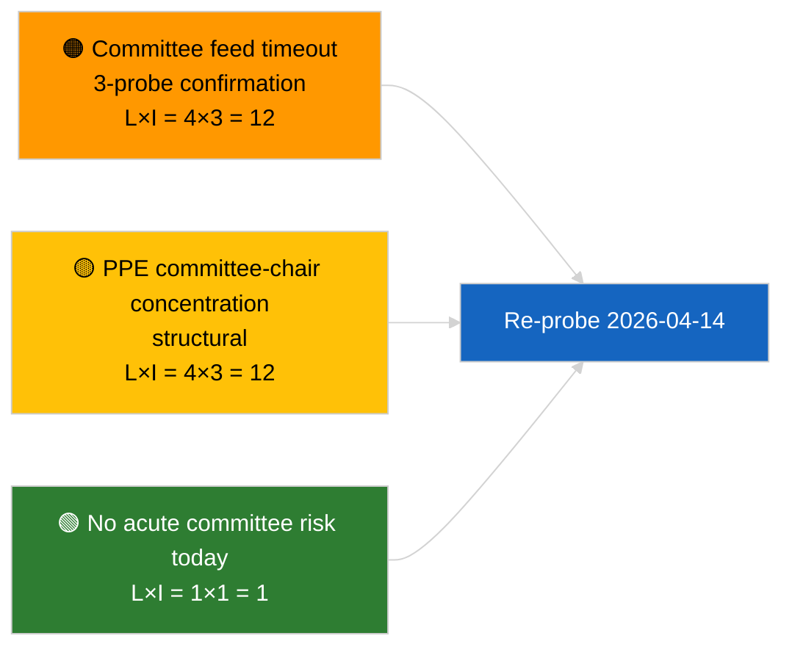

<!-- SPDX-FileCopyrightText: 2026 Hack23 AB -->
<!-- SPDX-License-Identifier: Apache-2.0 -->

# Executive Brief — Committee Reports | 2026-04-03

**Classification:** OSINT | Public Parliamentary Record
**Confidence:** 🟢 High (recess-period structural assessment, DEGRADED API state)
**Generated:** 2026-04-03T00:00:00Z (retrospective brief)
**Article Type:** Committee Reports
**Run ID:** `5568290b-7656-4c6e-ae61-b57740690541`
**Source:** European Parliament Open Data Portal

---

## 🎯 BLUF

**No committee documents indexed on 2026-04-03; the EP feed API is in confirmed DEGRADED state (see sibling `breaking-2` formal assessment).** Run `5568290b-7656-4c6e-ae61-b57740690541` returned **"Quantitative risk scoring across 0 identified political dimensions"** — zero classified actors, ROUTINE significance. `get_committee_documents_feed` is among the failed endpoints (timeout across all 3 daily probes). The substantive committee baseline therefore remains the carry-over identified in 2026-04-03/breaking-3's anti-corruption-reform cluster (ECON ECB Vice-President, TRAN/ENVI HDV emissions, JURI anti-corruption + Braun, INTA US tariff, AFET Georgia). **🟢 HIGH confidence** today's empty state is feed-degradation-driven on top of recess-week absence.

---

## 🧭 3 Decisions This Brief Supports

| # | Decision | Who Decides | Deadline | Evidence |
|:-:|----------|-------------|:--------:|----------|
| 1 | **Editorial:** SKIP committee-reports daily | Editor | +24h | Empty run + confirmed DEGRADED feeds |
| 2 | **Monitoring:** include in 2026-04-14 post-recess restoration probe | Data pipeline | 2026-04-14 | First post-Easter weekday |
| 3 | **Forward-watch:** committee work-week 13-17 April for first substantive Q2 committee reports | Analysis lead | 2026-04-13 | Pre-plenary cycle |

---

## 📰 60-Second Read

- 🔴 **No committee documents** today; `get_committee_documents_feed` timeout across 3 probes. (🟢 High)
- 🟠 **0 actors classified**; ROUTINE significance. (🟢 High)
- 🟢 **March-into-Q2 committee inventory** anchors the watch list (anti-corruption JURI, HDV TRAN/ENVI, ECB ECON, US tariff INTA, Georgia AFET). (🟢 High)
- 🟡 **Risk dimensions all "none"** today. (🟢 High)
- 🔵 **Economic context:** anti-corruption directive transposition is the dominant Q2 institutional-economic signal. (🟡 Medium)
- 🟣 **Cross-reference:** sibling `breaking-2` formalises the DEGRADED API state; `breaking-3` synthesises the reform cluster. (🟢 High)
- 🩷 **Disruption vector:** persistent committee-feed timeout could block Q2 pre-plenary intelligence. (🟡 Medium)
- ⚪ **Carry-forward:** validate restoration on 2026-04-14.

---

## 🗂️ Top Documents / Procedures Table

| Rank | EP reference | Title (short) | Significance | Confidence | Status |
|:----:|--------------|---------------|:------------:|:----------:|--------|
| 1 | — | No committee reports on 2026-04-03 | 0.0 | 🟢 HIGH | Recess + DEGRADED feeds |
| 2 | TA-10-2026-0094 | JURI — Anti-corruption directive (carry-over) | 9.0 | 🟢 HIGH | Adopted 26 March; transposition watch |
| 3 | TA-10-2026-0060 | ECON — ECB Vice-President (carry-over) | 7.5 | 🟢 HIGH | Q2 baseline |

---

## ⚠️ Risk & Threat Snapshot

| Risk | L | I | Score | Trigger | Source | Admiralty |
|------|:-:|:-:|:-----:|---------|--------|:---------:|
| Committee-feed reliability (DEGRADED) | 4 | 3 | 12 | Sustained timeout past 14 April | Sibling `breaking-2` | A1 |
| PPE committee-chair concentration | 4 | 3 | 12 | Q2 rapporteur appointments | Structural | A2 |
| Anti-corruption transposition friction | 3 | 4 | 12 | National non-compliance | TA-10-2026-0094 | A1 |

---

## 🔮 Top Forward Trigger

**Committee work-week 13-17 April 2026.** First substantive Q2 committee cycle; committee-feed restoration is operationally critical to pre-plenary intelligence in this window.

---

## 🛡️ Source Quality Assessment

- **Primary sources:** Run `5568290b-7656-4c6e-ae61-b57740690541`; sibling `breaking-2` formal EP API probe.
- **Data limitations:** `get_committee_documents_feed` timeout — independent corroboration unavailable today.
- **Confidence:** 🟢 HIGH on calendar + DEGRADED feed driver; 🟡 MEDIUM on absence-of-activity claim.

---

## 📎 Links

| Link | Path |
|------|------|
| Article | `./article.md` |
| Sibling runs | `analysis/daily/2026-04-03/breaking/`, `breaking-2/`, `breaking-3/`, `motions/`, `propositions/`, `week-ahead/` |
| Manifest | `./manifest.json` |

---

**Document Control**
- **Template:** `/analysis/templates/executive-brief.md`
- **Artifact path:** `analysis/daily/2026-04-03/committee-reports/executive-brief.md`
- **Classification:** Public
- **Retrospective generation:** Back-fill session.
