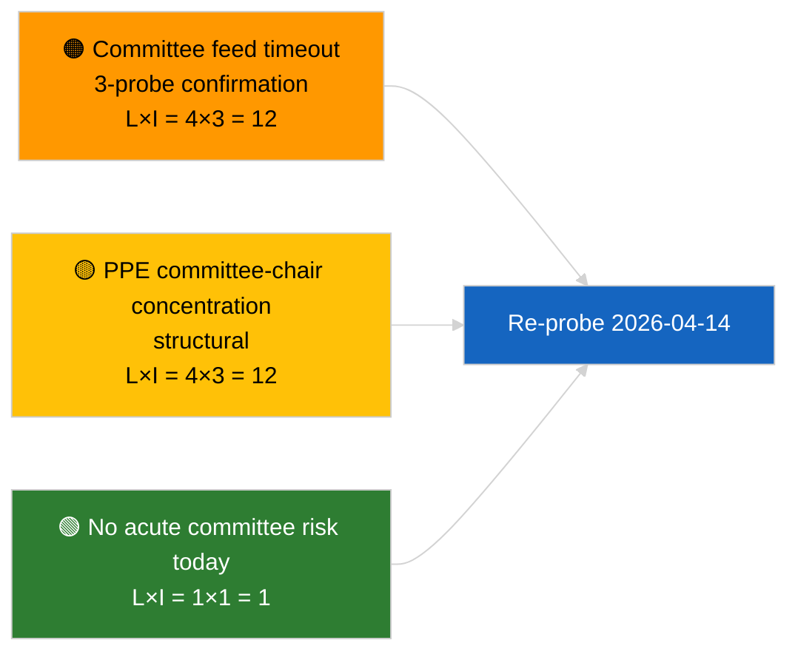

<!-- SPDX-FileCopyrightText: 2026 Hack23 AB -->
<!-- SPDX-License-Identifier: Apache-2.0 -->

# إحاطة تنفيذية — تقارير اللجان | 2026-04-03

**التصنيف:** OSINT | سجل برلماني عام
**درجة الثقة:** 🟢 مرتفعة (تقييم هيكلي خلال استراحة الجلسات، حالة API متدهورة)
**تاريخ الإصدار:** 2026-04-03T00:00:00Z (إحاطة استعادية)
**نوع المقال:** تقارير اللجان
**معرّف التشغيل:** `5568290b-7656-4c6e-ae61-b57740690541`
**المصدر:** بوابة البيانات المفتوحة للبرلمان الأوروبي

---

## 🎯 BLUF

**لم يُفهرَس أي وثيقة من وثائق اللجان بتاريخ 2026-04-03؛ تقع واجهة برمجة تطبيقات تغذية البرلمان الأوروبي في حالة متدهورة مؤكدة (راجع التقييم التكميلي `breaking-2`).** أعاد التشغيل `5568290b-7656-4c6e-ae61-b57740690541` النتيجة: **"تسجيل كمي للمخاطر عبر 0 من الأبعاد السياسية المحددة"** — صفر من الفاعلين المصنفين، أهمية اعتيادية. يندرج `get_committee_documents_feed` ضمن نقاط النهاية المعطلة (انتهاء المهلة عند جميع عمليات الاختبار الثلاث اليومية). تظل خط الأساس الجوهري للجنة بذلك مطابقاً للبيانات المُدرجة في مجموعة إصلاح مكافحة الفساد المُحددة في 2026-04-03/breaking-3 (ECON نائب رئيس البنك المركزي الأوروبي، TRAN/ENVI انبعاثات HDV، JURI مكافحة الفساد + Braun، INTA التعريفات الأمريكية، AFET جورجيا). **🟢 ثقة مرتفعة** في أن الحالة الفارغة اليوم تعود إلى تدهور التغذية مضافاً إليه انتهاء أسبوع الجلسات.

---

## 🧭 ثلاثة قرارات تدعمها هذه الإحاطة

| # | القرار | صاحب القرار | المهلة | الأدلة |
|:-:|--------|-------------|:------:|--------|
| 1 | **تحريري:** تخطي تقارير اللجان اليومية | المحرر | +24 ساعة | تشغيل فارغ + تغذيات متدهورة مؤكدة |
| 2 | **رصد:** إدراجه في جولة استعادة 2026-04-14 ما بعد الاستراحة | خط بيانات | 2026-04-14 | أول يوم عمل بعد عيد الفصح |
| 3 | **رقابة مستقبلية:** أسبوع عمل اللجنة 13–17 أبريل لأول تقارير Q2 جوهرية | رئيس التحليل | 2026-04-13 | دورة ما قبل الجلسة العامة |

---

## 📰 قراءة 60 ثانية

- 🔴 **لا وثائق للجان** اليوم؛ انتهاء مهلة `get_committee_documents_feed` عند 3 اختبارات. (🟢 مرتفعة)
- 🟠 **0 فاعل مصنف**؛ أهمية اعتيادية. (🟢 مرتفعة)
- 🟢 **جرد لجان مارس–Q2** يُرسّخ قائمة المراقبة (مكافحة الفساد JURI، HDV TRAN/ENVI، البنك المركزي الأوروبي ECON، التعريفات الأمريكية INTA، جورجيا AFET). (🟢 مرتفعة)
- 🟡 **أبعاد المخاطر جميعها "لا شيء"** اليوم. (🟢 مرتفعة)
- 🔵 **السياق الاقتصادي:** نقل توجيه مكافحة الفساد هو الإشارة المؤسسية والاقتصادية المهيمنة في Q2. (🟡 متوسطة)
- 🟣 **مرجع مقارن:** يُضفي الملخص الشقيق `breaking-2` الطابع الرسمي على حالة API المتدهورة؛ ويُصنّف `breaking-3` مجموعة الإصلاح. (🟢 مرتفعة)
- 🩷 **متجه الاضطراب:** قد يؤدي انتهاء المهلة المستمر لتغذية اللجان إلى تعطيل الاستخبارات ما قبل الجلسة العامة في Q2. (🟡 متوسطة)
- ⚪ **نقل مستمر:** التحقق من استعادة الخدمة بتاريخ 2026-04-14.

---

## 🗂️ أبرز الوثائق / الإجراءات

| الترتيب | المرجع في البرلمان | العنوان (مختصر) | الأهمية | الثقة | الحالة |
|:-------:|-------------------|-----------------|:-------:|:-----:|--------|
| 1 | — | لا تقارير للجان في 2026-04-03 | 0.0 | 🟢 مرتفعة | استراحة + تغذيات متدهورة |
| 2 | TA-10-2026-0094 | JURI — توجيه مكافحة الفساد (إدراج مستمر) | 9.0 | 🟢 مرتفعة | معتمد 26 مارس؛ مراقبة النقل |
| 3 | TA-10-2026-0060 | ECON — نائب رئيس البنك المركزي الأوروبي (إدراج مستمر) | 7.5 | 🟢 مرتفعة | خط أساس Q2 |

---

## ⚠️ لقطة المخاطر والتهديدات

| الخطر | L | I | الدرجة | المحفز | المصدر | مقياس الثقة |
|-------|:-:|:-:|:------:|--------|--------|:-----------:|
| موثوقية تغذية اللجان (متدهورة) | 4 | 3 | 12 | انتهاء مهلة مستمر بعد 14 أبريل | الشقيق `breaking-2` | A1 |
| تركّز رؤساء لجان PPE | 4 | 3 | 12 | تعيينات المقررين في Q2 | هيكلي | A2 |
| احتكاك نقل توجيه مكافحة الفساد | 3 | 4 | 12 | عدم امتثال وطني | TA-10-2026-0094 | A1 |

---

## 🔮 أبرز المحفزات المستقبلية

**أسبوع عمل اللجنة 13–17 أبريل 2026.** أول دورة جوهرية للجان في Q2؛ استعادة تغذية اللجان ضرورة تشغيلية حاسمة للاستخبارات ما قبل الجلسة العامة في هذه النافذة.

---

## 🛡️ تقييم جودة المصادر

- **المصادر الأساسية:** التشغيل `5568290b-7656-4c6e-ae61-b57740690541`؛ الشقيق `breaking-2` — اختبار رسمي لواجهة البرمجة.
- **قيود البيانات:** انتهاء مهلة `get_committee_documents_feed` — تأكيد مستقل غير متاح اليوم.
- **درجة الثقة:** 🟢 مرتفعة للتقويم + سبب التغذية المتدهورة؛ 🟡 متوسطة لادعاء غياب النشاط.

---

## 📎 الروابط

| الرابط | المسار |
|--------|--------|
| المقال | `./article.md` |
| التشغيلات الشقيقة | `analysis/daily/2026-04-03/breaking/`, `breaking-2/`, `breaking-3/`, `motions/`, `propositions/`, `week-ahead/` |
| ملف البيان | `./manifest.json` |

---

**التحكم في الوثيقة**
- **القالب:** `/analysis/templates/executive-brief.md`
- **مسار القطعة الأثرية:** `analysis/daily/2026-04-03/committee-reports/executive-brief.md`
- **التصنيف:** عام
- **إنشاء استعادي:** جلسة تعبئة استعادية.
