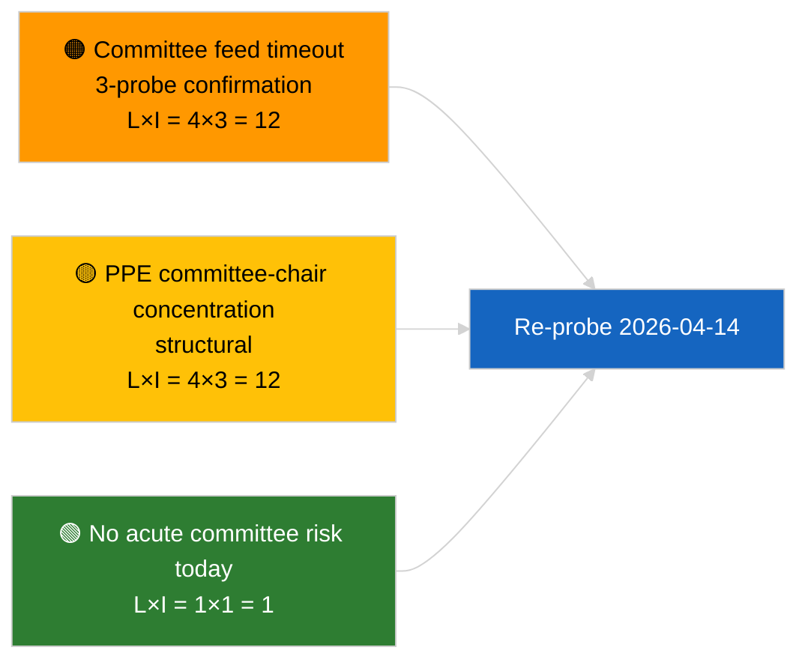

<!-- SPDX-FileCopyrightText: 2026 Hack23 AB -->
<!-- SPDX-License-Identifier: Apache-2.0 -->

# Ledelsesbriefing — Udvalgsrapporter | 2026-04-03

**Klassifikation:** OSINT | Offentlig parlamentarisk protokol
**Tillid:** 🟢 Høj (strukturel vurdering i sæsonpause, DEGRADERET API-tilstand)
**Genereret:** 2026-04-03T00:00:00Z (retrospektiv briefing)
**Artikeltype:** Udvalgsrapporter
**Kørselsnummer:** `5568290b-7656-4c6e-ae61-b57740690541`
**Kilde:** Europa-Parlamentets åbne dataportal

---

## 🎯 BLUF

**Ingen udvalgs­dokumenter blev indekseret den 2026-04-03; EP's feed-API befinder sig i bekræftet DEGRADERET tilstand (se supplerende vurdering `breaking-2`).** Kørsel `5568290b-7656-4c6e-ae61-b57740690541` returnerede **"Kvantitativ risikoscoring over 0 identificerede politiske dimensioner"** — nul klassificerede aktører, RUTINEMÆSSIG betydning. `get_committee_documents_feed` er blandt de fejlende endpoints (timeout ved alle 3 daglige sonderinger). Den substantielle udvalgsbaseline er derfor den videreføring, der blev identificeret i anti-korruptionsreformklyngen i 2026-04-03/breaking-3 (ECON ECB-næstformand, TRAN/ENVI HDV-emissioner, JURI anti-korruption + Braun, INTA US-tariffer, AFET Georgien). **🟢 HØJ tillid** til, at dagens tomme tilstand er feed-degraderingsdrevet oven på en sæsonpause-uge.

---

## 🧭 3 beslutninger som denne briefing understøtter

| # | Beslutning | Beslutningstager | Frist | Beviser |
|:-:|------------|------------------|:-----:|---------|
| 1 | **Redaktionel:** SPRING udvalgsrapporter over dagligt | Redaktør | +24h | Tom kørsel + bekræftede DEGRADEREDE feeds |
| 2 | **Overvågning:** inkluder i genoprettelsessonderingen 2026-04-14 efter sæsonpause | Datapipeline | 2026-04-14 | Første hverdag efter påske |
| 3 | **Forudvarsel:** udvalgsarbeidsuge 13.–17. april for de første substantielle Q2-udvalgsrapporter | Analysechef | 2026-04-13 | Plenaropkørsel |

---

## 📰 60-sekunders læsning

- 🔴 **Ingen udvalgsdokumenter** i dag; `get_committee_documents_feed`-timeout ved 3 sonderinger. (🟢 Høj)
- 🟠 **0 aktører klassificeret**; RUTINEMÆSSIG betydning. (🟢 Høj)
- 🟢 **Marts-til-Q2-udvalgsfortegnelse** forankrer overvågningslisten (anti-korruption JURI, HDV TRAN/ENVI, ECB ECON, US-tariffer INTA, Georgien AFET). (🟢 Høj)
- 🟡 **Risikodimensioner alle "ingen"** i dag. (🟢 Høj)
- 🔵 **Økonomisk kontekst:** anti-korruptionsdirektivets gennemførelse er det dominerende institutionelle og økonomiske signal i Q2. (🟡 Middel)
- 🟣 **Krydsreference:** søsterbriefing `breaking-2` formaliserer den DEGRADEREDE API-tilstand; `breaking-3` syntetiserer reformklyngen. (🟢 Høj)
- 🩷 **Forstyrrelsesvektoren:** vedvarende udvalgs-feed-timeout kan blokere Q2 preplenary-efterretning. (🟡 Middel)
- ⚪ **Videreføring:** valider genoprettelse den 2026-04-14.

---

## 🗂️ Vigtigste dokumenter / procedurer

| Rang | EP-reference | Titel (kort) | Betydning | Tillid | Status |
|:----:|--------------|--------------|:---------:|:------:|--------|
| 1 | — | Ingen udvalgsrapporter den 2026-04-03 | 0,0 | 🟢 HØJ | Sæsonpause + DEGRADEREDE feeds |
| 2 | TA-10-2026-0094 | JURI — Anti-korruptionsdirektiv (videreføring) | 9,0 | 🟢 HØJ | Vedtaget 26. marts; gennemførelsesovervågning |
| 3 | TA-10-2026-0060 | ECON — ECB-næstformand (videreføring) | 7,5 | 🟢 HØJ | Q2-baseline |

---

## ⚠️ Risiko- og trusselsoverblik

| Risiko | L | I | Score | Trigger | Kilde | Admiralitet |
|--------|:-:|:-:|:-----:|---------|-------|:-----------:|
| Udvalgs-feed-pålidelighed (DEGRADERET) | 4 | 3 | 12 | Vedvarende timeout efter 14. april | Søster `breaking-2` | A1 |
| PPE-udvalgsformandskoncentration | 4 | 3 | 12 | Q2-ordførerudnævnelser | Strukturel | A2 |
| Friktion ved anti-korruptionsdirektivets gennemførelse | 3 | 4 | 12 | National manglende overholdelse | TA-10-2026-0094 | A1 |

---

## 🔮 Vigtigste fremadrettede trigger

**Udvalgsarbeidsuge 13.–17. april 2026.** Første substantielle Q2-udvalgsperiode; genoprettelse af udvalgs-feed er operativt afgørende for preplenary-efterretning i dette vindue.

---

## 🛡️ Vurdering af kildekvalitet

- **Primærkilder:** Kørsel `5568290b-7656-4c6e-ae61-b57740690541`; søster `breaking-2` — formel EP API-sondering.
- **Databegrænsninger:** `get_committee_documents_feed`-timeout — uafhængig bekræftelse ikke tilgængelig i dag.
- **Tillid:** 🟢 HØJ for kalender + DEGRADERET feed-driver; 🟡 MIDDEL for fraværs-påstanden.

---

## 📎 Links

| Link | Sti |
|------|-----|
| Artikel | `./article.md` |
| Søsterkørsler | `analysis/daily/2026-04-03/breaking/`, `breaking-2/`, `breaking-3/`, `motions/`, `propositions/`, `week-ahead/` |
| Manifest | `./manifest.json` |

---

**Dokumentkontrol**
- **Skabelon:** `/analysis/templates/executive-brief.md`
- **Artefaktsti:** `analysis/daily/2026-04-03/committee-reports/executive-brief.md`
- **Klassifikation:** Offentlig
- **Retrospektiv generering:** Tilbagefyldningssession.
