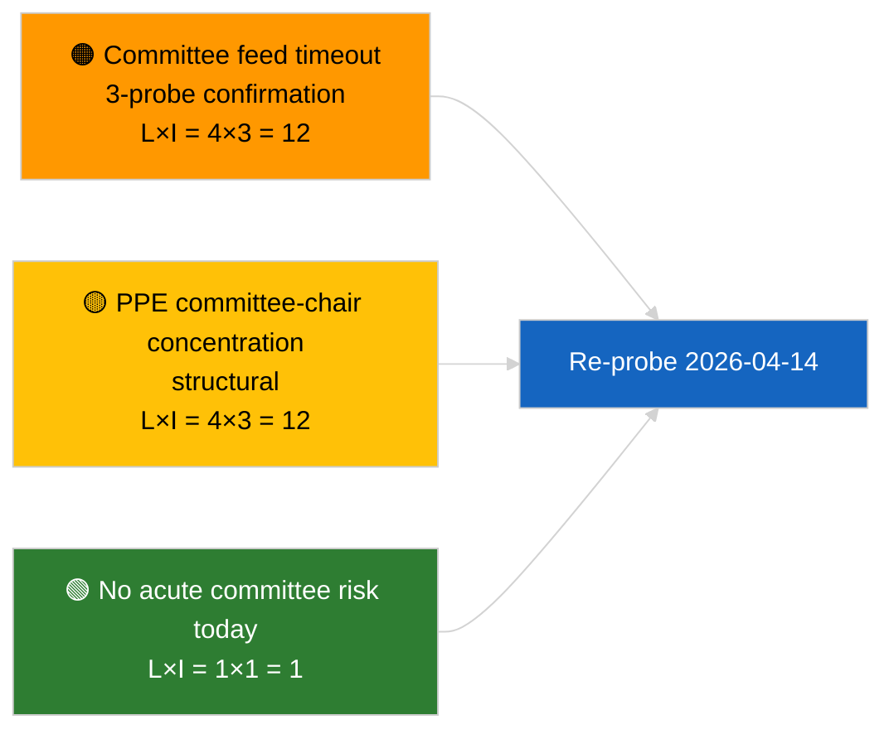

<!-- SPDX-FileCopyrightText: 2026 Hack23 AB -->
<!-- SPDX-License-Identifier: Apache-2.0 -->

# Exekutiv-Briefing — Ausschussberichte | 2026-04-03

**Einstufung:** OSINT | Öffentliche Parlamentarische Aufzeichnung
**Vertrauensgrad:** 🟢 Hoch (Strukturbewertung während der Sitzungspause, EINGESCHRÄNKTER API-Status)
**Erstellt:** 2026-04-03T00:00:00Z (retrospektiver Bericht)
**Artikeltyp:** Ausschussberichte
**Lauf-ID:** `5568290b-7656-4c6e-ae61-b57740690541`
**Quelle:** Europäisches Parlament — Open-Data-Portal

---

## 🎯 BLUF

**Am 2026-04-03 wurden keine Ausschussdokumente indexiert; die EP-Feed-API befindet sich in einem bestätigten EINGESCHRÄNKTEN Zustand (siehe ergänzende Bewertung `breaking-2`).** Lauf `5568290b-7656-4c6e-ae61-b57740690541` lieferte **„Quantitative Risikobewertung über 0 identifizierte politische Dimensionen"** — keine klassifizierten Akteure, Bedeutung ROUTINEMÄSSIG. `get_committee_documents_feed` zählt zu den ausgefallenen Endpunkten (Timeout bei allen 3 täglichen Tests). Die sachliche Ausschusskennzahl entspricht daher der aus dem Anti-Korruptions-Reformcluster in 2026-04-03/breaking-3 (ECON EZB-Vizepräsident, TRAN/ENVI HDV-Emissionen, JURI Anti-Korruption + Braun, INTA US-Zölle, AFET Georgien). **🟢 HOHE Vertrauenssicherheit**, dass der heutige Leerstand durch Feed-Degradierung in der Sitzungspause begründet ist.

---

## 🧭 3 Entscheidungen, die dieses Briefing unterstützt

| # | Entscheidung | Entscheidungsträger | Frist | Belege |
|:-:|--------------|---------------------|:-----:|--------|
| 1 | **Redaktionell:** Ausschussberichte täglich ÜBERSPRINGEN | Redakteur | +24h | Leerer Lauf + bestätigte EINGESCHRÄNKTE Feeds |
| 2 | **Überwachung:** in Wiederherstellungs-Probe nach Sitzungspause vom 2026-04-14 aufnehmen | Datenpipeline | 2026-04-14 | Erster Werktag nach Ostern |
| 3 | **Vorschau:** Ausschussarbeitswoche 13.–17. April für erste substanzielle Q2-Ausschussberichte beobachten | Analyseleitung | 2026-04-13 | Vor-Plenarzyklus |

---

## 📰 60-Sekunden-Lektüre

- 🔴 **Keine Ausschussdokumente** heute; `get_committee_documents_feed`-Timeout bei 3 Tests. (🟢 Hoch)
- 🟠 **0 Akteure klassifiziert**; Bedeutung ROUTINEMÄSSIG. (🟢 Hoch)
- 🟢 **Ausschuss-Inventar März/Q2-Übergang** verankert die Beobachtungsliste (Anti-Korruption JURI, HDV TRAN/ENVI, EZB ECON, US-Zölle INTA, Georgien AFET). (🟢 Hoch)
- 🟡 **Risikodimensionen alle „keine"** heute. (🟢 Hoch)
- 🔵 **Wirtschaftlicher Kontext:** die Umsetzung der Anti-Korruptionsrichtlinie ist das dominierende institutionell-wirtschaftliche Signal in Q2. (🟡 Mittel)
- 🟣 **Querverweis:** Geschwister-Brief `breaking-2` formalisiert den EINGESCHRÄNKTEN API-Status; `breaking-3` synthetisiert den Reformcluster. (🟢 Hoch)
- 🩷 **Störvektor:** anhaltender Ausschuss-Feed-Timeout könnte Q2-Vor-Plenar-Aufklärung blockieren. (🟡 Mittel)
- ⚪ **Übertrag:** Wiederherstellung am 2026-04-14 validieren.

---

## 🗂️ Wichtigste Dokumente / Verfahren

| Rang | EP-Referenz | Titel (kurz) | Bedeutung | Vertrauensgrad | Status |
|:----:|-------------|--------------|:---------:|:--------------:|--------|
| 1 | — | Keine Ausschussberichte am 2026-04-03 | 0,0 | 🟢 HOCH | Sitzungspause + EINGESCHRÄNKTE Feeds |
| 2 | TA-10-2026-0094 | JURI — Anti-Korruptionsrichtlinie (Übertrag) | 9,0 | 🟢 HOCH | Angenommen 26. März; Umsetzungs-Monitoring |
| 3 | TA-10-2026-0060 | ECON — EZB-Vizepräsident (Übertrag) | 7,5 | 🟢 HOCH | Q2-Basiswert |

---

## ⚠️ Risiko- und Bedrohungsübersicht

| Risiko | L | I | Wert | Auslöser | Quelle | Admiralität |
|--------|:-:|:-:|:----:|----------|--------|:-----------:|
| Zuverlässigkeit des Ausschuss-Feeds (EINGESCHRÄNKT) | 4 | 3 | 12 | Anhaltender Timeout nach dem 14. April | Geschwister `breaking-2` | A1 |
| PPE-Ausschussvorsitzenden-Konzentration | 4 | 3 | 12 | Q2-Berichterstatter-Ernennungen | Strukturell | A2 |
| Reibung bei der Umsetzung der Anti-Korruptionsrichtlinie | 3 | 4 | 12 | Nationale Nicht-Konformität | TA-10-2026-0094 | A1 |

---

## 🔮 Wichtigster Vorwärts-Trigger

**Ausschussarbeitswoche 13.–17. April 2026.** Erster substanzieller Q2-Ausschusszyklus; die Wiederherstellung des Ausschuss-Feeds ist operativ kritisch für die Vor-Plenar-Aufklärung in diesem Zeitfenster.

---

## 🛡️ Bewertung der Quellenqualität

- **Primärquellen:** Lauf `5568290b-7656-4c6e-ae61-b57740690541`; Geschwister-Brief `breaking-2` — formeller EP-API-Test.
- **Datenbeschränkungen:** `get_committee_documents_feed`-Timeout — unabhängige Bestätigung heute nicht verfügbar.
- **Vertrauensgrad:** 🟢 HOCH für Kalender + EINGESCHRÄNKTEN Feed-Treiber; 🟡 MITTEL für die Nicht-Aktivitäts-Behauptung.

---

## 📎 Links

| Link | Pfad |
|------|------|
| Artikel | `./article.md` |
| Geschwister-Läufe | `analysis/daily/2026-04-03/breaking/`, `breaking-2/`, `breaking-3/`, `motions/`, `propositions/`, `week-ahead/` |
| Manifest | `./manifest.json` |

---

**Dokumentenkontrolle**
- **Vorlage:** `/analysis/templates/executive-brief.md`
- **Artefaktpfad:** `analysis/daily/2026-04-03/committee-reports/executive-brief.md`
- **Einstufung:** Öffentlich
- **Retrospektive Generierung:** Nachträgliche Befüllung.
