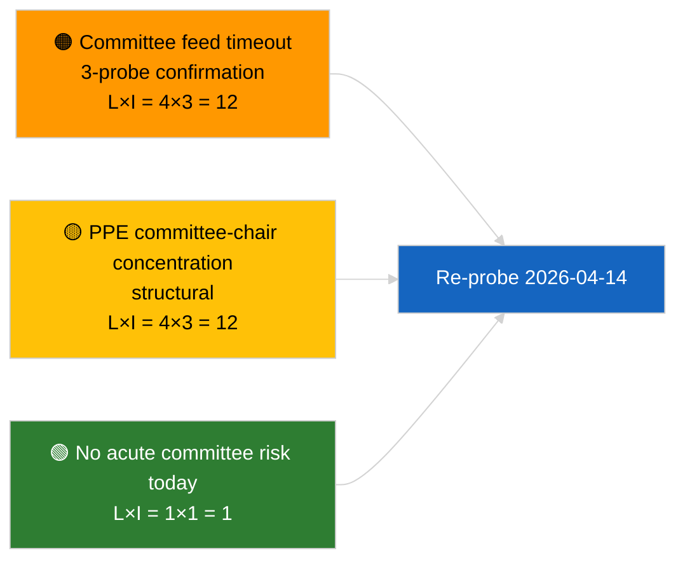

<!-- SPDX-FileCopyrightText: 2026 Hack23 AB -->
<!-- SPDX-License-Identifier: Apache-2.0 -->

# Resumen ejecutivo — Informes de comisión | 2026-04-03

**Clasificación:** OSINT | Registro parlamentario público
**Nivel de confianza:** 🟢 Alto (evaluación estructural en período de receso, estado API DEGRADADO)
**Generado:** 2026-04-03T00:00:00Z (resumen retrospectivo)
**Tipo de artículo:** Informes de comisión
**ID de ejecución:** `5568290b-7656-4c6e-ae61-b57740690541`
**Fuente:** Portal de datos abiertos del Parlamento Europeo

---

## 🎯 BLUF

**No se indexaron documentos de comisión el 2026-04-03; la API de feed del PE se encuentra en estado DEGRADADO confirmado (véase la evaluación complementaria `breaking-2`).** La ejecución `5568290b-7656-4c6e-ae61-b57740690541` devolvió **«Puntuación cuantitativa de riesgo en 0 dimensiones políticas identificadas»** — cero actores clasificados, importancia RUTINARIA. `get_committee_documents_feed` se encuentra entre los puntos finales con fallos (tiempo de espera agotado en los 3 sondeos diarios). La base de comisión sustantiva corresponde, por lo tanto, a los datos arrastrados del clúster de reforma anticorrupción identificado en 2026-04-03/breaking-3 (ECON Vicepresidente del BCE, TRAN/ENVI emisiones HDV, JURI anticorrupción + Braun, INTA aranceles estadounidenses, AFET Georgia). **🟢 ALTA confianza** en que el estado vacío de hoy se debe a la degradación del feed en combinación con la semana de receso.

---

## 🧭 3 decisiones que apoya este resumen

| # | Decisión | Responsable | Plazo | Evidencias |
|:-:|----------|-------------|:-----:|------------|
| 1 | **Editorial:** OMITIR informes de comisión diarios | Editor | +24h | Ejecución vacía + feeds DEGRADADOS confirmados |
| 2 | **Seguimiento:** incluir en el sondeo de restauración del 2026-04-14 tras el receso | Pipeline de datos | 2026-04-14 | Primer día hábil después de Semana Santa |
| 3 | **Vigilancia prospectiva:** semana de trabajo en comisión del 13 al 17 de abril para los primeros informes Q2 sustantivos | Responsable de análisis | 2026-04-13 | Ciclo pré-plenario |

---

## 📰 Lectura en 60 segundos

- 🔴 **Sin documentos de comisión** hoy; `get_committee_documents_feed` tiempo de espera agotado en 3 sondeos. (🟢 Alto)
- 🟠 **0 actores clasificados**; importancia RUTINARIA. (🟢 Alto)
- 🟢 **Inventario de comisiones marzo–Q2** ancla la lista de vigilancia (anticorrupción JURI, HDV TRAN/ENVI, BCE ECON, aranceles estadounidenses INTA, Georgia AFET). (🟢 Alto)
- 🟡 **Dimensiones de riesgo todas «ninguna»** hoy. (🟢 Alto)
- 🔵 **Contexto económico:** la transposición de la directiva anticorrupción es la señal institucional y económica dominante del Q2. (🟡 Medio)
- 🟣 **Referencia cruzada:** el resumen hermano `breaking-2` formaliza el estado DEGRADADO de la API; `breaking-3` sintetiza el clúster de reformas. (🟢 Alto)
- 🩷 **Vector de perturbación:** el tiempo de espera persistente del feed de comisiones podría bloquear la inteligencia pre-plenaria del Q2. (🟡 Medio)
- ⚪ **Traslado:** validar la restauración el 2026-04-14.

---

## 🗂️ Principales documentos / procedimientos

| Rango | Referencia PE | Título (breve) | Importancia | Confianza | Estado |
|:-----:|---------------|----------------|:-----------:|:---------:|--------|
| 1 | — | Sin informes de comisión el 2026-04-03 | 0,0 | 🟢 ALTO | Receso + feeds DEGRADADOS |
| 2 | TA-10-2026-0094 | JURI — Directiva anticorrupción (arrastre) | 9,0 | 🟢 ALTO | Adoptada el 26 de marzo; seguimiento de transposición |
| 3 | TA-10-2026-0060 | ECON — Vicepresidente del BCE (arrastre) | 7,5 | 🟢 ALTO | Línea de base Q2 |

---

## ⚠️ Panorama de riesgos y amenazas

| Riesgo | L | I | Puntuación | Desencadenante | Fuente | Almirantazgo |
|--------|:-:|:-:|:----------:|----------------|--------|:------------:|
| Fiabilidad del feed de comisiones (DEGRADADO) | 4 | 3 | 12 | Tiempo de espera persistente tras el 14 de abril | Hermano `breaking-2` | A1 |
| Concentración de presidencias de comisión del PPE | 4 | 3 | 12 | Designaciones de ponentes Q2 | Estructural | A2 |
| Fricción en la transposición de la directiva anticorrupción | 3 | 4 | 12 | Incumplimiento nacional | TA-10-2026-0094 | A1 |

---

## 🔮 Principal detonante prospectivo

**Semana de trabajo en comisión del 13 al 17 de abril de 2026.** Primer ciclo de comisiones Q2 sustantivo; la restauración del feed de comisiones es operativamente crítica para la inteligencia pre-plenaria en esta ventana.

---

## 🛡️ Evaluación de la calidad de las fuentes

- **Fuentes primarias:** Ejecución `5568290b-7656-4c6e-ae61-b57740690541`; hermano `breaking-2` — sondeo formal de la API del PE.
- **Limitaciones de datos:** `get_committee_documents_feed` tiempo de espera agotado — corroboración independiente no disponible hoy.
- **Confianza:** 🟢 ALTO para calendario + controlador de feed DEGRADADO; 🟡 MEDIO para la afirmación de ausencia de actividad.

---

## 📎 Enlaces

| Enlace | Ruta |
|--------|------|
| Artículo | `./article.md` |
| Ejecuciones hermanas | `analysis/daily/2026-04-03/breaking/`, `breaking-2/`, `breaking-3/`, `motions/`, `propositions/`, `week-ahead/` |
| Manifiesto | `./manifest.json` |

---

**Control de documento**
- **Plantilla:** `/analysis/templates/executive-brief.md`
- **Ruta del artefacto:** `analysis/daily/2026-04-03/committee-reports/executive-brief.md`
- **Clasificación:** Público
- **Generación retrospectiva:** Sesión de relleno retrospectivo.
