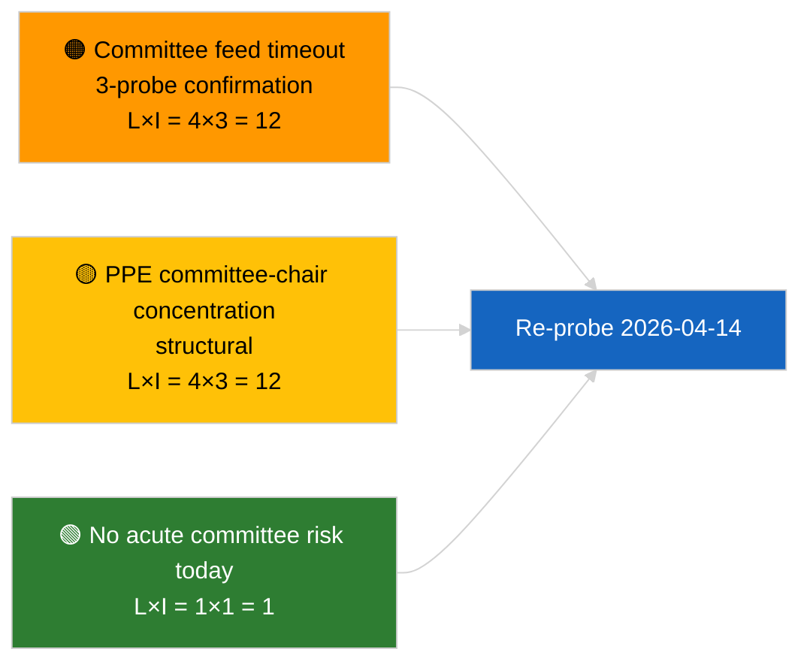

<!-- SPDX-FileCopyrightText: 2026 Hack23 AB -->
<!-- SPDX-License-Identifier: Apache-2.0 -->

# Johtotiivistelmä — Valiokunnan raportit | 2026-04-03

**Luokittelu:** OSINT | Julkinen parlamentaarinen pöytäkirja
**Luotettavuus:** 🟢 Korkea (rakenteellinen arviointi istuntotauolla, HEIKENTYNYT API-tila)
**Luotu:** 2026-04-03T00:00:00Z (retrospektiivinen tiivistelmä)
**Artikkelityyppi:** Valiokunnan raportit
**Ajon tunnus:** `5568290b-7656-4c6e-ae61-b57740690541`
**Lähde:** Euroopan parlamentin avoin dataporttali

---

## 🎯 BLUF

**2026-04-03 ei indeksoitu yhtään valiokuntadokumenttia; EP:n feed-API on vahvistetussa HEIKENTYNEESSÄ tilassa (katso täydentävä arviointi `breaking-2`).** Ajo `5568290b-7656-4c6e-ae61-b57740690541` palautti **"Kvantitatiivinen risikopistytys 0 tunnistetun poliittisen ulottuvuuden yli"** — nolla luokiteltua toimijaa, RUTIINILUONTEINEN merkitys. `get_committee_documents_feed` kuuluu viallisiin päätepisteisiin (aikakatkos kaikissa 3 päivittäisessä luotauksessa). Valiokuntaperustaso vastaa siksi 2026-04-03/breaking-3:n korruption vastaisen uudistusklusterin ylläpitotietoja (ECON EKP:n varapuheenjohtaja, TRAN/ENVI HDV-päästöt, JURI korruption vastustaminen + Braun, INTA Yhdysvaltain tullit, AFET Georgia). **🟢 KORKEA luotettavuus**, että tämänpäiväinen tyhjä tila johtuu feed-heikentymisestä yhdistettynä istuntotaukoon.

---

## 🧭 3 päätöstä, joita tämä tiivistelmä tukee

| # | Päätös | Päättäjä | Määräaika | Todisteet |
|:-:|--------|----------|:---------:|-----------|
| 1 | **Toimituksellinen:** OHITA valiokunnan raportit päivittäin | Toimittaja | +24h | Tyhjä ajo + vahvistetut HEIKENTYNEET syötteet |
| 2 | **Seuranta:** sisällytä 2026-04-14 istuntotauon jälkeiseen palautumisluotaukseen | Dataliukuhihna | 2026-04-14 | Ensimmäinen arkipäivä pääsiäisen jälkeen |
| 3 | **Ennakkovaroitus:** valiokuntien työviikko 13.–17. huhtikuuta ensimmäisiä substantiivisia Q2:n valiokuntaraportteja varten | Analyysivastaava | 2026-04-13 | Täysistuntoa edeltävä sykli |

---

## 📰 60 sekunnin luenta

- 🔴 **Ei valiokuntadokumentteja** tänään; `get_committee_documents_feed`-aikakatkos 3 luotauksessa. (🟢 Korkea)
- 🟠 **0 toimijaa luokiteltu**; RUTIINILUONTEINEN merkitys. (🟢 Korkea)
- 🟢 **Maalis–Q2-valiokuntainventtaari** ankkuroi tarkkailulistan (korruption vastustaminen JURI, HDV TRAN/ENVI, EKP ECON, Yhdysvaltain tullit INTA, Georgia AFET). (🟢 Korkea)
- 🟡 **Riskiulottuvuudet kaikki "ei mitään"** tänään. (🟢 Korkea)
- 🔵 **Taloudellinen konteksti:** korruption vastaisen direktiivin täytäntöönpano on Q2:n hallinnollis-taloudellinen pääsignaali. (🟡 Keskitaso)
- 🟣 **Ristiviittaus:** sisartiivistelmä `breaking-2` formalisoi HEIKENTYNEEN API-tilan; `breaking-3` syntetisoi uudistusklusterin. (🟢 Korkea)
- 🩷 **Häiriövektori:** jatkuva valiokunnan syötteen aikakatkos voi estää Q2:n täysistuntoa edeltävän tiedustelun. (🟡 Keskitaso)
- ⚪ **Siirto eteenpäin:** vahvista palautuminen 2026-04-14.

---

## 🗂️ Tärkeimmät asiakirjat / menettelyt

| Sijoitus | EP-viite | Otsikko (lyhyt) | Merkitys | Luotettavuus | Tila |
|:--------:|----------|-----------------|:--------:|:------------:|------|
| 1 | — | Ei valiokuntaraportteja 2026-04-03 | 0,0 | 🟢 KORKEA | Istuntotauko + HEIKENTYNEET syötteet |
| 2 | TA-10-2026-0094 | JURI — Korruption vastainen direktiivi (siirto) | 9,0 | 🟢 KORKEA | Hyväksytty 26. maaliskuuta; täytäntöönpanon seuranta |
| 3 | TA-10-2026-0060 | ECON — EKP:n varapuheenjohtaja (siirto) | 7,5 | 🟢 KORKEA | Q2-perustaso |

---

## ⚠️ Riski- ja uhkatilannekatsaus

| Riski | L | I | Pisteet | Laukaisija | Lähde | Amiraliteetti |
|-------|:-:|:-:|:-------:|------------|-------|:-------------:|
| Valiokunnan syötteen luotettavuus (HEIKENTYNYT) | 4 | 3 | 12 | Jatkuva aikakatkos 14. huhtikuuta jälkeen | Sisartiivistelmä `breaking-2` | A1 |
| PPE:n valiokuntapuheenjohtajakonsentraatio | 4 | 3 | 12 | Q2:n esittelijänimitykset | Rakenteellinen | A2 |
| Korruption vastaisen direktiivin täytäntöönpanon kitka | 3 | 4 | 12 | Kansallinen noudattamattomuus | TA-10-2026-0094 | A1 |

---

## 🔮 Tärkein ennakkolaukaisija

**Valiokuntien työviikko 13.–17. huhtikuuta 2026.** Ensimmäinen substantiivinen Q2-valiokuntasykli; valiokunnan syötteen palautuminen on operatiivisesti kriittistä täysistuntoa edeltävälle tiedustelulle tässä aikaikkunassa.

---

## 🛡️ Lähteiden laadun arviointi

- **Ensisijaiset lähteet:** Ajo `5568290b-7656-4c6e-ae61-b57740690541`; sisartiivistelmä `breaking-2` — virallinen EP-API-luotaus.
- **Tietorajoitukset:** `get_committee_documents_feed`-aikakatkos — riippumaton vahvistus ei saatavilla tänään.
- **Luotettavuus:** 🟢 KORKEA kalenterille + HEIKENTYNEEN syötteen ajurille; 🟡 KESKITASO toiminnan puuttumisväitteelle.

---

## 📎 Linkit

| Linkki | Polku |
|--------|-------|
| Artikkeli | `./article.md` |
| Sisarajot | `analysis/daily/2026-04-03/breaking/`, `breaking-2/`, `breaking-3/`, `motions/`, `propositions/`, `week-ahead/` |
| Manifest | `./manifest.json` |

---

**Asiakirjavalvonta**
- **Malli:** `/analysis/templates/executive-brief.md`
- **Artefaktipolku:** `analysis/daily/2026-04-03/committee-reports/executive-brief.md`
- **Luokittelu:** Julkinen
- **Retrospektiivinen luonti:** Takautuvat täydennykset.
