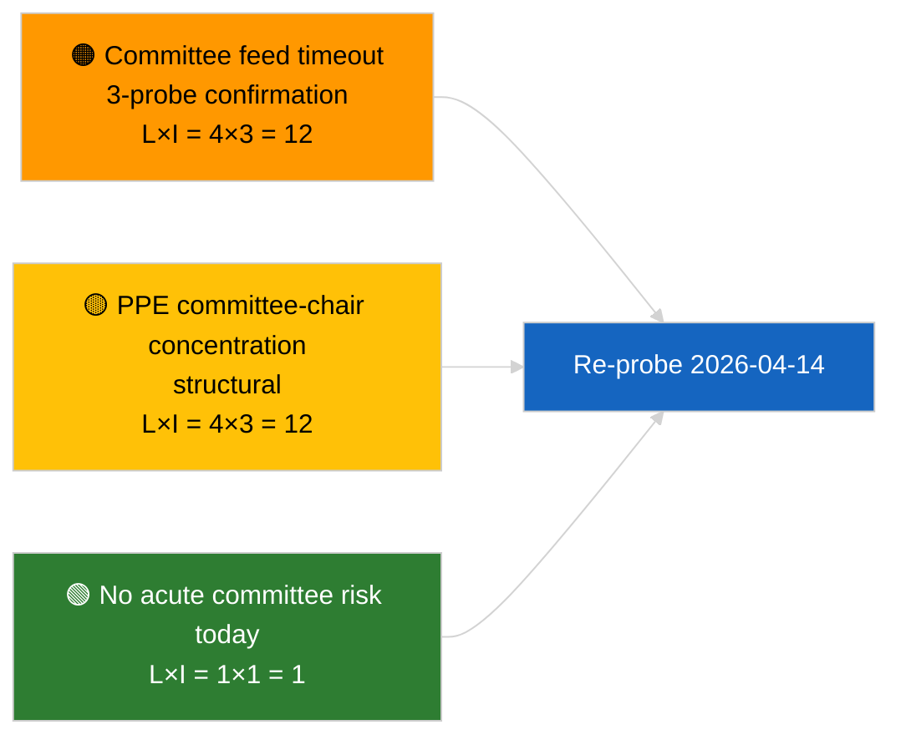

<!-- SPDX-FileCopyrightText: 2026 Hack23 AB -->
<!-- SPDX-License-Identifier: Apache-2.0 -->

# Note de synthèse exécutive — Rapports de commission | 2026-04-03

**Classification :** OSINT | Document parlementaire public
**Niveau de confiance :** 🟢 Élevé (évaluation structurelle en période de suspension, état API DÉGRADÉ)
**Générée :** 2026-04-03T00:00:00Z (synthèse rétrospective)
**Type d'article :** Rapports de commission
**ID d'exécution :** `5568290b-7656-4c6e-ae61-b57740690541`
**Source :** Portail de données ouvertes du Parlement européen

---

## 🎯 BLUF

**Aucun document de commission n'a été indexé le 2026-04-03 ; l'API de flux du PE est en état DÉGRADÉ confirmé (voir évaluation complémentaire `breaking-2`).** L'exécution `5568290b-7656-4c6e-ae61-b57740690541` a renvoyé **« Notation quantitative du risque sur 0 dimensions politiques identifiées »** — zéro acteur classifié, importance ROUTINIÈRE. `get_committee_documents_feed` est parmi les points de terminaison défaillants (délai d'expiration sur les 3 sondages quotidiens). La référence substantielle des commissions correspond donc aux données reportées du cluster de réforme anti-corruption identifié dans 2026-04-03/breaking-3 (ECON Vice-président BCE, TRAN/ENVI émissions HDV, JURI anti-corruption + Braun, INTA tarifs américains, AFET Géorgie). **🟢 HAUTE confiance** que l'état vide d'aujourd'hui est dû à la dégradation des flux en plus de la semaine de suspension.

---

## 🧭 3 décisions soutenues par cette synthèse

| # | Décision | Décideur | Délai | Preuves |
|:-:|----------|----------|:-----:|---------|
| 1 | **Éditorial :** IGNORER les rapports de commission quotidiens | Éditeur | +24h | Exécution vide + flux DÉGRADÉS confirmés |
| 2 | **Surveillance :** inclure dans le sondage de rétablissement du 2026-04-14 après suspension | Pipeline de données | 2026-04-14 | Premier jour ouvrable après Pâques |
| 3 | **Veille prospective :** semaine de travail en commission du 13 au 17 avril pour les premiers rapports Q2 substantiels | Responsable analyse | 2026-04-13 | Cycle pré-plénier |

---

## 📰 Lecture en 60 secondes

- 🔴 **Aucun document de commission** aujourd'hui ; `get_committee_documents_feed` délai d'expiration sur 3 sondages. (🟢 Élevé)
- 🟠 **0 acteur classifié** ; importance ROUTINIÈRE. (🟢 Élevé)
- 🟢 **Inventaire des commissions mars–Q2** ancre la liste de veille (anti-corruption JURI, HDV TRAN/ENVI, BCE ECON, tarifs américains INTA, Géorgie AFET). (🟢 Élevé)
- 🟡 **Dimensions de risque toutes « aucune »** aujourd'hui. (🟢 Élevé)
- 🔵 **Contexte économique :** la transposition de la directive anti-corruption est le signal institutionnel et économique dominant du Q2. (🟡 Moyen)
- 🟣 **Référence croisée :** la synthèse sœur `breaking-2` formalise l'état DÉGRADÉ de l'API ; `breaking-3` synthétise le cluster de réformes. (🟢 Élevé)
- 🩷 **Vecteur de perturbation :** le délai d'expiration persistant du flux de commissions pourrait bloquer le renseignement pré-plénier Q2. (🟡 Moyen)
- ⚪ **Report :** valider le rétablissement le 2026-04-14.

---

## 🗂️ Principaux documents / procédures

| Rang | Référence PE | Titre (abrégé) | Importance | Confiance | Statut |
|:----:|--------------|----------------|:----------:|:---------:|--------|
| 1 | — | Aucun rapport de commission le 2026-04-03 | 0,0 | 🟢 ÉLEVÉ | Suspension + flux DÉGRADÉS |
| 2 | TA-10-2026-0094 | JURI — Directive anti-corruption (report) | 9,0 | 🟢 ÉLEVÉ | Adoptée le 26 mars ; suivi de transposition |
| 3 | TA-10-2026-0060 | ECON — Vice-président BCE (report) | 7,5 | 🟢 ÉLEVÉ | Référence Q2 |

---

## ⚠️ Tableau de bord des risques et menaces

| Risque | L | I | Score | Déclencheur | Source | Amirauté |
|--------|:-:|:-:|:-----:|-------------|--------|:--------:|
| Fiabilité du flux de commissions (DÉGRADÉ) | 4 | 3 | 12 | Délai persistant après le 14 avril | Sœur `breaking-2` | A1 |
| Concentration des présidences de commission PPE | 4 | 3 | 12 | Désignations de rapporteurs Q2 | Structurel | A2 |
| Friction dans la transposition de la directive anti-corruption | 3 | 4 | 12 | Non-conformité nationale | TA-10-2026-0094 | A1 |

---

## 🔮 Principal déclencheur prospectif

**Semaine de travail en commission du 13 au 17 avril 2026.** Premier cycle de commissions Q2 substantiel ; le rétablissement du flux de commissions est opérationnellement critique pour le renseignement pré-plénier dans cette fenêtre.

---

## 🛡️ Évaluation de la qualité des sources

- **Sources primaires :** Exécution `5568290b-7656-4c6e-ae61-b57740690541` ; sœur `breaking-2` — sondage formel de l'API du PE.
- **Limites des données :** `get_committee_documents_feed` délai d'expiration — corroboration indépendante non disponible aujourd'hui.
- **Confiance :** 🟢 ÉLEVÉ pour calendrier + pilote de flux DÉGRADÉ ; 🟡 MOYEN pour l'affirmation d'absence d'activité.

---

## 📎 Liens

| Lien | Chemin |
|------|--------|
| Article | `./article.md` |
| Exécutions sœurs | `analysis/daily/2026-04-03/breaking/`, `breaking-2/`, `breaking-3/`, `motions/`, `propositions/`, `week-ahead/` |
| Manifeste | `./manifest.json` |

---

**Contrôle documentaire**
- **Modèle :** `/analysis/templates/executive-brief.md`
- **Chemin de l'artefact :** `analysis/daily/2026-04-03/committee-reports/executive-brief.md`
- **Classification :** Public
- **Génération rétrospective :** Session de remplissage rétrospectif.
